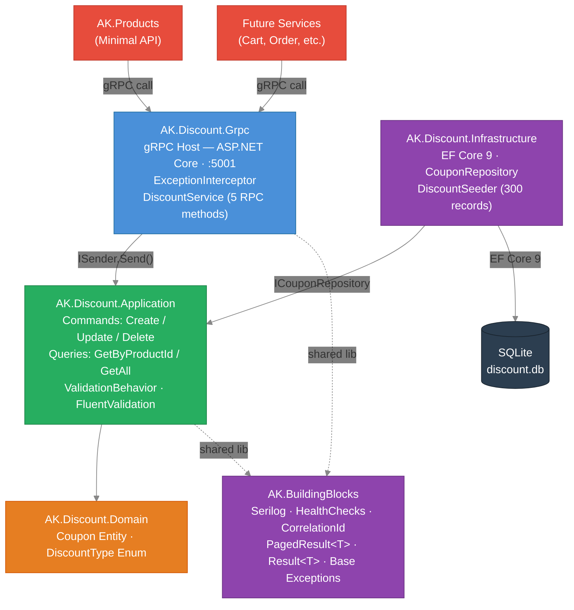
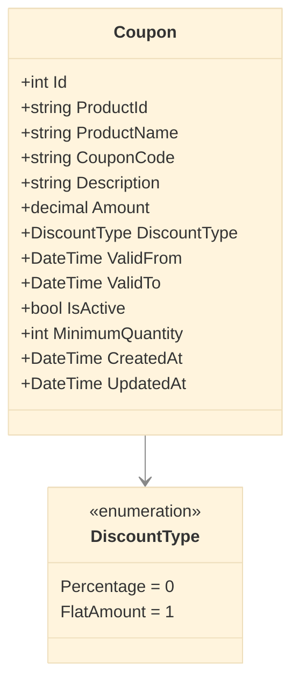
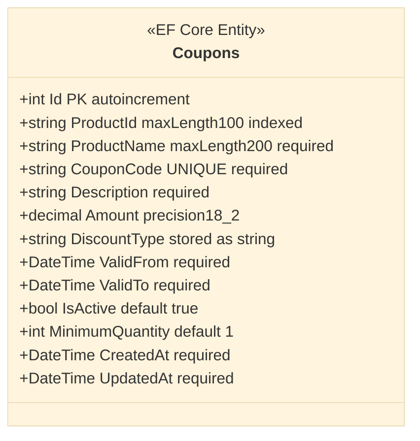
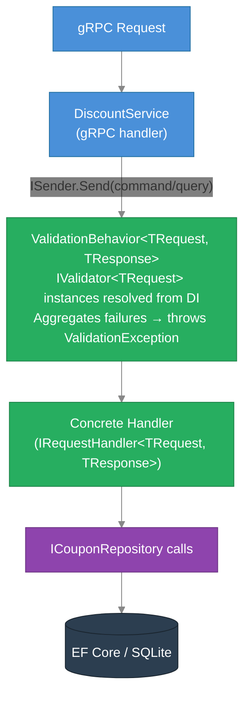
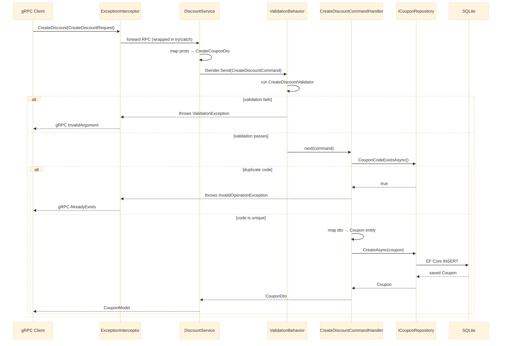

# AK.Discount Microservice — Technical Design Document

## Table of Contents
1. [Overview](#1-overview)
2. [Functional Requirements](#2-functional-requirements)
3. [Non-Functional Requirements](#3-non-functional-requirements)
4. [High-Level Architecture](#4-high-level-architecture)
5. [Solution Structure](#5-solution-structure)
6. [AK.BuildingBlocks — Shared Library](#6-akbuildingblocks--shared-library)
7. [Domain Layer Design](#7-domain-layer-design)
8. [Application Layer Design](#8-application-layer-design)
9. [Infrastructure Layer Design](#9-infrastructure-layer-design)
10. [gRPC Service Layer Design](#10-grpc-service-layer-design)
11. [Data Model](#11-data-model)
12. [CQRS & MediatR Pipeline](#12-cqrs--mediatr-pipeline)
13. [gRPC Contract (Protobuf)](#13-grpc-contract-protobuf)
14. [Error Handling & Interceptors](#14-error-handling--interceptors)
15. [Seed Data](#15-seed-data)
16. [Testing Strategy](#16-testing-strategy)
17. [Configuration & Deployment](#17-configuration--deployment)
18. [Docker & Container Orchestration](#18-docker--container-orchestration)
19. [Design Decisions & Trade-offs](#19-design-decisions--trade-offs)

---

## 1. Overview

**AK.Discount** is a .NET 9 gRPC microservice responsible for managing product discount coupons within the AntKart e-commerce platform. It is designed for internal service-to-service communication — other microservices (such as AK.Products or a future Shopping Cart service) call it over gRPC to retrieve active discounts for any given product.

| Attribute        | Value                                                  |
|------------------|--------------------------------------------------------|
| Framework        | .NET 9 (ASP.NET Core gRPC)                            |
| Architecture     | Clean Architecture                                     |
| Database         | SQLite (via EF Core 9, code-first with migrations)    |
| Communication    | gRPC (Protocol Buffers v3)                             |
| Pattern Stack    | CQRS, MediatR, FluentValidation, Repository            |
| Cross-Cutting    | AK.BuildingBlocks (Serilog, health checks, middleware) |
| Namespace Root   | `AK.Discount`                                          |
| Default Port     | HTTP `5001` / HTTPS `7001` (dev); `8080` in container |

---

## 2. Functional Requirements

| ID    | Requirement                                                                 |
|-------|-----------------------------------------------------------------------------|
| FR-01 | Retrieve an active discount coupon by Product ID (SKU)                      |
| FR-02 | Create a new discount coupon for a product                                  |
| FR-03 | Update an existing coupon (amount, validity dates, status, etc.)            |
| FR-04 | Delete a coupon by its numeric ID                                           |
| FR-05 | List all coupons with pagination                                            |
| FR-06 | Enforce unique coupon codes across all records                              |
| FR-07 | Support two discount types: Percentage and FlatAmount                       |
| FR-08 | Validate all create/update inputs before persisting                         |
| FR-09 | Auto-seed 300 discount records (one per product SKU) on first startup       |
| FR-10 | Expose a health-check endpoint for liveness probing                         |

---

## 3. Non-Functional Requirements

| ID     | Requirement                                                              |
|--------|--------------------------------------------------------------------------|
| NFR-01 | gRPC response time < 50 ms for single-coupon lookup under normal load    |
| NFR-02 | SQLite WAL mode ensures safe concurrent reads during seeding             |
| NFR-03 | EF Core migrations run automatically on startup (zero-touch deployment)  |
| NFR-04 | Structured JSON logs written to console and rolling daily files          |
| NFR-05 | Correlation ID propagated across all log entries via Serilog context     |
| NFR-06 | All business logic covered by unit tests (no integration test dependency)|
| NFR-07 | Container-ready: runs under Docker with persistent volume for SQLite DB  |

---

## 4. High-Level Architecture



---

## 5. Solution Structure

```
AntKart/
├── src/
│   ├── AK.BuildingBlocks/
│   │   └── AK.BuildingBlocks/
│   │       ├── Common/          PagedResult.cs, Result.cs
│   │       ├── Exceptions/      NotFoundException.cs, ValidationException.cs
│   │       ├── HealthChecks/    HealthCheckExtensions.cs
│   │       ├── Logging/         SerilogExtensions.cs
│   │       └── Middleware/      CorrelationIdMiddleware.cs
│   │
│   ├── AK.Discount.Domain/
│   │   └── AK.Discount.Domain/
│   │       ├── Entities/        Coupon.cs
│   │       └── Enums/           DiscountType.cs
│   │
│   ├── AK.Discount.Application/
│   │   └── AK.Discount.Application/
│   │       ├── Behaviors/       (ValidationBehavior moved to AK.BuildingBlocks.Behaviors)
│   │       ├── Commands/
│   │       │   ├── CreateDiscount/
│   │       │   ├── UpdateDiscount/
│   │       │   └── DeleteDiscount/
│   │       ├── Common/          CouponMapper.cs
│   │       ├── DTOs/            CouponDto, CreateCouponDto, UpdateCouponDto
│   │       ├── Extensions/      ServiceCollectionExtensions.cs
│   │       ├── Interfaces/      ICouponRepository.cs
│   │       ├── Queries/
│   │       │   ├── GetDiscountByProductId/
│   │       │   └── GetAllDiscounts/
│   │       └── Validators/      CreateCouponValidator.cs
│   │
│   ├── AK.Discount.Infrastructure/
│   │   └── AK.Discount.Infrastructure/
│   │       ├── Extensions/      ServiceCollectionExtensions.cs, WebApplicationExtensions.cs
│   │       ├── Migrations/      InitialCreate (auto-generated)
│   │       ├── Persistence/
│   │       │   ├── DiscountContext.cs
│   │       │   └── Repositories/  CouponRepository.cs
│   │       └── Seeders/         DiscountSeeder.cs
│   │
│   └── AK.Discount.Grpc/
│       └── AK.Discount.Grpc/
│           ├── Interceptors/    ExceptionInterceptor.cs
│           ├── Protos/          discount.proto
│           ├── Properties/      launchSettings.json
│           ├── Services/        DiscountService.cs, CouponGrpcMapper.cs
│           ├── Program.cs
│           ├── Dockerfile
│           ├── appsettings.json
│           └── appsettings.Development.json
│
└── tests/
    └── AK.Discount.Tests/
        └── AK.Discount.Tests/
            ├── Application/Commands/   Create, Update, Delete handler tests
            ├── Application/Queries/    GetByProductId handler tests
            ├── Common/                 TestDataFactory.cs
            └── Domain/                 CouponTests.cs
```

---

## 6. AK.BuildingBlocks — Shared Library

AK.BuildingBlocks is a horizontal shared library used by all AntKart microservices to avoid duplication of cross-cutting infrastructure code.

### 6.1 Common Abstractions

| Type | Purpose |
|------|---------|
| `PagedResult<T>` | Canonical paged response with `TotalCount`, `TotalPages`, `HasNextPage`, `HasPreviousPage` |
| `Result<T>` | Railway-oriented success/failure wrapper avoiding exception-as-flow-control |

### 6.2 Exceptions

| Exception | HTTP / gRPC Equivalent |
|-----------|------------------------|
| `NotFoundException` | 404 / `StatusCode.NotFound` |
| `ValidationException` | 400 / `StatusCode.InvalidArgument` |

### 6.3 Logging

`SerilogExtensions.AddSerilogLogging()` configures Serilog with:
- Console sink (human-readable template with timestamp, level, source context)
- Rolling file sink (`logs/log-{date}.txt`, 7-day retention)
- Minimum level: `Information`; Microsoft/gRPC namespaces suppressed at `Warning`
- Enrichers: `FromLogContext()` (picks up CorrelationId pushed by middleware)

### 6.4 Health Checks

`HealthCheckExtensions.AddDefaultHealthChecks()` registers a self-liveness check.  
`MapDefaultHealthChecks()` maps it to `GET /health`.

### 6.5 Correlation ID Middleware

`CorrelationIdMiddleware` reads `X-Correlation-Id` from the request header (or generates a new GUID), echoes it in the response, and pushes it into Serilog's `LogContext` so every log line within that request carries the correlation ID.

---

## 7. Domain Layer Design

The Domain layer is deliberately thin — it contains the entity and its supporting enum, with no external dependencies. This keeps the core business model stable and testable in isolation.

### 7.1 Coupon Entity



### 7.2 DiscountType Enum

```csharp
public enum DiscountType
{
    Percentage = 0,   // Amount represents % off (e.g. 15 = 15%)
    FlatAmount = 1    // Amount represents currency deducted (e.g. 100 = $100 off)
}
```

### 7.3 Design Rationale

- **No domain events or rich behaviour** — discounts are simple data objects managed by an admin/back-office service. Applying a discount to an order is the responsibility of the consuming service, not the Discount service.
- **ProductName denormalization** — avoids gRPC cross-service calls at read time; discount records carry enough context to display in a UI without querying AK.Products.
- **No value objects** — the domain is intentionally anemic here. Introducing `Money` or `DateRange` value objects would add complexity without meaningfully increasing correctness for a CRUD-oriented discount store.

---

## 8. Application Layer Design

### 8.1 CQRS Structure

| Type | Class | Returns |
|------|-------|---------|
| Command | `CreateDiscountCommand` | `CouponDto` |
| Command | `UpdateDiscountCommand` | `CouponDto` |
| Command | `DeleteDiscountCommand` | `bool` |
| Query | `GetDiscountByProductIdQuery` | `CouponDto?` |
| Query | `GetAllDiscountsQuery` | `PagedResult<CouponDto>` |

### 8.2 DTOs

| DTO | Fields | Used By |
|-----|--------|---------|
| `CouponDto` | All Coupon fields as record | All handler outputs |
| `CreateCouponDto` | ProductId, ProductName, CouponCode, Description, Amount, DiscountType, ValidFrom, ValidTo, MinimumQuantity | Create command |
| `UpdateCouponDto` | ProductName, Description, Amount, DiscountType, ValidFrom, ValidTo, IsActive, MinimumQuantity | Update command |

### 8.3 Repository Interface

```csharp
public interface ICouponRepository
{
    Task<Coupon?> GetByProductIdAsync(string productId, CancellationToken ct);
    Task<Coupon?> GetByIdAsync(int id, CancellationToken ct);
    Task<IReadOnlyList<Coupon>> GetAllAsync(int page, int pageSize, CancellationToken ct);
    Task<int> GetTotalCountAsync(CancellationToken ct);
    Task<Coupon> CreateAsync(Coupon coupon, CancellationToken ct);
    Task<Coupon> UpdateAsync(Coupon coupon, CancellationToken ct);
    Task<bool> DeleteAsync(int id, CancellationToken ct);
    Task<bool> CouponCodeExistsAsync(string couponCode, CancellationToken ct);
}
```

### 8.4 Validation Rules (CreateDiscountValidator)

| Field | Rule |
|-------|------|
| `ProductId` | NotEmpty |
| `ProductName` | NotEmpty, MaxLength 200 |
| `CouponCode` | NotEmpty, MaxLength 50 |
| `Amount` | GreaterThan(0) |
| `DiscountType` | Must be `"Percentage"` or `"FlatAmount"` |
| `ValidTo` | GreaterThan(`ValidFrom`) |

### 8.5 Handler Business Rules

- **CreateDiscount**: Checks `CouponCodeExistsAsync` before inserting — throws `InvalidOperationException` on duplicate code (maps to gRPC `AlreadyExists`).
- **UpdateDiscount**: Fetches by ID first — throws `KeyNotFoundException` if missing (maps to gRPC `NotFound`).
- **DeleteDiscount**: Same — throws `KeyNotFoundException` if ID not found before attempting delete.
- **GetDiscountByProductId**: Returns only records where `IsActive = true`.

---

## 9. Infrastructure Layer Design

### 9.1 EF Core Configuration (DiscountContext)



SQLite is configured via `Data Source=discount.db`. On startup, `database.MigrateAsync()` runs all pending migrations automatically.

### 9.2 CouponRepository

Wraps `DiscountContext` and implements `ICouponRepository`. All methods are async and accept `CancellationToken`. Pagination uses EF Core's `Skip`/`Take` with `OrderBy(c => c.Id)` for stable ordering.

`GetByProductIdAsync` filters by `IsActive = true` — only live discounts are returned to callers.

### 9.3 Migration Strategy

| Migration | Description |
|-----------|-------------|
| `InitialCreate` | Creates `Coupons` table, unique index on `CouponCode`, index on `ProductId` |

Future schema changes: add a new EF migration via `dotnet ef migrations add <Name>` — no manual SQL required.

### 9.4 DiscountSeeder

Seeds 300 discount records on first startup (idempotent — skips if count ≥ 300). One coupon per product SKU, matching the 300 SKUs generated by AK.Products seeder:

| Group | Gender Code | Categories (10) | Products per Category | Total |
|-------|-------------|-----------------|----------------------|-------|
| Men   | `MEN`       | SHIR TROU JEAN BLAZ KURT JACK SWEA TSHI SHOR SUIT | 10 | 100 |
| Women | `WOM`       | SARE KURT DRES LEGG TOPS SALW BLOU SKIR PALA DUNG | 10 | 100 |
| Kids  | `KID`       | TSHI SHOR FROC JEAN SHIR DRES LEGG JACK SWEA TRAC | 10 | 100 |

For each SKU (e.g. `MEN-SHIR-001`):
- **DiscountType**: randomly Percentage (5–35%) or FlatAmount ($50–$250), seeded with `Random(42)` for determinism
- **ValidFrom**: random date within last 30 days
- **ValidTo**: random date 30–180 days ahead
- **CouponCode**: `DISC-{SKU}-{random 3-digit}` (guaranteed unique via deterministic seed)

---

## 10. gRPC Service Layer Design

### 10.1 Service Registration

```csharp
builder.Services.AddGrpc(opts => opts.Interceptors.Add<ExceptionInterceptor>());
builder.Services.AddApplication();
builder.Services.AddDiscountInfrastructure(configuration);
builder.Services.AddDefaultHealthChecks();
```

### 10.2 DiscountService — RPC Method Mapping

| RPC Method | MediatR Request | Success Response | Error Cases |
|------------|-----------------|------------------|-------------|
| `GetDiscount` | `GetDiscountByProductIdQuery` | `CouponModel` | `NotFound` if no active coupon |
| `CreateDiscount` | `CreateDiscountCommand` | `CouponModel` | `InvalidArgument` (validation), `AlreadyExists` (duplicate code) |
| `UpdateDiscount` | `UpdateDiscountCommand` | `CouponModel` | `InvalidArgument`, `NotFound` |
| `DeleteDiscount` | `DeleteDiscountCommand` | `DeleteDiscountResponse { success }` | `NotFound` |
| `GetAllDiscounts` | `GetAllDiscountsQuery` | `GetAllDiscountsResponse` | — |

### 10.3 CouponGrpcMapper

Maps `CouponDto` → `CouponModel` (the Protobuf message). `ValidFrom`/`ValidTo` are serialized as ISO 8601 strings (`"O"` format) to avoid Protobuf timestamp complexity while remaining unambiguous.

---

## 11. Data Model

### 11.1 Coupons Table (SQLite)

| Column | Type | Constraints |
|--------|------|-------------|
| `Id` | INTEGER | PK, AUTOINCREMENT |
| `ProductId` | TEXT(100) | NOT NULL, Indexed |
| `ProductName` | TEXT(200) | NOT NULL |
| `CouponCode` | TEXT(50) | NOT NULL, UNIQUE |
| `Description` | TEXT | NOT NULL |
| `Amount` | TEXT (decimal 18,2) | NOT NULL |
| `DiscountType` | TEXT | NOT NULL (`"Percentage"` or `"FlatAmount"`) |
| `ValidFrom` | TEXT (ISO 8601) | NOT NULL |
| `ValidTo` | TEXT (ISO 8601) | NOT NULL |
| `IsActive` | INTEGER (bool) | NOT NULL, default 1 |
| `MinimumQuantity` | INTEGER | NOT NULL, default 1 |
| `CreatedAt` | TEXT (ISO 8601) | NOT NULL |
| `UpdatedAt` | TEXT (ISO 8601) | NOT NULL |

> SQLite stores all data as TEXT/INTEGER/REAL — EF Core handles the CLR type mapping transparently.

### 11.2 Indexes

| Index | Columns | Type |
|-------|---------|------|
| `PK_Coupons` | `Id` | Primary key |
| `IX_Coupons_CouponCode` | `CouponCode` | Unique |
| `IX_Coupons_ProductId` | `ProductId` | Non-unique |

---

## 12. CQRS & MediatR Pipeline



### Request Lifecycle (CreateDiscount example)



---

## 13. gRPC Contract (Protobuf)

**File:** `Protos/discount.proto`  
**Package:** `discount`  
**C# Namespace:** `AK.Discount.Grpc`

### Service Definition

```proto
service DiscountProtoService {
    rpc GetDiscount        (GetDiscountRequest)    returns (CouponModel);
    rpc CreateDiscount     (CreateDiscountRequest) returns (CouponModel);
    rpc UpdateDiscount     (UpdateDiscountRequest) returns (CouponModel);
    rpc DeleteDiscount     (DeleteDiscountRequest) returns (DeleteDiscountResponse);
    rpc GetAllDiscounts    (GetAllDiscountsRequest) returns (GetAllDiscountsResponse);
}
```

### Message Definitions

| Message | Key Fields |
|---------|-----------|
| `CouponModel` | id, product_id, product_name, coupon_code, description, amount (double), discount_type, valid_from, valid_to, is_active, minimum_quantity |
| `GetDiscountRequest` | product_id |
| `CreateDiscountRequest` | coupon (CouponModel) |
| `UpdateDiscountRequest` | id, coupon (CouponModel) |
| `DeleteDiscountRequest` | id |
| `DeleteDiscountResponse` | success (bool) |
| `GetAllDiscountsRequest` | page, page_size |
| `GetAllDiscountsResponse` | coupons (repeated CouponModel), total_count |

### Testing the gRPC Service

Use [grpcurl](https://github.com/fullstorydev/grpcurl) or Postman gRPC:

```bash
# List all discounts
grpcurl -plaintext -d '{"page":1,"page_size":10}' localhost:5001 discount.DiscountProtoService/GetAllDiscounts

# Get discount for a product
grpcurl -plaintext -d '{"product_id":"MEN-SHIR-001"}' localhost:5001 discount.DiscountProtoService/GetDiscount

# Create a discount
grpcurl -plaintext -d '{
  "coupon": {
    "product_id": "MEN-SHIR-099",
    "product_name": "Test Shirt",
    "coupon_code": "SUMMER25",
    "description": "Summer sale 25% off",
    "amount": 25.0,
    "discount_type": "Percentage",
    "valid_from": "2026-04-01T00:00:00Z",
    "valid_to": "2026-08-31T23:59:59Z",
    "minimum_quantity": 1
  }
}' localhost:5001 discount.DiscountProtoService/CreateDiscount
```

---

## 14. Error Handling & Interceptors

### ExceptionInterceptor

Wraps every unary RPC in a try/catch and maps .NET exceptions to gRPC `Status` codes:

| .NET Exception | gRPC Status Code | Description |
|----------------|-----------------|-------------|
| `FluentValidation.ValidationException` | `InvalidArgument` | Input validation failures — message contains all errors joined by `"; "` |
| `KeyNotFoundException` | `NotFound` | Entity with given ID/ProductId does not exist |
| `InvalidOperationException` | `AlreadyExists` | Duplicate coupon code or other business rule conflict |
| `Exception` (catch-all) | `Internal` | Unhandled errors — details logged, generic message returned to client |

All interceptor activity is logged via Serilog with appropriate levels (`Warning` for expected errors, `Error` for unhandled exceptions).

---

## 15. Seed Data

On first startup (`MigrateAndSeedAsync` in `Program.cs`):

1. `database.MigrateAsync()` — applies any pending EF Core migrations
2. `DiscountSeeder.SeedAsync()` — checks current row count; if < 300, inserts all 300 records

**Seeding is idempotent** — safe to call on every restart.

### Sample Seed Records

| ProductId | CouponCode | DiscountType | Amount | ValidFrom | ValidTo |
|-----------|------------|--------------|--------|-----------|---------|
| MEN-SHIR-001 | DISC-MEN-SHIR-001-412 | Percentage | 18.50% | 2026-03-25 | 2026-09-15 |
| WOM-DRES-005 | DISC-WOM-DRES-005-731 | FlatAmount | $125.00 | 2026-04-01 | 2026-07-10 |
| KID-FROC-003 | DISC-KID-FROC-003-289 | Percentage | 22.75% | 2026-03-18 | 2026-08-22 |

---

## 16. Testing Strategy

### 16.1 Test Project

**AK.Discount.Tests** — XUnit 2.x, Moq, FluentAssertions.  
All tests are pure unit tests using `Mock<ICouponRepository>`. No database, no gRPC host, no network.

### 16.2 Test Coverage

| Area | Tests | Scenarios |
|------|-------|-----------|
| Domain | `CouponTests` (18) | Default values, Percentage type, FlatAmount type, property validation, edge cases |
| Query — GetByProductId | 2 | Existing product → CouponDto; missing → null |
| Query — GetAllDiscounts | 2 | Paged results; empty collection |
| Command — CreateDiscount | 2 | Happy path; duplicate coupon code → InvalidOperationException |
| Command — UpdateDiscount | 2 | Existing ID → updated DTO; missing ID → KeyNotFoundException |
| Command — DeleteDiscount | 2 | Existing ID → true; missing ID → KeyNotFoundException |
| Validators — CreateCouponValidator | 10 | All field rules: ProductId, ProductName, CouponCode, Amount, DiscountType, ValidTo |
| Validators — UpdateCouponValidator | 5 | All update field rules |
| Validators — DeleteDiscountValidator | 2 | Id required, invalid Id |
| DTO Mapping — CouponMapper | 8 | Domain → DTO mapping, all fields, null handling |
| **Total** | **53** | |

### 16.3 Running Tests

```bash
# All tests in solution (Products + Discount)
dotnet test

# Discount tests only
dotnet test tests/AK.Discount.Tests/AK.Discount.Tests/AK.Discount.Tests.csproj
```

### 16.4 Test Data Factory

`TestDataFactory` provides:
- `CreateCoupon(productId, id)` — builds a valid in-memory `Coupon` entity
- `CreateCouponDto(productId)` — builds a valid `CreateCouponDto`
- `UpdateCouponDto()` — builds a valid `UpdateCouponDto`

---

## 17. Configuration & Deployment

### 17.1 appsettings.json

```json
{
  "ConnectionStrings": {
    "DiscountDb": "Data Source=discount.db"
  },
  "Logging": {
    "LogLevel": { "Default": "Information", "Microsoft.AspNetCore": "Warning" }
  }
}
```

### 17.2 Environment Variables (Docker / Production)

| Variable | Example | Purpose |
|----------|---------|---------|
| `ASPNETCORE_ENVIRONMENT` | `Production` | Controls which appsettings overlay loads |
| `ConnectionStrings__DiscountDb` | `Data Source=/app/data/discount.db` | SQLite file path in container |

### 17.3 Launch Profiles

| Profile | URL |
|---------|-----|
| `http` (dev) | `http://localhost:5001` |
| `https` (dev) | `https://localhost:7001` |
| Docker | `http://0.0.0.0:8080` |

### 17.4 Key Dependencies

| Package | Version | Purpose |
|---------|---------|---------|
| `Grpc.AspNetCore` | 2.x | gRPC server hosting |
| `MediatR` | 12.4.1 | CQRS mediator |
| `FluentValidation` | 11.x | Input validation |
| `Microsoft.EntityFrameworkCore.Sqlite` | 9.x | ORM + SQLite provider |
| `Serilog.AspNetCore` | 7.x | Structured logging |

---

## 18. Docker & Container Orchestration

### 18.1 Dockerfile (AK.Discount.Grpc)

Multi-stage build using `mcr.microsoft.com/dotnet/sdk:9.0` for compile and `mcr.microsoft.com/dotnet/aspnet:9.0` for runtime. Final image exposes port `8080`.

```
Stage 1 — build:   restore → build (Release)
Stage 2 — publish: dotnet publish -c Release
Stage 3 — final:   aspnet runtime + published output
```

The Dockerfile adds `RUN mkdir -p /app/data && chown -R $APP_UID:$APP_UID /app/data` before `USER $APP_UID` to ensure the non-root user can write the SQLite database to the volume-mounted `/app/data` directory.

### 18.2 docker-compose Services

| Service | Image | Port (host→container) | Storage |
|---------|-------|-----------------------|---------|
| `antkart-mongodb` | `mongo:latest` | 27017→27017 | `mongodb_data` volume |
| `antkart-products-api` | `antkart-products-api` (built) | 8080→8080 | — |
| `antkart-discount-grpc` | `antkart-discount-grpc` (built) | 8081→8080 | `discount_data` volume (SQLite) |

### 18.3 Running with Docker Compose

```bash
# Build and start all services
docker-compose up --build

# Start in background
docker-compose up --build -d

# View logs
docker-compose logs -f ak-discount-grpc

# Stop and remove containers
docker-compose down

# Stop and remove containers + volumes (clears DB data)
docker-compose down -v
```

### 18.4 Development Override

`docker-compose.override.yml` remaps ports for local development:
- Products API: `localhost:5077`
- Discount gRPC: `localhost:5001`
- MongoDB: `localhost:27017`

---

## 19. Design Decisions & Trade-offs

| Decision | Choice | Rationale | Trade-off |
|----------|--------|-----------|-----------|
| **Transport** | gRPC (not REST) | Binary protocol, strongly typed contract, ideal for internal service-to-service calls | Not browser-callable without gRPC-Web proxy; requires Protobuf tooling |
| **Database** | SQLite | Zero infrastructure footprint, file-based, adequate for discount catalogue volume | Not suitable for high-concurrency writes; single-writer limitation |
| **ORM** | EF Core (code-first) | Auto migrations, LINQ queries, type safety | Slight overhead vs raw SQL; migration management needed |
| **Architecture** | Clean Architecture (lighter than full DDD) | Discounts are CRUD-oriented; full DDD with aggregates/domain events would be over-engineered | Less structure than AK.Products — appropriate given simpler domain |
| **No Unit of Work** | Repository only | Single-aggregate operations; no cross-aggregate transactions needed in discount domain | If multi-entity transactions were needed, UoW would be added |
| **ProductName denormalization** | Stored in Coupon | Avoids cross-service gRPC call on every read | Coupon ProductName can drift if product name changes in AK.Products |
| **DiscountType as string in DB** | `HasConversion<string>()` | Human-readable in SQLite browser; no enum integer mapping issues on schema changes | Slightly more storage than integer; requires consistent casing |
| **CouponCode uppercased on write** | In handler | Prevents case-sensitivity bugs (`SAVE10` vs `save10`) | Client must be aware codes are always uppercase |
| **MigrateAsync on startup** | Yes | Zero-touch deployment, no manual migration step in CI/CD | Slight startup latency; not suitable for blue-green with simultaneous old+new code |
