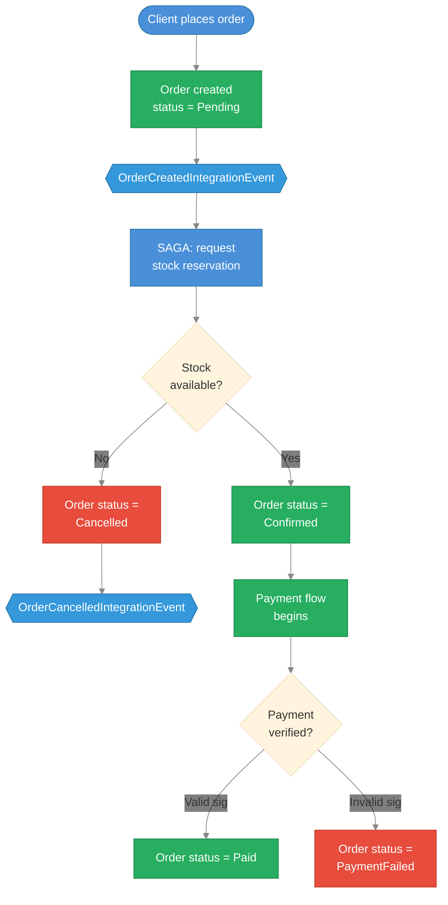

# AntKart — Integration Tests Technical Design

## Overview

`AK.IntegrationTests` exercises the SAGA choreography, event bus flows, payment event routing, and notification consumer dispatch using **MassTransit's in-memory test harness** — no RabbitMQ, no database, no running host. All 35 tests run in ~12 seconds.

---

## Project Structure

```
AK.IntegrationTests/
├── AK.IntegrationTests.csproj
├── Common/
│   ├── TestHarnessFactory.cs            ← ServiceProvider builders (5 factory methods)
│   ├── IntegrationTestData.cs           ← Event factory helpers (enriched event signatures)
│   └── PaymentInitiatedAuditConsumer.cs ← Test-only no-op consumer for audit assertions
├── Sagas/
│   ├── OrderSagaHappyPathTests.cs       ← 3 happy-path saga tests
│   └── OrderSagaSadPathTests.cs         ← 3 sad-path saga tests
├── EventBus/
│   ├── EventBusFlowTests.cs             ← 4 order event bus flow tests
│   └── PaymentEventBusFlowTests.cs      ← 7 payment event bus flow tests
├── Payments/
│   ├── PaymentFlowHappyPathTests.cs     ← 5 payment happy-path tests
│   └── PaymentFlowSadPathTests.cs       ← 6 payment sad-path tests
└── Notification/
    └── NotificationConsumerTests.cs     ← 7 notification consumer tests
```

---

## Key Packages

| Package | Version | Purpose |
|---------|---------|---------|
| MassTransit | 8.3.6 | Test harness (built in) |
| xunit | 2.9.3 | Test runner |
| FluentAssertions | 7.0.0 | Assertions |
| Moq | 4.20.72 | Mocks (IUnitOfWork for payment consumers) |

---

## TestHarnessFactory

```csharp
// Saga-only harness — for state machine tests
TestHarnessFactory.CreateWithSaga();

// Order harness — saga + order consumers + cart consumer
TestHarnessFactory.CreateWithConsumers();

// Payment harness — saga + payment consumers (mocked IUnitOfWork)
TestHarnessFactory.CreateWithPaymentConsumers();

// Full harness — all of the above combined
TestHarnessFactory.CreateWithAllConsumers();

// Notification harness — all 6 notification consumers (mocked IMediator)
TestHarnessFactory.CreateWithNotificationConsumers(Mock<IMediator> mediatorMock);
```

`CreateWithPaymentConsumers()` and `CreateWithAllConsumers()` register a Moq `IUnitOfWork` whose `GetByIdAsync` returns `null`. Payment consumers handle this with `if (order is null) return`, allowing bus routing to be verified without a real database.

`CreateWithNotificationConsumers()` accepts a pre-configured `Mock<IMediator>` so tests can verify `SendNotificationCommand` was dispatched with the correct channel and template type. The mediator mock is registered as `IMediator` in the scoped DI container.

---

## Test Coverage

### Order Saga — Happy Path (3 tests)

| Test | Verifies |
|------|---------|
| `OrderCreated_TransitionsTo_StockPending` | Saga created, `OrderCreatedIntegrationEvent` consumed |
| `StockReserved_TransitionsTo_Confirmed_AndPublishesOrderConfirmedEvent` | Saga publishes `OrderConfirmedIntegrationEvent` on stock success |
| `FullHappyPath_OrderCreated_StockReserved_OrderConfirmed` | End-to-end happy path; `OrderCancelledIntegrationEvent` not published |

### Order Saga — Sad Path (3 tests)

| Test | Verifies |
|------|---------|
| `StockReservationFailed_TransitionsTo_Cancelled_AndPublishesOrderCancelledEvent` | Saga publishes cancellation on stock failure |
| `StockReservationFailed_DoesNotPublishOrderConfirmedEvent` | Confirmed event never published in sad path |
| `FullSadPath_OrderCreated_StockFailed_OrderCancelled` | Cancellation reason propagated correctly |

### Order Event Bus Flow (4 tests)

| Test | Verifies |
|------|---------|
| `OrderCreatedEvent_IsConsumedBySaga` | Basic consumption |
| `StockReservedEvent_IsConsumedBySaga_AndPublishesConfirmed` | Stock success flow |
| `StockFailedEvent_IsConsumedBySaga_AndPublishesCancelled` | Stock failure flow |
| `MultipleOrders_EachSagaIsIsolated` | Two concurrent orders; saga instances don't interfere |

### Payment Event Bus Flow (7 tests)

| Test | Verifies |
|------|---------|
| `PaymentInitiatedEvent_IsConsumedByBus` | `PaymentInitiatedIntegrationEvent` routes and is consumed |
| `PaymentSucceededEvent_IsConsumedBySaga_AndNotCancelled` | Succeeded event consumed; no failure published |
| `PaymentFailedEvent_IsConsumedBySaga_AndNotSucceeded` | Failed event consumed; no success published |
| `FullOrderToPayment_HappyPath_AllEventsConsumed` | Full flow: order → stock → confirmed → payment success; no cancellations |
| `FullOrderToPayment_SadPath_StockFails_PaymentNeverInitiated` | Order cancelled on stock failure; payment never initiated |
| `FullOrderToPayment_SadPath_PaymentFails_AllEventsConsumed` | Full flow through to payment failure; no success published |
| `TwoConcurrentOrders_PaymentEventsIsolated` | Two simultaneous orders; payment events don't cross-contaminate |

### Payment — Happy Path (5 tests)

| Test | Verifies |
|------|---------|
| `PaymentInitiated_IsPublishedAndConsumed` | `PaymentInitiatedIntegrationEvent` consumed |
| `PaymentSucceeded_IsConsumedByPaymentSucceededConsumer` | Correct consumer handles the event by payment and order ID |
| `PaymentSucceeded_DoesNotPublishPaymentFailed` | Success path never emits a failure event |
| `FullE2E_OrderCreated_StockReserved_OrderConfirmed_PaymentSucceeded` | Full happy path; no cancellation in entire flow |
| `PaymentInitiated_CorrectAmountAndCurrency` | Amount and currency values survive the bus round-trip |

### Notification Consumers (7 tests)

| Test | Verifies |
|------|---------|
| `UserRegistered_ConsumerPublishesWelcomeEmail` | `UserRegisteredConsumer` dispatches `SendNotificationCommand` with `WelcomeEmail` template |
| `OrderCreated_ConsumerPublishesOrderConfirmationEmail` | `OrderCreatedConsumer` dispatches `OrderConfirmation` template to correct recipient |
| `OrderConfirmed_ConsumerPublishesOrderConfirmedEmail` | `OrderConfirmedConsumer` dispatches `OrderConfirmed` template |
| `OrderCancelled_ConsumerPublishesOrderCancelledEmail` | `OrderCancelledConsumer` dispatches `OrderCancelled` template |
| `PaymentSucceeded_ConsumerPublishesPaymentSucceededEmail` | `PaymentSucceededConsumer` dispatches `PaymentSucceeded` template |
| `PaymentFailed_ConsumerPublishesPaymentFailedEmail` | `PaymentFailedConsumer` dispatches `PaymentFailed` template |
| `MultipleEvents_EachConsumerReceivesCorrectEvent` | Two concurrent events dispatch two distinct template types without cross-contamination |

### Payment — Sad Path (6 tests)

| Test | Verifies |
|------|---------|
| `PaymentFailed_IsConsumedByPaymentFailedConsumer` | Correct consumer handles the event |
| `PaymentFailed_DoesNotPublishPaymentSucceeded` | Failure path never emits a success event |
| `PaymentFailed_PropagatesFailureReason` | Failure reason preserved through the bus |
| `FullE2E_OrderCreated_StockReserved_OrderConfirmed_PaymentFailed` | Full sad path; no success published |
| `FullE2E_OrderCreated_StockFailed_NeverReachesPayment` | Stock failure short-circuits before payment |
| `MultiplePayments_IsolatedFailures_DoNotCrossContaminate` | Two simultaneous failed payments don't mix |

---

## Test Harness API

```csharp
// Publish to bus
await _harness.Bus.Publish(evt);

// Assert consumed
(await _harness.Consumed.Any<TEvent>()).Should().BeTrue();

// Assert published (by a consumer, not by the test)
(await _harness.Published.Any<TEvent>(
    m => m.Context.Message.OrderId == orderId)).Should().BeTrue();

// Assert saga exists
var sagaHarness = _provider.GetRequiredService<ISagaStateMachineTestHarness<OrderSaga, OrderSagaState>>();
sagaHarness.Sagas.Contains(orderId).Should().NotBeNull();
```

---

## Running Tests

```bash
# All integration tests
dotnet test AK.IntegrationTests/AK.IntegrationTests.csproj

# With verbose output
dotnet test AK.IntegrationTests/AK.IntegrationTests.csproj --logger "console;verbosity=detailed"

# All tests in solution
dotnet test
```

---

## Manual E2E Testing (Docker Compose)

The automated tests above use an in-memory harness. The steps below walk the **full live async flow** — real RabbitMQ, real PostgreSQL, real MongoDB, real Razorpay sandbox.

### Prerequisites

```bash
docker-compose up --build
```

Wait until healthy (check `docker-compose ps`):

| Container | Health |
|-----------|--------|
| `antkart-rabbitmq` | healthy |
| `antkart-elasticsearch` | healthy |
| `antkart-postgres` | up |
| `antkart-mongodb` | up |
| `antkart-keycloak` | up |
| `antkart-order-api` | up |
| `antkart-payments-api` | up |
| `antkart-gateway-api` | up |

---

### Step 1 — Get a JWT token

```bash
TOKEN=$(curl -s -X POST http://localhost:9090/gateway/identity/auth/login \
  -H "Content-Type: application/json" \
  -d '{"username":"user1","password":"user123"}' \
  | grep -o '"accessToken":"[^"]*"' | cut -d'"' -f4)
```

---

### Step 2 — Place an order (triggers the SAGA)

```bash
ORDER=$(curl -s -X POST http://localhost:9090/gateway/orders \
  -H "Content-Type: application/json" \
  -H "Authorization: Bearer $TOKEN" \
  -d '{
    "shippingAddress": {
      "fullName": "Jane Doe", "addressLine1": "42 Commerce St",
      "city": "Austin", "state": "TX",
      "postalCode": "73301", "country": "US", "phone": "+1-512-555-0199"
    },
    "items": [{"productId": "<id>", "productName": "T-Shirt",
               "sku": "MEN-SHIR-001", "price": 29.99, "quantity": 1}]
  }')

ORDER_ID=$(echo $ORDER | grep -o '"id":"[^"]*"' | head -1 | cut -d'"' -f4)
echo "OrderId: $ORDER_ID"
```

---

### Step 3 — Poll until SAGA confirms the order

```bash
for i in 1 2 3 4 5; do
  STATUS=$(curl -s "http://localhost:9090/gateway/orders/$ORDER_ID" \
    -H "Authorization: Bearer $TOKEN" \
    | grep -o '"status":"[^"]*"' | head -1 | cut -d'"' -f4)
  echo "Check $i: $STATUS"
  [ "$STATUS" = "Confirmed" ] || [ "$STATUS" = "Cancelled" ] && break
  sleep 1
done
```

---

### Step 4 — Initiate payment (Razorpay sandbox)

```bash
PAYMENT=$(curl -s -X POST http://localhost:9090/gateway/payments/initiate \
  -H "Content-Type: application/json" \
  -H "Authorization: Bearer $TOKEN" \
  -d "{\"orderId\": \"$ORDER_ID\",
       \"amount\": 29.99, \"currency\": \"INR\", \"method\": \"Card\"}")

echo $PAYMENT
```

Use the `razorpayOrderId` from the response in the Razorpay checkout / test payment flow.

---

### Step 5 — Verify payment (simulate webhook callback)

```bash
curl -s -X POST http://localhost:9090/gateway/payments/verify \
  -H "Content-Type: application/json" \
  -H "Authorization: Bearer $TOKEN" \
  -d "{
    \"orderId\": \"$ORDER_ID\",
    \"razorpayPaymentId\": \"pay_test_xxxxx\",
    \"razorpayOrderId\": \"order_xxxxx\",
    \"razorpaySignature\": \"<hmac_sig>\"
  }"
```

Order status should transition to `Paid`.

---

### Step 6 — Inspect RabbitMQ

Open **http://localhost:15672** (guest / guest) → Exchanges. Look for:

| Exchange | Published after |
|----------|----------------|
| `OrderCreatedIntegrationEvent` | POST /orders |
| `StockReservedIntegrationEvent` | Products service processes stock |
| `OrderConfirmedIntegrationEvent` | SAGA confirms order |
| `PaymentInitiatedIntegrationEvent` | POST /payments/initiate |
| `PaymentSucceededIntegrationEvent` | POST /payments/verify (success) |

---

### Step 7 — Gateway health checks

```bash
curl -s -o /dev/null -w "products:  %{http_code}\n" http://localhost:9090/gateway/health/products
curl -s -o /dev/null -w "orders:    %{http_code}\n" http://localhost:9090/gateway/health/orders
curl -s -o /dev/null -w "payments:  %{http_code}\n" http://localhost:9090/gateway/health/payments
curl -s -o /dev/null -w "cart:      %{http_code}\n" http://localhost:9090/gateway/health/cart
curl -s -o /dev/null -w "identity:       %{http_code}\n" http://localhost:9090/gateway/health/identity
curl -s -o /dev/null -w "notifications: %{http_code}\n" http://localhost:9090/gateway/health/notifications
```

All should return `200`.

---

### Sad-Path SAGA Flow



---

### Sad Path 1 — Stock Reservation Failure (Order Cancelled)

**Goal:** verify the SAGA cancels the order when stock is insufficient.

#### Step 1.1 — Look up a product and capture its stock quantity

```bash
# Fetch a known product — MEN-SHIR-001 is always seeded
PRODUCT=$(curl -s "http://localhost:9090/gateway/products?sku=MEN-SHIR-001" \
  -H "Authorization: Bearer $TOKEN")

PRODUCT_ID=$(echo $PRODUCT | grep -o '"id":"[^"]*"' | head -1 | cut -d'"' -f4)
STOCK=$(echo $PRODUCT | grep -o '"stockQuantity":[0-9]*' | head -1 | cut -d':' -f2)
echo "ProductId: $PRODUCT_ID  StockQuantity: $STOCK"

# Calculate a quantity that is guaranteed to exceed available stock
OVER_QTY=$(( STOCK + 999 ))
echo "Order quantity to use: $OVER_QTY"
```

#### Step 1.2 — Place the order with an excessive quantity

```bash
BAD_ORDER=$(curl -s -X POST http://localhost:9090/gateway/orders \
  -H "Content-Type: application/json" \
  -H "Authorization: Bearer $TOKEN" \
  -d "{
    \"shippingAddress\": {
      \"fullName\": \"Jane Doe\", \"addressLine1\": \"42 Commerce St\",
      \"city\": \"Austin\", \"state\": \"TX\",
      \"postalCode\": \"73301\", \"country\": \"US\", \"phone\": \"+1-512-555-0199\"
    },
    \"items\": [{
      \"productId\": \"$PRODUCT_ID\",
      \"productName\": \"T-Shirt\",
      \"sku\": \"MEN-SHIR-001\",
      \"price\": 29.99,
      \"quantity\": $OVER_QTY
    }]
  }")

BAD_ORDER_ID=$(echo $BAD_ORDER | grep -o '"id":"[^"]*"' | head -1 | cut -d'"' -f4)
echo "Bad OrderId: $BAD_ORDER_ID"
```

#### Step 1.3 — Poll until status = Cancelled (expect within 2 s)

```bash
for i in 1 2 3 4 5; do
  STATUS=$(curl -s "http://localhost:9090/gateway/orders/$BAD_ORDER_ID" \
    -H "Authorization: Bearer $TOKEN" \
    | grep -o '"status":"[^"]*"' | head -1 | cut -d'"' -f4)
  echo "Check $i: $STATUS"
  [ "$STATUS" = "Cancelled" ] && break
  sleep 1
done

# Expected final output: Check N: Cancelled
```

#### Step 1.4 — Confirm no lingering messages in RabbitMQ

Open **http://localhost:15672** (guest / guest) → Queues. All queues should show **0 ready, 0 unacked** messages after the SAGA completes.

#### Step 1.5 — Confirm payment was never triggered

```bash
# The payments service should have no record for this order
curl -s "http://localhost:9090/gateway/payments/order/$BAD_ORDER_ID" \
  -H "Authorization: Bearer $TOKEN"
# Expected: 404 Not Found — payment was never initiated
```

---

### Sad Path 2 — Payment Failure (Invalid Razorpay Signature)

**Goal:** verify the payment failure event propagates and the order status reflects the failure.

#### Step 2.1 — Place a valid order and wait for Confirmed

Follow Steps 1–3 from the happy path above to obtain a `$ORDER_ID` with status `Confirmed`.

#### Step 2.2 — Initiate payment

```bash
PAYMENT=$(curl -s -X POST http://localhost:9090/gateway/payments/initiate \
  -H "Content-Type: application/json" \
  -H "Authorization: Bearer $TOKEN" \
  -d "{\"orderId\": \"$ORDER_ID\",
       \"amount\": 29.99, \"currency\": \"INR\", \"method\": \"Card\"}")

echo $PAYMENT
# Note the razorpayOrderId and razorpayPaymentId from the response
RAZORPAY_ORDER_ID=$(echo $PAYMENT | grep -o '"razorpayOrderId":"[^"]*"' | head -1 | cut -d'"' -f4)
```

#### Step 2.3 — Submit verify with a deliberately wrong signature

```bash
VERIFY_RESPONSE=$(curl -s -w "\nHTTP_STATUS:%{http_code}" \
  -X POST http://localhost:9090/gateway/payments/verify \
  -H "Content-Type: application/json" \
  -H "Authorization: Bearer $TOKEN" \
  -d "{
    \"orderId\": \"$ORDER_ID\",
    \"razorpayPaymentId\": \"pay_test_BAD00000000\",
    \"razorpayOrderId\": \"$RAZORPAY_ORDER_ID\",
    \"razorpaySignature\": \"invalidsignature\"
  }")

echo "$VERIFY_RESPONSE"
# Expected: HTTP_STATUS:400
```

#### Step 2.4 — Poll the order status

```bash
for i in 1 2 3 4 5; do
  STATUS=$(curl -s "http://localhost:9090/gateway/orders/$ORDER_ID" \
    -H "Authorization: Bearer $TOKEN" \
    | grep -o '"status":"[^"]*"' | head -1 | cut -d'"' -f4)
  echo "Check $i: $STATUS"
  [ "$STATUS" = "PaymentFailed" ] || [ "$STATUS" = "Confirmed" ] && break
  sleep 1
done
# Expected: PaymentFailed (if the PaymentFailedIntegrationEvent consumer runs)
# Acceptable: Confirmed (if the consumer has not yet processed — re-poll)
```

#### Step 2.5 — Verify PaymentFailedIntegrationEvent in RabbitMQ

Open **http://localhost:15672** → Exchanges → `PaymentFailedIntegrationEvent`. The **message rate** graph should show a recent spike confirming the event was published and routed.

---

### Sad Path 3 — Auth Failures (401 / 403)

**Goal:** verify all protected endpoints reject unauthenticated or insufficiently authorised requests.

#### No token — expect 401

```bash
# POST /gateway/orders — no Authorization header
curl -s -o /dev/null -w "POST /gateway/orders (no token): %{http_code}\n" \
  -X POST http://localhost:9090/gateway/orders \
  -H "Content-Type: application/json" \
  -d '{}'
# Expected: 401

# POST /gateway/payments/initiate — no Authorization header
curl -s -o /dev/null -w "POST /gateway/payments/initiate (no token): %{http_code}\n" \
  -X POST http://localhost:9090/gateway/payments/initiate \
  -H "Content-Type: application/json" \
  -d '{"orderId":"dummy","amount":1,"currency":"INR","method":"Card"}'
# Expected: 401
```

#### User token on admin endpoint — expect 403

```bash
# GET /gateway/identity/admin/users — user role, not admin
curl -s -o /dev/null -w "GET /gateway/identity/admin/users (user token): %{http_code}\n" \
  http://localhost:9090/gateway/identity/admin/users \
  -H "Authorization: Bearer $TOKEN"
# Expected: 403
```

#### User token on allowed endpoint — expect 201 / 200

```bash
# POST /gateway/orders with valid user token — should succeed
curl -s -o /dev/null -w "POST /gateway/orders (user token): %{http_code}\n" \
  -X POST http://localhost:9090/gateway/orders \
  -H "Content-Type: application/json" \
  -H "Authorization: Bearer $TOKEN" \
  -d "{
    \"shippingAddress\": {
      \"fullName\": \"Jane Doe\", \"addressLine1\": \"42 Commerce St\",
      \"city\": \"Austin\", \"state\": \"TX\",
      \"postalCode\": \"73301\", \"country\": \"US\", \"phone\": \"+1-512-555-0199\"
    },
    \"items\": [{\"productId\": \"$PRODUCT_ID\", \"productName\": \"T-Shirt\",
                 \"sku\": \"MEN-SHIR-001\", \"price\": 29.99, \"quantity\": 1}]
  }"
# Expected: 201

# POST /gateway/payments/initiate with valid user token — should succeed
curl -s -o /dev/null -w "POST /gateway/payments/initiate (user token): %{http_code}\n" \
  -X POST http://localhost:9090/gateway/payments/initiate \
  -H "Content-Type: application/json" \
  -H "Authorization: Bearer $TOKEN" \
  -d "{\"orderId\": \"$ORDER_ID\",
       \"amount\": 29.99, \"currency\": \"INR\", \"method\": \"Card\"}"
# Expected: 200
```

---

### Sad Path 4 — Validation Failures (400)

**Goal:** verify FluentValidation rejects malformed requests at the API layer before any domain logic runs.

#### Missing shippingAddress on order creation

```bash
curl -s -w "\nHTTP_STATUS:%{http_code}" \
  -X POST http://localhost:9090/gateway/orders \
  -H "Content-Type: application/json" \
  -H "Authorization: Bearer $TOKEN" \
  -d '{
    "items": [{"productId": "any-id", "productName": "T-Shirt",
               "sku": "MEN-SHIR-001", "price": 29.99, "quantity": 1}]
  }'
# Expected: HTTP_STATUS:400
# Body: validation errors listing shippingAddress as required
```

#### Payment initiation with amount = 0

```bash
curl -s -w "\nHTTP_STATUS:%{http_code}" \
  -X POST http://localhost:9090/gateway/payments/initiate \
  -H "Content-Type: application/json" \
  -H "Authorization: Bearer $TOKEN" \
  -d "{\"orderId\": \"$ORDER_ID\",
       \"amount\": 0, \"currency\": \"INR\", \"method\": \"Card\"}"
# Expected: HTTP_STATUS:400
# Body: validation error — amount must be greater than 0
```

#### Payment initiation with missing orderId

```bash
curl -s -w "\nHTTP_STATUS:%{http_code}" \
  -X POST http://localhost:9090/gateway/payments/initiate \
  -H "Content-Type: application/json" \
  -H "Authorization: Bearer $TOKEN" \
  -d '{"amount": 29.99, "currency": "INR", "method": "Card"}'
# Expected: HTTP_STATUS:400
# Body: validation error — orderId is required
```

---

## Architecture Notes

- Tests use `IAsyncLifetime` for harness start/stop lifecycle
- Each test class gets its own `ServiceProvider` and harness instance — tests are fully isolated
- `Task.Delay(300–500ms)` allows async message processing before asserting; MassTransit in-memory is fast
- The test project references Application layers only (no Infrastructure, no API) per layer dependency rules
- `PaymentInitiatedAuditConsumer` is a test-only no-op that simulates an audit/notification service, enabling `Consumed.Any<PaymentInitiatedIntegrationEvent>()` assertions
