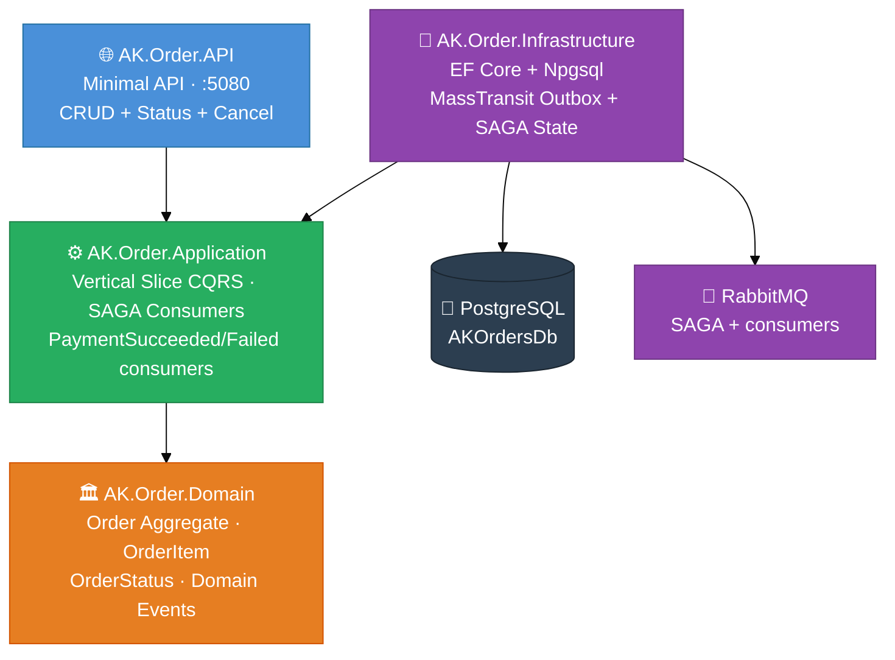
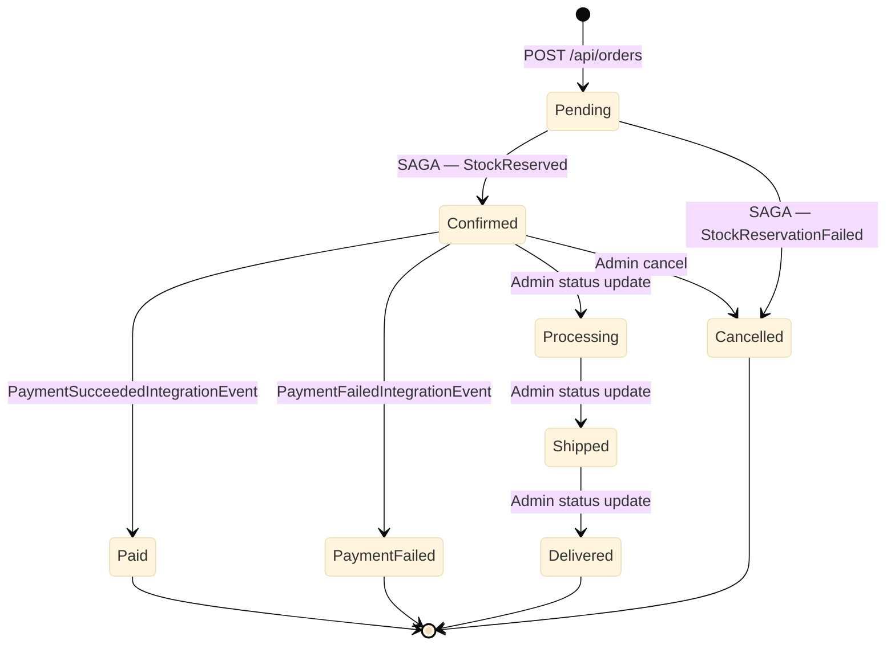
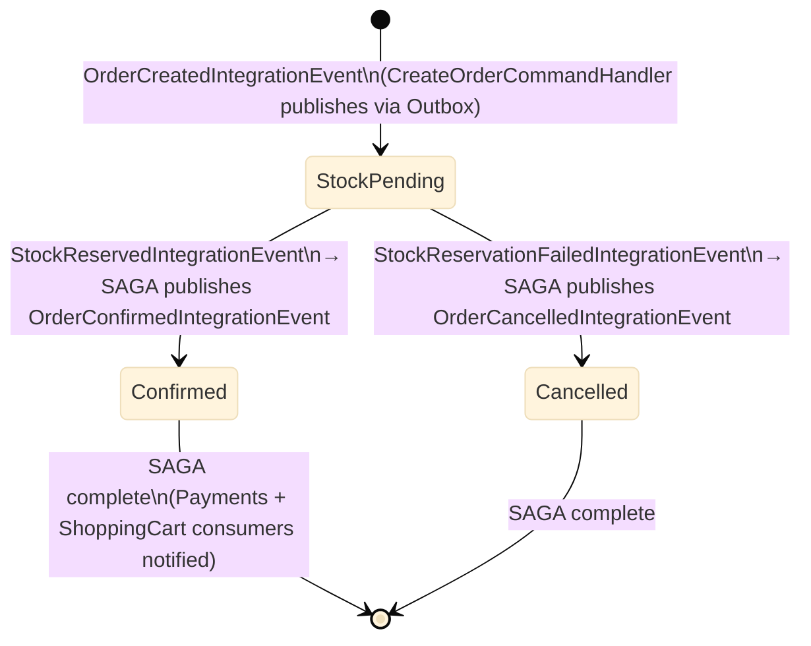

# AK.Order — Technical Design Document

## Table of Contents

1. [Overview](#1-overview)
2. [Functional Requirements](#2-functional-requirements)
3. [Non-Functional Requirements](#3-non-functional-requirements)
4. [Architecture](#4-architecture)
5. [Solution Structure](#5-solution-structure)
6. [Domain Layer](#6-domain-layer)
7. [Application Layer](#7-application-layer)
8. [Infrastructure Layer](#8-infrastructure-layer)
9. [API Layer](#9-api-layer)
10. [Database Schema](#10-database-schema)
11. [API Reference](#11-api-reference)
12. [Error Handling](#12-error-handling)
13. [Testing Strategy](#13-testing-strategy)
14. [Design Decisions](#14-design-decisions)
15. [Running the Service](#15-running-the-service)

---

## 1. Overview

**AK.Order** is the order management microservice for the AntKart e-commerce platform. It handles the full order lifecycle — creation, status transitions, cancellation, and querying.

| Property | Value |
|----------|-------|
| Transport | HTTP REST (Minimal API) |
| Port (dev) | 5080 |
| Port (Docker) | 8083 |
| Database | PostgreSQL 16 (`AKOrdersDb`) |
| EF Core | 9.0.4 via Npgsql |
| Architecture | Vertical Slice Clean Architecture |
| Patterns | CQRS (MediatR 12.4.1), FluentValidation, Specification, Repository, Unit of Work |

---

## 2. Functional Requirements

| # | Requirement |
|---|-------------|
| FR-01 | Create an order with one or more line items and a shipping address |
| FR-02 | Retrieve a single order by its UUID |
| FR-03 | List all orders with optional filtering by user ID or status (paged) |
| FR-04 | List all orders belonging to a specific user (paged) |
| FR-05 | Update order status (Pending → Processing → Shipped → Delivered) |
| FR-06 | Cancel an order that has not yet been delivered |
| FR-07 | Confirm payment on an order |
| FR-08 | Add items to an existing order (merges quantity for duplicate products) |

---

## 3. Non-Functional Requirements

| # | Requirement |
|---|-------------|
| NFR-01 | Zero-downtime schema updates via EF Core migrations applied on startup |
| NFR-02 | Structured logging via Serilog (console + rolling file) |
| NFR-03 | Health check endpoint at `/health` |
| NFR-04 | Input validation via FluentValidation pipeline |
| NFR-05 | Pagination capped at 100 items per page |
| NFR-06 | Order number guaranteed unique via DB unique index |
| NFR-07 | All domain rules enforced at the aggregate root (no anemic model) |

---

## 4. Architecture



---

## 5. Solution Structure

```
AK.Order/
├── AK.Order.Domain/
│   ├── Common/
│   │   ├── Entity.cs                     # Base class with Id, timestamps, domain events
│   │   ├── IAggregateRoot.cs
│   │   ├── IDomainEvent.cs
│   │   ├── ISpecification.cs
│   │   └── BaseSpecification.cs
│   ├── Entities/
│   │   ├── Order.cs                      # Aggregate root
│   │   └── OrderItem.cs
│   ├── ValueObjects/
│   │   └── ShippingAddress.cs
│   ├── Enums/
│   │   ├── OrderStatus.cs
│   │   └── PaymentStatus.cs
│   ├── Events/
│   │   ├── OrderCreatedEvent.cs
│   │   ├── OrderStatusChangedEvent.cs
│   │   └── OrderCancelledEvent.cs
│   └── Specifications/
│       ├── OrderByIdSpecification.cs
│       ├── OrdersByUserSpecification.cs
│       ├── OrdersByStatusSpecification.cs
│       └── OrdersPagedSpecification.cs
│
├── AK.Order.Application/
│   ├── Common/
│   │   ├── Behaviors/
│   │   │   └── ValidationBehavior.cs
│   │   ├── DTOs/
│   │   │   ├── OrderDto.cs
│   │   │   ├── OrderItemDto.cs
│   │   │   ├── ShippingAddressDto.cs
│   │   │   ├── CreateOrderDto.cs
│   │   │   └── CreateOrderItemDto.cs
│   │   ├── Interfaces/
│   │   │   ├── IOrderRepository.cs
│   │   │   └── IUnitOfWork.cs
│   │   └── Mapping/
│   │       └── OrderMapper.cs
│   ├── Features/
│   │   ├── CreateOrder/
│   │   │   ├── CreateOrderCommand.cs
│   │   │   ├── CreateOrderCommandHandler.cs
│   │   │   └── CreateOrderValidator.cs
│   │   ├── UpdateOrderStatus/
│   │   │   ├── UpdateOrderStatusCommand.cs
│   │   │   ├── UpdateOrderStatusCommandHandler.cs
│   │   │   └── UpdateOrderStatusValidator.cs
│   │   ├── CancelOrder/
│   │   │   ├── CancelOrderCommand.cs
│   │   │   ├── CancelOrderCommandHandler.cs
│   │   │   └── CancelOrderValidator.cs
│   │   ├── GetOrderById/
│   │   │   ├── GetOrderByIdQuery.cs
│   │   │   └── GetOrderByIdQueryHandler.cs
│   │   ├── GetOrders/
│   │   │   ├── GetOrdersQuery.cs
│   │   │   ├── GetOrdersQueryHandler.cs
│   │   │   └── GetOrdersValidator.cs
│   │   └── GetOrdersByUser/
│   │       ├── GetOrdersByUserQuery.cs
│   │       ├── GetOrdersByUserQueryHandler.cs
│   │       └── GetOrdersByUserValidator.cs
│   └── Extensions/
│       └── ServiceCollectionExtensions.cs
│
├── AK.Order.Infrastructure/
│   ├── Persistence/
│   │   ├── OrderDbContext.cs
│   │   ├── PostgresSettings.cs
│   │   ├── UnitOfWork.cs
│   │   ├── Configurations/
│   │   │   ├── OrderConfiguration.cs
│   │   │   └── OrderItemConfiguration.cs
│   │   └── Repositories/
│   │       └── OrderRepository.cs
│   ├── Migrations/
│   │   └── <timestamp>_InitialCreate.cs
│   └── Extensions/
│       ├── ServiceCollectionExtensions.cs
│       └── WebApplicationExtensions.cs
│
├── AK.Order.API/
│   ├── Endpoints/
│   │   └── OrderEndpoints.cs
│   ├── Middleware/
│   │   └── ExceptionHandlerMiddleware.cs
│   ├── Program.cs
│   ├── appsettings.json
│   ├── appsettings.Development.json
│   └── Dockerfile
│
└── AK.Order.Tests/
    ├── Common/
    │   └── TestDataFactory.cs
    ├── Domain/
    │   ├── OrderTests.cs
    │   ├── OrderItemTests.cs
    │   ├── ShippingAddressTests.cs
    │   ├── DomainEventsTests.cs
    │   └── SpecificationTests.cs
    ├── Features/
    │   ├── CreateOrder/
    │   ├── UpdateOrderStatus/
    │   ├── CancelOrder/
    │   ├── GetOrderById/
    │   ├── GetOrders/
    │   └── GetOrdersByUser/
    ├── Application/
    │   └── Behaviors/
    │       └── ValidationBehaviorTests.cs
    └── Infrastructure/
        ├── OrderRepositoryTests.cs
        └── UnitOfWorkTests.cs
```

---

## 6. Domain Layer

### 6.1 Order Aggregate Root

```csharp
public sealed class Order : Entity, IAggregateRoot
{
    public string OrderNumber { get; private set; }   // ORD-{yyyyMMdd}-{8-char-GUID}
    public string UserId { get; private set; }
    public OrderStatus Status { get; private set; }
    public PaymentStatus PaymentStatus { get; private set; }
    public ShippingAddress ShippingAddress { get; private set; }
    public string? Notes { get; private set; }
    public IReadOnlyList<OrderItem> Items => _items.AsReadOnly();
    public decimal TotalAmount => _items.Sum(i => i.Price * i.Quantity);
    public int TotalItems => _items.Sum(i => i.Quantity);
}
```

**Invariants enforced by the aggregate:**
- `UserId` must not be blank
- At least one item required at creation
- Status cannot be updated after cancellation
- Delivered orders cannot be cancelled
- Adding an existing `ProductId` merges quantity (no duplicate line items)

### 6.2 OrderItem

Owned by `Order`. Contains `ProductId`, `ProductName`, `SKU`, `Price`, `Quantity`, `ImageUrl?`. `SubTotal` is computed (`Price × Quantity`). `OrderId` is mapped as a shadow FK by EF Core (not exposed as a property).

### 6.3 ShippingAddress Value Object

Immutable. All fields except `AddressLine2` are required. Factory method `Create(...)` validates and trims all fields.

```csharp
public string ToSingleLine() =>
    string.IsNullOrWhiteSpace(AddressLine2)
        ? $"{AddressLine1}, {City}, {State} {PostalCode}, {Country}"
        : $"{AddressLine1}, {AddressLine2}, {City}, {State} {PostalCode}, {Country}";
```

### 6.4 Enums

```csharp
public enum OrderStatus   { Pending=1, Confirmed=2, Processing=3, Shipped=4, Delivered=5, Cancelled=6, Paid=7, PaymentFailed=8 }
public enum PaymentStatus { Pending, Paid, Failed, Refunded }
```

**Order Status Lifecycle:**



**SAGA Choreography (AK.Order ↔ AK.Products ↔ AK.Payments):**



### 6.5 Domain Events

| Event | Raised When |
|-------|-------------|
| `OrderCreatedEvent(OrderId, UserId, OrderNumber)` | `Order.Create(...)` |
| `OrderStatusChangedEvent(OrderId, OldStatus, NewStatus)` | `Order.UpdateStatus(...)` |
| `OrderCancelledEvent(OrderId, UserId)` | `Order.Cancel()` |

### 6.6 Specifications

| Specification | Filter |
|---------------|--------|
| `OrderByIdSpecification(Guid)` | `o.Id == id` |
| `OrdersByUserSpecification(string)` | `o.UserId == userId`, ordered by `CreatedAt DESC` |
| `OrdersByStatusSpecification(OrderStatus)` | `o.Status == status`, ordered by `CreatedAt DESC` |
| `OrdersPagedSpecification(page, pageSize, userId?, status?)` | Combined filter + paging |

---

## 7. Application Layer

### 7.1 Vertical Slice Architecture

Each feature is a self-contained slice under `Features/<FeatureName>/`:
- `<Feature>Command.cs` or `<Feature>Query.cs` — MediatR request record
- `<Feature>CommandHandler.cs` or `<Feature>QueryHandler.cs` — MediatR handler
- `<Feature>Validator.cs` — FluentValidation validator (optional for queries)

This contrasts with horizontal layering (separate `Commands/`, `Queries/`, `Validators/` folders).

### 7.2 Features Summary

| Feature | Type | Returns |
|---------|------|---------|
| `CreateOrder` | Command | `OrderDto` |
| `UpdateOrderStatus` | Command | `OrderDto` |
| `CancelOrder` | Command | `bool` |
| `GetOrderById` | Query | `OrderDto?` |
| `GetOrders` | Query | `PagedResult<OrderDto>` |
| `GetOrdersByUser` | Query | `PagedResult<OrderDto>` |

### 7.3 Validation Rules

**CreateOrder:**
- `UserId`: NotEmpty, MaxLength(100)
- `Order.Items`: NotEmpty (at least 1 item)
- Each item: `ProductId` NotEmpty, `ProductName` NotEmpty MaxLength(200), `SKU` NotEmpty MaxLength(50), `Price > 0`, `Quantity > 0`
- `ShippingAddress.FullName`: NotEmpty MaxLength(200)
- `ShippingAddress.AddressLine1`: NotEmpty MaxLength(500)
- `ShippingAddress.City/State`: NotEmpty MaxLength(100)
- `ShippingAddress.PostalCode`: NotEmpty MaxLength(20)
- `ShippingAddress.Country`: NotEmpty MaxLength(100)
- `ShippingAddress.Phone`: NotEmpty MaxLength(30)

**UpdateOrderStatus:** `OrderId` NotEmpty, `NewStatus` IsInEnum

**CancelOrder:** `OrderId` NotEmpty

**GetOrders / GetOrdersByUser:** `Page > 0`, `PageSize` 1–100

### 7.4 DTOs

```csharp
record OrderDto(
    Guid Id, string OrderNumber, string UserId,
    string Status, string PaymentStatus,
    ShippingAddressDto ShippingAddress,
    IReadOnlyList<OrderItemDto> Items,
    decimal TotalAmount, int TotalItems,
    string? Notes, DateTime CreatedAt, DateTime? UpdatedAt);

record OrderItemDto(
    Guid Id, string ProductId, string ProductName,
    string SKU, decimal Price, int Quantity,
    string? ImageUrl, decimal SubTotal);

record ShippingAddressDto(
    string FullName, string AddressLine1, string? AddressLine2,
    string City, string State, string PostalCode,
    string Country, string Phone);
```

---

## 8. Infrastructure Layer

### 8.1 EF Core Configuration

- `OrderDbContext` uses `Npgsql` provider
- `ShippingAddress` mapped via `OwnsOne` — all columns prefixed `Ship*`
- `Order.Items` navigated via field access mode (`_items` private list)
- `OrderItem.OrderId` mapped as shadow FK; property is ignored in EF config
- Status enums stored as `string` columns (`HasConversion<string>()`)
- Computed properties (`TotalAmount`, `TotalItems`, `DomainEvents`, `SubTotal`) are ignored

### 8.2 Repository

`OrderRepository` implements `IOrderRepository`. Specification evaluation uses `ApplySpecification()` which applies `Where`, `Include`, `OrderBy`/`OrderByDescending`, `Skip`, and `Take` from the specification object. Count queries apply only `Where` to avoid double-paging.

### 8.3 Unit of Work

`UnitOfWork` wraps `OrderDbContext`. The `Orders` property lazily instantiates `OrderRepository`. `SaveChangesAsync` delegates directly to `db.SaveChangesAsync`.

### 8.4 Migrations

Migrations are in `AK.Order.Infrastructure/Migrations/`. They are applied automatically on startup via `app.ApplyMigrationsAsync()` which calls `db.Database.MigrateAsync()`.

---

## 9. API Layer

### 9.1 Endpoint Registration

```csharp
app.MapGroup("/api/orders").WithTags("Orders")
```

### 9.2 Program.cs Bootstrap

```
builder.AddSerilogLogging()
builder.Services.AddApplication()        ← MediatR + FluentValidation + ValidationBehavior
builder.Services.AddInfrastructure()     ← DbContext + UoW
builder.Services.AddDefaultHealthChecks()
builder.Services.AddSwaggerGen(...)
app.ApplyMigrationsAsync()               ← EF Core migrate on startup
app.UseMiddleware<ExceptionHandlerMiddleware>()
app.UseSwagger() + app.UseSwaggerUI()
app.MapOrderEndpoints()
app.MapDefaultHealthChecks()
```

---

## 10. Database Schema

### Orders Table

| Column | Type | Notes |
|--------|------|-------|
| Id | uuid | PK, not generated |
| OrderNumber | varchar(30) | Unique index |
| UserId | varchar(100) | Index |
| Status | varchar(30) | Enum stored as string |
| PaymentStatus | varchar(30) | Enum stored as string |
| Notes | varchar(1000) | Nullable |
| CreatedAt | timestamptz | Not null |
| UpdatedAt | timestamptz | Nullable |
| ShipFullName | varchar(200) | Owned ShippingAddress |
| ShipAddressLine1 | varchar(500) | |
| ShipAddressLine2 | varchar(500) | Nullable |
| ShipCity | varchar(100) | |
| ShipState | varchar(100) | |
| ShipPostalCode | varchar(20) | |
| ShipCountry | varchar(100) | |
| ShipPhone | varchar(30) | |

### OrderItems Table

| Column | Type | Notes |
|--------|------|-------|
| Id | uuid | PK, not generated |
| OrderId | uuid | FK → Orders.Id, CASCADE DELETE |
| ProductId | varchar(100) | |
| ProductName | varchar(200) | |
| SKU | varchar(50) | |
| Price | decimal(18,2) | |
| Quantity | int | |
| ImageUrl | varchar(1000) | Nullable |

---

## 11. API Reference

### GET /api/orders

Returns all orders (paged, filterable).

**Query params:** `page` (default 1), `pageSize` (default 20, max 100), `userId` (optional), `status` (optional enum int)

**Response 200:**
```json
{
  "items": [...],
  "totalCount": 42,
  "page": 1,
  "pageSize": 20,
  "totalPages": 3,
  "hasNextPage": true,
  "hasPreviousPage": false
}
```

---

### GET /api/orders/{id}

Returns a single order by UUID.

**Response 200:** `OrderDto`
**Response 404:** Order not found

---

### GET /api/orders/user/{userId}

Returns paged orders for a specific user.

**Query params:** `page`, `pageSize`

**Response 200:** `PagedResult<OrderDto>`

---

### POST /api/orders

Creates a new order.

**Request body:**
```json
{
  "userId": "user-123",
  "order": {
    "items": [
      {
        "productId": "prod-001",
        "productName": "Classic T-Shirt",
        "sku": "MEN-SHIR-001",
        "price": 29.99,
        "quantity": 2,
        "imageUrl": null
      }
    ],
    "shippingAddress": {
      "fullName": "John Doe",
      "addressLine1": "123 Main St",
      "addressLine2": null,
      "city": "Springfield",
      "state": "IL",
      "postalCode": "62701",
      "country": "US",
      "phone": "+1-555-0100"
    },
    "notes": "Please handle with care"
  }
}
```

**Response 201:** `OrderDto` with `Location` header

---

### PUT /api/orders/{id}/status

Updates the status of an order.

**Request body:**
```json
{ "newStatus": 1 }
```

Status values: `0=Pending, 1=Processing, 2=Shipped, 3=Delivered, 4=Cancelled`

**Response 200:** `OrderDto`
**Response 404:** Order not found
**Response 409:** Invalid status transition (e.g., updating a cancelled order)

---

### DELETE /api/orders/{id}

Cancels an order.

**Response 204:** Success
**Response 404:** Order not found
**Response 409:** Cannot cancel (already cancelled or delivered)

---

### GET /health

Standard health check endpoint.

**Response 200:** `{ "status": "Healthy" }`

---

## 12. Error Handling

`ExceptionHandlerMiddleware` maps exceptions to HTTP status codes:

| Exception | HTTP Status | Body |
|-----------|-------------|------|
| `FluentValidation.ValidationException` | 400 | `{ "errors": [{ "propertyName": "...", "errorMessage": "..." }] }` |
| `KeyNotFoundException` | 404 | `{ "error": "..." }` |
| `InvalidOperationException` | 409 | `{ "error": "..." }` |
| Any other `Exception` | 500 | `{ "error": "An unexpected error occurred." }` |

---

## 13. Testing Strategy

All tests are pure unit tests or EF InMemory integration tests — no network, no real database.

### Test Coverage by Area

| Area | Test File | Tests |
|------|-----------|-------|
| Order aggregate | `OrderTests.cs` | 20 |
| OrderItem entity | `OrderItemTests.cs` | 8 |
| ShippingAddress value object | `ShippingAddressTests.cs` | 5 |
| Domain events | `DomainEventsTests.cs` | 4 |
| Specifications | `SpecificationTests.cs` | 10 |
| CreateOrder handler | `CreateOrderCommandHandlerTests.cs` | 4 |
| CreateOrder validator | `CreateOrderValidatorTests.cs` | 7 |
| UpdateOrderStatus handler | `UpdateOrderStatusCommandHandlerTests.cs` | 3 |
| UpdateOrderStatus validator | `UpdateOrderStatusValidatorTests.cs` | 3 |
| CancelOrder handler | `CancelOrderCommandHandlerTests.cs` | 3 |
| CancelOrder validator | `CancelOrderValidatorTests.cs` | 2 |
| GetOrderById handler | `GetOrderByIdQueryHandlerTests.cs` | 2 |
| GetOrders handler | `GetOrdersQueryHandlerTests.cs` | 2 |
| GetOrders validator | `GetOrdersValidatorTests.cs` | 4 |
| GetOrdersByUser handler | `GetOrdersByUserQueryHandlerTests.cs` | 2 |
| GetOrdersByUser validator | `GetOrdersByUserValidatorTests.cs` | 3 |
| ValidationBehavior | `ValidationBehaviorTests.cs` | 3 |
| OrderRepository (EF InMemory) | `OrderRepositoryTests.cs` | 10 |
| UnitOfWork (EF InMemory) | `UnitOfWorkTests.cs` | 3 |
| **Total** | | **106** |

### Mock Strategy

- Handlers: `Mock<IUnitOfWork>` + `Mock<IOrderRepository>`
- Validators: instantiated directly, no mocking
- Infrastructure: `DbContextOptionsBuilder.UseInMemoryDatabase(Guid.NewGuid().ToString())`

---

## 14. Design Decisions

| Decision | Choice | Rationale |
|----------|--------|-----------|
| Architecture | Vertical Slice in Application layer | Keeps feature code co-located; easier to navigate than horizontal layers |
| Why Application layer (not API) | Application layer | Tests cannot reference API layer per CLAUDE.md; VSA in Application maintains testability |
| Order entity name | `OrderEntity` alias | `AK.Order` namespace conflicts with `Order` type name at compile time; alias resolves ambiguity cleanly |
| EF Core owned entity | `OwnsOne<ShippingAddress>` | Avoids a separate `ShippingAddresses` table; ShippingAddress is a value object |
| `OrderId` on `OrderItem` | Shadow FK only | `OrderId` is not part of the domain model; domain enforces ownership via `Order._items` |
| Status stored as string | `HasConversion<string>()` | Human-readable in PostgreSQL, no migration needed for new enum values |
| Migration on startup | `db.Database.MigrateAsync()` | Simple for a microservice; no separate migration runner needed |
| `OrderRepository` access | `internal` + `InternalsVisibleTo` | Keeps the infrastructure contract private to the assembly while allowing tests to verify it directly |
| `PagedResult<T>` | From `AK.BuildingBlocks` | No duplication; consistent across all services |

---

## 15. Running the Service

### Prerequisites

- .NET 9 SDK
- PostgreSQL 16 (or use Docker)

### Development

```bash
# Start PostgreSQL via Docker
docker run -d --name postgres-dev -e POSTGRES_PASSWORD=postgres -p 5432:5432 postgres:16-alpine

# Run the service (migrations apply automatically)
cd AK.Order/AK.Order.API && dotnet run
# → http://localhost:5080/swagger
```

### Connection String

`appsettings.json`:
```json
"ConnectionStrings": {
  "Postgres": "Host=localhost;Port=5432;Database=AKOrdersDb;Username=postgres;Password=postgres"
}
```

### Docker Compose (all services)

```bash
docker-compose up --build
# Order API → http://localhost:8083/swagger
```

### Tests

```bash
dotnet test AK.Order/AK.Order.Tests/AK.Order.Tests.csproj
# 106 tests, all passing
```
