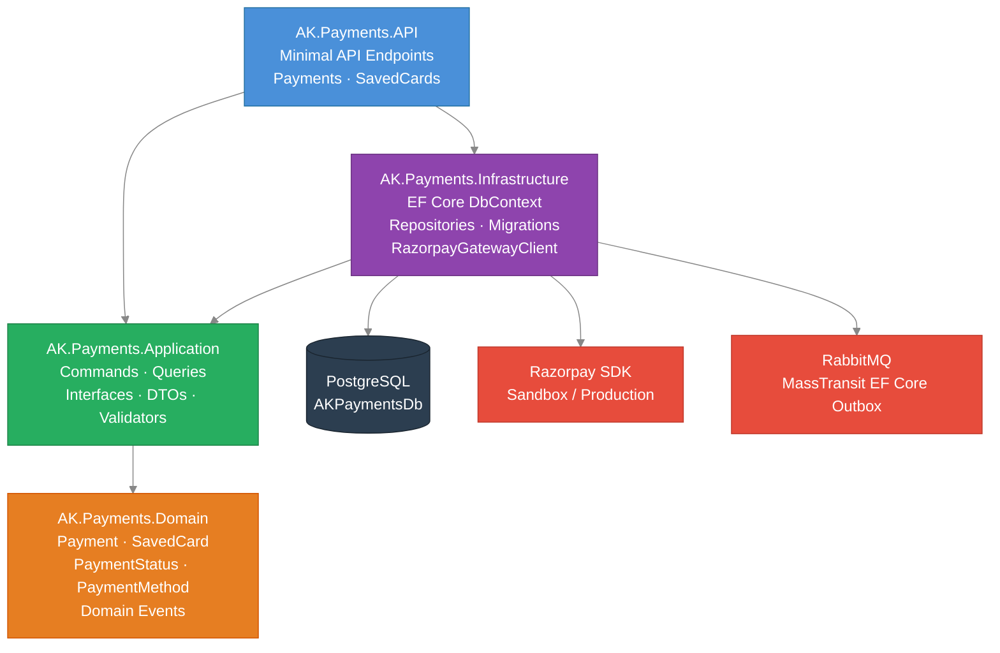
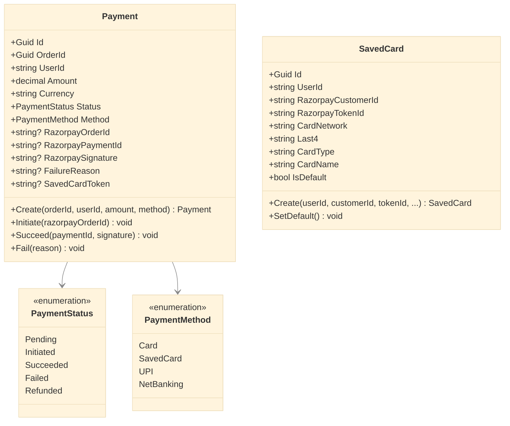
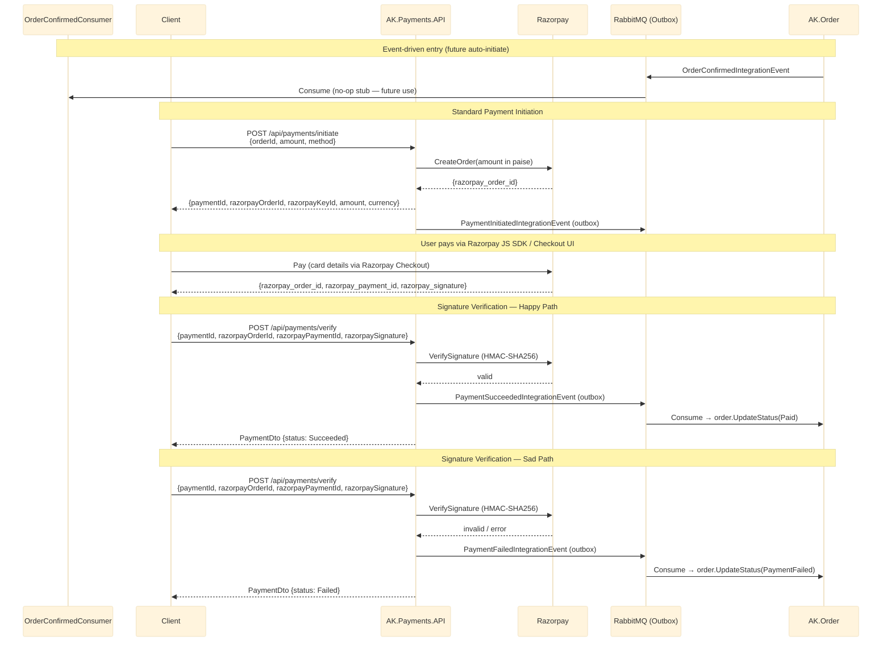
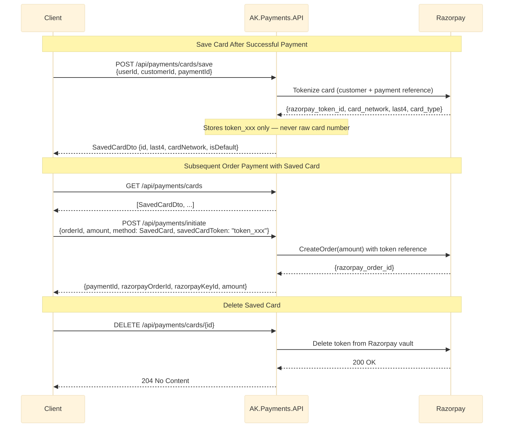
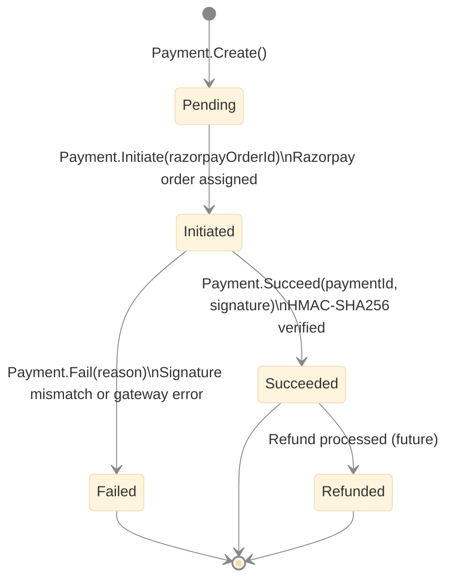

# AK.Payments — Technical Design

## Overview

AK.Payments is the payment processing microservice for AntKart. It integrates with **Razorpay** (sandbox) to process card payments, verify payment signatures, and manage saved cards for returning users.

- **Transport:** HTTP REST, port 5086 (dev) / 8085 (Docker)
- **Database:** PostgreSQL — `AKPaymentsDb` via EF Core 9 + Npgsql
- **External:** Razorpay API (sandbox/production)
- **Architecture:** DDD + Clean Architecture
- **Patterns:** CQRS (MediatR 12.4.1), FluentValidation pipeline, Repository, Unit of Work, EF Core Outbox (MassTransit)

---

## Architecture



---

## Domain Model

### Payment (Aggregate Root)

| Field | Type | Description |
|-------|------|-------------|
| Id | Guid | Primary key |
| OrderId | Guid | Reference to the confirmed order |
| UserId | string | Keycloak user ID |
| CustomerEmail | string | Extracted from JWT at endpoint layer |
| CustomerName | string | Extracted from JWT at endpoint layer |
| OrderNumber | string | Denormalised from order for notification enrichment |
| Amount | decimal | Payment amount in INR |
| Currency | string | Default "INR" |
| Status | PaymentStatus | Current state (see enum below) |
| Method | PaymentMethod | Card, SavedCard, UPI, NetBanking |
| RazorpayOrderId | string? | `order_xxx` assigned at initiation |
| RazorpayPaymentId | string? | `pay_xxx` set after successful verification |
| RazorpaySignature | string? | HMAC-SHA256 signature verified on success |
| FailureReason | string? | Populated on failure |
| SavedCardToken | string? | Razorpay token ID if using a saved card |

#### PaymentStatus

| Value | Meaning |
|-------|---------|
| Pending (1) | Created, no Razorpay order yet |
| Initiated (2) | Razorpay order assigned, awaiting user payment |
| Succeeded (3) | Payment verified, signature validated |
| Failed (4) | Payment failed or signature mismatch |
| Refunded (5) | Payment refunded (future) |

#### PaymentMethod

| Value | Meaning |
|-------|---------|
| Card (1) | One-time card payment |
| SavedCard (2) | Payment using a stored Razorpay token |
| UPI (3) | UPI payment |
| NetBanking (4) | Net banking |

### SavedCard (Entity)

| Field | Type | Description |
|-------|------|-------------|
| Id | Guid | Primary key |
| UserId | string | Keycloak user ID |
| RazorpayCustomerId | string | `cust_xxx` — created once per user in Razorpay |
| RazorpayTokenId | string | `token_xxx` — unique, references the saved card |
| CardNetwork | string | Visa, Mastercard, RuPay |
| Last4 | string | Last 4 digits displayed to user |
| CardType | string | credit / debit |
| CardName | string | Cardholder name |
| IsDefault | bool | Whether this is the user's default card |

**PCI Compliance:** Card numbers are **never stored**. Only Razorpay token IDs are persisted, which reference the card on Razorpay's PCI-DSS Level 1 compliant vault.

### Domain Class Diagram



---

## Payment Flow

### Standard Card Payment



### Saved Card Flow



---

## Payment Status Lifecycle



---

## Razorpay Integration

### Test Credentials

Configure in `appsettings.json` → `Razorpay:KeyId` and `Razorpay:KeySecret`.  
Obtain from [Razorpay Dashboard](https://dashboard.razorpay.com) → Settings → API Keys → Test Mode.

### Test Cards (Sandbox)

| Card Number | Network | Result |
|-------------|---------|--------|
| 4111 1111 1111 1111 | Visa | Success |
| 5267 3169 4984 2643 | Mastercard | Success |
| 4000 0000 0000 0002 | Visa | Declined |

- **CVV:** any 3 digits (e.g., 123)
- **Expiry:** any future date
- **OTP:** `1234 1234`

### Amount Encoding

Razorpay requires amounts in **paise** (smallest INR unit).

```
₹999.00 → 99900 paise
```

The `RazorpayGatewayClient` handles this conversion: `(long)(amount * 100)`.

### Signature Verification

After the user completes payment, Razorpay returns three values to your frontend:
- `razorpay_order_id`
- `razorpay_payment_id`  
- `razorpay_signature` — HMAC-SHA256 of `"{order_id}|{payment_id}"` using your Key Secret

Call `POST /api/payments/verify` with all three values. The server verifies the signature using `Razorpay.Api.Utils.verifyPaymentSignature()`.

---

## Integration Events

### Published by AK.Payments

| Event | When Published | Consumers |
|-------|---------------|----------|
| `PaymentInitiatedIntegrationEvent` | Razorpay order created | (audit only) |
| `PaymentSucceededIntegrationEvent` | Signature verified successfully | AK.Order → `Paid`; **AK.Notification → payment receipt email** |
| `PaymentFailedIntegrationEvent` | Signature mismatch or gateway error | AK.Order → `PaymentFailed`; **AK.Notification → payment failure alert** |

All events are published via the **MassTransit EF Core Outbox** — atomically committed with the payment status change.

### Consumed by AK.Payments

| Event | Action |
|-------|--------|
| `OrderConfirmedIntegrationEvent` | No-op (bus binding exists for future auto-initiate flows) |

### Event Schemas

```csharp
// AK.BuildingBlocks.Messaging.IntegrationEvents
PaymentInitiatedIntegrationEvent(
    Guid PaymentId,
    Guid OrderId,
    string UserId,
    decimal Amount,
    string Currency,
    string RazorpayOrderId)

PaymentSucceededIntegrationEvent(
    Guid PaymentId,
    Guid OrderId,
    string UserId,
    string CustomerEmail,    // enriched — enables AK.Notification to send receipt email
    string CustomerName,
    string OrderNumber,
    decimal Amount,
    string RazorpayPaymentId)

PaymentFailedIntegrationEvent(
    Guid PaymentId,
    Guid OrderId,
    string UserId,
    string CustomerEmail,    // enriched — enables AK.Notification to send failure alert
    string CustomerName,
    string OrderNumber,
    string Reason)
```

### AK.Order Changes

`OrderStatus` enum extended with:
- `Paid = 7` — set when `PaymentSucceededIntegrationEvent` is consumed
- `PaymentFailed = 8` — set when `PaymentFailedIntegrationEvent` is consumed

New consumers in AK.Order:
- `PaymentSucceededConsumer` — calls `order.UpdateStatus(OrderStatus.Paid)` + `order.ConfirmPayment()`
- `PaymentFailedConsumer` — calls `order.UpdateStatus(OrderStatus.PaymentFailed)`

AK.Payments is registered with `AddRabbitMqMassTransit(configuration, "payments", cfg => { ... })` giving its `OrderConfirmedConsumer` the unique queue `payments-order-confirmed`. This prevents competing consumption with AK.Order's and AK.Notification's consumers for the same event.

---

## API Endpoints

| Method | Path | Auth | Description |
|--------|------|------|-------------|
| POST | /api/payments/initiate | Bearer | Create Razorpay order, return key + order ID to frontend |
| POST | /api/payments/verify | Bearer | Verify signature, mark succeeded or failed |
| GET | /api/payments/{id} | Bearer | Get payment by ID |
| GET | /api/payments/order/{orderId} | Bearer | Get payment for an order |
| GET | /api/payments/me | Bearer | List payments for the authenticated user (userId from JWT) |
| GET | /api/payments/cards | Bearer | List saved cards for the authenticated user (userId from JWT) |
| POST | /api/payments/cards/save | Bearer | Save a card after successful payment |
| DELETE | /api/payments/cards/{id} | Bearer | Delete a saved card (userId from JWT, ownership verified) |

---

## Database Schema

### payments

| Column | Type |
|--------|------|
| id | uuid PK |
| order_id | uuid (indexed) |
| user_id | varchar(100) (indexed) |
| amount | decimal(18,2) |
| currency | varchar(10) default 'INR' |
| status | int |
| method | int |
| customer_email | varchar(256) | Contact info for notification events |
| customer_name | varchar(200) | Contact info for notification events |
| order_number | varchar(50) | Denormalised for notification enrichment |
| razorpay_order_id | varchar(50) |
| razorpay_payment_id | varchar(50) |
| razorpay_signature | varchar(200) |
| failure_reason | varchar(500) |
| saved_card_token | varchar(50) |
| created_at, updated_at | timestamptz |

### saved_cards

| Column | Type |
|--------|------|
| id | uuid PK |
| user_id | varchar(100) (indexed) |
| razorpay_customer_id | varchar(50) |
| razorpay_token_id | varchar(50) unique |
| card_network | varchar(20) |
| last4 | varchar(4) |
| card_type | varchar(20) |
| card_name | varchar(100) |
| is_default | bool |
| created_at, updated_at | timestamptz |

---

## Configuration

```json
{
  "Razorpay": {
    "KeyId": "rzp_test_...",
    "KeySecret": "..."
  },
  "ConnectionStrings": {
    "PaymentsDb": "Host=postgres;Port=5432;Database=AKPaymentsDb;Username=postgres;Password=postgres"
  },
  "RabbitMq": { "Host": "rabbitmq", "VirtualHost": "/", "Username": "guest", "Password": "guest" }
}
```

---

## Running Locally

```bash
# Start infrastructure (PostgreSQL + RabbitMQ)
docker-compose up postgres rabbitmq -d

# Run the service
cd AK.Payments/AK.Payments.API
dotnet run
# Swagger → http://localhost:5086/swagger

# Run tests
dotnet test AK.Payments/AK.Payments.Tests/AK.Payments.Tests.csproj
```

---

## Tests

| Category | Tests |
|----------|-------|
| Domain — Payment entity | 9 |
| Domain — SavedCard entity | 5 |
| Commands — InitiatePayment | 5 |
| Commands — VerifyPayment | 4 |
| Commands — SaveCard | 6 |
| Commands — DeleteSavedCard | 6 |
| Queries — GetPaymentById | 3 |
| Queries — GetPaymentByOrderId | 3 |
| Queries — GetUserPayments | 4 |
| Queries — GetUserSavedCards | 4 |
| Validators — VerifyPayment | 6 |
| Validators — SaveCard | 4 |
| **Total** | **69** |

All tests are pure unit tests — no database, no HTTP, no Razorpay sandbox calls.

> **Note:** The `InitiatePaymentRequest` and `SaveCardRequest` endpoint-layer records have no `userId`, `customerEmail`, or `customerName` fields — these are derived from JWT via `HttpContextExtensions.GetUserId()`, `GetUserEmail()`, and `GetUserDisplayName()` to prevent client identity spoofing. `OrderNumber` is passed by the client as it comes from a prior order creation response.
