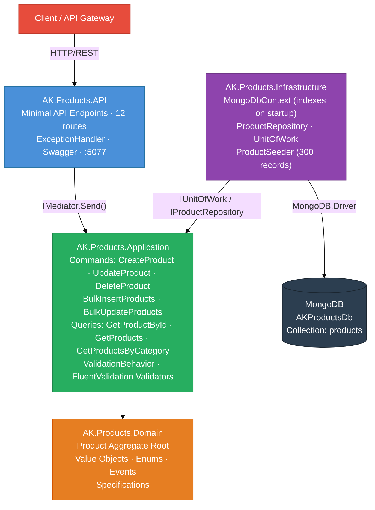
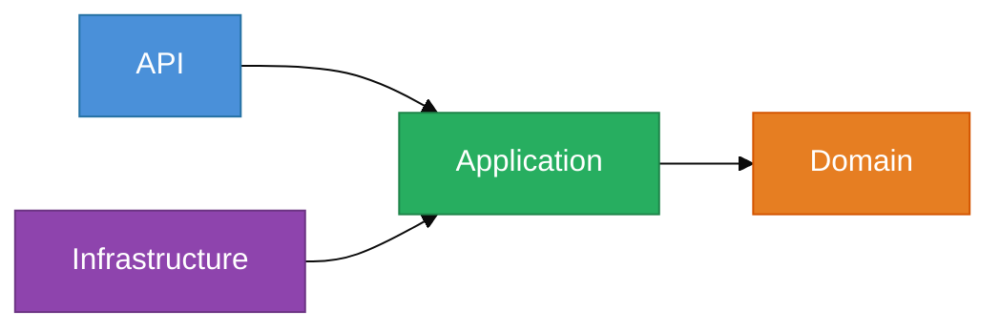
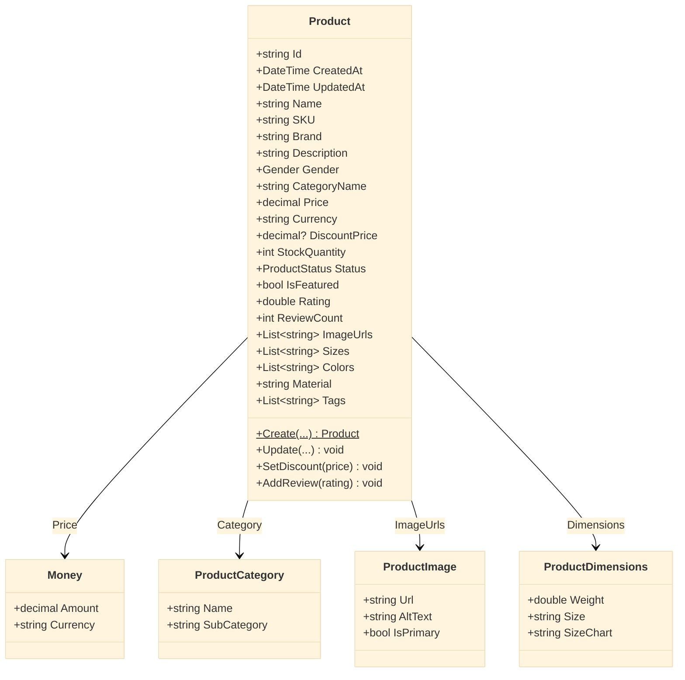
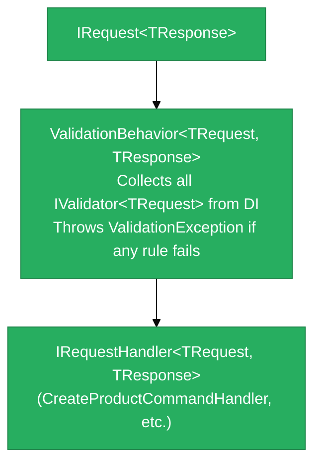
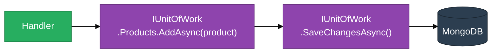
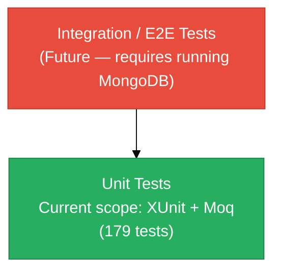

# AK.Products Microservice — Technical Design Document

## Table of Contents
1. [Overview](#1-overview)
2. [Functional Requirements](#2-functional-requirements)
3. [Non-Functional Requirements](#3-non-functional-requirements)
4. [High-Level Architecture](#4-high-level-architecture)
5. [Solution Structure](#5-solution-structure)
6. [Domain Layer Design](#6-domain-layer-design)
7. [Application Layer Design](#7-application-layer-design)
8. [Infrastructure Layer Design](#8-infrastructure-layer-design)
9. [API Layer Design](#9-api-layer-design)
10. [Data Model](#10-data-model)
11. [CQRS & MediatR Pipeline](#11-cqrs--mediatr-pipeline)
12. [Specification Pattern](#12-specification-pattern)
13. [Unit of Work Pattern](#13-unit-of-work-pattern)
14. [Seed Data](#14-seed-data)
15. [API Reference](#15-api-reference)
16. [Testing Strategy](#16-testing-strategy)
17. [Configuration & Deployment](#17-configuration--deployment)
18. [Design Decisions & Trade-offs](#18-design-decisions--trade-offs)

---

## 1. Overview

**AK.Products** is a .NET 9 microservice responsible for managing a product catalogue covering Men's, Women's, and Kids' dress collections. It is part of the AntKart e-commerce platform.

| Attribute       | Value                            |
|-----------------|----------------------------------|
| Framework       | .NET 9 (ASP.NET Core Minimal API) |
| Architecture    | DDD + Clean Architecture          |
| Database        | MongoDB                           |
| Pattern Stack   | CQRS, MediatR, FluentValidation, Specification, Unit of Work |
| Namespace root  | `AK.Products`                     |

---

## 2. Functional Requirements

### 2.1 Product Management
| ID  | Requirement |
|-----|-------------|
| FR-01 | Create a new product with full details (name, SKU, brand, category, pricing, stock, sizes, colors, material) |
| FR-02 | Update an existing product by ID |
| FR-03 | Delete a product by ID |
| FR-04 | Retrieve a single product by ID |
| FR-05 | Retrieve a paginated list of all products |
| FR-06 | Retrieve products filtered by gender (Men / Women / Kids) |
| FR-07 | Retrieve products filtered by category name |
| FR-08 | Search products by name, brand, or description keyword |
| FR-09 | Retrieve featured products |
| FR-10 | Bulk insert multiple products in a single operation |
| FR-11 | Bulk update multiple products in a single operation |

### 2.2 Product Attributes
| Attribute       | Type              | Notes |
|-----------------|-------------------|-------|
| Name            | string            | Required, max 200 chars |
| Description     | string            | Required, max 2000 chars |
| SKU             | string            | Required, globally unique |
| Brand           | string            | Required |
| Gender          | enum              | Men=1, Women=2, Kids=3, Unisex=4 |
| Category        | string            | e.g. Shirts, Dresses, T-Shirts |
| Sub-Category    | string (optional) | |
| Price           | decimal           | In USD, must be > 0 |
| Discount Price  | decimal (optional)| Must be < Price |
| Stock Quantity  | int               | ≥ 0; 0 → OutOfStock status |
| Sizes           | List\<string\>    | e.g. S, M, L or 4-5Y |
| Colors          | List\<string\>    | At least one required |
| Material        | string (optional) | |
| Tags            | List\<string\>    | |
| IsFeatured      | bool              | Default false |
| Rating          | double            | Computed from reviews |
| Status          | enum              | Active, Inactive, OutOfStock, Discontinued |

### 2.3 Business Rules
- SKU must be unique across all products
- Discount price must be strictly less than the original price
- Status is automatically set to `OutOfStock` when stock quantity = 0
- Domain events are raised on create and update for downstream consumers
- Seeder auto-populates 300 products (100 Men / 100 Women / 100 Kids) in Development environment

---

## 3. Non-Functional Requirements

| NFR | Requirement |
|-----|-------------|
| NFR-01 | All endpoints respond within 200ms under normal load |
| NFR-02 | Horizontal scalability — stateless API, all state in MongoDB |
| NFR-03 | Input validation on all write endpoints (400 on failure) |
| NFR-04 | Structured JSON error responses for 400 / 404 / 409 / 500 |
| NFR-05 | Full OpenAPI/Swagger documentation served at `/swagger` |
| NFR-06 | MongoDB indexes on SKU (unique), Gender, Category, Status, and full-text search |
| NFR-07 | Unit tests for all public and internal handler / validator / domain methods |

---

## 4. High-Level Architecture



### Layer Dependencies



> Infrastructure depends on Application (through interfaces), never the reverse — Dependency Inversion Principle.

> Infrastructure depends on Application (through interfaces), never the reverse — Dependency Inversion Principle.

---

## 5. Solution Structure

```
AK.Products/
├── AK.Products.sln
├── AK.Products.postman_collection.json
├── TECHNICAL_DESIGN.md
├── src/
│   ├── AK.Products.Domain/
│   │   └── AK.Products.Domain/
│   │       ├── Common/
│   │       │   ├── BaseEntity.cs          # MongoDB Id, CreatedAt, UpdatedAt
│   │       │   ├── IAggregateRoot.cs      # Marker interface
│   │       │   └── IDomainEvent.cs        # : INotification (MediatR)
│   │       ├── Entities/
│   │       │   └── Product.cs             # Aggregate root
│   │       ├── Enums/
│   │       │   ├── Gender.cs
│   │       │   ├── ProductStatus.cs
│   │       │   └── AgeGroup.cs
│   │       ├── Events/
│   │       │   ├── ProductCreatedEvent.cs
│   │       │   ├── ProductUpdatedEvent.cs
│   │       │   └── ProductDeletedEvent.cs
│   │       ├── Specifications/
│   │       │   ├── ISpecification.cs
│   │       │   └── BaseSpecification.cs
│   │       └── ValueObjects/
│   │           ├── Money.cs
│   │           ├── ProductCategory.cs
│   │           ├── ProductImage.cs
│   │           └── ProductDimensions.cs
│   │
│   ├── AK.Products.Application/
│   │   └── AK.Products.Application/
│   │       ├── Behaviors/
│   │       │   └── ValidationBehavior.cs  # MediatR pipeline validation
│   │       ├── Commands/
│   │       │   ├── CreateProduct/         # Command + Handler
│   │       │   ├── UpdateProduct/
│   │       │   ├── DeleteProduct/
│   │       │   ├── BulkInsertProducts/
│   │       │   └── BulkUpdateProducts/
│   │       ├── Common/
│   │       │   └── ProductMapper.cs       # Domain → DTO
│   │       ├── DTOs/
│   │       │   ├── ProductDto.cs
│   │       │   ├── CreateProductDto.cs
│   │       │   ├── UpdateProductDto.cs
│   │       │   ├── BulkUpdateProductDto.cs
│   │       │   └── PagedResult.cs
│   │       ├── Extensions/
│   │       │   └── ServiceCollectionExtensions.cs
│   │       ├── Interfaces/
│   │       │   ├── IProductRepository.cs
│   │       │   └── IUnitOfWork.cs
│   │       ├── Queries/
│   │       │   ├── GetProductById/
│   │       │   ├── GetProducts/
│   │       │   └── GetProductsByCategory/
│   │       └── Validators/
│   │           ├── CreateProductValidator.cs
│   │           └── UpdateProductValidator.cs
│   │
│   ├── AK.Products.Infrastructure/
│   │   └── AK.Products.Infrastructure/
│   │       ├── Extensions/
│   │       │   └── ServiceCollectionExtensions.cs
│   │       ├── Persistence/
│   │       │   ├── MongoDbContext.cs      # Index creation on startup
│   │       │   ├── MongoDbSettings.cs
│   │       │   ├── UnitOfWork.cs
│   │       │   └── Repositories/
│   │       │       └── ProductRepository.cs
│   │       └── Seeders/
│   │           └── ProductSeeder.cs       # 300 sample products
│   │
│   └── AK.Products.API/
│       └── AK.Products.API/
│           ├── Endpoints/
│           │   └── ProductEndpoints.cs    # All 12 routes
│           ├── Extensions/
│           │   └── WebApplicationExtensions.cs
│           ├── Middleware/
│           │   └── ExceptionHandlerMiddleware.cs
│           ├── Program.cs
│           ├── appsettings.json
│           └── appsettings.Development.json
│
└── tests/
    └── AK.Products.Tests/
        └── AK.Products.Tests/
            ├── Common/
            │   └── TestDataFactory.cs
            ├── Domain/
            │   ├── ProductTests.cs        # 15 tests
            │   └── MoneyTests.cs          # 10 tests
            └── Application/
                ├── Commands/
                │   ├── CreateProductCommandHandlerTests.cs
                │   ├── UpdateProductCommandHandlerTests.cs
                │   ├── DeleteProductCommandHandlerTests.cs
                │   └── BulkInsertProductsCommandHandlerTests.cs
                ├── Queries/
                │   ├── GetProductByIdQueryHandlerTests.cs
                │   └── GetProductsQueryHandlerTests.cs
                └── Validators/
                    └── CreateProductValidatorTests.cs
```

---

## 6. Domain Layer Design

### 6.1 Aggregate Root: `Product`

`Product` is the single aggregate root. All state changes go through its public methods — no direct property setters are exposed.



**Key invariants enforced by domain methods:**
- `SetDiscount(price)` → throws if `price >= Price`
- `Create(...)` → sets `Status = OutOfStock` automatically when `stockQuantity = 0`
- `Update(...)` → raises `ProductUpdatedEvent`
- `AddReview(rating)` → updates rolling average

### 6.2 Value Objects

| Value Object | Purpose | Equality |
|---|---|---|
| `Money` | Typed price with currency | Amount + Currency |
| `ProductCategory` | Category + SubCategory pair with 15 pre-built statics | Name + SubCategory |
| `ProductImage` | URL, alt text, primary flag | Value-based |
| `ProductDimensions` | Weight, size, size chart | Value-based |

### 6.3 Domain Events

| Event | Raised When |
|---|---|
| `ProductCreatedEvent` | `Product.Create()` |
| `ProductUpdatedEvent` | `Product.Update()` |
| `ProductDeletedEvent` | Available for deletion flows |

Events implement `IDomainEvent : INotification` — compatible with MediatR's `IPublisher`.

### 6.4 Enums

| Enum | Values |
|---|---|
| `Gender` | Men=1, Women=2, Kids=3, Unisex=4 |
| `ProductStatus` | Active=1, Inactive=2, OutOfStock=3, Discontinued=4 |
| `AgeGroup` | Infant=1, Toddler=2, Child=3, Teen=4, Adult=5 |

---

## 7. Application Layer Design

### 7.1 CQRS Commands

| Command | Input | Output | Description |
|---|---|---|---|
| `CreateProductCommand` | `CreateProductDto` | `ProductDto` | Creates a new product; validates SKU uniqueness |
| `UpdateProductCommand` | `string id` + `UpdateProductDto` | `ProductDto` | Updates core fields; 404 if not found |
| `DeleteProductCommand` | `string id` | `bool` | Deletes by ID; 404 if not found |
| `BulkInsertProductsCommand` | `List<CreateProductDto>` | `int` | Batch insert; returns inserted count |
| `BulkUpdateProductsCommand` | `List<BulkUpdateProductDto>` | `int` | Batch update; skips missing IDs |

### 7.2 CQRS Queries

| Query | Input | Output | Description |
|---|---|---|---|
| `GetProductByIdQuery` | `string id` | `ProductDto?` | Returns null if not found |
| `GetProductsQuery` | page, pageSize, gender, category, search, featured | `PagedResult<ProductDto>` | Filtered + paged listing |
| `GetProductsByCategoryQuery` | `string category` | `IReadOnlyList<ProductDto>` | All products in a category |

### 7.3 MediatR Pipeline

```mermaid
%%{init: {'theme': 'base'}}%%
sequenceDiagram
    participant C as Client
    participant E as Endpoint
    participant V as ValidationBehavior
    participant H as Command/Query Handler
    participant R as IProductRepository
    participant DB as MongoDB

    C->>E: HTTP Request
    E->>V: IMediator.Send(request)
    V->>V: Run IValidator&lt;TRequest&gt;
    alt validation fails
        V-->>E: throws ValidationException → 400
    else validation passes
        V->>H: next(request)
        H->>R: IUnitOfWork.Products.*Async()
        R->>DB: MongoDB.Driver call
        DB-->>R: result
        R-->>H: entity / list
        H-->>E: DTO / PagedResult
        E-->>C: HTTP Response
    end
```

### 7.4 FluentValidation Rules

**CreateProductValidator:**
- Name: NotEmpty, MaxLength(200)
- Description: NotEmpty, MaxLength(2000)
- SKU: NotEmpty, MaxLength(50)
- Brand: NotEmpty, MaxLength(100)
- Price: GreaterThan(0)
- Currency: NotEmpty, Length(3)
- StockQuantity: GreaterThanOrEqualTo(0)
- CategoryName: NotEmpty, MaxLength(100)
- Sizes: NotEmpty
- Colors: NotEmpty
- Gender: IsInEnum

### 7.5 DTOs

```csharp
// Read model
record ProductDto(Id, Name, Description, SKU, Brand, Gender, Status,
    CategoryName, SubCategoryName, Price, Currency, DiscountPrice,
    StockQuantity, Sizes, Colors, ImageUrls, Material, IsFeatured,
    Rating, ReviewCount, Tags, CreatedAt, UpdatedAt);

// Paged wrapper
record PagedResult<T>(Items, TotalCount, Page, PageSize)
    → TotalPages, HasNextPage, HasPreviousPage (computed)
```

---

## 8. Infrastructure Layer Design

### 8.1 MongoDB Context

`MongoDbContext` (singleton) creates 5 indexes on startup:

| Index Name | Field(s) | Type |
|---|---|---|
| `sku_unique` | SKU | Unique ascending |
| `idx_gender` | Gender | Ascending |
| `idx_category` | CategoryName | Ascending |
| `idx_status` | Status | Ascending |
| `text_search` | Name, Brand, Description | Full-text |

### 8.2 Repository: `ProductRepository`

Implements `IProductRepository` using `MongoDB.Driver` directly:

| Method | MongoDB Operation |
|---|---|
| `GetByIdAsync` | `Find(p => p.Id == id).FirstOrDefaultAsync` |
| `GetAllAsync` | `Find(_ => true).ToListAsync` |
| `GetByGenderAsync` | `Find(p => p.Gender == gender).ToListAsync` |
| `GetByCategoryAsync` | `Find(p => p.CategoryName == cat).ToListAsync` |
| `ListAsync(spec)` | Filter from `spec.Criteria` + OrderBy + Paging |
| `CountAsync(spec)` | `CountDocumentsAsync` with filter |
| `AddAsync` | `InsertOneAsync` |
| `UpdateAsync` | `ReplaceOneAsync` |
| `DeleteAsync` | `DeleteOneAsync` |
| `BulkInsertAsync` | `InsertManyAsync` |
| `BulkUpdateAsync` | `BulkWriteAsync` with `ReplaceOneModel[]` |
| `ExistsAsync` | `CountDocumentsAsync > 0` |
| `SkuExistsAsync` | `CountDocumentsAsync(p.SKU == sku) > 0` |
| `GetPagedAsync` | `Find().Skip().Limit().ToListAsync` |

### 8.3 Unit of Work

```csharp
public interface IUnitOfWork : IDisposable
{
    IProductRepository Products { get; }
    Task<int> SaveChangesAsync(CancellationToken ct);
    Task BeginTransactionAsync(CancellationToken ct);
    Task CommitTransactionAsync(CancellationToken ct);
    Task RollbackTransactionAsync(CancellationToken ct);
}
```

> MongoDB auto-persists each write operation. `SaveChangesAsync` returns 1 as a success signal. Transaction methods are no-ops (single-node MongoDB does not require explicit transactions for single-collection writes).

---

## 9. API Layer Design

### 9.1 Minimal API Endpoints

All endpoints are grouped under `/api/v1/products` with OpenAPI metadata.

| Method | Route | Handler | Description |
|---|---|---|---|
| GET | `/api/v1/products` | `GetProductsQuery` | Paged list with optional filters |
| GET | `/api/v1/products/{id}` | `GetProductByIdQuery` | Single product |
| GET | `/api/v1/products/category/{category}` | `GetProductsByCategoryQuery` | By category |
| GET | `/api/v1/products/men` | `GetProductsQuery(Gender.Men)` | Men's collection |
| GET | `/api/v1/products/women` | `GetProductsQuery(Gender.Women)` | Women's collection |
| GET | `/api/v1/products/kids` | `GetProductsQuery(Gender.Kids)` | Kids' collection |
| GET | `/api/v1/products/featured` | `GetProductsQuery(IsFeatured=true)` | Featured products |
| POST | `/api/v1/products` | `CreateProductCommand` | Create product → 201 |
| PUT | `/api/v1/products/{id}` | `UpdateProductCommand` | Update product → 200 |
| DELETE | `/api/v1/products/{id}` | `DeleteProductCommand` | Delete → 204 |
| POST | `/api/v1/products/bulk-insert` | `BulkInsertProductsCommand` | Bulk insert |
| PUT | `/api/v1/products/bulk-update` | `BulkUpdateProductsCommand` | Bulk update |

### 9.2 Query Parameters (GET /api/v1/products)

| Parameter | Type | Description |
|---|---|---|
| page | int | Page number (default: 1) |
| pageSize | int | Items per page (default: 20) |
| gender | int? | 1=Men, 2=Women, 3=Kids |
| category | string? | Category name filter |
| search | string? | Keyword search (name/brand/description) |
| featured | bool? | Filter featured products |

### 9.3 Error Response Format

```json
// 400 Bad Request (validation)
{ "errors": [{ "propertyName": "Name", "errorMessage": "'Name' must not be empty." }] }

// 404 Not Found
{ "error": "Product '507f...' not found" }

// 409 Conflict (business rule)
{ "error": "Product with SKU 'MEN-001' already exists" }

// 500 Internal Server Error
{ "error": "An unexpected error occurred" }
```

---

## 10. Data Model

### MongoDB Document Schema (`products` collection)

```json
{
  "_id": "ObjectId",
  "Name": "string",
  "Description": "string",
  "SKU": "string",
  "Brand": "string",
  "Gender": 1,
  "Status": 1,
  "CategoryName": "string",
  "SubCategoryName": "string | null",
  "Price": 999.99,
  "Currency": "USD",
  "DiscountPrice": 799.99,
  "StockQuantity": 50,
  "Sizes": ["S", "M", "L", "XL"],
  "Colors": ["White", "Blue"],
  "ImageUrls": [],
  "Material": "Cotton",
  "IsFeatured": false,
  "Rating": 4.5,
  "ReviewCount": 12,
  "Tags": [],
  "CreatedAt": "ISODate",
  "UpdatedAt": "ISODate | null"
}
```

---

## 11. CQRS & MediatR Pipeline



**Registration (AddApplication):**
```csharp
services.AddMediatR(cfg => cfg.RegisterServicesFromAssembly(assembly));
services.AddValidatorsFromAssembly(assembly);
services.AddTransient(typeof(IPipelineBehavior<,>), typeof(ValidationBehavior<,>));
```

---

## 12. Specification Pattern

```csharp
public interface ISpecification<T>
{
    Expression<Func<T, bool>> Criteria { get; }
    List<Expression<Func<T, object>>> Includes { get; }
    Expression<Func<T, object>>? OrderBy { get; }
    Expression<Func<T, object>>? OrderByDescending { get; }
    int Take { get; }
    int Skip { get; }
    bool IsPagingEnabled { get; }
}
```

**Concrete Specifications:**

| Specification | Filter |
|---|---|
| `BaseSpecification<T>` | Abstract base with protected builders |
| Available for: `ProductByIdSpec`, `ProductByCategorySpec`, `ProductByGenderSpec`, `ActiveProductsSpec`, `FeaturedProductsSpec`, `ProductSearchSpec` | Various |

The repository's `ListAsync(spec)` translates the specification into MongoDB LINQ expressions without leaking query logic into handlers.

---

## 13. Unit of Work Pattern

The Unit of Work wraps the repository and provides a transaction boundary abstraction:



This decouples handlers from direct MongoDB driver calls and allows future transaction support (e.g., MongoDB multi-document ACID transactions with replica sets).

---

## 14. Seed Data

`ProductSeeder` generates **300 deterministic** sample products using a seeded `Random(42)` instance:

| Gender | Count | Categories (10 each) | Price Range |
|---|---|---|---|
| Men | 100 | Shirts, Pants, Jackets, Suits, Casual Wear, T-Shirts, Jeans, Shorts, Blazers, Ethnic Wear | $499–$4,999 |
| Women | 100 | Dresses, Tops, Skirts, Blouses, Jackets, Kurtis, Sarees, Lehenga, Jumpsuits, Ethnic Fusion | $599–$5,599 |
| Kids | 100 | T-Shirts, Pants, Dresses, Jumpsuits, School Wear, Party Wear, Ethnic Wear, Nightwear, Jackets, Shorts | $199–$1,699 |

**10 brands per gender**, **5 product name templates per category**, randomised colors (1–3), sizes (2–4), materials, and ~20% featured / ~35–40% discounted.

Seeding is idempotent: if `count >= 300`, the seeder does nothing.

---

## 15. API Reference

### Base URL: `http://localhost:5000`

#### Read Endpoints

```
GET  /api/v1/products?page=1&pageSize=20
GET  /api/v1/products?gender=1&search=shirt&featured=true
GET  /api/v1/products/{id}
GET  /api/v1/products/category/{category}
GET  /api/v1/products/men
GET  /api/v1/products/women
GET  /api/v1/products/kids
GET  /api/v1/products/featured
```

#### Write Endpoints

```
POST   /api/v1/products              → 201 Created + ProductDto
PUT    /api/v1/products/{id}         → 200 OK + ProductDto
DELETE /api/v1/products/{id}         → 204 No Content
POST   /api/v1/products/bulk-insert  → 200 { inserted: N }
PUT    /api/v1/products/bulk-update  → 200 { updated: N }
```

#### Swagger UI: `http://localhost:5000/swagger`

---

## 16. Testing Strategy

### Test Pyramid



### Test Coverage

| Test Class | Tests | What is covered |
|---|---|---|
| `ProductTests` | 15 | All `Product` domain methods including edge cases |
| `MoneyTests` | 10 | All `Money` value object operations and equality |
| `CreateProductCommandHandlerTests` | 2 | Happy path + duplicate SKU |
| `UpdateProductCommandHandlerTests` | 2 | Happy path + not found |
| `DeleteProductCommandHandlerTests` | 2 | Happy path + not found |
| `BulkInsertProductsCommandHandlerTests` | 2 | Multiple items + empty list |
| `GetProductByIdQueryHandlerTests` | 2 | Found + not found |
| `GetProductsQueryHandlerTests` | 4 | No filter, gender filter, search, paging |
| `CreateProductValidatorTests` | 5 | Valid + 4 invalid rule scenarios |

**Total: ~44 test cases**

### Test Tooling

| Tool | Purpose |
|---|---|
| xUnit | Test runner |
| Moq | Mock `IUnitOfWork` and `IProductRepository` |
| FluentAssertions | Readable assertion DSL |
| `TestDataFactory` | Reusable test data builders |

---

## 17. Configuration & Deployment

### appsettings.json

```json
{
  "MongoDbSettings": {
    "ConnectionString": "mongodb://localhost:27017",
    "DatabaseName": "ACProductsDb",
    "ProductsCollection": "products"
  }
}
```

### DI Registration Order

```csharp
// Program.cs
builder.Services.AddApplication();        // MediatR, Validators, Pipeline
builder.Services.AddInfrastructure(cfg);  // MongoDb, Repositories, UoW, Seeder
builder.Services.AddSwaggerGen(...);

app.UseMiddleware<ExceptionHandlerMiddleware>();
app.UseSwagger(); app.UseSwaggerUI();      // Dev only
await app.SeedDatabaseAsync();             // Dev only — 300 records
app.MapProductEndpoints();
```

### Running Locally

```bash
# Prerequisites: MongoDB running on localhost:27017

cd src/AK.Products.API/AK.Products.API
dotnet run

# Swagger UI: http://localhost:5000/swagger
# API base:   http://localhost:5000/api/v1/products
```

### Running Tests

```bash
cd tests/AK.Products.Tests/AK.Products.Tests
dotnet test --verbosity normal
```

---

## 18. Design Decisions & Trade-offs

| Decision | Rationale | Trade-off |
|---|---|---|
| **MongoDB (no EF Core)** | Schemaless flexibility for product variants; native bulk ops; rich query support | No EF migrations; manual index management |
| **Minimal API (not Controllers)** | Lower overhead, less boilerplate, idiomatic .NET 9 | Slightly less structure for large teams |
| **CQRS with MediatR** | Clear separation of reads/writes; easy to add pipeline behaviors | Additional indirection vs direct service calls |
| **Specification Pattern** | Reusable, testable query predicates; repository stays generic | Overhead for simple queries |
| **Unit of Work (no-op save for Mongo)** | Consistent interface for future SQL/multi-DB migration; testable via Moq | SaveChangesAsync is a no-op — could mislead developers |
| **Static `ProductMapper`** | Simple, no AutoMapper dependency | Manual field mapping; no auto-sync on model change |
| **Seeded Random(42)** | Deterministic 300-record dataset for repeatable testing | Not production-random; same data every seed |
| **Domain events in-memory only** | Raises events during create/update for future pub/sub wiring | Events are not published to message bus in current scope |
| **ValidationBehavior in pipeline** | Validation happens before handler — clean separation | All validators run even for simple queries |
