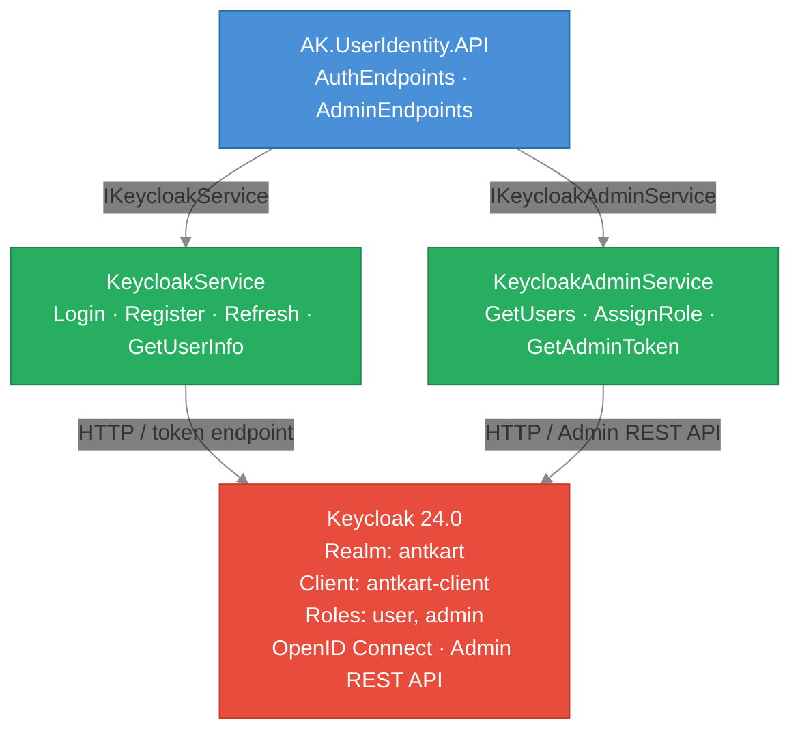
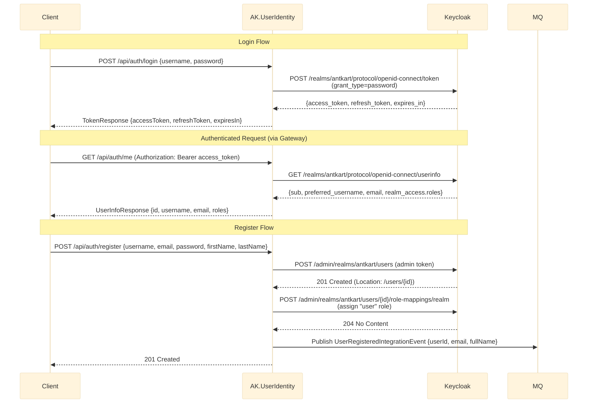
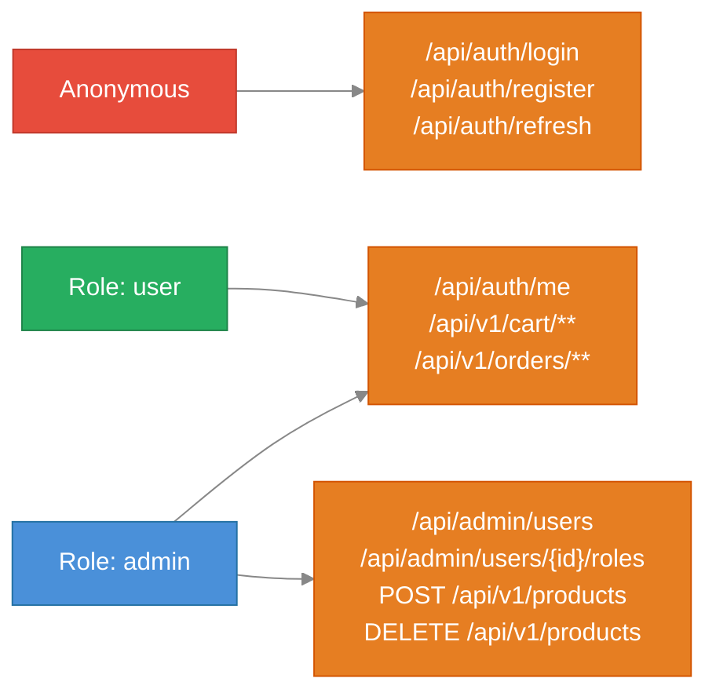
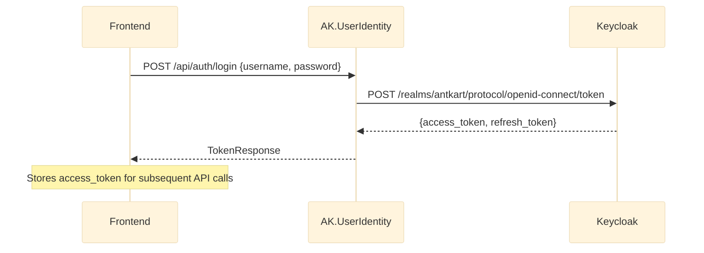
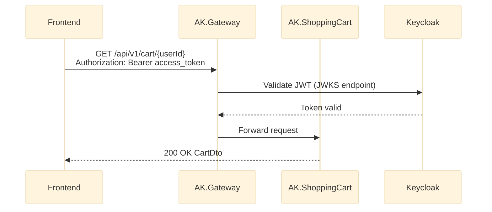
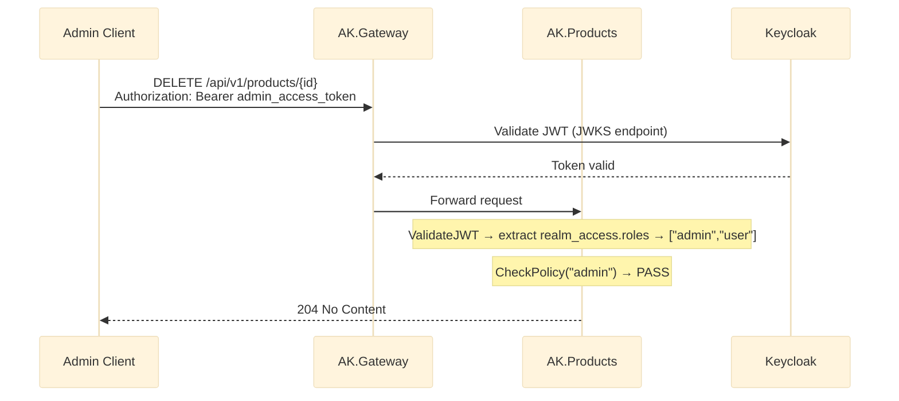

# AK.UserIdentity — Technical Design

## Overview

`AK.UserIdentity` is a thin REST proxy microservice that delegates authentication and user management to **Keycloak**, an open-source Identity and Access Management server. It exposes a clean REST API over Keycloak's OpenID Connect and Admin REST APIs, allowing other AntKart services and frontend clients to interact with identity without coupling directly to Keycloak's API.

---

## Architecture



---

## Project Structure

```
AK.UserIdentity/
  AK.UserIdentity.API/
    DTOs/
      AuthDtos.cs            — LoginRequest, RegisterRequest, TokenResponse,
                               RefreshRequest, UserInfoResponse, AssignRoleRequest,
                               KeycloakUserSummary
    Endpoints/
      AuthEndpoints.cs       — POST /login, POST /register, POST /refresh, GET /me
      AdminEndpoints.cs      — GET /users, POST /users/{id}/roles
    Middleware/
      ExceptionHandlerMiddleware.cs
    Services/
      IKeycloakService.cs    — IKeycloakService, IKeycloakAdminService interfaces
      KeycloakService.cs     — Login, Register, Refresh, GetUserInfo
      KeycloakAdminService.cs — GetUsers, AssignRole, GetAdminToken
    Program.cs
    appsettings.json
    Dockerfile
  AK.UserIdentity.Tests/
    Services/
      KeycloakServiceTests.cs
      KeycloakAdminServiceTests.cs
    Middleware/
      ExceptionHandlerMiddlewareTests.cs
```

---

## Keycloak Realm Configuration

**Realm:** `antkart`  
**Client:** `antkart-client` (confidential, direct access grants enabled, service accounts enabled)  
**Realm Roles:** `user`, `admin`

### Pre-seeded Users

| Username | Password | Roles        |
|----------|----------|--------------|
| `admin`  | `admin123` | admin, user |
| `user1`  | `user123`  | user        |
| `admin2` | `Admin2Pass!` | admin, user |

### Realm Import

The realm is auto-imported from `keycloak/antkart-realm.json` on Keycloak container startup via `--import-realm` flag. No manual setup is required after `docker-compose up`.

**Service account:** `service-account-antkart-client` is granted `realm-management` roles (`manage-users`, `view-users`, `query-users`, `view-realm`) in the realm JSON — required for the register and admin user list endpoints to call the Keycloak Admin REST API.

---

## REST API

**Base URL:** `http://localhost:5085` (dev) / `http://localhost:8084` (Docker)

### Auth Endpoints (`/api/auth`) — Anonymous

| Method | Path | Description |
|--------|------|-------------|
| POST | `/api/auth/login` | Login with username/password, returns JWT tokens |
| POST | `/api/auth/register` | Register new user (assigned `user` role by default) |
| POST | `/api/auth/refresh` | Exchange refresh token for new access token |
| GET | `/api/auth/me` | Get current user info (requires Bearer token) |

#### POST /api/auth/login

**Request:**
```json
{
  "username": "user1",
  "password": "user123"
}
```

**Response:**
```json
{
  "accessToken": "eyJhbGci...",
  "refreshToken": "eyJhbGci...",
  "expiresIn": 300,
  "tokenType": "Bearer"
}
```

#### POST /api/auth/register

**Request:**
```json
{
  "username": "newuser",
  "email": "newuser@example.com",
  "password": "SecurePass1!",
  "firstName": "New",
  "lastName": "User"
}
```

#### GET /api/auth/me

**Headers:** `Authorization: Bearer <access_token>`

**Response:**
```json
{
  "id": "uuid",
  "username": "user1",
  "email": "user1@antkart.com",
  "firstName": "Regular",
  "lastName": "User",
  "roles": ["user"]
}
```

### Admin Endpoints (`/api/admin`) — Admin role required

| Method | Path | Description |
|--------|------|-------------|
| GET | `/api/admin/users` | List all registered users |
| POST | `/api/admin/users/{id}/roles` | Assign a role to a user |

#### POST /api/admin/users/{id}/roles

**Request:**
```json
{
  "role": "admin"
}
```

---

## Authentication Flow



The access token is a **signed JWT** containing:
- `sub` — user ID
- `preferred_username` — username
- `realm_access.roles` — array of realm-level roles (`user`, `admin`)
- `exp`, `iat` — expiry and issued-at timestamps

---

## JWT Validation in Services

Every protected service validates the JWT using `AK.BuildingBlocks.Authentication.AuthenticationExtensions.AddKeycloakAuthentication()`:

1. Downloads Keycloak's OIDC discovery document from `{Authority}/.well-known/openid-configuration`
2. Validates signature against Keycloak's public key
3. Validates `iss`, `aud`, `exp` claims
4. Extracts roles from `realm_access.roles` and maps them to `ClaimTypes.Role`

---

## Authorization Matrix

| Service | Endpoint | Required Role |
|---------|----------|---------------|
| AK.Products | GET (all read endpoints) | Anonymous |
| AK.Products | POST, PUT, DELETE, bulk-insert, bulk-update | `admin` |
| AK.Discount | GetDiscount, GetAllDiscounts | Anonymous (gRPC metadata not required) |
| AK.Discount | CreateDiscount, UpdateDiscount, DeleteDiscount | `admin` (JWT in `authorization` metadata header) |
| AK.ShoppingCart | All endpoints | Authenticated (`user` or `admin`) |
| AK.Order | All endpoints | Authenticated (`user` or `admin`) |
| AK.UserIdentity | POST /login, POST /register, POST /refresh | Anonymous |
| AK.UserIdentity | GET /me | Authenticated |
| AK.UserIdentity | GET /admin/users, POST /admin/users/{id}/roles | `admin` |

### Role — Endpoint Access



---

## BuildingBlocks Auth Extensions

New additions to `AK.BuildingBlocks/Authentication/`:

### `KeycloakSettings`
```csharp
public sealed class KeycloakSettings
{
    public string Authority { get; init; }     // OIDC authority URL
    public string Audience { get; init; }      // expected audience (client ID)
    public bool RequireHttpsMetadata { get; init; }
    public string AdminUrl { get; init; }      // Keycloak base URL
    public string Realm { get; init; }
    public string ClientId { get; init; }
    public string ClientSecret { get; init; }
}
```

### `AuthenticationExtensions.AddKeycloakAuthentication()`
- Registers `JwtBearerDefaults.AuthenticationScheme`
- Sets authority, audience, validates token on each request
- Extracts `realm_access.roles` JSON claim → adds each role as `ClaimTypes.Role`
- Registers two authorization policies: `admin` (requires `admin` role), `authenticated` (any valid user)

### `AuthenticationExtensions.UseKeycloakAuth()`
- Calls `UseAuthentication()` + `UseAuthorization()` in the correct order

---

## Products → Discount gRPC Integration

### Design

```
GetProductByIdQuery or GetProductsQuery handler
    │
    └→ IDiscountGrpcClient.GetDiscountAsync(productId)
              │
              └→ DiscountProtoService.GetDiscount(GetDiscountRequest { product_id })
                        │
                        ← CouponModel { amount, discount_type, is_active, ... }
```

### Discount Price Computation

| Discount Type | Formula |
|---------------|---------|
| `Percentage` | `Price - Math.Round(Price × amount / 100, 2)` |
| `Fixed` | `Price - Math.Round(amount, 2)` |

If `is_active = false` or the discount service is unavailable (RpcException, network error), `DiscountPrice` remains `null`. No request fails due to discount service unavailability.

### Configuration

```json
"DiscountGrpc": {
  "Address": "http://ak-discount-grpc:8080"
}
```

---

## Keycloak Infrastructure

**Docker Image:** `quay.io/keycloak/keycloak:24.0`  
**Dev Port:** `8090` (Docker: `8090:8080`)  
**Admin Console:** `http://localhost:8090` (username: `admin`, password: `admin`)

Keycloak starts with `--import-realm` — the `keycloak/antkart-realm.json` file is mounted to `/opt/keycloak/data/import/` and imported automatically on first startup.

---

## Configuration (appsettings.json)

All services share the same Keycloak configuration block:

```json
"Keycloak": {
  "Authority": "http://localhost:8090/realms/antkart",
  "Audience": "antkart-client",
  "RequireHttpsMetadata": false,
  "AdminUrl": "http://localhost:8090",
  "Realm": "antkart",
  "ClientId": "antkart-client",
  "ClientSecret": "antkart-secret"
}
```

In Docker Compose, `localhost:8090` is replaced by `keycloak:8080` (internal Docker network).

---

## Integration Events

### Published by AK.UserIdentity

| Event | When | Consumer |
|-------|------|----------|
| `UserRegisteredIntegrationEvent(UserId, CustomerEmail, CustomerName)` | After successful registration and role assignment | **AK.Notification** → sends welcome email |

`KeycloakService.RegisterAsync` publishes `UserRegisteredIntegrationEvent` via `IPublishEndpoint` (MassTransit) after extracting the new user's UUID from the Keycloak `Location` header. This is publish-only — no consumers are registered in AK.UserIdentity.

**RabbitMq configuration:** `AddRabbitMqMassTransit(config, _ => { })` — empty consumer registration since this service only publishes.

---

## Error Handling

`ExceptionHandlerMiddleware` maps exceptions to HTTP status codes:

| Exception | HTTP Status |
|-----------|-------------|
| `UnauthorizedAccessException` | 403 |
| `KeyNotFoundException` | 404 |
| `InvalidOperationException` | 409 |
| `Exception` (catch-all) | 500 |

---

## Tests

**Total:** 17 tests

| Test Class | Count | Coverage |
|------------|-------|---------|
| `KeycloakServiceTests` | 9 | Login success/failure, refresh success/failure, getUserInfo success/failure, register publishes event, register conflict |
| `KeycloakAdminServiceTests` | 4 | GetUsers success/failure, AssignRole success/notFound |
| `ExceptionHandlerMiddlewareTests` | 4 | No exception (200), 404, 409, 500 |

All tests use `Moq.Protected` to mock `HttpMessageHandler` — no real HTTP calls, no Keycloak required. `KeycloakServiceTests` uses `Mock<IPublishEndpoint>` to verify `UserRegisteredIntegrationEvent` is published on successful registration.

---

## Running the Service

### Development (requires Keycloak running)
```bash
# Start Keycloak first
docker-compose up keycloak

# Run the service
cd AK.UserIdentity/AK.UserIdentity.API && dotnet run
# → http://localhost:5085/swagger
```

### All services via Docker Compose
```bash
docker-compose up --build
```
UserIdentity API: `http://localhost:8084/swagger`

---

## Sequence Diagrams

### Login Flow



### Protected Resource Access



### Admin-Only Operation


