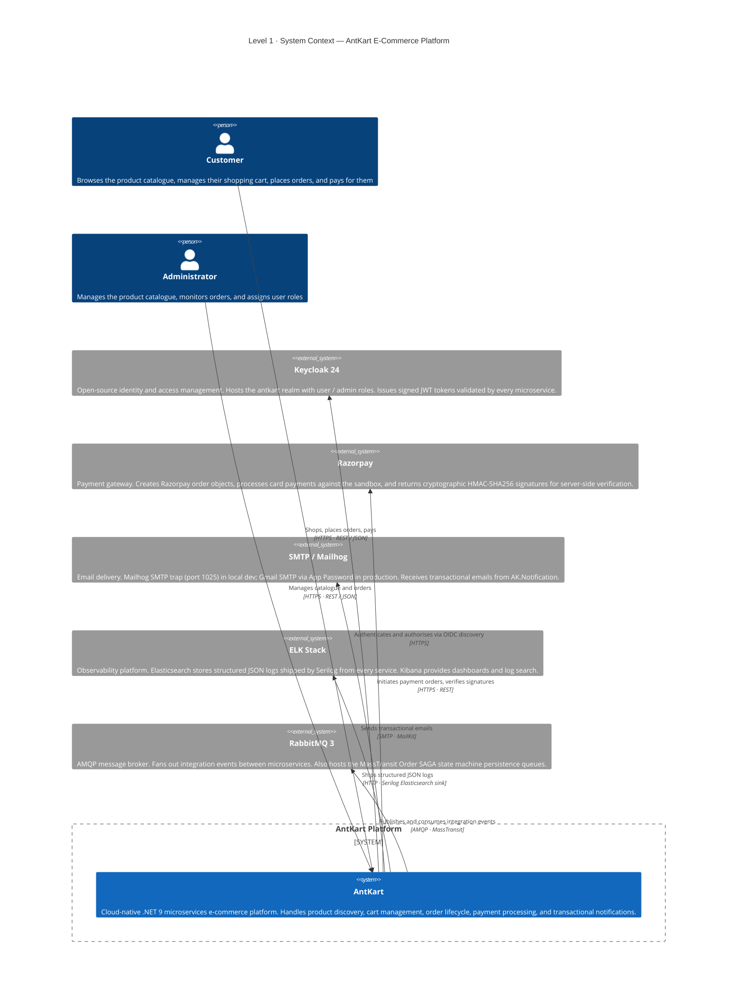
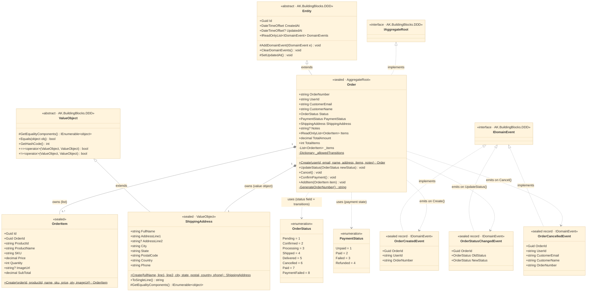
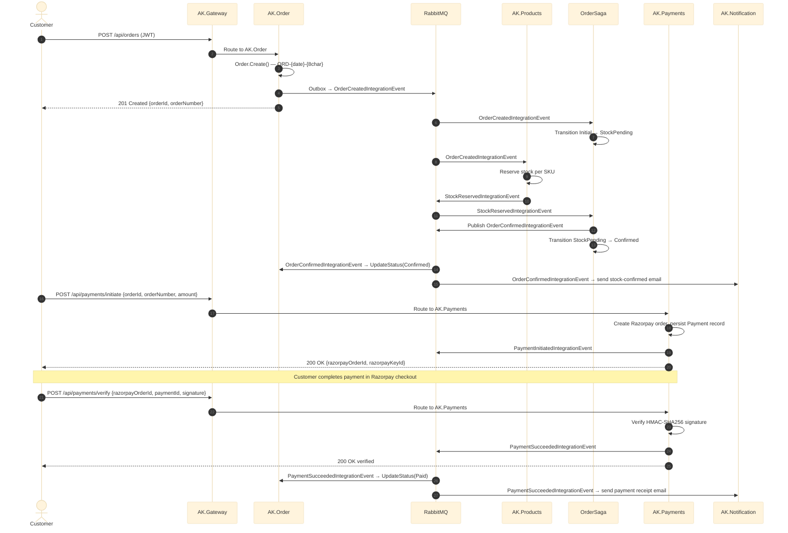

# AntKart — C4 Architecture

The [C4 model](https://c4model.com/) describes software architecture at four progressive levels of zoom. Each level answers a different question for a different audience.

| Level | Diagram type | Question | Audience |
|-------|-------------|----------|----------|
| 1 | System Context | Who uses AntKart and what external systems does it depend on? | Everyone |
| 2 | Container | What deployable units make up the platform and how do they communicate? | Architects, engineers |
| 3 | Component | How is AK.Order structured internally? | Developers of that service |
| 4 | Code | What classes form the Order domain model? | Developers writing domain code |

---

## Level 1 — System Context

AntKart is shown as a single system. The diagram reveals the two human actors and the five external systems the platform depends on.



### System Context — Element Reference

| Element | Role | Notes |
|---------|------|-------|
| **Customer** | End user | Interacts exclusively via the API Gateway |
| **Administrator** | Platform admin | Same entry point; elevated `admin` Keycloak role unlocks write and management endpoints |
| **AntKart** | Software system | Eight independently deployable microservices behind a single gateway |
| **Keycloak 24** | External — Identity | Realm: `antkart`; Client: `antkart-client` (confidential); validates `azp` claim per service |
| **Razorpay** | External — Payments | Sandbox mode; test cards: `4111 1111 1111 1111` (Visa), `5267 3169 4984 2643` (MC) |
| **SMTP / Mailhog** | External — Email | Mailhog web UI at `http://localhost:8025`; switch to Gmail via `docker-compose.gmail.yml` |
| **ELK Stack** | External — Observability | Elasticsearch on port 9200; Kibana on port 5601 |
| **RabbitMQ** | External — Messaging | Management UI at `http://localhost:15672` (guest / guest) |

---

## Level 2 — Container

Each box in this diagram is a separately deployable unit with its own database, codebase, and process.

```mermaid
%%{init: {'theme': 'base', 'themeVariables': {'lineColor': '#888888', 'edgeLabelBackground': '#00000000'}}}%%
C4Container
    title Level 2 · Container — AntKart Platform

    Person(customer, "Customer", "End user")
    Person(admin, "Administrator", "Platform admin")

    System_Ext(keycloak, "Keycloak 24", "Identity provider · OIDC")
    System_Ext(razorpay, "Razorpay", "Payment gateway")
    System_Ext(smtp_ext, "SMTP / Mailhog", "Email delivery")
    System_Ext(rabbitmq_ext, "RabbitMQ", "AMQP message broker")
    System_Ext(elk_ext, "ELK Stack", "Structured log store")

    System_Boundary(antkart_boundary, "AntKart Platform") {

        Container(gateway, "AK.Gateway", "Ocelot 23.4 · .NET 9 · port 9090", "Single entry point for all external traffic. Handles JWT passthrough auth, per-route rate limiting (10–30 RPS), and QoS circuit breaker. Routes to all seven downstream REST services.")

        Container(identity, "AK.UserIdentity", "Minimal API · .NET 9 · port 8084", "Keycloak proxy. Exposes login, register, token refresh, /me, admin user list, and role assignment. No database — delegates entirely to Keycloak Admin REST API.")
        Container(products, "AK.Products", "Minimal API · .NET 9 · port 8080", "Product catalogue. CRUD with category/sub-category filtering. Calls AK.Discount via gRPC to enrich responses with discounted prices. Consumes OrderCreated to reserve stock.")
        Container(discount, "AK.Discount", "gRPC · .NET 9 · port 8081", "Discount coupon service. Exposes GetDiscount RPC called by AK.Products. 300 seed coupons keyed by SKU.")
        Container(cart, "AK.ShoppingCart", "Minimal API · .NET 9 · port 8082", "Shopping cart. Add, update quantity, remove item, clear. Serialised as JSON snapshots in Redis with 30-day TTL. userId always from JWT — never from URL or body.")
        Container(order, "AK.Order", "Minimal API · .NET 9 · port 8083", "Order lifecycle. Creates orders, drives an SAGA for stock reservation and payment confirmation, updates status, cancels. EF Core Outbox guarantees at-least-once event delivery.")
        Container(payments, "AK.Payments", "Minimal API · .NET 9 · port 8085", "Payment processing. Initiates Razorpay orders, verifies HMAC-SHA256 signatures, persists saved cards (Razorpay token IDs only — PCI compliant). Publishes payment outcome events.")
        Container(notification, "AK.Notification", "Minimal API · .NET 9 · port 8086", "Event-driven email notifications. Consumes six integration events; renders HTML templates; dispatches via MailKit. Background service deletes records older than 90 days.")

        ContainerDb(mongodb, "MongoDB", "AKProductsDb · Products collection", "Document store for the product catalogue. StringEntity IDs (32-char hex GUID). BsonClassMap registered in Infrastructure — no Bson attributes on domain entities.")
        ContainerDb(sqlite, "SQLite", "discount.db · /app/data", "Relational store for coupon records. EF Core code-first migrations. Persisted via named Docker volume.")
        ContainerDb(redis, "Redis", "AKCart:cart:{userId}", "In-memory key-value store for cart snapshots. One key per user; 30-day sliding TTL.")
        ContainerDb(pg_orders, "PostgreSQL", "AKOrdersDb", "Relational store for orders, order items, SAGA state machine rows, and Outbox messages. EF Core 9 + Npgsql with Exponential back-off resilience.")
        ContainerDb(pg_pay_notif, "PostgreSQL", "AKPaymentsDb · AKNotificationsDb", "Payments: payment records and saved card tokens. Notifications: notification history. Two logical databases on the same PostgreSQL instance.")
    }

    Rel(customer, gateway, "All requests", "HTTPS · port 9090")
    Rel(admin, gateway, "All admin requests", "HTTPS · port 9090")

    Rel(gateway, identity, "Routes /api/auth/** · /api/admin/**", "HTTP")
    Rel(gateway, products, "Routes /api/v1/products/**", "HTTP")
    Rel(gateway, cart, "Routes /api/v1/cart/**", "HTTP")
    Rel(gateway, order, "Routes /api/orders/**", "HTTP")
    Rel(gateway, payments, "Routes /api/payments/**", "HTTP")
    Rel(gateway, notification, "Routes /gateway/notifications/**", "HTTP")

    Rel(identity, keycloak, "Token issue, user CRUD, role assignment", "HTTPS · Keycloak Admin REST API")
    Rel(gateway, keycloak, "Validates JWT on protected routes", "HTTPS · JWKS")

    Rel(products, discount, "GetDiscount(sku) per product", "gRPC · proto3")
    Rel(products, mongodb, "CRUD products", "MongoDB.Driver 3.3")
    Rel(discount, sqlite, "CRUD coupons", "EF Core 9 · SQLite")
    Rel(cart, redis, "Get / Set cart snapshots", "StackExchange.Redis")
    Rel(order, pg_orders, "CRUD orders · SAGA state · Outbox", "EF Core 9 · Npgsql")
    Rel(payments, pg_pay_notif, "CRUD payments and saved cards", "EF Core 9 · Npgsql")
    Rel(notification, pg_pay_notif, "Persist and query notifications", "EF Core 9 · Npgsql")

    Rel(payments, razorpay, "Create order, verify signature", "HTTPS · Razorpay SDK")
    Rel(notification, smtp_ext, "Send HTML emails", "SMTP · MailKit")

    Rel(order, rabbitmq_ext, "Publishes: OrderCreated, OrderConfirmed, OrderCancelled", "AMQP · MassTransit Outbox")
    Rel(payments, rabbitmq_ext, "Publishes: PaymentInitiated, PaymentSucceeded, PaymentFailed", "AMQP · MassTransit")
    Rel(identity, rabbitmq_ext, "Publishes: UserRegistered", "AMQP · MassTransit")
    Rel(rabbitmq_ext, products, "Consumes: OrderCreated → reserve stock", "AMQP · MassTransit")
    Rel(rabbitmq_ext, order, "Consumes: StockReserved, StockFailed, PaymentSucceeded, PaymentFailed", "AMQP · MassTransit SAGA + consumers")
    Rel(rabbitmq_ext, notification, "Consumes: all six integration events → email dispatch", "AMQP · MassTransit")

    Rel(products, elk_ext, "Structured logs", "HTTP · Serilog")
    Rel(order, elk_ext, "Structured logs", "HTTP · Serilog")
    Rel(payments, elk_ext, "Structured logs", "HTTP · Serilog")
    Rel(notification, elk_ext, "Structured logs", "HTTP · Serilog")
```



### Container Reference

| Container | Tech | DB | Local port | Docker port |
|-----------|------|----|-----------|-------------|
| AK.Gateway | Ocelot 23.4 | — | 8000 | 9090 |
| AK.UserIdentity | Minimal API | Keycloak (external) | 5085 | 8084 |
| AK.Products | Minimal API | MongoDB | 5077 | 8080 |
| AK.Discount | gRPC | SQLite | 5001 | 8081 |
| AK.ShoppingCart | Minimal API | Redis | 5079 | 8082 |
| AK.Order | Minimal API | PostgreSQL (AKOrdersDb) | 5080 | 8083 |
| AK.Payments | Minimal API | PostgreSQL (AKPaymentsDb) | 5086 | 8085 |
| AK.Notification | Minimal API | PostgreSQL (AKNotificationsDb) | 5087 | 8086 |

---

## Level 3 — Component: AK.Order

AK.Order is the most architecturally rich service — it combines CQRS, a SAGA state machine, the EF Core Outbox pattern, and a domain model with a status state machine.

```mermaid
%%{init: {'theme': 'base', 'themeVariables': {'lineColor': '#888888', 'edgeLabelBackground': '#00000000'}}}%%
C4Component
    title Level 3 · Component — AK.Order Microservice

    Person(caller, "API Caller", "Customer or Administrator via AK.Gateway")
    System_Ext(rabbitmq_ext, "RabbitMQ", "AMQP message broker")
    System_Ext(postgres_ext, "PostgreSQL", "AKOrdersDb")

    Container_Boundary(order_service, "AK.Order (.NET 9 Minimal API)") {

        Component(endpoints, "OrderEndpoints", "Minimal API · MapGroup /api/orders", "Maps HTTP verbs to MediatR Send() calls. Derives userId from JWT sub claim — never from URL or body. Enforces RequireAuthorization(admin) on PUT /status. Returns 403 on ownership mismatch.")
        Component(middleware, "ExceptionHandlerMiddleware", "ASP.NET Middleware", "Catches exceptions from the entire pipeline. Maps ValidationException→400, UnauthorizedAccessException→403, KeyNotFoundException→404, InvalidOperationException→409, Exception→500.")
        Component(mediator, "MediatR 12.4", "In-process command bus", "Dispatches IRequest objects to exactly one handler. Runs the ValidationBehavior pipeline step before every handler invocation.")
        Component(validation, "ValidationBehavior + FluentValidation", "MediatR Pipeline Behavior", "Pre-handler step. If any validator fails, throws FluentValidation.ValidationException — caught by middleware and returned as 400 with field-level errors.")

        Component(create_cmd, "CreateOrderCommandHandler", "Command Handler", "Creates the Order aggregate via Order.Create(). Generates ORD-{yyyyMMdd}-{8char} order number. Adds via UoW. On SaveChanges, Outbox publishes OrderCreatedIntegrationEvent to RabbitMQ.")
        Component(update_cmd, "UpdateOrderStatusCommandHandler", "Command Handler", "Calls order.UpdateStatus(newStatus). Domain state machine enforces valid transitions. Returns Result~OrderDto~ — IsSuccess=false on invalid transition yields HTTP 409 without throwing.")
        Component(cancel_cmd, "CancelOrderCommandHandler", "Command Handler", "Calls order.Cancel(). Returns Result~bool~. Publishes OrderCancelledIntegrationEvent. Returns failure Result if already Cancelled or Delivered — no exception thrown for expected business failures.")
        Component(get_by_id, "GetOrderByIdQueryHandler", "Query Handler", "Fetches single order by GUID. Compares order.UserId against JWT sub — returns 403 via UnauthorizedAccessException if not owner and caller is not admin.")
        Component(get_orders, "GetOrdersQueryHandler", "Query Handler", "Returns PagedResult~OrderDto~ with optional status and date filters. Admin access only.")
        Component(get_by_user, "GetOrdersByUserQueryHandler", "Query Handler", "Returns paged orders for the authenticated user. userId sourced exclusively from JWT.")

        Component(payment_ok, "PaymentSucceededConsumer", "MassTransit Consumer", "Receives PaymentSucceededIntegrationEvent from RabbitMQ. Sends UpdateOrderStatusCommand(Paid) via MediatR to update the order row atomically.")
        Component(payment_fail, "PaymentFailedConsumer", "MassTransit Consumer", "Receives PaymentFailedIntegrationEvent from RabbitMQ. Sends UpdateOrderStatusCommand(PaymentFailed) via MediatR.")
        Component(order_confirmed_consumer, "OrderConfirmedConsumer", "MassTransit Consumer", "Receives OrderConfirmedIntegrationEvent. Sends UpdateOrderStatusCommand(Confirmed) to finalize SAGA outcome in the order row.")
        Component(order_cancelled_consumer, "OrderCancelledConsumer", "MassTransit Consumer", "Receives OrderCancelledIntegrationEvent from SAGA. Sends UpdateOrderStatusCommand(Cancelled).")

        Component(saga, "OrderSaga (MassTransitStateMachine)", "SAGA State Machine", "States: Initial → StockPending → (Confirmed | Cancelled). Triggered by OrderCreated; waits for StockReserved or StockReservationFailed. Publishes OrderConfirmed or OrderCancelled integration events. State persisted to PostgreSQL between hops.")

        Component(repo, "OrderRepository", "Repository · IOrderRepository", "EF Core IQueryable-backed queries. GetByIdAsync, FindAsync with ISpecification, AddAsync, UpdateAsync. Never exposes IQueryable beyond the Infrastructure boundary.")
        Component(uow, "UnitOfWork", "Unit of Work · IUnitOfWork", "Wraps OrderDbContext. SaveChangesAsync dispatches domain events via MassTransit Outbox, then commits the transaction. Single unit: order row + outbox message written atomically.")
        Component(dbctx, "OrderDbContext", "EF Core 9 · DbContext", "Owns: Orders table (with OwnsOne ShippingAddress, OwnsMany OrderItems), SAGA state table, Outbox message table, Outbox state table. All config via fluent API in OnModelCreating.")
    }

    Rel(caller, endpoints, "HTTP verbs", "REST / JSON · JWT Bearer")
    Rel(endpoints, middleware, "Exceptions caught by", "ASP.NET pipeline")
    Rel(endpoints, mediator, "Send(command | query)")
    Rel(mediator, validation, "Pipeline step — validates before handler")
    Rel(mediator, create_cmd, "CreateOrderCommand")
    Rel(mediator, update_cmd, "UpdateOrderStatusCommand")
    Rel(mediator, cancel_cmd, "CancelOrderCommand")
    Rel(mediator, get_by_id, "GetOrderByIdQuery")
    Rel(mediator, get_orders, "GetOrdersQuery")
    Rel(mediator, get_by_user, "GetOrdersByUserQuery")
    Rel(create_cmd, uow, "AddAsync + SaveChangesAsync")
    Rel(update_cmd, uow, "UpdateAsync + SaveChangesAsync")
    Rel(cancel_cmd, uow, "UpdateAsync + SaveChangesAsync")
    Rel(get_by_id, repo, "GetByIdAsync")
    Rel(get_orders, repo, "FindAsync(spec)")
    Rel(get_by_user, repo, "FindAsync(spec)")
    Rel(repo, dbctx, "EF Core queries")
    Rel(uow, dbctx, "SaveChangesAsync")
    Rel(uow, dbctx, "Outbox enqueue on SaveChanges")
    Rel(dbctx, postgres_ext, "Schema: orders, saga_state, outbox_*", "EF Core migrations · Npgsql")
    Rel(dbctx, rabbitmq_ext, "Outbox relay forwards events", "AMQP · MassTransit relay worker")
    Rel(rabbitmq_ext, saga, "OrderCreated, StockReserved, StockFailed", "AMQP · fan-out exchanges")
    Rel(saga, dbctx, "Reads / writes saga state row", "EF Core")
    Rel(saga, rabbitmq_ext, "Publishes OrderConfirmed / OrderCancelled", "AMQP")
    Rel(rabbitmq_ext, payment_ok, "PaymentSucceeded event", "AMQP")
    Rel(rabbitmq_ext, payment_fail, "PaymentFailed event", "AMQP")
    Rel(rabbitmq_ext, order_confirmed_consumer, "OrderConfirmed event", "AMQP")
    Rel(rabbitmq_ext, order_cancelled_consumer, "OrderCancelled event", "AMQP")
    Rel(payment_ok, mediator, "Send(UpdateOrderStatusCommand(Paid))")
    Rel(payment_fail, mediator, "Send(UpdateOrderStatusCommand(PaymentFailed))")
    Rel(order_confirmed_consumer, mediator, "Send(UpdateOrderStatusCommand(Confirmed))")
    Rel(order_cancelled_consumer, mediator, "Send(UpdateOrderStatusCommand(Cancelled))")
```



### Component Reference — AK.Order

| Component | Layer | Pattern | Key behaviour |
|-----------|-------|---------|--------------|
| OrderEndpoints | API | Minimal API | JWT-only userId; ownership checks on GET and DELETE |
| ExceptionHandlerMiddleware | API | Middleware | Translates domain exceptions to RFC 7807 HTTP responses |
| MediatR | Application | Command bus | Decouples endpoints from handlers; enables pipeline behaviors |
| ValidationBehavior | Application | Pipeline | Fail-fast before any handler; 400 on first invalid request |
| CreateOrderCommandHandler | Application | Command | Throws on failure (unexpected); uses Outbox for event delivery |
| UpdateOrderStatusCommandHandler | Application | Command | Returns `Result<OrderDto>` — 409 without exception for expected failures |
| CancelOrderCommandHandler | Application | Command | Returns `Result<bool>` — 409 without exception for expected failures |
| OrderSaga | Application | SAGA | Orchestrates async stock check; survives service restarts via PostgreSQL state |
| PaymentSucceeded/FailedConsumers | Application | Consumer | Close the payment→order feedback loop |
| OrderRepository | Infrastructure | Repository | Thin EF Core wrapper; Specification pattern for complex filters |
| UnitOfWork | Infrastructure | UoW | Atomic: DB row + Outbox message in one transaction |
| OrderDbContext | Infrastructure | EF Core | Owns SAGA state + Outbox tables alongside business tables |

---

## Level 4 — Code: Order Domain Model

This diagram shows the class structure inside `AK.Order.Domain` — the innermost layer with no dependencies on infrastructure or application concerns.



### Domain Model Notes

**State machine (enforced by `_allowedTransitions`):**

```
Pending       → Confirmed | Cancelled | PaymentFailed
Confirmed     → Processing | Shipped | Cancelled
Processing    → Shipped | Cancelled
Shipped       → Delivered
Paid          → Confirmed | Cancelled
PaymentFailed → Pending | Cancelled
Delivered     ← terminal (no outbound transitions)
Cancelled     ← terminal (no outbound transitions)
```

`UpdateStatus()` throws `InvalidOperationException` for any unlisted transition. `UpdateOrderStatusCommandHandler` catches this and wraps it in `Result<OrderDto>.Failure(msg)` — the endpoint returns HTTP 409 without an unhandled exception.

**Why `ValueObject` for `ShippingAddress`?**
Shipping addresses are compared by value, not identity. Two `ShippingAddress` instances with identical fields are equal. `OwnsOne<ShippingAddress>` in EF Core maps all fields into the `Orders` table directly (prefixed `Ship*`) — no separate table or join needed.

**Why `IDomainEvent` from BuildingBlocks?**
All eight microservices share the same marker interface. `Entity.ClearDomainEvents()` is called by the Unit of Work after publishing — preventing double-dispatch on retry.

---

## Event Flow Across Levels

The diagram below ties all four levels together by showing the happy-path order placement flow end-to-end.


