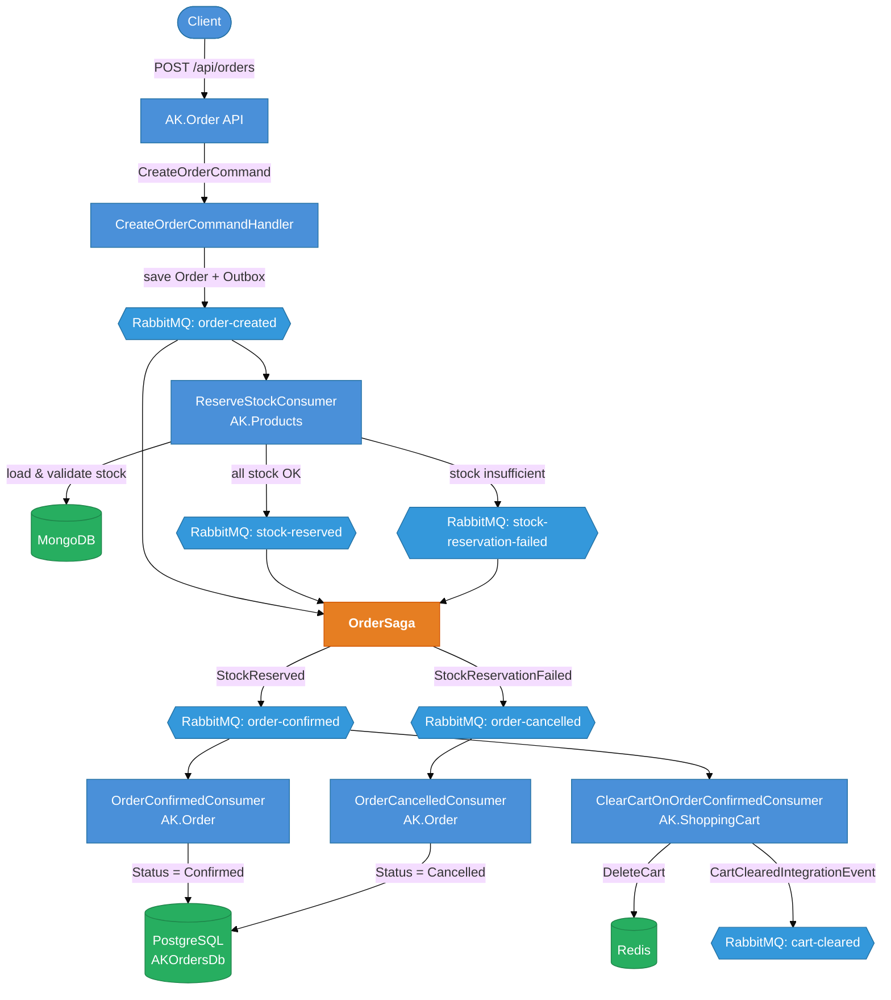
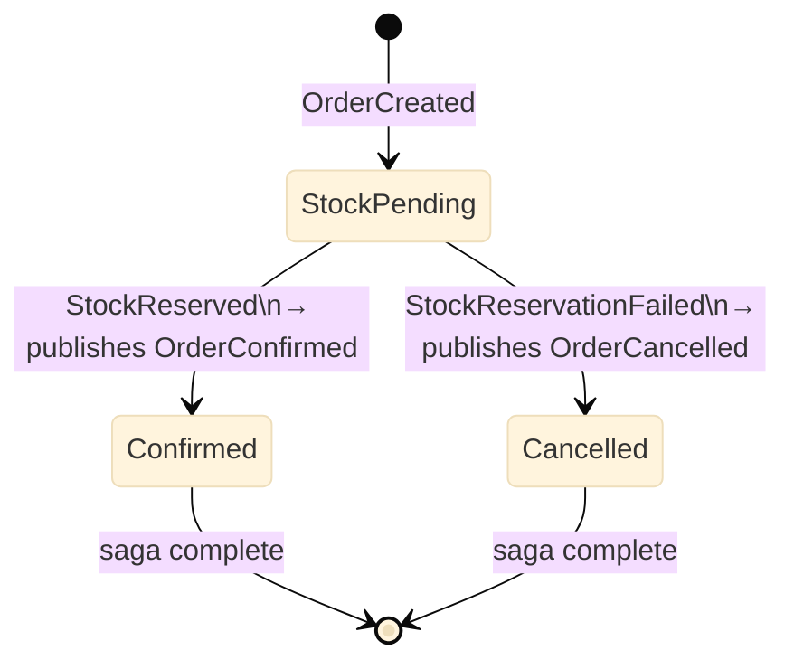
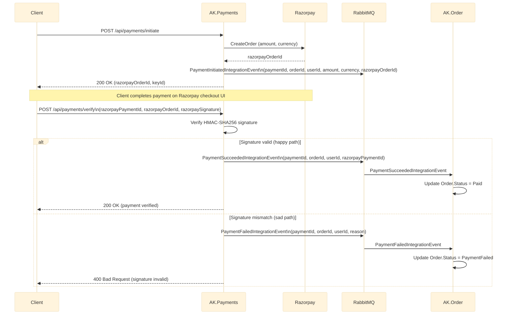

# AntKart — Event Bus Technical Design

## Overview

Async communication between microservices uses **MassTransit 8.3.6** with **RabbitMQ 3.13** as the message broker. The order flow implements a **SAGA choreography pattern** with an **EF Core Outbox** to guarantee at-least-once delivery and prevent dual-write problems.

---

## Event Flow



---

## Integration Events (AK.BuildingBlocks)

| Event | Publisher | Subscribers |
|-------|-----------|-------------|
| `OrderCreatedIntegrationEvent` | AK.Order (handler) | AK.Order (OrderSaga) |
| `StockReservedIntegrationEvent` | AK.Products | AK.Order (OrderSaga) |
| `StockReservationFailedIntegrationEvent` | AK.Products | AK.Order (OrderSaga) |
| `OrderConfirmedIntegrationEvent` | AK.Order (OrderSaga) | AK.Order (consumer), AK.ShoppingCart (consumer) |
| `OrderCancelledIntegrationEvent` | AK.Order (OrderSaga) | AK.Order (consumer) |
| `CartClearedIntegrationEvent` | AK.ShoppingCart | — |
| `PaymentInitiatedIntegrationEvent` | AK.Payments | — |
| `PaymentSucceededIntegrationEvent` | AK.Payments | AK.Order (updates status → Paid) |
| `PaymentFailedIntegrationEvent` | AK.Payments | AK.Order (updates status → PaymentFailed) |

All events implement `IIntegrationEvent` and are `sealed record` types in `AK.BuildingBlocks/Messaging/IntegrationEvents/`.

**Payment event payloads:**

| Event | Fields |
|-------|--------|
| `PaymentInitiatedIntegrationEvent` | `paymentId`, `orderId`, `userId`, `amount`, `currency`, `razorpayOrderId` |
| `PaymentSucceededIntegrationEvent` | `paymentId`, `orderId`, `userId`, `razorpayPaymentId` |
| `PaymentFailedIntegrationEvent` | `paymentId`, `orderId`, `userId`, `reason` |

---

## SAGA State Machine

Location: `AK.Order/AK.Order.Application/Sagas/OrderSaga.cs`

> The saga runs entirely within the **AK.Order** service, persisted to PostgreSQL via EF Core.



**Correlation:** `OrderCreatedIntegrationEvent.OrderId` → `CorrelationId`

**State persistence:** PostgreSQL via EF Core (`order_saga_states` table), optimistic concurrency with `Version` column.

---

## Payment Event Flow



---

## EF Core Outbox

The `OrderDbContext` includes MassTransit outbox entities:

```csharp
modelBuilder.AddInboxStateEntity();
modelBuilder.AddOutboxMessageEntity();
modelBuilder.AddOutboxStateEntity();
```

`CreateOrderCommandHandler` calls `IPublishEndpoint.Publish()` within the same EF Core transaction. MassTransit intercepts the call, stores the event in `outbox_message`, and delivers it after the DB commit — guaranteeing the order is never saved without the event being delivered.

---

## RabbitMQ Configuration

```json
"RabbitMq": {
  "Host": "rabbitmq",
  "VirtualHost": "/",
  "Username": "guest",
  "Password": "guest"
}
```

Exchange and queue names are auto-formatted by MassTransit using kebab-case convention (e.g., `order-created-integration-event`).

**Global retry policy** (configured in `MassTransitExtensions`):
- 3 retries with exponential back-off: 1s, 3s, 9s

---

## ReserveStockConsumer (AK.Products)

Location: `AK.Products/AK.Products.Application/Consumers/ReserveStockConsumer.cs`

1. Loads each product by ProductId from MongoDB
2. Validates all items have sufficient stock before applying any decrement (all-or-nothing)
3. On success: calls `Product.DecrementStock()` for each item, saves, publishes `StockReservedIntegrationEvent`
4. On failure: publishes `StockReservationFailedIntegrationEvent` with reason

> **Note:** MongoDB does not support multi-document transactions without a replica set. The consumer uses optimistic all-or-nothing validation before applying changes. `ConcurrentMessageLimit = 1` prevents race conditions in the test harness. For production at high scale, consider a MongoDB replica set.

---

## ClearCartOnOrderConfirmedConsumer (AK.ShoppingCart)

Location: `AK.ShoppingCart/AK.ShoppingCart.Application/Consumers/ClearCartOnOrderConfirmedConsumer.cs`

- Consumes `OrderConfirmedIntegrationEvent`
- Reads `UserId` from the event
- Calls `IUnitOfWork.Carts.DeleteAsync(userId)` if the cart exists
- Publishes `CartClearedIntegrationEvent`

---

## Order Consumers (AK.Order)

| Consumer | Event | Action |
|----------|-------|--------|
| `OrderConfirmedConsumer` | `OrderConfirmedIntegrationEvent` | Updates `Order.Status = Confirmed` |
| `OrderCancelledConsumer` | `OrderCancelledIntegrationEvent` | Updates `Order.Status = Cancelled` |
| `PaymentSucceededConsumer` | `PaymentSucceededIntegrationEvent` | Updates `Order.Status = Paid` |
| `PaymentFailedConsumer` | `PaymentFailedIntegrationEvent` | Updates `Order.Status = PaymentFailed` |

These keep the Order aggregate's status in sync after the SAGA finalises or payment completes.

---

## MassTransit Registration

Each service registers via `AddRabbitMqMassTransit()` (BuildingBlocks helper):

```csharp
// AK.Order
services.AddRabbitMqMassTransit(configuration, cfg =>
{
    cfg.AddSagaStateMachine<OrderSaga, OrderSagaState>()
       .EntityFrameworkRepository(r =>
       {
           r.ConcurrencyMode = ConcurrencyMode.Optimistic;
           r.ExistingDbContext<OrderDbContext>();
           r.UsePostgres();
       });
    cfg.AddEntityFrameworkOutbox<OrderDbContext>(o =>
    {
        o.UsePostgres();
        o.UseBusOutbox();
    });
    cfg.AddConsumer<OrderConfirmedConsumer>();
    cfg.AddConsumer<OrderCancelledConsumer>();
    cfg.AddConsumer<PaymentSucceededConsumer>();
    cfg.AddConsumer<PaymentFailedConsumer>();
});

// AK.Products
services.AddRabbitMqMassTransit(configuration, cfg =>
{
    cfg.AddConsumer<ReserveStockConsumer>();
});

// AK.ShoppingCart
services.AddRabbitMqMassTransit(configuration, cfg =>
{
    cfg.AddConsumer<ClearCartOnOrderConfirmedConsumer>();
});

// AK.Payments
services.AddRabbitMqMassTransit(configuration, cfg =>
{
    // publishes PaymentInitiatedIntegrationEvent,
    //           PaymentSucceededIntegrationEvent,
    //           PaymentFailedIntegrationEvent
});
```

---

## EF Core Migration

The `AddSagaAndOutbox` migration creates:

- `order_saga_states` — saga state table
- `InboxState` — MassTransit inbox deduplication
- `OutboxMessage` — outbox event store
- `OutboxState` — outbox delivery tracking

Run: `dotnet ef database update` from `AK.Order.Infrastructure` startup.
