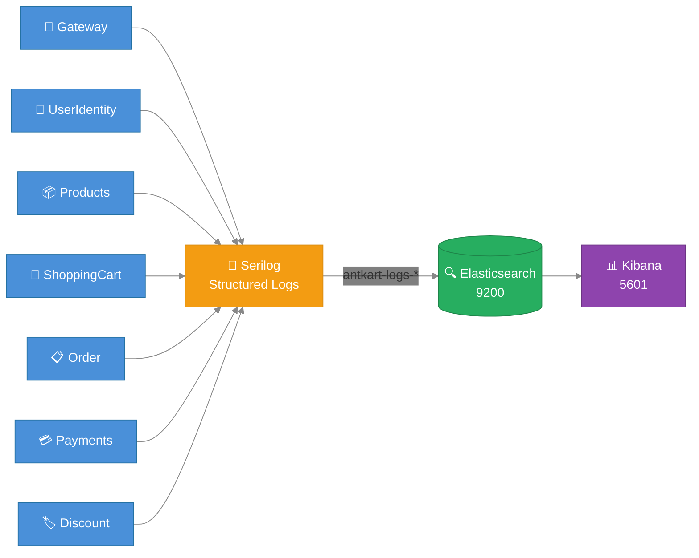

# AntKart — Observability Technical Design

## Overview

All AntKart services emit structured JSON logs via **Serilog**, shipped to **Elasticsearch 8.13.0** and visualised in **Kibana 8.13.0**. The stack runs as part of `docker-compose.yml`.

---

## Stack

| Component | Version | Port | Purpose |
|-----------|---------|------|---------|
| Elasticsearch | 8.13.0 | 9200 | Log storage + full-text search |
| Kibana | 8.13.0 | 5601 | Log visualisation |
| Serilog.Sinks.Elasticsearch | 9.0.3 | — | Ships logs from each service |

---

## Services Emitting Logs

| Service | Port (Docker) | ServiceName | Notes |
|---------|---------------|-------------|-------|
| AK.Gateway | 8000 | AK.Gateway | Ocelot edge routing |
| AK.UserIdentity | 8084 | AK.UserIdentity.API | Keycloak proxy |
| AK.Products | 8080 | AK.Products.API | MongoDB |
| AK.ShoppingCart | 8082 | AK.ShoppingCart.API | Redis |
| AK.Order | 8083 | AK.Order.API | PostgreSQL |
| AK.Payments | 8085 | AK.Payments.API | PostgreSQL + Razorpay |
| AK.Discount | 8081 | AK.Discount.Grpc | SQLite gRPC |

---

## Log Flow



---

## Configuration

`appsettings.json` in each service:

```json
"Elasticsearch": {
  "Url": ""
}
```

`docker-compose.yml` injects the real URL:

```yaml
environment:
  - Elasticsearch__Url=http://elasticsearch:9200
```

Leave `Url` blank in local dev to skip ES shipping and log to console only.

---

## Serilog Setup (BuildingBlocks)

`SerilogExtensions.AddSerilogLogging()` automatically adds the ES sink when the URL is present:

```csharp
var esUrl = configuration["Elasticsearch:Url"];
if (!string.IsNullOrWhiteSpace(esUrl))
{
    logConfig.WriteTo.Elasticsearch(new ElasticsearchSinkOptions(new Uri(esUrl))
    {
        AutoRegisterTemplate = true,
        AutoRegisterTemplateVersion = AutoRegisterTemplateVersion.ESv7,
        IndexFormat = $"antkart-logs-{environment.ToLower()}-{{0:yyyy.MM}}",
        ModifyConnectionSettings = conn =>
            conn.ServerCertificateValidationCallback((_, _, _, _) => true)
    });
}
```

**Index format:** `antkart-logs-production-2026.04`

**Log enrichment:** Each log entry includes:
- `ServiceName` — from `IHostEnvironment.ApplicationName`
- `Environment` — from `ASPNETCORE_ENVIRONMENT`
- `CorrelationId` — from `X-Correlation-Id` header (via `CorrelationIdMiddleware`)

---

## Structured Log Examples

### Order Service
```
OrderId={OrderId} UserId={UserId} Status={Status}
```

### Payments Service
```
PaymentId={PaymentId} OrderId={OrderId} RazorpayOrderId={RazorpayOrderId}   ← payment initiated
PaymentId={PaymentId} verified via Razorpay                                  ← payment succeeded
PaymentId={PaymentId} reason={Reason}                                        ← payment failed
```

---

## Kibana — Full Setup Guide

### Access
| URL | `http://localhost:5601` |
|-----|------------------------|
| No login required | Security is disabled (`xpack.security.enabled=false`) |

---

### Step 1 — Verify Elasticsearch received logs

Before creating a data view, confirm logs are actually arriving.

Open in your browser:
```
http://localhost:9200/_cat/indices?v
```

You should see a row like:
```
health status index                            ...  docs.count
green  open   antkart-logs-production-2026.05  ...  1234
```

If the index is missing: the services haven't started yet, or Elasticsearch isn't healthy. Check:
```
http://localhost:9200/_cluster/health?pretty
```
`status` should be `green` or `yellow` (never `red`).

---

### Step 2 — Create a Data View in Kibana

1. Open `http://localhost:5601`
2. Click the **hamburger menu** (≡) top-left → **Stack Management**
3. Under **Kibana** → click **Data Views**
4. Click **Create data view** (top-right button)
5. Fill in:
   - **Name:** `AntKart Logs`
   - **Index pattern:** `antkart-logs-*`
   - **Timestamp field:** `@timestamp`
6. Click **Save data view to Kibana**

You only need to do this once — Kibana remembers it across restarts (data is stored in Elasticsearch).

---

### Step 3 — Open Discover

1. Click the **hamburger menu** (≡) → **Discover**
2. Select the **AntKart Logs** data view from the dropdown (top-left, below the search bar)
3. Set the time range (top-right) to **Last 1 hour** or **Today**
4. Click **Refresh** — all log entries from all services appear

Each row is one log event. The important columns are:

| Field | Meaning |
|-------|---------|
| `@timestamp` | When the log was emitted |
| `level` | `INF`, `WRN`, `ERR`, `DBG` |
| `message` | The rendered log message |
| `ServiceName` | Which microservice emitted it (e.g. `AK.Order.API`) |
| `CorrelationId` | Request trace ID — same across all services for one user request |
| `SourceContext` | Class that logged it (e.g. `AK.Order.Application.Features.CreateOrder.CreateOrderCommandHandler`) |

Click any row to expand it and see all fields.

---

### Step 4 — Add columns to the table

By default Discover shows only `@timestamp` and `message`. To make it more readable:

1. In the **Available fields** panel (left sidebar), hover over a field name
2. Click **+** to add it as a column
3. Recommended columns: `level`, `ServiceName`, `CorrelationId`, `message`

---

### Useful KQL Queries

Type these in the search bar at the top of Discover:

#### See all errors across all services
```kql
level: "ERR"
```

#### See logs from one service only
```kql
ServiceName: "AK.Order.API"
```

#### See errors from one service
```kql
ServiceName: "AK.Payments.API" AND level: "ERR"
```

#### Trace a single request end-to-end (copy CorrelationId from any log row)
```kql
CorrelationId: "xxxxxxxx-xxxx-xxxx-xxxx-xxxxxxxxxxxx"
```
This shows the full request journey across Gateway → Order → Products → Notification.

#### Find logs related to a specific order
```kql
message: *ORD-20260517*
```

#### Find all notification send failures
```kql
ServiceName: "AK.Notification.API" AND level: "ERR"
```

#### Find SAGA activity
```kql
SourceContext: *OrderSaga*
```

#### Find payment events
```kql
ServiceName: "AK.Payments.API" AND message: *payment*
```

---

### What each service logs

| Service | Key log events |
|---------|---------------|
| AK.Gateway | Incoming requests, route matches, rate limit rejections |
| AK.UserIdentity | Login attempts, register events, role assignments |
| AK.Products | Product queries, stock reservation start/success/failure |
| AK.ShoppingCart | Cart read/write, cart cleared on order confirmed |
| AK.Order | Order created, SAGA state transitions, status updates |
| AK.Payments | Payment initiated, signature verified/failed, events published |
| AK.Notification | Consumer received, email sent/failed, template rendered |

---

### Troubleshooting

| Symptom | Likely cause | Fix |
|---------|-------------|-----|
| No index in `_cat/indices` | Services not shipping logs | Check `Elasticsearch__Url` env var is set on each service |
| Index exists but Discover shows 0 results | Wrong time range | Expand time picker to **Last 7 days** |
| `level` field missing | Old Serilog template | Ensure `SerilogExtensions.AddSerilogLogging()` is called in each service's `Program.cs` |
| Kibana shows "No data views" | Data view not created yet | Follow Step 2 above |
| Kibana unreachable | Elasticsearch not healthy | Check `http://localhost:9200/_cluster/health` — wait until `status` is not `red` |
| `CorrelationId` missing from some logs | Request didn't pass through CorrelationIdMiddleware | Middleware must be registered before the endpoint routes in `Program.cs` |

---

## Docker Compose Services

```yaml
elasticsearch:
  image: docker.elastic.co/elasticsearch/elasticsearch:8.13.0
  environment:
    - discovery.type=single-node
    - xpack.security.enabled=false
    - ES_JAVA_OPTS=-Xms512m -Xmx512m
  ports:
    - "9200:9200"
  volumes:
    - elasticsearch_data:/usr/share/elasticsearch/data

kibana:
  image: docker.elastic.co/kibana/kibana:8.13.0
  ports:
    - "5601:5601"
  depends_on:
    - elasticsearch
```

Dev override reduces heap to 256m for laptop-friendly operation.

---

## Health Checks

All services expose `/health` (via `AddDefaultHealthChecks()` from BuildingBlocks). The gateway proxies `/health` for each downstream service. Kibana and Elasticsearch have their own Docker healthchecks.

---

## Correlation IDs

`CorrelationIdMiddleware` (BuildingBlocks) reads or generates `X-Correlation-Id` on every request. The Gateway forwards the header downstream, so a single client request can be traced across all service logs by filtering on `CorrelationId`.
