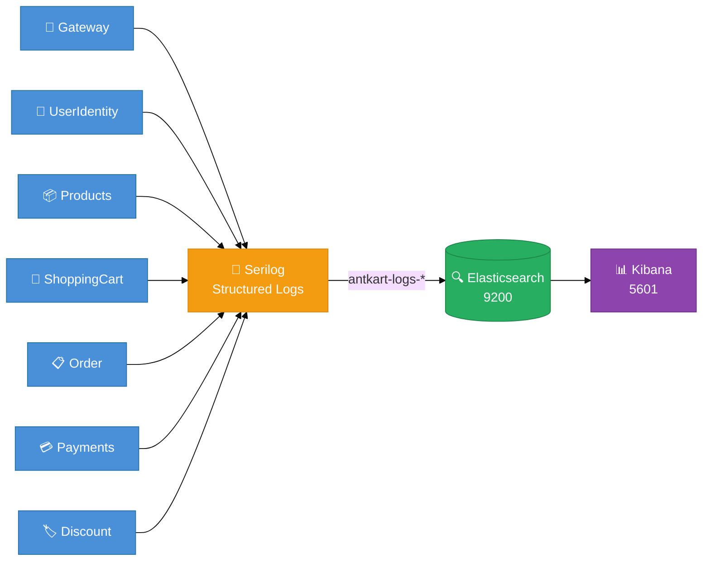

# AntKart — Observability Technical Design

## Overview

All AntKart services emit structured JSON logs via **Serilog**, shipped to **Elasticsearch 8.13.0** and visualised in **Kibana 8.13.0**. The stack runs as part of `docker-compose.yml`.

---

## Stack

| Component | Version | Port | Purpose |
|-----------|---------|------|---------|
| Elasticsearch | 8.13.0 | 9200 | Log storage + full-text search |
| Kibana | 8.13.0 | 5601 | Log visualisation |
| Serilog.Sinks.Elasticsearch | 9.0.3 | — | Ships logs from each service |

---

## Services Emitting Logs

| Service | Port (Docker) | ServiceName | Notes |
|---------|---------------|-------------|-------|
| AK.Gateway | 8000 | AK.Gateway | Ocelot edge routing |
| AK.UserIdentity | 8084 | AK.UserIdentity.API | Keycloak proxy |
| AK.Products | 8080 | AK.Products.API | MongoDB |
| AK.ShoppingCart | 8082 | AK.ShoppingCart.API | Redis |
| AK.Order | 8083 | AK.Order.API | PostgreSQL |
| AK.Payments | 8085 | AK.Payments.API | PostgreSQL + Razorpay |
| AK.Discount | 8081 | AK.Discount.Grpc | SQLite gRPC |

---

## Log Flow



---

## Configuration

`appsettings.json` in each service:

```json
"Elasticsearch": {
  "Url": ""
}
```

`docker-compose.yml` injects the real URL:

```yaml
environment:
  - Elasticsearch__Url=http://elasticsearch:9200
```

Leave `Url` blank in local dev to skip ES shipping and log to console only.

---

## Serilog Setup (BuildingBlocks)

`SerilogExtensions.AddSerilogLogging()` automatically adds the ES sink when the URL is present:

```csharp
var esUrl = configuration["Elasticsearch:Url"];
if (!string.IsNullOrWhiteSpace(esUrl))
{
    logConfig.WriteTo.Elasticsearch(new ElasticsearchSinkOptions(new Uri(esUrl))
    {
        AutoRegisterTemplate = true,
        AutoRegisterTemplateVersion = AutoRegisterTemplateVersion.ESv7,
        IndexFormat = $"antkart-logs-{environment.ToLower()}-{{0:yyyy.MM}}",
        ModifyConnectionSettings = conn =>
            conn.ServerCertificateValidationCallback((_, _, _, _) => true)
    });
}
```

**Index format:** `antkart-logs-production-2026.04`

**Log enrichment:** Each log entry includes:
- `ServiceName` — from `IHostEnvironment.ApplicationName`
- `Environment` — from `ASPNETCORE_ENVIRONMENT`
- `CorrelationId` — from `X-Correlation-Id` header (via `CorrelationIdMiddleware`)

---

## Structured Log Examples

### Order Service
```
OrderId={OrderId} UserId={UserId} Status={Status}
```

### Payments Service
```
PaymentId={PaymentId} OrderId={OrderId} RazorpayOrderId={RazorpayOrderId}   ← payment initiated
PaymentId={PaymentId} verified via Razorpay                                  ← payment succeeded
PaymentId={PaymentId} reason={Reason}                                        ← payment failed
```

---

## Kibana Setup

1. Open `http://localhost:5601`
2. Navigate to **Stack Management → Data Views**
3. Create a Data View with pattern: `antkart-logs-*`
4. Set the time field to `@timestamp`
5. Go to **Discover** to query logs across all services

Useful KQL queries:
```kql
ServiceName: "AK.Order.API" AND Level: "Error"
CorrelationId: "abc-123"
MessageTemplate: *OrderCreated*
ServiceName: "AK.Payments.API" AND (PaymentId: * OR OrderId: *)
```

---

## Docker Compose Services

```yaml
elasticsearch:
  image: docker.elastic.co/elasticsearch/elasticsearch:8.13.0
  environment:
    - discovery.type=single-node
    - xpack.security.enabled=false
    - ES_JAVA_OPTS=-Xms512m -Xmx512m
  ports:
    - "9200:9200"
  volumes:
    - elasticsearch_data:/usr/share/elasticsearch/data

kibana:
  image: docker.elastic.co/kibana/kibana:8.13.0
  ports:
    - "5601:5601"
  depends_on:
    - elasticsearch
```

Dev override reduces heap to 256m for laptop-friendly operation.

---

## Health Checks

All services expose `/health` (via `AddDefaultHealthChecks()` from BuildingBlocks). The gateway proxies `/health` for each downstream service. Kibana and Elasticsearch have their own Docker healthchecks.

---

## Correlation IDs

`CorrelationIdMiddleware` (BuildingBlocks) reads or generates `X-Correlation-Id` on every request. The Gateway forwards the header downstream, so a single client request can be traced across all service logs by filtering on `CorrelationId`.
