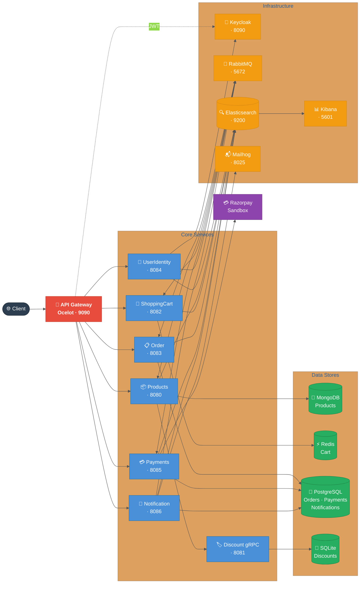
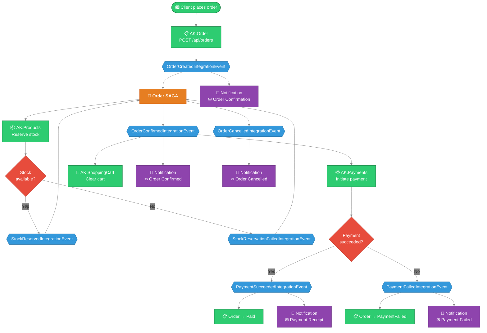

# AntKart

AntKart is a cloud-native e-commerce platform built as independently deployable .NET 9 microservices with Clean Architecture, DDD, CQRS, Event Bus (SAGA), API Gateway, Resilience, and full Observability.

---

## Architecture Overview

### Diagram 1 — Service Topology



### Diagram 2 — Order + Payment Event Flow (SAGA + Notifications)



### Architecture Highlights

- **Clean Architecture + DDD per service** — each microservice has Domain, Application, Infrastructure, and API layers with strict inward dependency rules; domain entities use private setters and factory methods with no framework leakage.
- **CQRS via MediatR 12 in every service** — commands and queries are fully separated; a `ValidationBehavior<TRequest, TResponse>` pipeline ensures all requests are validated by FluentValidation before reaching handlers.
- **MassTransit SAGA orchestrates order → stock → payment → notification** — the `OrderSaga` in AK.Order transitions through `Initial → StockPending → Confirmed/Cancelled` states, coordinating AK.Products, AK.ShoppingCart, AK.Payments, and AK.Notification over RabbitMQ without any direct service-to-service HTTP calls.
- **AK.Notification is fully event-driven** — consumes six integration events (`UserRegistered`, `OrderCreated`, `OrderConfirmed`, `OrderCancelled`, `PaymentSucceeded`, `PaymentFailed`) and dispatches transactional emails via MailKit. Local dev uses an SMTP trap (e.g. Mailhog at `http://localhost:8025`); production uses Gmail SMTP with an App Password supplied through the notification service's `EmailSettings`.
- **EF Core Outbox pattern in Order and Payments** — integration events are written atomically to the same PostgreSQL transaction as the business data, guaranteeing at-least-once delivery and preventing dual-write inconsistencies.
- **JWT authentication via Keycloak, validated at Gateway and per-service** — Ocelot validates the Bearer token at the gateway edge; each downstream service independently re-validates via the Keycloak OIDC discovery endpoint, so a compromised gateway cannot bypass service-level auth.
- **Polly v8 resilience (retry + circuit breaker) on all outbound calls** — `AddHttpResilienceWithCircuitBreaker()`, `AddRedisResilience()`, and `AddNpgsqlResilience()` from AK.BuildingBlocks wrap every external dependency with exponential backoff retry and a half-open circuit breaker.
- **Serilog → Elasticsearch → Kibana for structured observability** — every service ships structured JSON logs with a `X-Correlation-Id` header propagated end-to-end; Kibana dashboards provide cross-service request tracing without a separate APM agent.

---

## Solution Structure

```
AntKart/
├── AK.Products/          REST Minimal API — product catalogue (MongoDB)
├── AK.Discount/          gRPC service — discount coupons (SQLite)
├── AK.ShoppingCart/      REST Minimal API — shopping cart (Redis)
├── AK.Order/             REST Minimal API — order management (PostgreSQL + SAGA)
├── AK.UserIdentity/      REST Minimal API — Keycloak identity proxy
├── AK.Gateway/           API Gateway — Ocelot single entry point
├── AK.Payments/          REST Minimal API — payment processing (PostgreSQL + Razorpay)
├── AK.Notification/      REST Minimal API — transactional notifications (PostgreSQL + Mailhog/SMTP)
├── AK.BuildingBlocks/    Shared library (messaging, resilience, logging, auth)
├── AK.IntegrationTests/  SAGA + event bus + notification consumer tests (MassTransit in-memory harness)
├── AntKart.postman_collection.json
├── EVENTBUS.md           Event bus & SAGA design
├── RESILIENCE.md         Circuit breaker & Polly design
├── OBSERVABILITY.md      ELK observability design
├── SECURITY_TESTS.md     Ethical security test guide (15 categories)
├── DevTestGuide.md       Fresher-level step-by-step manual testing guide
├── docs/
│   ├── adr/              Architecture Decision Records
│   └── skills/           Step-by-step development & maintenance guides (12 skills)
└── nuget.config
```

---

## Microservices

| Service | Transport | Database | Port (Docker) | Design Doc |
|---------|-----------|----------|---------------|------------|
| [AK.Products](AK.Products/AK.Products.API) | REST Minimal API | MongoDB | 8080 | [Products Design](AK.Products/PRODUCTS_TECHNICAL_DESIGN.md) |
| [AK.Discount](AK.Discount/AK.Discount.Grpc) | gRPC | SQLite | 8081 | [Discount Design](AK.Discount/DISCOUNT_TECHNICAL_DESIGN.md) |
| [AK.ShoppingCart](AK.ShoppingCart/AK.ShoppingCart.API) | REST Minimal API | Redis | 8082 | [ShoppingCart Design](AK.ShoppingCart/SHOPPING_CART_TECHNICAL_DESIGN.md) |
| [AK.Order](AK.Order/AK.Order.API) | REST Minimal API | PostgreSQL | 8083 | [Order Design](AK.Order/ORDER_TECHNICAL_DESIGN.md) |
| [AK.UserIdentity](AK.UserIdentity/AK.UserIdentity.API) | REST Minimal API | Keycloak | 8084 | [Identity Design](AK.UserIdentity/IDENTITY_TECHNICAL_DESIGN.md) |
| [AK.Payments](AK.Payments/AK.Payments.API) | REST Minimal API | PostgreSQL + Razorpay | 8085 | [Payments Design](AK.Payments/PAYMENTS_TECHNICAL_DESIGN.md) |
| [AK.Notification](AK.Notification/AK.Notification.API) | REST Minimal API | PostgreSQL + Mailhog/SMTP | 8086 | [Notification Design](AK.Notification/NOTIFICATION_TECHNICAL_DESIGN.md) |
| [AK.Gateway](AK.Gateway/AK.Gateway.API) | Ocelot API Gateway | — | 9090 | [Gateway Design](AK.Gateway/API_GATEWAY.md) |

## Cross-Cutting

| Component | Technology | Design Doc |
|-----------|-----------|------------|
| BuildingBlocks | Shared DDD base classes, auth, messaging, resilience, middleware | [BUILDING_BLOCKS.md](AK.BuildingBlocks/BUILDING_BLOCKS.md) |
| Event Bus | MassTransit + RabbitMQ + SAGA + Outbox | [EVENTBUS.md](EVENTBUS.md) |
| Resilience | Polly v8 (retry, circuit breaker, timeout) | [RESILIENCE.md](RESILIENCE.md) |
| Observability | Serilog + Elasticsearch + Kibana | [OBSERVABILITY.md](OBSERVABILITY.md) |
| Integration Tests | MassTransit in-memory test harness | [INTEGRATION_TESTS.md](AK.IntegrationTests/INTEGRATION_TESTS.md) |
| Architecture Decisions | Why each key technology was chosen | [docs/adr/](docs/adr/) |
| C4 Architecture | System context, containers, components, and code diagrams | [C4Architecture.md](C4Architecture.md) |
| Security Tests | Ethical black-box & grey-box security test guide (15 categories) | [SECURITY_TESTS.md](SECURITY_TESTS.md) |
| Skills | Step-by-step guides for development, maintenance, and verification tasks | [docs/skills/](docs/skills/) |
| Developer Testing Guide | Fresher-level end-to-end manual test guide (Postman, RabbitMQ, Kibana, SAGA, payments) | [DevTestGuide.md](DevTestGuide.md) |

---

## Authorization

| Service | GET / Read | Write / Mutation |
|---------|-----------|-----------------|
| AK.Products | Anonymous | Admin only |
| AK.Discount (gRPC) | Anonymous | Admin only (JWT in `authorization` metadata) |
| AK.ShoppingCart | Authenticated | Authenticated |
| AK.Order | Authenticated (`/me` = own orders) | Authenticated; status update = Admin only |
| AK.Payments | Authenticated (`/me` = own payments) | Authenticated |
| AK.Notification | Authenticated (`/` = own notifications; `/admin` = Admin only) | Event-driven only — no write endpoints |
| AK.UserIdentity | `/login`, `/register`, `/refresh` anonymous | `/me` authenticated; `/admin/*` admin only |
| AK.Gateway | Proxied from downstream | JWT validated at gateway + downstream |

**Roles:** `user` (standard), `admin` (full access)
**Token issuer:** Keycloak realm `antkart` — get a token via `POST /api/auth/login`

---

## Running the Full Stack

This repository targets **cloud deployment**. There is no local docker-compose stack — run the services locally against live cloud services (databases, message broker, identity) or debug them via **cloud port-forwarding**. The earlier docker-compose-based Phase-1 local stack is preserved in the public AntKart reference repository.

The endpoints below use the illustrative ports from that reference setup:

| Service | URL |
|---------|-----|
| **API Gateway** | http://localhost:9090 |
| Keycloak Admin | http://localhost:8090 |
| RabbitMQ Management | http://localhost:15672  (guest/guest) |
| Kibana | http://localhost:5601 |
| AK.Products Swagger | http://localhost:8080/swagger (Development only) |
| AK.Discount gRPC | http://localhost:8081 |
| AK.ShoppingCart Swagger | http://localhost:8082/swagger (Development only) |
| AK.Order Swagger | http://localhost:8083/swagger (Development only) |
| AK.UserIdentity Swagger | http://localhost:8084/swagger (Development only) |
| AK.Payments Swagger | http://localhost:8085/swagger (Development only) |
| AK.Notification Swagger | http://localhost:8086/swagger (Development only) |
| **Mailhog Web UI** | **http://localhost:8025** (captured emails) |

> **Keycloak auto-import:** The `antkart` realm is imported from `keycloak/antkart-realm.json` on first start. Pre-seeded users: `admin/admin123` (admin+user), `user1/user123` (user), `admin2/Admin2Pass!` (admin+user).

### Startup order

Services depend on their backing infrastructure in this order:

```
keycloak → all REST services
rabbitmq → products, shoppingcart, order
elasticsearch → all services (log shipping)
kibana → elasticsearch
gateway → keycloak + all REST services
```

### Test end-to-end async flow

Two complete flows are shown. Both share the same setup (steps 1–4). The SAGA runs
automatically in the background — no manual trigger is needed.

#### Common setup

```bash
# 1. Login
TOKEN=$(curl -s -X POST http://localhost:8084/api/auth/login \
  -H "Content-Type: application/json" \
  -d '{"username":"user1","password":"user123"}' | jq -r '.accessToken')

# 2. Fetch a product
PRODUCT=$(curl -s "http://localhost:8080/api/v1/products?pageSize=1" | jq '.items[0]')
PRODUCT_ID=$(echo $PRODUCT | jq -r '.id')
SKU=$(echo $PRODUCT       | jq -r '.sku')
PRICE=$(echo $PRODUCT     | jq -r '.price')

# 3. Place order
# ┌─ fires ──────────────────────────────────────────────────────────────────────┐
# │  OrderCreatedIntegrationEvent                                                │
# │    → (Notification)  Order Confirmation email                                │
# │  SAGA starts: StockPending state                                             │
# │    → (Products) ReserveStockConsumer decrements stock                        │
# │    → StockReservedIntegrationEvent                                           │
# │       → (Order SAGA)   state: StockPending → Confirmed                      │
# │       → OrderConfirmedIntegrationEvent                                       │
# │            → (Order)        status → Confirmed                               │
# │            → (ShoppingCart) cart cleared                                     │
# │            → (Notification) Order Confirmed email                            │
# └──────────────────────────────────────────────────────────────────────────────┘
ORDER=$(curl -s -X POST http://localhost:8083/api/orders \
  -H "Content-Type: application/json" \
  -H "Authorization: Bearer $TOKEN" \
  -d "{
    \"shippingAddress\": {
      \"fullName\": \"John Doe\",
      \"addressLine1\": \"123 Main St\",
      \"city\": \"Chennai\",
      \"state\": \"Tamil Nadu\",
      \"postalCode\": \"600001\",
      \"country\": \"India\",
      \"phone\": \"+91-9876543210\"
    },
    \"items\": [{
      \"productId\": \"$PRODUCT_ID\",
      \"sku\": \"$SKU\",
      \"productName\": \"Test Product\",
      \"quantity\": 1,
      \"price\": $PRICE
    }]
  }")
ORDER_ID=$(echo $ORDER     | jq -r '.id')
ORDER_NUMBER=$(echo $ORDER | jq -r '.orderNumber')
echo "Order: $ORDER_NUMBER  ID: $ORDER_ID"

sleep 3   # wait for SAGA stock reservation to complete

# 4. Initiate payment (Razorpay creates a payment session)
PAYMENT=$(curl -s -X POST http://localhost:8085/api/payments/initiate \
  -H "Content-Type: application/json" \
  -H "Authorization: Bearer $TOKEN" \
  -d "{\"orderId\":\"$ORDER_ID\",\"orderNumber\":\"$ORDER_NUMBER\",\"amount\":$PRICE,\"method\":1}")
PAYMENT_ID=$(echo $PAYMENT        | jq -r '.paymentId')
RAZORPAY_ORDER_ID=$(echo $PAYMENT | jq -r '.razorpayOrderId')
RAZORPAY_KEY_ID=$(echo $PAYMENT   | jq -r '.razorpayKeyId')
echo "Payment: $PAYMENT_ID  Razorpay order: $RAZORPAY_ORDER_ID"
```

---

#### Flow A — Happy path (payment succeeds)

Payment must be completed through the Razorpay checkout widget, which returns the
`razorpayPaymentId` and `razorpaySignature`. Use the Razorpay sandbox test card:

| Field | Value |
|-------|-------|
| Card number | `4111 1111 1111 1111` (Visa) or `5267 3169 4984 2643` (Mastercard) |
| Expiry | Any future date |
| CVV | Any 3 digits |
| OTP | `1234 1234` |

The widget calls your frontend callback with `razorpay_payment_id` and `razorpay_signature`.
If running without a frontend, compute the signature from the terminal:

```bash
# Replace with values returned by the Razorpay widget / test dashboard
RAZORPAY_PAYMENT_ID="pay_xxxxxxxxxxxx"
RAZORPAY_KEY_SECRET="<your-razorpay-key-secret>"   # from Razorpay dashboard / local config

RAZORPAY_SIGNATURE=$(printf '%s' "${RAZORPAY_ORDER_ID}|${RAZORPAY_PAYMENT_ID}" | \
  openssl dgst -sha256 -hmac "$RAZORPAY_KEY_SECRET" | awk '{print $2}')

# 5A. Verify payment (valid signature → success)
# ┌─ fires ──────────────────────────────────────────────────────────────────────┐
# │  PaymentSucceededIntegrationEvent                                            │
# │    → (Order)        status → Paid                                            │
# │    → (Notification) Payment Receipt email                                    │
# └──────────────────────────────────────────────────────────────────────────────┘
curl -s -X POST http://localhost:8085/api/payments/verify \
  -H "Content-Type: application/json" \
  -H "Authorization: Bearer $TOKEN" \
  -d "{
    \"paymentId\": \"$PAYMENT_ID\",
    \"razorpayOrderId\": \"$RAZORPAY_ORDER_ID\",
    \"razorpayPaymentId\": \"$RAZORPAY_PAYMENT_ID\",
    \"razorpaySignature\": \"$RAZORPAY_SIGNATURE\"
  }" | jq '{status: .status}'
```

**Emails delivered (check Mailhog `http://localhost:8025` or Gmail inbox):**
1. Order Confirmation  ← step 3
2. Order Confirmed (stock reserved)  ← SAGA
3. Payment Receipt  ← step 5A

---

#### Flow B — Compensation path (payment fails → order cancelled)

Fully testable with curl — no real card or Razorpay widget needed.

```bash
# 5B. Verify with invalid signature → payment fails
# ┌─ fires ──────────────────────────────────────────────────────────────────────┐
# │  PaymentFailedIntegrationEvent                                               │
# │    → (Order)        status → PaymentFailed                                   │
# │    → (Notification) Payment Failed email                                     │
# └──────────────────────────────────────────────────────────────────────────────┘
curl -s -X POST http://localhost:8085/api/payments/verify \
  -H "Content-Type: application/json" \
  -H "Authorization: Bearer $TOKEN" \
  -d "{
    \"paymentId\": \"$PAYMENT_ID\",
    \"razorpayOrderId\": \"$RAZORPAY_ORDER_ID\",
    \"razorpayPaymentId\": \"pay_test_invalid\",
    \"razorpaySignature\": \"invalid_signature\"
  }" | jq '{status: .status}'

# 6B. Customer cancels the order
# ┌─ fires ──────────────────────────────────────────────────────────────────────┐
# │  OrderCancelledIntegrationEvent                                              │
# │    → (Order)        status → Cancelled                                       │
# │    → (Notification) Order Cancelled email                                    │
# └──────────────────────────────────────────────────────────────────────────────┘
curl -s -X DELETE "http://localhost:8083/api/orders/$ORDER_ID" \
  -H "Authorization: Bearer $TOKEN"
```

**Emails delivered (check Mailhog `http://localhost:8025` or Gmail inbox):**
1. Order Confirmation  ← step 3
2. Order Confirmed (stock reserved)  ← SAGA
3. Payment Failed  ← step 5B
4. Order Cancelled  ← step 6B

---

#### Observe the async activity

| Tool | URL | What to watch |
|------|-----|---------------|
| RabbitMQ management | http://localhost:15672 | Queue depths, message routing, consumer counts |
| Mailhog (local email) | http://localhost:8025 | All outbound emails captured — no real delivery |
| Kibana | http://localhost:5601 | Structured logs with `X-Correlation-Id` across all services |

### Individual services (dev)

```bash
# With the backing services (Keycloak, RabbitMQ, MongoDB, Redis, PostgreSQL,
# Elasticsearch) reachable in the cloud — directly or via port-forward —
# run each service locally in separate terminals:
cd AK.Products/AK.Products.API && dotnet run    # :5077
cd AK.Discount/AK.Discount.Grpc && dotnet run   # :5001
cd AK.ShoppingCart/AK.ShoppingCart.API && dotnet run  # :5079
cd AK.Order/AK.Order.API && dotnet run          # :5080
cd AK.UserIdentity/AK.UserIdentity.API && dotnet run  # :5085
cd AK.Payments/AK.Payments.API && dotnet run          # :5086
cd AK.Notification/AK.Notification.API && dotnet run  # :5087
cd AK.Gateway/AK.Gateway.API && dotnet run            # :8000
```

---

## API Testing

Import **[AntKart.postman_collection.json](AntKart.postman_collection.json)** into Postman.

| Variable | Default | Description |
|----------|---------|-------------|
| `gatewayUrl` | `http://localhost:9090` | API Gateway (recommended entry point) |
| `productsUrl` | `http://localhost:8080` | Products direct |
| `cartUrl` | `http://localhost:8082` | ShoppingCart direct |
| `orderUrl` | `http://localhost:8083` | Order direct |
| `identityUrl` | `http://localhost:8084` | UserIdentity direct |
| `accessToken` | (set after login) | JWT Bearer token |

---

## Tests

```bash
dotnet test
```

| Project | Tests |
|---------|-------|
| AK.Products.Tests | 202 |
| AK.Discount.Tests | 53 |
| AK.ShoppingCart.Tests | 88 |
| AK.Order.Tests | 113 |
| AK.UserIdentity.Tests | 20 |
| AK.IntegrationTests | 35 |
| AK.Payments.Tests | 70 |
| AK.Notification.Tests | 37 |
| **Total** | **618** |
