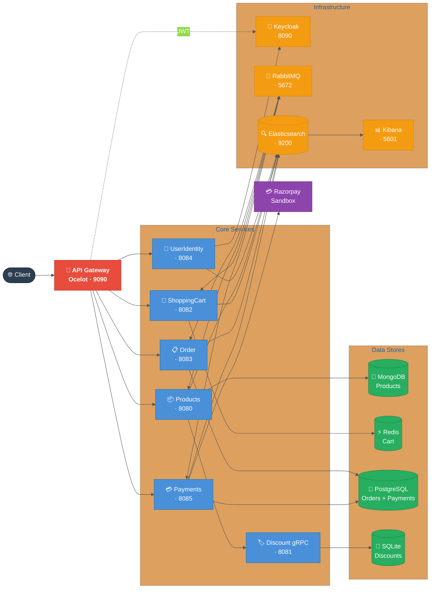
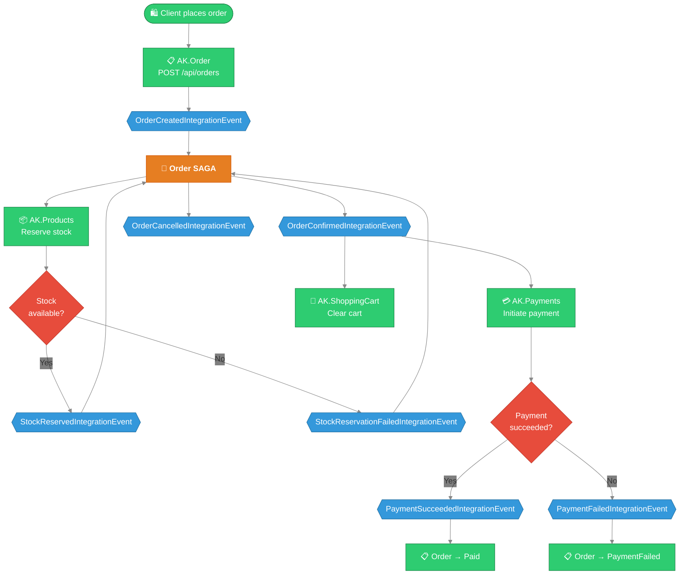

# AntKart

AntKart is a cloud-native e-commerce platform built as independently deployable .NET 9 microservices with Clean Architecture, DDD, CQRS, Event Bus (SAGA), API Gateway, Resilience, and full Observability.

---

## Architecture Overview

### Diagram 1 — Service Topology



### Diagram 2 — Order + Payment Event Flow (SAGA)



### Architecture Highlights

- **Clean Architecture + DDD per service** — each microservice has Domain, Application, Infrastructure, and API layers with strict inward dependency rules; domain entities use private setters and factory methods with no framework leakage.
- **CQRS via MediatR 12 in every service** — commands and queries are fully separated; a `ValidationBehavior<TRequest, TResponse>` pipeline ensures all requests are validated by FluentValidation before reaching handlers.
- **MassTransit SAGA orchestrates order → stock → payment** — the `OrderSaga` in AK.Order transitions through `Initial → StockPending → Confirmed/Cancelled` states, coordinating AK.Products, AK.ShoppingCart, and AK.Payments over RabbitMQ without any direct service-to-service HTTP calls.
- **EF Core Outbox pattern in Order and Payments** — integration events are written atomically to the same PostgreSQL transaction as the business data, guaranteeing at-least-once delivery and preventing dual-write inconsistencies.
- **JWT authentication via Keycloak, validated at Gateway and per-service** — Ocelot validates the Bearer token at the gateway edge; each downstream service independently re-validates via the Keycloak OIDC discovery endpoint, so a compromised gateway cannot bypass service-level auth.
- **Polly v8 resilience (retry + circuit breaker) on all outbound calls** — `AddHttpResilienceWithCircuitBreaker()`, `AddRedisResilience()`, and `AddNpgsqlResilience()` from AK.BuildingBlocks wrap every external dependency with exponential backoff retry and a half-open circuit breaker.
- **Serilog → Elasticsearch → Kibana for structured observability** — every service ships structured JSON logs with a `X-Correlation-Id` header propagated end-to-end; Kibana dashboards provide cross-service request tracing without a separate APM agent.

---

## Solution Structure

```
AntKart/
├── AK.Products/          REST Minimal API — product catalogue (MongoDB)
├── AK.Discount/          gRPC service — discount coupons (SQLite)
├── AK.ShoppingCart/      REST Minimal API — shopping cart (Redis)
├── AK.Order/             REST Minimal API — order management (PostgreSQL + SAGA)
├── AK.UserIdentity/      REST Minimal API — Keycloak identity proxy
├── AK.Gateway/           API Gateway — Ocelot single entry point
├── AK.Payments/          REST Minimal API — payment processing (PostgreSQL + Razorpay)
├── AK.Notification/      REST Minimal API — transactional notifications (PostgreSQL + Mailhog/SMTP)
├── AK.BuildingBlocks/    Shared library (messaging, resilience, logging, auth)
├── AK.IntegrationTests/  SAGA + event bus + notification consumer tests (MassTransit in-memory harness)
├── AntKart.postman_collection.json
├── docker-compose.yml
├── docker-compose.override.yml
├── EVENTBUS.md           Event bus & SAGA design
├── RESILIENCE.md         Circuit breaker & Polly design
├── OBSERVABILITY.md      ELK observability design
└── nuget.config
```

---

## Microservices

| Service | Transport | Database | Port (Docker) | Design Doc |
|---------|-----------|----------|---------------|------------|
| [AK.Products](AK.Products/AK.Products.API) | REST Minimal API | MongoDB | 8080 | [Products Design](AK.Products/PRODUCTS_TECHNICAL_DESIGN.md) |
| [AK.Discount](AK.Discount/AK.Discount.Grpc) | gRPC | SQLite | 8081 | [Discount Design](AK.Discount/DISCOUNT_TECHNICAL_DESIGN.md) |
| [AK.ShoppingCart](AK.ShoppingCart/AK.ShoppingCart.API) | REST Minimal API | Redis | 8082 | [ShoppingCart Design](AK.ShoppingCart/SHOPPING_CART_TECHNICAL_DESIGN.md) |
| [AK.Order](AK.Order/AK.Order.API) | REST Minimal API | PostgreSQL | 8083 | [Order Design](AK.Order/ORDER_TECHNICAL_DESIGN.md) |
| [AK.UserIdentity](AK.UserIdentity/AK.UserIdentity.API) | REST Minimal API | Keycloak | 8084 | [Identity Design](AK.UserIdentity/IDENTITY_TECHNICAL_DESIGN.md) |
| [AK.Payments](AK.Payments/AK.Payments.API) | REST Minimal API | PostgreSQL + Razorpay | 8085 | [Payments Design](AK.Payments/PAYMENTS_TECHNICAL_DESIGN.md) |
| [AK.Notification](AK.Notification/AK.Notification.API) | REST Minimal API | PostgreSQL + Mailhog/SMTP | 8086 | [Notification Design](AK.Notification/NOTIFICATION_TECHNICAL_DESIGN.md) |
| [AK.Gateway](AK.Gateway/AK.Gateway.API) | Ocelot API Gateway | — | 9090 | [Gateway Design](AK.Gateway/API_GATEWAY.md) |

## Cross-Cutting

| Component | Technology | Design Doc |
|-----------|-----------|------------|
| Event Bus | MassTransit + RabbitMQ + SAGA + Outbox | [EVENTBUS.md](EVENTBUS.md) |
| Resilience | Polly v8 (retry, circuit breaker, timeout) | [RESILIENCE.md](RESILIENCE.md) |
| Observability | Serilog + Elasticsearch + Kibana | [OBSERVABILITY.md](OBSERVABILITY.md) |
| Integration Tests | MassTransit in-memory test harness | [INTEGRATION_TESTS.md](AK.IntegrationTests/INTEGRATION_TESTS.md) |

---

## Authorization

| Service | GET / Read | Write / Mutation |
|---------|-----------|-----------------|
| AK.Products | Anonymous | Admin only |
| AK.Discount (gRPC) | Anonymous | Admin only |
| AK.ShoppingCart | Authenticated | Authenticated |
| AK.Order | Authenticated | Authenticated |
| AK.UserIdentity | `/login`, `/register`, `/refresh` anonymous | `/me` authenticated; `/admin/*` admin only |
| AK.Gateway | Proxied from downstream | JWT validated at gateway + downstream |

**Roles:** `user` (standard), `admin` (full access)
**Token issuer:** Keycloak realm `antkart` — get a token via `POST /api/auth/login`

---

## Running the Full Stack

### Docker Compose (recommended)

```bash
docker-compose up --build
```

| Service | URL |
|---------|-----|
| **API Gateway** | http://localhost:9090 |
| Keycloak Admin | http://localhost:8090 |
| RabbitMQ Management | http://localhost:15672  (guest/guest) |
| Kibana | http://localhost:5601 |
| AK.Products Swagger | http://localhost:8080/swagger (Development only) |
| AK.Discount gRPC | http://localhost:8081 |
| AK.ShoppingCart Swagger | http://localhost:8082/swagger (Development only) |
| AK.Order Swagger | http://localhost:8083/swagger (Development only) |
| AK.UserIdentity Swagger | http://localhost:8084/swagger (Development only) |
| AK.Payments Swagger | http://localhost:8085/swagger (Development only) |
| AK.Notification Swagger | http://localhost:5087/swagger (Development only) |
| **Mailhog Web UI** | **http://localhost:8025** (captured emails) |

> **Keycloak auto-import:** The `antkart` realm is imported from `keycloak/antkart-realm.json` on first start. Pre-seeded users: `admin/admin123` (admin+user), `user1/user123` (user), `admin2/Admin2Pass!` (admin+user).

### Startup order

Docker Compose `depends_on` ensures correct startup order:

```
keycloak → all REST services
rabbitmq → products, shoppingcart, order
elasticsearch → all services (log shipping)
kibana → elasticsearch
gateway → keycloak + all REST services
```

### Test end-to-end async flow

```bash
# 1. Get a token
TOKEN=$(curl -s -X POST http://localhost:8084/api/auth/login \
  -H "Content-Type: application/json" \
  -d '{"username":"user1","password":"user123"}' | jq -r '.accessToken')

# 2. Get a product ID
PRODUCT_ID=$(curl -s http://localhost:8080/api/products?pageSize=1 | jq -r '.items[0].id')
SKU=$(curl -s http://localhost:8080/api/products?pageSize=1 | jq -r '.items[0].sku')
PRICE=$(curl -s http://localhost:8080/api/products?pageSize=1 | jq -r '.items[0].price')

# 3. Place an order (triggers SAGA)
curl -s -X POST http://localhost:8083/api/orders \
  -H "Content-Type: application/json" \
  -H "Authorization: Bearer $TOKEN" \
  -d "{
    \"shippingAddress\": {
      \"fullName\": \"John Doe\",
      \"addressLine1\": \"123 Main St\",
      \"city\": \"Springfield\",
      \"state\": \"IL\",
      \"postalCode\": \"62701\",
      \"country\": \"US\"
    },
    \"items\": [{
      \"productId\": \"$PRODUCT_ID\",
      \"sku\": \"$SKU\",
      \"productName\": \"Test Product\",
      \"quantity\": 1,
      \"price\": $PRICE
    }]
  }"

# 4. Watch RabbitMQ: http://localhost:15672
# 5. Watch Kibana: http://localhost:5601
```

### Individual services (dev)

```bash
docker-compose up keycloak rabbitmq mongodb redis postgres elasticsearch

# Then in separate terminals:
cd AK.Products/AK.Products.API && dotnet run    # :5077
cd AK.Discount/AK.Discount.Grpc && dotnet run   # :5001
cd AK.ShoppingCart/AK.ShoppingCart.API && dotnet run  # :5079
cd AK.Order/AK.Order.API && dotnet run          # :5080
cd AK.UserIdentity/AK.UserIdentity.API && dotnet run  # :5085
cd AK.Payments/AK.Payments.API && dotnet run          # :5086
cd AK.Notification/AK.Notification.API && dotnet run  # :5087
cd AK.Gateway/AK.Gateway.API && dotnet run            # :8000
```

---

## API Testing

Import **[AntKart.postman_collection.json](AntKart.postman_collection.json)** into Postman.

| Variable | Default | Description |
|----------|---------|-------------|
| `gatewayUrl` | `http://localhost:9090` | API Gateway (recommended entry point) |
| `productsUrl` | `http://localhost:8080` | Products direct |
| `cartUrl` | `http://localhost:8082` | ShoppingCart direct |
| `orderUrl` | `http://localhost:8083` | Order direct |
| `identityUrl` | `http://localhost:8084` | UserIdentity direct |
| `accessToken` | (set after login) | JWT Bearer token |

---

## Tests

```bash
dotnet test
```

| Project | Tests |
|---------|-------|
| AK.Products.Tests | 202 |
| AK.Discount.Tests | 53 |
| AK.ShoppingCart.Tests | 88 |
| AK.Order.Tests | 109 |
| AK.UserIdentity.Tests | 20 |
| AK.IntegrationTests | 35 |
| AK.Payments.Tests | 69 |
| AK.Notification.Tests | 37 |
| **Total** | **613** |
