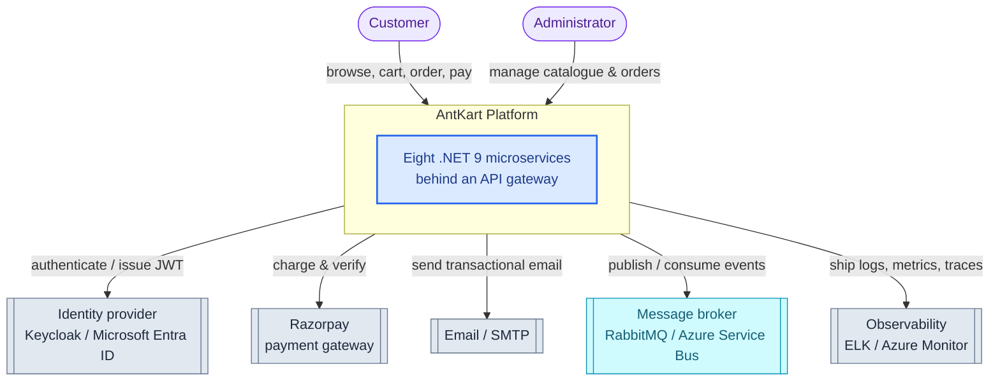
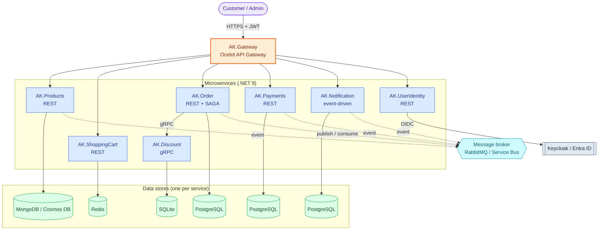
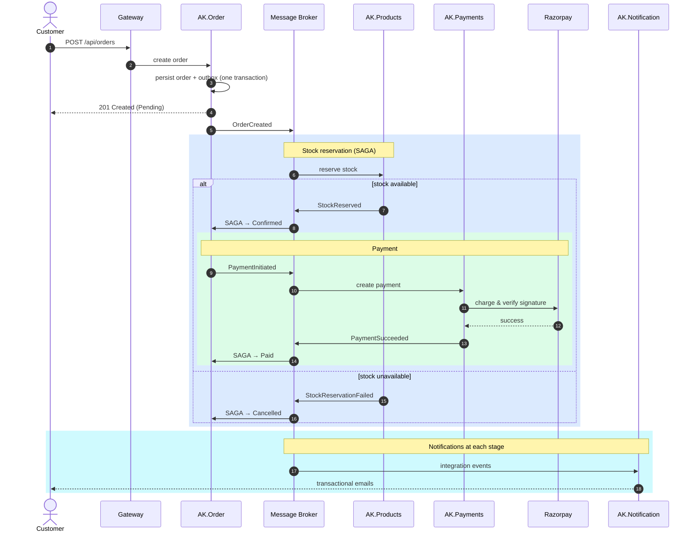
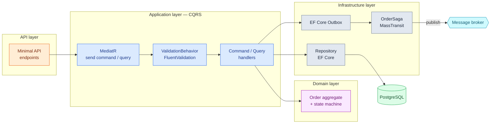

# AntKart

**AntKart is a cloud-native e-commerce platform** built as eight independently deployable **.NET 9 microservices** — and, just as deliberately, a **from-scratch, learnable reference** for how a modern distributed system is designed, built, and moved onto managed cloud infrastructure.

It pairs production-grade patterns — Clean Architecture, DDD, CQRS, an event-driven **SAGA**, an API gateway, resilience, and full observability — with a documentation set that teaches the *why* behind every decision. The same eight services run two ways: an **application baseline** you can clone and run locally, and a **secret-less, identity-based Azure deployment** provisioned entirely as code.

Whether you want to study enterprise patterns, learn cloud-native concepts from the ground up, or rebuild your own deployment, AntKart is structured to be **read and rebuilt, not just run**.

---

## What You Can Learn Here

AntKart is built around **two complementary challenges** — take either, or do both in order:

### 1. Learn enterprise cloud-native concepts from scratch

The concept guides assume **no prior cloud experience** and build each idea from first principles, with diagrams and a worked rationale — then link to the [ADR](docs/adr/README.md) that applies it in the platform:

[IaC fundamentals](docs/guides/iac-concepts.md) · [Networking & Kubernetes](docs/guides/networking-concepts.md) · [Identity](docs/guides/identity-concepts.md) · [Messaging](docs/guides/messaging-concepts.md) · [Serverless & Eventing](docs/guides/serverless-eventing-concepts.md) · [Cosmos DB](docs/guides/cosmosdb-concepts.md)

### 2. Rebuild your own cloud deployment from the application baseline

Start from the running [application baseline](#quick-start-run-it-locally) and reproduce the managed-Azure platform yourself, one resource at a time:

- **Provision infrastructure as code** — Terraform modules + Terragrunt live units, plan-reviewed before every apply.
- **Map each baseline component to its managed equivalent** — Keycloak → Entra ID, RabbitMQ → Service Bus, MongoDB → Cosmos DB (see the [mapping](#two-layers-application-baseline-and-cloud-native-target)).
- **Adopt a secret-less, identity-based posture** — managed identities, least-privilege RBAC, and no connection strings.

The [Infrastructure Guide](docs/guides/infrastructure-guide.md) walks every resource as **Understand → Build → Execute → Verify**.

---

## Documentation Map — Where to Start

Pick the path that matches your goal:

| You want to… | Start here → then |
|--------------|-------------------|
| **Run it on your machine** | [Quick Start (local)](#quick-start-run-it-locally) — clone, build, test, and run a service before exploring the cloud path |
| **Understand the project** | [Architecture overview](#architecture-overview) (below) → [Development Guide](DevelopmentGuide.md) — the master index of *how* the platform is built |
| **Learn the cloud-native concepts from scratch** | The concept guides, in reading order: [IaC fundamentals](docs/guides/iac-concepts.md) → [Networking & Kubernetes](docs/guides/networking-concepts.md) → [Identity](docs/guides/identity-concepts.md) → [Messaging](docs/guides/messaging-concepts.md) → [Serverless & Eventing](docs/guides/serverless-eventing-concepts.md) → [Cosmos DB](docs/guides/cosmosdb-concepts.md) |
| **Build / deploy it yourself** | [infrastructure/README](infrastructure/README.md) → [Infrastructure Guide](docs/guides/infrastructure-guide.md) (step-by-step) → the phase guides in the [Development Guide](DevelopmentGuide.md) |

The [Development Guide](DevelopmentGuide.md) is the **spine**: each delivery phase links to its build guide, the concepts to read first, and the decisions ([ADRs](docs/adr/README.md)) behind it.

---

## Quick Start (Run It Locally)

New here? Run the **application baseline** on your machine first — it's the fastest way to see the platform work before exploring the cloud path.

**Prerequisites**

- [.NET 9 SDK](https://dotnet.microsoft.com/download)
- Docker (for the backing services — databases, message broker, identity, mail trap)

**Clone, build, and test**

```bash
git clone https://github.com/seesathish/AntKart-Src3.git
cd AntKart-Src3
dotnet restore   # run from the repo root so nuget.config is picked up
dotnet build     # must succeed with 0 errors
dotnet test      # 618 tests, all green
```

**Run a service**

```bash
cd AK.Products/AK.Products.API && dotnet run   # → http://localhost:5077/swagger
```

Each service binds to its backing infrastructure (databases, broker, identity provider). The full self-hosted local stack — Docker Compose for Keycloak, RabbitMQ, the databases, Mailhog, and ELK — is preserved in the public AntKart reference repository; **this** repository targets cloud deployment, so for the managed-Azure path follow the [Infrastructure Guide](docs/guides/infrastructure-guide.md) instead.

Once a service is running, import the [Postman collection](AntKart.postman_collection.json) and call it through the gateway. For a guided end-to-end walkthrough (Postman, messaging, SAGA, payments), see the [Developer Testing Guide](docs/test/DevTestGuide.md).

---

## Architecture Overview

### Two Layers: Application Baseline and Cloud-Native Target

AntKart is documented at **two layers**, and both appear throughout the docs — understanding the distinction explains why you'll see both Keycloak *and* Entra ID, RabbitMQ *and* Service Bus:

- **Application baseline** — how the eight services are built and run against **self-hosted backing infrastructure**: Keycloak for identity, RabbitMQ for messaging, per-service local databases, and ELK for observability. This is the layer you run from the [Quick Start](#quick-start-run-it-locally) above.
- **Cloud-native target** — the same services mapped onto **managed Azure equivalents**, authenticating with **managed identities and no stored secrets**. The application code is largely unchanged; what changes is the infrastructure it binds to.

The cloud-native platform doesn't replace the baseline — it **maps it onto managed services**:

| Application baseline | Cloud-native equivalent |
|----------------------|-------------------------|
| Keycloak (identity) | Microsoft Entra ID |
| RabbitMQ (messaging) | Azure Service Bus |
| MongoDB (product store) | Azure Cosmos DB (MongoDB API) |
| Local PostgreSQL / Redis | Managed Azure data services |
| ELK (Serilog → Elasticsearch → Kibana) | Azure Monitor / Application Insights |
| Connection-string secrets | Managed identities — **no secrets** |

The diagrams below name both forms (`Keycloak / Entra ID`, `RabbitMQ / Service Bus`, `MongoDB / Cosmos DB`) so they hold true for either layer.

### Technology Stack

| Layer | Application baseline | Cloud-native equivalent |
|-------|----------------------|-------------------------|
| **Language / framework** | .NET 9 · ASP.NET Core Minimal APIs · gRPC | _same_ |
| **Architecture & patterns** | Clean Architecture · DDD · CQRS (MediatR 12) · SAGA · EF Core Outbox · `Result<T>` · FluentValidation pipeline | _same_ |
| **API gateway** | Ocelot | Azure API Management _(target)_ |
| **Identity** | Keycloak (OIDC / JWT) | Microsoft Entra ID |
| **Messaging** | RabbitMQ + MassTransit | Azure Service Bus + MassTransit |
| **Product store** | MongoDB | Azure Cosmos DB (MongoDB API) |
| **Relational / cache** | PostgreSQL · Redis · SQLite | Managed Azure data services |
| **Email** | MailKit · SMTP / Mailhog | SMTP / managed email |
| **Payments** | Razorpay (sandbox) | Razorpay |
| **Resilience** | Polly v8 (retry · circuit breaker · timeout) | _same_ |
| **Infrastructure as code** | — | Terraform + Terragrunt |
| **Container / orchestration** | Docker | Azure Kubernetes Service (AKS) + Azure Container Registry _(target)_ |
| **Serverless / eventing** | — | Azure Functions + Event Grid _(target)_ |
| **Secrets / access** | Connection strings | Key Vault + managed identities — **no secrets** |
| **Observability** | Serilog → Elasticsearch → Kibana | Azure Monitor / Application Insights |
| **Testing** | xUnit · Moq · FluentAssertions — **618 tests** | _same_ |

### System Context

Two actors — **Customer** and **Administrator** — interact with the AntKart platform, which depends on external/cloud services for identity, payments, email, messaging, and observability.



### Containers & Services

Eight independently deployable microservices sit behind an **Ocelot API gateway**. Each service owns its data store; services communicate **asynchronously over the message broker** via MassTransit, except **AK.Discount**, which AK.Order calls **synchronously over gRPC**.



### Order Flow — End-to-End SAGA

The order journey is orchestrated by the **MassTransit SAGA** in AK.Order, with **no direct service-to-service HTTP calls** — every step flows through the message broker, and AK.Notification emails the customer at each stage.



### Component View — AK.Order

AK.Order is the most architecturally rich service: **CQRS via MediatR**, **SAGA orchestration**, an **EF Core Outbox** for guaranteed event delivery, and a domain model with an **enforced state machine**. Commands flow through a `ValidationBehavior` pipeline; `CancelOrder` and `UpdateOrderStatus` return `Result<T>` for expected failures, while `CreateOrder` uses exceptions for unexpected ones.



### Architecture Highlights

**Application patterns**

- **Clean Architecture + DDD per service** — each microservice has Domain, Application, Infrastructure, and API layers with strict inward dependency rules; domain entities use private setters and factory methods with no framework leakage.
- **CQRS via MediatR 12 in every service** — commands and queries are fully separated; a `ValidationBehavior<TRequest, TResponse>` pipeline validates every request via FluentValidation before it reaches a handler.
- **MassTransit SAGA orchestrates order → stock → payment → notification** — the `OrderSaga` in AK.Order transitions through `Initial → StockPending → Confirmed/Cancelled`, coordinating Products, ShoppingCart, Payments, and Notification over the broker with **no direct service-to-service HTTP calls**.
- **EF Core Outbox in Order and Payments** — integration events are written atomically in the same transaction as the business data, guaranteeing at-least-once delivery and preventing dual-write inconsistencies.
- **`Result<T>` for expected failures, exceptions for unexpected ones** — `CancelOrder` and `UpdateOrderStatus` return `Result<T>`; `CreateOrder` uses exceptions — a deliberate contrast the design docs walk through.
- **Polly v8 resilience on every outbound call** — `AddHttpResilienceWithCircuitBreaker()`, `AddRedisResilience()`, and `AddNpgsqlResilience()` from AK.BuildingBlocks wrap each dependency with exponential-backoff retry and a half-open circuit breaker.
- **Fully event-driven notification** — AK.Notification consumes six integration events and dispatches transactional emails via MailKit, with a channel abstraction ready for SMS/WhatsApp.

**Cloud-native posture**

- **Infrastructure as code** — Terraform modules (the *how*) plus Terragrunt live units (the *what*), a shared remote-state backend, and a `plan` reviewed before every `apply`.
- **Secret-less, Entra-only data planes** — local/shared-key auth is disabled (`local_auth_enabled = false`); every data plane accepts Microsoft Entra identities only, so there are **no connection-string secrets**.
- **Least-privilege RBAC + managed identities** — each service gets its own managed identity granted only the data-plane roles it needs; workload identity federation lets pods authenticate with nothing stored in the cluster.
- **Key Vault for everything sensitive** — secrets are read at startup via `DefaultAzureCredential`, never committed.
- **Observability built in** — structured Serilog JSON logs with an end-to-end `X-Correlation-Id`, shipped to ELK locally and to Azure Monitor / Application Insights in the cloud.

**Engineering discipline**

- **Everything as code** — application, infrastructure, gateway routing, and identity config all live in the repository; nothing is clicked together by hand.
- **Documented decisions** — every significant choice is captured as an [ADR](docs/adr/README.md), and every cloud concept has a from-scratch [primer](#what-you-can-learn-here).
- **Test-backed** — **618 unit and integration tests** (xUnit · Moq · FluentAssertions), including a MassTransit in-memory harness for the SAGA and event bus.

### Architecture Decision Records

Architecture decisions are documented as ADRs. See the [Architecture Decision Records index](docs/adr/README.md).

---

## Solution Structure

```
AntKart/
├── AK.Products/          REST Minimal API — product catalogue (MongoDB)
├── AK.Discount/          gRPC service — discount coupons (SQLite)
├── AK.ShoppingCart/      REST Minimal API — shopping cart (Redis)
├── AK.Order/             REST Minimal API — order management (PostgreSQL + SAGA)
├── AK.UserIdentity/      REST Minimal API — Keycloak identity proxy
├── AK.Gateway/           API Gateway — Ocelot single entry point
├── AK.Payments/          REST Minimal API — payment processing (PostgreSQL + Razorpay)
├── AK.Notification/      REST Minimal API — transactional notifications (PostgreSQL + Mailhog/SMTP)
├── AK.BuildingBlocks/    Shared library (messaging, resilience, logging, auth)
├── AK.IntegrationTests/  SAGA + event bus + notification consumer tests (MassTransit in-memory harness)
├── AntKart.postman_collection.json
├── docs/
│   ├── adr/              Architecture Decision Records
│   ├── architecture/     C4 diagram images + Structurizr workspace
│   ├── design/           Cross-cutting design docs (EVENTBUS, RESILIENCE, OBSERVABILITY)
│   ├── skills/           Step-by-step development & maintenance guides (12 skills)
│   └── test/             Manual test & security test guides (DevTestGuide, SECURITY_TESTS)
└── nuget.config
```

---

## Microservices

| Service | Transport | Database | Port (Docker) | Design Doc |
|---------|-----------|----------|---------------|------------|
| [AK.Products](AK.Products/AK.Products.API) | REST Minimal API | MongoDB | 8080 | [Products Design](AK.Products/PRODUCTS_TECHNICAL_DESIGN.md) |
| [AK.Discount](AK.Discount/AK.Discount.Grpc) | gRPC | SQLite | 8081 | [Discount Design](AK.Discount/DISCOUNT_TECHNICAL_DESIGN.md) |
| [AK.ShoppingCart](AK.ShoppingCart/AK.ShoppingCart.API) | REST Minimal API | Redis | 8082 | [ShoppingCart Design](AK.ShoppingCart/SHOPPING_CART_TECHNICAL_DESIGN.md) |
| [AK.Order](AK.Order/AK.Order.API) | REST Minimal API | PostgreSQL | 8083 | [Order Design](AK.Order/ORDER_TECHNICAL_DESIGN.md) |
| [AK.UserIdentity](AK.UserIdentity/AK.UserIdentity.API) | REST Minimal API | Keycloak | 8084 | [Identity Design](AK.UserIdentity/IDENTITY_TECHNICAL_DESIGN.md) |
| [AK.Payments](AK.Payments/AK.Payments.API) | REST Minimal API | PostgreSQL + Razorpay | 8085 | [Payments Design](AK.Payments/PAYMENTS_TECHNICAL_DESIGN.md) |
| [AK.Notification](AK.Notification/AK.Notification.API) | REST Minimal API | PostgreSQL + Mailhog/SMTP | 8086 | [Notification Design](AK.Notification/NOTIFICATION_TECHNICAL_DESIGN.md) |
| [AK.Gateway](AK.Gateway/AK.Gateway.API) | Ocelot API Gateway | — | 9090 | [Gateway Design](AK.Gateway/API_GATEWAY.md) |

## Cross-Cutting

| Component | Technology | Design Doc |
|-----------|-----------|------------|
| BuildingBlocks | Shared DDD base classes, auth, messaging, resilience, middleware | [BUILDING_BLOCKS.md](AK.BuildingBlocks/BUILDING_BLOCKS.md) |
| Event Bus | MassTransit + RabbitMQ + SAGA + Outbox | [EVENTBUS.md](docs/design/EVENTBUS.md) |
| Resilience | Polly v8 (retry, circuit breaker, timeout) | [RESILIENCE.md](docs/design/RESILIENCE.md) |
| Observability | Serilog + Elasticsearch + Kibana | [OBSERVABILITY.md](docs/design/OBSERVABILITY.md) |
| Integration Tests | MassTransit in-memory test harness | [INTEGRATION_TESTS.md](AK.IntegrationTests/INTEGRATION_TESTS.md) |
| Architecture Decisions | Why each key technology was chosen | [docs/adr/](docs/adr/) |
| Security Tests | Ethical black-box & grey-box security test guide (15 categories) | [SECURITY_TESTS.md](docs/test/SECURITY_TESTS.md) |
| Skills | Step-by-step guides for development, maintenance, and verification tasks | [docs/skills/](docs/skills/) |
| Developer Testing Guide | Fresher-level end-to-end manual test guide (Postman, RabbitMQ, Kibana, SAGA, payments) | [DevTestGuide.md](docs/test/DevTestGuide.md) |

---

## Authorization

| Service | GET / Read | Write / Mutation |
|---------|-----------|-----------------|
| AK.Products | Anonymous | Admin only |
| AK.Discount (gRPC) | Anonymous | Admin only (JWT in `authorization` metadata) |
| AK.ShoppingCart | Authenticated | Authenticated |
| AK.Order | Authenticated (`/me` = own orders) | Authenticated; status update = Admin only |
| AK.Payments | Authenticated (`/me` = own payments) | Authenticated |
| AK.Notification | Authenticated (`/` = own notifications; `/admin` = Admin only) | Event-driven only — no write endpoints |
| AK.UserIdentity | `/login`, `/register`, `/refresh` anonymous | `/me` authenticated; `/admin/*` admin only |
| AK.Gateway | Proxied from downstream | JWT validated at gateway + downstream |

**Roles:** `user` (standard), `admin` (full access)
**Token issuer:** Keycloak realm `antkart` — get a token via `POST /api/auth/login`

---

## Running the Full Stack

This repository targets **cloud deployment**. There is no local docker-compose stack — run the services locally against live cloud services (databases, message broker, identity) or debug them via **cloud port-forwarding**. The earlier docker-compose-based Phase-1 local stack is preserved in the public AntKart reference repository.

The endpoints below use the illustrative ports from that reference setup:

| Service | URL |
|---------|-----|
| **API Gateway** | http://localhost:9090 |
| Keycloak Admin | http://localhost:8090 |
| RabbitMQ Management | http://localhost:15672  (guest/guest) |
| Kibana | http://localhost:5601 |
| AK.Products Swagger | http://localhost:8080/swagger (Development only) |
| AK.Discount gRPC | http://localhost:8081 |
| AK.ShoppingCart Swagger | http://localhost:8082/swagger (Development only) |
| AK.Order Swagger | http://localhost:8083/swagger (Development only) |
| AK.UserIdentity Swagger | http://localhost:8084/swagger (Development only) |
| AK.Payments Swagger | http://localhost:8085/swagger (Development only) |
| AK.Notification Swagger | http://localhost:8086/swagger (Development only) |
| **Mailhog Web UI** | **http://localhost:8025** (captured emails) |

> **Keycloak auto-import:** The `antkart` realm is imported from `keycloak/antkart-realm.json` on first start. Pre-seeded users: `admin/admin123` (admin+user), `user1/user123` (user), `admin2/Admin2Pass!` (admin+user).

### Individual services (dev)

```bash
# With the backing services (Keycloak, RabbitMQ, MongoDB, Redis, PostgreSQL,
# Elasticsearch) reachable in the cloud — directly or via port-forward —
# run each service locally in separate terminals:
cd AK.Products/AK.Products.API && dotnet run    # :5077
cd AK.Discount/AK.Discount.Grpc && dotnet run   # :5001
cd AK.ShoppingCart/AK.ShoppingCart.API && dotnet run  # :5079
cd AK.Order/AK.Order.API && dotnet run          # :5080
cd AK.UserIdentity/AK.UserIdentity.API && dotnet run  # :5085
cd AK.Payments/AK.Payments.API && dotnet run          # :5086
cd AK.Notification/AK.Notification.API && dotnet run  # :5087
cd AK.Gateway/AK.Gateway.API && dotnet run            # :8000
```

---

## API Testing

Import **[AntKart.postman_collection.json](AntKart.postman_collection.json)** into Postman.

| Variable | Default | Description |
|----------|---------|-------------|
| `gatewayUrl` | `http://localhost:9090` | API Gateway (recommended entry point) |
| `productsUrl` | `http://localhost:8080` | Products direct |
| `cartUrl` | `http://localhost:8082` | ShoppingCart direct |
| `orderUrl` | `http://localhost:8083` | Order direct |
| `identityUrl` | `http://localhost:8084` | UserIdentity direct |
| `accessToken` | (set after login) | JWT Bearer token |

---

## Tests

```bash
dotnet test
```

| Project | Tests |
|---------|-------|
| AK.Products.Tests | 202 |
| AK.Discount.Tests | 53 |
| AK.ShoppingCart.Tests | 88 |
| AK.Order.Tests | 113 |
| AK.UserIdentity.Tests | 20 |
| AK.IntegrationTests | 35 |
| AK.Payments.Tests | 70 |
| AK.Notification.Tests | 37 |
| **Total** | **618** |
