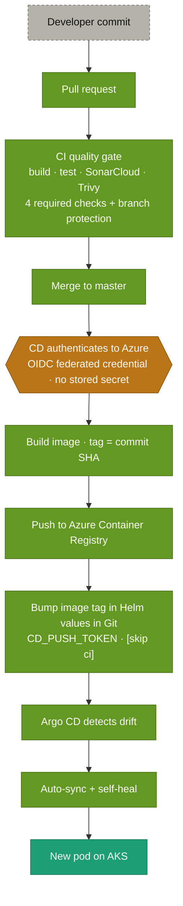

# AntKart — cloud-native e-commerce platform

AntKart is a **.NET 9** e-commerce platform of **six microservices** plus a **serverless notifications app**, running on **Azure Kubernetes Service**, provisioned with **Terraform and Terragrunt**, and delivered by **GitHub Actions and Argo CD**. (An earlier Phase-1 build ran locally on Docker Compose in a separate repository; this repository is the cloud-native platform.)

## At a glance

| | |
|---|---|
| **Language & runtime** | .NET 9 (C#) — six REST/gRPC microservices + a serverless notifications app (Azure Functions, isolated worker) |
| **Cloud** | Microsoft Azure |
| **Orchestration** | Azure Kubernetes Service (AKS) — Azure CNI Overlay, OIDC issuer, workload identity |
| **Infrastructure as code** | Terraform modules composed by Terragrunt live units |
| **CI/CD** | GitHub Actions — OIDC to Azure, no stored cloud secrets |
| **GitOps** | Argo CD — auto-sync + self-heal from Git |
| **Messaging** | Azure Service Bus via MassTransit (orchestrated SAGA) |
| **Data stores** | Cosmos DB (MongoDB API), PostgreSQL Flexible Server, Azure Managed Redis |
| **Identity** | Microsoft Entra ID — workload identity + federated credentials, no stored secrets |
| **Edge** | ingress-nginx + cert-manager TLS at `api.antkart.in` (Azure API Management is **planned**) |

**Live:** [https://api.antkart.in](https://api.antkart.in) — served over a trusted Let's Encrypt production TLS certificate.

## System architecture

### 01 · System context
The users and external systems (Entra ID, Razorpay, ACS, GoDaddy) the platform depends on.

_Rendered from workspace.dsl — see [renders/README.md](docs/architecture/renders/README.md)_

**Go deeper:** [full detail & decisions →](docs/architecture/diagrams/README.md#01--system-context-l1)

### 02 · Containers
The six services, the serverless notifications app, and the Azure managed services behind them.

_Rendered from workspace.dsl — see [renders/README.md](docs/architecture/renders/README.md)_

**Go deeper:** [full detail & decisions →](docs/architecture/diagrams/README.md#02--container-view-l2--services-azure-paas-apim)

### 03 · Inside AK.Order
One service's internals — API, application (CQRS/MediatR), domain, and infrastructure layers.

_Rendered from workspace.dsl — see [renders/README.md](docs/architecture/renders/README.md)_

**Go deeper:** [full detail & decisions →](docs/architecture/diagrams/README.md#03--component-view-l3--inside-akorder)

## Cloud architecture

### 05 · Azure topology
The Azure resources that make up the environment and how they group.

_Rendered from workspace.dsl — see [renders/README.md](docs/architecture/renders/README.md)_

**Go deeper:** [full detail & decisions →](docs/architecture/diagrams/README.md#05--azure-resource-topology)

## Kubernetes architecture

### 11 · Cluster topology
How namespaces, workloads, and ingress are laid out inside AKS.

_Rendered from workspace.dsl — see [renders/README.md](docs/architecture/renders/README.md)_

**Go deeper:** [full detail & decisions →](docs/architecture/diagrams/README.md#11--cluster-topology)

## Delivery architecture

### 19 · Commit to running pod
The end-to-end delivery path from a developer commit to a running pod — CI gate, secret-less CD, GitOps reconciliation.

```mermaid
flowchart TD
    DEV["Developer commit"]:::external
    PR["Pull request"]:::cicd
    CI["CI quality gate<br/>build · test · SonarCloud · Trivy<br/>4 required checks + branch protection"]:::cicd
    MERGE["Merge to master"]:::cicd
    OIDC{{"CD authenticates to Azure<br/>OIDC federated credential · no stored secret"}}:::identity
    BUILD["Build image · tag = commit SHA"]:::cicd
    ACR["Push to Azure Container Registry"]:::cicd
    BUMP["Bump image tag in Helm values in Git<br/>CD_PUSH_TOKEN · [skip ci]"]:::cicd
    ARGO["Argo CD detects drift"]:::cicd
    SYNC["Auto-sync + self-heal"]:::cicd
    POD["New pod on AKS"]:::service

    DEV --> PR --> CI --> MERGE --> OIDC --> BUILD --> ACR --> BUMP --> ARGO --> SYNC --> POD

    classDef external fill:#B4B2A9,stroke:#7A7870,color:#111,stroke-dasharray:4 3;
    classDef service fill:#1D9E75,stroke:#14795A,color:#FFF;
    classDef paas fill:#0078D4,stroke:#005A9E,color:#FFF;
    classDef datastore fill:#185FA5,stroke:#0F3F6E,color:#FFF;
    classDef identity fill:#BA7517,stroke:#8A560F,color:#FFF;
    classDef edge fill:#7F77DD,stroke:#5B52B8,color:#FFF;
    classDef cicd fill:#639922,stroke:#496F18,color:#FFF;
    classDef issue fill:none,stroke:#E24B4A,color:#E24B4A,stroke-dasharray:5 4;
```

**Go deeper:** [full detail & decisions →](docs/architecture/diagrams/README.md#19--delivery-architecture--commit-to-running-pod)

**[All 19 diagrams, including the thirteen not shown here →](docs/architecture/diagrams/README.md)**

## Explore

- [Architecture, all 19 diagrams](docs/architecture/diagrams/README.md) — the full diagram set with questions and decisions.
- [Build and run](DevelopmentGuide.md) — the delivery phases, build guides, and prerequisite concepts.
- [Architecture decisions](docs/adr/README.md) — the 23 ADRs and why each choice was made.
- [Testing](docs/test/README.md) — the verification strategy from unit to end-to-end.

## Known issues

See the [Known Issues Register](docs/KNOWN_ISSUES.md) — notably **KI-002** (Discount gRPC decodes tokens without cryptographic validation) and **KI-005** (no stock-release compensation on payment failure).
