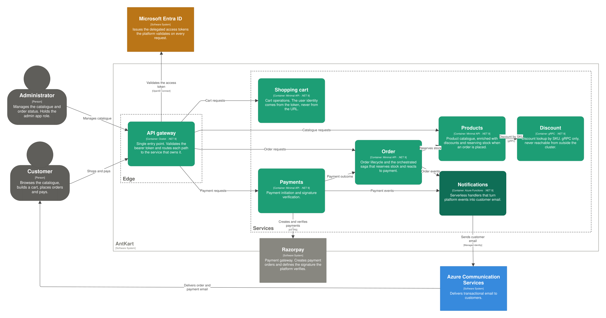
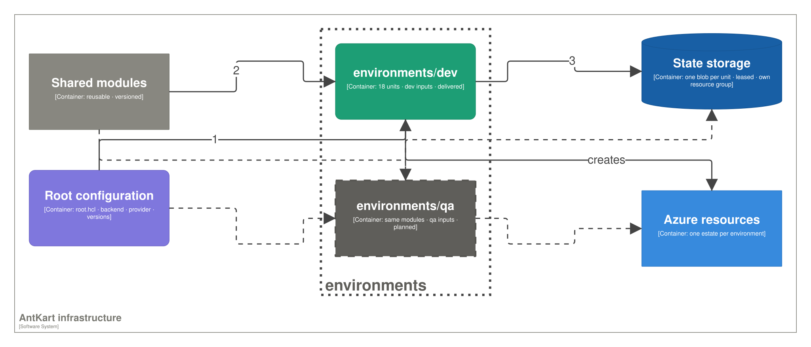
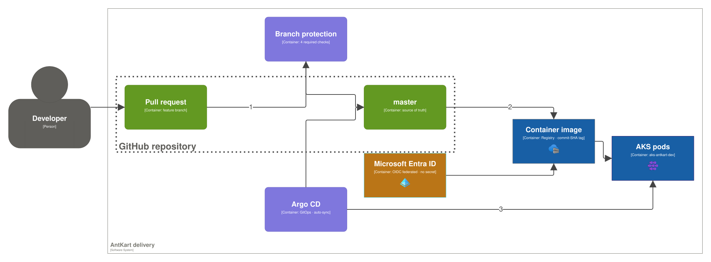

# AntKart — cloud-native e-commerce platform

AntKart is a **.NET 9** e-commerce platform of **six microservices** plus a **serverless notifications app**, running on **Azure Kubernetes Service**, provisioned with **Terraform and Terragrunt**, and delivered by **GitHub Actions and Argo CD**. This page is the front door: one diagram per topic, each linking into the [Development Guide](DevelopmentGuide.md) for the detail.

**Live:** [https://api.antkart.in](https://api.antkart.in) — served over a trusted Let's Encrypt production TLS certificate. (An earlier Phase-1 build ran locally on Docker Compose in a separate repository — [AntKart-MS](https://github.com/seesathish/AntKart-MS); this repository is the cloud-native platform.)

## System overview

<picture>
  <source media="(prefers-color-scheme: dark)" srcset="docs/C4Renders/renders/SystemOverview-dark.svg">
  
</picture>

Customers reach the platform through one public HTTPS endpoint; behind it, six services and a serverless notifications app coordinate over Azure Service Bus. Everything it touches — identity, payments, email, certificates, DNS — is a managed external system. Start with the [Development Guide](DevelopmentGuide.md) for how it is built, or read on for one topic at a time.

## Platform architecture

<picture>
  <source media="(prefers-color-scheme: dark)" srcset="docs/C4Renders/renders/PlatformArchitecture-dark.svg">
  
</picture>

Every service is the same inside: a dependency-free domain core, an application layer of CQRS handlers behind a validation pipeline, and a thin API host. Services never call each other synchronously for business flows — they coordinate through an orchestrated saga with a transactional outbox.

→ [Platform architecture](docs/development/0-platform-architecture.md)

## Infrastructure as code

<picture>
  <source media="(prefers-color-scheme: dark)" srcset="docs/C4Renders/renders/InfrastructureAsCode-dark.svg">
  
</picture>

Infrastructure is code, and a new environment is new inputs — not new code:

1. **Root configuration** — `root.hcl` generates the Terraform backend, provider and versions into every unit, so that config lives in exactly one place (DRY).
2. **Shared modules** — each environment's units compose the same reusable, versioned modules with that environment's own inputs.
3. **Isolated state** — an apply provisions the Azure resources and records per-unit state (one leased blob per unit) in Azure Storage, in a resource group of its own.

**QA is next.** It is drawn dashed because it reuses the same modules and the same root config with qa inputs. When it lands, its state key must use a distinct backend container or key prefix — the key is the unit path, so otherwise qa would overwrite dev state.

→ [Infrastructure as code](docs/development/1-infrastructure-as-code.md)

## Azure services

<picture>
  <source media="(prefers-color-scheme: dark)" srcset="docs/C4Renders/renders/AzureServices-dark.svg">
  
</picture>

1. The customer calls `https://api.antkart.in`.
2. The **planned** API Management edge (not yet deployed — [ADR-020](docs/adr/ADR-020-api-management-managed-edge-gateway.md)) will validate the token before the cluster. **Today** the request reaches the cluster's ingress-nginx directly, and the in-cluster gateway validates the Entra JWT.
3. The gateway routes each path to the service that owns it.
4. Products asks Discount for pricing over gRPC.
5. Products reads the catalogue from Cosmos DB.
6. Cart reads and writes Redis.
7. Order, Payments and Discount use PostgreSQL — in East US 2, so these calls cross a region boundary.
8. Order and Payments publish saga and stock events to Service Bus.
9. Customer-facing events go to Event Grid, deliberately separate from the business saga.
10. Event Grid triggers the serverless notification handler.
11. The handler sends email through Communication Services.

Entra ID backs every workload identity, so no credential is stored anywhere in the platform.

The platform runs entirely on managed Azure services — Cosmos DB, PostgreSQL, Managed Redis, Service Bus, Event Grid, Functions, Key Vault, and more. Each replaced a local Phase-1 component, adopting token-based authentication throughout. API Management, the managed edge, is planned.

Container Registry, Application Insights and Log Analytics are also provisioned. They appear in the DevOps and Observability diagrams, where they belong to the flow being described.

→ [Azure services](docs/development/2-azure-services.md)

## Kubernetes

<picture>
  <source media="(prefers-color-scheme: dark)" srcset="docs/C4Renders/renders/Kubernetes-dark.svg">
  
</picture>

The six services run on a managed AKS cluster with Azure CNI Overlay and an OIDC issuer, deployed from one generic Helm chart parameterised per service. Only the gateway is exposed through ingress with cert-manager TLS; the rest are ClusterIP-only. Pods reach Azure with no stored secret via workload identity.

→ [Kubernetes](docs/development/3-kubernetes.md)

## DevOps

<picture>
  <source media="(prefers-color-scheme: dark)" srcset="docs/C4Renders/renders/DevOps-dark.svg">
  
</picture>

The developer opens a pull request; from there delivery is automatic and pull-based:

1. **Branch protection** — the pull request must pass four required checks (build-test, unit + integration tests, SonarCloud, Trivy) before it can merge to `master`.
2. **Container image** — on merge, CD rebuilds the image with an immutable commit-SHA tag and pushes it to the Azure Container Registry, authenticating to Azure with an Entra **OIDC federated credential — no stored secret**.
3. **GitOps** — Argo CD reads `master`, syncs, and updates the pods on AKS (auto-sync + self-heal). Argo pulls from Git and the kubelet pulls the image — nothing is pushed to the cluster.

→ [DevOps](docs/development/4-devops.md)

## Observability

> **Diagram: Observability** — _not yet drawn_
> **Must show:** Serilog structured logging and OpenTelemetry traces feeding Log Analytics and Application Insights. Mark clearly what is delivered and what is planned. Answers "how do you know it is working".

Structured logging and distributed tracing are delivered: every service and Function emits Serilog JSON logs to the console (collected by the AKS OMS agent into Log Analytics) and exports OpenTelemetry traces to Application Insights. **Metrics are not currently collected** — a self-hosted Prometheus/Grafana stack was built and then deliberately removed in favour of a managed platform (Datadog, under evaluation); see [ADR-025](docs/adr/ADR-025-observability-architecture.md).

→ [Observability](docs/development/5-observability.md)

## Security

> **Diagram: Security** — _not yet drawn_
> **Must show:** the secret-less chain end to end - Entra ID tokens validated at the edge, per-service workload identity with federated credentials, Key Vault, data-plane RBAC scoped to individual resources, OIDC federated credentials for CI/CD with no stored secrets, TLS termination, the trust boundary between public and ClusterIP-only services, and known gaps including KI-002. Answers "how is it secured".

Security rests on no stored secrets anywhere and defence in depth on tokens: every identity authenticates through federation with least-privilege RBAC, and the Entra bearer token is validated at the edge and again inside each service. One tracked gap remains (KI-002), and the managed edge is a planned addition.

→ [Security](docs/development/6-security.md)

## Explore

- [Development Guide](DevelopmentGuide.md) — how the platform is built, layer by layer.
- [Testing](docs/test/README.md) — how it is verified: the automated `dotnet test` baseline (unit + integration) plus cloud-only end-to-end and security testing against the live platform at `api.antkart.in`.
- [Environment Provisioning Runbook](docs/guides/environment-provisioning-runbook.md) — stand up a complete new environment from an empty subscription, step by step.
- [Architecture decisions](docs/adr/README.md) — the ADRs and why each choice was made.
- [Known Issues Register](docs/KNOWN_ISSUES.md) — open defects and deferred fixes, notably KI-002 and KI-005.
