# The Architect's Playbook

Every concept this platform actually uses, explained once, honestly — with the gotchas that
came from building it. This is a study document first and engineering documentation second:
it is meant to be read one concept at a time, discussed aloud, and marked off only when it is
genuinely understood.

It follows the same honesty model as the [Environment Provisioning Runbook](guides/environment-provisioning-runbook.md):
a status tag changes only when the concept has been **proven**, never when it has merely been read.

## How to use this

- Read **one concept at a time**. Do not skim the whole file.
- After reading, **explain it aloud** — to a person, a rubber duck, or a recording. If you
  reach for the notes, you are not done.
- **Change the tag only when the concept is proven**, per the convention below. A green tag is
  a claim you can defend under questioning, not a claim that you have read the section.
- The **Interview traps** and **The 60-second answer** subsections are the drill. If you can
  answer the traps cold and deliver the 60-second answer without hesitation, the concept is 🟢.

## Status convention

| Tag | Meaning |
|-----|---------|
| 🟡 **To start** | Not yet studied or discussed. |
| 🔵 **In progress** | Studied; some gaps remain. |
| 🟢 **Proven** | Explained aloud without notes, gotchas recalled, code located. |

Every concept heading carries exactly one tag. Everything starts 🟡 — a tag is earned, not assigned.

## Progress at a glance

| # | Section | 🟡 To start | 🔵 In progress | 🟢 Proven | Total |
|---|---------|:-----------:|:--------------:|:---------:|:-----:|
| 1 | Platform — architecture and patterns | 15 | 0 | 0 | 15 |
| 2 | Infrastructure as code | 8 | 0 | 0 | 8 |
| 3 | Azure services | 11 | 0 | 0 | 11 |
| 4 | Kubernetes | 11 | 0 | 0 | 11 |
| 5 | Security and identity | 9 | 0 | 0 | 9 |
| 6 | Observability | 6 | 0 | 0 | 6 |
| 7 | GitOps | 5 | 0 | 0 | 5 |
| 8 | DevOps | 5 | 0 | 0 | 5 |
| | **Total** | **70** | **0** | **0** | **70** |

**Depth today.** All **70 concepts** are now written to the full template — *What it is*, *The problem
it solves*, *How it works* (with a table or diagram where it helps), *How AntKart uses it* (real type,
file, and resource names), *Alternatives and the trade-off*, *Gotchas* (sourced to KNOWN_ISSUES / the
runbook / ADRs), *Interview traps*, *The 60-second answer*, *Read the code*, and *To reach 🟢*. Nothing
in the syllabus is a stub. Every concept still starts 🟡 — the writing is done; the *proving* is yours.

**A note on honesty.** Where an ADR's prose has drifted from the code as built, this document
follows the **code** and says so. Where a concept in the syllabus is named but **not implemented**
(network policies, storage, autoscaling), it says that plainly rather than pretending — knowing
what a platform deliberately left out is itself interview-grade material.

### Where to start

> The sections are ordered by architecture, not by study priority. For interview
> preparation, work in this order — it front-loads the concepts this platform has the most
> original material on, because they were learned by hitting them:
>
> 1. **Security and identity** — workload identity, the separate permission planes,
>    DefaultAzureCredential, Entra and PKCE.
> 2. **Infrastructure as code** — state as memory, remote state and key collisions,
>    modules versus environments.
> 3. **GitOps** — Argo CD architecture, what Argo does not watch, sync and self-heal.
> 4. **Kubernetes** — the reconciliation loop, ConfigMaps and Secrets, Helm and what it
>    is not.
> 5. **Observability** — OpenTelemetry, trace correlation.
> 6. **Platform** — the outbox, the saga, CQRS.
> 7. **DevOps**, then **Azure services** — broadest, and the easiest to speak to from
>    existing experience.
>
> A concept moves to 🟢 only after it has been explained aloud, without notes, with its
> gotchas recalled and its code located. Reading it does not move the tag.

---

# 1. Platform — architecture and patterns

### 1. Clean Architecture and the dependency rule 🟡

**What it is** — A way of arranging a service into concentric layers — Domain at the centre,
then Application, then Infrastructure and the API host on the outside — with one rule: source
code dependencies only ever point **inward**. The Domain knows nothing about EF Core, MongoDB,
HTTP, or MassTransit; the outer layers depend on the inner, never the reverse.

**The problem it solves** — Without it, business rules get tangled with the database driver and
the web framework, so you cannot change one without breaking the other, and you cannot unit-test
the rules without spinning up infrastructure. The dependency rule keeps the core testable in
isolation and lets the outer, volatile layers be swapped without touching the business logic.

**How it works** — Four layers, dependencies pointing only inward:

| Layer | Depends on | Holds | Never contains |
|---|---|---|---|
| **Domain** | nothing | entities, value objects, domain events, specifications, business rules | EF Core, Mongo, HTTP, MassTransit |
| **Application** | Domain, BuildingBlocks | CQRS handlers, DTOs, validators, interfaces (`IOrderRepository`) | concrete DB/broker code |
| **Infrastructure** | Application (+ Domain) | EF/Mongo, repositories, DbContext, messaging, the interface *implementations* | — |
| **API / Grpc** | Application, Infrastructure | the thin host, endpoints, DI wiring | business logic |

The inward rule means the Domain is a pure library you can unit-test with no database or broker, and the volatile outer layers can be swapped without touching it. Dependencies are inverted at the boundary: the Application *declares* `IOrderRepository`; Infrastructure *implements* it.

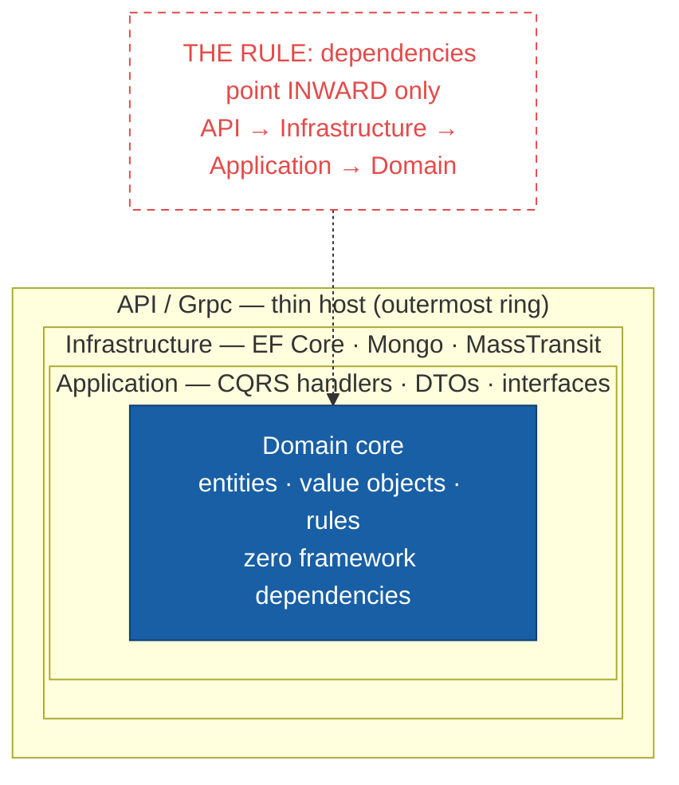
```mermaid
flowchart TD
    subgraph L4["API / Grpc — thin host (outermost ring)"]
        subgraph L3["Infrastructure — EF Core · Mongo · MassTransit"]
            subgraph L2["Application — CQRS handlers · DTOs · interfaces"]
                L1["Domain core<br/>entities · value objects · rules<br/>zero framework dependencies"]:::datastore
            end
        end
    end
    DIR["THE RULE: dependencies point INWARD only<br/>API → Infrastructure → Application → Domain"]:::issue
    DIR -.-> L1

    classDef datastore fill:#185FA5,stroke:#0F3F6E,color:#FFF;
    classDef issue fill:none,stroke:#E24B4A,color:#E24B4A,stroke-dasharray:5 4;
```

**How AntKart uses it** — Every service repeats the same four projects (`AK.<Service>.Domain/.Application/.Infrastructure/.API`). The direction is enforced by `ProjectReference`, not discipline: `AK.Order.Application` references only `AK.Order.Domain` + `AK.BuildingBlocks`; `AK.Order.Infrastructure` references Application. `MongoDB.Driver` is confined to `AK.Products.Infrastructure`; the Products Domain has zero infrastructure dependencies. Tests reference Domain/Application/Infrastructure but never the API/Grpc host, so the whole platform is unit-tested without a running host.

**Alternatives and the trade-off** — The alternative is classic **n-tier** (the business layer depends *downward* on the data layer, so rules are coupled to the database) or a **transaction-script / "big ball of mud"** where everything sits in the controller. Clean Architecture inverts the data dependency so the core is dependency-free, at the cost of more projects and a little ceremony (an interface in Application, an implementation in Infrastructure). For a six-service platform meant to be testable and independently evolvable, that ceremony pays for itself. Decision: [ADR-002](adr/ADR-002-clean-architecture-and-ddd.md).

**Gotchas** —
- **A Domain type referencing a driver is the smell.** If `MongoDB.Driver` or `DbContext` appears in a Domain file, the rule is broken — the compiler won't catch it (the ProjectReference allows transitive types), so it's a review discipline.
- **The ADRs misplace the saga.** [ADR-002](adr/ADR-002-clean-architecture-and-ddd.md)/[ADR-005](adr/ADR-005-saga-orchestration.md) say `OrderSaga` lives in Infrastructure; it's actually in `AK.Order.Application/Sagas/`. Trust the code. (No KI.)

**Interview traps** —
- *"Which way do dependencies point, and why inward?"* — Inward, toward the Domain, so the core has no framework dependencies and stays testable/swappable. "Layers on top of each other" without the direction is a read-about answer.
- *"How is the rule actually enforced here?"* — By `ProjectReference` graphs, not convention — Application literally cannot see Infrastructure.
- *"Where does `MongoDB.Driver` live and why does that matter?"* — Only in `AK.Products.Infrastructure`; keeping it out of Domain is the whole point of the rule.
- *"Isn't this over-engineering for CRUD?"* — For one CRUD endpoint, maybe; for six coordinating services with different stores, the dependency-free core is what lets them share patterns and stay testable (ADR-002).

**The 60-second answer** — "Every service is four layers — Domain, Application, Infrastructure, API — and dependencies only ever point inward toward the Domain. The Domain is pure: entities, value objects, business rules, no EF Core, no Mongo, no HTTP. Application sits on Domain and holds the CQRS handlers and the *interfaces* like `IOrderRepository`; Infrastructure implements those interfaces and owns the database and messaging; the API host is thin. We enforce it with ProjectReference graphs, not discipline — Application can't even see Infrastructure. The payoff is a dependency-free core we unit-test with no database and volatile outer layers we can swap without touching the rules."

**Read the code** — The dependency direction is enforced by `ProjectReference`, not convention:
`AK.Order/AK.Order.Application/AK.Order.Application.csproj` references only `AK.Order.Domain` and
`AK.BuildingBlocks` (Application never sees Infrastructure); `AK.Order/AK.Order.Infrastructure/AK.Order.Infrastructure.csproj`
references Domain + Application. Decision: [ADR-002](adr/ADR-002-clean-architecture-and-ddd.md).

**To reach 🟢** — Draw the four layers and the inward arrows from memory, and state which project each of (`Order` entity, `IOrderRepository`, `OrderRepository`, `OrderEndpoints`) lives in. Then open any service and confirm its `.Application.csproj` has no reference to `.Infrastructure`.

---

### 2. CQRS with MediatR 🟡

**What it is** — CQRS (Command Query Responsibility Segregation) splits the things that *change*
state (commands) from the things that *read* it (queries), giving each its own model and handler.
MediatR is the in-process library that carries a request object to its single handler, so an
endpoint never news-up a handler or a service — it sends a `CreateOrderCommand` and MediatR finds
`CreateOrderCommandHandler`.

**The problem it solves** — A single fat "service class" per entity accumulates every read and
write, grows untestable, and couples the caller to concrete types. Separating commands from
queries lets each evolve independently (a query can be denormalised and fast; a command can be
transactional and validated), and routing through a mediator removes the direct dependency from
caller to handler, so the endpoint layer stays thin.

**How it works** — One request type maps to exactly one handler. A request flows through a
**pipeline of behaviours** before reaching its handler — in AntKart the validation behaviour runs
first (see concept 3). Handlers return **DTOs or primitives, never domain entities**, which keeps
the persistence model from leaking to the wire.

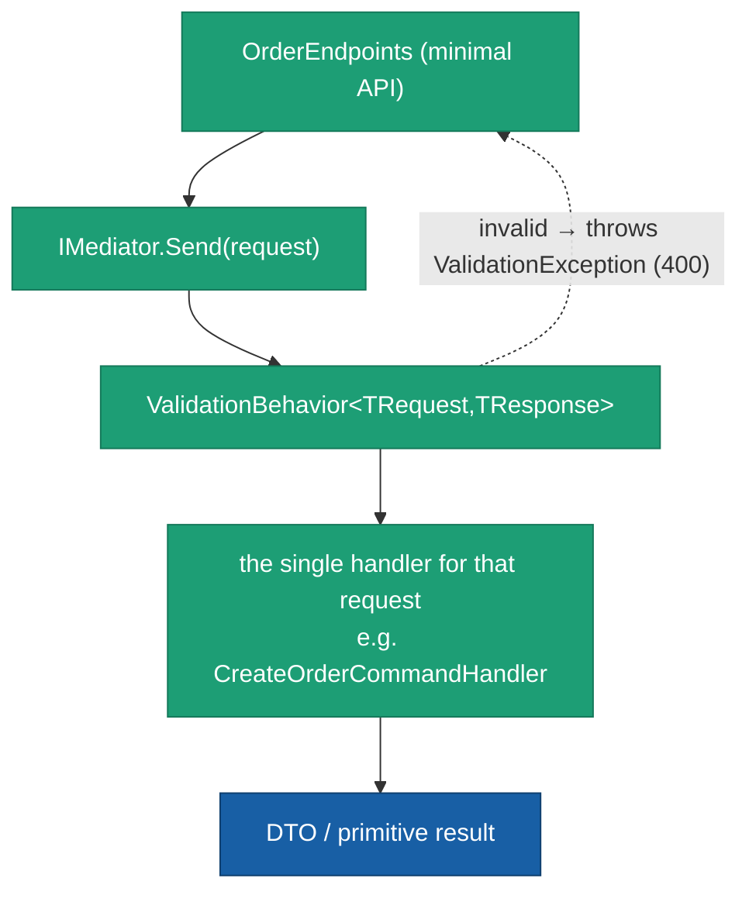
```mermaid
flowchart TD
    EP["OrderEndpoints (minimal API)"]:::service
    MED["IMediator.Send(request)"]:::service
    VB["ValidationBehavior&lt;TRequest,TResponse&gt;"]:::service
    H["the single handler for that request<br/>e.g. CreateOrderCommandHandler"]:::service
    DTO["DTO / primitive result"]:::datastore

    EP --> MED --> VB --> H --> DTO
    VB -. "invalid → throws ValidationException (400)" .-> EP

    classDef external fill:#B4B2A9,stroke:#7A7870,color:#111,stroke-dasharray:4 3;
    classDef service fill:#1D9E75,stroke:#14795A,color:#FFF;
    classDef paas fill:#0078D4,stroke:#005A9E,color:#FFF;
    classDef datastore fill:#185FA5,stroke:#0F3F6E,color:#FFF;
    classDef identity fill:#BA7517,stroke:#8A560F,color:#FFF;
    classDef edge fill:#7F77DD,stroke:#5B52B8,color:#FFF;
    classDef cicd fill:#639922,stroke:#496F18,color:#FFF;
    classDef issue fill:none,stroke:#E24B4A,color:#E24B4A,stroke-dasharray:5 4;
```

**How AntKart uses it** — MediatR 12.4.1 is registered once per service with an assembly scan:
`services.AddMediatR(cfg => cfg.RegisterServicesFromAssembly(typeof(ServiceCollectionExtensions).Assembly))`
in `AK.Order/AK.Order.Application/Extensions/ServiceCollectionExtensions.cs:12-13`. Commands and
queries are organised as **vertical slices** under `Features/` — `CreateOrder`, `CancelOrder`,
`UpdateOrderStatus`, `GetOrderById`, `GetOrders`, `GetOrdersByUser` — each a folder with its
command/query, handler, and validator. A concrete read handler:
`GetOrderByIdQueryHandler(IUnitOfWork uow) : IRequestHandler<GetOrderByIdQuery, OrderDto?>` in
`AK.Order/AK.Order.Application/Features/GetOrderById/GetOrderByIdQueryHandler.cs` — note it returns
`OrderDto?`, never the `Order` entity.

**Alternatives and the trade-off** — The alternative is direct service classes (no mediator) or a
full separate read store (event sourcing / materialised views). AntKart uses **light CQRS**: one
database per service, commands and queries separated at the handler level only — not a separate
read model. What is given up is the raw simplicity of calling a method directly; what is bought is
a uniform pipeline (validation, logging, future behaviours) that every request crosses for free.
Decision: [ADR-010](adr/ADR-010-CQRS-and-MediatR.md).

**Gotchas** — Do **not** add `MediatR.Extensions.Microsoft.DependencyInjection` — it was removed in
v12 and the registration lives in the core package (project instruction, and it is a real trap that
bites people upgrading from v11). Handlers returning a domain entity instead of a DTO is the other
recurring mistake — it compiles, but it leaks the persistence model and breaks the layer rule.
(No KI recorded; sourced from the project conventions.)

**Interview traps** —
- *"Does CQRS require two databases?"* — Testing whether you conflate the pattern with event
  sourcing. **No.** CQRS is a separation of models/handlers; a separate read store is one
  possible implementation, not a requirement. AntKart runs one store per service.
- *"Where does validation happen in a MediatR setup, and why there?"* — Testing whether you know
  the pipeline behaviour. In a `IPipelineBehavior` that runs **before** the handler, so every
  request is validated uniformly and the handler can assume valid input.
- *"MediatR is just an in-process message bus — so is it the same as the saga over Service Bus?"* —
  Testing whether you separate in-process dispatch from cross-service messaging. No: MediatR is a
  synchronous in-process mediator with one handler per request; the saga is asynchronous, durable,
  cross-service messaging over a broker.
- *"Why return a DTO and not the entity?"* — Testing the dependency rule. The entity is the
  persistence/domain model; returning it couples the API contract to it and can serialise more
  than intended (including domain events / navigation properties).

**The 60-second answer** — "Every request in a service is a command or a query, and each has one
handler. The endpoint doesn't call a service class directly — it sends a request object through
MediatR, which routes it to its single handler. Before the handler runs, the request crosses a
pipeline; in our platform the first behaviour is FluentValidation, so handlers can assume valid
input. Handlers always return DTOs, never entities, so the persistence model never leaks to the
wire. It's light CQRS — separation at the handler level, one database per service, no separate
read store — which gives us a uniform, testable request path without event-sourcing complexity."

**Read the code** — `AK.Order/AK.Order.Application/Extensions/ServiceCollectionExtensions.cs:12-17`
(MediatR + validator + pipeline registration); `AK.Order/AK.Order.Application/Features/` (the six
slices); `AK.Order/AK.Order.Application/Features/GetOrderById/GetOrderByIdQueryHandler.cs`. Decision:
[ADR-010](adr/ADR-010-CQRS-and-MediatR.md).

**To reach 🟢** — Explain light-vs-full CQRS without notes and name where AntKart draws the line.
Then open `CreateOrderCommandHandler` and trace one POST from endpoint → MediatR → validation →
handler → DTO, predicting the return type at each hop before you read it.

---

### 3. The validation pipeline behaviour 🟡

**What it is** — A single generic MediatR behaviour, `ValidationBehavior<TRequest,TResponse>`, that
sits in the request pipeline, runs every FluentValidation validator registered for the incoming
request type, and throws if any fail — so validation happens in exactly one place for every command
and query, not scattered through handlers or endpoints.

**The problem it solves** — Without a pipeline behaviour, each handler has to remember to validate
its own input, and validation logic drifts and duplicates. Centralising it means a handler can
assume its request is already valid, and a validation failure produces one consistent HTTP 400
across every service.

**How it works** — MediatR lets you wrap every `Send` in a chain of `IPipelineBehavior<TRequest,TResponse>`. `ValidationBehavior` receives all the `IValidator<TRequest>` registered for the incoming request, runs them, collects the failures, and — if any — throws `FluentValidation.ValidationException` *before* calling `next()` (the handler). If validation passes, it calls the handler. So the handler only ever runs against valid input, and the failure path is identical for every request type.

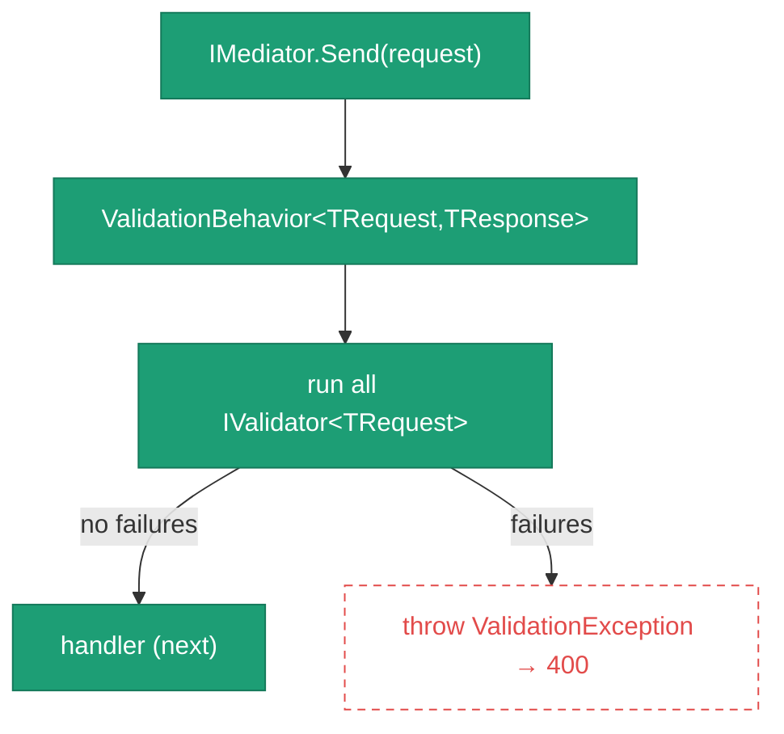
```mermaid
flowchart TD
    REQ["IMediator.Send(request)"]:::service
    VB["ValidationBehavior&lt;TRequest,TResponse&gt;"]:::service
    VAL["run all IValidator&lt;TRequest&gt;"]:::service
    H["handler (next)"]:::service
    EX["throw ValidationException → 400"]:::issue

    REQ --> VB --> VAL
    VAL -->|no failures| H
    VAL -->|failures| EX

    classDef external fill:#B4B2A9,stroke:#7A7870,color:#111,stroke-dasharray:4 3;
    classDef service fill:#1D9E75,stroke:#14795A,color:#FFF;
    classDef paas fill:#0078D4,stroke:#005A9E,color:#FFF;
    classDef datastore fill:#185FA5,stroke:#0F3F6E,color:#FFF;
    classDef identity fill:#BA7517,stroke:#8A560F,color:#FFF;
    classDef edge fill:#7F77DD,stroke:#5B52B8,color:#FFF;
    classDef cicd fill:#639922,stroke:#496F18,color:#FFF;
    classDef issue fill:none,stroke:#E24B4A,color:#E24B4A,stroke-dasharray:5 4;
```

**How AntKart uses it** — There is **one** `ValidationBehavior` in `AK.BuildingBlocks/Behaviors`, shared by every service — no per-service copies. Each service's `AddApplication` registers it open-generic (`AddTransient(typeof(IPipelineBehavior<,>), typeof(ValidationBehavior<,>))`) and scans the assembly for validators (`AddValidatorsFromAssembly`). The thrown `FluentValidation.ValidationException` is mapped to **HTTP 400** by the shared `ExceptionHandlerMiddleware` (or to gRPC `InvalidArgument` by the interceptor in Discount).

**Alternatives and the trade-off** — Alternatives: validate inside each handler (scattered, easy to forget), use `[ApiController]` + data annotations (limited expressiveness, and AntKart deliberately avoids `[ApiController]`), or call validators manually at the endpoint. The pipeline behaviour centralises it so a handler can *assume* validity and the 400 response is uniform, at the cost of a little MediatR indirection (validation happens "somewhere in the pipeline," not in the handler you're reading). Worth it for consistency across six services.

**Gotchas** —
- **No registered validator means no validation — silently.** The behaviour runs whatever `IValidator<TRequest>` exists; if you forget to register the validators assembly (or misname a validator), the request sails through with zero checks and no error. (No KI; a real footgun.)
- **It throws, it doesn't return a `Result`.** Validation failures are exceptions mapped to 400 — distinct from the `Result<T>` pattern AntKart uses for *expected business* failures (not found, invalid transition). Don't conflate the two.

**Interview traps** —
- *"Where does request validation run and why there?"* — In a MediatR `IPipelineBehavior` before the handler, so every command/query is validated uniformly and handlers assume valid input.
- *"How does a validation failure become an HTTP 400?"* — The behaviour throws `FluentValidation.ValidationException`; `ExceptionHandlerMiddleware` maps it to 400. Testing whether you know the end-to-end path.
- *"You added a validator but it never runs — why?"* — Its assembly wasn't scanned/registered; the behaviour only invokes registered validators. The ran-it question.
- *"Why not just use data annotations?"* — Less expressive, couples validation to DTO attributes, and the project avoids `[ApiController]`; FluentValidation in a pipeline is testable and centralised.

**The 60-second answer** — "Validation is a single MediatR pipeline behaviour shared across every service. Before any handler runs, `ValidationBehavior` pulls all the FluentValidation validators registered for that request type, runs them, and if any fail it throws a `ValidationException` — which our shared exception middleware turns into a 400. If they pass, it calls the handler. So validation lives in exactly one place, handlers can assume valid input, and every service returns the same shape of 400. The subtle trap is that it only runs *registered* validators — forget to register them and requests pass unchecked with no error."

**Read the code** — `AK.BuildingBlocks/AK.BuildingBlocks/Behaviors/ValidationBehavior.cs` (the
shared behaviour; throws `FluentValidation.ValidationException`); wired open-generic in
`AK.Order/AK.Order.Application/Extensions/ServiceCollectionExtensions.cs:17`
(`AddTransient(typeof(IPipelineBehavior<,>), typeof(ValidationBehavior<,>))`). The exception maps to
HTTP 400 in `ExceptionHandlerMiddleware`.

**To reach 🟢** — Explain, without notes, why the behaviour runs before the handler and what happens when no validator is registered. Then trace a bad `CreateOrderCommand` from `Send` → behaviour → exception → 400, predicting the status code before you check the endpoint.

---

### 4. Repository, Specification and Unit of Work 🟡

**What it is** — Three persistence patterns used together. A **Repository** is an interface in the
Application layer (`IOrderRepository`) that exposes collection-like operations and hides the actual
store. A **Specification** is a reusable, composable query object (`OrdersByUserSpecification`) so
query logic lives in the Domain rather than as ad-hoc LINQ in handlers. A **Unit of Work**
(`IUnitOfWork`) groups changes and commits them in one transaction via `SaveChangesAsync`.

**The problem it solves** — Handlers calling the DbContext directly bind the Application layer to
EF Core and scatter query logic everywhere. Repositories invert that dependency (Application defines
the interface, Infrastructure implements it); specifications make queries testable and reusable;
the unit of work ensures a set of changes commits atomically rather than piecemeal.

**How it works** — Three patterns divide the persistence job:

| Pattern | Where | Job |
|---|---|---|
| **Repository** | interface in Application, impl in Infrastructure | collection-like access (`GetByIdAsync`, `AddAsync`, `ListAsync(spec)`) that hides the store |
| **Specification** | Domain | a reusable query object — criteria + includes + paging — so query logic is testable and named, not ad-hoc LINQ in handlers |
| **Unit of Work** | interface in Application, impl over DbContext | groups changes and commits them atomically via one `SaveChangesAsync` |

A handler asks the repository for data (optionally passing a specification), mutates aggregates, then calls `uow.SaveChangesAsync()` once — so multiple changes land in a single transaction, and the handler never touches `DbContext`.

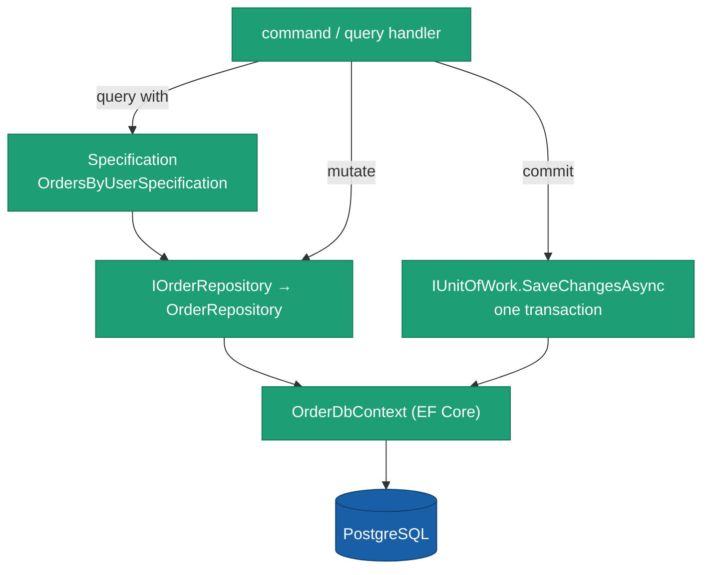
```mermaid
flowchart TD
    H["command / query handler"]:::service
    SPEC["Specification<br/>OrdersByUserSpecification"]:::service
    REPO["IOrderRepository → OrderRepository"]:::service
    UOW["IUnitOfWork.SaveChangesAsync<br/>one transaction"]:::service
    CTX["OrderDbContext (EF Core)"]:::service
    DB[("PostgreSQL")]:::datastore
    H -->|query with| SPEC
    SPEC --> REPO
    H -->|mutate| REPO
    H -->|commit| UOW
    REPO --> CTX
    UOW --> CTX
    CTX --> DB

    classDef service fill:#1D9E75,stroke:#14795A,color:#FFF;
    classDef datastore fill:#185FA5,stroke:#0F3F6E,color:#FFF;
```

**How AntKart uses it** — `IOrderRepository` (Application) exposes `GetByIdAsync`, `ListAsync(ISpecification<Order>)`, `AddAsync`, `CountAsync`, etc.; `OrderRepository` (Infrastructure) implements it over `OrderDbContext`. Specifications live in `AK.Order.Domain/Specifications/` (`OrderByIdSpecification`, `OrdersByUserSpecification`, `OrdersByStatusSpecification`, `OrdersPagedSpecification`) on a shared `BaseSpecification`. `IUnitOfWork` exposes `Orders` + `SaveChangesAsync`. The same trio appears in Products (over Mongo) and ShoppingCart, so the pattern is uniform across stores.

**Alternatives and the trade-off** — The alternative is injecting `DbContext` straight into handlers (couples Application to EF Core and scatters LINQ) or a single generic `Repository<T>` (less abstraction but leaks IQueryable). The known critique — **"EF Core's `DbContext` is already a Unit of Work and its `DbSet`s are already repositories"** — is real: this adds a layer on top of one. AntKart accepts that indirection deliberately, for a testable Application layer that mocks `IOrderRepository`/`IUnitOfWork` and for query reuse via specifications. Decision: [ADR-011](adr/ADR-011-Repository-Specification-and-Unit-of-Work.md).

**Gotchas** —
- **You are wrapping something that is already a UoW+repo.** That's the standard objection; know it and know why the abstraction is still chosen (testability, store-agnostic handlers). (No KI.)
- **A specification with the wrong `Includes` causes N+1 or over-fetching.** The query lives in the spec, so a performance bug hides there, not in the handler.

**Interview traps** —
- *"Isn't `DbContext` already a Unit of Work and repository? Why wrap it?"* — Yes it is; the wrapper buys a mockable Application boundary and store-agnostic handlers. Answering only "abstraction is good" is read-about; naming the objection is ran-it.
- *"What does a Specification give you over a LINQ query in the handler?"* — Reuse, a name, testability, and it keeps query logic in the Domain rather than the Application layer.
- *"How do two changes in one handler commit atomically?"* — One `IUnitOfWork.SaveChangesAsync()` — the DbContext transaction spans both. Testing whether you know where the transaction boundary is.
- *"Where does the repository interface live vs its implementation, and why split them?"* — Interface in Application, implementation in Infrastructure — the dependency-inversion seam of Clean Architecture.

**The 60-second answer** — "Persistence is three patterns. The Repository is an interface in the Application layer — `IOrderRepository` — implemented in Infrastructure over the DbContext, so handlers get collection-like access and never see EF Core. A Specification is a reusable query object in the Domain, so query logic is named and testable instead of ad-hoc LINQ in handlers. And the Unit of Work groups a handler's changes into one `SaveChangesAsync` so they commit atomically. The honest caveat is that EF's DbContext is already a unit of work and its DbSets are already repositories — we wrap them anyway, deliberately, to keep the Application layer mockable and store-agnostic, which matters across Postgres, Mongo, and Redis services."

**Read the code** — `AK.Order/AK.Order.Application/Common/Interfaces/IOrderRepository.cs` and
`IUnitOfWork.cs` (Application-layer interfaces); `AK.Order/AK.Order.Infrastructure/Persistence/Repositories/OrderRepository.cs`
and `UnitOfWork.cs` (implementations); `AK.Order/AK.Order.Domain/Specifications/` and
`AK.Order/AK.Order.Domain/Common/BaseSpecification.cs` (the specification base + concrete specs).
Decision: [ADR-011](adr/ADR-011-Repository-Specification-and-Unit-of-Work.md).

**To reach 🟢** — Without notes, explain the "DbContext is already a UoW" objection and AntKart's answer to it. Then open `OrdersByUserSpecification` and predict the SQL shape (filter + paging) before reading the repository call.

---

### 5. Domain events versus integration events 🟡

**What it is** — Two kinds of "something happened" notification with different scopes. A **domain
event** (`OrderCreatedEvent`) is raised inside an aggregate and handled **in-process**, within the
same service and transaction. An **integration event** (`OrderCreatedIntegrationEvent`) is published
**across services** over the message bus. They are deliberately different types, in different
layers.

**The problem it solves** — Collapsing the two makes a service publish its internal state changes
onto the wire, coupling other services to its domain model. Keeping them separate means the Domain
can raise rich in-process events without any messaging dependency, and only a deliberately-shaped,
denormalised integration event crosses the service boundary.

**How it works** — Two events, two scopes, two lifetimes:

| | Domain event | Integration event |
|---|---|---|
| **Scope** | in-process, one service | cross-service, over the bus |
| **Raised by** | the aggregate (`order.AddDomainEvent(...)`) | a handler/consumer publishing to Service Bus |
| **Shape** | rich, domain-shaped | denormalised, deliberately flat (enriched with e.g. `CustomerEmail`, `OrderNumber`) |
| **Lives in** | `Domain/Events/` | `AK.BuildingBlocks/Messaging/IntegrationEvents/` (a shared contract) |
| **Dependency** | none (Domain has no messaging) | the messaging contract both sides reference |

An aggregate raises a domain event as a fact ("order created"); it's dispatched in-process after the save. When that fact must leave the service, a handler publishes a *separate* integration event — a stable, denormalised contract — so other services never see the internal domain model.

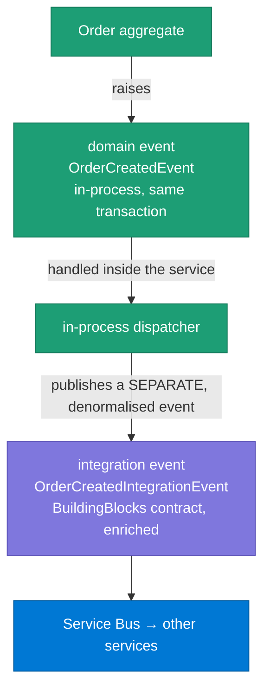
```mermaid
flowchart TD
    AGG["Order aggregate"]:::service
    DE["domain event<br/>OrderCreatedEvent<br/>in-process, same transaction"]:::service
    DISP["in-process dispatcher"]:::service
    IE["integration event<br/>OrderCreatedIntegrationEvent<br/>BuildingBlocks contract, enriched"]:::edge
    SB["Service Bus → other services"]:::paas
    AGG -->|raises| DE
    DE -->|handled inside the service| DISP
    DISP -->|publishes a SEPARATE, denormalised event| IE
    IE --> SB

    classDef service fill:#1D9E75,stroke:#14795A,color:#FFF;
    classDef edge fill:#7F77DD,stroke:#5B52B8,color:#FFF;
    classDef paas fill:#0078D4,stroke:#005A9E,color:#FFF;
```

**How AntKart uses it** — Domain events (`OrderCreatedEvent`, `OrderStatusChangedEvent`, `OrderCancelledEvent`) are raised inside `Order.cs` and cleared after commit (`order.ClearDomainEvents()`). The cross-service contracts live once in `AK.BuildingBlocks/Messaging/IntegrationEvents/` (`OrderCreatedIntegrationEvent`, `StockReservedIntegrationEvent`, `PaymentSucceededIntegrationEvent`, …) and are *enriched* — they carry `CustomerEmail`/`CustomerName`/`OrderNumber` so consumers needn't call back. One definition, referenced by both publisher and consumer, so the shape can't drift. Decision: [ADR-009](adr/ADR-009-domain-events-vs-integration-events.md); shared-contracts rationale: [ADR-008](adr/ADR-008-shared-ddd-contracts-in-buildingblocks.md).

**Alternatives and the trade-off** — You could publish the domain event directly to the bus (simplest, but couples every consumer to your domain model and every internal change leaks onto the wire) or duplicate the integration contract in each service (drifts). AntKart keeps them separate and puts the integration contract in BuildingBlocks — one shared type — trading a little duplication of "shape" for a stable cross-service boundary. The enrichment (copying `CustomerEmail` into the event) is deliberate denormalisation so consumers avoid a callback.

**Gotchas** —
- **Publishing the domain event across the bus is the classic mistake.** It couples consumers to your internals and forces a version dance on every domain change. Keep the wire contract separate.
- **Enriched integration events denormalise on purpose.** Copying `CustomerEmail` into the event isn't sloppiness — it lets the consumer act without calling back (and matches the saga carrying context in its state). (No KI.)

**Interview traps** —
- *"What's the difference between a domain event and an integration event?"* — Scope and coupling: in-process vs cross-service; the domain event is domain-shaped, the integration event is a stable denormalised contract. If you say "they're the same, just a bus," you've missed it.
- *"Why not publish the domain event straight to Service Bus?"* — It couples consumers to your domain model and versions badly. The design question.
- *"Where does the integration-event type live and why there?"* — In BuildingBlocks, referenced by both publisher and consumer, so one definition can't drift (ADR-008).
- *"Why does `OrderCreatedIntegrationEvent` carry the customer email when the order already has it?"* — Deliberate enrichment/denormalisation so the consumer needn't call back.

**The 60-second answer** — "There are two kinds of event. A domain event is raised inside an aggregate and handled in-process, in the same service and transaction — it's domain-shaped and the Domain has no messaging dependency at all. An integration event is what crosses the service boundary over Service Bus, and it's a separate, stable, denormalised contract that lives once in BuildingBlocks so the publisher and consumer share one definition. We never publish the domain event onto the wire — that would couple every consumer to our internals. And the integration events are enriched — they carry things like the customer's email — so a consumer can act without calling back."

**Read the code** — Domain events: `AK.Order/AK.Order.Domain/Events/` (`OrderCreatedEvent`,
`OrderStatusChangedEvent`, `OrderCancelledEvent`), raised inside `AK.Order/AK.Order.Domain/Entities/Order.cs`.
Integration events: `AK.BuildingBlocks/AK.BuildingBlocks/Messaging/IntegrationEvents/` (the shared
cross-service contracts). Decision: [ADR-009](adr/ADR-009-domain-events-vs-integration-events.md).

**To reach 🟢** — Without notes, give two reasons never to publish a domain event across the bus, and explain why the integration events are enriched. Then list which `AK.BuildingBlocks/Messaging/IntegrationEvents/` type each of Order/Products/Payments publishes.

---

### 6. The orchestrated saga and its state machine 🟡

**What it is** — A saga coordinates a business transaction that spans several services, none of
which shares a database, by reacting to messages and holding its own persistent state between
steps. AntKart's `OrderSaga` is an **orchestrated** saga (one central coordinator drives the flow)
built as a MassTransit state machine: it moves an order from creation, through stock reservation,
to confirmation or cancellation, publishing the next event at each step.

**The problem it solves** — You cannot wrap "create the order, reserve the stock, take the payment"
in one ACID transaction when each step lives in a different service with a different database. A
saga replaces the impossible distributed transaction with a sequence of local transactions plus
compensating actions, and the state machine makes the legal transitions explicit instead of hiding
them in scattered `if` statements.

**How it works** — The saga listens for correlated events, each keyed to a saga instance by
`OrderId`. It starts in `Initial`, and `OrderCreatedIntegrationEvent` moves it to `StockPending`.
From there, `StockReservedIntegrationEvent` publishes `OrderConfirmedIntegrationEvent` and finalises;
`StockReservationFailedIntegrationEvent` publishes `OrderCancelledIntegrationEvent` and finalises.
MassTransit persists the saga row to PostgreSQL between steps (with an optimistic-concurrency
`Version`), so the flow survives a restart mid-transaction.

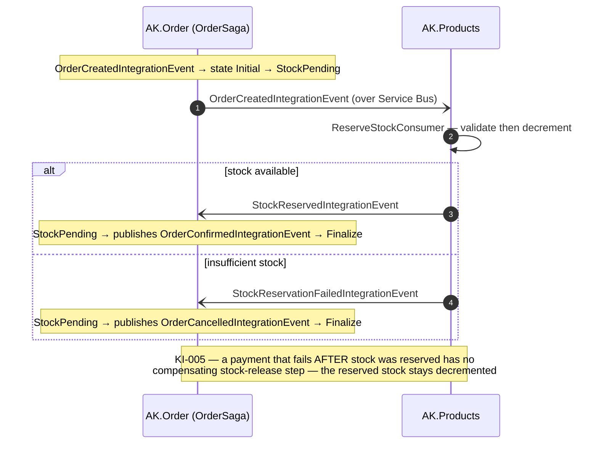
```mermaid
sequenceDiagram
    autonumber
    participant O as AK.Order (OrderSaga)
    participant P as AK.Products
    Note over O: OrderCreatedIntegrationEvent → state Initial → StockPending
    O-)P: OrderCreatedIntegrationEvent (over Service Bus)
    P->>P: ReserveStockConsumer — validate then decrement
    alt stock available
        P-)O: StockReservedIntegrationEvent
        Note over O: StockPending → publishes OrderConfirmedIntegrationEvent → Finalize
    else insufficient stock
        P-)O: StockReservationFailedIntegrationEvent
        Note over O: StockPending → publishes OrderCancelledIntegrationEvent → Finalize
    end
    Note over O,P: KI-005 — a payment that fails AFTER stock was reserved has no<br/>compensating stock-release step — the reserved stock stays decremented
```

**How AntKart uses it** — `OrderSaga : MassTransitStateMachine<OrderSagaState>` in
`AK.Order/AK.Order.Application/Sagas/OrderSaga.cs` declares states `StockPending`, `Confirmed`,
`Cancelled` and events `OrderCreated`, `StockReserved`, `StockReservationFailed`, correlated by
`OrderId`. State is persisted via an EF repository registered in
`AK.Order/AK.Order.Infrastructure/Extensions/ServiceCollectionExtensions.cs:58-64`
(`AddSagaStateMachine<OrderSaga,OrderSagaState>().EntityFrameworkRepository(...UsePostgres())`,
`ConcurrencyMode.Optimistic`). The state object `OrderSagaState` carries `CorrelationId`, `Version`,
`CurrentState`, and enough business context (`UserId`, `OrderNumber`, `TotalAmount`) that later
steps never re-query the Orders database.

**Alternatives and the trade-off** — The alternatives are **choreography** (no central coordinator;
each service reacts to events and emits the next — more decoupled but the flow is emergent and hard
to see) and **two-phase commit / distributed transactions** (a single ACID transaction across
services — strong consistency but a blocking coordinator, poor availability, and not supported by
these managed stores). AntKart chose **orchestration**: the flow is visible in one state machine and
easy to reason about, at the cost of one service owning the coordination.
Decision: [ADR-005](adr/ADR-005-saga-orchestration.md).

**Gotchas** —
- **No compensation on payment failure — KI-005** ([KNOWN_ISSUES.md](KNOWN_ISSUES.md), Severity
  Medium). Stock is decremented when it is reserved, but if payment later fails the order moves to
  `PaymentFailed` with **no** step that releases the reserved stock — a real, tracked gap, not a
  design feature.
- **The ADRs misplace the saga.** [ADR-002](adr/ADR-002-clean-architecture-and-ddd.md) and
  [ADR-005](adr/ADR-005-saga-orchestration.md) say `OrderSaga` lives in `AK.Order.Infrastructure`.
  It actually lives in **`AK.Order/AK.Order.Application/Sagas/`**; only its *registration* is in
  Infrastructure. Trust the code.
- **The order state machine and the saga state machine are two different things.** The saga's states
  (`StockPending`/`Confirmed`/`Cancelled`) are not the order's statuses (`Pending`/`Confirmed`/`Paid`…);
  conflating them is a common misread.

**Interview traps** —
- *"Orchestration or choreography — which is this, and how do you tell?"* — Testing whether you can
  read a saga. Orchestration: there is a single coordinator (`OrderSaga`) that owns the flow and
  decides the next step. Choreography would have no central object.
- *"Where does the saga's state live between steps, and why does that matter?"* — Testing durability.
  In PostgreSQL, one row per in-flight order, so a restart between "stock requested" and "stock
  reserved" resumes rather than loses the order.
- *"What stops two messages for the same order corrupting the saga state?"* — Testing concurrency.
  Optimistic concurrency via the `Version` column: a stale write is rejected and retried.
- *"A payment fails after stock was reserved. What happens to the stock?"* — Testing whether you
  know the gap. It stays decremented — KI-005; there is no compensating release yet.
- *"Why not just use a distributed transaction?"* — Testing distributed-systems maturity. 2PC needs
  a blocking coordinator and cross-store transaction support these managed services don't offer;
  it trades availability for consistency in exactly the wrong direction for e-commerce.

**The 60-second answer** — "An order spans Order, Products and Payments, and they don't share a
database, so there's no single transaction to wrap them in. Instead there's an orchestrated saga —
a MassTransit state machine in the Order service. It starts when an order is created, moves to
StockPending, and asks Products to reserve stock over the bus. If stock is reserved it publishes
OrderConfirmed and finalises; if not, it publishes OrderCancelled. The saga's state is persisted to
Postgres between steps with optimistic concurrency, so it survives restarts and concurrent messages.
The one honest gap is KI-005: if payment fails after stock was reserved, nothing releases the stock
yet."

**Read the code** — `AK.Order/AK.Order.Application/Sagas/OrderSaga.cs` (state machine),
`AK.Order/AK.Order.Application/Sagas/OrderSagaState.cs` (persisted state),
`AK.Order/AK.Order.Infrastructure/Extensions/ServiceCollectionExtensions.cs:58-64` (EF saga
repository), `AK.Products/AK.Products.Application/Consumers/ReserveStockConsumer.cs` (the other side).
Decision: [ADR-005](adr/ADR-005-saga-orchestration.md); gap: [KNOWN_ISSUES.md](KNOWN_ISSUES.md) KI-005.

**To reach 🟢** — Draw the state diagram from memory, naming every state and the event that drives
each transition, then explain KI-005 and exactly where a compensating step would attach. Bonus:
explain why the saga copies context into its state instead of re-querying the Orders DB.

---

### 7. The transactional outbox 🟡

**What it is** — A pattern that makes "save my data" and "publish my event" happen atomically. Instead
of writing to the database and then calling the broker (two operations that can fail independently),
the service writes the outgoing message into an **outbox table in the same database transaction** as
the business change. A background dispatcher then reads that table and delivers the messages to the
broker, marking them sent.

**The problem it solves** — The dual-write problem. If you `SaveChanges()` and then `Publish()`, a
crash between the two either loses the event (saved, never published) or, if you publish first,
publishes an event for a change that then rolled back. Either way the system's state and its
messages diverge. The outbox removes the gap: the message is committed with the data or not at all.

**How it works** — The business write and the outbox insert share one transaction. After commit, a
separate delivery loop drains the outbox to the broker. An **inbox** table on the consuming side
deduplicates redelivered messages, giving once-only processing end to end.

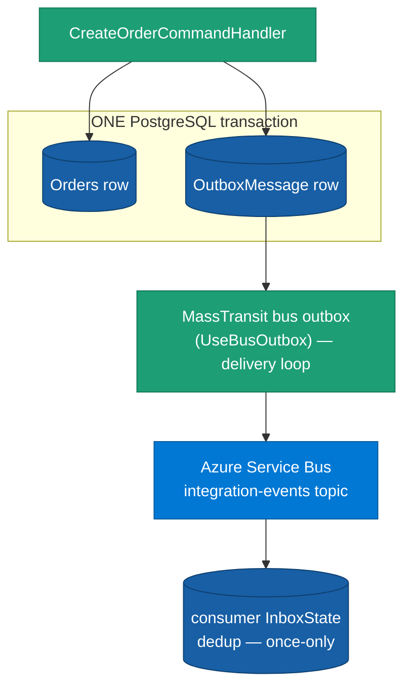
```mermaid
flowchart TD
    H["CreateOrderCommandHandler"]:::service
    subgraph TX["ONE PostgreSQL transaction"]
        ORD[("Orders row")]:::datastore
        OUT[("OutboxMessage row")]:::datastore
    end
    DRAIN["MassTransit bus outbox<br/>(UseBusOutbox) — delivery loop"]:::service
    SB["Azure Service Bus<br/>integration-events topic"]:::paas
    INBOX[("consumer InboxState<br/>dedup — once-only")]:::datastore

    H --> ORD
    H --> OUT
    OUT --> DRAIN --> SB --> INBOX

    classDef external fill:#B4B2A9,stroke:#7A7870,color:#111,stroke-dasharray:4 3;
    classDef service fill:#1D9E75,stroke:#14795A,color:#FFF;
    classDef paas fill:#0078D4,stroke:#005A9E,color:#FFF;
    classDef datastore fill:#185FA5,stroke:#0F3F6E,color:#FFF;
    classDef identity fill:#BA7517,stroke:#8A560F,color:#FFF;
    classDef edge fill:#7F77DD,stroke:#5B52B8,color:#FFF;
    classDef cicd fill:#639922,stroke:#496F18,color:#FFF;
    classDef issue fill:none,stroke:#E24B4A,color:#E24B4A,stroke-dasharray:5 4;
```

**How AntKart uses it** — MassTransit's EF Core outbox is configured in the services that own a
Postgres database: `AK.Order/AK.Order.Infrastructure/Extensions/ServiceCollectionExtensions.cs:66-70`
(`AddEntityFrameworkOutbox<OrderDbContext>(o => { o.UsePostgres(); o.UseBusOutbox(); })`) and the same
in `AK.Payments/AK.Payments.Infrastructure/Extensions/ServiceCollectionExtensions.cs:39-43`. The three
outbox tables are added to the model in `AK.Order/AK.Order.Infrastructure/Persistence/OrderDbContext.cs:36-38`
(`AddInboxStateEntity()` / `AddOutboxMessageEntity()` / `AddOutboxStateEntity()`). In
`CreateOrderCommandHandler`, `publisher.Publish(...)` and `uow.SaveChangesAsync()` therefore commit
the order **and** the `OrderCreatedIntegrationEvent` in one transaction. **AK.Products has no outbox**
— it is Cosmos/Mongo-backed, not EF/Postgres, so its `StockReserved` event is a direct publish.

**Alternatives and the trade-off** — Alternatives: publish inside the transaction with a distributed
transaction across DB and broker (2PC — unsupported here and slow), or accept best-effort publishing
and reconcile later (lossy). The outbox trades a little latency (the event is delivered by a
background loop, not instantly) and two extra tables for a guarantee that state and events never
diverge. It pairs with the saga: the saga needs its triggering events to be as durable as the state
change that caused them.

**Gotchas** —
- **Not every service has it.** Order and Payments do; **Products does not** (Cosmos-backed). Assuming
  a uniform outbox everywhere is wrong.
- **The outbox does not fix a broker that rejects the messages.** See **KI-014**
  ([KNOWN_ISSUES.md](KNOWN_ISSUES.md), High): if MassTransit lacks management-plane rights on Service
  Bus, subscription reconciliation faults and messaging is silently broken while pods stay healthy —
  the outbox will hold messages it cannot deliver.
- **Delivery is eventual, not instant.** Code that expects the event to be consumed synchronously
  after `SaveChanges` is misreading the pattern.

**Interview traps** —
- *"What exact problem does the outbox solve?"* — The dual-write / diverging-state problem. If you
  answer "reliability" without naming the save-then-publish gap, you have read about it but not used it.
- *"The message is in the outbox table — is it delivered yet?"* — Testing the two-phase mental model.
  No: committing to the outbox guarantees it *will* be delivered by the dispatcher, not that it has been.
- *"What gives you once-only processing, not just at-least-once delivery?"* — The **inbox** table on
  the consumer deduplicates redeliveries; the outbox alone is at-least-once.
- *"Why doesn't Products use the outbox?"* — Testing whether you noticed. It's on Cosmos, not EF/Postgres;
  the MassTransit EF outbox needs a relational DbContext.
- *"Outbox committed fine but nothing arrived downstream — where do you look?"* — The delivery side
  and broker permissions (KI-014), not the transaction.

**The 60-second answer** — "The problem is the dual write: if I save the order and then publish the
event as two steps, a crash between them makes my data and my events disagree. The outbox fixes it by
writing the event into an outbox table in the *same* database transaction as the order — they commit
together or not at all. A background dispatcher then drains the outbox to Service Bus, and an inbox
table on the consumer deduplicates redeliveries, so it's once-only end to end. Order and Payments use
MassTransit's EF outbox on Postgres; Products doesn't, because it's Cosmos-backed. The catch is
delivery is eventual, and the outbox can't help if the broker rejects the messages — that's KI-014."

**Read the code** — `AK.Order/AK.Order.Infrastructure/Extensions/ServiceCollectionExtensions.cs:66-70`,
`AK.Order/AK.Order.Infrastructure/Persistence/OrderDbContext.cs:36-38`,
`AK.Payments/AK.Payments.Infrastructure/Extensions/ServiceCollectionExtensions.cs:39-43`,
`AK.Order/AK.Order.Application/Features/CreateOrder/CreateOrderCommandHandler.cs` (publish + save in one
transaction). Gap: [KNOWN_ISSUES.md](KNOWN_ISSUES.md) KI-014.

**To reach 🟢** — Explain the dual-write problem and the outbox+inbox fix without notes, then open
`OrderDbContext` and point to the three tables and say what each does. Predict which services have an
outbox before you grep, and be right about Products.

---

### 8. MassTransit over Service Bus 🟡

**What it is** — MassTransit is the .NET messaging framework AntKart uses to publish and consume
integration events; Azure Service Bus is the broker underneath it. One BuildingBlocks helper wires
every service to the same namespace with Entra token auth (no connection string), and each service
gets its own uniquely-named subscription.

**The problem it solves** — Talking to a broker directly means hand-writing serialization, retries,
consumer registration, and topology per service, and threading a secret connection string everywhere.
A framework plus a shared helper standardises all of that and lets the platform authenticate to the
broker with a managed identity instead of a stored key.

**How it works** — MassTransit is an abstraction over the broker: you write `IConsumer<T>` classes and call `Publish`/`Send`, and it handles serialization, retries, and endpoint wiring. Underneath, Azure Service Bus provides the topic + per-service subscriptions. One BuildingBlocks helper wires every service to the same namespace using `DefaultAzureCredential` (an Entra token, **no connection string**), binds each service to explicit subscription endpoints, and gives each a unique name prefix so subscriptions don't collide.

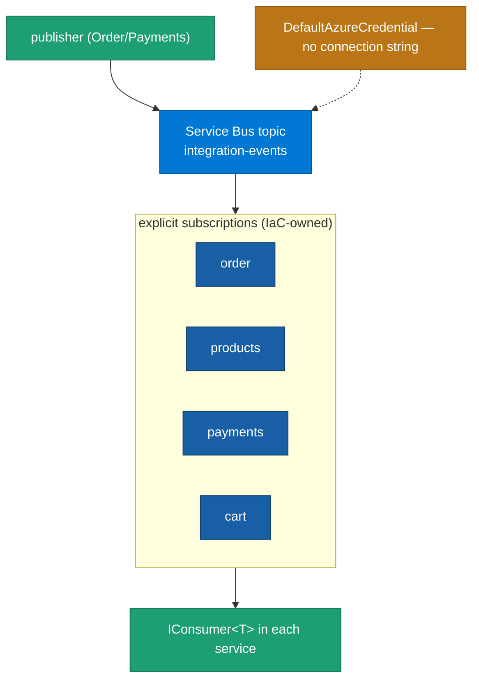
```mermaid
flowchart TD
    PUB["publisher (Order/Payments)"]:::service
    TOPIC["Service Bus topic<br/>integration-events"]:::paas
    subgraph SUBS["explicit subscriptions (IaC-owned)"]
        SO["order"]:::datastore
        SP["products"]:::datastore
        SPay["payments"]:::datastore
        SC["cart"]:::datastore
    end
    CON["IConsumer&lt;T&gt; in each service"]:::service
    PUB --> TOPIC --> SUBS --> CON
    AUTH["DefaultAzureCredential — no connection string"]:::identity
    AUTH -.-> TOPIC

    classDef external fill:#B4B2A9,stroke:#7A7870,color:#111,stroke-dasharray:4 3;
    classDef service fill:#1D9E75,stroke:#14795A,color:#FFF;
    classDef paas fill:#0078D4,stroke:#005A9E,color:#FFF;
    classDef datastore fill:#185FA5,stroke:#0F3F6E,color:#FFF;
    classDef identity fill:#BA7517,stroke:#8A560F,color:#FFF;
    classDef edge fill:#7F77DD,stroke:#5B52B8,color:#FFF;
    classDef cicd fill:#639922,stroke:#496F18,color:#FFF;
    classDef issue fill:none,stroke:#E24B4A,color:#E24B4A,stroke-dasharray:5 4;
```

**How AntKart uses it** — `AddAzureServiceBusMassTransit(config, registerConsumers, configureEndpoints)` in BuildingBlocks connects to `ServiceBus:FullyQualifiedNamespace` with `DefaultAzureCredential`. All eight integration-event types share one topic, `integration-events`; each service binds **explicit `SubscriptionEndpoint`s** (there is no `ConfigureEndpoints`) with a unique prefix (`order`, `products`, `payments`, `cart`). Crucially, **topology is owned by infrastructure-as-code**, not created at runtime — the identity holds Data Sender/Receiver, not Manage. Message retry is `Incremental(3, 1s, 2s)`. Decisions: [ADR-007](adr/ADR-007-masstransit-over-raw-rabbitmq.md), [ADR-015](adr/ADR-015-messaging-migration-to-service-bus.md).

**Alternatives and the trade-off** — Alternatives: talk to Service Bus with the raw SDK (hand-roll serialization, retries, consumer wiring, connection strings) or stay on RabbitMQ (self-managed broker — [ADR-007](adr/ADR-007-masstransit-over-raw-rabbitmq.md) chose MassTransit's abstraction; [ADR-015](adr/ADR-015-messaging-migration-to-service-bus.md) migrated the transport to managed Service Bus with Entra auth). MassTransit + a shared helper buys standardised consumers, retries, the outbox, and *secret-less* broker auth, at the cost of an abstraction layer and MassTransit's own conventions (e.g. its topology reconciliation, which collides with least-privilege RBAC — see gotcha).

**Gotchas** —
- **KI-014 (High):** MassTransit tries to reconcile subscriptions at startup — a **management-plane** call — but the identity holds only Data Sender/Receiver, so it faults `401 SubCode 40100`, **logged as a warning not thrown**; pods stay healthy while messaging is silently broken. Topology must be provisioned by IaC (or the identity granted Data Owner). Source: [KNOWN_ISSUES.md](KNOWN_ISSUES.md) KI-014.
- **No connection string anywhere.** Auth is `DefaultAzureCredential`; if you go looking for a Service Bus connection string secret, there isn't one (and shouldn't be).
- **Explicit endpoints, not `ConfigureEndpoints`.** Topology is IaC-owned; MassTransit is told exactly which subscriptions to consume.

**Interview traps** —
- *"How does the platform authenticate to Service Bus?"* — `DefaultAzureCredential` (Entra token), no SAS/connection string. The secret-less point.
- *"Everything reports healthy but no messages flow — where do you look?"* — KI-014: MassTransit's management-plane topology call failing on a data-plane-only identity, logged as a warning. The diagnostic question.
- *"Who owns the topic/subscription topology?"* — Infrastructure-as-code, not runtime — the identity can't Manage. Testing least-privilege awareness.
- *"Why MassTransit instead of the raw Service Bus SDK?"* — Standardised consumers, retries, the EF outbox, and secret-less auth in one helper; the trade is an abstraction and its conventions.

**The 60-second answer** — "MassTransit is our messaging abstraction over Azure Service Bus — you write `IConsumer<T>` classes and publish, and it handles serialization, retries, and endpoint wiring. One BuildingBlocks helper connects every service to the namespace with `DefaultAzureCredential` — an Entra token, no connection string — onto a single `integration-events` topic with a per-service subscription. Topology is owned by infrastructure-as-code, not created at runtime, because the identity holds Data Sender and Receiver, not Manage. That last point is also the gotcha, KI-014: MassTransit tries to reconcile subscriptions at startup, which is a management-plane call it isn't allowed to make, and it logs a warning instead of throwing — so pods look healthy while messaging is silently broken until the topology is provisioned by IaC."

**Read the code** — `AK.BuildingBlocks/AK.BuildingBlocks/Messaging/MassTransitExtensions.cs`
(`AddAzureServiceBusMassTransit`, `DefaultAzureCredential` host auth, shared `integration-events`
topic, explicit subscription endpoints — no runtime topology creation); per-service prefixes in each
`Infrastructure/Extensions/ServiceCollectionExtensions.cs`. Decisions:
[ADR-007](adr/ADR-007-masstransit-over-raw-rabbitmq.md),
[ADR-015](adr/ADR-015-messaging-migration-to-service-bus.md). Gap: KI-014.

**To reach 🟢** — Without notes, explain secret-less broker auth and why topology is IaC-owned, then walk KI-014 as a management-vs-data-plane mismatch. Predict what `kubectl get pods` shows when messaging is silently broken (all Running/Healthy).

---

### 9. Serverless notifications and the two eventing mechanisms 🟡

**What it is** — AntKart runs **two** eventing mechanisms on purpose. The durable **Service Bus saga**
carries the business transaction (orders, stock, payments). A separate, lightweight **Event Grid**
path carries customer notifications: Order and Payments publish fire-and-forget events after each
commit, and a scale-to-zero Azure Functions app consumes them and sends email. The two are
deliberately not the same bus.

**The problem it solves** — Sending a confirmation email is not part of the money-and-stock
transaction and must never be able to roll it back or slow it down. Putting notifications on their
own fire-and-forget channel means a failed email can't fail an order, and the notification handler can
scale to zero and cost nothing when idle — while the saga stays durable and exactly-tracked.

**How it works** — Two eventing mechanisms, chosen per job:

| | Service Bus saga (durable) | Event Grid notifications (fire-and-forget) |
|---|---|---|
| **Carries** | the business transaction (order, stock, payment) | customer emails |
| **Guarantee** | outbox + inbox, exactly-tracked, retried | best-effort; a failure is swallowed |
| **Compute** | always-on services | scale-to-zero Azure Functions |
| **Publish rule** | inside the saga | **after** the durable commit, `TryPublishAsync` (never throws) |

The order/payment is committed durably first; **only then** does the handler emit an Event Grid notification as a side-effect. `TryPublishAsync` never throws, so a failed publish can't roll back or fail the business operation. Event Grid pushes to a Functions app that dispatches the email through ACS and scales back to zero.

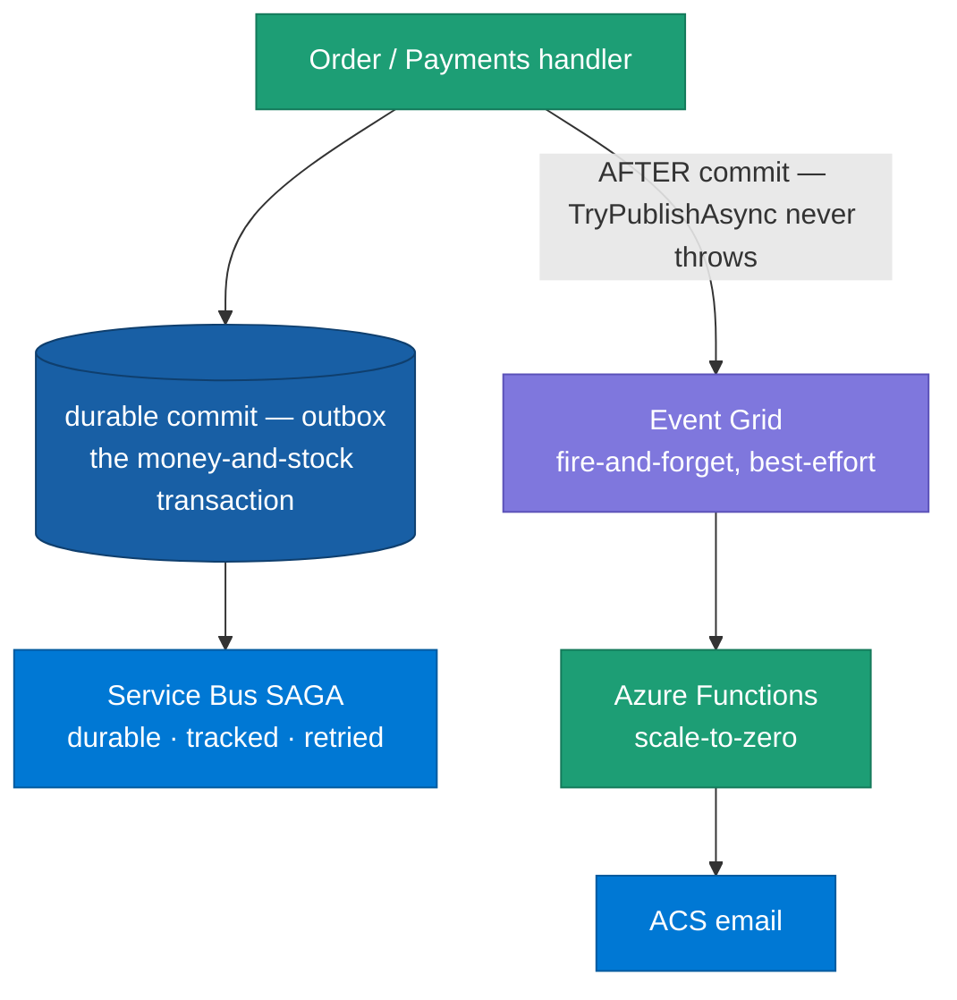
```mermaid
flowchart TD
    H["Order / Payments handler"]:::service
    TX[("durable commit — outbox<br/>the money-and-stock transaction")]:::datastore
    SBUS["Service Bus SAGA<br/>durable · tracked · retried"]:::paas
    EG["Event Grid<br/>fire-and-forget, best-effort"]:::edge
    FN["Azure Functions<br/>scale-to-zero"]:::service
    MAIL["ACS email"]:::paas
    H --> TX --> SBUS
    H -->|AFTER commit — TryPublishAsync never throws| EG
    EG --> FN --> MAIL

    classDef service fill:#1D9E75,stroke:#14795A,color:#FFF;
    classDef datastore fill:#185FA5,stroke:#0F3F6E,color:#FFF;
    classDef paas fill:#0078D4,stroke:#005A9E,color:#FFF;
    classDef edge fill:#7F77DD,stroke:#5B52B8,color:#FFF;
```

**How AntKart uses it** — `IEventGridSideEffectPublisher.TryPublishAsync` is called after commit in `CreateOrderCommandHandler`, `VerifyPaymentCommandHandler`, and the `OrderConfirmed`/`OrderCancelled` consumers. The five event contracts live once in `AK.BuildingBlocks/Messaging/Notifications/` (`NotificationEventTypes` + the payload records), published to the `evgt-antkart-dev` topic. `AK.Notification.Functions` has one `[EventGridTrigger]` per event (`OnOrderCreated`, `OnPaymentSucceeded`, …); each is thin — deserialize, build a `NotificationRequest`, call `INotificationDispatcher` in `AK.Notification.Core`, which resolves a template and sends via the ACS email channel. Decision: [ADR-019](adr/ADR-019-serverless-notification-functions-eventgrid.md).

**Alternatives and the trade-off** — Alternatives: put notifications on the Service Bus saga (durable, but couples a non-critical email into the money-and-stock transaction and needs an always-on consumer) or send the email synchronously in the handler (a slow SMTP call blocks the request and a failure fails the order). The two-mechanism split trades delivery *guarantee* on notifications (they're best-effort) for the guarantee that **notifications can never affect the business transaction** — plus scale-to-zero cost. The durable saga keeps its guarantees; only the disposable side-effect is fire-and-forget.

**Gotchas** —
- **A lost notification is silent by design.** `TryPublishAsync` swallows failures and returns `false`; there's no retry. That's deliberate — a notification must never fail an order — but it means email delivery is not guaranteed.
- **A malformed Event Grid payload is logged and skipped, not crash-looped.** The Functions are defensive so a bad message doesn't wedge the trigger.
- **Notifications are NOT the saga.** Don't reach for Event Grid when you need durable, tracked delivery — that's Service Bus.

**Interview traps** —
- *"Why two eventing systems instead of one bus?"* — Different guarantees: the saga must be durable and tracked; a notification must be unable to affect the transaction and should scale to zero. Using one bus for both couples them.
- *"What order do the commit and the notification happen in, and why?"* — Commit first, notify after — commit-then-notify — so a publish failure can't roll back the business change.
- *"What happens if the email publish fails?"* — Nothing to the order: `TryPublishAsync` never throws, returns false, no retry. The design question.
- *"Why is the notification consumer serverless?"* — Bursty, idle-most-of-the-time workload; Consumption plan scales to zero and costs nothing when quiet.

**The 60-second answer** — "We run two eventing mechanisms on purpose. The durable one is the Service Bus saga — orders, stock, payments — with an outbox and inbox so it's exactly-tracked and retried. The other is Event Grid for customer emails: after an order or payment is durably committed, the handler emits a fire-and-forget notification through `TryPublishAsync`, which never throws, so a failed email can't roll back or fail the transaction. Event Grid pushes to an Azure Functions app that sends the email through ACS and scales to zero when idle. The trade is that notifications are best-effort — a lost one is silent — but that's the point: a non-critical email must never be able to break the money-and-stock flow."

**Read the code** — Publisher side: `AK.BuildingBlocks/AK.BuildingBlocks/Messaging/EventGrid/EventGridSideEffectPublisher.cs`
(`TryPublishAsync`, never throws) and its use in
`AK.Order/AK.Order.Application/Features/CreateOrder/CreateOrderCommandHandler.cs` /
`AK.Payments/AK.Payments.Application/Commands/VerifyPayment/VerifyPaymentCommandHandler.cs`. Contracts:
`AK.BuildingBlocks/AK.BuildingBlocks/Messaging/Notifications/`. Consumer side:
`AK.Notification/AK.Notification.Functions/` (`[EventGridTrigger]` functions) →
`AK.Notification/AK.Notification.Core/`. Decision:
[ADR-019](adr/ADR-019-serverless-notification-functions-eventgrid.md).

**To reach 🟢** — Explain commit-then-notify and why `TryPublishAsync` never throws, without notes. Then name which mechanism (Service Bus vs Event Grid) you'd use for a new "order shipped" email vs a new "reserve inventory" step, and why.

---

### 10. Polly resilience 🟡

**What it is** — Polly is the .NET library that wraps outbound calls in resilience policies — retry,
circuit breaker, timeout. AntKart centralises a small set of **named, criticality-tiered** policies in
BuildingBlocks so each caller picks the posture that matches how important the dependency is.

**The problem it solves** — A transient blip (a dropped connection, a 429) shouldn't surface as a user
error, but blind infinite retries against a dead dependency make outages worse. Tiered policies let a
critical dependency be retried patiently while an optional one fails fast, so a slow or down service
degrades gracefully instead of dragging the caller down with it.

**How it works** — A resilience policy wraps an outbound call with, typically, **retry** (re-try transient failures with backoff + jitter), a **circuit breaker** (stop calling a dependency that's failing so it can recover, and fail fast meanwhile), and a **timeout** (bound how long any attempt waits). The decisive idea in AntKart is **criticality tiering** — the policy differs by how important the dependency is:

| Tier | Policy | Posture | Used for |
|---|---|---|---|
| **Critical** | `AddHttpResilienceWithCircuitBreaker` | patient: retry (exp+jitter) → circuit breaker → timeout | Order → Products price check (fail *closed*) |
| **Optional** | `AddOptionalDependencyResilience` | fail-fast: **no retry**, quick-opening breaker, 2s timeout | Products → Discount gRPC |
| **Data store** | `AddDataStoreResiliencePipeline` | honours a server `Retry-After` verbatim, else exp+jitter | Products → Cosmos (429 throttling) |
| **DB / cache** | `AddNpgsqlResilience` / `AddRedisResilience` | retry with exp backoff + jitter (avoid thundering herd) | Postgres / Redis |

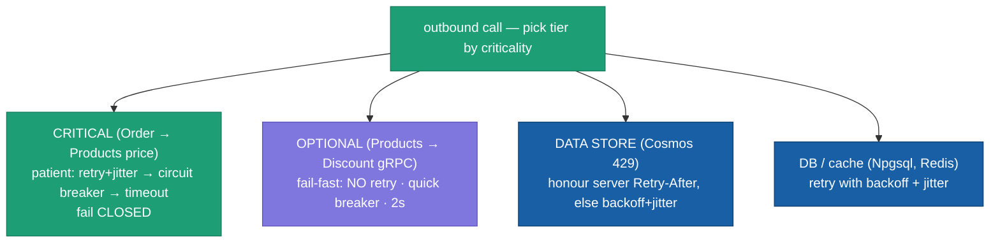
```mermaid
flowchart TD
    CALL["outbound call — pick tier by criticality"]:::service
    CRIT["CRITICAL (Order → Products price)<br/>patient: retry+jitter → circuit breaker → timeout<br/>fail CLOSED"]:::service
    OPT["OPTIONAL (Products → Discount gRPC)<br/>fail-fast: NO retry · quick breaker · 2s"]:::edge
    DS["DATA STORE (Cosmos 429)<br/>honour server Retry-After, else backoff+jitter"]:::datastore
    DB["DB / cache (Npgsql, Redis)<br/>retry with backoff + jitter"]:::datastore
    CALL --> CRIT
    CALL --> OPT
    CALL --> DS
    CALL --> DB

    classDef service fill:#1D9E75,stroke:#14795A,color:#FFF;
    classDef edge fill:#7F77DD,stroke:#5B52B8,color:#FFF;
    classDef datastore fill:#185FA5,stroke:#0F3F6E,color:#FFF;
```

**How AntKart uses it** — All policies are centralised in `ResilienceExtensions` (BuildingBlocks). The Order→Products catalogue client uses the *patient* pipeline because pricing is critical and fails closed. The Products→Discount gRPC client uses `AddOptionalDependencyResilience` — **no retry** + a quick circuit-break + 2s timeout — so a down Discount degrades silently and never slows the catalogue. Products runs Cosmos calls through `AddDataStoreResiliencePipeline`, which **honours the 429 `RetryAfterMs`** rather than guessing. Npgsql uses exponential backoff + jitter so a DB reconnect doesn't stampede.

**Alternatives and the trade-off** — Alternatives: no resilience (every transient blip becomes a user error), a single blunt "retry everything" policy (amplifies outages, hammers a dead dependency), or per-caller ad-hoc `try/catch`. The tiered library trades a little upfront design (deciding each dependency's criticality) for graceful degradation that matches intent — patient for critical, fail-fast for optional. Decision: [ADR-003](adr/ADR-003-fault-tolerance-with-polly.md).

**Gotchas** —
- **Retrying a non-idempotent write can double the effect.** Retry is safe for reads and idempotent operations; the platform applies patient retry to a *read* (price check), not to a payment charge.
- **A circuit breaker turns a real outage into fast failures** — that's the point, but it means "it's suddenly returning instantly with errors" can be the breaker open, not the dependency healthy.
- **Fail-fast is deliberate for optional deps.** Products→Discount has *no retry* on purpose; adding retry there would slow every catalogue render when Discount is down. (No KI.)

**Interview traps** —
- *"Why does the Products→Discount call have no retry when everything else retries?"* — Criticality: Discount is optional, so it fails fast to protect the catalogue; retrying would slow the core request. The signature question.
- *"How do you handle a Cosmos 429?"* — Honour the server's `Retry-After` verbatim (not a guessed backoff) via the data-store pipeline. Testing whether you know throttling etiquette.
- *"When is retry unsafe?"* — Non-idempotent writes — you can double-apply. Testing distributed-systems care.
- *"What does the circuit breaker actually buy you?"* — It stops hammering a failing dependency so it can recover, and fails fast meanwhile instead of piling up timeouts.

**The 60-second answer** — "Resilience is Polly policies — retry, circuit breaker, timeout — but the real idea is criticality tiering. A critical dependency like the Order-to-Products price check gets patient retry with backoff, a circuit breaker, and a timeout, and it fails closed. An *optional* dependency like Products-to-Discount over gRPC gets the opposite: no retry, a quick-opening breaker, a two-second timeout — so if Discount is down the catalogue still renders instantly instead of waiting on retries. Data stores honour a server's Retry-After on a 429 rather than guessing, and DB reconnects use jittered backoff to avoid a thundering herd. All of it is one shared policy library, so each caller just picks the posture that matches how important the dependency is."

**Read the code** — `AK.BuildingBlocks/AK.BuildingBlocks/Resilience/ResilienceExtensions.cs`:
`AddHttpResilienceWithCircuitBreaker` (patient, for the critical Order→Products catalogue call),
`AddOptionalDependencyResilience` (fail-fast, for Products→Discount gRPC), `AddRedisResilience`,
`AddNpgsqlResilience`, `AddDataStoreResiliencePipeline` (honours a server 429 `Retry-After`, used by
Products for Cosmos). Decision: [ADR-003](adr/ADR-003-fault-tolerance-with-polly.md).

**To reach 🟢** — Without notes, contrast the patient vs fail-fast tiers and say which dependency uses each and why. Then explain why retry is applied to the price check but never to a payment charge.

---

### 11. gRPC between Products and Discount 🟡

**What it is** — AK.Discount is the one service exposed over **gRPC** (a binary, HTTP/2, contract-first
RPC protocol defined by a `.proto` file) rather than REST. AK.Products calls it to fetch a discount
while rendering the catalogue.

**The problem it solves** — For a high-frequency, strongly-typed, internal service-to-service call,
gRPC's compact binary framing and generated clients are a better fit than JSON-over-REST. It also lets
the platform demonstrate a second transport style alongside the REST services.

**How it works** — gRPC defines the service contract in a `.proto` file (messages + RPC methods); a build step generates a strongly-typed server base and client from it. Calls travel as **Protobuf** (compact binary) over **HTTP/2** (multiplexed, long-lived connections). The client is generated, so there's no hand-written JSON serialization; both sides share the exact contract. In AntKart the call is treated as an *optional* dependency, so the client is tuned to fail fast and never throw.

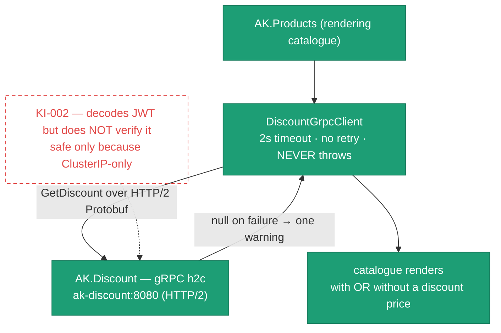
```mermaid
flowchart TD
    P["AK.Products (rendering catalogue)"]:::service
    C["DiscountGrpcClient<br/>2s timeout · no retry · NEVER throws"]:::service
    D["AK.Discount — gRPC h2c<br/>ak-discount:8080 (HTTP/2)"]:::service
    CAT["catalogue renders<br/>with OR without a discount price"]:::service
    P --> C
    C -->|GetDiscount over HTTP/2 Protobuf| D
    D -->|null on failure → one warning| C
    C --> CAT
    KI["KI-002 — decodes JWT but does NOT verify it<br/>safe only because ClusterIP-only"]:::issue
    KI -.-> D

    classDef service fill:#1D9E75,stroke:#14795A,color:#FFF;
    classDef issue fill:none,stroke:#E24B4A,color:#E24B4A,stroke-dasharray:5 4;
```

**How AntKart uses it** — The contract `discount.proto` defines `GetDiscount`, `CreateDiscount`, `UpdateDiscount`, `DeleteDiscount`, `GetAllDiscounts`. `DiscountGrpcClient` (in Products Infrastructure) calls `GetDiscount` while rendering the catalogue, over a named `discount-grpc` client with a 2s timeout and `AddOptionalDependencyResilience` (no retry, quick breaker). It **never throws**: an `RpcException/NotFound` returns null, any other failure logs *one* concise warning (message only, no stack, guarded so it's once per request) and returns null — so the catalogue always renders, with or without a discount price. In-cluster it's reached at `http://ak-discount:8080` over h2c (HTTP/2 cleartext).

**Alternatives and the trade-off** — REST/JSON (universal, human-readable, but larger payloads and no shared contract) or a message/event for pricing (decoupled, but pricing is a synchronous read here). gRPC buys a compact, strongly-typed, low-latency internal call and a generated client, at the cost of being binary (not curl-friendly) and needing HTTP/2 end to end — which is why Discount's Kubernetes probes are **TCP**, not HTTP (an HTTP/1.1 httpGet probe would be rejected by the h2c-only listener). Decision: [ADR-006](adr/ADR-006-ocelot-api-gateway.md) context; gRPC choice is per-service.

**Gotchas** —
- **KI-002 (High):** `AK.Discount.Grpc` **decodes** the JWT but does not verify signature/issuer/audience/expiry, and registers no auth middleware — a forged unsigned `roles=admin` token would be accepted for write RPCs. Mitigated only by Discount being ClusterIP-only, reached solely by Products. Source: [KNOWN_ISSUES.md](KNOWN_ISSUES.md) KI-002.
- **h2c means HTTP-probe pitfalls.** The single HTTP/2-only listener rejects HTTP/1.1, so health probes are TCP; exposing Discount through ingress (HTTP/1.1) would break it — it must stay ClusterIP.
- **The client swallows failures on purpose.** One warning, returns null — because Discount is optional; don't "fix" it into throwing.

**Interview traps** —
- *"Why gRPC for Discount and REST for the rest?"* — A high-frequency, strongly-typed *internal* call suits gRPC's binary/HTTP2/generated-client model; the public-facing services stay REST. Testing whether you can justify the transport, not just name it.
- *"Discount is down — what does the customer see?"* — The catalogue, without a discount price; the client fails fast and returns null. The graceful-degradation question.
- *"Why are Discount's Kubernetes probes TCP instead of HTTP?"* — Its single listener is h2c (HTTP/2-only); an HTTP/1.1 probe would be rejected. The ran-it detail.
- *"What's the security gap in Discount?"* — KI-002: it decodes the JWT without verifying it; safe today only because it's ClusterIP-only.

**The 60-second answer** — "Discount is our one gRPC service — contract-first in a `.proto`, Protobuf over HTTP/2, with a generated client — because Products calls it at high frequency for pricing and a strongly-typed binary call fits that better than JSON. Products treats it as an *optional* dependency: the client has a 2-second timeout, no retry, a quick circuit breaker, and it never throws — a failure just returns null and logs one warning, so the catalogue always renders. Two things to know: because it's h2c, HTTP/2-only, its Kubernetes probes are TCP not HTTP; and KI-002 — it decodes the JWT but doesn't verify it, which is only safe because it's ClusterIP-only and reached solely by Products."

**Read the code** — Proto + RPCs: `AK.Discount/AK.Discount.Grpc/Protos/discount.proto`
(`GetDiscount`, `CreateDiscount`, `UpdateDiscount`, `DeleteDiscount`, `GetAllDiscounts`). Client:
`AK.Products/AK.Products.Infrastructure/Grpc/DiscountGrpcClient.cs` (never throws; fail-fast, one
warning per unavailability). Gap: [KNOWN_ISSUES.md](KNOWN_ISSUES.md) KI-002 (Discount decodes but does
not verify the JWT).

**To reach 🟢** — Without notes, explain why Discount uses gRPC, why its probes are TCP, and what KI-002 is. Then predict what the catalogue returns when Discount is stopped, before you test it.

---

### 12. The Ocelot API gateway 🟡

**What it is** — Ocelot is an in-process .NET API gateway. AK.Gateway is the single public entry point:
it routes each incoming path to the service that owns it, passes the JWT through, and applies per-route
rate limiting and a QoS circuit breaker.

**The problem it solves** — Exposing six services directly means six public endpoints, six places to
enforce auth and rate limits, and clients coupled to internal topology. One gateway gives a single
front door and one place for cross-cutting edge concerns, with everything behind it kept ClusterIP-only.

**How it works** — Ocelot reads a JSON route table: each route maps an **upstream** public path (what the client calls) to a **downstream** service host+path (the in-cluster service). Per route it can apply rate limiting, a QoS/circuit-breaker, and — here — passes the JWT straight through to the downstream service (which re-validates it). It's an *in-process* .NET app, so it runs as just another service in the cluster, in front of the others.

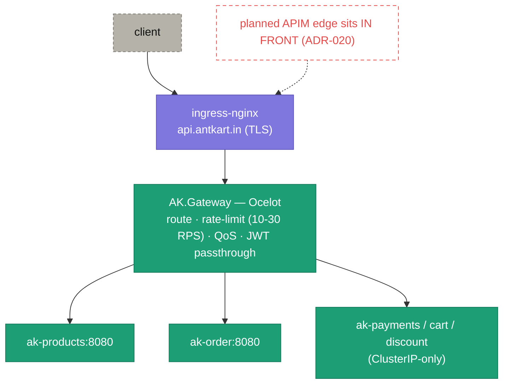
```mermaid
flowchart TD
    CLIENT["client"]:::external
    ING["ingress-nginx<br/>api.antkart.in (TLS)"]:::edge
    GW["AK.Gateway — Ocelot<br/>route · rate-limit (10-30 RPS) · QoS · JWT passthrough"]:::service
    S1["ak-products:8080"]:::service
    S2["ak-order:8080"]:::service
    S3["ak-payments / cart / discount<br/>(ClusterIP-only)"]:::service
    CLIENT --> ING --> GW
    GW --> S1
    GW --> S2
    GW --> S3
    APIM["planned APIM edge sits IN FRONT (ADR-020)"]:::issue
    APIM -.-> ING

    classDef external fill:#B4B2A9,stroke:#7A7870,color:#111,stroke-dasharray:4 3;
    classDef edge fill:#7F77DD,stroke:#5B52B8,color:#FFF;
    classDef service fill:#1D9E75,stroke:#14795A,color:#FFF;
    classDef issue fill:none,stroke:#E24B4A,color:#E24B4A,stroke-dasharray:5 4;
```

**How AntKart uses it** — `AK.Gateway` runs Ocelot 23.4.2, configured by `ocelot.json` (with `ocelot.Development.json` overrides). Its downstream routes point at the in-cluster DNS names `ak-<service>:8080`; it applies per-route rate limiting (10–30 RPS) and a QoS circuit breaker, and passes the Entra JWT through. It is the **only** service exposed (via Ingress at `api.antkart.in`); the other five are ClusterIP-only. In the target state, Azure API Management sits *in front of* Ocelot as the managed edge ([ADR-020](adr/ADR-020-api-management-managed-edge-gateway.md)) — a two-gateway model, not a replacement.

**Alternatives and the trade-off** — Alternatives: YARP (Microsoft's reverse proxy, chosen against in [ADR-006](adr/ADR-006-ocelot-api-gateway.md)), exposing services directly (no single front door, auth/rate-limit duplicated everywhere), or going straight to a managed edge like APIM (cost, and it doesn't do in-cluster routing). Ocelot buys a code-owned, in-cluster routing gateway with familiar config, at the cost of being one more always-on component the team runs — which is exactly why the *edge* concerns (TLS, quotas, keys) are planned to move to APIM while Ocelot keeps *routing*.

**Gotchas** —
- **KI-003 (Medium):** the gateway's CORS policy is `AllowAll` (any origin/method/header) — too permissive for production; to be scoped when the APIM edge lands. Source: [KNOWN_ISSUES.md](KNOWN_ISSUES.md) KI-003.
- **The gateway is not a trust boundary the services rely on.** It passes the JWT through, but each service re-validates it (defence in depth) — Ocelot validating is an optimization, not the guarantee.
- **Two config files.** `ocelot.json` is the Docker/cluster config; `ocelot.Development.json` overrides for local — edit the right one.

**Interview traps** —
- *"What's the difference between the Ocelot gateway and the planned APIM edge?"* — Ocelot is in-cluster *routing* (code-owned); APIM is the managed *edge* (TLS, keys, quotas). Target state runs both, layered (ADR-020). Testing whether you conflate routing with edge.
- *"Does the gateway validating the JWT mean the services can trust it?"* — No — each service re-validates; the gateway isn't a trust boundary. The defence-in-depth point.
- *"What's over-permissive about the gateway today?"* — CORS `AllowAll` (KI-003). Testing whether you know the open issue.
- *"Why is only the gateway exposed?"* — Single front door + smallest attack surface; the five backends are ClusterIP-only.

**The 60-second answer** — "Ocelot is our in-cluster API gateway — an in-process .NET app that reads a JSON route table mapping public paths to the internal `ak-<service>` DNS names, applies per-route rate limiting and a QoS circuit breaker, and passes the Entra JWT through. It's the only service exposed publicly, at api.antkart.in; the other five are ClusterIP-only. Crucially the gateway isn't a trust boundary — every service re-validates the token, defence in depth. Two things to flag: CORS is currently AllowAll, which is KI-003 and too open for prod; and in the target state Azure API Management sits in front of Ocelot as the managed edge for TLS, keys, and quotas, with Ocelot keeping the internal routing — a two-gateway model, not a swap."

**Read the code** — `AK.Gateway/AK.Gateway.API/ocelot.json` (routes; Docker) and
`ocelot.Development.json` (dev overrides). Decision: [ADR-006](adr/ADR-006-ocelot-api-gateway.md);
target-state managed edge in front of it: [ADR-020](adr/ADR-020-api-management-managed-edge-gateway.md).
Gap: [KNOWN_ISSUES.md](KNOWN_ISSUES.md) KI-003 (gateway CORS allows any origin).

**To reach 🟢** — Without notes, explain the two-gateway (Ocelot routing + APIM edge) model and why the gateway isn't a trust boundary. Then open `ocelot.json` and trace one public path to its `ak-<service>` downstream.

---

### 13. Polyglot persistence 🟡

**What it is** — Each service owns its data in the store that best fits its access pattern, rather than
one shared database for everything: Products on Cosmos DB (Mongo API), Order/Payments/Discount on
PostgreSQL, ShoppingCart on Redis.

**The problem it solves** — A single shared database couples services together and forces one storage
model onto every workload. Per-service ownership keeps services independently deployable and lets a
document store, a relational store, and a key-value store each be used where it fits — a catalogue in a
document DB, transactional orders in Postgres, an ephemeral cart in Redis.

**How it works** — Each service owns its store; no service reads another's database. The store is chosen by access pattern:

| Service | Store | Why this store |
|---|---|---|
| Products | Cosmos DB (Mongo API) | read-heavy document catalogue; flexible schema, managed scale |
| Order / Payments / Discount | PostgreSQL | transactional, relational, ACID, EF migrations |
| ShoppingCart | Redis | ephemeral, high-churn key-value with a natural 30-day TTL |

Because no service touches another's data, any field one service needs from another is **denormalised** (copied) — e.g. the order carries the customer email rather than joining to an identity store.

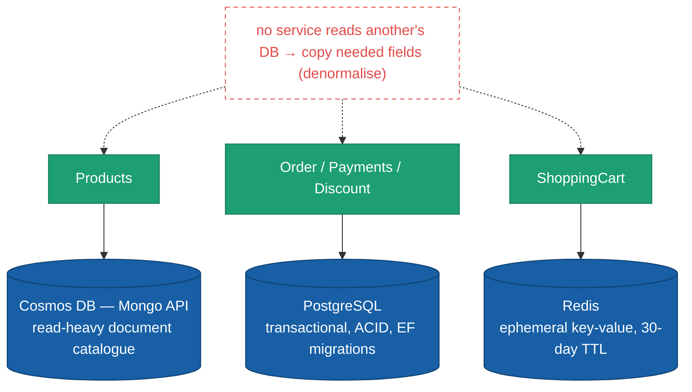
```mermaid
flowchart TD
    PR["Products"]:::service --> COS[("Cosmos DB — Mongo API<br/>read-heavy document catalogue")]:::datastore
    OR["Order / Payments / Discount"]:::service --> PG[("PostgreSQL<br/>transactional, ACID, EF migrations")]:::datastore
    CA["ShoppingCart"]:::service --> RD[("Redis<br/>ephemeral key-value, 30-day TTL")]:::datastore
    NOTE["no service reads another's DB → copy needed fields (denormalise)"]:::issue
    NOTE -.-> PR
    NOTE -.-> OR
    NOTE -.-> CA

    classDef service fill:#1D9E75,stroke:#14795A,color:#FFF;
    classDef datastore fill:#185FA5,stroke:#0F3F6E,color:#FFF;
    classDef issue fill:none,stroke:#E24B4A,color:#E24B4A,stroke-dasharray:5 4;
```

**How AntKart uses it** — Store registration lives in each service's Infrastructure: Products wires `MongoDbContext` (Cosmos over the Mongo driver), Order/Payments/Discount call `UseNpgsql`, ShoppingCart uses StackExchange.Redis with key `AKCart:cart:{userId}`. Each store is hidden behind that service's repository, and each has its own resilience posture (Cosmos honours 429 Retry-After; Npgsql/Redis use jittered backoff). Decision: [ADR-004](adr/ADR-004-polyglot-persistence.md).

**Alternatives and the trade-off** — Alternatives: one shared relational database for everything (simplest ops, but couples services, forces one model, and breaks independent deployability) or forcing a single store type everywhere (a document DB for transactions, or SQL for a cart, both poor fits). Polyglot trades a larger operational surface (three store technologies to run and secure) for each workload using the store that fits and for true service independence. Decision: [ADR-004](adr/ADR-004-polyglot-persistence.md).

**Gotchas** —
- **No cross-service entity references — denormalise instead.** Copying a field (customer email onto the order) is the rule, not a smell; a shared table or cross-DB join would re-couple the services.
- **Each store's failure mode differs.** Cosmos throttles with 429s (honour Retry-After), Postgres/Redis need jittered reconnect — one blanket policy is wrong.
- **The outbox only fits the relational services.** Products (Cosmos) has no EF outbox — a direct consequence of polyglot persistence.

**Interview traps** —
- *"Why not one database for all six services?"* — Coupling, one-model-fits-none, and lost independent deployability; polyglot lets each workload use the right store. The design question.
- *"How does the order know the customer's email if there's no identity DB to join?"* — Denormalisation — it's copied onto the order/event. Testing whether you understand the no-cross-service-reference rule.
- *"Why does Products not have a transactional outbox when Order does?"* — Products is on Cosmos, not EF/Postgres; the EF outbox needs a relational DbContext. Ties persistence choice to a real consequence.
- *"What's the cost of polyglot persistence?"* — A bigger operational surface: three store technologies to run, secure, and reason about.

**The 60-second answer** — "Every service owns its own data in the store that fits its access pattern, and no service reads another's database. Products is a read-heavy document catalogue, so it's on Cosmos through the Mongo API; Order, Payments, and Discount are transactional and relational, so they're on Postgres with EF migrations; the cart is ephemeral key-value with a natural expiry, so it's Redis. Because there are no cross-service joins, anything one service needs from another is denormalised — the order carries the customer's email rather than joining an identity store. The trade is more operational surface — three store technologies — but each workload gets the right database and the services stay independently deployable. One consequence: the EF outbox only exists in the Postgres services; Products, on Cosmos, publishes directly."

**Read the code** — Per-service store registration: `AK.Products/AK.Products.Infrastructure/Extensions/ServiceCollectionExtensions.cs`
(Cosmos/Mongo), `AK.Order/AK.Order.Infrastructure/Extensions/ServiceCollectionExtensions.cs` (`UseNpgsql`),
`AK.ShoppingCart/AK.ShoppingCart.Infrastructure/` (Redis, key `AKCart:cart:{userId}`). Decision:
[ADR-004](adr/ADR-004-polyglot-persistence.md).

**To reach 🟢** — Without notes, name each service's store and one reason it fits, and explain the denormalisation rule. Then say why Products has no outbox before you check its Infrastructure wiring.

---

### 14. Idempotency and eventual consistency 🟡

**What it is** — **Idempotency** means processing the same message twice has the same effect as once.
**Eventual consistency** means the system's parts are not in lockstep at every instant but converge to a
consistent state. Both are unavoidable once you replace one ACID database with services coordinating
over a bus.

**The problem it solves** — At-least-once delivery means a consumer *will* occasionally see a duplicate;
without idempotency that double-charges or double-decrements. And because the saga's steps are separate
local transactions, there is a window where the order is created but stock isn't yet reserved — code
that assumes instantaneous global consistency will misread that window as a bug.

**How it works** — Message brokers deliver **at-least-once**, so a consumer *will* occasionally see the same message twice; **idempotency** makes the second delivery a no-op. Three techniques do it here: an **inbox** table that records processed message ids (once-only), **deterministic ids** (derive the key from stable input so a re-write hits the same row), and **optimistic concurrency** (a version column rejects a stale write). **Eventual consistency** is the accepted consequence of replacing one ACID transaction with a saga of local transactions: for a short window the order exists but stock isn't reserved yet — the system converges, it isn't inconsistent forever.

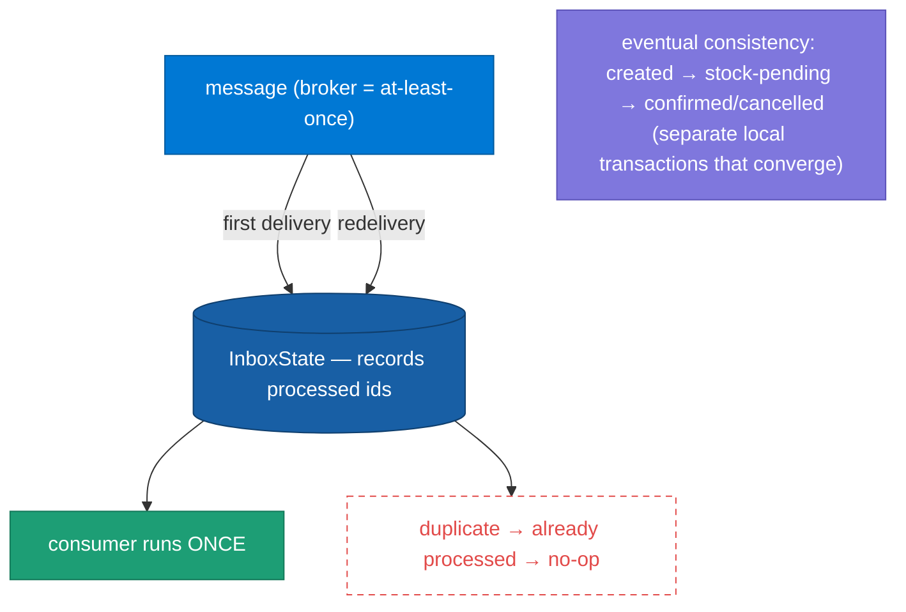
```mermaid
flowchart TD
    MSG["message (broker = at-least-once)"]:::paas
    INBOX[("InboxState — records processed ids")]:::datastore
    RUN["consumer runs ONCE"]:::service
    SKIP["duplicate → already processed → no-op"]:::issue
    MSG -->|first delivery| INBOX --> RUN
    MSG -->|redelivery| INBOX --> SKIP
    EC["eventual consistency: created → stock-pending → confirmed/cancelled<br/>(separate local transactions that converge)"]:::edge

    classDef paas fill:#0078D4,stroke:#005A9E,color:#FFF;
    classDef datastore fill:#185FA5,stroke:#0F3F6E,color:#FFF;
    classDef service fill:#1D9E75,stroke:#14795A,color:#FFF;
    classDef issue fill:none,stroke:#E24B4A,color:#E24B4A,stroke-dasharray:5 4;
    classDef edge fill:#7F77DD,stroke:#5B52B8,color:#FFF;
```

**How AntKart uses it** — MassTransit's `InboxState` (added in `OrderDbContext`) deduplicates redelivered messages so a consumer runs once. The saga's `OrderSagaState.Version` gives optimistic concurrency, so two messages for the same order can't both win. The `ProductsSeedLoader` derives each Cosmos `_id` from the SKU (MD5→hex), so re-running the loader is a set of single-partition point *upserts* that never duplicate; `DiscountSeedLoader` clears-then-seeds so every run converges to the same set. The saga itself is the eventual-consistency engine — created → stock-pending → confirmed/cancelled, each a separate committed step.

**Alternatives and the trade-off** — The alternative to eventual consistency is a **distributed transaction (2PC)** for strong, immediate consistency — but it needs a blocking coordinator and cross-store transaction support these managed services don't offer, trading availability for consistency in the wrong direction for e-commerce. The alternative to idempotency is assuming exactly-once delivery — which brokers don't provide — leading to double-charges. AntKart accepts eventual consistency and engineers idempotency, which is the pragmatic distributed-systems posture. Decisions: [ADR-005](adr/ADR-005-saga-orchestration.md), [ADR-009](adr/ADR-009-domain-events-vs-integration-events.md).

**Gotchas** —
- **Duplicates are not hypothetical.** At-least-once means you *will* reprocess a message; without the inbox that double-applies. Design for it.
- **The created-but-not-yet-reserved window is normal, not a bug.** Code that reads the order immediately after creation and expects stock already decremented misreads eventual consistency.
- **Retry only idempotent operations.** Re-driving a non-idempotent write (a charge) can double it — the reason retry is applied to reads, not payments.

**Interview traps** —
- *"Brokers are at-least-once — how do you avoid double-processing?"* — An inbox/dedup table (here MassTransit `InboxState`), deterministic ids, and optimistic concurrency. Naming the inbox is ran-it.
- *"Why is it OK that the order exists before stock is reserved?"* — Eventual consistency: separate local transactions that converge; the window is expected. The distributed-systems maturity question.
- *"Why not use a distributed transaction to make it strongly consistent?"* — 2PC needs a blocking coordinator and unsupported cross-store transactions; it trades availability away. The design trade-off.
- *"How is re-running the seed loader safe?"* — Deterministic `_id` from the SKU makes each write an upsert to the same row — idempotent by construction.

**The 60-second answer** — "Once you replace one ACID database with services coordinating over a bus, two things are unavoidable: idempotency and eventual consistency. Brokers deliver at-least-once, so a consumer will sometimes see a message twice — we make that a no-op with an inbox table that records processed ids, plus optimistic concurrency on the saga's version column and deterministic ids in the seed loaders so a re-write hits the same row. Eventual consistency is the saga's nature: the order is created, then stock is reserved, then it's confirmed — separate committed steps, so there's a brief window where the order exists but stock isn't reserved yet. That's convergence, not a bug. We don't reach for a distributed transaction because 2PC needs a blocking coordinator and trades away availability, which is exactly wrong for checkout."

**Read the code** — Inbox dedup: `AK.Order/AK.Order.Infrastructure/Persistence/OrderDbContext.cs:36`
(`AddInboxStateEntity()`). Saga optimistic concurrency: `AK.Order/AK.Order.Application/Sagas/OrderSagaState.cs`
(`Version`). Idempotent seed upsert: `AK.Tools/AK.Tools.ProductsSeedLoader/` (Cosmos `_id` derived from
SKU, so re-runs are point writes that never duplicate).

**To reach 🟢** — Without notes, name the three idempotency techniques used here and explain the created-before-reserved window. Then explain why retry is safe on the price check but not on a payment charge.

---

### 15. Health and readiness probes as an application concern 🟡

**What it is** — Every service exposes three purpose-built health surfaces — `/health/live` (shallow
liveness), `/health/ready` (tolerant readiness), `/health/deps` (deep diagnostics) — with namespaced
tags so the right checks run on the right probe. It is treated as application code in BuildingBlocks,
not left to the platform.

**The problem it solves** — A naive single health endpoint that touches the database will fail liveness
during a transient DB blip and trigger a restart storm, or will let a not-yet-ready pod take traffic.
Separating liveness (is the process alive?) from readiness (should it receive traffic?) from deep checks
(are dependencies healthy?) prevents both failure modes.

**How it works** — Three probe surfaces, each answering one question, tagged so the right checks run on each:

| Endpoint | Question | Behaviour | Kubernetes use |
|---|---|---|---|
| `/health/live` | Is the process alive? | shallow `self` only, **no external calls** | liveness — restarts the pod |
| `/health/ready` | Should it take traffic? | tolerant — **Degraded ⇒ 200**, Unhealthy ⇒ 503 | readiness — pulls from the Service |
| `/health/deps` | Are dependencies healthy? | **all** checks incl. deep, detailed JSON | diagnostics, **not** a probe |

Tags are namespaced (`ak:live` / `ak:ready` / `ak:deep`) so a third-party check — like MassTransit's own `"ready"`-tagged bus check — can't accidentally land on the readiness probe. A **startup** probe gates liveness/readiness so a slow boot (loading Key Vault) doesn't trip a restart.

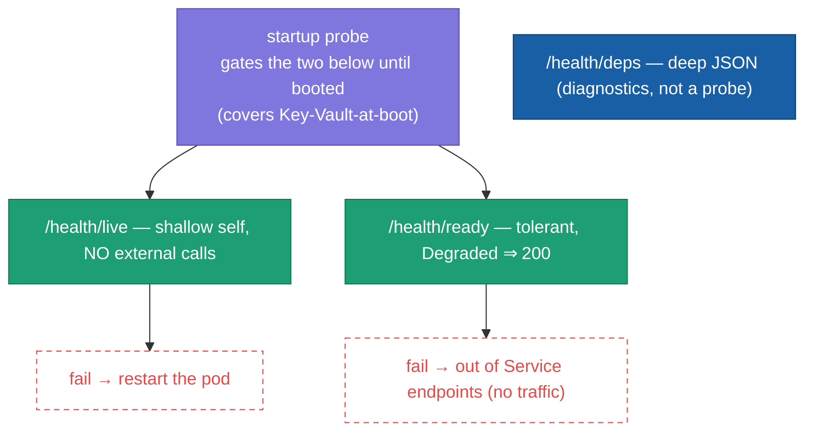
```mermaid
flowchart TD
    STARTUP["startup probe<br/>gates the two below until booted<br/>(covers Key-Vault-at-boot)"]:::edge
    LIVE["/health/live — shallow self, NO external calls"]:::service
    READY["/health/ready — tolerant, Degraded ⇒ 200"]:::service
    DEEP["/health/deps — deep JSON (diagnostics, not a probe)"]:::datastore
    RESTART["fail → restart the pod"]:::issue
    OUT["fail → out of Service endpoints (no traffic)"]:::issue
    STARTUP --> LIVE
    STARTUP --> READY
    LIVE --> RESTART
    READY --> OUT

    classDef edge fill:#7F77DD,stroke:#5B52B8,color:#FFF;
    classDef service fill:#1D9E75,stroke:#14795A,color:#FFF;
    classDef datastore fill:#185FA5,stroke:#0F3F6E,color:#FFF;
    classDef issue fill:none,stroke:#E24B4A,color:#E24B4A,stroke-dasharray:5 4;
```

**How AntKart uses it** — Every service calls `AddDefaultHealthChecks()` + `MapDefaultHealthChecks()` from BuildingBlocks. Liveness is deliberately shallow — no DB call — so a transient database blip can't cause a restart storm; readiness is tolerant (Degraded returns 200) so one degraded dependency doesn't blackout the whole fleet. Deep checks (real Cosmos `ping`, Key Vault metadata list) are tagged `ak:deep` and appear only on `/health/deps`. The startup probe covers the Key-Vault-at-boot delay.

**Alternatives and the trade-off** — Alternative: a single `/health` endpoint that touches the database — which fails liveness on any DB hiccup (restart storm) or lets a not-ready pod serve traffic. The three-surface split, with liveness shallow and readiness tolerant, prevents both. The cost is a bit more wiring (three endpoints, tags) — packaged once in BuildingBlocks so every service gets it for free.

**Gotchas** —
- **Liveness must never touch an external dependency.** A DB-touching liveness probe turns a transient blip into a cascade of restarts. Keep it shallow (`self`).
- **Readiness is tolerant on purpose.** Degraded ⇒ 200 so a partially-degraded dependency doesn't pull every pod out of the Service at once (fleet blackout).
- **KI-013:** health is a *deploy-layer* blind spot too — a ConfigMap change doesn't roll pods, so every probe reports healthy while pods run stale config. Source: [KNOWN_ISSUES.md](KNOWN_ISSUES.md) KI-013.

**Interview traps** —
- *"Liveness vs readiness — what's the difference and why separate them?"* — Liveness = restart if dead; readiness = take-out-of-rotation if not ready. Merging them causes restart storms or bad-traffic routing.
- *"Why doesn't the liveness probe check the database?"* — A transient DB blip would restart every pod — a self-inflicted outage. The ran-it insight.
- *"Why does readiness return 200 when Degraded?"* — To avoid pulling the whole fleet out of service over one degraded dependency (fleet blackout).
- *"Why the `ak:` tag prefix?"* — So a library's own health check (MassTransit's `"ready"`) can't leak onto our readiness probe. The precise-wiring question.

**The 60-second answer** — "We treat health as application code, with three purpose-built surfaces. `/health/live` is shallow — no external calls — because if liveness touched the database, a transient blip would restart every pod and cause the outage it's meant to prevent. `/health/ready` is tolerant: Degraded returns 200, so one degraded dependency doesn't yank the whole fleet out of the Service at once. `/health/deps` runs the deep checks — a real Cosmos ping, Key Vault — but it's a diagnostic, not a probe. The tags are namespaced with an `ak:` prefix so a library's own health check can't leak onto our readiness probe, and a startup probe covers the Key-Vault-at-boot delay. One honest gap, KI-013: a ConfigMap change doesn't roll the pods, so the probes can report healthy while the app runs stale config."

**Read the code** — `AK.BuildingBlocks/AK.BuildingBlocks/HealthChecks/HealthCheckExtensions.cs`
(`AddDefaultHealthChecks`, `MapDefaultHealthChecks`; `/health/live` liveness-only, `/health/ready`
Degraded⇒200, `/health/deps` detailed JSON) and `HealthCheckTags.cs` (`ak:live`/`ak:ready`/`ak:deep`,
namespaced so MassTransit's `"ready"`-tagged bus check can't leak onto readiness). Related gap:
[KNOWN_ISSUES.md](KNOWN_ISSUES.md) KI-013 (config change reports healthy while pods run stale config).

**To reach 🟢** — Without notes, explain why liveness is shallow and readiness is tolerant, and what the `ak:` tag prefix prevents. Then predict the HTTP codes on `/health/live` vs `/health/ready` when the database is briefly down.

---

# 2. Infrastructure as code

### 1. Declarative infrastructure and the plan/apply model 🟡

**What it is** — You describe the *desired* end state of your infrastructure in code, and the tool
figures out the actions to reach it. `terraform plan` shows the diff between what's declared and what
exists; `terraform apply` makes the change. You never write "create this VM" — you declare the VM and
let Terraform reconcile.

**The problem it solves** — Clicking through a portal or running imperative scripts leaves no record of
what was done, drifts over time, and cannot be reliably reproduced in a second environment. Declarative
IaC makes the infrastructure reviewable, versioned, and repeatable, and the mandatory plan-before-apply
step turns "hope it works" into "read the diff first."

**How it works** — You write the *desired* state; Terraform computes and executes the *actions*. `plan` reads state, refreshes it against the real cloud, diffs against your config, and prints exactly what it would **create / update / destroy** — you read that diff before anything changes. `apply` then performs it and records the result in state. You never script "create then configure then wire" — you declare the end state and Terraform reconciles.

| Step | What it does | Rule |
|---|---|---|
| write | declare resources in modules/units | idempotent — re-declaring the same thing is a no-op |
| `plan` | show the create/update/destroy diff | **always read it first** |
| `apply` | make the change, update state | one wave at a time on a first build |

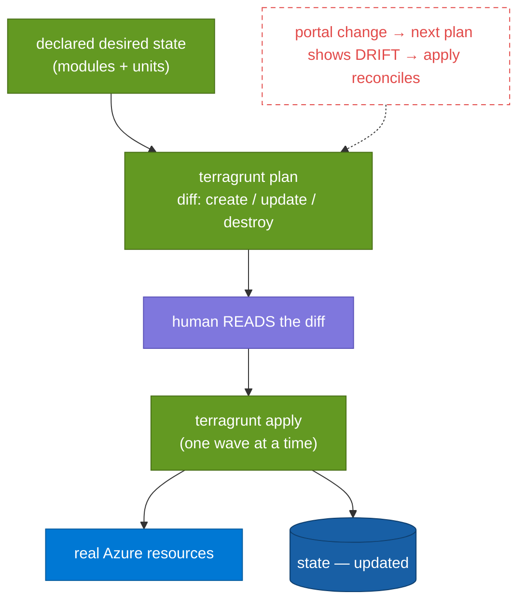
```mermaid
flowchart TD
    CODE["declared desired state<br/>(modules + units)"]:::cicd
    PLAN["terragrunt plan<br/>diff: create / update / destroy"]:::cicd
    READ["human READS the diff"]:::edge
    APPLY["terragrunt apply<br/>(one wave at a time)"]:::cicd
    AZ["real Azure resources"]:::paas
    STATE[("state — updated")]:::datastore
    CODE --> PLAN --> READ --> APPLY --> AZ
    APPLY --> STATE
    DRIFT["portal change → next plan shows DRIFT → apply reconciles"]:::issue
    DRIFT -.-> PLAN

    classDef cicd fill:#639922,stroke:#496F18,color:#FFF;
    classDef edge fill:#7F77DD,stroke:#5B52B8,color:#FFF;
    classDef paas fill:#0078D4,stroke:#005A9E,color:#FFF;
    classDef datastore fill:#185FA5,stroke:#0F3F6E,color:#FFF;
    classDef issue fill:none,stroke:#E24B4A,color:#E24B4A,stroke-dasharray:5 4;
```

**How AntKart uses it** — Every resource is a declaration in `infrastructure/modules/` instantiated per environment under `infrastructure/environments/dev/`. The runbook's standing rules are literally "**plan before apply, every time**" and "**one wave at a time** — do not `run-all apply` across the whole tree on a first build." So a build is: `terragrunt plan` a unit, read the diff, `apply`, verify, move to the next wave. Decision: [ADR-012](adr/ADR-012-iac-with-terraform-terragrunt.md); guide: [docs/guides/iac-concepts.md](guides/iac-concepts.md).

**Alternatives and the trade-off** — Alternatives: portal clicks or imperative scripts (no record, drifts, unreproducible), ARM/Bicep (Azure-only), or Pulumi (general-purpose languages). [ADR-012](adr/ADR-012-iac-with-terraform-terragrunt.md) rejected Bicep/ARM (single-cloud, less portable) and Pulumi in favour of Terraform's mature declarative model + Terragrunt orchestration. Declarative IaC trades a learning curve and a state file to manage for reviewable, versioned, reproducible infrastructure with a mandatory "read the diff" gate.

**Gotchas** —
- **`plan` is a point-in-time diff.** If someone changes a resource in the portal, the next `plan` shows drift — declarative tools *detect* drift but only correct it on the next `apply`.
- **Never `apply` without reading the `plan`.** The whole value is the diff; skipping it is how you destroy something you didn't mean to (`prevent_destroy` guards the worst cases).
- **First builds go wave-by-wave.** A blanket `run-all apply` on an unbuilt tree fights dependency order.

**Interview traps** —
- *"What's the difference between declarative and imperative infrastructure?"* — You declare the end state and the tool computes the actions, vs scripting the steps yourself. Declarative gives idempotency and drift detection.
- *"What does `terraform plan` actually guarantee?"* — That `apply` will attempt exactly the create/update/destroy shown — nothing more; it's your review gate, not a promise the cloud won't change under you.
- *"Someone changed a setting in the portal — what happens on your next run?"* — `plan` reports drift; `apply` reconciles it back to code. Testing whether you understand drift.
- *"Why Terraform over Bicep here?"* — Portability and a mature ecosystem; ADR-012 rejected the Azure-only options.

**The 60-second answer** — "Infrastructure as code here is declarative: I describe the desired end state in modules, and Terraform figures out the actions. `plan` refreshes state against the real cloud, diffs it against my code, and shows exactly what it would create, update, or destroy — and the standing rule is you always read that diff before applying. `apply` makes the change and records it in state. You never write imperative steps. On a first build we go one wave at a time rather than applying the whole tree, and because it's declarative, if someone changes something in the portal the next plan shows the drift and apply reconciles it. We chose Terraform over Bicep or ARM for portability and the ecosystem — that's ADR-012."

**Read the code** — Modules under `infrastructure/modules/` (the *what*), instantiated per environment
under `infrastructure/environments/dev/` (the *where*). Concept guide:
[docs/guides/iac-concepts.md](guides/iac-concepts.md) §5. Decision:
[ADR-012](adr/ADR-012-iac-with-terraform-terragrunt.md).

**To reach 🟢** — Without notes, explain plan-vs-apply and what drift is. Then run `terragrunt plan` on one unit and predict whether it shows any changes before you read the output.

---

### 2. Terraform state as memory 🟡

**What it is** — Terraform keeps a **state file** that maps the resources you declared in code to the
real resources that exist in Azure — their IDs, attributes, and dependencies. State is Terraform's
memory: without it, Terraform has no idea that the `azurerm_kubernetes_cluster` in your code is the
`aks-antkart-dev` already running in Azure.

**The problem it solves** — Cloud APIs have no notion of "the thing my code called `this`." Terraform
needs a durable record linking each code resource to its real-world instance, or every apply would
either recreate everything or fail to detect drift. State is that record — it's how `plan` computes a
diff and how `apply` knows to *update* rather than *create*.

**How it works** — On each run Terraform reads state, refreshes it against the real API, compares to the
declared config, and produces the plan. State must be **remote and locked** for team/CI use — a local
`terraform.tfstate` on one laptop can't be shared and has no concurrency protection. AntKart stores state
in an Azure Storage container, authenticated with an Entra identity (no storage key), with a **blob lease**
taken during apply so a second concurrent apply is refused.

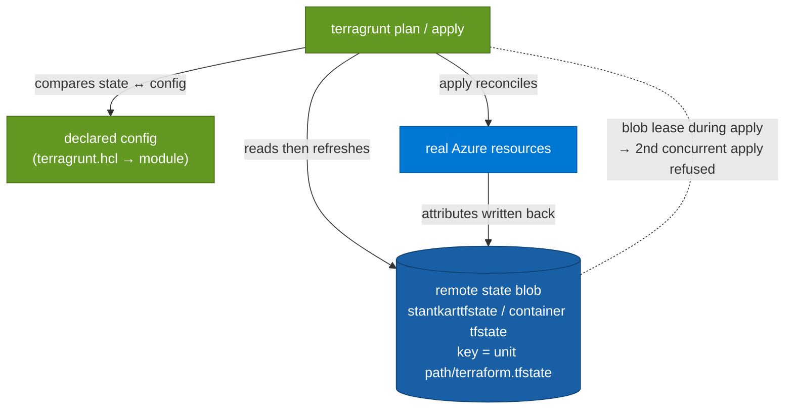
```mermaid
flowchart TD
    CODE["declared config<br/>(terragrunt.hcl → module)"]:::cicd
    TG["terragrunt plan / apply"]:::cicd
    STATE[("remote state blob<br/>stantkarttfstate / container tfstate<br/>key = unit path/terraform.tfstate")]:::datastore
    AZ["real Azure resources"]:::paas

    TG -->|reads then refreshes| STATE
    TG -->|compares state ↔ config| CODE
    TG -->|apply reconciles| AZ
    AZ -->|attributes written back| STATE
    STATE -. "blob lease during apply<br/>→ 2nd concurrent apply refused" .- TG

    classDef external fill:#B4B2A9,stroke:#7A7870,color:#111,stroke-dasharray:4 3;
    classDef service fill:#1D9E75,stroke:#14795A,color:#FFF;
    classDef paas fill:#0078D4,stroke:#005A9E,color:#FFF;
    classDef datastore fill:#185FA5,stroke:#0F3F6E,color:#FFF;
    classDef identity fill:#BA7517,stroke:#8A560F,color:#FFF;
    classDef edge fill:#7F77DD,stroke:#5B52B8,color:#FFF;
    classDef cicd fill:#639922,stroke:#496F18,color:#FFF;
    classDef issue fill:none,stroke:#E24B4A,color:#E24B4A,stroke-dasharray:5 4;
```

**How AntKart uses it** — The backend is generated into every unit by the `remote_state` block in
`infrastructure/environments/dev/root.hcl:36-73`: backend type `azurerm`, storage account
`stantkarttfstate`, container `tfstate`, resource group `rg-antkart-tfstate`, with
`use_azuread_auth = true` so access is by Entra identity, not a shared key. The state **key is the unit's
path** — `key = "${path_relative_to_include()}/terraform.tfstate"` (`root.hcl:61`) — so each of the 18
units gets its own blob (e.g. `resource-group/terraform.tfstate`), and each blob is leased independently
during its apply.

**Alternatives and the trade-off** — Alternatives: local state (simple, but unshareable and unsafe for
CI/teams), or a stateless tool that queries the cloud every run (no drift memory, slower, ambiguous).
Remote state buys sharing, locking, and a durable map at the cost of one more resource to provision
first (the state backend — hence runbook Phase 0 exists to create it before anything else). Splitting
state per unit (18 blobs) rather than one monolithic state means a blast radius of one unit per apply and
independent locking, at the cost of cross-unit values having to pass through `dependency` blocks.

**Gotchas** —
- **State is sensitive.** It records resource attributes including generated secrets (e.g. the Postgres
  admin password lives in state before it's copied to Key Vault) — which is exactly why the backend
  disables shared-key access and uses Entra auth. Never commit a state file.
- **The backend must exist before you can use it.** You cannot Terraform the state container with a
  backend that points at itself; runbook Phase 0 creates it out of band first.
- **Provider lock drift is a state-adjacent trap — KI-012.** See concept 7.

**Interview traps** —
- *"What is Terraform state and why can't Terraform work without it?"* — Testing the core. It's the map
  from declared resources to real ones; without it Terraform can't tell create from update or detect
  drift.
- *"Two engineers run apply on the same unit at once — what happens?"* — Testing locking. The azurerm
  backend takes a blob lease; the second apply is refused until the first releases. If you say "nothing,
  it just works," you've never had it save you.
- *"Where does a generated database password live between apply and Key Vault?"* — Testing that you know
  state holds secrets. In the state file — which is why the backend is Entra-authenticated and locked.
- *"Why remote state instead of committing the state file to Git?"* — It's sensitive, it needs locking,
  and Git has no concurrency control for it; committing it leaks secrets and invites conflicts.

**The 60-second answer** — "Terraform's state file is its memory — the map between the resources I
declared in code and the real ones in Azure, with their IDs and attributes. It's how `plan` computes a
diff and how `apply` knows to update instead of recreate. For a team you must keep it remote and locked,
so ours lives in an Azure Storage container, authenticated by Entra identity rather than a storage key,
and each of the eighteen units keys its own blob by its path. The azurerm backend takes a blob lease
during apply, so a second concurrent apply on the same unit is refused. State also holds secrets — like
the generated Postgres password before it's vaulted — which is why the backend disables shared-key access."

**Read the code** — `infrastructure/environments/dev/root.hcl:36-73` (remote_state / backend),
`root.hcl:61` (state key = unit path). Concept guide: [docs/guides/iac-concepts.md](guides/iac-concepts.md)
§3. Runbook Phase 0 (create the backend): [environment-provisioning-runbook.md](guides/environment-provisioning-runbook.md).

**To reach 🟢** — Explain, without notes, why the backend must be created before any other unit and what
would happen without a lock. Then open `root.hcl` and read out the storage account, container, and key
expression, and predict how many blobs a full apply produces (18) before you list the container.

---

### 3. Remote state, containers and key collisions 🟡

**What it is** — Because the state key is derived from the **unit's path** and nothing else, two
environments that share the same storage container would compute **identical keys** and silently
overwrite each other's state. The fix is to give each environment its **own container**, keeping the key
expression unchanged.

**The problem it solves** — Standing up a second environment (qa) is the moment this bites: if qa reused
dev's `tfstate` container, `qa/aks/terraform.tfstate` would collide with `dev/aks/terraform.tfstate`
because the key is just `aks/terraform.tfstate` in both — and the second apply would clobber the first
environment's memory of its own resources. Isolating by container prevents a cross-environment state
disaster.

**How it works** — The key is `path_relative_to_include()/terraform.tfstate`, which has no environment
segment — so environment isolation cannot come from the key. It comes from the **container**: dev uses
`tfstate`, qa uses `tfstate-qa`. Same blob names, different containers, zero collision. This is a
one-line change per environment (`state_container` in that environment's `root.hcl`), not a change to the
key expression.

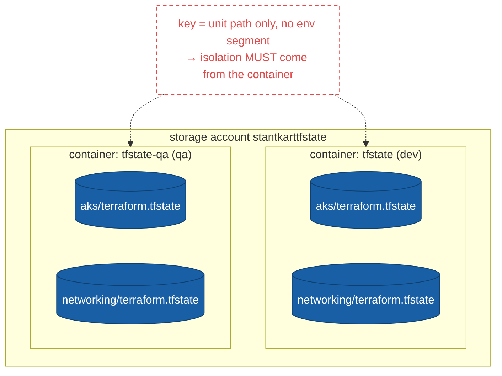
```mermaid
flowchart TD
    subgraph SA["storage account stantkarttfstate"]
        subgraph C1["container: tfstate (dev)"]
            D1[("aks/terraform.tfstate")]:::datastore
            D2[("networking/terraform.tfstate")]:::datastore
        end
        subgraph C2["container: tfstate-qa (qa)"]
            Q1[("aks/terraform.tfstate")]:::datastore
            Q2[("networking/terraform.tfstate")]:::datastore
        end
    end
    NOTE["key = unit path only, no env segment<br/>→ isolation MUST come from the container"]:::issue
    NOTE -.-> C1
    NOTE -.-> C2

    classDef external fill:#B4B2A9,stroke:#7A7870,color:#111,stroke-dasharray:4 3;
    classDef service fill:#1D9E75,stroke:#14795A,color:#FFF;
    classDef paas fill:#0078D4,stroke:#005A9E,color:#FFF;
    classDef datastore fill:#185FA5,stroke:#0F3F6E,color:#FFF;
    classDef identity fill:#BA7517,stroke:#8A560F,color:#FFF;
    classDef edge fill:#7F77DD,stroke:#5B52B8,color:#FFF;
    classDef cicd fill:#639922,stroke:#496F18,color:#FFF;
    classDef issue fill:none,stroke:#E24B4A,color:#E24B4A,stroke-dasharray:5 4;
```

**How AntKart uses it** — dev's `infrastructure/environments/dev/root.hcl` sets `state_container = "tfstate"`
(18 blobs). qa's `infrastructure/environments/qa/root.hcl:31` sets `state_container = "tfstate-qa"`, with
the storage account, resource group, and key expression identical to dev. The runbook's Phase 0/1 make
this the **first** edit when standing up a new environment, precisely because the collision is silent and
catastrophic if missed. (The development doc `docs/development/1-infrastructure-as-code.md` still describes
qa as "planned"; in the repository qa is in fact fully built — trust the tree.)

**Alternatives and the trade-off** — You could instead put the environment into the **key** (e.g.
`env/unit/terraform.tfstate`) or use a separate storage account per environment. Container-per-environment
was chosen because it's a one-line change that reuses the same key logic and the same account, keeping the
DRY generate block untouched. A separate account would isolate harder (separate RBAC, separate blast
radius) at the cost of more moving parts; changing the key expression would touch every environment's
shared config.

**Gotchas** —
- **The collision is silent.** Nothing errors — the second environment simply overwrites the first's
  state and Terraform then thinks the first environment's resources don't exist. This is why the container
  change is step one of a new build.
- **Change the container, not the key.** Editing the key expression in the shared `root.hcl` would move
  *every* environment's state at once.

**Interview traps** —
- *"Your qa apply corrupts dev's state. What did someone forget?"* — Testing whether you understand the
  key. They reused dev's container; the path-only key collided. Fix: qa gets its own container.
- *"Why not just put the environment name in the state key?"* — A valid alternative; the trade is touching
  shared config vs a one-line container change. Testing whether you can weigh the two.
- *"Does the storage account differ per environment?"* — No, the account and key expression are the same;
  only the container differs. Testing precision.

**The 60-second answer** — "Our state key is just the unit's path — `aks/terraform.tfstate`, with no
environment in it. That's fine for one environment, but the moment you add qa, if it shares dev's
container the keys collide and qa silently overwrites dev's state. So isolation comes from the container,
not the key: dev uses `tfstate`, qa uses `tfstate-qa`, same account, same key expression, zero collision.
It's a one-line change in the new environment's root config, and it's deliberately the first step of
standing up a new environment because the failure is silent — nothing errors, dev's state just gets
clobbered."

**Read the code** — `infrastructure/environments/dev/root.hcl:31` (`state_container = "tfstate"`) and
`root.hcl:61` (path-only key); `infrastructure/environments/qa/root.hcl:31` (`tfstate-qa`). Discussion:
`docs/development/1-infrastructure-as-code.md`. Runbook Phase 0/1:
[environment-provisioning-runbook.md](guides/environment-provisioning-runbook.md).

**To reach 🟢** — Without notes, explain why the collision is silent and name the exact one-line fix and
which file it goes in. Then predict, for a hypothetical `staging` environment, the container name and the
state key for its `aks` unit.

---

### 4. Terragrunt and why it wraps Terraform 🟡

**What it is** — Terragrunt is a thin wrapper around Terraform that removes the copy-paste. It generates
the backend, provider, and versions configuration into every unit from one place, and lets a unit declare
its inputs and dependencies without repeating boilerplate.

**The problem it solves** — Plain Terraform makes you repeat the same backend block, provider block, and
version pins in every one of 18 units, and gives no first-class way to pass one unit's outputs into
another. Terragrunt's `generate` and `include` blocks put that config in exactly one file (`root.hcl`),
and its `dependency` blocks wire units together — keeping the tree DRY.

**How it works** — Terragrunt sits on top of Terraform and adds three things plain Terraform lacks a DRY answer for: **`generate` blocks** that write the backend/provider/versions config into every unit from one place; an **`include` block** that pulls a shared `root.hcl` into each unit; and **`dependency` blocks** that pass one unit's outputs into another. You run `terragrunt` instead of `terraform`; it generates the boilerplate, resolves dependencies, then calls Terraform underneath.

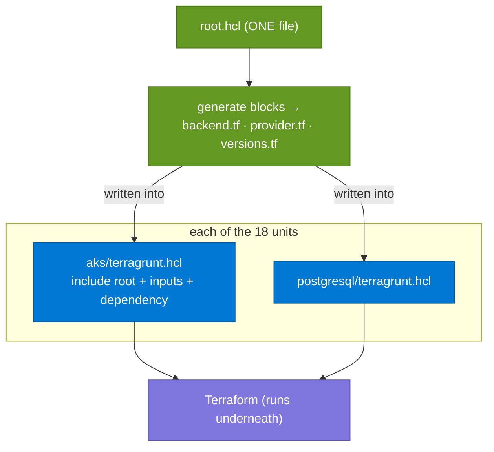
```mermaid
flowchart TD
    ROOT["root.hcl (ONE file)"]:::cicd
    GEN["generate blocks →<br/>backend.tf · provider.tf · versions.tf"]:::cicd
    subgraph UNITS["each of the 18 units"]
        U1["aks/terragrunt.hcl<br/>include root + inputs + dependency"]:::paas
        U2["postgresql/terragrunt.hcl"]:::paas
    end
    TF["Terraform (runs underneath)"]:::edge
    ROOT --> GEN
    GEN -->|written into| U1
    GEN -->|written into| U2
    U1 --> TF
    U2 --> TF

    classDef cicd fill:#639922,stroke:#496F18,color:#FFF;
    classDef paas fill:#0078D4,stroke:#005A9E,color:#FFF;
    classDef edge fill:#7F77DD,stroke:#5B52B8,color:#FFF;
```

**How AntKart uses it** — `infrastructure/environments/dev/root.hcl` has `generate` blocks that emit `backend.tf`, `provider.tf`, and `versions.tf` into every unit at init — so the backend, the azurerm provider, and the version pins live in **exactly one file**. Each unit's `terragrunt.hcl` starts with `include "root" { path = find_in_parent_folders("root.hcl") }` to inherit all of it. The 18 units therefore share one backend/provider/versions definition instead of copy-pasting it 18 times. Decision: [ADR-012](adr/ADR-012-iac-with-terraform-terragrunt.md); guide: [docs/guides/iac-concepts.md](guides/iac-concepts.md) §2.

**Alternatives and the trade-off** — Plain Terraform would repeat the backend + provider + version block in all 18 units (and 18 more for qa), and has no first-class way to wire one unit's outputs to another (you'd use fragile `terraform_remote_state` data sources). Terraform **workspaces** share one state and give weaker isolation. Terragrunt buys DRY generation + dependency wiring + per-unit isolated state, at the cost of a second tool and its conventions. [ADR-012](adr/ADR-012-iac-with-terraform-terragrunt.md) calls the plain-Terraform alternative "60 copy-pasted backend blocks."

**Gotchas** —
- **You must name `"root.hcl"` explicitly.** `find_in_parent_folders()` defaults to looking for `terragrunt.hcl`; the shared file is `root.hcl`, so the argument is required or the include fails.
- **Generated files aren't committed.** `backend.tf`/`provider.tf`/`versions.tf` are produced into the build cache at init; they are *not* tracked in Git (only `root.hcl` and each `terragrunt.hcl` are). Looking for a committed `provider.tf` and not finding one is expected.
- **The lock file *is* committed** even though the generated versions file isn't — see concept 7 (KI-012).

**Interview traps** —
- *"What does Terragrunt add over plain Terraform?"* — DRY `generate` of backend/provider/versions, `include` of a shared config, and `dependency` wiring — plus per-unit isolated state. "It's a wrapper" alone is read-about.
- *"Where does the backend config live for 18 units?"* — In one `root.hcl`, generated into each unit; not 18 copies. Testing the DRY point.
- *"Why `find_in_parent_folders(\"root.hcl\")` with the explicit argument?"* — The default looks for `terragrunt.hcl`; the shared file is named `root.hcl`. The precise-detail question.
- *"Terragrunt vs Terraform workspaces for multiple environments?"* — Workspaces share state (weaker isolation); Terragrunt gives a separate state container and full isolation per environment.

**The 60-second answer** — "Terragrunt is a thin wrapper over Terraform that kills the copy-paste. Instead of repeating the backend, provider, and version pins in all eighteen units, they live in one `root.hcl` with `generate` blocks that write them into each unit at init, and every unit just `include`s that root. It also adds `dependency` blocks so one unit can consume another's outputs — which plain Terraform has no clean answer for. You run terragrunt, it generates the boilerplate and resolves dependencies, then calls Terraform underneath. The trade is a second tool and its conventions; the payoff is a DRY, wired, per-unit-isolated tree. One quirk: you must name `root.hcl` explicitly in `find_in_parent_folders` because the default is `terragrunt.hcl`."

**Read the code** — `infrastructure/environments/dev/root.hcl` (`generate` blocks for backend/provider/
versions; the DRY source of truth) and any unit's `include "root" { path = find_in_parent_folders("root.hcl") }`
(e.g. `infrastructure/environments/dev/aks/terragrunt.hcl`). Decision:
[ADR-012](adr/ADR-012-iac-with-terraform-terragrunt.md); guide:
[docs/guides/iac-concepts.md](guides/iac-concepts.md) §2.

**To reach 🟢** — Without notes, list the three things Terragrunt generates and why `root.hcl` must be named explicitly. Then open a unit's `terragrunt.hcl` and point to the `include` block and its `source`.

---

### 5. Modules versus environments (blueprint versus instance) 🟡

**What it is** — A **module** (`infrastructure/modules/aks`) is a reusable blueprint: it declares a kind
of resource in terms of input variables, with no environment-specific values baked in. An **environment
unit** (`infrastructure/environments/dev/aks`) is an instance of that blueprint: it points at the module
and supplies this environment's actual values. Same blueprint, many instances.

**The problem it solves** — If each environment copy-pasted the resource definitions, a fix would have to
be made in every copy and they would drift. Separating blueprint from instance means the *how* (module) is
written once and the *what* (per-environment inputs) is the only thing that changes between dev and qa —
so a new environment is new inputs, not new code.

**How it works** — A unit's `terragrunt.hcl` has a `terraform { source = "../../../modules/<name>" }` block
pointing at the module, and an `inputs = { ... }` block supplying values. The module's `variables.tf`
declares what it needs, `main.tf` builds the resources from those variables, and `outputs.tf` exposes what
other units consume. Provisioning a second environment reuses the exact same modules with a different
`inputs` set.

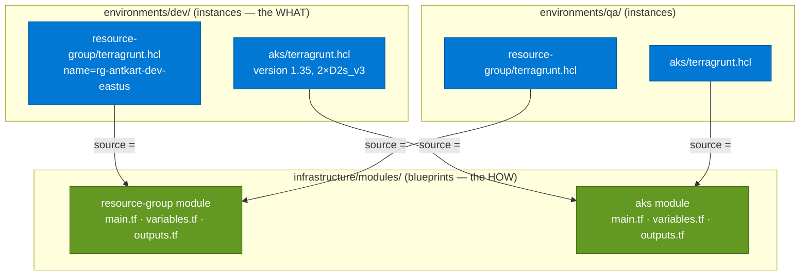
```mermaid
flowchart TD
    subgraph M["infrastructure/modules/  (blueprints — the HOW)"]
        MRG["resource-group module<br/>main.tf · variables.tf · outputs.tf"]:::cicd
        MAKS["aks module<br/>main.tf · variables.tf · outputs.tf"]:::cicd
    end
    subgraph DEV["environments/dev/  (instances — the WHAT)"]
        DRG["resource-group/terragrunt.hcl<br/>name=rg-antkart-dev-eastus"]:::paas
        DAKS["aks/terragrunt.hcl<br/>version 1.35, 2×D2s_v3"]:::paas
    end
    subgraph QA["environments/qa/  (instances)"]
        QRG["resource-group/terragrunt.hcl"]:::paas
        QAKS["aks/terragrunt.hcl"]:::paas
    end
    DRG -->|source =| MRG
    QRG -->|source =| MRG
    DAKS -->|source =| MAKS
    QAKS -->|source =| MAKS

    classDef external fill:#B4B2A9,stroke:#7A7870,color:#111,stroke-dasharray:4 3;
    classDef service fill:#1D9E75,stroke:#14795A,color:#FFF;
    classDef paas fill:#0078D4,stroke:#005A9E,color:#FFF;
    classDef datastore fill:#185FA5,stroke:#0F3F6E,color:#FFF;
    classDef identity fill:#BA7517,stroke:#8A560F,color:#FFF;
    classDef edge fill:#7F77DD,stroke:#5B52B8,color:#FFF;
    classDef cicd fill:#639922,stroke:#496F18,color:#FFF;
    classDef issue fill:none,stroke:#E24B4A,color:#E24B4A,stroke-dasharray:5 4;
```

**How AntKart uses it** — There are **18 modules** and, in dev, **18 units + `root.hcl`** in a 1:1
mapping. A concrete pair: `infrastructure/environments/dev/resource-group/terragrunt.hcl` sets
`source = "../../../modules/resource-group"` and supplies `name = "rg-antkart-dev-eastus"`,
`location = "eastus"`; the blueprint `infrastructure/modules/resource-group/main.tf` creates a single
`azurerm_resource_group.this` entirely from `var.*` (with `prevent_destroy = true`) and exposes
`name`/`id`/`location` in `outputs.tf`. qa reuses the identical modules with qa inputs — that is what makes
qa "new inputs, not new code."

**Alternatives and the trade-off** — The alternative is per-environment copies of the resource code, or a
single giant config with conditionals. Blueprint/instance separation trades a little indirection (you read
two files — the unit and the module — to see the whole picture) for single-source-of-truth reuse and a
trivially-cloneable new environment. AntKart even generates the backend/provider/versions centrally
(concept 4) so the only per-environment code is genuinely the inputs.

**Gotchas** —
- **The ADR's structure sketch is idealised.** [ADR-012](adr/ADR-012-iac-with-terraform-terragrunt.md)
  shows a top-level `infrastructure/terragrunt.hcl`, per-environment `env.hcl` files, and a module named
  `acr`. The live tree has `environments/dev/root.hcl` (no top-level file, no `env.hcl`), a module named
  `container-registry`, and inputs inlined in each unit. Cite the files, not the sketch.
- **Region overrides live in the instance, not the blueprint.** e.g. `postgresql` and `redis` pin
  `eastus2` in their dev units because `eastus` is offer-restricted — a per-instance value, correctly not
  baked into the module.

**Interview traps** —
- *"What's the difference between a module and an environment here?"* — Blueprint vs instance: module = how,
  environment unit = what. If you call them "just folders," you've missed the reuse point.
- *"How do you stand up a second environment?"* — Reuse the same modules with a new `inputs` set and a new
  state container; you do not copy the module code. Testing whether you understand "new inputs, not new code."
- *"Where would you change the AKS node size for dev only?"* — In `environments/dev/aks/terragrunt.hcl`
  inputs, not in `modules/aks`. Testing where the seam is.
- *"Why is `prevent_destroy` on the resource group blueprint and not per environment?"* — It's an invariant
  of that resource kind, so it belongs in the module. Testing blueprint-vs-instance judgment.

**The 60-second answer** — "A module is a blueprint — it declares a kind of resource purely in terms of
input variables, no environment values baked in. An environment unit is an instance — it points at the
module with a `source` block and supplies this environment's actual values. We have eighteen modules and
eighteen dev units, one-to-one. Standing up qa reuses the exact same modules with qa inputs and a qa state
container — new inputs, not new code. So a fix to the AKS blueprint lands in one place and every
environment picks it up, and the only thing that differs between dev and qa is genuinely the inputs."

**Read the code** — `infrastructure/environments/dev/resource-group/terragrunt.hcl` (instance, `source` +
inputs) and `infrastructure/modules/resource-group/main.tf` + `outputs.tf` (blueprint); same shape for
`aks`, `postgresql`, etc. Guide: [docs/guides/iac-concepts.md](guides/iac-concepts.md) §4. Decision:
[ADR-012](adr/ADR-012-iac-with-terraform-terragrunt.md).

**To reach 🟢** — Without notes, explain "new inputs, not new code" and name the two files you'd read to
understand any one resource. Then trace `resource-group` from unit → module → output → the input it feeds
in another unit.

---

### 6. Dependency blocks and mock_outputs 🟡

**What it is** — A Terragrunt `dependency` block lets one unit consume another unit's **outputs** as
inputs — e.g. the `aks` unit reads the `networking` unit's subnet IDs. `mock_outputs` are placeholder
values that stand in for those outputs when the upstream unit hasn't been applied yet, so `plan`/`validate`
can run before the whole tree exists.

**The problem it solves** — Units are applied in dependency order and each has isolated state, so `aks`
genuinely needs values that only exist after `networking` is applied. Without `dependency` blocks you'd
hard-code IDs (brittle) or apply everything as one giant state (no isolation). Without `mock_outputs`, you
couldn't `plan` or `validate` a unit until every upstream was already applied — which makes a first build,
or a CI plan on a fresh checkout, impossible.

**How it works** — A `dependency "networking" { config_path = "../networking" }` block exposes
`dependency.networking.outputs.*`, which the unit wires into its `inputs`. Each dependency also declares
`mock_outputs` and `mock_outputs_allowed_terraform_commands = ["init","plan","validate"]` — so the mocks
are used *only* for those read-only commands and never leak into an `apply` (an apply demands the real
upstream outputs).

```mermaid
flowchart TD
    RG["resource-group unit"]:::paas
    NET["networking unit"]:::paas
    OBS["observability unit"]:::paas
    ACR["container-registry unit"]:::paas
    AKS["aks unit<br/>dependency: resource-group, networking,<br/>container-registry, observability"]:::paas
    MOCK["mock_outputs<br/>allowed only for init / plan / validate<br/>→ plan a fresh tree before apply"]:::issue

    RG -->|outputs.name| AKS
    NET -->|"outputs.subnet_ids['aks']"| AKS
    ACR -->|outputs.id| AKS
    OBS -->|outputs.workspace_id| AKS
    MOCK -.-> AKS

    classDef external fill:#B4B2A9,stroke:#7A7870,color:#111,stroke-dasharray:4 3;
    classDef service fill:#1D9E75,stroke:#14795A,color:#FFF;
    classDef paas fill:#0078D4,stroke:#005A9E,color:#FFF;
    classDef datastore fill:#185FA5,stroke:#0F3F6E,color:#FFF;
    classDef identity fill:#BA7517,stroke:#8A560F,color:#FFF;
    classDef edge fill:#7F77DD,stroke:#5B52B8,color:#FFF;
    classDef cicd fill:#639922,stroke:#496F18,color:#FFF;
    classDef issue fill:none,stroke:#E24B4A,color:#E24B4A,stroke-dasharray:5 4;
```

**How AntKart uses it** — `infrastructure/environments/dev/aks/terragrunt.hcl` declares dependencies on
`resource-group`, `networking`, `container-registry`, and `observability`, and wires their real outputs
into inputs — e.g. `resource_group_name = dependency.resource_group.outputs.name` and
`subnet_id = dependency.networking.outputs.subnet_ids["aks"]`. Each dependency block carries a
`mock_outputs` shape (the networking mock supplies fully-formed ARM subnet IDs with a zero-GUID
subscription) guarded by `mock_outputs_allowed_terraform_commands = ["init","plan","validate"]`. The
richest dependency chains are `workload-identity` (resource-group, aks, key-vault, servicebus, eventgrid)
and `role-assignments` (function-app, key-vault, servicebus, eventgrid).

**Alternatives and the trade-off** — Alternatives: one monolithic state where everything can reference
everything (no isolation, huge blast radius, slow), or hard-coded resource IDs copied between units
(brittle, breaks on any rebuild). Dependency blocks buy isolated per-unit state *and* real value passing,
at the cost of having to declare `mock_outputs` so read-only commands work before the tree is built. The
mocks are the price of isolation, not decoration.

**Gotchas** —
- **Mocks must be shaped like the real output or plan fails.** The networking mock has to be a valid subnet
  ID string, not a placeholder, or the consuming expression (`subnet_ids["aks"]`) errors during plan.
- **Mocks are read-only by design.** `mock_outputs_allowed_terraform_commands` restricts them to
  init/plan/validate; an `apply` will not accept a mock, so you can't accidentally apply against fake
  values.
- **Ten units depend only on `resource-group`, not eleven.** Verified against the `dependency` blocks in
  `infrastructure/environments/dev/*/terragrunt.hcl`: `key-vault` also declares a dependency on
  `observability`, so it is not in the resource-group-only set. The true count is **10** —
  `communication-services`, `container-registry`, `cosmosdb`, `eventgrid`, `governance`, `networking`,
  `observability`, `postgresql`, `redis`, `servicebus`. (The development-doc dependency diagram in
  `docs/development/1-infrastructure-as-code.md` still says "11"; it is off by one.)

**Interview traps** —
- *"How does one Terragrunt unit use another unit's output?"* — A `dependency` block exposing
  `dependency.<name>.outputs.*`. Testing whether you know the wiring, not just that "they depend on each other."
- *"You've never applied anything and you run `terragrunt plan` on `aks` — why doesn't it fail on the
  missing networking outputs?"* — `mock_outputs` stand in for plan/validate. This is the question that
  separates people who've run a first build from people who haven't.
- *"Could a mock value end up provisioning real infrastructure?"* — No —
  `mock_outputs_allowed_terraform_commands` excludes `apply`. Testing whether you know the guard exists.
- *"Why not one big state file so everything can reference everything?"* — Blast radius and locking: one
  unit's apply shouldn't be able to corrupt or block another's. Testing isolation judgment.

**The 60-second answer** — "Each unit has its own isolated state and they apply in order, so a unit like
`aks` needs values that only exist after `networking` and `resource-group` are applied — its subnet IDs,
the RG name. A `dependency` block exposes another unit's outputs so I can wire them straight into my
inputs. The catch is a first build, or a CI plan on a fresh checkout: the upstream isn't applied yet, so
its outputs don't exist. That's what `mock_outputs` are — correctly-shaped placeholders that let
`plan` and `validate` run, restricted by `mock_outputs_allowed_terraform_commands` to read-only commands
so they can never sneak into an apply. It's how you get isolated state and still plan the whole tree
before anything exists."

**Read the code** — `infrastructure/environments/dev/aks/terragrunt.hcl` (four `dependency` blocks,
`mock_outputs`, the `mock_outputs_allowed_terraform_commands` guard, real outputs wired to inputs);
`infrastructure/environments/dev/workload-identity/terragrunt.hcl` and `infrastructure/environments/dev/role-assignments/terragrunt.hcl`
(the deepest chains). Decision: [ADR-012](adr/ADR-012-iac-with-terraform-terragrunt.md).

**To reach 🟢** — Without notes, explain why a fresh-checkout `plan` needs mock_outputs and why an apply
must not. Then open the `aks` unit and, before reading, predict which four units it depends on.

---

### 7. Provider version pinning and lock files 🟡

**What it is** — Terraform providers (azurerm, azuread, random) are versioned plugins. **Pinning**
constrains which versions are allowed (`~> 4.76`), and the **lock file** (`.terraform.lock.hcl`) records
the exact versions and checksums actually selected, committed to Git so every machine and CI run resolves
identically.

**The problem it solves** — Without pinning, a provider can silently upgrade between runs and change or
break behaviour; without a committed lock file, two engineers or CI can resolve different versions from the
same code. Pinning plus a lock file make provider resolution reproducible.

**How it works** — Two mechanisms work together. **Pinning** is a version *constraint* in `required_providers` — `~> 4.76` (pessimistic: allow 4.76.x but not 4.77) — that bounds what's acceptable. The **lock file** (`.terraform.lock.hcl`) is written by `terraform init`: it records the *exact* version selected within that constraint plus its checksums, and is committed to Git so every machine and CI run installs byte-identical providers.

| | Pinning (`required_providers`) | Lock file (`.terraform.lock.hcl`) |
|---|---|---|
| Says | which versions are *allowed* | which version was *chosen* + checksums |
| Where | `versions.tf` (generated from `root.hcl`) | one per unit, **committed** |
| Written by | you | `terraform init` |

```mermaid
flowchart TD
    PIN["required_providers CONSTRAINT<br/>azurerm ~&gt; 4.76 (allowed versions)"]:::cicd
    INIT["terraform init<br/>resolves within the constraint"]:::edge
    LOCK[("committed .terraform.lock.hcl<br/>EXACT version + checksums")]:::datastore
    ALL["every machine + CI installs identical providers"]:::paas
    PIN --> INIT --> LOCK --> ALL
    KI["KI-012: some dev locks predate the shared pins<br/>→ only azurerm recorded (azuread/random unpinned there)"]:::issue
    KI -.-> LOCK

    classDef cicd fill:#639922,stroke:#496F18,color:#FFF;
    classDef edge fill:#7F77DD,stroke:#5B52B8,color:#FFF;
    classDef datastore fill:#185FA5,stroke:#0F3F6E,color:#FFF;
    classDef paas fill:#0078D4,stroke:#005A9E,color:#FFF;
    classDef issue fill:none,stroke:#E24B4A,color:#E24B4A,stroke-dasharray:5 4;
```

**How AntKart uses it** — The pins are central: `root.hcl` generates the `versions.tf` for every unit with azurerm `~> 4.76`, azuread `~> 3.0`, random `~> 3.6` — one source of truth. Each of the 18 dev units (and 18 qa units) commits its own `.terraform.lock.hcl` so provider resolution is reproducible. Decision: [ADR-012](adr/ADR-012-iac-with-terraform-terragrunt.md).

**Alternatives and the trade-off** — Alternatives: no constraint (a `terraform init` months later silently pulls a new major provider and breaks), or pinning an *exact* version everywhere (reproducible but you never get patch fixes without editing every unit). The `~>` pessimistic constraint + committed lock is the balance — patch flexibility bounded by a constraint, exact resolution frozen by the lock. The cost is remembering to refresh and commit the lock after a constraint change.

**Gotchas** —
- **KI-012 (Low):** some dev lock files were written **before** the shared `required_providers` block existed, so they record only `azurerm` — meaning `azuread`/`random` are effectively unpinned in those units (dev `key-vault` holds 1 provider vs qa's 3). Mitigation: azurerm is pinned at 4.76.0 and only `app-registration` (azuread) and `postgresql` (random) exercise the others. Fix: re-run `terragrunt init` across dev units and commit the refreshed locks. Source: [KNOWN_ISSUES.md](KNOWN_ISSUES.md) KI-012.
- **Never delete the lock to "fix" a resolution.** Deleting it lets versions drift between environments; refresh it with `init` and commit, don't remove it.
- **The generated `versions.tf` is not committed; the lock is.** Don't go looking for a tracked `versions.tf`.

**Interview traps** —
- *"What's the difference between a version constraint and a lock file?"* — The constraint says what's *allowed*; the lock records what was *chosen* plus checksums. Conflating them is the tell.
- *"Why commit `.terraform.lock.hcl`?"* — So every machine and CI resolves the identical provider version — reproducibility. The ran-it answer.
- *"What does `~> 4.76` actually permit?"* — 4.76.x patch updates, not 4.77 or 5.0 — pessimistic constraint. Testing precision.
- *"Your dev and qa resolve different provider versions from the same code — how?"* — Stale/partial lock files (KI-012): a lock written before the shared pins recorded only azurerm.

**The 60-second answer** — "Two things keep provider versions reproducible. Pinning is a constraint in `required_providers` — we use `~> 4.76` for azurerm, so patch updates are allowed but not a new minor or major. The lock file, `.terraform.lock.hcl`, is written by `init` and records the exact version chosen within that constraint plus checksums, and we commit it so every machine and CI installs the identical provider. Our pins live once in `root.hcl` and generate into every unit. The one wrinkle is KI-012: some dev lock files were written before the shared pins existed, so they only record azurerm and leave azuread and random effectively unpinned in a few units — low severity because azurerm is fixed and only two units use the others, and the fix is just to re-init and commit the refreshed locks."

**Read the code** — Central pins in the generated versions block: `infrastructure/environments/dev/root.hcl:111-132`
(azurerm `~> 4.76`, azuread `~> 3.0`, random `~> 3.6`). Committed lock files: one `.terraform.lock.hcl` per
unit (e.g. `infrastructure/environments/dev/aks/.terraform.lock.hcl`). Gap:
[KNOWN_ISSUES.md](KNOWN_ISSUES.md) KI-012 (dev lock files written before the shared versions block record
only azurerm — azuread/random effectively unpinned for some units).

**To reach 🟢** — Without notes, distinguish the constraint from the lock and explain KI-012. Then open a unit's `.terraform.lock.hcl` and predict how many providers it lists before you read it.

---

### 8. Multi-environment structure 🟡

**What it is** — The layout that lets dev and qa (and future environments) coexist: shared modules, one
`root.hcl` per environment generating the DRY backend/provider/versions, and per-unit inputs — so a second
environment is a parallel `environments/<env>/` tree, not a fork of the code.

**The problem it solves** — Promotion has to be repeatable and isolated: qa must reuse dev's proven
modules without sharing its state or its resources. A structured multi-environment layout makes "add an
environment" a mechanical clone-and-retune rather than a rewrite.

**How it works** — Each environment is a parallel folder under `infrastructure/environments/<env>/` containing the same unit names plus its own `root.hcl`. The `root.hcl` generates that environment's DRY backend/provider/versions and — critically — sets its own **state container** so environments never collide (concept 3). The units point at the *shared* modules, so a new environment is: copy the tree, retune the inputs, give it a distinct state container. Modules are never copied.

```mermaid
flowchart TD
    MOD["infrastructure/modules/ (shared blueprints)"]:::cicd
    subgraph DEV["environments/dev/"]
        DR["root.hcl → container tfstate"]:::paas
        DU["18 units (inputs = dev)"]:::paas
    end
    subgraph QA["environments/qa/ (built)"]
        QR["root.hcl → container tfstate-qa"]:::paas
        QU["18 units (inputs = qa)"]:::paas
    end
    DU --> MOD
    QU --> MOD

    classDef external fill:#B4B2A9,stroke:#7A7870,color:#111,stroke-dasharray:4 3;
    classDef service fill:#1D9E75,stroke:#14795A,color:#FFF;
    classDef paas fill:#0078D4,stroke:#005A9E,color:#FFF;
    classDef datastore fill:#185FA5,stroke:#0F3F6E,color:#FFF;
    classDef identity fill:#BA7517,stroke:#8A560F,color:#FFF;
    classDef edge fill:#7F77DD,stroke:#5B52B8,color:#FFF;
    classDef cicd fill:#639922,stroke:#496F18,color:#FFF;
    classDef issue fill:none,stroke:#E24B4A,color:#E24B4A,stroke-dasharray:5 4;
```

**How AntKart uses it** — `environments/dev/` has 18 units + `root.hcl`; `environments/qa/` is a **fully built** parallel tree that reuses the identical modules with qa inputs, and its `root.hcl:31` sets `state_container = "tfstate-qa"`. The runbook's Phase 1 is the mechanical recipe: `robocopy` the tree (excluding caches/generated files), then the **first** edits to the new `root.hcl` are `state_container` and `environment`. Decision: [ADR-012](adr/ADR-012-iac-with-terraform-terragrunt.md); walkthrough: [environment-provisioning-runbook.md](guides/environment-provisioning-runbook.md) Phase 1.

**Alternatives and the trade-off** — Alternatives: **Terraform workspaces** (one config, environment selected by workspace — shares state and a single backend, weaker isolation), a **separate Git repo per environment** (strongest isolation, more moving parts), or copy-pasting whole modules per environment (drifts immediately). The directory-per-environment + shared-modules layout gives real isolation (separate state container, separate resources) while reusing proven module code, at the cost of a little duplication of the per-unit `terragrunt.hcl` wiring. ADR-024 names a separate GitOps repo as the long-term promotion answer for the *app* config, distinct from this IaC layout.

**Gotchas** —
- **The state-container change is step one, and its omission is silent.** A new environment sharing dev's container collides on the path-only state key (concept 3) and clobbers dev — nothing errors.
- **qa is built, not planned.** The development doc still calls qa "planned"; the repository has the full qa tree. Trust the tree.
- **Reuse modules, don't copy them.** The whole point is one blueprint, many environments; copying a module forfeits it.

**Interview traps** —
- *"How do you add a new environment?"* — Copy the tree, retune inputs, set a distinct state container — reusing the same modules. Not "copy the modules." The design question.
- *"Directory-per-environment vs Terraform workspaces — why the former?"* — Workspaces share state and a backend (weaker isolation); separate directories + a distinct state container isolate fully.
- *"What's the very first edit when standing up qa, and why?"* — The state container in `root.hcl`, because the path-only state key would otherwise collide with dev's. The ran-it detail.
- *"Is qa planned or built here?"* — Built — a full parallel tree with `tfstate-qa`. Testing whether you read the repo over the (stale) doc.

**The 60-second answer** — "Each environment is a parallel folder — `environments/dev`, `environments/qa` — with the same unit names and its own `root.hcl`. The units all point at the *shared* modules, so a new environment is new inputs, not new code: copy the tree, retune the inputs, and give it a distinct state container. That container is the critical bit — because our state key is the unit path with no environment segment, qa must use its own container, `tfstate-qa`, or it silently overwrites dev's state. qa is actually fully built in the repo, not planned, even though one dev doc still says planned. The runbook's Phase 1 is the mechanical recipe: robocopy the tree, then the first edits are the state container and the environment name."

**Read the code** — `infrastructure/environments/dev/` (18 units + `root.hcl`) and
`infrastructure/environments/qa/` (the built parallel tree; `root.hcl:31` = `tfstate-qa`). Walkthrough:
[environment-provisioning-runbook.md](guides/environment-provisioning-runbook.md) Phase 1; guide:
[docs/guides/iac-concepts.md](guides/iac-concepts.md).

**To reach 🟢** — Without notes, explain "new inputs, not new code" and why the state container is the first edit. Then, for a hypothetical `staging` environment, name its state container and the first two `root.hcl` values you'd change.

---

# 3. Azure services

### 1. Azure Kubernetes Service (AKS) 🟡

**What it is** — Azure's managed Kubernetes: Azure runs the control plane, you run a node pool of VMs.
AntKart's cluster `aks-antkart-dev` hosts all six services with Azure CNI Overlay networking, an OIDC
issuer, and workload identity enabled.

**The problem it solves** — Running Kubernetes yourself means operating etcd, the API server, and
upgrades. A managed cluster removes that toil and, crucially here, provides the **OIDC issuer** that makes
workload identity (secret-less pod auth) possible.

**How it works** — Azure runs and patches the control plane (API server, etcd, scheduler); you declare a **node pool** of VMs that run your pods. Two features are enabled at *creation* and can't be bolted on later: the **OIDC issuer** (signs ServiceAccount tokens → the basis of workload identity) and **workload identity**. Networking is Azure **CNI Overlay** (pods get IPs from an overlay CIDR, not the VNet).

| Setting | dev value | Why |
|---|---|---|
| version | `1.35` (pinned) | reproducible upgrades |
| node pool | 2 × `Standard_D2s_v3` | fixed; `auto_scaling_enabled = false` |
| tier | Free | dev (no control-plane SLA) |
| networking | CNI Overlay, `network_policy = "azure"` | overlay IPs; policy engine on |
| identity | OIDC issuer + workload identity | secret-less pod auth |

```mermaid
flowchart TD
    AZURE["Azure — MANAGED control plane<br/>API server · etcd · scheduler · upgrades"]:::paas
    POOL["node pool: 2 × Standard_D2s_v3 (fixed, Free tier)"]:::service
    OIDC["OIDC issuer + workload identity<br/>enabled AT CREATION"]:::identity
    PODS["6 services · namespace antkart · CNI Overlay"]:::service
    AZURE --> POOL --> PODS
    OIDC -->|secret-less pod auth via federation| PODS

    classDef paas fill:#0078D4,stroke:#005A9E,color:#FFF;
    classDef service fill:#1D9E75,stroke:#14795A,color:#FFF;
    classDef identity fill:#BA7517,stroke:#8A560F,color:#FFF;
```

**How AntKart uses it** — `aks-antkart-dev` is defined by `infrastructure/modules/aks/main.tf` with dev values in `infrastructure/environments/dev/aks/terragrunt.hcl`. The kubelet identity is granted **AcrPull** (in the AKS module) so nodes can pull images; the OMS agent ships logs to the Log Analytics workspace; `azure_rbac_enabled` ties cluster access to Entra. The six services all run on this one cluster in the `antkart` namespace. Decision: [ADR-018](adr/ADR-018-aks-workload-identity-base-image.md).

**Alternatives and the trade-off** — Alternatives: self-managed Kubernetes (you operate etcd/API/upgrades — huge toil), a simpler PaaS like Azure Container Apps or App Service (less to run, but no full Kubernetes and, decisively, no OIDC-issuer workload identity story), or another cloud's managed k8s. AKS trades real Kubernetes complexity for managed control-plane + the OIDC issuer that makes secret-less pod auth possible — the feature the whole security model leans on. Decision: [ADR-018](adr/ADR-018-aks-workload-identity-base-image.md).

**Gotchas** —
- **OIDC issuer + workload identity must be on at creation.** They're not a runtime toggle; the whole federation model (Security §4) depends on them.
- **The CNI network-policy engine is on, but no NetworkPolicy objects exist** — so pod-to-pod is unrestricted by default (see Security §9). Engine ≠ policy.
- **Free tier, fixed 2-node pool.** No control-plane SLA and no autoscaling in dev (Kubernetes §9) — deliberate for cost; production would change both.

**Interview traps** —
- *"What does the managed control plane free you from, and what do you still run?"* — Azure runs API/etcd/upgrades; you run the node pool and workloads. Testing the managed boundary.
- *"Why does AKS specifically enable an OIDC issuer here?"* — It signs ServiceAccount tokens so pods can federate to Entra with no stored secret — the basis of workload identity.
- *"CNI Overlay vs classic CNI — what changes?"* — Pods get IPs from an overlay CIDR rather than consuming VNet IPs; it scales pod density without VNet IP exhaustion.
- *"Network policy engine is on — are pods isolated?"* — No, not without NetworkPolicy objects, and there are none; the engine being enabled isn't isolation.

**The 60-second answer** — "AKS is managed Kubernetes — Azure runs the control plane, we run a node pool of VMs for the pods. Ours is `aks-antkart-dev`: a fixed two-node pool, Free tier, CNI Overlay networking, pinned to version 1.35. The two settings that matter most are enabled at creation and can't be added later — the OIDC issuer and workload identity — because they're what let a pod authenticate to Azure with no stored secret, which the whole security model depends on. The kubelet gets AcrPull to pull images and the OMS agent ships logs to Log Analytics. Two honest caveats: the network-policy engine is on but we've authored no policies, so pods aren't actually isolated; and autoscaling is off with a fixed two-node pool — both deliberate for a dev cluster."

**Read the code** — `infrastructure/modules/aks/main.tf` (`azurerm_kubernetes_cluster.this`;
`oidc_issuer_enabled`/`workload_identity_enabled = true`; CNI Overlay; `network_policy = "azure"`;
`auto_scaling_enabled = false`) and `infrastructure/environments/dev/aks/terragrunt.hcl` (version `1.35`,
2×`Standard_D2s_v3`, Free tier). Decision: [ADR-018](adr/ADR-018-aks-workload-identity-base-image.md).

**To reach 🟢** — Without notes, explain why the OIDC issuer must be enabled at creation and what it enables. Then open the aks module and name the two identity settings and the node count before you read the dev unit.

---

### 2. Azure Container Registry (ACR) 🟡

**What it is** — A private Docker registry. `acrantkartdev` holds the service images under
`acrantkartdev.azurecr.io/antkart/<service>`; the AKS kubelet pulls from it, and CI/CD pushes to it.

**The problem it solves** — Images need a private, access-controlled home the cluster can pull from and CI
can push to — without a stored registry password. ACR provides that with Entra/RBAC access
(`admin_enabled = false`), so both push and pull authenticate by identity.

**How it works** — A private OCI/Docker registry. Images are named `acrantkartdev.azurecr.io/antkart/<service>:<tag>`. Access is identity-based: with `admin_enabled = false` there is **no username/password**, so both the pusher (CD) and the puller (the cluster) authenticate with an Entra identity holding an RBAC role — **AcrPush** to push, **AcrPull** to pull.

```mermaid
flowchart TD
    CD["CI/CD identity id-ak-cicd<br/>role: AcrPush ONLY (no cluster access)"]:::cicd
    ACR["acrantkartdev<br/>admin disabled → identity-based, no password"]:::paas
    KUBELET["AKS kubelet identity<br/>role: AcrPull"]:::identity
    NODE["node pulls antkart/service:sha"]:::service
    CD -->|push image :commit-sha| ACR
    ACR -->|pull| KUBELET --> NODE

    classDef cicd fill:#639922,stroke:#496F18,color:#FFF;
    classDef paas fill:#0078D4,stroke:#005A9E,color:#FFF;
    classDef identity fill:#BA7517,stroke:#8A560F,color:#FFF;
    classDef service fill:#1D9E75,stroke:#14795A,color:#FFF;
```

**How AntKart uses it** — `acrantkartdev` (SKU Basic) is defined in `infrastructure/modules/container-registry/main.tf` with `admin_enabled = false`. The AKS **kubelet identity** is granted AcrPull (in the AKS module) so nodes pull images with no secret; the CI/CD identity `id-ak-cicd-dev` is granted **AcrPush only** (github-oidc) so the pipeline can push but touch nothing else. Images carry immutable commit-SHA tags. Decision: [ADR-023](adr/ADR-023-cicd-pipeline-design-and-repository-strategy.md).

**Alternatives and the trade-off** — Alternatives: Docker Hub (public, rate-limited, awkward private auth), GitHub Container Registry, or a self-hosted registry (you operate it). ACR buys a managed private registry co-located with AKS and Entra-based access — no stored registry password anywhere — at a small cost per tier. The Basic SKU is fine for dev; a note in ADR-013 records the one-line upgrade to Premium (geo-replication, more storage) when needed.

**Gotchas** —
- **No admin credentials means everything is identity-based.** If you reach for an ACR username/password, there isn't one — push/pull go through AcrPush/AcrPull on an Entra identity.
- **A new environment's registry starts empty.** `acrantkartqa` has no images until CD targets it or you import them (runbook 5.4) — pods `ImagePullBackOff` until then.
- **Mutable tags can serve stale images (KI-004).** The mitigation is immutable commit-SHA tags (see DevOps §5).

**Interview traps** —
- *"How does the cluster pull images without a stored registry password?"* — The kubelet identity holds AcrPull; `admin_enabled = false`. Testing the secret-less pull.
- *"What role does the CI/CD identity have on ACR, and what does it deliberately *not* have?"* — AcrPush only — no cluster access. Least privilege.
- *"You created a new environment and pods `ImagePullBackOff` — why?"* — Its registry is empty (or the identity lacks AcrPull); import images / grant the role.
- *"Why disable the admin account?"* — It's a shared username/password — a stored credential; identity-based RBAC is the secret-less model.

**The 60-second answer** — "ACR is our private image registry — `acrantkartdev`, images under `antkart/<service>`. The key thing is it's fully identity-based: the admin account is disabled, so there's no registry password anywhere. The cluster's kubelet identity holds AcrPull to pull images, and the CI/CD identity holds AcrPush and nothing else — it can push an image but can't touch the cluster. Tags are immutable commit SHAs. Two gotchas: a brand-new environment's registry is empty, so pods ImagePullBackOff until images are imported or CD targets it; and a mutable tag can serve a stale cached image, which is KI-004, mitigated by the SHA tags."

**Read the code** — `infrastructure/modules/container-registry/main.tf` (`azurerm_container_registry.this`,
`admin_enabled = false`) and `infrastructure/environments/dev/container-registry/terragrunt.hcl` (SKU
`Basic`); AcrPull granted to the kubelet identity in `infrastructure/modules/aks/main.tf`. Decision:
[ADR-023](adr/ADR-023-cicd-pipeline-design-and-repository-strategy.md).

**To reach 🟢** — Without notes, explain how both push and pull authenticate with no registry password, and which identity has which role. Then predict what happens if you point a fresh cluster at an empty registry.

---

### 3. Cosmos DB via the Mongo API 🟡

**What it is** — Azure Cosmos DB is a globally-distributed multi-model database; AntKart uses its
**MongoDB API**, so `MongoDB.Driver` talks to it unchanged. Products stores its catalogue here in the
`antkart-products` database, sharded on a hashed `_id`.

**The problem it solves** — The product catalogue is a read-heavy document workload that fits a document
store better than a relational one, and the Mongo API means the app keeps a familiar driver while gaining
Cosmos's managed scaling and SLAs. Understanding **RUs** (request units — the throughput currency),
**partitioning** (the shard key spreads data and load), and **consistency** (Session = read-your-writes)
is the core of using it well.

**How it works** — Three Cosmos concepts drive everything:

| Concept | Meaning here |
|---|---|
| **RU (Request Unit)** | the throughput currency — every read/write/query costs RUs (a point read ≈ 1 RU, a write ≈ 5+, a complex query far more) |
| **Partitioning** | the shard key spreads documents across physical partitions; a good key spreads load evenly and enables single-partition point operations |
| **Consistency** | Session (read-your-own-writes) — the e-commerce default, between strong and eventual |

AntKart runs Cosmos **serverless** (pay per RU consumed, no provisioned throughput, near-zero idle cost) via the **MongoDB API**, so `MongoDB.Driver` talks to it unchanged. The shard key is a **hashed `_id`**, so a write keyed by `_id` is a single-partition point operation.

```mermaid
flowchart TD
    APP["Products — MongoDB.Driver unchanged"]:::service
    COS["Cosmos DB SERVERLESS · Mongo API<br/>Session consistency · pay per RU"]:::datastore
    PART["hashed _id shard key<br/>→ single-partition point ops (cheap, idempotent)"]:::datastore
    T429["429 = throttle → honour server Retry-After"]:::issue
    APP -->|every op costs Request Units| COS
    COS --> PART
    COS -.-> T429

    classDef service fill:#1D9E75,stroke:#14795A,color:#FFF;
    classDef datastore fill:#185FA5,stroke:#0F3F6E,color:#FFF;
    classDef issue fill:none,stroke:#E24B4A,color:#E24B4A,stroke-dasharray:5 4;
```

**How AntKart uses it** — `cosmos-antkart-dev` / database `antkart-products` is defined in `infrastructure/modules/cosmosdb/main.tf` (kind `MongoDB`, `EnableServerless`, `consistency_level = "Session"`). The `{ "_id": "hashed" }` shard key and the `products` collection are created by the **app/seeder at runtime, not Terraform** (which only provisions the account + database). The seed loader derives `_id` from the SKU so its upserts are single-partition point writes (idempotent). Cosmos calls run through the resilience pipeline that **honours a 429 `Retry-After`**. Decisions: [ADR-004](adr/ADR-004-polyglot-persistence.md), [ADR-014](adr/ADR-014-cosmosdb-and-servicebus.md); guide: [docs/guides/cosmosdb-concepts.md](guides/cosmosdb-concepts.md).

**Alternatives and the trade-off** — Alternatives: Cosmos's native **Core (SQL) API** (rejected in [ADR-014](adr/ADR-014-cosmosdb-and-servicebus.md) so the app keeps the familiar Mongo driver), **provisioned throughput** (predictable RU/s but you pay even when idle — serverless was chosen for a bursty dev catalogue), or a relational catalogue (poor fit for flexible product documents). Serverless + Mongo API trades a per-container burst ceiling (5,000 RU/s) for near-zero idle cost and a drop-in driver.

**Gotchas** —
- **A 429 is throttling, not an error — honour `Retry-After`.** The data-store pipeline waits the server-specified time; guessing a backoff hammers Cosmos.
- **The shard key and collection live in app/seed code, not Terraform.** Don't look for them in the module — it provisions the account + database only.
- **⚠️ Version discrepancy:** the module default is `mongo_server_version = "7.0"` (not overridden in dev), while [ADR-014](adr/ADR-014-cosmosdb-and-servicebus.md) states 4.2 was the highest supported — confirm the live value before quoting it.

**Interview traps** —
- *"What's an RU and why does it matter?"* — Cosmos's throughput currency; every operation costs RUs, and serverless bills per RU — so query shape is a cost decision, not just a latency one.
- *"Why is the shard key a hashed `_id`?"* — It spreads writes evenly and makes an `_id`-keyed write a single-partition point operation (fast, cheap, idempotent for the seeder).
- *"You're getting 429s from Cosmos — what do you do?"* — Honour the server's `Retry-After` (the data-store pipeline does), don't guess a backoff. The throttling-etiquette question.
- *"Why the Mongo API instead of Cosmos's native SQL API?"* — To keep `MongoDB.Driver` unchanged (ADR-014); it's wire-compatible.

**The 60-second answer** — "Products' catalogue is on Cosmos DB through the Mongo API, so `MongoDB.Driver` talks to it unchanged. Three ideas run it: RUs are the throughput currency — every operation costs request units, and we run serverless so we pay per RU with near-zero idle cost; partitioning spreads documents by a shard key, and ours is a hashed `_id`, so a write keyed by id is a single-partition point operation; and consistency is Session — read-your-own-writes. The shard key and collection are created by the app and seeder at runtime, not in Terraform, which only provisions the account and database. And a 429 from Cosmos is throttling, not failure — our resilience pipeline honours the server's Retry-After rather than guessing."

**Read the code** — `infrastructure/modules/cosmosdb/main.tf` (`azurerm_cosmosdb_account.this` kind
`MongoDB`, `EnableServerless`, `consistency_level = "Session"`, `azurerm_cosmosdb_mongo_database.this` =
`antkart-products`). The `{ "_id": "hashed" }` shard key and collection are created by the app/seeder at
runtime, not in Terraform. Concept guide: [docs/guides/cosmosdb-concepts.md](guides/cosmosdb-concepts.md)
(RUs, serverless vs provisioned, 429 throttling, partition keys). Decisions:
[ADR-004](adr/ADR-004-polyglot-persistence.md), [ADR-014](adr/ADR-014-cosmosdb-and-servicebus.md).

**To reach 🟢** — Without notes, define RU, partitioning, and Session consistency, and explain why the shard key is a hashed `_id`. Then explain what your resilience does on a 429 before you look it up.

---

### 4. PostgreSQL Flexible Server 🟡

**What it is** — Azure's managed PostgreSQL. One server `psql-antkart-dev-eus2` hosts a database per
relational service — `AKOrdersDb`, `AKPaymentsDb`, `AKDiscountDb`, `AKNotificationsDb`.

**The problem it solves** — Orders and payments are transactional, relational workloads that need ACID
guarantees and EF Core migrations — exactly what a managed Postgres provides, without operating the server
yourself.

**How it works** — A managed PostgreSQL server: Azure runs the engine, backups, and patching; you get an ACID relational database with EF Core migrations. **One flexible server hosts several databases**, one per relational service. The admin password is generated by Terraform (into state, then copied to Key Vault), and access is gated by firewall rules; runtime services reach it via a vaulted connection string.

```mermaid
flowchart TD
    SRV["psql-antkart-dev-eus2 · ONE Flexible Server<br/>region eastus2 (eastus offer-restricted)"]:::datastore
    D1[("AKOrdersDb")]:::datastore
    D2[("AKPaymentsDb")]:::datastore
    D3[("AKDiscountDb")]:::datastore
    D4[("AKNotificationsDb")]:::datastore
    KV["conn string in Key Vault (Npgsql, jittered backoff)"]:::identity
    SRV --> D1
    SRV --> D2
    SRV --> D3
    SRV --> D4
    KV -.-> SRV

    classDef datastore fill:#185FA5,stroke:#0F3F6E,color:#FFF;
    classDef identity fill:#BA7517,stroke:#8A560F,color:#FFF;
```

**How AntKart uses it** — `psql-antkart-dev-eus2` (`infrastructure/modules/postgresql/main.tf`) hosts `AKOrdersDb`, `AKPaymentsDb`, `AKDiscountDb`, `AKNotificationsDb`. It lives in **`eastus2`** (not the platform's `eastus`) because Postgres is offer-restricted in eastus on this subscription. Connection strings are Key Vault secrets; Npgsql calls use exponential backoff + jitter (avoid thundering herd on reconnect); the transactional **outbox tables** live in the Order/Payments databases here. Decision: [ADR-004](adr/ADR-004-polyglot-persistence.md).

**Alternatives and the trade-off** — Alternatives: Azure SQL (a fine managed relational store, but the platform standardises on Postgres + Npgsql + EF migrations), self-managed Postgres (you run backups/patching), or forcing these workloads onto Cosmos (no true relational ACID for orders/payments). Managed Flexible Server trades some control for ACID transactions, migrations, and no server operations — the right fit for the transactional services. One flexible server for several databases trades a shared blast radius for lower cost.

**Gotchas** —
- **Region is `eastus2`, not `eastus`.** eastus is offer-restricted for Postgres on this subscription — a real deploy gotcha; Redis is pinned to eastus2 for the same reason. Cross-region calls from the eastus cluster cross a boundary.
- **Azure force-starts a stopped Flexible Server after 7 days.** Phase 7 stops it for cost; set a reminder to re-stop or it silently resumes billing.
- **One server, many databases** — a server-level issue affects all four; the trade for cost.

**Interview traps** —
- *"Why is Postgres in a different region from the cluster?"* — eastus is offer-restricted for Postgres on this subscription, so it's in eastus2; those calls cross a region boundary. The ran-it detail.
- *"Where does the generated admin password live before it's used?"* — In Terraform state, then copied to Key Vault; services read the connection string from the vault. Ties to state-holds-secrets.
- *"You stopped the DB to save cost — will it stay stopped?"* — No — Azure force-starts a Flexible Server after 7 days; re-stop it. The cost gotcha.
- *"One server or one per service?"* — One server, a database per service — cost vs a shared blast radius.

**The 60-second answer** — "The transactional services — Order, Payments, Discount, Notification — run on a managed PostgreSQL Flexible Server, one server hosting a database each, because they need ACID transactions and EF migrations. Azure runs the engine, backups, and patching. The generated admin password lands in Terraform state and gets copied to Key Vault, and services read a vaulted connection string; Npgsql calls use jittered backoff so a reconnect doesn't stampede. Two things bite people: the server is in eastus2, not our eastus, because Postgres is offer-restricted in eastus on this subscription, so those calls cross a region boundary; and Azure force-starts a stopped Flexible Server after seven days, so the cost-saving stop needs a reminder to re-stop."

**Read the code** — `infrastructure/modules/postgresql/main.tf` (`azurerm_postgresql_flexible_server.this`
+ per-DB `azurerm_postgresql_flexible_server_database`) and
`infrastructure/environments/dev/postgresql/terragrunt.hcl` (region **`eastus2`** because eastus is
offer-restricted; the four database names). Decision: [ADR-004](adr/ADR-004-polyglot-persistence.md).

**To reach 🟢** — Without notes, explain why Postgres is in eastus2 and what happens to a stopped server after 7 days. Then name the four databases before you open the dev unit.

---

### 5. Azure Managed Redis 🟡

**What it is** — Azure's managed Redis (the newer `azurerm_managed_redis` resource, not classic
`azurerm_redis_cache`). ShoppingCart stores each cart as `AKCart:cart:{userId}` with a 30-day TTL.

**The problem it solves** — A cart is ephemeral, high-churn key-value data with a natural expiry — a
perfect Redis fit, and far cheaper and faster than putting it in a relational store.

**How it works** — An in-memory key-value store, managed by Azure. AntKart uses the newer `azurerm_managed_redis` resource (not the retired classic `azurerm_redis_cache`), reached over **TLS on port 10000** (classic used 6380). The cart is serialised to a single key with a natural expiry (TTL), so abandoned carts clean themselves up.

```mermaid
flowchart TD
    CART["ShoppingCart"]:::service
    RD["Azure Managed Redis (TLS port 10000)<br/>redis-antkart-dev"]:::datastore
    KEY["one key per user · 30-day TTL<br/>→ abandoned carts auto-expire"]:::datastore
    KV["conn string in Key Vault"]:::identity
    CART -->|snapshot DTO ↔ JSON| RD --> KEY
    KV -.-> RD
    NOTE["non-durable by design (a cart is ephemeral)"]:::issue
    NOTE -.-> RD

    classDef service fill:#1D9E75,stroke:#14795A,color:#FFF;
    classDef datastore fill:#185FA5,stroke:#0F3F6E,color:#FFF;
    classDef identity fill:#BA7517,stroke:#8A560F,color:#FFF;
    classDef issue fill:none,stroke:#E24B4A,color:#E24B4A,stroke-dasharray:5 4;
```

**How AntKart uses it** — `redis-antkart-dev` (SKU `Balanced_B0`, `infrastructure/modules/redis/main.tf`) in `eastus2`. ShoppingCart stores each cart at key `AKCart:cart:{userId}` with a **30-day TTL**, serialising the domain to a `CartSnapshot` DTO (System.Text.Json) and back. It's reached via `StackExchange.Redis` with a Key-Vault-stored connection string, wrapped in `AddRedisResilience` (retry + timeout). Decision: [ADR-004](adr/ADR-004-polyglot-persistence.md).

**Alternatives and the trade-off** — Alternatives: in-process memory (lost on pod restart and not shared across replicas — wrong for a cart), Postgres for the cart (durable but overkill and slower for high-churn key-value), or the classic `azurerm_redis_cache` (retired for new creation). Managed Redis buys a fast, shared, auto-expiring store with no server to run, at the cost of a managed dependency and being non-durable (acceptable — a cart is ephemeral).

**Gotchas** —
- **Port 10000, not 6380.** The managed resource uses a different TLS port than classic Redis — a connection-string gotcha if you copy classic settings.
- **The connection string is a Key Vault secret**, not a Helm value — reached via the vault at startup like every other secret.
- **Carts are non-durable by design.** A cache eviction or a lost cache means lost carts; that's an accepted trade for an ephemeral cart with a TTL.

**Interview traps** —
- *"Why Redis for the cart and not the database?"* — Ephemeral, high-churn key-value with a natural expiry; Redis is fast and shared across pods, and the TTL cleans up abandoned carts. The fit question.
- *"In-memory cache in the service — why not just that?"* — It's lost on restart and not shared across replicas; the cart must survive a pod restart and be visible to every replica.
- *"What port does the managed Redis use?"* — 10000 over TLS (classic was 6380). The ran-it detail.
- *"What happens to carts if Redis is evicted?"* — They're lost — non-durable by design; acceptable for an ephemeral cart. Testing whether you understand the durability trade.

**The 60-second answer** — "The shopping cart lives in Azure Managed Redis — an in-memory key-value store — because a cart is ephemeral, high-churn, and has a natural expiry. Each cart is one key, `AKCart:cart:{userId}`, with a 30-day TTL, so abandoned carts clean themselves up. We serialise the domain to a snapshot DTO and back with System.Text.Json, reach Redis via StackExchange.Redis with a vaulted connection string, and wrap calls in a retry-plus-timeout policy. Two details: it's the newer managed Redis resource on TLS port 10000, not the classic one on 6380; and it's deliberately non-durable — if the cache is evicted the cart is gone, which is fine for a cart but would be wrong for an order."

**Read the code** — `infrastructure/modules/redis/main.tf` (`azurerm_managed_redis.this`, SKU
`Balanced_B0`, TLS on port 10000) and `infrastructure/environments/dev/redis/terragrunt.hcl` (region
`eastus2`). App side: `AK.ShoppingCart/AK.ShoppingCart.Infrastructure/` (StackExchange.Redis). Decision:
[ADR-004](adr/ADR-004-polyglot-persistence.md).

**To reach 🟢** — Without notes, justify Redis over the database for the cart and state the key pattern, TTL, and TLS port. Then explain what a cache eviction costs and why that's acceptable here.

---

### 6. Azure Service Bus 🟡

**What it is** — A managed enterprise message broker. AntKart runs a Standard-tier namespace
`sb-antkart-dev` with a shared `integration-events` **topic** and one **subscription** per consuming
service — the durable backbone of the saga.

**The problem it solves** — The saga needs reliable, ordered, dead-letter-capable messaging between
services; a topic-and-subscription model lets one published event fan out to exactly the services that
subscribe. The key distinction to master is **management plane** (creating/altering topics and
subscriptions) versus **data plane** (sending and receiving messages) — because the platform's identities
hold only data-plane rights, and that gap is a live defect (KI-014).

**How it works** — A namespace holds **topics**; each topic has **subscriptions**. A publisher sends one message to the topic; each subscription gets its own copy, so an event fans out to exactly the services that subscribe. Undeliverable messages dead-letter after `max_delivery_count`. The crucial distinction:

| Plane | Operations | Role needed |
|---|---|---|
| **Data plane** | send / receive messages | Data Sender / Data Receiver |
| **Management plane** | create / alter topics & subscriptions | Data Owner (or Manage) |

AntKart's identities hold **only the data plane** — topology is provisioned by IaC, not at runtime. Standard tier is required (Basic has queues but no topics).

```mermaid
flowchart TD
    PUB["Order / Payments publish"]:::service
    TOPIC["sb-antkart-dev · topic integration-events<br/>Standard tier · Entra-only (no SAS)"]:::paas
    S1["sub: order"]:::datastore
    S2["sub: products"]:::datastore
    S3["sub: payments"]:::datastore
    S4["sub: cart"]:::datastore
    PUB --> TOPIC
    TOPIC --> S1
    TOPIC --> S2
    TOPIC --> S3
    TOPIC --> S4
    KI["KI-014: identities hold DATA plane, not MANAGEMENT<br/>→ topology must be IaC-provisioned"]:::issue
    KI -.-> TOPIC

    classDef service fill:#1D9E75,stroke:#14795A,color:#FFF;
    classDef paas fill:#0078D4,stroke:#005A9E,color:#FFF;
    classDef datastore fill:#185FA5,stroke:#0F3F6E,color:#FFF;
    classDef issue fill:none,stroke:#E24B4A,color:#E24B4A,stroke-dasharray:5 4;
```

**How AntKart uses it** — `sb-antkart-dev` (Standard, `local_auth_enabled = false` → Entra-only, **no SAS/connection string**) hosts the `integration-events` topic with subscriptions `products`, `order`, `payments`, `cart`. Messages dead-letter after 10 delivery attempts. MassTransit consumes these subscriptions; the topology is owned by `infrastructure/modules/servicebus/main.tf`, not created by the app. Decisions: [ADR-014](adr/ADR-014-cosmosdb-and-servicebus.md), [ADR-015](adr/ADR-015-messaging-migration-to-service-bus.md).

**Alternatives and the trade-off** — Alternatives: self-managed RabbitMQ (the earlier build — [ADR-007](adr/ADR-007-masstransit-over-raw-rabbitmq.md)/[ADR-015](adr/ADR-015-messaging-migration-to-service-bus.md) migrated to managed Service Bus), Azure Storage Queues (simpler, but no topics/subscriptions fan-out or rich dead-lettering), or Event Grid for everything (push, no durable work queue). Service Bus buys durable, ordered, dead-letter-capable topic/subscription messaging with Entra auth, at the cost of a Standard-tier spend and the management-vs-data-plane subtlety that trips MassTransit (KI-014).

**Gotchas** —
- **KI-014 (High):** MassTransit reconciles subscriptions at startup — a *management-plane* call — but the identities hold only *data-plane* roles, so it faults `401 SubCode 40100`, logged as a warning; pods stay healthy while messaging is silently broken. Provision topology in IaC or grant Data Owner. Source: [KNOWN_ISSUES.md](KNOWN_ISSUES.md) KI-014.
- **No connection string.** `local_auth_enabled = false` disables SAS; auth is `DefaultAzureCredential`. Don't look for a Service Bus secret.
- **Standard tier is required for topics.** Basic offers only queues — you can't build the fan-out on Basic.

**Interview traps** —
- *"Management plane vs data plane on Service Bus — why does it matter here?"* — Sending/receiving is data plane; creating subscriptions is management plane. Our identities have only data plane, which is exactly why MassTransit's startup topology call fails (KI-014). The signature question.
- *"Everything's healthy but no messages flow — where do you look?"* — KI-014: the management-plane topology reconciliation warning.
- *"Topic vs queue — why topics here?"* — Fan-out: one event to many subscriptions; a queue is point-to-point. Testing the model.
- *"How does the platform authenticate to Service Bus?"* — Entra via `DefaultAzureCredential`; `local_auth_enabled = false`, no SAS. Secret-less.

**The 60-second answer** — "Service Bus is the durable backbone of the saga — a Standard-tier namespace, `sb-antkart-dev`, with one `integration-events` topic and a subscription per consuming service, so a published event fans out to exactly the services that subscribe, and undeliverable messages dead-letter after ten attempts. Auth is Entra-only — local auth is disabled, so there's no connection string. The concept to nail is management plane versus data plane: sending and receiving is data plane, but *creating* subscriptions is management plane, and our identities hold only the data plane. That's deliberate least privilege — topology is provisioned by IaC — but it's also KI-014, because MassTransit tries to reconcile subscriptions at startup and fails with a 401 that's logged as a warning, so pods look healthy while messaging is quietly broken."

**Read the code** — `infrastructure/modules/servicebus/main.tf` (`azurerm_servicebus_namespace.this`,
Standard, `local_auth_enabled = false`) and `infrastructure/environments/dev/servicebus/terragrunt.hcl`
(topic `integration-events`, subscriptions `["products","order","payments","cart"]`). Gap:
[KNOWN_ISSUES.md](KNOWN_ISSUES.md) KI-014 (MassTransit needs management-plane rights it isn't granted).
Decisions: [ADR-014](adr/ADR-014-cosmosdb-and-servicebus.md),
[ADR-015](adr/ADR-015-messaging-migration-to-service-bus.md).

**To reach 🟢** — Without notes, explain management vs data plane and walk KI-014 as a plane mismatch. Then name the topic and its four subscriptions before you open the dev unit.

---

### 7. Event Grid 🟡

**What it is** — A managed push-based event router. The custom topic `evgt-antkart-dev` carries
fire-and-forget customer-notification events from Order/Payments to the serverless notification Functions —
deliberately separate from the Service Bus saga.

**The problem it solves** — Notifications are lightweight side-effects that should scale to zero and never
block the business transaction. Event Grid's push model triggers a serverless consumer on demand, which
fits notifications far better than a durable work queue.

**How it works** — Event Grid is a **push** router: a publisher sends an event to a custom topic, and Event Grid *pushes* it to subscribers (here, an Azure Function) — the consumer doesn't poll. It's built for discrete, reactive, high-fan-out notifications, scales to zero on the consumer side, and retries delivery. It is deliberately *not* a durable work queue — that's Service Bus's job.

```mermaid
flowchart TD
    PUB["Order / Payments (AFTER commit)"]:::service
    EG["evgt-antkart-dev · PUSH router<br/>Entra auth (no key) · best-effort"]:::edge
    FN["Notification Functions [EventGridTrigger]<br/>scale-to-zero"]:::service
    PUB -->|fire-and-forget| EG -->|pushes on arrival| FN
    NOTE["deliberately SEPARATE from the Service Bus saga"]:::issue
    NOTE -.-> EG

    classDef service fill:#1D9E75,stroke:#14795A,color:#FFF;
    classDef edge fill:#7F77DD,stroke:#5B52B8,color:#FFF;
    classDef issue fill:none,stroke:#E24B4A,color:#E24B4A,stroke-dasharray:5 4;
```

**How AntKart uses it** — `evgt-antkart-dev` (`infrastructure/modules/eventgrid/main.tf`, `local_auth_enabled = false` → Entra publish, no topic key, `EventGridSchema`) carries the five customer-notification events (`AntKart.Order.Created`, `AntKart.Payment.Succeeded`, …). Order and Payments publish to it fire-and-forget after commit; the notification Functions `[EventGridTrigger]` on it. This is the push, scale-to-zero half of the two-mechanism eventing model (Platform §9). Decisions: [ADR-017](adr/ADR-017-entra-id-functions-eventgrid.md), [ADR-019](adr/ADR-019-serverless-notification-functions-eventgrid.md).

**Alternatives and the trade-off** — Alternatives: put notifications on Service Bus (durable and tracked, but needs an always-on consumer and couples a non-critical email into the business bus), webhooks/polling (the consumer must run and poll), or Storage Queues. Event Grid buys push delivery to a scale-to-zero consumer and clean separation from the saga, at the cost of best-effort semantics — it fits *notifications*, not the money-and-stock flow.

**Gotchas** —
- **Best-effort, not the saga.** Reach for Event Grid only for disposable side-effects; durable, tracked work belongs on Service Bus.
- **Topic name is `evgt-antkart-dev`.** [ADR-017](adr/ADR-017-entra-id-functions-eventgrid.md) text writes it as `egt-antkart-{env}` — stale; trust the resource.
- **No topic key.** `local_auth_enabled = false` means publishers use Entra (`DefaultAzureCredential`), not an access key.

**Interview traps** —
- *"Event Grid vs Service Bus — when each?"* — Event Grid for push, scale-to-zero notifications; Service Bus for durable, ordered, tracked work. Choosing wrong is the tell.
- *"Push vs pull — which is Event Grid and why does it matter?"* — Push: the consumer doesn't run until an event arrives, enabling scale-to-zero.
- *"How does a publisher authenticate to the topic?"* — Entra via `DefaultAzureCredential`; no topic access key (`local_auth_enabled = false`).
- *"Is notification delivery guaranteed?"* — Best-effort; it's deliberately not the durable saga. Testing whether you know the guarantee.

**The 60-second answer** — "Event Grid is our push-based event router for customer notifications — the topic `evgt-antkart-dev`. Order and Payments publish the five notification events to it fire-and-forget after they commit, and it pushes them to the notification Functions, which scale to zero when idle. It's deliberately separate from the Service Bus saga: Event Grid is for discrete, best-effort side-effects, while the durable, tracked money-and-stock flow stays on Service Bus. Publishers authenticate with Entra — there's no topic key, because local auth is disabled. So the rule of thumb is: notifications and scale-to-zero go on Event Grid; anything that must be durable and exactly-tracked goes on Service Bus."

**Read the code** — `infrastructure/modules/eventgrid/main.tf` (`azurerm_eventgrid_topic.this`,
`local_auth_enabled = false`, `EventGridSchema`) and
`infrastructure/environments/dev/eventgrid/terragrunt.hcl` (`evgt-antkart-dev`). Decisions:
[ADR-017](adr/ADR-017-entra-id-functions-eventgrid.md),
[ADR-019](adr/ADR-019-serverless-notification-functions-eventgrid.md).

**To reach 🟢** — Without notes, state when you'd choose Event Grid over Service Bus and why publishers need no key. Then name the five notification event types before you check the contracts.

---

### 8. Azure Functions 🟡

**What it is** — Azure's serverless compute. `func-antkart-notifications-dev` is a .NET 9 **isolated**
Functions app on a Consumption plan, triggered by Event Grid, that dispatches customer notifications
through `AK.Notification.Core`.

**The problem it solves** — The notification handler is bursty and idle most of the time; a
scale-to-zero Consumption plan means it costs nothing when no events flow and scales out under load — no
always-on host to run or pay for.

**How it works** — Serverless compute: you deploy functions bound to triggers (here an Event Grid trigger), and the platform runs them on demand, scaling out under load and **to zero** when idle — you pay per execution (Consumption plan, `Y1`). AntKart uses the **.NET 9 isolated worker** — the function code runs in its own process, decoupled from the Functions host runtime.

```mermaid
flowchart TD
    EG["Event Grid"]:::edge
    FN["func-antkart-notifications-dev<br/>.NET 9 isolated · Consumption (scale-to-zero, pay per run)"]:::service
    CORE["INotificationDispatcher — AK.Notification.Core<br/>(templates, channel, history)"]:::service
    ACS["ACS email"]:::paas
    MI["managed identity → Key Vault + ACS (no secret)"]:::identity
    EG -->|trigger| FN --> CORE --> ACS
    MI -.-> FN

    classDef edge fill:#7F77DD,stroke:#5B52B8,color:#FFF;
    classDef service fill:#1D9E75,stroke:#14795A,color:#FFF;
    classDef paas fill:#0078D4,stroke:#005A9E,color:#FFF;
    classDef identity fill:#BA7517,stroke:#8A560F,color:#FFF;
```

**How AntKart uses it** — `func-antkart-notifications-dev` (`infrastructure/modules/function-app/main.tf`, Consumption `Y1`, `dotnet_version = "9.0"`, `use_dotnet_isolated_runtime = true`, `SystemAssigned` identity). Each function is a thin `[EventGridTrigger]` (`OnOrderCreated`, `OnPaymentSucceeded`, …) that deserializes the shared event contract, builds a `NotificationRequest`, and calls `INotificationDispatcher` in `AK.Notification.Core` — all real logic (templates, ACS email, history) lives in the Core library. It reaches Key Vault and ACS by its **managed identity** (no secrets). Decision: [ADR-019](adr/ADR-019-serverless-notification-functions-eventgrid.md).

**Alternatives and the trade-off** — Alternatives: an always-on host (App Service / a container in AKS) that runs a Service Bus consumer (predictable latency, but you pay 24/7 for a bursty, mostly-idle workload), or the in-process Functions model (simpler, but couples your dependencies to the host's). Consumption + isolated worker buys scale-to-zero cost and dependency isolation, at the cost of **cold starts** (the first request after idle is slower). For notifications — bursty, latency-tolerant — that trade is right.

**Gotchas** —
- **Cold starts.** After idle, the first invocation pays a start-up cost; fine for emails, not for a hot path.
- **Isolated, not in-process.** .NET 9 uses the isolated worker (`OutputType=Exe`, its own process) — a different programming/hosting model than the older in-process functions.
- **Still on the classic App Insights SDK.** The Functions app reports telemetry via the classic SDK, not OpenTelemetry — the one component off the OTel path ([ADR-025](adr/ADR-025-observability-architecture.md)).

**Interview traps** —
- *"Why serverless for notifications specifically?"* — Bursty and idle-most-of-the-time; Consumption scales to zero, so it costs nothing when quiet. The fit question.
- *"Isolated vs in-process Functions — which and why?"* — Isolated (.NET 9), so function dependencies aren't tied to the host runtime. Testing whether you know the model.
- *"What's the cost of Consumption you have to accept?"* — Cold starts. The trade-off.
- *"How does the Function reach Key Vault and ACS with no secret?"* — Its managed identity via `DefaultAzureCredential`. The secret-less point.

**The 60-second answer** — "Notifications run on Azure Functions — a .NET 9 isolated worker on a Consumption plan, so it scales out under load and to zero when idle and we pay per execution, which fits a bursty, mostly-idle email workload. Each function is a thin Event Grid trigger that deserializes the event and hands off to a dispatcher in the Core library, where the real logic lives — templates, the ACS email channel, history. It reaches Key Vault and ACS by its managed identity, no secrets. The trade is cold starts — the first call after idle is slower — which is fine for email. Two details: it's the isolated worker, not in-process; and it's the one component still on the classic App Insights SDK rather than OpenTelemetry."

**Read the code** — `infrastructure/modules/function-app/main.tf` (`azurerm_linux_function_app.this`, plan
`Y1` Consumption, `dotnet_version = "9.0"`, `use_dotnet_isolated_runtime = true`, SystemAssigned identity).
App: `AK.Notification/AK.Notification.Functions/`. Decision:
[ADR-019](adr/ADR-019-serverless-notification-functions-eventgrid.md).

**To reach 🟢** — Without notes, explain scale-to-zero, cold starts, and isolated-vs-in-process. Then trace one `OnOrderCreated` invocation from Event Grid to the dispatcher, predicting where the email actually gets sent.

---

### 9. Key Vault 🟡

**What it is** — Azure's managed secret store. `kv-antkart-dev` holds every connection string and API key;
services read them at startup via `DefaultAzureCredential`, so no secret is ever committed or set as a
plain config value.

**The problem it solves** — Secrets in appsettings or environment variables leak and rotate badly. A vault
centralises them behind identity-based access (RBAC authorization mode), so a service reads only the
secrets its identity is granted, and rotation happens in one place.

**How it works** — A managed secret store with two access models — legacy **access policies** and **RBAC authorization**; AntKart uses RBAC mode, so access is Azure role assignments (e.g. *Key Vault Secrets User*) rather than per-vault policies. At startup each service reads `KeyVault:Uri`, and the config provider folds **all** secrets it's allowed to read into .NET configuration via `DefaultAzureCredential` — so a connection string is never committed or set as a plain value.

```mermaid
flowchart TD
    START["service startup"]:::service
    DAC["DefaultAzureCredential<br/>(identity holds Key Vault Secrets User)"]:::identity
    KV["kv-antkart-dev · RBAC-authorization mode"]:::identity
    CFG["ALL allowed secrets folded into .NET config<br/>(nothing committed)"]:::service
    STORES["conn strings → Cosmos / Postgres / Redis (transitive access)"]:::datastore
    START -->|read at boot| DAC --> KV --> CFG --> STORES
    KI["KI-007 purge protection → blocks same-name rebuild"]:::issue
    KI -.-> KV

    classDef service fill:#1D9E75,stroke:#14795A,color:#FFF;
    classDef identity fill:#BA7517,stroke:#8A560F,color:#FFF;
    classDef datastore fill:#185FA5,stroke:#0F3F6E,color:#FFF;
    classDef issue fill:none,stroke:#E24B4A,color:#E24B4A,stroke-dasharray:5 4;
```

**How AntKart uses it** — `kv-antkart-dev` (`infrastructure/modules/key-vault/main.tf`, `rbac_authorization_enabled = true`, `purge_protection_enabled = true` in dev) holds every connection string and API key. Each service's identity is granted **Key Vault Secrets User**, so data-store access is transitive through the vault (the stores themselves need no data-plane role). `AddAzureKeyVaultConfiguration` wires it; `KeyVaultHealthCheck` lists secret metadata only, as a deep check. Decision: [ADR-013](adr/ADR-013-key-vault-rbac-and-observability-foundation.md).

**Alternatives and the trade-off** — Alternatives: secrets in appsettings/env vars (leak into Git and logs, rotate badly), Kubernetes Secrets (only base64, not encrypted at rest), or a Secrets Store CSI driver mounting the vault as files. Reading the vault directly in-process keeps **no secret material in the cluster** and centralises rotation, at the cost of a startup dependency on Key Vault (handled by the startup probe) — and the RBAC-mode switch is irreversible.

**Gotchas** —
- **KI-007 (Low):** `purge_protection_enabled = true` is irreversible and reserves the vault name for a retention window on delete — blocking a same-name rebuild (the zero-to-Azure runbook). QA uses `false` to avoid it. Source: [KNOWN_ISSUES.md](KNOWN_ISSUES.md) KI-007.
- **KI-011 (Low):** two dev-vault secrets (`cosmos-connection-string`, `servicebus-connection-string`) have **no consumer** — pre-secret-less-migration residue; a Service Bus connection string even embeds a SAS key. To be deleted. Source: KI-011.
- **The `KeyVault__Uri` 403 trap** (Security §6): a new environment that doesn't override the vault URI reads the *source* vault, gets 403, and crash-loops naming a vault nobody built.
- **RBAC mode is a one-way switch** — you can't fall back to access policies.

**Interview traps** —
- *"How does a service get its connection strings without them being in config?"* — At startup it reads Key Vault via `DefaultAzureCredential`, folding secrets into configuration; nothing is committed.
- *"Access policies vs RBAC mode — which and why?"* — RBAC (irreversible), so access is standard Azure role assignments — one authorization model, least-privilege per identity.
- *"How does Order reach Postgres with no database role?"* — Transitively: the connection string is a vault secret and Order holds *Key Vault Secrets User*. Ties to the permission-planes concept.
- *"Why can't you immediately rebuild an environment under the same vault name?"* — KI-007: purge protection reserves the name for the retention window. The teardown gotcha.

**The 60-second answer** — "Key Vault holds every connection string and API key, and services read them at startup with `DefaultAzureCredential`, which folds the secrets the identity is allowed to read into .NET configuration — so nothing sensitive is ever committed or set as a plain value. It's in RBAC-authorization mode, so access is Azure role assignments; each service gets *Key Vault Secrets User*, and that's how it reaches the data stores too, transitively through the vaulted connection string. Two gotchas from the teardown side: purge protection is on and irreversible, so it reserves the vault name and blocks a same-name rebuild — that's KI-007; and there are two orphan secrets with no consumer, KI-011, that should be deleted. And the classic new-environment failure is forgetting to override the vault URI, which 403s and crash-loops."

**Read the code** — `infrastructure/modules/key-vault/main.tf` (`azurerm_key_vault.this`,
`rbac_authorization_enabled = true`) and `infrastructure/environments/dev/key-vault/terragrunt.hcl`
(`purge_protection_enabled = true`). App side: `AK.BuildingBlocks/AK.BuildingBlocks/Configuration/KeyVaultConfigurationExtensions.cs`.
Gaps: [KNOWN_ISSUES.md](KNOWN_ISSUES.md) KI-007 (purge protection blocks rebuild), KI-011 (two secrets have
no consumer). Decision: [ADR-013](adr/ADR-013-key-vault-rbac-and-observability-foundation.md).

**To reach 🟢** — Without notes, explain RBAC mode, transitive data-store access, and KI-007. Then predict what a pod does when its identity lacks *Key Vault Secrets User* (403 → crash-loop).

---

### 10. Log Analytics and Application Insights 🟡

**What it is** — The observability data stores. `log-antkart-dev` is the Log Analytics workspace; the
**workspace-based** Application Insights `appi-antkart-dev` sends telemetry into it. Logs and traces both
land in the one workspace, queried with KQL.

**The problem it solves** — Telemetry scattered across services is useless; one workspace where a log line
and the span it belongs to can be joined by a shared id is what makes cross-service debugging possible.

**How it works** — **Log Analytics** is the store and query engine (KQL); **Application Insights** is the APM front-end. In the modern **workspace-based** model, App Insights writes its telemetry *into* the Log Analytics workspace rather than a separate store — so logs (`ContainerLog`) and traces (`AppRequests`/`AppDependencies`) all live in one workspace and one KQL query can join across them.

```mermaid
flowchart TD
    LOGS["Serilog JSON → stdout<br/>→ ContainerLog"]:::service
    TRACES["OpenTelemetry spans<br/>→ AppRequests / AppDependencies"]:::service
    WS[("log-antkart-dev — ONE Log Analytics workspace<br/>App Insights is workspace-based")]:::datastore
    JOIN["KQL join: TraceId (log) == OperationId (span)"]:::edge
    LOGS --> WS
    TRACES --> WS
    WS --> JOIN

    classDef service fill:#1D9E75,stroke:#14795A,color:#FFF;
    classDef datastore fill:#185FA5,stroke:#0F3F6E,color:#FFF;
    classDef edge fill:#7F77DD,stroke:#5B52B8,color:#FFF;
```

**How AntKart uses it** — `log-antkart-dev` (`azurerm_log_analytics_workspace.this`, `PerGB2018`, 30-day retention) plus the **workspace-based** `appi-antkart-dev` (`azurerm_application_insights.this`, `workspace_id → log-antkart-dev`), both in `infrastructure/modules/observability/main.tf` — the workspace must exist before App Insights. The AKS OMS agent ships Serilog stdout into `ContainerLog`; the OpenTelemetry exporter ships spans through App Insights into `AppRequests`/`AppDependencies`. A log's `TraceId` equals a span's `OperationId`, so one KQL query stitches them. Decisions: [ADR-013](adr/ADR-013-key-vault-rbac-and-observability-foundation.md), [ADR-025](adr/ADR-025-observability-architecture.md).

**Alternatives and the trade-off** — Alternatives: **classic (non-workspace) App Insights** (retired Feb 2024; separate store, can't co-query with logs), separate stores per signal (no cross-signal join — the whole point is lost), or self-hosted ELK + Prometheus/Grafana (AntKart built the Prometheus stack then **removed** it — [ADR-025](adr/ADR-025-observability-architecture.md) — as disproportionate to a two-node dev cluster). The workspace-based model buys one store, KQL across logs and traces, and no infra to run, at a per-GB ingest cost.

**Gotchas** —
- **Workspace vs classic schema** (Observability §5): the workspace schema is `AppRequests`/`AppDependencies`/`TimeGenerated` queried with `az monitor log-analytics query`; the classic schema (`requests`/`dependencies`/`timestamp`) is a *different API* — mixing them gives a `BadArgumentError` that looks like a KQL bug.
- **30-day retention** is the free window; older data ages out unless you pay to extend.
- **Metrics are not collected.** The self-hosted metrics stack was removed; only logs and traces land here ([ADR-025](adr/ADR-025-observability-architecture.md)).

**Interview traps** —
- *"What does 'workspace-based' App Insights actually mean?"* — Telemetry lands in the Log Analytics workspace, not a separate store, so logs and traces co-query. Testing whether you know the modern model.
- *"How do you join a log line to its trace?"* — `TraceId` (ContainerLog) == `OperationId` (AppRequests/AppDependencies) in the one workspace. The correlation payoff.
- *"Your KQL returns `BadArgumentError` on `AppRequests` — why?"* — Wrong API for the schema: workspace tables need `az monitor log-analytics query`, not `app-insights query`. The ran-it trap.
- *"Do you collect metrics?"* — No — logs and traces only; the metrics stack was deliberately removed.

**The 60-second answer** — "Observability data lands in one place: Log Analytics is the store and KQL engine, and Application Insights is workspace-based, so its traces write *into* the same Log Analytics workspace rather than a separate store. That's the whole point — Serilog logs land in `ContainerLog`, OpenTelemetry spans land in `AppRequests` and `AppDependencies`, and because a log's TraceId equals a span's OperationId, one KQL query joins a log line to the exact span it belongs to. We chose workspace-based over the retired classic App Insights precisely so logs and traces co-query. Two things to know: the workspace schema needs the log-analytics query API, not the classic app-insights one, or you get a confusing error; and we collect logs and traces but not metrics — that stack was deliberately removed."

**Read the code** — `infrastructure/modules/observability/main.tf`
(`azurerm_log_analytics_workspace.this` `PerGB2018`, 30-day retention; workspace-based
`azurerm_application_insights.this`) and `infrastructure/environments/dev/observability/terragrunt.hcl`.
Decisions: [ADR-013](adr/ADR-013-key-vault-rbac-and-observability-foundation.md),
[ADR-025](adr/ADR-025-observability-architecture.md).

**To reach 🟢** — Without notes, explain workspace-based App Insights and the TraceId==OperationId join. Then write the KQL to find one request's logs and predict which table each signal is in.

---

### 11. Azure Communication Services 🟡

**What it is** — Azure's managed communication platform; AntKart uses its **Email** capability
(`acs-antkart-dev`, Azure-managed sender domain) to send customer notification emails, replacing the local
SMTP/Mailhog of the earlier build.

**The problem it solves** — Sending email reliably means DKIM/SPF, a sender domain, and deliverability —
all of which ACS manages. The notification path reaches it by managed identity, so there's no SMTP
password to store.

**How it works** — Azure Communication Services provides managed communication channels; AntKart uses **Email**. An *Email Communication Service* owns a sender **domain** (Azure-managed, so SPF/DKIM and a `*.azurecomm.net` sender are set up automatically), linked to a *Communication Service* resource. The app sends via the `Azure.Communication.Email` SDK, authenticating with a **managed identity** — no SMTP password.

```mermaid
flowchart TD
    APP["notification path — AcsEmailSender (Entra-first)"]:::service
    MI["managed identity (Contributor on ACS)<br/>no SMTP password"]:::identity
    ACS["acs-antkart-dev + Email service<br/>Azure-managed domain → SPF/DKIM auto"]:::paas
    CUST["customer inbox"]:::external
    APP --> ACS --> CUST
    MI -.-> APP

    classDef service fill:#1D9E75,stroke:#14795A,color:#FFF;
    classDef identity fill:#BA7517,stroke:#8A560F,color:#FFF;
    classDef paas fill:#0078D4,stroke:#005A9E,color:#FFF;
    classDef external fill:#B4B2A9,stroke:#7A7870,color:#111,stroke-dasharray:4 3;
```

**How AntKart uses it** — `acs-antkart-dev` plus an Email service and an **Azure-managed domain** (`infrastructure/modules/communication-services/main.tf`). `AcsEmailSender` (BuildingBlocks) sends via the SDK, selecting auth **Entra-first**: managed identity by default; a Key-Vault connection string if present; and a **safe no-op** if neither is configured (so local dev doesn't error). The sender display name is applied as an RFC 5322 `"AntKart <DoNotReply@…>"`. `AddAcsEmailSender` wires it; it's used by the notification path. It replaced the earlier build's SMTP/Mailhog. Decisions: [ADR-017](adr/ADR-017-entra-id-functions-eventgrid.md), [ADR-019](adr/ADR-019-serverless-notification-functions-eventgrid.md).

**Alternatives and the trade-off** — Alternatives: a third-party email API (SendGrid/Mailgun — another vendor and API key to hold), a self-hosted SMTP relay (a deliverability and reputation headache), or Mailhog (local capture only, not real delivery). ACS buys managed deliverability (SPF/DKIM handled), a first-party Azure resource, and managed-identity auth (no email API key), at the cost of a coarse permission model today (see gotcha) and being tied to Azure.

**Gotchas** —
- **The identity needs *Contributor* on the ACS resource** — there is no granular "email send" role yet, so the grant is broader than ideal. A known coarseness, not a bug.
- **Azure-managed domain, not a custom one.** The sender is a `*.azurecomm.net` subdomain; a branded custom domain is future work.
- **Safe no-op when unconfigured.** If neither managed identity nor a connection string is set, the sender silently does nothing — good for local dev, but means "no email sent" can be "not configured," not "failed."

**Interview traps** —
- *"How does the app send email without an SMTP password?"* — The `Azure.Communication.Email` SDK with a managed identity (Entra-first); no stored credential. The secret-less point.
- *"What role does the sending identity need, and what's imperfect about it?"* — Contributor on the ACS resource — coarse, because there's no granular email-send role yet.
- *"Who handles SPF/DKIM/deliverability?"* — The Azure-managed domain does, automatically — that's a big reason to use ACS over self-hosted SMTP.
- *"Emails aren't arriving locally — is it broken?"* — Possibly just unconfigured: `AcsEmailSender` is a safe no-op with no identity/connection string. Testing whether you know the no-op path.

**The 60-second answer** — "Customer emails go through Azure Communication Services' Email capability. An Email service owns an Azure-managed sender domain, so SPF and DKIM and a sender address are set up for us — deliverability handled. The app sends via the ACS SDK, and `AcsEmailSender` in BuildingBlocks authenticates Entra-first: managed identity by default, a vaulted connection string if present, and a safe no-op if neither is configured, so local dev doesn't error. There's no SMTP password anywhere. Two caveats: the sending identity needs Contributor on the ACS resource because there's no granular email-send role yet, so the grant is coarser than ideal; and the sender is an Azure-managed `azurecomm.net` domain, with a branded custom domain still future work. It replaced the old build's SMTP and Mailhog."

**Read the code** — `infrastructure/modules/communication-services/main.tf`
(`azurerm_email_communication_service`, `azurerm_communication_service`, Azure-managed domain). App side:
`AK.BuildingBlocks/AK.BuildingBlocks/Email/AcsEmailSender.cs` (Entra-first, `AddAcsEmailSender`). Decisions:
[ADR-017](adr/ADR-017-entra-id-functions-eventgrid.md),
[ADR-019](adr/ADR-019-serverless-notification-functions-eventgrid.md).

**To reach 🟢** — Without notes, explain managed-identity email auth, the Contributor-role coarseness, and the safe no-op. Then trace one email from `AcsEmailSender` to ACS, predicting which auth path fires in the cluster vs locally.

---

# 4. Kubernetes

### 1. Cluster architecture and the reconciliation loop 🟡

**What it is** — Kubernetes is a control system: you declare the desired state of your workloads (as
objects — Deployments, Services, ConfigMaps) and controllers continuously drive the actual state toward it.
The **reconciliation loop** is that never-ending compare-and-correct cycle. The cluster is a control plane
(API server, scheduler, controllers, etcd — managed by Azure here) plus a node pool that runs the pods.

**The problem it solves** — Imperative "start this container on that box" breaks the moment a node dies or a
process crashes — someone has to notice and fix it. A reconciliation loop makes the system self-correcting:
declare "I want two replicas of Products," and if a pod dies the controller notices the gap and starts a
new one, with no human and no script.

**How it works** — Every controller watches its objects and runs the same loop: observe actual state, compare
to desired state, take one corrective action, repeat. A Deployment controller keeps the right number of
pods; the scheduler places new pods on nodes; the kubelet restarts failed containers. The loop is *level-
triggered* (it reacts to the current gap, not to a one-off event), which is why it recovers even from
situations it didn't directly observe.

```mermaid
flowchart TD
    DESIRED["desired state in etcd<br/>(Deployment: replicas = 2)"]:::paas
    CTRL["controller — reconciliation loop"]:::service
    ACTUAL["actual state<br/>(pods currently running)"]:::datastore
    ACT["corrective action<br/>(start / stop a pod)"]:::service

    CTRL -->|observe| ACTUAL
    CTRL -->|compare to| DESIRED
    CTRL -->|if gap| ACT
    ACT --> ACTUAL
    ACTUAL -->|"loop forever (level-triggered)"| CTRL

    classDef external fill:#B4B2A9,stroke:#7A7870,color:#111,stroke-dasharray:4 3;
    classDef service fill:#1D9E75,stroke:#14795A,color:#FFF;
    classDef paas fill:#0078D4,stroke:#005A9E,color:#FFF;
    classDef datastore fill:#185FA5,stroke:#0F3F6E,color:#FFF;
    classDef identity fill:#BA7517,stroke:#8A560F,color:#FFF;
    classDef edge fill:#7F77DD,stroke:#5B52B8,color:#FFF;
    classDef cicd fill:#639922,stroke:#496F18,color:#FFF;
    classDef issue fill:none,stroke:#E24B4A,color:#E24B4A,stroke-dasharray:5 4;
```

**How AntKart uses it** — The cluster is `aks-antkart-dev` — a Free-tier control plane and a single system
node pool of 2×`Standard_D2s_v3` (`infrastructure/modules/aks/main.tf`; `infrastructure/environments/dev/aks/terragrunt.hcl`).
The reconciliation loop was proven during a cluster stop/start: Order, Payments and Discount entered
`CrashLoopBackOff` while PostgreSQL was down and **recovered automatically** once the database came back —
no redeploy — as recorded in [docs/guides/gitops-guide.md](guides/gitops-guide.md). This is the Kubernetes
control loop and is **distinct** from Argo CD's reconciliation (Git → cluster), which is a separate loop
one level up (see GitOps section).

**Alternatives and the trade-off** — The alternative is imperative orchestration (scripts, manual restarts)
or a simpler PaaS (App Service, plain container instances) with no self-healing across a fleet. Kubernetes
buys declarative, self-correcting orchestration at the cost of real conceptual and operational complexity —
justified here because the platform is six coordinating services that must survive node and dependency
failures. Note AntKart deliberately keeps the *managed* parts (control plane, single fixed node pool) and
skips autoscaling in dev (concept 9), so it gets the loop without the full operational surface.

**Gotchas** —
- **Two reconciliation loops, don't conflate them.** Kubernetes reconciles pods to the Deployment spec;
  Argo CD reconciles the live cluster to Git. A change can satisfy one and not the other — see **KI-013**,
  where Argo is `Synced` but pods run stale config because nothing told the Kubernetes loop to roll them.
- **Level-triggered, not edge-triggered.** The loop reacts to the current gap, so it heals conditions it
  never saw happen — but it also means "I applied a change and nothing rolled" can be correct if the
  desired spec didn't actually change (again KI-013).

**Interview traps** —
- *"What is the reconciliation loop and why does it make Kubernetes self-healing?"* — Observe, compare,
  correct, repeat, forever. Self-healing falls out because it always acts on the current gap.
- *"Level-triggered vs edge-triggered — which is Kubernetes and why does it matter?"* — Level. It recovers
  from states it didn't witness; an edge-triggered system that missed the event wouldn't. This one
  separates the read-about from the ran-it.
- *"Your pods crash-looped while the DB was down, then recovered on their own. What did that?"* — The
  kubelet/Deployment reconciliation restarting them until the dependency returned.
- *"Argo says Synced but the app runs old config — is the reconciliation loop broken?"* — No; the *Kubernetes*
  loop only rolls pods when the pod template changes, and a ConfigMap-only change doesn't change it (KI-013).

**The 60-second answer** — "Kubernetes is a control system: you declare desired state — say two replicas of
Products — and controllers run a loop that observes the actual state, compares it to desired, and takes one
corrective action, forever. That's why it's self-healing: if a pod dies, the controller sees the gap and
starts a new one, no human involved. It's level-triggered, so it recovers even from situations it never
directly saw — we watched Order and Payments crash-loop while Postgres was down and come back on their own
once the DB returned. The one subtlety is there are two loops: Kubernetes reconciling pods to the spec, and
Argo CD reconciling the cluster to Git — and KI-013 is exactly where those two disagree."

**Read the code** — `infrastructure/modules/aks/main.tf`, `infrastructure/environments/dev/aks/terragrunt.hcl`;
recovery evidence in [docs/guides/gitops-guide.md](guides/gitops-guide.md); overview
[docs/development/3-kubernetes.md](development/3-kubernetes.md). Related gap:
[KNOWN_ISSUES.md](KNOWN_ISSUES.md) KI-013. Decision: [ADR-018](adr/ADR-018-aks-workload-identity-base-image.md).

**To reach 🟢** — Explain level-triggered reconciliation and the two-loops distinction without notes. Then
predict what happens if you `kubectl delete pod` one Products replica, and why, before you run it.

---

### 2. Pod, ReplicaSet, Deployment 🟡

**What it is** — The three-layer workload hierarchy. A **Pod** is one or more containers sharing a network
namespace — the smallest deployable unit. A **ReplicaSet** keeps N identical pods running. A **Deployment**
manages ReplicaSets to give you rollouts and rollbacks. You write Deployments; the other two are managed for
you.

**The problem it solves** — You want "keep two copies of this running and let me update them safely," not to
babysit individual containers. The Deployment→ReplicaSet→Pod chain delivers replica-count enforcement and
controlled rollouts declaratively.

**How it works** — You write a **Deployment** declaring a replica count and a pod template. The Deployment controller creates a **ReplicaSet**, which creates the **Pods**. Change the pod template and the Deployment creates a *new* ReplicaSet and shifts pods over gradually (a rolling update), keeping the old ReplicaSet for instant rollback. You only ever touch the Deployment; ReplicaSets and Pods are managed for you.

```mermaid
flowchart TD
    DEP["Deployment (you write this)<br/>replicas + pod template"]:::service
    RS["ReplicaSet (managed)<br/>keeps N pods"]:::service
    P1["Pod"]:::datastore
    P2["Pod"]:::datastore
    DEP --> RS --> P1
    RS --> P2
    NEW["template change → NEW ReplicaSet → rolling update<br/>(old kept for rollback)"]:::issue
    DEP -.-> NEW

    classDef external fill:#B4B2A9,stroke:#7A7870,color:#111,stroke-dasharray:4 3;
    classDef service fill:#1D9E75,stroke:#14795A,color:#FFF;
    classDef paas fill:#0078D4,stroke:#005A9E,color:#FFF;
    classDef datastore fill:#185FA5,stroke:#0F3F6E,color:#FFF;
    classDef identity fill:#BA7517,stroke:#8A560F,color:#FFF;
    classDef edge fill:#7F77DD,stroke:#5B52B8,color:#FFF;
    classDef cicd fill:#639922,stroke:#496F18,color:#FFF;
    classDef issue fill:none,stroke:#E24B4A,color:#E24B4A,stroke-dasharray:5 4;
```

**How AntKart uses it** — The chart's `deployment.yaml` sets `replicas: {{ .Values.replicaCount }}` — default `1` in `values.yaml`, overridden to `2` for `products`. The three-layer chain was proven via GitOps: bumping `replicaCount` in Git and committing made Argo scale the ReplicaSet 1→2 with no `kubectl` (recorded in [docs/guides/gitops-guide.md](guides/gitops-guide.md)). The container name is `{{ .Values.serviceName }}`.

**Alternatives and the trade-off** — Alternatives: bare **Pods** (no self-healing, no rollout — you babysit them), a **StatefulSet** (for stateful workloads needing stable identity/storage — unnecessary here since services are stateless), or a **DaemonSet** (one pod per node — for agents, not apps). The Deployment is the right abstraction for stateless, replicated services: declarative replica count and safe rolling updates, at the cost of nothing you'd want for this workload.

**Gotchas** —
- **A rolling update makes a new ReplicaSet.** The old one is retained so a rollback is instant — don't be surprised to see several ReplicaSets per Deployment.
- **KI-013 crossover:** the replica count is a value, but a *ConfigMap-only* change doesn't alter the pod template, so it won't roll the pods (Kubernetes §5). Changing the template (image, env in the template) does.

**Interview traps** —
- *"Deployment, ReplicaSet, Pod — who creates whom, and which do you write?"* — You write the Deployment; it makes the ReplicaSet, which makes the Pods. Getting the direction wrong is the tell.
- *"What happens to the old pods during a rolling update?"* — A new ReplicaSet is created and pods shift gradually; the old ReplicaSet is kept for rollback.
- *"Why a Deployment and not a StatefulSet here?"* — Services are stateless; no need for stable identity or per-pod storage.
- *"You changed replicaCount in Git — what scaled it?"* — Argo synced the Deployment and the ReplicaSet added a pod, no kubectl. The GitOps proof.

**The 60-second answer** — "The workload hierarchy is Deployment, ReplicaSet, Pod. You only write the Deployment — a replica count and a pod template — and it creates a ReplicaSet that keeps that many pods running. Change the pod template and it spins up a new ReplicaSet and rolls pods over gradually, keeping the old one for instant rollback. Our services are stateless, so a Deployment is exactly right — no StatefulSet needed. In the chart, replicas come from `replicaCount`, default one, two for Products, and we proved the chain via GitOps: bump the count in Git, commit, and Argo scaled the ReplicaSet with no kubectl. The KI-013 subtlety is that a ConfigMap-only change doesn't touch the pod template, so it won't trigger a roll."

**Read the code** — `deploy/helm/antkart-service/templates/deployment.yaml` (`kind: Deployment`,
`replicas: {{ .Values.replicaCount }}`); default `replicaCount: 1` in
`deploy/helm/antkart-service/values.yaml`, overridden to `2` in `deploy/helm/values/products.yaml`.
Scale-by-Git proof: [docs/guides/gitops-guide.md](guides/gitops-guide.md).

**To reach 🟢** — Without notes, explain what a rolling update does to ReplicaSets and why a Deployment (not StatefulSet) fits here. Then bump `replicaCount` in Git and predict what Argo does before you watch it.

---

### 3. Services and cluster DNS 🟡

**What it is** — A Kubernetes **Service** is a stable virtual IP and DNS name in front of a set of pods,
so callers don't chase ephemeral pod IPs. Cluster DNS resolves `ak-<service>` to that Service. Every AntKart
service is `ClusterIP` (internal only); pods reach each other as `http://ak-<service>:8080`.

**The problem it solves** — Pods come and go and change IPs; you need a fixed address that load-balances
across the current pods. A Service plus cluster DNS gives that, and keeping them `ClusterIP` means only the
gateway (via Ingress) is reachable from outside.

**How it works** — A Service selects a set of pods (by label) and gives them one **stable ClusterIP + DNS name**, load-balancing across whichever pods currently match. Cluster DNS resolves the service name — fully `<svc>.<namespace>.svc.cluster.local`, or just `<svc>` within the namespace — so callers never chase ephemeral pod IPs. `type: ClusterIP` means the address is reachable **only inside the cluster**.

```mermaid
flowchart TD
    O["Order pod"]:::service
    DNS["cluster DNS resolves ak-products"]:::edge
    SVC["Service ak-products · ClusterIP :8080<br/>load-balances across current pods"]:::service
    P1["Products pod"]:::service
    P2["Products pod"]:::service
    O -->|http://ak-products:8080| DNS --> SVC
    SVC --> P1
    SVC --> P2
    NOTE["ClusterIP = internal only · the name is ALSO the workload-identity subject"]:::issue
    NOTE -.-> SVC

    classDef service fill:#1D9E75,stroke:#14795A,color:#FFF;
    classDef edge fill:#7F77DD,stroke:#5B52B8,color:#FFF;
    classDef issue fill:none,stroke:#E24B4A,color:#E24B4A,stroke-dasharray:5 4;
```

**How AntKart uses it** — The chart's `service.yaml` is `type: ClusterIP`, port `8080`. In-cluster callers use `http://ak-<service>:8080`: `deploy/helm/values/order.yaml` sets `ProductsApi__BaseUrl: http://ak-products:8080/`, and `deploy/helm/values/products.yaml` sets `DiscountGrpc__Address: http://ak-discount:8080` (Discount's service marks `appProtocol: grpc` for h2c). All six services are ClusterIP; only the gateway is additionally exposed via Ingress. The service/DNS name `ak-<service>` must match the Kubernetes object name — which is *also* the workload-identity subject, so a rename breaks two things at once.

**Alternatives and the trade-off** — Alternatives: `NodePort`/`LoadBalancer` per service (each gets a port or public IP — more exposure, more IPs, no L7 routing), a headless service (direct pod DNS, for stateful/peer discovery), or hard-coding pod IPs (they change — brittle). ClusterIP + cluster DNS gives a stable internal address with load-balancing and zero public exposure, so the single Ingress on the gateway is the only front door.

**Gotchas** —
- **The DNS name is load-bearing twice.** `ak-<service>` is the Service name *and* the workload-identity federated subject (`system:serviceaccount:antkart:ak-<service>`); renaming the object breaks in-cluster DNS callers *and* pod auth.
- **gRPC needs h2c.** Discount's service sets `appProtocol: grpc`; a plain HTTP client to it would fail — it speaks HTTP/2 only.
- **ClusterIP is internal-only.** You can't reach `ak-order:8080` from outside the cluster; that's the point.

**Interview traps** —
- *"How does Order find Products without a fixed IP?"* — Cluster DNS resolves the ClusterIP Service `ak-products`; the Service load-balances across current pods. Testing whether you know the DNS+Service pairing.
- *"What does `ClusterIP` buy you vs `LoadBalancer`?"* — Internal-only, stable address; no public IP — so only the gateway's Ingress is exposed. The exposure question.
- *"Why is the DNS name so tightly controlled?"* — It's also the workload-identity subject; a rename breaks auth and routing together. The ran-it detail.
- *"Why does the Discount service carry `appProtocol: grpc`?"* — It's h2c/HTTP-2-only; the metadata tells the platform to treat it as gRPC.

**The 60-second answer** — "A Kubernetes Service gives a set of pods one stable ClusterIP and DNS name and load-balances across them, so callers never chase pod IPs. All six of our services are ClusterIP — internal only — and pods reach each other by cluster DNS as `http://ak-<service>:8080`; Order calls `http://ak-products:8080`, Products calls `ak-discount` over gRPC. Only the gateway is additionally exposed, via Ingress, so that's the single front door. One thing to respect: the name `ak-<service>` is load-bearing twice — it's the Service DNS name *and* the workload-identity subject — so renaming the Kubernetes object breaks both in-cluster routing and pod authentication at once."

**Read the code** — `deploy/helm/antkart-service/templates/service.yaml` (`type: ClusterIP`, port 8080);
concrete DNS wiring in `deploy/helm/values/products.yaml` (`DiscountGrpc__Address: http://ak-discount:8080`)
and `deploy/helm/values/order.yaml` (`ProductsApi__BaseUrl: http://ak-products:8080/`).

**To reach 🟢** — Without notes, explain how cluster DNS + a ClusterIP Service replace pod IPs, and why the `ak-<service>` name matters twice. Then trace Order → Products by name and predict the DNS it resolves.

---

### 4. Ingress and ingress controllers 🟡

**What it is** — An **Ingress** is a rule set for routing external HTTP(S) into the cluster; an **ingress
controller** (here `ingress-nginx`) is the pod that actually implements those rules and terminates TLS. Only
AK.Gateway has an Ingress; it publishes `api.antkart.in`.

**The problem it solves** — You need one public entry point with TLS, not a public IP per service. The
controller terminates TLS (cert from cert-manager) and routes to the gateway Service; everything else stays
ClusterIP-only.

**How it works** — Two distinct things. An **Ingress** is a Kubernetes object — a rule set ("host `api.antkart.in`, path `/` → this Service"). An **ingress controller** (`ingress-nginx`) is a pod that watches Ingress objects and actually does the work: it holds a `LoadBalancer` Service with a public IP, terminates TLS (cert from cert-manager), and proxies matching requests to the target Service. The Ingress rule does nothing without a controller to enforce it.

```mermaid
flowchart TD
    CLIENT["client"]:::external
    CTRL["ingress-nginx CONTROLLER<br/>public IP · terminates TLS (cert-manager)"]:::edge
    RULE["Ingress RULE: api.antkart.in → gateway Service"]:::edge
    GW["ak-gateway Service"]:::service
    REST["other 5 services — ClusterIP-only, NO Ingress"]:::service
    RULE -.->|implemented by| CTRL
    CLIENT --> CTRL --> GW
    NOTE["controller installed OUT OF BAND (runbook 5.7) · host is an Argo param"]:::issue
    NOTE -.-> CTRL

    classDef external fill:#B4B2A9,stroke:#7A7870,color:#111,stroke-dasharray:4 3;
    classDef edge fill:#7F77DD,stroke:#5B52B8,color:#FFF;
    classDef service fill:#1D9E75,stroke:#14795A,color:#FFF;
    classDef issue fill:none,stroke:#E24B4A,color:#E24B4A,stroke-dasharray:5 4;
```

**How AntKart uses it** — The chart's `ingress.yaml` is gated on `.Values.ingress.enabled` (default **false**), `className: nginx`, with a `cert-manager.io/cluster-issuer` annotation for TLS. Only the **gateway** enables it — via the Argo Helm *parameter* on `deploy/argocd/applications/ak-gateway.yaml` (`ingress.host = api.antkart.in`), not the values file. The ingress-nginx controller is installed **out of band** (runbook 5.7), and its LoadBalancer public IP is pointed at by a GoDaddy A record for `api.antkart.in`. In the target state, APIM sits in front as the managed edge ([ADR-020](adr/ADR-020-api-management-managed-edge-gateway.md)).

**Alternatives and the trade-off** — Alternatives: a `LoadBalancer` Service per app (a public IP each, no shared L7 routing or TLS), a cloud-native ingress (AGIC/Application Gateway), or exposing NodePorts (crude). One ingress-nginx controller buys a single public IP, host/path routing, and one place for TLS, at the cost of running the controller (installed out of band) — and it keeps every non-gateway service ClusterIP-only, shrinking the attack surface to one front door.

**Gotchas** —
- **The controller isn't in the repo.** ingress-nginx is installed by hand (runbook 5.7), so a fresh cluster has no ingress until you install it — the chart's Ingress object alone does nothing.
- **`ingress.host` is an Argo parameter, not a values-file field.** Copying the gateway Application unchanged points a new environment at the *source* host and requests a cert for it — the same "wrong host" trap as the Helm values (§5.3); set the new subdomain and `letsencrypt-staging`.
- **Only the gateway is exposed on purpose.** Enabling ingress on another service would break the single-front-door model.

**Interview traps** —
- *"Ingress vs ingress controller — what's the difference?"* — The Ingress is the rule object; the controller is the pod that implements it (public IP, TLS, proxying). Conflating them is the tell.
- *"Where does TLS terminate and where does the cert come from?"* — At the ingress-nginx controller, with a cert-manager-issued Let's Encrypt certificate. Testing the TLS path.
- *"Why is only the gateway exposed?"* — Single front door, smallest attack surface; the rest stay ClusterIP.
- *"You applied the chart to a fresh cluster and nothing is reachable at the host — why?"* — No ingress controller installed yet (out-of-band step), or the host parameter points elsewhere. The ran-it trap.

**The 60-second answer** — "There are two things: an Ingress is a Kubernetes rule object — host and path to a Service — and the ingress controller, ingress-nginx, is the pod that actually enforces it, holding the public IP, terminating TLS with a cert-manager certificate, and proxying to the Service. Only our gateway enables an Ingress, at api.antkart.in, so it's the single public front door; the other five services stay ClusterIP-only. Two gotchas: the controller isn't in the repo — it's installed out of band in the runbook — so a fresh cluster has no ingress until you add it; and the host is an Argo parameter, not a values field, so copying the gateway Application unchanged points a new environment at the wrong host and requests a cert for it. In the target state, APIM will sit in front of all this as the managed edge."

**Read the code** — `deploy/helm/antkart-service/templates/ingress.yaml` (gated on `.Values.ingress.enabled`,
`className: nginx`, cert-manager annotation); enabled only for the gateway via the Argo Helm parameter in
`deploy/argocd/applications/ak-gateway.yaml` (`ingress.host = api.antkart.in`). The controller itself is
installed out of band (runbook 5.7).

**To reach 🟢** — Without notes, distinguish the Ingress object from the controller and say where TLS terminates. Then explain why a fresh cluster serves nothing at the host even after the chart is applied.

---

### 5. ConfigMaps and Secrets 🟡

**What it is** — A **ConfigMap** holds non-secret configuration as key/value pairs, injected into pods as
environment variables or files. A **Secret** is the same shape for sensitive values. AntKart renders its
per-service `env:` values into a ConfigMap and injects them with `envFrom`; **it does not use Kubernetes
Secrets** — real secrets come from Key Vault at runtime via workload identity.

**The problem it solves** — Configuration must be separated from the image so the same image runs in dev and
qa with different settings. ConfigMaps do that. But Kubernetes Secrets are only base64-encoded, not
encrypted at rest by default, so AntKart keeps secrets out of the cluster entirely and reads them from Key
Vault — the pod holds no secret material.

**How it works** — Helm renders `.Values.env` into a ConfigMap named `<service>-env`; the Deployment consumes
it with `envFrom.configMapRef`. .NET maps `__` to `:`, so `KeyVault__Uri` becomes `KeyVault:Uri`. Secrets
are never here: at startup the service calls Key Vault with `DefaultAzureCredential` and folds the secrets
into configuration. **The trap:** changing a value in Git updates the ConfigMap but leaves the pod template
byte-identical, so Kubernetes has no reason to roll the pods — they keep the values they read at startup.

```mermaid
flowchart TD
    GIT["values/&lt;svc&gt;.yaml (Git)"]:::cicd
    CM[("ConfigMap &lt;svc&gt;-env<br/>(updated)")]:::datastore
    TMPL["pod template<br/>(byte-identical — no change)"]:::issue
    POD["running pod<br/>(still holds STARTUP values)"]:::service
    KV["Key Vault<br/>(secrets, read at startup via DefaultAzureCredential)"]:::identity

    GIT -->|Argo sync| CM
    GIT -. "template unchanged → no rollout" .-> TMPL
    TMPL --> POD
    KV -->|startup only| POD
    CM -. "envFrom (read at pod START)" .-> POD

    classDef external fill:#B4B2A9,stroke:#7A7870,color:#111,stroke-dasharray:4 3;
    classDef service fill:#1D9E75,stroke:#14795A,color:#FFF;
    classDef paas fill:#0078D4,stroke:#005A9E,color:#FFF;
    classDef datastore fill:#185FA5,stroke:#0F3F6E,color:#FFF;
    classDef identity fill:#BA7517,stroke:#8A560F,color:#FFF;
    classDef edge fill:#7F77DD,stroke:#5B52B8,color:#FFF;
    classDef cicd fill:#639922,stroke:#496F18,color:#FFF;
    classDef issue fill:none,stroke:#E24B4A,color:#E24B4A,stroke-dasharray:5 4;
```

**How AntKart uses it** — `deploy/helm/antkart-service/templates/configmap-env.yaml` ranges over
`.Values.env` into `<name>-env`; `deploy/helm/antkart-service/templates/deployment.yaml` consumes it via
`envFrom.configMapRef`. `deploy/helm/antkart-service/values.yaml` documents "secrets are not here" — the
connection strings and API keys resolve from Key Vault. `KeyVault__Uri` itself is a ConfigMap value (the one
config that must point at the *right* vault — see the DefaultAzureCredential concept for the 403 trap).

**Alternatives and the trade-off** — The alternative is Kubernetes Secrets (or a Secrets Store CSI driver
mounting Key Vault as files). AntKart reads Key Vault directly in-process instead, so **no secret material
ever lands in the cluster** — simpler trust model, at the cost of a startup dependency on Key Vault (handled
by the startup probe so it doesn't trip liveness). Rendering config into a ConfigMap (rather than baking it
into the image) is what makes the one image portable across environments.

**Gotchas** —
- **KI-013 (Severity High):** a ConfigMap change does **not** roll the pods, because the pod template is
  unchanged — so pods keep their startup values while every signal (Argo `Synced`/`Healthy`, revision matches
  HEAD, ConfigMap holds the new value) reports fine; only `kubectl exec … printenv` reveals the drift. The
  standard fix is a **checksum annotation** on the pod template so it changes whenever the ConfigMap does:
  ```yaml
  annotations:
    checksum/config: {{ include (print $.Template.BasePath "/configmap-env.yaml") . | sha256sum }}
  ```
  Until that's added, the mitigation is `kubectl rollout restart deploy/<svc> -n antkart`. Source:
  [KNOWN_ISSUES.md](KNOWN_ISSUES.md) KI-013; fix snippet from runbook §5.3.
- **`__` → `:` matters.** A key written `KeyVault:Uri` in `env:` won't map correctly; it must be `KeyVault__Uri`.

**Interview traps** —
- *"Why doesn't AntKart use Kubernetes Secrets?"* — They're base64, not encrypted at rest by default;
  AntKart keeps secrets in Key Vault and reads them by identity, so nothing sensitive lives in the cluster.
  Testing whether you know Secrets aren't actually secret by default.
- *"You changed a value in Git, Argo says Synced, but the app behaves as before. Why?"* — KI-013: ConfigMap
  changed, pod template didn't, so no rollout. The signature interview trap of this platform.
- *"How would you make a config change actually take effect automatically?"* — A checksum/config annotation
  on the pod template, so the template changes with the ConfigMap and triggers a rollout.
- *"How does `KeyVault__Uri` become `KeyVault:Uri` in the app?"* — .NET's `__`→`:` env-var convention.
  Testing whether you've actually wired .NET config in Kubernetes.

**The 60-second answer** — "We render each service's non-secret settings into a ConfigMap and inject it with
`envFrom`, with .NET's double-underscore mapping to colon. We deliberately don't use Kubernetes Secrets —
they're only base64, not encrypted at rest — so real secrets stay in Key Vault and the service reads them at
startup with its managed identity; no secret ever lives in the cluster. The famous trap is KI-013: changing a
ConfigMap value doesn't roll the pods, because the pod template is byte-identical, so pods keep their startup
values while Argo happily reports Synced and Healthy. The fix is a checksum annotation on the pod template so
it changes with the ConfigMap; until then you `rollout restart`."

**Read the code** — `deploy/helm/antkart-service/templates/configmap-env.yaml`,
`deploy/helm/antkart-service/templates/deployment.yaml` (`envFrom`), `deploy/helm/antkart-service/values.yaml`
("secrets are not here"). Gap + fix: [KNOWN_ISSUES.md](KNOWN_ISSUES.md) KI-013; runbook §5.3 in
[environment-provisioning-runbook.md](guides/environment-provisioning-runbook.md).

**To reach 🟢** — Explain KI-013 and its checksum fix without notes. Then, on a running cluster, change a
values key, predict that `kubectl get configmap` shows the new value while `kubectl exec … printenv` shows
the old one, and confirm it before restarting.

---

### 6. Probes 🟡

**What it is** — Kubernetes health checks. A **liveness** probe decides whether to restart a container, a
**readiness** probe decides whether it should receive traffic, and a **startup** probe gates the other two
until the app has booted. AntKart points them at its `/health/live` and `/health/ready` endpoints (TCP for
the h2c gRPC Discount service).

**The problem it solves** — Without a startup gate, a slow boot (loading Key Vault) trips liveness and
restarts the pod forever; without separate readiness, a not-yet-ready pod takes traffic. The three probes
separate "alive" from "ready" from "still starting."

**How it works** — Each probe is an `httpGet` or `tcpSocket` check on an interval. The **startup** probe runs first and *gates* liveness/readiness until it passes — so a slow boot doesn't trip liveness. A failing **liveness** probe restarts the container; a failing **readiness** probe removes the pod from its Service's endpoints (no traffic) without restarting it. The endpoints they hit are the app's own — `/health/live` and `/health/ready` (Kubernetes §... "Health probes as an application concern").

```mermaid
flowchart TD
    STARTUP["startupProbe → /health/live<br/>GATES the two below until booted"]:::edge
    LIVE["livenessProbe → /health/live (shallow)<br/>fail ⇒ RESTART container"]:::service
    READY["readinessProbe → /health/ready (tolerant)<br/>fail ⇒ out of Service endpoints"]:::service
    TCP["discount: tcpSocket probes (h2c — HTTP/1.1 httpGet rejected)"]:::issue
    STARTUP --> LIVE
    STARTUP --> READY
    TCP -.-> LIVE

    classDef edge fill:#7F77DD,stroke:#5B52B8,color:#FFF;
    classDef service fill:#1D9E75,stroke:#14795A,color:#FFF;
    classDef issue fill:none,stroke:#E24B4A,color:#E24B4A,stroke-dasharray:5 4;
```

**How AntKart uses it** — In `deployment.yaml`, the **startup + liveness** probes hit `/health/live` (shallow) and **readiness** hits `/health/ready` (tolerant). The startup probe covers the Key-Vault-at-boot delay (period 5s × 30 ≈ 150s) so a slow start never restart-loops. Discount switches to `tcpSocket` probes (`probes.type: tcp` in `deploy/helm/values/discount.yaml`) because its h2c/HTTP-2-only listener would reject an HTTP/1.1 `httpGet`. Endpoints come from `AK.BuildingBlocks/AK.BuildingBlocks/HealthChecks/HealthCheckExtensions.cs`.

**Alternatives and the trade-off** — Alternatives: no probes (Kubernetes can't tell alive from ready — it routes traffic to a booting pod and never restarts a wedged one), `exec` probes (run a command in the container — heavier, and fine only for non-HTTP checks), or a single probe for both roles (causes the restart-storm/bad-traffic failures). Three purpose-built probes cost a little config for correct restart and traffic behaviour.

**Gotchas** —
- **Liveness must be shallow.** If liveness hit the database, a transient blip would restart every pod (restart storm) — which is exactly why `/health/live` is `self`-only (Health-probes concept).
- **Discount must use TCP, not HTTP.** Its h2c listener rejects HTTP/1.1; an `httpGet` liveness probe would fail-loop. `probes.type: tcp`.
- **Skip the startup probe and a slow boot loops.** Loading Key Vault takes seconds; without the startup gate, liveness fires mid-boot and restarts forever.

**Interview traps** —
- *"Liveness vs readiness — what does each failing do?"* — Liveness fail → restart; readiness fail → out of the Service endpoints (no restart). Merging them is the classic error.
- *"Why a startup probe?"* — To gate liveness/readiness during a slow boot (Key Vault load) so the pod isn't restarted before it's up. The ran-it insight.
- *"Why are Discount's probes TCP?"* — h2c/HTTP-2-only; an HTTP/1.1 httpGet would be rejected. The gRPC detail.
- *"Should the liveness probe check the database?"* — No — a transient DB blip would restart the fleet. Testing whether you know the restart-storm trap.

**The 60-second answer** — "Three probes, each with a job. The startup probe runs first and gates the other two, so a slow boot — loading Key Vault takes a few seconds — doesn't trip liveness and restart-loop the pod. Liveness restarts a wedged container; readiness pulls a not-ready pod out of the Service without restarting it. We point liveness and startup at a shallow `/health/live` — deliberately no database call, because a DB blip on liveness would restart every pod — and readiness at a tolerant `/health/ready`. Discount is the exception: it's h2c, HTTP-2-only, so its probes are TCP, because an HTTP/1.1 health check would be rejected."

**Read the code** — `deploy/helm/antkart-service/templates/deployment.yaml` (startup/liveness →
`/health/live`, readiness → `/health/ready`; `tcpSocket` branch for discount when `probes.type: tcp` in
`deploy/helm/values/discount.yaml`). App endpoints: `AK.BuildingBlocks/AK.BuildingBlocks/HealthChecks/HealthCheckExtensions.cs`.

**To reach 🟢** — Without notes, say what a failing liveness vs readiness probe does and why Discount uses TCP. Then predict the probe behaviour during a 5-second Key Vault boot delay.

---

### 7. Namespaces, requests and limits 🟡

**What it is** — A **namespace** is a logical partition of the cluster (AntKart runs in `antkart`).
**Requests** are the CPU/memory a container is guaranteed and scheduled against; **limits** are the ceiling
it may not exceed. Together they let the scheduler pack pods safely.

**The problem it solves** — Without requests the scheduler can't reason about capacity and nodes get
overcommitted; without limits one runaway pod starves its neighbours. Setting both makes placement
predictable and isolates blast radius.

**How it works** — A **namespace** logically partitions the cluster (names, RBAC, quotas scope to it). **Requests** are what the scheduler reserves for a container and bin-packs against; **limits** are the hard ceiling. The gap between them defines the pod's QoS class. Exceeding a **memory** limit **OOM-kills** the container (hard); exceeding a **CPU** limit **throttles** it (soft) — CPU is compressible, memory isn't.

| | Request (guaranteed, scheduled against) | Limit (ceiling) |
|---|---|---|
| CPU | `100m` | `500m` (throttle if exceeded) |
| Memory | `192Mi` | `512Mi` (OOM-kill if exceeded) |

```mermaid
flowchart TD
    NS["namespace: antkart"]:::edge
    REQ["REQUESTS — reserved, scheduler bin-packs against these<br/>cpu 100m · mem 192Mi"]:::service
    LIM["LIMITS — hard ceiling<br/>cpu 500m · mem 512Mi"]:::service
    OOM["exceed MEMORY ⇒ OOMKill (hard — not compressible)"]:::issue
    THR["exceed CPU ⇒ throttle (soft — compressible)"]:::issue
    NS --> REQ
    NS --> LIM
    LIM --> OOM
    LIM --> THR

    classDef edge fill:#7F77DD,stroke:#5B52B8,color:#FFF;
    classDef service fill:#1D9E75,stroke:#14795A,color:#FFF;
    classDef issue fill:none,stroke:#E24B4A,color:#E24B4A,stroke-dasharray:5 4;
```

**How AntKart uses it** — Everything runs in the `antkart` namespace. The chart sets `resources` from `values.yaml`: requests `cpu 100m` / `memory 192Mi`, limits `cpu 500m` / `memory 512Mi`, applied via `resources: {{ toYaml .Values.resources }}` in `deployment.yaml`. The sizing is deliberate for the fixed 2-node pool: 6 services × 100m requested = 600m, which fits `2 × Standard_D2s_v3` with headroom. Decision context: [ADR-018](adr/ADR-018-aks-workload-identity-base-image.md).

**Alternatives and the trade-off** — Alternatives: no requests/limits (the scheduler can't reason about capacity — nodes overcommit and one greedy pod starves neighbours), a namespace `ResourceQuota`/`LimitRange` (enforce budgets/defaults at the namespace level — more governance, more config), or generous limits everywhere (fewer OOMs, worse bin-packing). Explicit per-pod requests+limits buy predictable placement and blast-radius isolation, at the cost of tuning the numbers to the node size.

**Gotchas** —
- **Memory limit exceeded = OOMKill (hard), CPU limit = throttle (soft).** A pod that occasionally `OOMKilled`s needs a higher memory limit, not more CPU. Know which resource is compressible.
- **Requests too high = unschedulable.** If total requests exceed node capacity, pods stay `Pending`; on a fixed 2-node pool that's a real ceiling.
- **The numbers are tuned to the node size.** 6 × 100m fits 2 × D2s_v3; changing the node pool means revisiting them.

**Interview traps** —
- *"Requests vs limits — what's each for?"* — Requests are reserved/scheduled-against; limits are the hard ceiling. Testing whether you know the scheduler uses requests, not limits.
- *"What happens when a pod exceeds its memory limit vs its CPU limit?"* — Memory → OOMKill; CPU → throttle. The compressible-vs-not distinction.
- *"Your pod is `Pending` and never schedules — why might that be?"* — Requests exceed available node capacity (a fixed 2-node pool caps it). The ran-it trap.
- *"Why namespaces at all here?"* — Logical isolation, scoped RBAC/quotas; everything runs in `antkart`. Testing the basics.

**The 60-second answer** — "Everything runs in the `antkart` namespace, and each container declares resource requests and limits. Requests are what the scheduler reserves and bin-packs against — ours are 100 millicores and 192 mebibytes — and limits are the hard ceiling, 500m and 512Mi. The key distinction is what happens at the ceiling: exceeding the memory limit OOM-kills the container because memory isn't compressible, while exceeding the CPU limit just throttles it. The numbers are deliberate for our fixed two-node pool — six services at 100m requested is 600m, which fits two D2s_v3 with headroom. If requests were too high, pods would just sit Pending, which on a fixed pool is a real ceiling."

**Read the code** — `deploy/helm/antkart-service/values.yaml` (namespace `antkart`; `resources` requests
`cpu 100m`/`memory 192Mi`, limits `cpu 500m`/`memory 512Mi`);
`deploy/helm/antkart-service/templates/deployment.yaml` (`resources: {{ toYaml .Values.resources }}`).

**To reach 🟢** — Without notes, explain OOMKill vs throttle and why the scheduler uses requests. Then compute whether 6 services at 100m fit a 2-node D2s_v3 pool before you check the comment.

---

### 8. Storage (PV, PVC, StorageClass) 🟡

**What it is** — Kubernetes' persistent-storage abstractions. A **PersistentVolume** is a piece of storage,
a **PersistentVolumeClaim** is a pod's request for one, and a **StorageClass** describes how volumes are
provisioned. They let stateful pods keep data across restarts.

**The problem it solves** — Pods are ephemeral; their local disk vanishes on restart. PV/PVC/StorageClass
give a pod durable storage that outlives it — *for stateful workloads*.

**How it works** — A **StorageClass** describes how volumes are provisioned (e.g. Azure Disk); a pod (usually in a **StatefulSet**) declares a **PersistentVolumeClaim** for a size/class; Kubernetes dynamically provisions a **PersistentVolume** and mounts it, so the data survives pod restarts and rescheduling. This is how you'd run stateful workloads *inside* the cluster.

```mermaid
flowchart TD
    SVC["every AntKart service = STATELESS"]:::service
    NO["NO PV / PVC / StorageClass in deploy/"]:::issue
    STORES["all state in MANAGED Azure stores<br/>Cosmos · PostgreSQL · Redis"]:::datastore
    DISP["→ cluster is disposable (delete + rebuild, no data loss)"]:::edge
    SVC --> NO
    SVC --> STORES --> DISP

    classDef service fill:#1D9E75,stroke:#14795A,color:#FFF;
    classDef issue fill:none,stroke:#E24B4A,color:#E24B4A,stroke-dasharray:5 4;
    classDef datastore fill:#185FA5,stroke:#0F3F6E,color:#FFF;
    classDef edge fill:#7F77DD,stroke:#5B52B8,color:#FFF;
```

**How AntKart uses it** — **It doesn't — deliberately.** There are no PV/PVC/StorageClass manifests in `deploy/`. Every service is **stateless**; all state lives in managed Azure stores (Cosmos, PostgreSQL, Redis) reached via vaulted connection strings. The only volume in the chart is the gateway's Ocelot config mounted from a ConfigMap — that's *configuration*, not persistent storage. Knowing what the platform deliberately *doesn't* put in the cluster is the point of this entry.

**Alternatives and the trade-off** — The real decision is *where state lives*: **in-cluster** (databases as StatefulSets on PVs — portable and cloud-agnostic, but you operate the database, backups, and storage) versus **managed Azure stores** (ops-free, SLA-backed, but an external dependency and Azure-tied). AntKart chose managed stores, so the cluster stays stateless and disposable — you can delete and rebuild it without touching data. The trade is a hard dependency on Azure data services.

**Gotchas** —
- **"Stateless" is a design invariant, not an accident.** Writing to a pod's local disk loses it on restart/reschedule — there's no PV to catch it. If a service needs durable state, it belongs in a managed store, not local disk.
- **The Ocelot ConfigMap mount is not storage.** It's a config file mounted read-only; don't mistake it for persistence.
- **A stateless cluster is disposable.** That's a feature here — teardown/rebuild is safe because no data lives in the cluster.

**Interview traps** —
- *"Where does AntKart's persistent state live, and why not in the cluster?"* — In managed Azure stores; the cluster is kept stateless and disposable so it can be rebuilt without data loss. Testing the design choice.
- *"When would you actually need a PVC here?"* — If you ran a stateful workload in-cluster (a database pod); AntKart doesn't, so it doesn't. Testing whether you know *why* it's absent.
- *"Is the gateway's config volume persistent storage?"* — No — it's a ConfigMap mount (configuration). The precise distinction.
- *"What does keeping the cluster stateless buy you?"* — Safe teardown/rebuild and simpler operations; the trade is depending on Azure data services.

**The 60-second answer** — "We deliberately don't use Kubernetes persistent storage — no PVs, PVCs, or StorageClasses. Every service is stateless, and all the state lives in managed Azure stores: Cosmos, PostgreSQL, Redis, reached through vaulted connection strings. The only volume in the chart is the gateway's Ocelot config mounted from a ConfigMap, which is configuration, not storage. The upside is the cluster is disposable — we can delete and rebuild it without touching any data — and the trade is a hard dependency on Azure's data services. You'd only reach for PVCs here if you ran a database inside the cluster, which we don't."

**Read the code** — **Not implemented, deliberately.** There are **no** PV/PVC/StorageClass manifests
anywhere in `deploy/` — every AntKart service is **stateless**, with all data in managed Azure stores
(Cosmos, PostgreSQL, Redis) reached via Key Vault connection strings. The one volume in the chart is the
gateway's Ocelot config mounted from a ConfigMap (`deploy/helm/antkart-service/templates/deployment.yaml`),
which is configuration, not persistent storage. Kubernetes storage is listed as future depth in
[docs/development/3-kubernetes.md](development/3-kubernetes.md).

**To reach 🟢** — Without notes, explain why the cluster is stateless and what that buys, and where state actually lives. Then confirm there are no PVC manifests in `deploy/` before you grep.

---

### 9. Autoscaling (HPA and cluster autoscaler) 🟡

**What it is** — Two scalers. A **HorizontalPodAutoscaler** adds/removes pod replicas based on metrics
(CPU, custom); the **cluster autoscaler** adds/removes nodes when pods can't be scheduled. Together they let
a cluster grow and shrink with load.

**The problem it solves** — Fixed capacity either wastes money at idle or falls over under spikes.
Autoscaling matches capacity to demand automatically.

**How it works** — Two independent scalers. The **HorizontalPodAutoscaler** watches a metric (CPU, memory, or custom) and adds/removes *pod replicas* to hit a target — it needs a metrics source (metrics-server or a custom-metrics adapter). The **cluster autoscaler** watches for *unschedulable* pods and adds *nodes* (and removes idle ones). They compose: HPA wants more pods, the autoscaler provides nodes to fit them.

```mermaid
flowchart TD
    FIXED["fixed 2-node pool · auto_scaling_enabled = false"]:::service
    NOHPA["NO HorizontalPodAutoscaler in deploy/"]:::issue
    SPIKE["load spike → MANUAL replica scaling (within node budget)"]:::edge
    FUT["autoscaling = production Future Work (ADR-018)"]:::edge
    NOMETRIC["+ metrics not collected → custom-metrics HPA has no data"]:::issue
    FIXED --> NOHPA
    NOHPA --> SPIKE
    FIXED --> FUT
    NOHPA -.-> NOMETRIC

    classDef service fill:#1D9E75,stroke:#14795A,color:#FFF;
    classDef issue fill:none,stroke:#E24B4A,color:#E24B4A,stroke-dasharray:5 4;
    classDef edge fill:#7F77DD,stroke:#5B52B8,color:#FFF;
```

**How AntKart uses it** — **It doesn't — deliberately.** There is no `HorizontalPodAutoscaler` in `deploy/`, and the cluster autoscaler is off (`auto_scaling_enabled = false` in the AKS module) — a single fixed 2-node pool. [ADR-018](adr/ADR-018-aks-workload-identity-base-image.md) records a two-pool autoscaling cluster as production **Future Work**; dev runs fixed capacity on purpose (predictable cost, simpler to reason about on a demo cluster).

**Alternatives and the trade-off** — The choice is **fixed capacity** vs **autoscaling**. Fixed is cheaper and simpler for a two-node dev cluster and makes cost predictable; autoscaling matches capacity to demand (no waste at idle, survives spikes) but adds a metrics dependency, node churn, and cost variability. AntKart chose fixed for dev and names autoscaling as the production step — an honest "not yet," not a gap pretending to be a feature.

**Gotchas** —
- **No HPA means no automatic response to load.** A spike is handled by manually scaling replicas (within the fixed node budget), not by the platform.
- **Metrics aren't even collected.** The metrics stack was removed ([ADR-025](adr/ADR-025-observability-architecture.md)), so a *custom-metrics* HPA would have no data source until that's re-added.
- **A fixed 2-node pool is a hard ceiling.** Requests that don't fit leave pods `Pending` — no autoscaler will add a node.

**Interview traps** —
- *"HPA vs cluster autoscaler — what does each scale?"* — HPA scales pod *replicas* on a metric; the cluster autoscaler scales *nodes* for unschedulable pods. Conflating them is the tell.
- *"Does AntKart autoscale, and if not, why?"* — No — fixed 2-node pool by choice for a dev cluster; ADR-018 marks autoscaling as production Future Work. Testing whether you know the deliberate absence.
- *"You added an HPA on a custom metric — would it work here?"* — Not yet — metrics aren't collected (the stack was removed), so there's no data source. The ran-it subtlety.
- *"What happens to a load spike today?"* — Manual replica scaling within the fixed node budget; no automatic response.

**The 60-second answer** — "We deliberately don't autoscale. There's no HorizontalPodAutoscaler, and the cluster autoscaler is off — it's a fixed two-node pool. HPA would scale pod replicas on a metric, and the cluster autoscaler would add nodes for unschedulable pods; together they match capacity to demand. For a two-node dev cluster, fixed capacity is cheaper, simpler, and makes cost predictable, so ADR-018 names autoscaling as the production step rather than pretending it's there. Two honest consequences: a load spike is handled by manually scaling replicas within the node budget, not automatically; and since we removed the metrics stack, a custom-metrics HPA wouldn't even have a data source yet."

**Read the code** — **Not implemented, deliberately.** There is **no** `HorizontalPodAutoscaler` manifest in
`deploy/`, and the cluster autoscaler is **disabled** — `infrastructure/modules/aks/main.tf`
(`auto_scaling_enabled = false`), a single fixed 2-node pool. [ADR-018](adr/ADR-018-aks-workload-identity-base-image.md)
records a two-pool autoscaling cluster as production Future Work; dev runs fixed capacity on purpose.

**To reach 🟢** — Without notes, distinguish HPA from the cluster autoscaler and explain why dev runs fixed capacity. Then explain why a custom-metrics HPA wouldn't work here today.

---

### 10. Kubernetes RBAC 🟡

**What it is** — Kubernetes' own authorization: Roles/ClusterRoles grant verbs on resources, bound to
subjects by RoleBindings. AntKart's cluster uses **Azure RBAC for Kubernetes** (Entra identities mapped to
cluster roles) rather than hand-authored in-cluster Roles, and each service has a ServiceAccount used for
workload identity.

**The problem it solves** — You need to control who can do what in the cluster, and which identity a pod
runs as. Azure RBAC ties cluster access to Entra identities (one less credential system), and per-service
ServiceAccounts are the anchor for workload-identity federation.

**How it works** — Native Kubernetes RBAC grants **verbs** (get/list/create…) on **resources** via a **Role** (namespaced) or **ClusterRole**, bound to a subject (user, group, ServiceAccount) by a **RoleBinding**. AntKart instead enables **Azure RBAC for Kubernetes**, so *who can `kubectl`* is decided by Entra role assignments (mapped to cluster roles) rather than hand-authored Roles + kubeconfig certs. Separately, each pod runs as a **ServiceAccount** — the anchor for workload identity, not for cluster permissions.

```mermaid
flowchart TD
    KUBECTL["who can kubectl?"]:::edge
    AZRBAC["Azure RBAC for AKS<br/>Entra identities → cluster roles (NOT hand-authored Roles)"]:::identity
    SA["ServiceAccount ak-service (one per service)<br/>job = WORKLOAD IDENTITY, not k8s permissions"]:::service
    NOROLE["chart defines NO Role / RoleBinding"]:::issue
    KUBECTL --> AZRBAC
    AZRBAC -.-> SA
    SA --> NOROLE

    classDef edge fill:#7F77DD,stroke:#5B52B8,color:#FFF;
    classDef identity fill:#BA7517,stroke:#8A560F,color:#FFF;
    classDef service fill:#1D9E75,stroke:#14795A,color:#FFF;
    classDef issue fill:none,stroke:#E24B4A,color:#E24B4A,stroke-dasharray:5 4;
```

**How AntKart uses it** — The chart defines **one ServiceAccount per service** (`ak-<service>`) in `serviceaccount.yaml`, labelled `azure.workload.identity/use: "true"` and annotated with the identity's `azure.workload.identity/client-id` — its job is federation (Security §4), not granting Kubernetes verbs. The chart defines **no Role/RoleBinding**; cluster authorization is `azure_rbac_enabled` on the AKS cluster, so `kubectl` access uses Entra + the *Azure Kubernetes Service RBAC Cluster Admin* role. Decision: [ADR-018](adr/ADR-018-aks-workload-identity-base-image.md).

**Alternatives and the trade-off** — Alternatives: native Kubernetes RBAC with kubeconfig client certificates (portable across any cluster, but a *separate* credential system to issue and rotate) or an external OIDC provider wired into the API server. Azure RBAC for AKS buys **one identity system** — Entra — for both cluster access and workload identity, so there's no second set of credentials, at the cost of being Azure-specific. The trade fits a platform already all-in on Entra.

**Gotchas** —
- **There are no in-cluster Roles to read.** Authorization is Azure RBAC, so don't go looking for RoleBindings in the chart — access is granted by Azure role assignments.
- **The ServiceAccount's real job is workload identity, not permissions.** `ak-<service>` exists to federate to Entra; it's not there to grant the pod Kubernetes verbs.
- **Local accounts are left enabled in dev.** Convenient for a demo cluster; production would disable them and rely solely on Entra.

**Interview traps** —
- *"How is `kubectl` access authorized here — native RBAC or something else?"* — Azure RBAC for AKS: Entra identities mapped to cluster roles, not hand-authored Roles. Testing whether you noticed there are no RoleBindings.
- *"What's the ServiceAccount actually for?"* — Workload identity (federation to Entra), not granting the pod Kubernetes permissions. The common misconception.
- *"Native RBAC vs Azure RBAC — the trade-off?"* — Native is portable but a separate credential system; Azure RBAC unifies on Entra but ties you to Azure. The design judgment.
- *"Where are the RoleBindings in this repo?"* — There aren't any in the chart — cluster auth is Azure RBAC. The ran-it detail.

**The 60-second answer** — "Kubernetes' native RBAC is Roles and RoleBindings granting verbs on resources — but we don't hand-author those. Instead the cluster has Azure RBAC for Kubernetes enabled, so who can kubectl is decided by Entra role assignments mapped to cluster roles, using the Azure Kubernetes Service RBAC Cluster Admin role. That gives us one identity system — Entra — for both cluster access and pod identity, at the cost of being Azure-specific. Each service has a ServiceAccount, `ak-<service>`, but its job is workload identity — federating to Entra — not granting the pod Kubernetes permissions, and the chart defines no Roles or RoleBindings at all. So if someone asks where the RBAC manifests are, the answer is there aren't any; it's Azure RBAC."

**Read the code** — `deploy/helm/antkart-service/templates/serviceaccount.yaml` (one SA `ak-<service>`,
label `azure.workload.identity/use: "true"`, annotation `azure.workload.identity/client-id`); Azure-RBAC
cluster authorization in `infrastructure/modules/aks/main.tf` (`azure_rbac_enabled`). The chart defines no
in-cluster Role/RoleBinding. Decision: [ADR-018](adr/ADR-018-aks-workload-identity-base-image.md).

**To reach 🟢** — Without notes, explain Azure RBAC vs native RBAC and what the ServiceAccount is really for. Then confirm the chart has no Role/RoleBinding before you grep.

---

### 11. Helm and what it is not 🟡

**What it is** — Helm is Kubernetes' templating and packaging tool: a **chart** is a parameterised bundle of
manifests, rendered with a `values` file into concrete YAML. AntKart runs **one generic chart**
(`antkart-service`) instantiated once per service through `values/<svc>.yaml`. Helm is templating — it is
**not** the thing that keeps the cluster in sync with Git (that's Argo CD).

**The problem it solves** — Six services would otherwise mean six near-identical copies of Deployment,
Service, ConfigMap, ServiceAccount, and Ingress YAML that drift. One templated chart with per-service values
removes the duplication: a chart fix lands once and every service inherits it. And knowing what Helm *isn't*
prevents the classic confusion of thinking `helm install` is continuous delivery.

**How it works** — The chart declares templates; values fill them in with a three-layer precedence (chart
defaults < per-service values < Argo `helm.parameters`). Helm renders manifests and can `install`/`upgrade`
them once; it has no ongoing reconciliation. In a GitOps setup, Argo CD is what *runs* the chart continuously
— Helm just produces the YAML Argo applies.

```mermaid
flowchart TD
    CHART["ONE chart: antkart-service<br/>(templates: deployment, service, configmap,<br/>serviceaccount, ingress)"]:::cicd
    V1["values/products.yaml<br/>replicas 2"]:::paas
    V2["values/order.yaml"]:::paas
    V3["values/gateway.yaml<br/>ingress + ocelot"]:::paas
    ARGO["Argo CD<br/>(renders + applies + reconciles)"]:::edge
    K8S["rendered manifests in the cluster"]:::service

    V1 --> CHART
    V2 --> CHART
    V3 --> CHART
    CHART --> ARGO --> K8S
    NOTE["Helm = templating (one-shot render).<br/>Argo CD = the continuous reconciler.<br/>They are NOT the same thing."]:::issue
    NOTE -.-> ARGO

    classDef external fill:#B4B2A9,stroke:#7A7870,color:#111,stroke-dasharray:4 3;
    classDef service fill:#1D9E75,stroke:#14795A,color:#FFF;
    classDef paas fill:#0078D4,stroke:#005A9E,color:#FFF;
    classDef datastore fill:#185FA5,stroke:#0F3F6E,color:#FFF;
    classDef identity fill:#BA7517,stroke:#8A560F,color:#FFF;
    classDef edge fill:#7F77DD,stroke:#5B52B8,color:#FFF;
    classDef cicd fill:#639922,stroke:#496F18,color:#FFF;
    classDef issue fill:none,stroke:#E24B4A,color:#E24B4A,stroke-dasharray:5 4;
```

**How AntKart uses it** — `deploy/helm/antkart-service/Chart.yaml` (`name: antkart-service`, one chart) with
templates for deployment/service/configmap/serviceaccount/ingress. Each service is a `values/<svc>.yaml`:
products sets `replicaCount: 2`, cart overrides `image.name: shoppingcart` (its ACR repo differs from its
service name), discount switches to TCP probes and `appProtocol: grpc`, gateway enables the Ingress and mounts
Ocelot config. Precedence is chart `values.yaml` < `values/<svc>.yaml` < Argo `helm.parameters` (used for
`ingress.host`). Decision to use one shared chart: [ADR-023](adr/ADR-023-cicd-pipeline-design-and-repository-strategy.md).

**Alternatives and the trade-off** — Alternatives: a chart per service (more flexible, six times the
maintenance), an umbrella chart (one release, coupled lifecycles), or raw manifests/Kustomize (no templating
engine). One generic chart trades a little per-service awkwardness (cart's name/repo mismatch, discount's
gRPC specialness handled by conditionals) for a single source of manifest truth. The essential point is that
Helm is only the *render* step — Argo CD owns the *deliver and reconcile* step.

**Gotchas** —
- **"Helm is GitOps" is wrong.** `helm install` is a one-shot apply with no reconciliation; if someone edits
  the live resource, Helm won't correct it — Argo's self-heal will. Conflating them is the classic mistake.
- **One chart means specialness lives in values + conditionals.** discount's TCP probes and cart's image name
  are handled by the chart branching on values, not by separate charts — read the values to see a service's
  real shape.

**Interview traps** —
- *"Is Helm a GitOps tool?"* — No. It's templating/packaging; it renders and can install once, but it doesn't
  continuously reconcile. Argo CD does. The single most revealing Helm question.
- *"Why one chart for six services instead of six charts?"* — Single source of manifest truth, no drift; the
  cost is handling per-service quirks with values and conditionals. Testing your maintenance judgment.
- *"Where does `ingress.host` come from — the values file?"* — No, it's an Argo `helm.parameter` on the
  gateway Application, the top precedence layer. Testing whether you know the three layers.
- *"How does the same chart deploy a gRPC service and REST services?"* — The chart branches on values
  (`probes.type`, `appProtocol`); discount sets TCP probes. Testing whether you've read the chart.

**The 60-second answer** — "Helm is templating and packaging — a chart is parameterised manifests rendered by
a values file. We run one generic chart, `antkart-service`, instantiated per service through a values file:
products sets two replicas, cart fixes up its image name, discount switches to TCP probes for gRPC, gateway
turns on the Ingress. Precedence is chart defaults, then per-service values, then Argo parameters. The key
thing is what Helm *isn't*: it's not GitOps. `helm install` renders and applies once with no reconciliation —
Argo CD is the thing that continuously keeps the cluster matching Git. Helm produces the YAML; Argo runs it."

**Read the code** — `deploy/helm/antkart-service/Chart.yaml`, `deploy/helm/antkart-service/templates/`,
`deploy/helm/antkart-service/values.yaml`, `deploy/helm/values/*.yaml` (per-service). Decision:
[ADR-023](adr/ADR-023-cicd-pipeline-design-and-repository-strategy.md); precedence discussion:
[docs/development/3-kubernetes.md](development/3-kubernetes.md).

**To reach 🟢** — Without notes, state the one line that separates Helm from Argo CD, and name the three
precedence layers. Then open `values/discount.yaml` and explain why it needs TCP probes before you read the
comment.

---

# 5. Security and identity

### 1. Entra ID, OAuth2 and PKCE 🟡

**What it is** — Microsoft Entra ID is the identity provider; **OAuth2** is the authorization framework it
speaks; **PKCE** (Proof Key for Code Exchange) is the extension that makes the authorization-code flow safe
for public clients that can't hold a secret. A user signs in at Entra, gets an access token (a signed JWT),
and calls the API with it; each service validates that JWT independently.

**The problem it solves** — You need users authenticated and authorized without the platform storing
passwords or issuing its own tokens. Delegating to Entra means MFA, conditional access, and key rotation are
someone else's job. PKCE closes a specific hole: a public client (SPA, mobile, Postman) can't keep a client
secret, so an intercepted authorization code could be redeemed by an attacker — PKCE binds the code to a
one-time secret only the real client knows.

**How it works** — The client generates a random `code_verifier`, sends its SHA-256 hash (`code_challenge`)
to Entra's authorize endpoint, the user authenticates, and Entra returns a code. The client redeems the code
at the token endpoint **presenting the original verifier**; Entra hashes it and checks it matches — so a
stolen code alone is useless. The returned JWT carries claims (`sub`, `roles`, `aud`, `iss`, `exp`); the API
validates issuer, audience, lifetime, and signature (against Entra's published keys) before trusting any of
them.

```mermaid
sequenceDiagram
    autonumber
    actor U as User
    participant C as Client (public — Postman/SPA)
    participant E as Microsoft Entra ID
    participant A as AntKart API (per service)
    C->>C: generate code_verifier, code_challenge = SHA256(verifier)
    C->>E: /authorize?code_challenge=… (S256)
    U->>E: authenticate (+ MFA)
    E-->>C: authorization code
    C->>E: /token  code + code_verifier
    E->>E: hash verifier, compare to challenge
    E-->>C: access token (signed JWT: sub, roles, aud, iss, exp)
    C->>A: request + Bearer JWT
    A->>A: validate issuer, audience, lifetime, signature, then read roles
    Note over A: audience trap — a token for the WRONG aud (e.g. Graph)<br/>is valid but rejected 401 before any role check
```

**How AntKart uses it** — Validation is one shared method: `AddEntraAuthentication()` in
`AK.BuildingBlocks/AK.BuildingBlocks/Authentication/AuthenticationExtensions.cs` sets `ValidateIssuer`,
`ValidateAudience`, `ValidateLifetime`, `ValidateIssuerSigningKey`, with `MapInboundClaims = false` and
`RoleClaimType = "roles"` (Entra's flat top-level roles claim). `EntraSettings.ResolveValidAudiences()`
accepts **both** audience forms — the App ID URI `api://antkart-api-<env>` **and** the client-id GUID — so a
token validates whether the caller is a separate client app or the API asking for a token for itself. The
Postman collection `AntKart-Cloud-E2E-Saga-Positive.postman_collection.json` uses Authorization Code + PKCE
(S256) against Entra. Concept guide: [docs/guides/oauth2-pkce-concepts.md](guides/oauth2-pkce-concepts.md).

**Alternatives and the trade-off** — Alternatives: roll your own identity service (AntKart had one and
**retired** it — [ADR-021](adr/ADR-021-retire-identity-service-for-entra.md)); use client-credentials flow
(no user, wrong for a user-facing app); or the implicit flow (deprecated, leaks tokens in the URL).
Auth-code-plus-PKCE is the current best practice for user-facing public clients. The trade is a dependency on
Entra and a multi-step flow, bought against never storing a password or signing a token yourself.

**Gotchas** —
- **ADR-017 is stale — trust the code.** [ADR-017](adr/ADR-017-entra-id-functions-eventgrid.md) names the
  method `AddEntraIdAuthentication()`, reads the user id from `oid`, references an `entra-id` module, and uses
  ROPC for local dev. As built: the method is `AddEntraAuthentication()`, `GetUserId()` reads **`sub`**, the
  module is `app-registration`, and Postman uses PKCE. Corroborated by
  [ADR-021](adr/ADR-021-retire-identity-service-for-entra.md).
- **The audience trap.** A token minted for the wrong audience (e.g. a Graph-only scope) is perfectly valid
  but fails at the API with a 401 *before* any role check — it looks like a broken login and isn't. The API
  validates issuer and audience first, then roles. (Guide: oauth2-pkce-concepts.md.)
- **KI-002:** AK.Discount (gRPC) decodes the JWT but does **not** verify it — see concept 8.

**Interview traps** —
- *"What attack does PKCE prevent, exactly?"* — Authorization-code interception/injection for a public client
  that can't hold a secret; the verifier binds the code to the real client. "It makes OAuth more secure" is a
  read-about answer.
- *"Why does the API accept two different audience values?"* — App ID URI vs client-id GUID: a separate client
  app vs the API requesting a token for itself. Testing whether you've read `ResolveValidAudiences`.
- *"A user logs in fine but every API call is 401. Token's valid. What's wrong?"* — The audience trap: valid
  token, wrong `aud`, rejected before roles. The question that separates ran-it from read-it.
- *"Where do authorization roles come from in the token, and how are they read?"* — Entra's flat `roles`
  claim, read via `RoleClaimType = "roles"` with `MapInboundClaims = false`.
- *"Why not issue your own JWTs?"* — You'd own signing keys, rotation, MFA, and revocation; Entra does all of
  that. AntKart even retired its identity service to stop doing it (ADR-021).

**The 60-second answer** — "Users authenticate against Entra with OAuth2 authorization-code plus PKCE. PKCE
matters because our clients are public — Postman, a SPA — and can't keep a secret, so an intercepted code
could be replayed; the client sends a hashed one-time verifier up front and presents the original when it
redeems the code, so a stolen code alone is useless. Entra returns a signed JWT, and every service validates
issuer, audience, lifetime, and signature independently before reading the flat roles claim — the gateway
isn't a trust boundary the services rely on. Two gotchas: we accept both audience forms so the API can token
itself, and the classic failure is the audience trap — a valid token for the wrong audience 401s before any
role check and looks like a broken login."

**Read the code** — `AK.BuildingBlocks/AK.BuildingBlocks/Authentication/AuthenticationExtensions.cs`
(`AddEntraAuthentication`/`UseEntraAuth`), `AK.BuildingBlocks/AK.BuildingBlocks/Authentication/EntraSettings.cs`
(`ResolveValidAudiences`, `ResolveIssuer`), `AK.BuildingBlocks/AK.BuildingBlocks/Authentication/HttpContextExtensions.cs`
(`GetUserId` → `sub`). Guide: [docs/guides/oauth2-pkce-concepts.md](guides/oauth2-pkce-concepts.md).
Decisions: [ADR-017](adr/ADR-017-entra-id-functions-eventgrid.md),
[ADR-021](adr/ADR-021-retire-identity-service-for-entra.md).

**To reach 🟢** — Explain the PKCE exchange and the audience trap without notes. Then read
`ResolveValidAudiences` and say, before running, what two `aud` values a token could carry and still pass.

---

### 2. App roles and scopes 🟡

**What it is** — Two ways Entra expresses "what a caller may do." **App roles** are coarse permissions
(`admin`) that appear in the token's flat `roles` claim; **scopes** (`access_as_user`) are delegated
permissions a user consents to. AntKart authorizes on the `roles` claim via named policies.

**The problem it solves** — The API needs to distinguish an admin from an ordinary user without trusting
anything the client sends in the body. Reading roles from a signed token — set in Entra, not the request —
makes authorization tamper-proof.

**How it works** — Two distinct authorization primitives:

| | App role | Scope (delegated permission) |
|---|---|---|
| Answers | *what is this caller allowed to do* | *what did the user consent this client to do* |
| In the token | flat `roles` claim | `scp` claim |
| Example | `admin` | `access_as_user` |
| Enforced by | `RequireRole`/policy | scope check |

The API reads roles from the **signed token** — set in Entra, not the request body — so authorization can't be spoofed. A `[RequireAuthorization("admin")]` endpoint checks the `roles` claim; the token had to pass audience/issuer validation first.

```mermaid
flowchart TD
    TOKEN["signed Entra JWT (set in Entra, NOT the request body)"]:::identity
    AUD["validate audience + issuer FIRST"]:::identity
    ROLES["flat roles claim (RoleClaimType=roles, MapInboundClaims=false)"]:::identity
    POL["policy admin → RequireRole(admin)"]:::service
    EP["Order PUT /id/status → RequireAuthorization(admin)"]:::service
    TOKEN --> AUD --> ROLES --> POL --> EP
    NOTE["read roles, NOT groups → no Graph overage lookup"]:::issue
    NOTE -.-> ROLES

    classDef identity fill:#BA7517,stroke:#8A560F,color:#FFF;
    classDef service fill:#1D9E75,stroke:#14795A,color:#FFF;
    classDef issue fill:none,stroke:#E24B4A,color:#E24B4A,stroke-dasharray:5 4;
```

**How AntKart uses it** — `AddEntraAuthentication` reads the **flat top-level `roles` claim** (`RoleClaimType = "roles"`, `MapInboundClaims = false`) and registers named policies: `"admin"` → `RequireRole("admin")` and `"authenticated"` → `RequireAuthenticatedUser`. App roles and the `access_as_user` scope are declared in `infrastructure/modules/app-registration/main.tf` (roles are data-driven via `var.app_roles`; v2 tokens via `requested_access_token_version = 2`). Usage: Order's `PUT /{id}/status` is `.RequireAuthorization("admin")`; user-scoped data comes from `sub`, never a body field.

**Alternatives and the trade-off** — Alternatives: authorize on the **groups** claim (but group membership can overflow into a Graph lookup — the "groups overage" problem — and couples app authz to directory groups), scopes-only (fine for delegated API access but no coarse role gate), or custom claims. App roles in the flat `roles` claim give tamper-proof, self-contained authorization with no Graph call, at the cost of managing roles in the app registration. That's why the platform reads `roles`, not `groups`.

**Gotchas** —
- **The `roles` claim is flat and top-level here** — hence `RoleClaimType = "roles"` and `MapInboundClaims = false`; the default claim mapping would look in the wrong place. (This was the fix for an earlier auth bug.)
- **Never accept a role from the request body.** Roles come only from the signed token; a `userId`/`role` in the body is an IDOR vector — the platform derives identity from `sub`.
- **Scope vs role gate order.** Audience/scope is validated *before* roles; a valid token for the wrong audience 401s before any role check (the audience trap, Security §1).

**Interview traps** —
- *"App role vs scope — what's the difference?"* — A role is what the caller may do (in `roles`); a scope is what the user consented the client to do (in `scp`). Conflating them is the tell.
- *"How do you stop a client claiming to be admin?"* — Roles come from the signed token, set in Entra, not the request; the signature makes it tamper-proof.
- *"Why read `roles` and not `groups`?"* — Groups can trigger a Graph overage lookup and couple authz to directory groups; app roles are self-contained in the token.
- *"Why `MapInboundClaims = false` and `RoleClaimType = 'roles'`?"* — The Entra roles claim is flat/top-level; default mapping would miss it. The ran-it detail.

**The 60-second answer** — "Entra expresses permissions two ways: app roles — coarse things like `admin` that land in a flat `roles` claim — and scopes like `access_as_user`, which are delegated permissions a user consents the client to. We authorize on the roles claim: `AddEntraAuthentication` sets the role claim type to `roles` with inbound claim mapping off, because the Entra roles claim is flat and top-level, and we register named policies so an endpoint just says RequireAuthorization admin. The key property is that roles come from the *signed* token, set in Entra, never from the request body — so a client can't spoof admin, and we always derive the user from the `sub` claim, never a body field. We read roles rather than groups deliberately, to avoid the Graph groups-overage lookup."

**Read the code** — `AK.BuildingBlocks/AK.BuildingBlocks/Authentication/AuthenticationExtensions.cs` (named
policies `"admin"` → `RequireRole("admin")`, `"authenticated"`); app roles + the `access_as_user` scope
declared in `infrastructure/modules/app-registration/main.tf`; usage e.g. Order `PUT /{id}/status`
`.RequireAuthorization("admin")` in `AK.Order/AK.Order.API/Endpoints/OrderEndpoints.cs`.

**To reach 🟢** — Without notes, distinguish role from scope and explain why roles are read from `roles` (not `groups`) and never the body. Then find the `.RequireAuthorization("admin")` endpoint and say what claim gates it.

---

### 3. Managed identity versus service principal 🟡

**What it is** — Two kinds of Entra workload identity. A **service principal** is an identity you create and
whose secret/certificate **you** hold and rotate. A **managed identity** is one Azure creates and manages, so
there's **no secret to hold**. AntKart's runtime services and its CI/CD use user-assigned **managed**
identities; the only secret-bearing principal is the Terraform provisioning service principal.

**The problem it solves** — Every stored credential is a leak and a rotation chore. Managed identities remove
the secret entirely for anything running on (or federating into) Azure, leaving a service principal only
where nothing else works.

**How it works** — Both are Entra identities; the difference is who holds the credential:

| | Service principal | Managed identity |
|---|---|---|
| Credential | a secret/cert **you** create, store, rotate | Azure-managed — **none to hold** |
| Best for | anything **off** Azure (CI on another host, a laptop) | anything **on** or federating **into** Azure |
| Flavours | app registration + SP | *user-assigned* (standalone, reusable, **federatable**) or *system-assigned* (tied to one resource, not federatable) |

The rule of thumb: on Azure (or federating into it) → managed identity, no secret; only where nothing else works → a service principal with a guarded secret.

```mermaid
flowchart TD
    Q["identity for what?"]:::edge
    RUN["runtime pods → user-assigned MANAGED identity id-ak-service<br/>(no secret, federated)"]:::identity
    CI["CI/CD → user-assigned MANAGED identity id-ak-cicd<br/>(no secret, federated to GitHub OIDC)"]:::identity
    TF["Terraform (runs OFF Azure) → SERVICE PRINCIPAL sp-antkart-terraform-dev<br/>(the ONLY stored secret)"]:::issue
    Q --> RUN
    Q --> CI
    Q --> TF
    NOTE["user-assigned because system-assigned CANNOT be federated"]:::issue
    NOTE -.-> RUN

    classDef edge fill:#7F77DD,stroke:#5B52B8,color:#FFF;
    classDef identity fill:#BA7517,stroke:#8A560F,color:#FFF;
    classDef issue fill:none,stroke:#E24B4A,color:#E24B4A,stroke-dasharray:5 4;
```

**How AntKart uses it** — Runtime services use **user-assigned managed identities** `id-ak-<service>-<env>` (`infrastructure/modules/workload-identity/main.tf`), federated to Kubernetes ServiceAccounts. CI/CD uses a **user-assigned managed identity** `id-ak-cicd-<env>` (`infrastructure/modules/github-oidc/main.tf`), federated to GitHub's OIDC — **not** an app/SP. The **only** secret-bearing principal is the Terraform provisioning SP, `sp-antkart-terraform-dev` (its creds are the `ARM_*` env vars) — because Terraform runs from a pipeline/laptop, off Azure, where a managed identity can't reach. User-assigned is chosen everywhere because **system-assigned can't be federated**.

**Alternatives and the trade-off** — The alternative is an app registration + client secret (or certificate) for everything — which is a stored credential to leak and rotate, rejected for the runtime and CI paths ([ADR-022](adr/ADR-022-cicd-github-actions-oidc.md)). Managed identity trades a little Azure-specificity for zero stored secrets on anything that runs on or federates into Azure. The SP survives only for provisioning, which genuinely runs outside Azure — the one place a managed identity isn't an option.

**Gotchas** —
- **System-assigned managed identities can't be federated.** Federation (workload identity, GitHub OIDC) needs a *user-assigned* identity — which is why every one here is user-assigned.
- **There is exactly one secret-bearing principal.** The Terraform SP; if you find another client secret in the platform, question it.
- **CI/CD is a managed identity, not an app/SP.** A common assumption is that GitHub federation uses an app registration; here it's a user-assigned MI (`id-ak-cicd`).

**Interview traps** —
- *"Service principal vs managed identity — when each?"* — MI for on-Azure/federating-in (no secret); SP only where nothing runs on Azure (provisioning). Getting the boundary right is the tell.
- *"Why user-assigned and not system-assigned managed identities?"* — System-assigned can't be federated; workload identity and GitHub OIDC both need user-assigned.
- *"How many stored secrets does the platform have, and where?"* — One: the Terraform provisioning SP; everything else is secret-less MI.
- *"Does GitHub Actions use an app registration?"* — No — a user-assigned managed identity federated to GitHub's OIDC. The premise-correcting question.

**The 60-second answer** — "Both are Entra identities; the difference is the credential. A service principal has a secret or certificate that *you* hold and rotate; a managed identity is Azure-managed with no secret at all. The rule is: anything on Azure or federating into it uses a managed identity, and we use user-assigned ones because system-assigned can't be federated — the runtime services federate to their Kubernetes ServiceAccounts, and CI/CD federates to GitHub's OIDC, and notably that's a managed identity too, not an app registration. The single exception is the Terraform provisioning principal, which is a service principal with a secret, because Terraform runs off Azure — a pipeline or a laptop — where a managed identity can't reach. So the whole platform has exactly one stored secret."

**Read the code** — Runtime user-assigned managed identities `id-ak-<service>-<env>`:
`infrastructure/modules/workload-identity/main.tf` (`azurerm_user_assigned_identity`). CI/CD managed identity
`id-ak-cicd-<env>`: `infrastructure/modules/github-oidc/main.tf` (note: a **managed identity**, federated —
not an app/SP). Provisioning SP (`sp-antkart-terraform-dev`) referenced in
[docs/development/6-security.md](development/6-security.md). Concept guide:
[docs/guides/identity-concepts.md](guides/identity-concepts.md).

**To reach 🟢** — Without notes, state when you'd use an SP over an MI, why the identities are user-assigned, and name the single secret-bearing principal. Then explain why Terraform can't use a managed identity.

---

### 4. Workload identity and federated credentials 🟡

**What it is** — The mechanism that lets a Kubernetes pod authenticate to Azure **with no stored secret**. The
AKS **OIDC issuer** signs a token for the pod's ServiceAccount; a **federated credential** on an Entra managed
identity trusts that issuer + a specific subject, so Entra exchanges the ServiceAccount token for an Azure
token for that identity. The pod ends up holding an Azure token it never had a secret to obtain.

**The problem it solves** — The old way was a client secret or connection string mounted into the pod — a
credential that leaks, rotates, and sits in the cluster. Federation replaces the stored secret with a trust
relationship: "I trust tokens from *this* cluster's issuer for *this* exact ServiceAccount," so there is
literally nothing secret to steal from the pod.

**How it works** — The pod's ServiceAccount is annotated with the managed identity's client id; the workload-
identity webhook projects a signed ServiceAccount token into the pod. `DefaultAzureCredential` sends that
token to Entra's token-exchange endpoint (`audience = api://AzureADTokenExchange`); Entra checks the token's
issuer and **subject** against the federated credential and, if they match exactly, returns an access token
for the managed identity. The subject is `system:serviceaccount:<namespace>:<serviceaccount-name>` — an
**exact-match, case-sensitive** string.

```mermaid
flowchart TD
    SA["ServiceAccount ak-&lt;svc&gt;<br/>annotation: azure.workload.identity/client-id"]:::service
    TOKEN["projected SA token<br/>(signed by AKS OIDC issuer)"]:::edge
    DAC["DefaultAzureCredential<br/>(in the pod)"]:::service
    ENTRA["Entra token exchange<br/>audience api://AzureADTokenExchange"]:::identity
    FED["federated credential on id-ak-&lt;svc&gt;-&lt;env&gt;<br/>issuer = AKS OIDC issuer<br/>subject = system:serviceaccount:antkart:ak-&lt;svc&gt;"]:::identity
    AZTOKEN["Azure access token for the managed identity"]:::identity
    RES["Key Vault / Service Bus / Event Grid"]:::paas

    SA --> TOKEN --> DAC --> ENTRA
    FED -->|"exact-match subject check"| ENTRA
    ENTRA --> AZTOKEN --> RES

    classDef external fill:#B4B2A9,stroke:#7A7870,color:#111,stroke-dasharray:4 3;
    classDef service fill:#1D9E75,stroke:#14795A,color:#FFF;
    classDef paas fill:#0078D4,stroke:#005A9E,color:#FFF;
    classDef datastore fill:#185FA5,stroke:#0F3F6E,color:#FFF;
    classDef identity fill:#BA7517,stroke:#8A560F,color:#FFF;
    classDef edge fill:#7F77DD,stroke:#5B52B8,color:#FFF;
    classDef cicd fill:#639922,stroke:#496F18,color:#FFF;
    classDef issue fill:none,stroke:#E24B4A,color:#E24B4A,stroke-dasharray:5 4;
```

**How AntKart uses it** — `infrastructure/modules/workload-identity/main.tf` creates one user-assigned
identity per service (`id-ak-<service>-<env>`) and an `azurerm_federated_identity_credential` with
`audience = ["api://AzureADTokenExchange"]`, `issuer = var.oidc_issuer_url` (the AKS OIDC issuer), and
`subject = "system:serviceaccount:${var.namespace}:${service_account_name}"`. The dev unit
`infrastructure/environments/dev/workload-identity/terragrunt.hcl` sets `namespace = "antkart"` and the six
ServiceAccounts `ak-products … ak-gateway`, so subjects are `system:serviceaccount:antkart:ak-<service>`. The
chart's `deploy/helm/antkart-service/templates/serviceaccount.yaml` carries the matching
`azure.workload.identity/client-id` annotation, and the pod template is labelled
`azure.workload.identity/use: "true"`.

**Alternatives and the trade-off** — Alternatives: a mounted client secret/connection string (leaks, rotates,
sits in the cluster) or the AAD Pod Identity predecessor (deprecated, sidecar-based, racy). Workload-identity
federation is the current standard: no secret at all, at the cost of a rigid coupling — the ServiceAccount
name, namespace, and the federated subject must match exactly, so a rename silently breaks auth.

**Gotchas** —
- **The subject is exact-match and case-sensitive.** Renaming the in-cluster Kubernetes object (`ak-<service>`)
  breaks the `system:serviceaccount:antkart:ak-<service>` subject and token exchange fails —
  `AADSTS70021` / "workload options are not fully configured." Sources:
  [ADR-018](adr/ADR-018-aks-workload-identity-base-image.md), runbook Appendix B, and the project Docker note.
- **Three things must agree:** the SA annotation (client id), the SA name/namespace, and the federated
  credential subject. A mismatch anywhere and the pod gets no token.
- **It only works because AKS has an OIDC issuer** — `oidc_issuer_enabled` + `workload_identity_enabled` must
  be set at cluster creation.

**Interview traps** —
- *"How does a pod get an Azure token with no secret?"* — The OIDC issuer signs a SA token; a federated
  credential trusts that issuer+subject; Entra exchanges it for an Azure token. If you say "managed identity"
  and stop, you've missed the federation.
- *"What's the single string that most often breaks this, and what's its exact form?"* —
  `system:serviceaccount:<namespace>:<sa-name>`, exact-match, case-sensitive; a K8s object rename breaks it.
  The ran-it question.
- *"Why `api://AzureADTokenExchange` as the audience?"* — It's the fixed audience for the token-exchange
  endpoint; the SA token is minted *for* exchange, not for a resource.
- *"Managed identity vs workload identity — same thing?"* — No: the managed identity is the Azure identity;
  workload identity is the federation that lets a K8s ServiceAccount assume it without a secret.
- *"What must be true of the cluster for this to work at all?"* — It must have an OIDC issuer and workload
  identity enabled from creation.

**The 60-second answer** — "Workload identity lets a pod get an Azure token with no stored secret. AKS has an
OIDC issuer that signs a token for the pod's ServiceAccount. On the Azure side, each service has a managed
identity with a federated credential that says 'I trust tokens from this cluster's issuer, for this exact
ServiceAccount subject.' DefaultAzureCredential sends the ServiceAccount token to Entra's exchange endpoint,
Entra checks the issuer and the subject — `system:serviceaccount:antkart:ak-products`, exact-match — and hands
back an access token for the managed identity. So there's nothing secret in the pod to leak. The sharp edge is
that subject: rename the Kubernetes object and token exchange fails with AADSTS70021, which is why our naming
is locked."

**Read the code** — `infrastructure/modules/workload-identity/main.tf` (identity + federated credential,
subject expression), `infrastructure/environments/dev/workload-identity/terragrunt.hcl` (namespace, the six
SAs), `deploy/helm/antkart-service/templates/serviceaccount.yaml` (annotation + label). Decisions:
[ADR-016](adr/ADR-016-data-migration-cosmosdb-and-workload-identity.md),
[ADR-018](adr/ADR-018-aks-workload-identity-base-image.md); trap in runbook Appendix B.

**To reach 🟢** — Draw the token-exchange flow from memory, including the exact subject string, and explain
why renaming a Deployment breaks it. Then, given the six ServiceAccounts, write the six federated subjects
before you open the terragrunt file.

---

### 5. The separate permission planes 🟡

**What it is** — Authorization in this platform lives in **four independent systems**, and confusing them is a
top source of "access denied" confusion. They are: **Azure RBAC** (data-plane roles on resources), the
**Entra directory** (app roles in tokens), the **Key Vault data plane** (RBAC-authorization mode), and
**Kubernetes authorization** (Azure RBAC for the cluster). A grant in one plane says nothing about the others.

**The problem it solves** — "I gave the identity access" is meaningless without "to what plane?" A pod can be a
cluster admin (Kubernetes plane) and still get 403 from Key Vault (data plane) because those are different
authorization systems. Naming the planes explicitly is what lets you diagnose the right one.

**How it works** — Each plane has its own model. Azure RBAC grants roles like *Key Vault Secrets User* or
*Azure Service Bus Data Sender* on a specific resource scope. The Entra directory decides which app roles land
in a user's token. Key Vault, in RBAC-authorization mode, honours Azure RBAC data-plane roles (not legacy
access policies). Kubernetes authorization (here Azure RBAC for AKS) decides who can `kubectl`. An identity
carries a different set of grants in each.

```mermaid
flowchart TD
    ID["a workload identity id-ak-order-dev"]:::identity
    subgraph PLANES["four independent authorization planes"]
        AZ["Azure RBAC (data plane)<br/>KV Secrets User · SB Data Sender/Receiver · EventGrid Data Sender"]:::paas
        DIR["Entra directory<br/>app roles → token 'roles' claim"]:::identity
        KV["Key Vault data plane<br/>RBAC-authorization mode (not access policies)"]:::datastore
        K8S["Kubernetes authorization<br/>Azure RBAC for AKS"]:::service
    end
    ID --> AZ
    ID --> DIR
    ID --> KV
    ID --> K8S
    NOTE["a grant in ONE plane implies NOTHING about the others"]:::issue
    NOTE -.-> PLANES

    classDef external fill:#B4B2A9,stroke:#7A7870,color:#111,stroke-dasharray:4 3;
    classDef service fill:#1D9E75,stroke:#14795A,color:#FFF;
    classDef paas fill:#0078D4,stroke:#005A9E,color:#FFF;
    classDef datastore fill:#185FA5,stroke:#0F3F6E,color:#FFF;
    classDef identity fill:#BA7517,stroke:#8A560F,color:#FFF;
    classDef edge fill:#7F77DD,stroke:#5B52B8,color:#FFF;
    classDef cicd fill:#639922,stroke:#496F18,color:#FFF;
    classDef issue fill:none,stroke:#E24B4A,color:#E24B4A,stroke-dasharray:5 4;
```

**How AntKart uses it** — Data-plane roles are assigned in `infrastructure/modules/role-assignments/main.tf` —
*Key Vault Secrets User*, *Azure Service Bus Data Receiver*, *Azure Service Bus Data Sender*, *EventGrid Data
Sender*, each scoped to a specific resource with `principal_type = "ServicePrincipal"`. The per-service matrix
(from `workload-identity/terragrunt.hcl`, mirrored in [ADR-018](adr/ADR-018-aks-workload-identity-base-image.md)):
Products/Cart = KV Secrets User + SB Sender + SB Receiver; Order/Payments add EventGrid Data Sender; Discount
and Gateway get KV Secrets User only. Cosmos/Postgres/Redis have **no** data-plane role — they're reached via
connection strings *in* Key Vault, so access is transitive through *Key Vault Secrets User*. Key Vault runs in
RBAC-authorization mode (`infrastructure/modules/key-vault/main.tf`); the cluster uses Azure RBAC
(`infrastructure/modules/aks/main.tf`).

**Alternatives and the trade-off** — The alternative to least-privilege data-plane roles is a broad grant
(e.g. *Service Bus Data Owner* everywhere, or Key Vault access policies with wide permissions). Least-privilege
scoping is more secure and more explicit, at the cost of getting the role exactly right — and getting it
*wrong on the tight side* is exactly KI-014. Reaching data stores transitively via Key Vault (rather than
data-plane roles on each store) keeps the role set small.

**Gotchas** —
- **KI-014 (High):** the identities hold Service Bus **Data Sender/Receiver** (data plane) but MassTransit
  tries to reconcile topology at startup — a **management-plane** operation — so it faults `401 SubCode 40100`,
  which is **logged as a warning, not thrown**; pods stay Running/Healthy and Argo `Synced` while messaging is
  silently broken. The manual fix (grant *Data Owner*) was done by hand in QA and is **not in code**, so it's
  lost on rebuild. This is the permission-planes gotcha made concrete: right identity, right *data* plane,
  missing *management* plane.
- **A cluster admin is not a Key Vault reader.** Different planes; a `kubectl`-capable identity gets 403 from
  Key Vault unless separately granted *Key Vault Secrets User*.
- **Key Vault is RBAC mode, not access policies** — and that switch is irreversible.

**Interview traps** —
- *"An identity is Kubernetes cluster admin but gets 403 from Key Vault. Bug?"* — No — different planes;
  cluster admin says nothing about the Key Vault data plane. The core question of this concept.
- *"Everything's healthy and Synced but no messages flow. Where do you look?"* — The Service Bus
  *management* plane (KI-014), not the app, not the data plane. The signature diagnostic.
- *"Why do Order and Payments have an extra role Products doesn't?"* — EventGrid Data Sender — they publish
  notification events; Products doesn't. Testing whether you've read the matrix.
- *"How does Order reach Postgres if it has no database data-plane role?"* — Transitively: the connection
  string is a Key Vault secret, and it holds *Key Vault Secrets User*. Testing the transitive model.
- *"What's the risk of least-privilege here?"* — Granting too *little* — KI-014 is exactly a too-tight grant
  that fails silently.

**The 60-second answer** — "Authorization here lives in four separate planes: Azure RBAC data-plane roles on
resources, Entra app roles in the token, the Key Vault data plane in RBAC mode, and Kubernetes authorization
via Azure RBAC. A grant in one says nothing about the others — a pod can be cluster admin and still get 403
from Key Vault. Our runtime roles are least-privilege and scoped: Products and Cart send and receive on Service
Bus and read Key Vault; Order and Payments also publish to Event Grid; the data stores have no direct role and
are reached through connection strings in the vault. The cautionary tale is KI-014: the identities have the
Service Bus *data* plane but MassTransit needs the *management* plane, so it fails silently — right plane, wrong
plane, and everything still reports healthy."

**Read the code** — `infrastructure/modules/role-assignments/main.tf` (the actual role names + scopes),
`infrastructure/environments/dev/workload-identity/terragrunt.hcl` (per-service matrix),
`infrastructure/modules/key-vault/main.tf` (`rbac_authorization_enabled`),
`infrastructure/modules/aks/main.tf` (`azure_rbac_enabled`). Gap: [KNOWN_ISSUES.md](KNOWN_ISSUES.md) KI-014.
Decisions: [ADR-013](adr/ADR-013-key-vault-rbac-and-observability-foundation.md),
[ADR-018](adr/ADR-018-aks-workload-identity-base-image.md).

**To reach 🟢** — Name the four planes without notes and give one grant that lives in each. Then explain KI-014
as a plane mismatch, and predict which two services hold *EventGrid Data Sender* before you read the matrix.

---

### 6. DefaultAzureCredential and Key Vault 🟡

**What it is** — `DefaultAzureCredential` is the Azure SDK credential that tries a chain of authentication
methods and uses whichever works, so the **same code** authenticates locally (developer's Azure CLI login) and
in the cluster (workload identity). AntKart uses it to read secrets from Key Vault at startup, folding the
whole vault into .NET configuration — no secret ever committed.

**The problem it solves** — You want one code path for auth that works on a laptop and in production without
`#if DEBUG`. `DefaultAzureCredential` walks a chain (environment vars → workload identity → managed identity →
Azure CLI …) and picks the first that succeeds, so the developer's `az login` works locally and the pod's
federated identity works in AKS — identical code.

**How it works** — At startup the service reads `KeyVault:Uri` from configuration; if present it calls
`builder.Configuration.AddAzureKeyVault(new Uri(uri), new DefaultAzureCredential())`, which lists and loads
every secret into `IConfiguration` (so `ConnectionStrings--DiscountDb` becomes `ConnectionStrings:DiscountDb`).
The credential resolves an Azure token via the chain; in AKS that's the workload-identity path from concept 4.
Absent a `KeyVault:Uri`, it's a safe no-op (local dev without a vault).

```mermaid
flowchart TD
    START["service startup"]:::service
    URI["read KeyVault:Uri from config"]:::service
    DAC["DefaultAzureCredential<br/>(chain: env → workload identity → managed identity → Azure CLI)"]:::identity
    KV[("Key Vault kv-antkart-&lt;env&gt;<br/>all secrets → IConfiguration")]:::datastore
    APP["config now holds connection strings + API keys"]:::service
    TRAP["KeyVault:Uri points at the WRONG (source) vault<br/>→ identity has no role there → 403 → crash-loop<br/>naming a vault the operator never built"]:::issue

    START --> URI --> DAC --> KV --> APP
    URI -. "unoverridden default" .-> TRAP

    classDef external fill:#B4B2A9,stroke:#7A7870,color:#111,stroke-dasharray:4 3;
    classDef service fill:#1D9E75,stroke:#14795A,color:#FFF;
    classDef paas fill:#0078D4,stroke:#005A9E,color:#FFF;
    classDef datastore fill:#185FA5,stroke:#0F3F6E,color:#FFF;
    classDef identity fill:#BA7517,stroke:#8A560F,color:#FFF;
    classDef edge fill:#7F77DD,stroke:#5B52B8,color:#FFF;
    classDef cicd fill:#639922,stroke:#496F18,color:#FFF;
    classDef issue fill:none,stroke:#E24B4A,color:#E24B4A,stroke-dasharray:5 4;
```

**How AntKart uses it** — `AK.BuildingBlocks/AK.BuildingBlocks/Configuration/KeyVaultConfigurationExtensions.cs`
(`AddAzureKeyVaultConfiguration`) reads `KeyVault:Uri`, no-ops if absent, else adds the vault with
`DefaultAzureCredential`. Twelve callers use it (all six service `Program.cs`, the Functions app, both seed
loaders). `KeyVaultHealthCheck` lists secret metadata only, tagged deep. The **same** credential type reaches
Service Bus, Event Grid, and ACS.

**Alternatives and the trade-off** — Alternatives: environment-specific credential types (`ManagedIdentityCredential`
in prod, `AzureCliCredential` locally — two code paths), or connection strings/secrets in config (the thing
this avoids). `DefaultAzureCredential` trades a little startup magic (the chain's order can surprise you) for
one code path everywhere and zero stored secrets.

**Gotchas** —
- **The `KeyVault__Uri` 403 trap (runbook §5.3 / Appendix B).** Every service's `appsettings.json` and the
  chart default point `KeyVault:Uri` at the **source** vault `kv-antkart-dev`, and **no** file in
  `deploy/helm/values/` overrides it. A new environment that forgets to override has every pod read the wrong
  vault, present its own identity, get **403** (no role there), and crash-loop with an error **naming a vault
  the operator never created**. Grep new values for the source name before deploying.
- **The chain's order can mislead locally.** If an unexpected credential in the chain succeeds (a stale env
  var), you can authenticate as the wrong principal; know the order.

**Interview traps** —
- *"How does the same code authenticate on a laptop and in AKS?"* — `DefaultAzureCredential` walks a chain and
  picks the first that works: Azure CLI locally, workload identity in the cluster. If you describe two code
  paths, you've missed the point.
- *"A brand-new environment's pods crash-loop with a 403 naming a vault you never built. What happened?"* —
  The `KeyVault__Uri` trap: unoverridden default points at the source vault. The ran-it question.
- *"Where do connection strings come from at runtime, and how do they get into .NET config?"* — Key Vault,
  loaded at startup by the config provider; `--` becomes `:`. Testing the mechanism.
- *"Is `DefaultAzureCredential` safe if there's no vault configured locally?"* — Yes — it no-ops when
  `KeyVault:Uri` is absent. Testing whether you've read the extension.

**The 60-second answer** — "`DefaultAzureCredential` is one credential that tries a chain of methods and uses
whichever works, so the identical code authenticates as my Azure CLI login locally and as the pod's workload
identity in AKS — no environment branching. At startup each service reads `KeyVault:Uri` and, if set, folds the
whole vault into .NET configuration with that credential, so connection strings and API keys are never
committed. The trap that bites every new environment is the vault URI: it defaults to the source vault in
appsettings and the chart, nothing in the values overrides it, so a fresh environment's pods read the wrong
vault, get 403, and crash-loop naming a vault nobody built. First thing you do standing up an environment is
override `KeyVault__Uri`."

**Read the code** — `AK.BuildingBlocks/AK.BuildingBlocks/Configuration/KeyVaultConfigurationExtensions.cs`,
`AK.BuildingBlocks/AK.BuildingBlocks/HealthChecks/KeyVaultHealthCheck.cs`; the trap in runbook §5.3 /
Appendix B ([environment-provisioning-runbook.md](guides/environment-provisioning-runbook.md)). Decision:
[ADR-013](adr/ADR-013-key-vault-rbac-and-observability-foundation.md).

**To reach 🟢** — Explain the credential chain and the `KeyVault__Uri` 403 trap without notes. Then, given a
fresh `staging` environment, name the exact config key you must override and to what value before the pods can
start.

---

### 7. TLS, cert-manager and ACME HTTP-01 🟡

**What it is** — **TLS** secures the public endpoint; **cert-manager** is the in-cluster operator that obtains
and renews certificates; **ACME HTTP-01** is the challenge type it uses to prove domain ownership to Let's
Encrypt (serve a token at a well-known HTTP path). AntKart defines `letsencrypt-staging` and `letsencrypt-prod`
ClusterIssuers.

**The problem it solves** — `api.antkart.in` needs a trusted certificate that renews automatically, without
anyone manually buying or rotating one. cert-manager + ACME automates issuance and renewal; the HTTP-01
challenge proves control of the public hostname through the same ingress.

**How it works** — cert-manager is an in-cluster operator. When an Ingress is annotated with a ClusterIssuer, cert-manager requests a certificate from that issuer (Let's Encrypt over **ACME**) and proves domain ownership with an **HTTP-01 challenge**: Let's Encrypt gives a token, cert-manager serves it at `http://<host>/.well-known/acme-challenge/<token>` *through the same ingress*, Let's Encrypt fetches it, and — if it matches — issues the cert into a Secret the ingress then serves. cert-manager renews automatically before expiry.

```mermaid
sequenceDiagram
    autonumber
    participant CM as cert-manager (in-cluster)
    participant LE as Let's Encrypt (ACME)
    participant ING as ingress-nginx (api.antkart.in)
    Note over CM: Ingress annotated with a ClusterIssuer
    CM->>LE: request certificate
    LE-->>CM: HTTP-01 challenge token
    CM->>ING: serve token at /.well-known/acme-challenge/...
    LE->>ING: fetch the token (proves domain control)
    LE-->>CM: issue certificate → Secret
    Note over CM,ING: cert-manager auto-renews before expiry<br/>USE letsencrypt-staging FIRST (prod: 5 dup certs/week)
```

**How AntKart uses it** — Two ClusterIssuers, `letsencrypt-staging` and `letsencrypt-prod` (`deploy/cert-manager/cluster-issuer-*.yaml`), each with an HTTP-01 solver over `ingressClassName: nginx`. The gateway's Ingress requests a cert via the `cert-manager.io/cluster-issuer` annotation. cert-manager and the issuers are installed **out of band** (runbook 5.7); the prod issuer's file carries the Let's Encrypt rate-limit warning (5 duplicate certs/week per hostname). Decision: [ADR-018](adr/ADR-018-aks-workload-identity-base-image.md).

**Alternatives and the trade-off** — Alternatives: manually buying and rotating a certificate (no automation, human error, expiry outages), a self-signed cert (untrusted by browsers), an ACME **DNS-01** challenge (works for wildcards and private hosts but needs DNS-provider API credentials), or a cloud-managed cert at APIM/App Gateway. HTTP-01 + cert-manager buys free, auto-renewing, browser-trusted certs with no stored DNS credential, at the cost of the hostname needing to be **publicly reachable over HTTP** during the challenge.

**Gotchas** —
- **Use `letsencrypt-staging` first.** Prod has strict rate limits — **5 duplicate certificates per hostname per week** — so a misconfigured loop on prod can lock you out for days; staging is unlimited but untrusted (so `curl -k`). The issuer file says "USE THIS FIRST."
- **HTTP-01 needs public reachability on the hostname.** It won't work for an internal-only/private endpoint — a reason the future APIM edge changes the cert story.
- **cert-manager isn't in the chart.** It's installed out of band; a fresh cluster has no issuers until you add them.

**Interview traps** —
- *"How does HTTP-01 prove you own the domain?"* — cert-manager serves a Let's Encrypt token at a well-known HTTP path through the ingress; Let's Encrypt fetches it and matches. Testing whether you know the challenge mechanics.
- *"Why start with the staging issuer?"* — Prod's 5-duplicate-certs-per-week rate limit; a config loop on prod locks you out. The ran-it gotcha.
- *"When would HTTP-01 not work, and what's the alternative?"* — For private/internal hosts (no public HTTP reach); DNS-01 instead. Testing the boundary.
- *"Who renews the certificate?"* — cert-manager, automatically, before expiry — no human. The automation point.

**The 60-second answer** — "TLS on api.antkart.in is automated by cert-manager, an in-cluster operator. We annotate the gateway's Ingress with a ClusterIssuer, and cert-manager requests a Let's Encrypt certificate and proves we own the domain with an HTTP-01 challenge — it serves a token at a well-known HTTP path through the ingress, Let's Encrypt fetches it, and issues the cert into a Secret the ingress serves, renewing automatically. We have staging and prod issuers, and the rule is always test on staging first, because prod limits you to five duplicate certificates per hostname per week and a misconfigured loop can lock you out. HTTP-01 needs the hostname publicly reachable over HTTP during the challenge, which is one reason a future private APIM edge would change the cert story. cert-manager itself is installed out of band."

**Read the code** — `deploy/cert-manager/cluster-issuer-prod.yaml` and `cluster-issuer-staging.yaml`
(ClusterIssuers, ACME servers, HTTP-01 solver over `ingressClassName: nginx`). Gateway ingress requests the
cert via the `cert-manager.io/cluster-issuer` annotation in
`deploy/helm/antkart-service/templates/ingress.yaml`. Decision:
[ADR-018](adr/ADR-018-aks-workload-identity-base-image.md).

**To reach 🟢** — Without notes, explain the HTTP-01 challenge and why you use staging first. Then trace a cert request from the Ingress annotation to an issued certificate, predicting where the token is served.

---

### 8. Defence in depth and token re-validation 🟡

**What it is** — The principle that security is layered, not a single wall. Here it means the Entra JWT is
validated **at the gateway and again inside every service** — the gateway is not a trust boundary the services
rely on. A service must stay secure even if a request reaches it without passing the edge.

**The problem it solves** — If services trusted the gateway blindly, anything that bypassed it (a
misconfiguration, an internal caller, a future APIM edge) would be unauthenticated. Re-validating in each
service means no single layer's failure exposes the backends.

**How it works** — Every layer authenticates independently; none trusts an outer one. The JWT is validated at the gateway *and* re-validated inside each service — issuer, audience, lifetime, signature — and then the service enforces its own authorization (roles, and **ownership/IDOR** checks like "is this your order?"). The guiding assumption is "never trust the network": a service must stay secure even if a request reaches it without passing the edge (a misconfiguration, an internal caller, a future edge).

```mermaid
flowchart TD
    REQ["request + Bearer JWT"]:::external
    GW["gateway validates JWT (layer 1)"]:::edge
    SVC["service RE-validates JWT (layer 2)<br/>issuer · audience · lifetime · signature"]:::service
    OWN["+ ownership / IDOR check from sub claim<br/>(never a body field)"]:::service
    REQ --> GW --> SVC --> OWN
    KI["KI-002: Discount decodes but does NOT verify<br/>(safe only because ClusterIP-only)"]:::issue
    KI -.-> SVC
    NOTE["never trust the network — gateway is NOT the trust boundary"]:::issue
    NOTE -.-> SVC

    classDef external fill:#B4B2A9,stroke:#7A7870,color:#111,stroke-dasharray:4 3;
    classDef edge fill:#7F77DD,stroke:#5B52B8,color:#FFF;
    classDef service fill:#1D9E75,stroke:#14795A,color:#FFF;
    classDef issue fill:none,stroke:#E24B4A,color:#E24B4A,stroke-dasharray:5 4;
```

**How AntKart uses it** — Each service calls `AddEntraAuthentication` in its `Program.cs` and re-validates the token; the gateway passes the JWT through but is **not** a trust boundary the services rely on ([docs/development/6-security.md](development/6-security.md)). Ownership is derived from `sub` via `GetUserId()`, never a request field — so a user can't fetch another's order by changing an id. Only the gateway is public; the five backends are ClusterIP-only. The planned APIM edge ([ADR-020](adr/ADR-020-api-management-managed-edge-gateway.md)) adds an *outer* validation layer **without** removing the in-service checks.

**Alternatives and the trade-off** — The alternative is a single strong wall — validate once at the edge and trust the network behind it. That's cheaper (one check) but one bypass, misconfiguration, or internal caller and everything is unauthenticated. Re-validating in every service (plus ownership checks) makes no single layer's failure catastrophic, at the near-zero cost of a signature check per request. Heavier options — mTLS between services or a zero-trust service mesh — add per-hop identity but weren't needed once each service already re-validates and the backends are ClusterIP-only.

**Gotchas** —
- **KI-002 (High):** Discount (gRPC) is the one service that **breaks** defence in depth — it *decodes* the JWT but doesn't verify it, so a forged token would pass. It's only safe because it's ClusterIP-only, reached solely by Products. Source: [KNOWN_ISSUES.md](KNOWN_ISSUES.md) KI-002.
- **The gateway is not a trust boundary.** Edge validation is an optimization (reject junk early), not a replacement for in-service checks; treating it as the boundary is the anti-pattern.
- **Authorization ≠ authentication.** Even a valid token needs ownership/role checks at the point of action — the IDOR guard (`sub`, never a body id).

**Interview traps** —
- *"You validate the JWT at the gateway — why validate it again in each service?"* — Never trust the network: a bypass or internal caller must still hit a validated service. If you say "the gateway already did it," you've missed defence in depth.
- *"Where is defence in depth broken in this platform, and why is it tolerated?"* — Discount (KI-002) decodes without verifying; tolerated only because it's ClusterIP-only and reached only by Products. The honest-gap question.
- *"A valid token is presented for another user's order — is that authorized?"* — No — ownership is checked from `sub`, not the request; that's the IDOR guard. Authorization beyond authentication.
- *"Does the future APIM edge remove the in-service checks?"* — No — it's an added outer layer; the services still re-validate (ADR-020). Testing whether you conflate edge with trust.

**The 60-second answer** — "Security is layered, and no layer trusts an outer one. The JWT is validated at the gateway and re-validated inside every service — issuer, audience, lifetime, signature — and then each service does its own authorization, including ownership checks: it derives the user from the `sub` claim, never a request field, so you can't fetch someone else's order by changing an id. The principle is never trust the network — a service must stay secure even if a request reaches it without passing the edge, which matters for internal callers and the future APIM edge, which *adds* a layer without removing the in-service checks. The one honest crack is KI-002: Discount decodes the token but doesn't verify it, and that's only safe because it's ClusterIP-only and reached solely by Products."

**Read the code** — Per-service validation via `AddEntraAuthentication()`
(`AK.BuildingBlocks/AK.BuildingBlocks/Authentication/AuthenticationExtensions.cs`), applied in every service's
`Program.cs`; the layering is described in [docs/development/6-security.md](development/6-security.md). Target-
state edge (APIM) that adds a layer *without* removing in-service checks:
[ADR-020](adr/ADR-020-api-management-managed-edge-gateway.md). Contrast gap:
[KNOWN_ISSUES.md](KNOWN_ISSUES.md) KI-002 (Discount fails to re-validate).

**To reach 🟢** — Without notes, explain "never trust the network," the IDOR/ownership guard, and where KI-002 breaks the pattern. Then explain why the APIM edge doesn't let the services stop re-validating.

---

### 9. Network policies 🟡

**What it is** — Kubernetes **NetworkPolicy** objects restrict which pods may talk to which — pod-level
micro-segmentation, enforced by the CNI. This is a concept in the syllabus that AntKart **names but does not
implement**: the CNI's policy engine is enabled, but **no NetworkPolicy objects are authored**, so pod-to-pod
traffic is unrestricted by default.

**The problem it solves** — Without network policy, any pod can reach any other pod in the cluster; a
compromised pod can move laterally. NetworkPolicies would deny-by-default and allow only intended flows. What
AntKart relies on *instead* is coarser: only the gateway is exposed (everything else is ClusterIP-only) plus
subnet-level NSGs — infrastructure isolation, not pod-level.

**How it works** — A `NetworkPolicy` is an allow-list for pod traffic: it selects pods and declares which ingress/egress is permitted (by pod label, namespace, or CIDR), enforced by the CNI. The standard pattern is **default-deny** for a namespace, then explicit allows for intended flows — pod-level micro-segmentation, so a compromised pod can't freely reach every other pod (east-west lateral movement).

```mermaid
flowchart TD
    ENGINE["CNI policy ENGINE enabled (network_policy = azure)"]:::edge
    ZERO["...but ZERO NetworkPolicy objects authored"]:::issue
    RESULT["→ pod-to-pod traffic UNRESTRICTED (east-west)"]:::issue
    REAL["actual isolation = only gateway exposed (ClusterIP) + subnet NSGs<br/>(perimeter / north-south only)"]:::service
    FIX["to stop lateral movement: author default-deny + allow policies (future work)"]:::edge
    ENGINE --> ZERO --> RESULT
    RESULT --> REAL
    RESULT -.-> FIX

    classDef edge fill:#7F77DD,stroke:#5B52B8,color:#FFF;
    classDef issue fill:none,stroke:#E24B4A,color:#E24B4A,stroke-dasharray:5 4;
    classDef service fill:#1D9E75,stroke:#14795A,color:#FFF;
```

**How AntKart uses it** — **It doesn't — a named-but-absent syllabus item.** The CNI policy *engine* is enabled (`network_policy = "azure"` in the AKS module), but **zero NetworkPolicy objects are authored**, so pod-to-pod traffic is unrestricted by default. The isolation AntKart actually relies on is coarser and at the infrastructure layer: only the gateway is exposed (the five backends are ClusterIP-only) plus subnet-level NSGs. `deploy/helm/README.md` notes NetworkPolicy as future work.

**Alternatives and the trade-off** — The real alternatives are: author **default-deny + allow** NetworkPolicies (true micro-segmentation — more manifests to maintain and get right), adopt a **service mesh** (mTLS + rich policy, but heavy for a two-node cluster), or rely on the current **coarse infra isolation** (ClusterIP + NSGs — protects the *perimeter* and north-south, not east-west). AntKart chose the coarse option for now, which defends the front door but not lateral movement between pods — an honest gap, not a claimed feature.

**Gotchas** —
- **Engine-on is not isolation.** `network_policy = "azure"` enables enforcement, but with zero policy objects the effective rule is allow-all. Don't mistake the engine being on for pods being isolated.
- **ClusterIP + NSGs protect the perimeter, not east-west.** A compromised pod could still reach other pods in-cluster — exactly what NetworkPolicies would stop.
- **This is a deliberate "not yet."** Knowing the platform names it and hasn't built it (and why) is the point of the entry.

**Interview traps** —
- *"Are the pods network-isolated from each other here?"* — No — the CNI policy engine is on but no NetworkPolicy objects exist, so pod-to-pod is unrestricted. Testing whether you check reality vs the enabled engine.
- *"The network-policy engine is enabled — doesn't that isolate pods?"* — Not by itself; enforcement needs authored policies. The engine-vs-policy distinction.
- *"What actually isolates the services today?"* — Only the gateway is exposed (ClusterIP for the rest) plus subnet NSGs — perimeter/north-south, not east-west.
- *"What would you add to stop lateral movement?"* — Default-deny NetworkPolicies with explicit allows (or a mesh). Testing whether you know the fix.

**The 60-second answer** — "Kubernetes NetworkPolicies are pod-level allow-lists — default-deny a namespace, then allow only intended flows — so a compromised pod can't move laterally. We deliberately don't implement them: the CNI policy engine is enabled, but there are zero NetworkPolicy objects, so pod-to-pod traffic is actually unrestricted. What we rely on instead is coarser, infrastructure-layer isolation — only the gateway is exposed and everything else is ClusterIP-only, plus subnet NSGs — which protects the perimeter and north-south traffic but not east-west between pods. So this is an honest gap: the engine being on isn't isolation, and stopping lateral movement would need authored default-deny policies or a service mesh, which is noted as future work."

**Read the code** — **Not implemented.** No `NetworkPolicy` manifests exist in `deploy/`; the concept is noted
as future work in `deploy/helm/README.md`. The CNI policy engine is on (`network_policy = "azure"` in
`infrastructure/modules/aks/main.tf`) but with zero policy objects, so nothing is restricted. Actual isolation
is ClusterIP-only services + subnet NSGs; the networking primer is
[docs/guides/networking-concepts.md](guides/networking-concepts.md) (which covers NSGs, not K8s NetworkPolicy).

**To reach 🟢** — Without notes, explain why the enabled policy engine isn't isolation and what actually protects the services today. Then state what you'd author to stop east-west lateral movement.

---

# 6. Observability

### 1. The three pillars 🟡

**What it is** — The classic model of telemetry: **logs** (discrete events), **traces** (the path of one
request across services, as spans), and **metrics** (aggregated numbers over time). AntKart delivers **two** of
the three — logs and traces — and **deliberately does not collect metrics** today.

**The problem it solves** — Different questions need different signals: "what happened in this request" (logs),
"where did this request spend its time across services" (traces), "what's the p99 latency trend" (metrics).
Knowing which pillar answers which question — and which ones a platform actually has — is the point.

**How it works** — Three signal types, each answering a different question:

| Pillar | Answers | Shape | AntKart |
|---|---|---|---|
| **Logs** | *what happened in this request?* | discrete timestamped events | ✅ Serilog → `ContainerLog` |
| **Traces** | *where did the time go across services?* | spans linked by a trace id | ✅ OpenTelemetry → `AppRequests`/`AppDependencies` |
| **Metrics** | *what's the trend — p99, error rate?* | aggregated numbers over time | ❌ not collected (Prometheus stack removed) |

The power comes from correlation: all of it lands in one Log Analytics workspace, and a log's `TraceId` equals a span's `OperationId`, so one query joins "what happened" to "where the time went."

```mermaid
flowchart TD
    LOGS["LOGS — what happened<br/>Serilog → ContainerLog ✅"]:::service
    TRACES["TRACES — where the time went<br/>OTel → AppRequests / AppDependencies ✅"]:::service
    METRICS["METRICS — trends (p99, error rate)<br/>NOT collected (stack removed) ❌"]:::issue
    WS[("ONE Log Analytics workspace")]:::datastore
    JOIN["TraceId == OperationId → correlate"]:::edge
    LOGS --> WS
    TRACES --> WS
    WS --> JOIN

    classDef service fill:#1D9E75,stroke:#14795A,color:#FFF;
    classDef issue fill:none,stroke:#E24B4A,color:#E24B4A,stroke-dasharray:5 4;
    classDef datastore fill:#185FA5,stroke:#0F3F6E,color:#FFF;
    classDef edge fill:#7F77DD,stroke:#5B52B8,color:#FFF;
```

**How AntKart uses it** — Two of the three are delivered. Serilog writes structured JSON to stdout, collected into `ContainerLog`; OpenTelemetry exports spans through App Insights into `AppRequests`/`AppDependencies`. **Metrics are deliberately not collected** — a self-hosted Prometheus/Grafana stack was built then removed ([ADR-025](adr/ADR-025-observability-architecture.md), Observability §6). Everything co-queries in the one workspace. Decision: [ADR-025](adr/ADR-025-observability-architecture.md).

**Alternatives and the trade-off** — Alternatives: run all three yourself (self-hosted logs + traces + Prometheus/Grafana — AntKart removed the metrics half as disproportionate to a two-node cluster), buy a managed APM that does all three (Datadog is under evaluation), or skip traces (cheaper, but you can't answer "where did the time go" across services). Delivering logs + traces via Azure Monitor buys cross-signal correlation with no infra to run, at the cost of no metrics *for now* — an honest scope, not a hidden gap.

**Gotchas** —
- **Metrics are genuinely absent.** Say "we deliver logs and traces"; claiming metrics you don't collect is exactly the overreach ADR-025 avoids.
- **No metrics means no metric-based autoscaling.** A custom-metrics HPA would have no data source (Kubernetes §9).
- **The join is the value, not the volume.** Two well-correlated signals beat three siloed ones.

**Interview traps** —
- *"What are the three pillars, and which does this platform actually have?"* — Logs, traces, metrics; AntKart has logs and traces, not metrics. Testing honesty over recitation.
- *"Which pillar answers 'why was this one request slow across six services'?"* — Traces (distributed). Logs tell you *what happened*, not *where the time went*.
- *"Why not collect metrics?"* — Operating a self-hosted metrics stack was disproportionate to a two-node dev cluster; it was removed (ADR-025). The maturity answer.
- *"How do logs and traces relate here?"* — They co-query in one workspace, joined by `TraceId == OperationId`. The correlation payoff.

**The 60-second answer** — "The three pillars are logs, traces, and metrics — what happened, where the time went, and the trends. We deliver two of them: Serilog logs land in the ContainerLog table, and OpenTelemetry traces land in AppRequests and AppDependencies, all in one Log Analytics workspace, and because a log's TraceId equals a span's OperationId, one query joins them. We deliberately don't collect metrics — we built a self-hosted Prometheus and Grafana stack and then removed it, because operating it was disproportionate to a two-node dev cluster, and a managed APM is under evaluation instead. So I'd describe it honestly as logs and traces with tight correlation, not all three — which is the point ADR-025 makes about not claiming depth you don't operate."

**Read the code** — Logs and traces both land in Log Analytics (see concepts 2–4);
[docs/development/5-observability.md](development/5-observability.md) states the platform is delivered for two
signals and that **metrics are not collected** (a self-hosted Prometheus/Grafana stack was built then removed —
see concept 6). Decision: [ADR-025](adr/ADR-025-observability-architecture.md).

**To reach 🟢** — Without notes, name the three pillars, which question each answers, and which two AntKart delivers. Then explain why metrics are absent and what that costs (metric-based autoscaling).

---

### 2. Structured logging with Serilog 🟡

**What it is** — Logging where each event is a structured object (JSON with named properties), not a flat
string. AntKart uses Serilog: in the cloud it writes one compact-JSON line per event to stdout, which the AKS
Azure Monitor agent collects into the `ContainerLog` table.

**The problem it solves** — Flat log strings can't be queried by field ("all events for this order"). Structured
JSON with enriched properties (ServiceName, TraceId, CorrelationId) makes logs queryable in KQL and joinable to
traces. Writing to stdout (not a file or a sink with credentials) means the platform collects logs without the
app holding any logging secret.

**How it works** — Each log event is an object — a message template plus named properties — not a formatted string, so you can later query "all events where `OrderId = X`." **Enrichers** attach ambient context to every event (`ServiceName`, `Environment`, `TraceId`/`SpanId`, `CorrelationId`). In the cloud, Serilog writes one **compact-JSON** line per event to **stdout**; the AKS Azure Monitor agent scrapes stdout from every node into the `ContainerLog` table. Writing to stdout (not a file or a credentialed sink) is what makes log collection secret-less.

```mermaid
flowchart TD
    EV["event = message template + named properties"]:::service
    ENR["enrichers: ServiceName · TraceId · SpanId · CorrelationId"]:::service
    JSON["cloud: compact JSON → stdout"]:::service
    AGENT["Azure Monitor agent scrapes stdout"]:::edge
    CL[("ContainerLog — queryable by field")]:::datastore
    EV --> ENR --> JSON --> AGENT --> CL
    NOTE["stdout (no file / no sink) = NO logging credential · no ELK"]:::issue
    NOTE -.-> JSON

    classDef service fill:#1D9E75,stroke:#14795A,color:#FFF;
    classDef edge fill:#7F77DD,stroke:#5B52B8,color:#FFF;
    classDef datastore fill:#185FA5,stroke:#0F3F6E,color:#FFF;
    classDef issue fill:none,stroke:#E24B4A,color:#E24B4A,stroke-dasharray:5 4;
```

**How AntKart uses it** — `SerilogExtensions.AddSerilogLogging` (BuildingBlocks): the cloud branch is `WriteTo.Console(new RenderedCompactJsonFormatter())` (one JSON object per event); the dev branch is a human-readable template plus a rolling file for local convenience. Enrichers add `ServiceName`, `Environment`, `FromLogContext` (CorrelationId), and an `ActivityEnricher` that stamps `TraceId`/`SpanId` (the join to traces — Observability §4). There is **no Elasticsearch/Kibana sink** — ELK was replaced by Azure Monitor. Decision: [ADR-025](adr/ADR-025-observability-architecture.md).

**Alternatives and the trade-off** — Alternatives: the default `ILogger` text formatter (flat strings — not queryable by field), an ELK/Kibana stack (self-hosted, removed here), or a direct sink to a logging service (needs a credential in the app). Structured JSON to stdout + agent collection buys queryable logs joinable to traces with **no logging secret in the app**, at the cost of relying on the platform's log agent and the `ContainerLog` schema.

**Gotchas** —
- **A prior real bug (ADR-025 context):** the default text formatter was discarding the enriched properties, and the correlation middleware was wired into only 1 of 6 services — so logs looked fine but weren't correlatable. The fix was the compact-JSON formatter everywhere + the shared enrichers.
- **stdout, not a file, is the secret-less bit.** A file sink or a direct service sink would need credentials; stdout + agent needs none.
- **`ContainerLog` is the legacy table** (not `ContainerLogV2`) — the log field is `LogEntry`, parsed with `parse_json`.

**Interview traps** —
- *"Structured vs plain-text logging — why does it matter?"* — Structured events are queryable by field (`OrderId`, `TraceId`); flat strings aren't. Testing whether you know the query payoff.
- *"How are logs collected without the app holding a credential?"* — Serilog writes to stdout; the node's Azure Monitor agent collects it into `ContainerLog`. Secret-less by design.
- *"How does a log line get linked to its trace?"* — An enricher stamps `TraceId`/`SpanId` from the ambient Activity onto every event. The correlation setup.
- *"What replaced ELK here and why no sink in the app?"* — Azure Monitor; logs go to stdout and the agent ships them, so there's no Elasticsearch sink or credential.

**The 60-second answer** — "We log with Serilog, and every event is structured — a template plus named properties — so we can query by field later, like all events for an order id. Enrichers stamp ambient context on every line: service name, environment, correlation id, and crucially the TraceId and SpanId, which is how a log joins to its trace. In the cloud we write one compact-JSON line per event to stdout, and the node's Azure Monitor agent collects it into the ContainerLog table — writing to stdout instead of a file or a sink is what keeps it secret-less, no logging credential in the app. There's no Elasticsearch sink; Azure Monitor replaced ELK. A past bug worth knowing: the default text formatter was dropping the enriched properties and the correlation middleware was in only one service, which the JSON formatter and shared enrichers fixed."

**Read the code** — `AK.BuildingBlocks/AK.BuildingBlocks/Logging/SerilogExtensions.cs` (`AddSerilogLogging`;
cloud branch `WriteTo.Console(new RenderedCompactJsonFormatter())`; enrichers ServiceName/Environment/
FromLogContext + `ActivityEnricher`). The stdout stream is collected by the AKS agent into `ContainerLog`;
**no Elasticsearch/Kibana sink** (ELK was replaced by Azure Monitor). Decision:
[ADR-025](adr/ADR-025-observability-architecture.md).

**To reach 🟢** — Without notes, explain structured-vs-text logging, why stdout collection is secret-less, and how the TraceId gets onto a log line. Then open `SerilogExtensions` and predict the cloud vs dev formatter before you read it.

---

### 3. OpenTelemetry and instrumentation 🟡

**What it is** — OpenTelemetry (OTel) is the vendor-neutral standard for producing traces. **Instrumentation**
is the set of libraries that automatically create spans for the things a service does — inbound requests,
outbound HTTP and gRPC calls, database queries, message publishes. AntKart wires OTel tracing in BuildingBlocks
and exports the spans to Application Insights.

**The problem it solves** — In a six-service system, "why was this request slow?" can't be answered from one
service's logs — the time is spread across services and dependencies. OTel produces a **distributed trace**: one
`TraceId` threads through every hop, each hop a span, so you can see the whole path and where the time went —
without hand-writing timing code, because instrumentation libraries create the spans for you.

**How it works** — OTel establishes an ambient `Activity` (a span) per operation and propagates the trace
context (W3C `traceparent`) across service boundaries, so a call from Order to Products carries the same
`TraceId`. Instrumentation packages hook the frameworks — ASP.NET Core (inbound), HttpClient (outbound REST),
gRPC client, Npgsql, the Mongo diagnostic source, Redis — to open and close spans automatically. An exporter
ships the finished spans to a backend.

```mermaid
flowchart TD
    REQ["inbound request"]:::edge
    ASP["AspNetCore instrumentation<br/>(span, /health* filtered out)"]:::service
    OUT["HttpClient / gRPC / Npgsql / Mongo / Redis<br/>instrumentation → child spans"]:::service
    CTX["W3C traceparent propagated<br/>(same TraceId across services)"]:::edge
    EXP["AddAzureMonitorTraceExporter"]:::service
    AI[("Application Insights → Log Analytics<br/>AppRequests / AppDependencies")]:::datastore

    REQ --> ASP --> OUT --> CTX
    ASP --> EXP
    OUT --> EXP
    EXP --> AI

    classDef external fill:#B4B2A9,stroke:#7A7870,color:#111,stroke-dasharray:4 3;
    classDef service fill:#1D9E75,stroke:#14795A,color:#FFF;
    classDef paas fill:#0078D4,stroke:#005A9E,color:#FFF;
    classDef datastore fill:#185FA5,stroke:#0F3F6E,color:#FFF;
    classDef identity fill:#BA7517,stroke:#8A560F,color:#FFF;
    classDef edge fill:#7F77DD,stroke:#5B52B8,color:#FFF;
    classDef cicd fill:#639922,stroke:#496F18,color:#FFF;
    classDef issue fill:none,stroke:#E24B4A,color:#E24B4A,stroke-dasharray:5 4;
```

**How AntKart uses it** — `AK.BuildingBlocks/AK.BuildingBlocks/Observability/OpenTelemetryExtensions.cs`
(`AddOpenTelemetryObservability`) calls `AddOpenTelemetry().WithTracing(...)` with `AddAspNetCoreInstrumentation`
(filtering `/health*`), `AddHttpClientInstrumentation` (Order→Products traceparent), `AddGrpcClientInstrumentation`
(Products→Discount), plus `AddSource("MassTransit")`, `AddSource("Npgsql")`, the Mongo diagnostic source, and
`AddRedisInstrumentation()`. It exports via `AddAzureMonitorTraceExporter` when
`ApplicationInsights:ConnectionString` is present (locally absent → traced in-process, not exported). It is
**tracing only** — metrics were removed and logs are Serilog's job.

**Alternatives and the trade-off** — Alternatives: a proprietary APM SDK (vendor lock-in), or manual timing
code (unmaintainable, incomplete). OTel is the vendor-neutral standard — you could swap the exporter for
another backend without re-instrumenting. The trade: OTel's version matrix is fiddly (see gotcha), and here
it's deliberately scoped to traces only.

**Gotchas** —
- **Version pinning matters.** OTel is held at the **1.13.x** line on `Microsoft.Extensions.*` 9.0.0; moving to
  1.14.0+ pulls `Microsoft.Extensions.* 10.x` and causes NU1605 downgrade errors on net9.0
  ([ADR-025](adr/ADR-025-observability-architecture.md)).
- **No connection string, no export.** Locally there's no App Insights connection string, so spans are created
  in-process but never leave — expected, not a bug.
- **The Functions app is the exception.** It still uses the classic App Insights SDK, not OTel — so not every
  component is on the same tracing path (ADR-025).

**Interview traps** —
- *"How do you find where a slow request spent its time across six services?"* — A distributed trace: one
  TraceId, spans per hop, viewed in the workspace. Not "grep the logs."
- *"What actually creates the spans — do you write timing code?"* — Instrumentation libraries hook the
  frameworks (ASP.NET Core, HttpClient, gRPC, Npgsql, Mongo, Redis) automatically; you configure, you don't
  hand-time. The ran-it distinction.
- *"How does the TraceId get from Order to Products?"* — W3C `traceparent` propagation over the HTTP call, added
  by the HttpClient instrumentation. Testing whether you know context propagation.
- *"Does AntKart collect metrics via OTel?"* — No — tracing only; metrics were removed. Logs are Serilog, not
  OTel. Testing whether you know the scope.
- *"Why is OTel pinned to a specific minor version?"* — The 1.14+ line drags in Microsoft.Extensions 10.x and
  breaks net9.0 with downgrade errors. A real, specific gotcha.

**The 60-second answer** — "OpenTelemetry gives us distributed traces: one TraceId threads through every service
a request touches, each hop a span, so we can see where the time went across all six services without writing
timing code — instrumentation libraries create the spans for ASP.NET Core, HttpClient, gRPC, Npgsql, Mongo, and
Redis automatically, and the W3C traceparent header carries the context across service calls. We export to
Application Insights, which lands in Log Analytics as AppRequests and AppDependencies. It's tracing only —
metrics were deliberately removed and logging is Serilog's job — and it's pinned to the 1.13 line because 1.14+
drags in Microsoft.Extensions 10 and breaks net9."

**Read the code** — `AK.BuildingBlocks/AK.BuildingBlocks/Observability/OpenTelemetryExtensions.cs`
(instrumentation + exporter). Decision: [ADR-025](adr/ADR-025-observability-architecture.md); KQL examples in
[docs/development/5-observability.md](development/5-observability.md).

**To reach 🟢** — Without notes, list the instrumentation sources and explain traceparent propagation. Then run
the Phase 6.6 KQL and predict that a cross-service request produces one OperationId spanning multiple
AppRoleNames before you read the result.

---

### 4. Trace correlation (TraceId as OperationId) 🟡

**What it is** — The join that ties a log line to the exact span it belongs to. Serilog stamps each log with the
current `TraceId`; the OTel exporter reports that same trace as `OperationId` in Application Insights. So in the
workspace, a log's `TraceId` **is** a span's `OperationId` — one KQL join connects the two signals.

**The problem it solves** — Logs and traces answer different questions, but debugging needs both: "show me the
log lines *for the span that was slow*." Without a shared id you'd eyeball timestamps across tables. Correlation
makes it a query — pivot from a slow dependency span to the exact log lines of that request.

**How it works** — OTel sets the W3C trace-id format on the ambient `Activity`. A tiny Serilog enricher reads
`Activity.Current` and adds `TraceId`/`SpanId` to every log event. Because the exporter reports the same trace
id as `OperationId`, the two tables share a key: `ContainerLog` lines carry `TraceId`, `AppRequests`/
`AppDependencies` rows carry `OperationId`, and a KQL join on that value stitches the request together.

```mermaid
flowchart TD
    ACT["ambient Activity (OTel, W3C trace id)"]:::edge
    ENR["ActivityEnricher (Serilog)<br/>adds TraceId + SpanId to every log"]:::service
    EXP["Azure Monitor exporter<br/>reports trace id as OperationId"]:::service
    LOG[("ContainerLog<br/>LogEntry.TraceId")]:::datastore
    SPAN[("AppRequests / AppDependencies<br/>OperationId")]:::datastore
    JOIN["KQL join: TraceId == OperationId<br/>→ log lines for the exact span"]:::cicd

    ACT --> ENR --> LOG
    ACT --> EXP --> SPAN
    LOG --> JOIN
    SPAN --> JOIN

    classDef external fill:#B4B2A9,stroke:#7A7870,color:#111,stroke-dasharray:4 3;
    classDef service fill:#1D9E75,stroke:#14795A,color:#FFF;
    classDef paas fill:#0078D4,stroke:#005A9E,color:#FFF;
    classDef datastore fill:#185FA5,stroke:#0F3F6E,color:#FFF;
    classDef identity fill:#BA7517,stroke:#8A560F,color:#FFF;
    classDef edge fill:#7F77DD,stroke:#5B52B8,color:#FFF;
    classDef cicd fill:#639922,stroke:#496F18,color:#FFF;
    classDef issue fill:none,stroke:#E24B4A,color:#E24B4A,stroke-dasharray:5 4;
```

**How AntKart uses it** — `AK.BuildingBlocks/AK.BuildingBlocks/Logging/ActivityEnricher.cs` reads
`Activity.Current` and enriches each Serilog event with `TraceId`/`SpanId` (no-op when there's no activity).
Because OTel and Serilog share the same W3C trace id, a log's `TraceId` equals the span's `OperationId` in the
workspace. The runbook's Phase 6.6 proves it with a KQL query that finds an `OperationId` whose `AppRoleName`
set spans multiple services, then a second query confirming `ContainerLog` lines carry a matching `TraceId`.
Logs are deliberately **not** exported through OTel — that would double the `AppTraces` ingest cost; instead they
join by id (ADR-025).

**Alternatives and the trade-off** — Alternatives: ship logs *and* traces through OTel (correlated but doubles
log ingest and cost), or don't correlate at all (cheap, but debugging means eyeballing timestamps). AntKart's
choice — Serilog owns logs, OTel owns traces, join by shared id — gets correlation without paying to store logs
twice. The cost is that the two signals travel different pipelines and you must know they meet at `TraceId ==
OperationId`.

**Gotchas** —
- **The names differ across tables.** It's `TraceId` in `ContainerLog` and `OperationId` in `AppRequests`/
  `AppDependencies` — same value, different column. Expecting one name in both is the trap.
- **No activity, no correlation.** The enricher no-ops when there's no ambient `Activity` (e.g. a background
  path outside a traced request), so those log lines won't carry a `TraceId`.
- **Logs aren't in the trace tables.** Because logs are deliberately not OTel-exported, you won't find them in
  `AppTraces` — they're in `ContainerLog`, joined by id.

**Interview traps** —
- *"You have a slow dependency span. How do you get the log lines for that exact request?"* — Join `TraceId`
  (ContainerLog) to `OperationId` (AppDependencies). The signature question.
- *"Why is the same value called two different things?"* — Serilog/W3C call it `TraceId`; App Insights calls it
  `OperationId`; the exporter maps them. Testing whether you've actually run the join.
- *"Why not just send logs through OpenTelemetry too, so they're correlated automatically?"* — It doubles
  `AppTraces` ingest and cost; joining by id is cheaper. Testing the cost-aware design decision.
- *"A background job's logs have no TraceId. Bug?"* — No — the enricher no-ops without an ambient Activity.
  Testing whether you know the mechanism's edge.

**The 60-second answer** — "Correlation is how we jump from a trace to its logs. OpenTelemetry sets an ambient
Activity with a W3C trace id, and a small Serilog enricher stamps that TraceId onto every log line. The exporter
reports the same trace id to Application Insights as OperationId — so the same value is TraceId in the
ContainerLog table and OperationId in AppRequests and AppDependencies, and one KQL join stitches a request's
logs to its spans. We deliberately don't push logs through OTel, because that would double our log ingest cost —
Serilog owns logs, OTel owns traces, and they meet at the shared id. The gotcha is remembering it's two column
names for one value."

**Read the code** — `AK.BuildingBlocks/AK.BuildingBlocks/Logging/ActivityEnricher.cs` (TraceId/SpanId
enrichment), `AK.BuildingBlocks/AK.BuildingBlocks/Logging/SerilogExtensions.cs` (registers the enricher). Proof
queries: runbook §6.6 ([environment-provisioning-runbook.md](guides/environment-provisioning-runbook.md)) and
[docs/development/5-observability.md](development/5-observability.md). Decision:
[ADR-025](adr/ADR-025-observability-architecture.md).

**To reach 🟢** — Explain, without notes, why the same value has two column names and why logs aren't exported
through OTel. Then write the KQL join from memory and predict its shape before running it.

---

### 5. KQL and the workspace versus classic schema 🟡

**What it is** — **KQL** (Kusto Query Language) is how you query Log Analytics. There are **two schemas**: the
**workspace** schema (`AppRequests`, `AppDependencies`, `TimeGenerated`) queried with
`az monitor log-analytics query`, and the **classic** Application Insights schema (`requests`, `dependencies`,
`timestamp`) queried with `az monitor app-insights query`. AntKart is workspace-based, so it uses the former.

**The problem it solves** — The two schemas name the same data differently, and mixing them produces a confusing
error that looks like a KQL bug but is really the wrong API. Knowing which schema you're on saves hours.

**How it works** — KQL queries Log Analytics with a pipe-forward syntax (`Table | where … | summarize … by …`). The same telemetry has **two schemas** depending on how you reach it:

| | Workspace schema | Classic schema |
|---|---|---|
| Tables | `AppRequests`, `AppDependencies`, `TimeGenerated` | `requests`, `dependencies`, `timestamp` |
| Query API | `az monitor log-analytics query` | `az monitor app-insights query` |
| AntKart uses | ✅ this (workspace-based App Insights) | — |

Pass workspace table names to the classic API and you get `BadArgumentError` — which reads like a KQL syntax bug but is really the wrong API/schema pairing.

```mermaid
flowchart TD
    WSAPI["az monitor log-analytics query → WORKSPACE schema ✅<br/>AppRequests · AppDependencies · TimeGenerated"]:::service
    CLASSIC["az monitor app-insights query → CLASSIC schema<br/>requests · dependencies · timestamp"]:::edge
    ERR["workspace tables via the CLASSIC api → BadArgumentError<br/>(looks like a KQL bug — it's the wrong API)"]:::issue
    WIN["Windows: single-quote KQL literals (CLI strips double quotes)"]:::issue
    WSAPI -.-> ERR
    CLASSIC -.-> ERR
    WSAPI --> WIN

    classDef service fill:#1D9E75,stroke:#14795A,color:#FFF;
    classDef edge fill:#7F77DD,stroke:#5B52B8,color:#FFF;
    classDef issue fill:none,stroke:#E24B4A,color:#E24B4A,stroke-dasharray:5 4;
```

**How AntKart uses it** — Because App Insights is workspace-based, all queries use the **workspace** schema via `az monitor log-analytics query`. The runbook's Phase 6.6 telemetry check is real KQL: `union AppRequests, AppDependencies | where TimeGenerated > ago(60m) | summarize roles=make_set(AppRoleName), spans=count() by OperationId | where array_length(roles) > 1` — a multi-role `OperationId` proves a request was traced across services. Logs are `ContainerLog | extend L = parse_json(LogEntry)`. Examples in [docs/development/5-observability.md](development/5-observability.md).

**Alternatives and the trade-off** — There isn't a real "alternative" so much as a correct pairing: you must match the schema to the API. The portal query blade is an alternative surface (no CLI), and Azure Monitor Workbooks/dashboards sit on top of the same KQL. The trade is simply that KQL has a learning curve; the payoff is one query language across logs and traces in one workspace.

**Gotchas** —
- **The `BadArgumentError` trap.** Workspace tables (`AppRequests`) through the classic `app-insights query` API fail with an error that *looks* like bad KQL but is the wrong API. Use `log-analytics query` for the workspace schema.
- **Windows quoting:** the Azure CLI strips inner double quotes, so KQL string literals in `--analytics-query` must use **single quotes**.
- **`TimeGenerated`, not `timestamp`.** Workspace schema uses `TimeGenerated`; using the classic column name fails.

**Interview traps** —
- *"Your KQL against `AppRequests` returns `BadArgumentError` — what's wrong?"* — Wrong API for the schema: workspace tables need `log-analytics query`, not `app-insights query`. The signature ran-it trap.
- *"Workspace vs classic schema — how do you tell which you're on?"* — Workspace uses `AppRequests`/`TimeGenerated`; classic uses `requests`/`timestamp`. AntKart is workspace-based.
- *"Why single quotes in your KQL on Windows?"* — The CLI strips inner double quotes; single quotes survive. The environment detail.
- *"Write a query that proves a request crossed multiple services."* — `union AppRequests, AppDependencies | summarize roles=make_set(AppRoleName) by OperationId | where array_length(roles) > 1`. Testing hands-on KQL.

**The 60-second answer** — "KQL is how you query Log Analytics, pipe-forward style. The thing that trips people is that the same telemetry has two schemas: the workspace schema — AppRequests, AppDependencies, TimeGenerated, queried with `az monitor log-analytics query` — and the classic Application Insights schema — requests, dependencies, timestamp, queried with `az monitor app-insights query`. We're workspace-based, so we use the former. If you pass workspace table names to the classic API you get a BadArgumentError that looks like a KQL syntax bug but is really the wrong API. Two more Windows-isms: use single quotes for KQL string literals because the CLI strips double quotes, and it's TimeGenerated, not timestamp. A useful query is a union of AppRequests and AppDependencies summarised by OperationId to prove a request crossed multiple services."

**Read the code** — Runbook §6.6 schema note
([environment-provisioning-runbook.md](guides/environment-provisioning-runbook.md)): passing workspace table
names to `az monitor app-insights query` returns `BadArgumentError: The request had some invalid properties` —
"looks like a KQL problem and is not one." Working KQL examples:
[docs/development/5-observability.md](development/5-observability.md) (single-quote string literals on Windows).

**To reach 🟢** — Without notes, name both schemas, their query APIs, and the `BadArgumentError` cause. Then write the multi-role `OperationId` query from memory and predict its result on live telemetry.

---

### 6. What was built and removed, and why 🟡

**What it is** — An honest record of scope. AntKart **built** a full self-hosted metrics stack
(kube-prometheus-stack: Prometheus + Grafana via Argo CD, per-service ServiceMonitors, `/metrics` endpoints,
a second HTTP/1.1 listener on the gRPC Discount service) and then **deliberately removed all of it** — along
with the earlier ELK/Kibana logging, replaced by Azure Monitor. Knowing what a platform removed, and why, is
itself the lesson.

**The problem it solves** — Presenting a self-hosted Prometheus/Grafana stack on a two-node dev cluster is
operational complexity out of proportion to the value, and pretending to depth you don't operate is worse than
being honest. Removing it — and saying so — is a maturity signal, not a gap.

**How it works** — This concept *is* the record of a scope decision. The platform built a full self-hosted metrics stack and then removed it:

| Built, then removed | Kept |
|---|---|
| kube-prometheus-stack (Prometheus + Grafana via Argo CD) | Serilog → Log Analytics (logs) |
| per-service ServiceMonitors + `/metrics` endpoints | OpenTelemetry tracing + Azure Monitor exporter |
| BuildingBlocks OTel **metrics** pipeline (`AddPrometheusExporter`, runtime-metrics) | `ActivityEnricher` (log↔trace join) |
| Discount's 2nd HTTP/1.1 Kestrel listener (for scraping) | OTel pinned to the 1.13.x line |

Earlier, ELK/Kibana was also removed in favour of Azure Monitor. The removals are the point: knowing what a platform *left out* and why is interview-grade.

```mermaid
flowchart TD
    BUILT["BUILT: kube-prometheus-stack (Prometheus + Grafana)<br/>ServiceMonitors · /metrics · Discount 2nd listener"]:::issue
    REMOVED["→ REMOVED (disproportionate to a 2-node dev cluster)"]:::issue
    KEPT["KEPT: Serilog logs + OTel traces"]:::service
    DATADOG["managed APM (Datadog) under evaluation"]:::edge
    KI["KI-008 (Discount /metrics scrape) → Withdrawn (moot)"]:::issue
    BUILT --> REMOVED
    REMOVED --> KEPT
    REMOVED --> DATADOG
    REMOVED -.-> KI

    classDef issue fill:none,stroke:#E24B4A,color:#E24B4A,stroke-dasharray:5 4;
    classDef service fill:#1D9E75,stroke:#14795A,color:#FFF;
    classDef edge fill:#7F77DD,stroke:#5B52B8,color:#FFF;
```

**How AntKart uses it** — Concretely removed ([ADR-025](adr/ADR-025-observability-architecture.md)): the `deploy/argocd/monitoring/` Application + `monitoring` AppProject, the chart's `servicemonitor.yaml` template and `serviceMonitor`/`metricsPort` values, the BuildingBlocks metrics pipeline, and Discount's second Kestrel listener (reverting it to a single HTTP/2-only gRPC endpoint). What remains is logs + traces, untouched. A managed platform (Datadog) is under evaluation as the metrics answer. [ADR-025](adr/ADR-025-observability-architecture.md) is Accepted with the metrics portion **superseded**.

**Alternatives and the trade-off** — The alternatives were: **keep the self-hosted stack** (real dashboards, but Prometheus + Grafana + ServiceMonitors is a lot of operational surface on a two-node cluster), **Azure Managed Grafana** (rejected — standing cost, Azure lock-in, less demonstrable), or a **managed APM** (Datadog — under evaluation). Removing the self-hosted metrics traded away metric dashboards *for now* in exchange for not operating — and not overclaiming — infrastructure disproportionate to the platform's size.

**Gotchas** —
- **KI-008 is Withdrawn.** Discount's `/metrics` was unreachable by a standard Prometheus scrape (its single listener is h2c/HTTP-2-only), which was solved with a second HTTP/1.1 listener and then made **moot** when the whole stack was removed. Source: [KNOWN_ISSUES.md](KNOWN_ISSUES.md) KI-008.
- **Removing depth you don't operate is a maturity signal, not a gap.** The honest framing beats a half-run Grafana.
- **Don't reintroduce metrics without a plan to operate them** — the reason it was removed in the first place.

**Interview traps** —
- *"You have no metrics — isn't that a hole?"* — It's a deliberate scope choice: a self-hosted Prometheus/Grafana stack was disproportionate to a two-node dev cluster, so it was removed rather than half-operated; a managed APM is under evaluation. The maturity answer.
- *"What did removing the Prometheus stack take out, concretely?"* — The monitoring Argo app, the ServiceMonitor template/values, the BuildingBlocks metrics pipeline, and Discount's second listener. Testing whether you know the real scope.
- *"Why was there a second Kestrel listener on Discount, and where did it go?"* — To expose `/metrics` over HTTP/1.1 for scraping (its gRPC listener is h2c); removed with the stack (KI-008 Withdrawn).
- *"Why not Azure Managed Grafana?"* — Standing cost, Azure lock-in, less demonstrable; a full managed-APM evaluation reopened instead. The decision reasoning.

**The 60-second answer** — "This one's about scope honesty. We built a full self-hosted metrics stack — kube-prometheus-stack with Prometheus and Grafana via Argo, per-service ServiceMonitors and metrics endpoints, a metrics pipeline in BuildingBlocks, even a second HTTP/1.1 listener on the gRPC Discount service so it could be scraped — and then we deliberately removed all of it, because operating that was disproportionate to a two-node dev cluster and half-running Grafana is worse than being honest. Logs and traces stayed. Earlier we'd also moved off ELK to Azure Monitor. A managed APM like Datadog is under evaluation as the metrics answer. The related known issue, KI-008, about Discount's metrics endpoint being unreachable by a scrape, is Withdrawn because it's moot after the removal. Knowing what a platform left out, and why, is the point."

**Read the code** — [ADR-025](adr/ADR-025-observability-architecture.md) records the metrics removal (the
`deploy/argocd/monitoring/` Application, the chart `servicemonitor.yaml`, the BuildingBlocks metrics pipeline,
and Discount's second Kestrel listener were all removed) and the direction toward a managed platform. Related:
[KNOWN_ISSUES.md](KNOWN_ISSUES.md) KI-008 (Discount `/metrics` unreachable by a standard scrape — now
**Withdrawn**, moot after the stack was removed). ELK→Azure Monitor noted in
[docs/development/2-azure-services.md](development/2-azure-services.md).

**To reach 🟢** — Without notes, list what the metrics removal took out and the reason, and explain why KI-008 is Withdrawn. Then articulate the "don't claim depth you don't operate" principle in your own words.

---

# 7. GitOps

### 1. GitOps principles and pull versus push 🟡

**What it is** — GitOps makes Git the single source of truth for the desired state of the cluster, and an
in-cluster agent (Argo CD) continuously **pulls** that state and reconciles the cluster to it. This is the
opposite of classic CI **push**, where an external pipeline holds cluster credentials and pushes changes in.

**The problem it solves** — Push-based delivery means your CI system holds cluster admin credentials and any
manual `kubectl edit` silently drifts from what's in Git. Pull-based GitOps keeps credentials inside the
cluster (nothing external can push), makes Git the audit log of every change, and continuously corrects drift.

**How it works** — Two delivery directions:

| | Push (classic CI) | Pull (GitOps) |
|---|---|---|
| Who deploys | an external pipeline runs `kubectl`/`helm` *into* the cluster | an in-cluster agent (Argo CD) reads Git and applies it |
| Credentials | the pipeline holds cluster admin | stay inside the cluster; nothing external can push |
| Drift | a manual `kubectl edit` silently diverges | Argo detects drift (and can self-heal) |
| Source of truth | wherever the pipeline ran | Git — also the audit log |

Argo reports two statuses: **Sync** (`Synced`/`OutOfSync` — does live match Git?) and **Health** (`Healthy`/`Progressing`/`Degraded` — are the resources actually working?).

```mermaid
flowchart TD
    PUSH["PUSH (classic CI) — pipeline holds cluster admin, kubectl inward<br/>rejected"]:::issue
    CD["CD only bumps a tag in Git (never touches cluster)"]:::cicd
    GIT["Git = source of truth + audit log"]:::cicd
    ARGO["Argo CD IN-cluster reads Git → reconciles (pull)"]:::edge
    CLUSTER["cluster matches Git (drift self-healed)"]:::service
    CD --> GIT --> ARGO --> CLUSTER
    NOTE["public repo → Argo clones ANONYMOUSLY (zero credential custody)"]:::service
    NOTE -.-> ARGO

    classDef issue fill:none,stroke:#E24B4A,color:#E24B4A,stroke-dasharray:5 4;
    classDef cicd fill:#639922,stroke:#496F18,color:#FFF;
    classDef edge fill:#7F77DD,stroke:#5B52B8,color:#FFF;
    classDef service fill:#1D9E75,stroke:#14795A,color:#FFF;
```

**How AntKart uses it** — Argo CD runs *inside* the cluster and reconciles it to `master`. CD (GitHub Actions) never touches the cluster — it builds an image and **bumps a tag in Git**; Argo picks that up and deploys. Because the repo is public, Argo clones it **anonymously** — there's no external credential custody at all. Decisions: [ADR-022](adr/ADR-022-cicd-github-actions-oidc.md), [ADR-023](adr/ADR-023-cicd-pipeline-design-and-repository-strategy.md); guide: [docs/guides/gitops-guide.md](guides/gitops-guide.md).

**Alternatives and the trade-off** — Alternatives: **push-based CI** (`kubectl apply` from the pipeline — simple, but the pipeline holds cluster admin credentials and manual edits drift undetected) or **Flux** (the same GitOps model, a different tool). Pull-based Argo buys no external cluster credentials, Git as the audit log, and continuous drift correction, at the cost of running an in-cluster agent and reasoning about *its* configuration (which, notably, Argo does not itself watch — GitOps §3).

**Gotchas** —
- **CD writes Git, not the cluster.** The pipeline's job ends at a commit that bumps the image tag; Argo does the deploy. If you expect CD to `kubectl apply`, you've got the wrong mental model.
- **A manual `kubectl edit` is drift.** Self-heal reverts it to Git — expected, but surprising if you didn't know.
- **Argo doesn't watch its own objects.** Editing an Application/AppProject in Git does nothing until `kubectl apply` (GitOps §3) — the one place "everything is in Git" breaks.

**Interview traps** —
- *"Pull vs push delivery — what's the security difference?"* — Pull keeps cluster credentials in the cluster; push puts cluster admin in the CI system. The core distinction.
- *"Does your CD pipeline deploy to the cluster?"* — No — it bumps a tag in Git; Argo deploys. Testing whether you understand the pull model.
- *"How does Argo authenticate to the repo here?"* — It doesn't need to — the repo is public, so it clones anonymously; zero credential custody. The ran-it detail.
- *"You `kubectl edit`ed a resource and it reverted — why?"* — Self-heal reconciling live state back to Git. Drift correction.

**The 60-second answer** — "GitOps makes Git the single source of truth and flips the delivery direction. In classic push CI, an external pipeline holds cluster admin credentials and runs kubectl into the cluster, and any manual edit silently drifts. In pull-based GitOps, Argo CD runs *inside* the cluster, reads Git, and reconciles — so no external system holds cluster credentials, Git is the audit log, and drift is detected and can be self-healed. Our CD never touches the cluster: it builds an image and bumps a tag in Git, and Argo picks that up. And because our repo is public, Argo clones it anonymously, so there's literally no credential custody. Argo shows two statuses — Sync, does live match Git, and Health, are the resources actually working."

**Read the code** — [docs/guides/gitops-guide.md](guides/gitops-guide.md) (pull vs push; sync/health states);
`deploy/argocd/README.md`. Because the repo is public, Argo clones it anonymously — no external credential
custody. Decisions: [ADR-022](adr/ADR-022-cicd-github-actions-oidc.md),
[ADR-023](adr/ADR-023-cicd-pipeline-design-and-repository-strategy.md).

**To reach 🟢** — Without notes, contrast pull vs push on credentials and drift, and explain what CD actually writes. Then explain why Argo needs no repo credential here.

---

### 2. Argo CD architecture 🟡

**What it is** — Argo CD is the in-cluster GitOps controller. Its two core objects are the **Application** (a
pairing of a Git source — chart + values — with a cluster/namespace destination) and the **AppProject** (a
least-privilege boundary that constrains which repos, clusters, and resource kinds its Applications may use).
AntKart defines one `antkart` project and delivers six services either via an ApplicationSet or six standalone
Applications — **one or the other, never both**.

**The problem it solves** — You need Argo to deploy *only* AntKart's chart, *only* to the `antkart` namespace,
*only* from this repo — not the built-in `default` project's "any repo → any cluster → any resource." The
AppProject enforces that blast-radius boundary; the Application declares what to deploy where; the
ApplicationSet generates the six near-identical Applications from one template.

**How it works** — The AppProject whitelists `sourceRepos` (only this repo), `destinations` (only
`antkart`@in-cluster), and `clusterResourceWhitelist: []` (deny **all** cluster-scoped kinds — no CRDs, RBAC,
namespaces), while allowing namespaced kinds. Each Application points at `deploy/helm/antkart-service` with a
per-service values file and `targetRevision: master`. The ApplicationSet's list generator produces the six
Applications; because it only supports string substitution, all six carry ingress parameters but only the
gateway sets real values.

```mermaid
flowchart TD
    PROJ["AppProject 'antkart' (least privilege)<br/>sourceRepos: this repo only<br/>destinations: antkart ns only<br/>clusterResourceWhitelist: [] (deny cluster-scoped)"]:::edge
    AS["ApplicationSet (RECOMMENDED)<br/>list generator × 6"]:::edge
    ALT["OR six standalone applications/ak-*.yaml<br/>(apply ONE, never both — names collide)"]:::issue
    APP["6 Applications<br/>source: deploy/helm/antkart-service + values/&lt;svc&gt;.yaml"]:::edge
    K8S["reconciled workloads in antkart namespace"]:::service

    PROJ --> APP
    AS --> APP
    ALT -.-> APP
    APP --> K8S

    classDef external fill:#B4B2A9,stroke:#7A7870,color:#111,stroke-dasharray:4 3;
    classDef service fill:#1D9E75,stroke:#14795A,color:#FFF;
    classDef paas fill:#0078D4,stroke:#005A9E,color:#FFF;
    classDef datastore fill:#185FA5,stroke:#0F3F6E,color:#FFF;
    classDef identity fill:#BA7517,stroke:#8A560F,color:#FFF;
    classDef edge fill:#7F77DD,stroke:#5B52B8,color:#FFF;
    classDef cicd fill:#639922,stroke:#496F18,color:#FFF;
    classDef issue fill:none,stroke:#E24B4A,color:#E24B4A,stroke-dasharray:5 4;
```

**How AntKart uses it** — `deploy/argocd/appproject-antkart.yaml` sets `sourceRepos` to the single repo URL,
`destinations` to `antkart`@`https://kubernetes.default.svc`, `clusterResourceWhitelist: []` (deny all
cluster-scoped), and allows all namespaced kinds. `deploy/argocd/applicationset-antkart.yaml` (the recommended
path) uses a `goTemplate` list generator of six elements, each templating an Application over
`deploy/helm/antkart-service` with `valueFiles: ../values/<svc>` at `targetRevision: master`. The alternative
is the six `deploy/argocd/applications/ak-*.yaml` — **apply the ApplicationSet or the standalone set, never
both**, because they create the same Application names.

**Alternatives and the trade-off** — Alternatives: the built-in `default` project (no boundary — dangerous),
Flux instead of Argo (equivalent GitOps, different ergonomics), or six hand-maintained Applications forever
(no generator). The AppProject-plus-ApplicationSet approach buys least-privilege and DRY generation, at the
cost of the ApplicationSet's string-only templating (which is why every service carries ingress params even
though only the gateway uses them).

**Gotchas** —
- **ApplicationSet or standalone — never both.** They produce identical Application names and collide.
- **Apply the AppProject first.** Applying an Application before its project is rejected with "application is
  not allowed in project antkart."
- **`clusterResourceWhitelist: []` is a real constraint.** The project cannot create namespaces, CRDs, or
  ClusterIssuers — those are installed out of band (cert-manager, ingress-nginx). If you expect Argo to create
  a cluster-scoped resource, it won't.

**Interview traps** —
- *"What does an AppProject actually restrict?"* — Which repos, destinations, and resource kinds its
  Applications may touch — a least-privilege boundary replacing the permissive `default`. "It groups apps" is
  a read-about answer.
- *"You applied an Application and Argo rejected it. Why?"* — The AppProject wasn't applied first (or the app
  violates the project's allow-lists). The ran-it question.
- *"Why does every service's Application carry ingress parameters when only the gateway is exposed?"* — The
  ApplicationSet only does string substitution, no per-element conditionals, so all six carry the params and
  only the gateway sets real values. Testing whether you've read the generator.
- *"Can Argo create the `antkart` namespace or a ClusterIssuer?"* — No — `clusterResourceWhitelist: []` denies
  cluster-scoped kinds; those are installed out of band. Testing the boundary.

**The 60-second answer** — "Argo CD is our in-cluster GitOps controller. The two objects that matter are the
Application — a Git source, our chart plus a values file, paired with a destination namespace — and the
AppProject, a least-privilege boundary that whitelists exactly one repo, the antkart namespace, and denies all
cluster-scoped kinds, replacing Argo's permissive default project. We generate the six service Applications
from one ApplicationSet, or we can use six standalone manifests, but never both because the names collide. Two
operational musts: apply the project before any Application, and remember the project can't create
cluster-scoped things like the namespace or a ClusterIssuer — those go in out of band."

**Read the code** — `deploy/argocd/appproject-antkart.yaml`, `deploy/argocd/applicationset-antkart.yaml`,
`deploy/argocd/applications/ak-*.yaml`, `deploy/argocd/README.md`. Guide:
[docs/guides/gitops-guide.md](guides/gitops-guide.md).

**To reach 🟢** — Without notes, explain what the AppProject restricts and why you apply it first. Then predict
what happens if you apply both the ApplicationSet and the standalone Applications, and why.

---

### 3. Application and AppProject, and what Argo does NOT watch 🟡

**What it is** — The crucial negative space of GitOps: Argo CD reconciles the **chart and values an Application
points at**, but it does **not** watch the Application manifest or the AppProject themselves, and it does **not**
roll pods for a ConfigMap-only change. Editing those in Git changes nothing until you `kubectl apply` them.

**The problem it solves** — Assuming "everything in Git is auto-applied" causes real incidents: you change an
Application's parameters in Git, expect Argo to pick it up, and nothing happens — because Argo watches what the
Application *targets*, not the Application *definition*. Knowing the boundary tells you when to `kubectl apply`
by hand.

**How it works** — An Application tells Argo "watch this path in this repo and reconcile it into this
namespace." Argo watches that *target*. The Application manifest and the AppProject are Argo's own configuration
— they are applied to the cluster with `kubectl`, and changing them in Git without re-applying does nothing.
Separately, because a ConfigMap-only change leaves the pod template unchanged, Argo can report `Synced` while
pods run stale config — it has no way to know the pod is stale (this is KI-013, seen from the GitOps side).

```mermaid
flowchart TD
    subgraph WATCHED["Argo WATCHES"]
        CHART["deploy/helm/antkart-service + values/*"]:::service
    end
    subgraph NOTWATCHED["Argo does NOT watch"]
        APPDEF["the Application manifest itself"]:::issue
        PROJDEF["the AppProject manifest itself"]:::issue
        CMROLL["pod rollout on ConfigMap-only change (KI-013)"]:::issue
    end
    GIT["Git repo (master)"]:::cicd
    GIT --> CHART
    GIT -. "edit → nothing until kubectl apply" .-> APPDEF
    GIT -. "edit → nothing until kubectl apply" .-> PROJDEF
    CHART -. "Synced, but pods keep startup config" .-> CMROLL

    classDef external fill:#B4B2A9,stroke:#7A7870,color:#111,stroke-dasharray:4 3;
    classDef service fill:#1D9E75,stroke:#14795A,color:#FFF;
    classDef paas fill:#0078D4,stroke:#005A9E,color:#FFF;
    classDef datastore fill:#185FA5,stroke:#0F3F6E,color:#FFF;
    classDef identity fill:#BA7517,stroke:#8A560F,color:#FFF;
    classDef edge fill:#7F77DD,stroke:#5B52B8,color:#FFF;
    classDef cicd fill:#639922,stroke:#496F18,color:#FFF;
    classDef issue fill:none,stroke:#E24B4A,color:#E24B4A,stroke-dasharray:5 4;
```

**How AntKart uses it** — The runbook states it directly: editing an Application or AppProject in Git changes
nothing until `kubectl apply`, "this has caused real incidents on this platform," and it is why
[ADR-024](adr/ADR-024-cd-gitops-write-contention.md) recommends a separate GitOps repository. The
ConfigMap-only blind spot is **KI-013** (concept: Kubernetes ConfigMaps and Secrets) seen from Argo's side —
`Synced`/`Healthy`, `.status.sync.revision` == HEAD, ConfigMap holds the new value, but the pod runs the old
one.

**Alternatives and the trade-off** — A separate GitOps repository ([ADR-024](adr/ADR-024-cd-gitops-write-contention.md))
would make the Argo objects and the app config live where Argo actually watches, reducing this class of
surprise; the trade is another repo and promotion path. The current single-repo model is simpler but carries
the "you must remember to `kubectl apply` the Argo objects" footgun.

**Gotchas** —
- **Editing the Application/AppProject in Git does nothing on its own.** Argo watches their *targets*, not
  their definitions — apply them with `kubectl`.
- **KI-013, from the GitOps side:** `Synced` is not proof the pods run the current config; a ConfigMap-only
  change won't roll them. Verify with `kubectl exec … printenv`, not the Argo status.

**Interview traps** —
- *"You changed an Application's Helm parameter in Git and Argo did nothing. Why?"* — Argo watches what the
  Application targets, not the Application manifest; apply it with `kubectl`. The incident question.
- *"Argo says Synced and Healthy — does that prove the pods run the latest config?"* — No — a ConfigMap-only
  change reports Synced but doesn't roll the pods (KI-013). The trap that defines this platform.
- *"How would you eliminate this whole class of surprise?"* — A separate GitOps repo where the Argo objects
  live under Argo's watch (ADR-024). Testing design maturity.
- *"What does `.status.sync.revision == HEAD` actually guarantee?"* — That Argo applied the manifests at that
  revision — not that the running pods picked up a ConfigMap change. Precision test.

**The 60-second answer** — "The most important thing about Argo is what it *doesn't* watch. It reconciles the
chart and values an Application points at — but it does not watch the Application or the AppProject manifests
themselves, so editing those in Git does nothing until you kubectl apply them, which has caused real incidents
here. And it doesn't roll pods for a ConfigMap-only change, so it can say Synced and Healthy while the pods run
stale config — that's KI-013. So Argo's green status proves it applied the manifests, not that every pod picked
up every value. The clean fix is a separate GitOps repo, which is what ADR-024 recommends."

**Read the code** — Runbook note on Argo not watching its own objects
([environment-provisioning-runbook.md](guides/environment-provisioning-runbook.md), §5.5 area);
[ADR-024](adr/ADR-024-cd-gitops-write-contention.md); [KNOWN_ISSUES.md](KNOWN_ISSUES.md) KI-013;
`deploy/argocd/README.md`.

**To reach 🟢** — Without notes, list the three things Argo does not watch and explain why `Synced` isn't proof
of live config. Then, on a cluster, edit an Application parameter in Git and predict that nothing changes until
`kubectl apply`.

---

### 4. Sync, self-heal and ServerSideApply 🟡

**What it is** — The knobs on Argo's reconciliation. **Sync** applies the desired Git state to the cluster.
**Self-heal** automatically reverts any live drift (a manual `kubectl edit`) back to Git. **Prune** deletes
resources removed from Git — kept **off** here. **ServerSideApply** makes Argo adopt and patch pre-existing
resources instead of failing with "already exists."

**The problem it solves** — You want the cluster to track Git automatically and to resist manual tampering
(self-heal), without the risk that a stray Git deletion cascades into deleting live resources (prune off).
ServerSideApply solves the specific bootstrap problem of Argo taking over resources that were first created by
a manual `helm install`.

**How it works** — `syncPolicy.automated` with `selfHeal: true` makes Argo continuously re-apply Git over any
drift; `prune: false` means removals in Git are *not* auto-deleted (a deliberate safety choice —
deletion stays manual). `syncOptions: ServerSideApply=true` uses Kubernetes server-side apply so Argo can adopt
resources that already exist (e.g. from a prior `helm upgrade --install`) rather than erroring.

```mermaid
flowchart TD
    GIT["desired state (Git master)"]:::cicd
    ARGO["Argo syncPolicy.automated"]:::edge
    SH["selfHeal: true<br/>revert live drift → Git"]:::edge
    PR["prune: false<br/>Git deletion does NOT auto-delete"]:::issue
    SSA["ServerSideApply=true<br/>adopt/patch existing resources"]:::edge
    LIVE["live cluster state"]:::service

    GIT --> ARGO --> LIVE
    SH --> LIVE
    ARGO --> SH
    ARGO --> PR
    ARGO --> SSA
    LIVE -. "manual kubectl edit" .-> SH

    classDef external fill:#B4B2A9,stroke:#7A7870,color:#111,stroke-dasharray:4 3;
    classDef service fill:#1D9E75,stroke:#14795A,color:#FFF;
    classDef paas fill:#0078D4,stroke:#005A9E,color:#FFF;
    classDef datastore fill:#185FA5,stroke:#0F3F6E,color:#FFF;
    classDef identity fill:#BA7517,stroke:#8A560F,color:#FFF;
    classDef edge fill:#7F77DD,stroke:#5B52B8,color:#FFF;
    classDef cicd fill:#639922,stroke:#496F18,color:#FFF;
    classDef issue fill:none,stroke:#E24B4A,color:#E24B4A,stroke-dasharray:5 4;
```

**How AntKart uses it** — `deploy/argocd/applicationset-antkart.yaml` (and each standalone
`deploy/argocd/applications/ak-*.yaml`) sets `syncPolicy.automated` with `selfHeal: true`, `prune: false`, and
`syncOptions: [CreateNamespace=false, ServerSideApply=true]`. Prune stays off deliberately so a stray Git
deletion can't cascade; ServerSideApply is on so Argo adopts resources first created by a manual
`helm install` rather than failing. Self-heal was proven by reverting a live `kubectl edit` back to Git — a
different loop from the Kubernetes pod-restart loop. A staged rollout (automated → +selfHeal → +prune) is
documented in [docs/guides/gitops-guide.md](guides/gitops-guide.md).

**Alternatives and the trade-off** — You could enable prune for fully-declarative deletes (cleaner, but a
dangerous footgun on a shared repo), disable self-heal to allow deliberate manual hotfixes (flexible, but
invites drift), or use client-side apply (simpler, but fails to adopt existing resources). AntKart's posture —
self-heal on, prune off, ServerSideApply on — favours safety: track Git and resist drift, but never let a
deletion automate its way into production.

**Gotchas** —
- **Prune is off — deleting from Git does not delete from the cluster.** Removing a manifest from Git leaves the
  live resource; deletion is a deliberate manual act here.
- **Self-heal fights manual edits.** A `kubectl edit` on a managed resource is reverted on the next
  reconcile — expected, but surprising if you didn't know self-heal was on.
- **ServerSideApply is what lets Argo take over `helm install`ed resources** — without it the first sync
  errors "already exists."

**Interview traps** —
- *"You deleted a manifest from Git. Is the resource gone from the cluster?"* — No — `prune: false`; deletion is
  manual. Testing whether you know the safety posture, not the default.
- *"You `kubectl edit` a Deployment and it snaps back. What did that?"* — Self-heal reverting drift to Git. The
  ran-it question, and note it's a different loop from the pod-restart loop.
- *"Argo's first sync failed 'already exists' on resources you helm-installed. Fix?"* — ServerSideApply=true so
  Argo adopts them. Testing the bootstrap knowledge.
- *"Why keep prune off if GitOps is supposed to be fully declarative?"* — Blast radius: a stray Git deletion
  shouldn't cascade into deleting live resources. Testing the risk trade-off.

**The 60-second answer** — "Argo's sync policy has three knobs we care about. Self-heal is on, so if someone
kubectl-edits a managed resource, Argo reverts it to Git on the next reconcile — drift resistance. Prune is
deliberately off, so removing a manifest from Git does not auto-delete the live resource; deletion stays a
manual act, because a stray deletion cascading through production is the footgun we won't accept. And
ServerSideApply is on, so Argo adopts and patches resources that were first created by a manual helm install
instead of failing 'already exists.' Net posture: track Git, resist manual drift, but never automate a
deletion."

**Read the code** — `deploy/argocd/applicationset-antkart.yaml` (`syncPolicy.automated` selfHeal/prune,
`syncOptions` ServerSideApply) and `deploy/argocd/applications/ak-*.yaml`; staged rollout in
[docs/guides/gitops-guide.md](guides/gitops-guide.md).

**To reach 🟢** — Without notes, state the setting of self-heal, prune, and ServerSideApply here and the reason
for each. Then `kubectl edit` a managed resource and predict that self-heal reverts it before you watch it
happen.

---

### 5. Promotion models 🟡

**What it is** — How configuration is structured to move an app across environments (dev → qa → prod). The
options are (a) values per environment (`values/<env>/<svc>.yaml`), (b) base + overlay, or (c) a separate
GitOps repository per environment. AntKart currently leans toward (a) with parallel `qa/` folders, while
[ADR-024](adr/ADR-024-cd-gitops-write-contention.md) names a separate repo as the long-term answer.

**The problem it solves** — Promotion must be repeatable and isolated, and the structure you pick determines
where each environment's values live and what every Argo Application points at. Choosing badly means either
duplicated config or fragile shared config.

**How it works** — Promotion is a *structure* decision — where each environment's config lives and what every Argo Application points at:

| Model | Layout | Character |
|---|---|---|
| **(a) values per env** | `values/<env>/<svc>.yaml` | simplest, explicit; duplicates common keys |
| **(b) base + overlay** | `values/base/` + `values/<env>/` | DRY; more indirection |
| **(c) separate repo per env** | one GitOps repo per environment | cleanest isolation; more moving parts |

The model determines where a new environment's values go and whether Argo watches them where they change (ties to "what Argo does NOT watch").

```mermaid
flowchart TD
    A["(a) values per environment — values/env/svc.yaml<br/>TODAY (simplest, duplicates common keys)"]:::service
    B["(b) base + overlay — DRY, more indirection"]:::edge
    C["(c) separate GitOps repo per environment<br/>TARGET (ADR-024)"]:::cicd
    WHY["why (c): write-contention (one BuildingBlocks change trips all 6 CD jobs)<br/>+ Argo then watches its own objects"]:::issue
    A --> C
    B --> C
    C --> WHY

    classDef service fill:#1D9E75,stroke:#14795A,color:#FFF;
    classDef edge fill:#7F77DD,stroke:#5B52B8,color:#FFF;
    classDef cicd fill:#639922,stroke:#496F18,color:#FFF;
    classDef issue fill:none,stroke:#E24B4A,color:#E24B4A,stroke-dasharray:5 4;
```

**How AntKart uses it** — Today it leans toward **(a)**: dev values under `deploy/helm/values/` plus parallel `deploy/helm/values/qa/` and `deploy/argocd/qa/`. The runbook §5.0 decision table lays out all three options for a new build. [ADR-024](adr/ADR-024-cd-gitops-write-contention.md) names a **separate GitOps repository (c)** as the long-term answer — driven by the CD write-contention problem where a shared repo makes six CD jobs race to push. Decision: [ADR-024](adr/ADR-024-cd-gitops-write-contention.md).

**Alternatives and the trade-off** — The three models *are* the alternatives. (a) is the least ceremony and easiest to read, at the cost of duplicating shared keys across environments. (b) removes duplication but adds overlay indirection. (c) isolates each environment completely — and crucially moves the Argo objects and app config into a repo Argo actually watches, sidestepping the "Argo doesn't watch its own manifests" footgun and the multi-job write contention — at the cost of another repo and promotion path. AntKart runs (a) now and points at (c) as the destination.

**Gotchas** —
- **A shared repo invites write contention.** Because `AK.BuildingBlocks/**` is in every CD path filter, one shared-library change trips all six CD jobs, which race to push to the same repo — the problem [ADR-024](adr/ADR-024-cd-gitops-write-contention.md) documents and a separate repo would solve.
- **Model (a) duplicates common keys.** Fine at two environments; the duplication cost grows with each new one.
- **The model interacts with what Argo watches.** A separate repo (c) is partly *about* putting the Argo objects where Argo watches them (GitOps §3).

**Interview traps** —
- *"How would you structure config to promote across environments?"* — Name the three models (values-per-env, base+overlay, separate repo) and their trade-offs; AntKart runs (a), targets (c). Testing whether you know the option space.
- *"Why does ADR-024 point at a separate GitOps repo?"* — Write contention (six CD jobs racing on one repo) and putting Argo objects where Argo watches them. The design reasoning.
- *"What's the downside of the values-per-env model?"* — Duplicated common keys across environments; grows with each new environment.
- *"Where do qa's values live today?"* — `deploy/helm/values/qa/` and `deploy/argocd/qa/` — the parallel-folder (a) approach. The ran-it detail.

**The 60-second answer** — "Promotion is really a config-structure decision, and there are three models: values per environment in parallel folders, a base-plus-overlay layout, or a separate GitOps repo per environment. We run the first today — dev values under `deploy/helm/values` with parallel qa folders — because it's the simplest and most explicit, at the cost of duplicating common keys. But ADR-024 names a separate repo as the long-term answer, for two reasons: a shared repo causes write contention, since one BuildingBlocks change trips all six CD jobs and they race to push; and a separate repo puts the Argo Application and AppProject objects into a repo Argo actually watches, which sidesteps the footgun that Argo doesn't watch its own manifests. So we're on model (a) and pointed at model (c)."

**Read the code** — Runbook §5.0 decision table (the three promotion models)
([environment-provisioning-runbook.md](guides/environment-provisioning-runbook.md)); today `deploy/helm/values/`
(dev) plus parallel `deploy/helm/values/qa/` and `deploy/argocd/qa/`. Long-term direction:
[ADR-024](adr/ADR-024-cd-gitops-write-contention.md) (separate GitOps repo).

**To reach 🟢** — Without notes, name the three promotion models and their trade-offs, and say which AntKart runs vs targets. Then explain the write-contention reason ADR-024 gives for a separate repo.

---

# 8. DevOps

### 1. CI/CD pipeline design 🟡

**What it is** — The split between **CI** (Continuous Integration — validate a change) and **CD**
(Continuous Delivery — ship it). AntKart runs 6 CI + 6 CD workflows (one pair per service). CI runs on a pull
request and is a **pure quality gate** (build, test, SonarCloud, Trivy) that touches no image and no cluster;
CD runs on merge to master and builds/pushes an image then bumps the GitOps tag — Argo does the actual deploy.

**The problem it solves** — Mixing validation and delivery in one pipeline means either you deploy unvalidated
code or you can't validate without deploying. Separating them — CI gates the merge, CD acts on the merged
commit, coupled only through Git — keeps the gate honest and the delivery pull-based.

**How it works** — Two workflows per service, with different triggers and jobs:

| | CI | CD |
|---|---|---|
| Trigger | pull request | merge to `master` |
| Does | build, test, SonarCloud, Trivy | build + push a SHA-tagged image, bump the tag in Git |
| Touches | no image, no cluster | ACR (via OIDC); **no** helm/kubectl |
| Deploys? | no — it's a gate | no — Argo does, from the Git bump |

The two are **coupled only through Git**: the commit CI guarded is the same commit CD acts on, and CD's output is a Git commit that Argo reconciles. Neither pipeline holds cluster credentials.

```mermaid
flowchart TD
    PR["pull request"]:::cicd
    CI["CI: build-test → sonar → trivy<br/>(no image, no cluster) — the GATE"]:::cicd
    MERGE["merge to master"]:::cicd
    CD["CD: build + push SHA image (OIDC) → bump tag in Git<br/>(no helm / kubectl)"]:::cicd
    ARGO["Argo CD deploys from the Git bump"]:::edge
    PR --> CI --> MERGE --> CD --> ARGO
    NOTE["coupled ONLY through Git · neither pipeline holds cluster credentials"]:::issue
    NOTE -.-> CD

    classDef cicd fill:#639922,stroke:#496F18,color:#FFF;
    classDef edge fill:#7F77DD,stroke:#5B52B8,color:#FFF;
    classDef issue fill:none,stroke:#E24B4A,color:#E24B4A,stroke-dasharray:5 4;
```

**How AntKart uses it** — 12 workflows: 6 CI + 6 CD (a pair per service). CI (`products-ci.yml`) runs `build-test → sonar → trivy` on a PR — unit tests plus an in-memory MassTransit integration suite, no live infra. CD (`products-cd.yml`) runs `build-and-push → update-gitops`: build the image, push to ACR via OIDC, then `yq`-bump `.image.tag` in the values file. Argo deploys from that commit. One generic chart is reused per service. Decision: [ADR-023](adr/ADR-023-cicd-pipeline-design-and-repository-strategy.md).

**Alternatives and the trade-off** — Alternatives: one combined pipeline that validates and deploys together (then you either deploy unvalidated code or can't validate without deploying), or chaining CD off CI with `workflow_run` (tight coupling, harder to reason about). Splitting CI (gate the merge) from CD (act on the merged commit), coupled only through Git, keeps the gate honest and delivery pull-based — at the cost of maintaining two workflows per service instead of one.

**Gotchas** —
- **CD writes Git, not the cluster.** No helm/kubectl in CD — Argo deploys. Expecting CD to apply to the cluster is the wrong model.
- **A shared library trips every CD.** `AK.BuildingBlocks/**` is in all six CD path filters, so one change fires all six — the write-contention issue ([ADR-024](adr/ADR-024-cd-gitops-write-contention.md)).
- **CI ≠ integration-with-real-infra.** The integration suite is the in-memory MassTransit harness — no broker, no DB — so CI needs no live cloud.

**Interview traps** —
- *"How are CI and CD coupled here?"* — Only through Git: CI gates the commit, CD acts on it, Argo deploys the resulting commit. No `workflow_run`, no shared runner state. Testing whether you see the Git seam.
- *"Does CD deploy to the cluster?"* — No — it pushes an image and bumps a Git tag; Argo deploys. The pull-model point.
- *"Why separate CI and CD at all?"* — So you can validate without deploying and never deploy unvalidated code. The design rationale.
- *"What do CI's integration tests actually run against?"* — An in-memory MassTransit harness — no broker or DB — so CI is fast and infra-free. The ran-it detail.

**The 60-second answer** — "Each service has two workflows. CI runs on a pull request and is a pure quality gate — build, test, SonarCloud, Trivy — and it touches no image and no cluster. CD runs on merge to master and does two things: build a commit-SHA-tagged image and push it to ACR over OIDC, then bump that tag in the Git values file. It does *not* run helm or kubectl — Argo CD deploys from the Git bump. So CI and CD are coupled only through Git: the commit CI guarded is the commit CD acts on, and neither pipeline holds cluster credentials. That separation means we can validate without deploying and never ship unvalidated code, and delivery stays pull-based. The tests in CI even run against an in-memory MassTransit harness, so CI needs no live infrastructure."

**Read the code** — `.github/workflows/products-ci.yml` (build-test → sonar → trivy; no image, no cluster) and
`.github/workflows/products-cd.yml` (build-and-push → update-gitops; no helm/kubectl). Decision:
[ADR-023](adr/ADR-023-cicd-pipeline-design-and-repository-strategy.md).

**To reach 🟢** — Without notes, explain how CI and CD couple only through Git and why CD writes Git not the cluster. Then trace a merge from CD's image push to Argo deploying it.

---

### 2. OIDC federated credentials for CI 🟡

**What it is** — The mechanism that lets a GitHub Actions workflow authenticate to Azure with **no stored
secret**. GitHub's OIDC provider issues a short-lived token for the running workflow; a **federated credential**
on an Azure managed identity trusts that provider for a specific repo+branch (or environment) subject, and
Azure exchanges the GitHub token for an Azure access token. It's the same federation idea as workload identity
(section 5), applied to CI instead of a pod.

**The problem it solves** — The old way was a long-lived service-principal secret stored in GitHub — a
credential that leaks, rotates, and grants standing access. Federation replaces it with a trust relationship
scoped to *this repository on this branch*, so there is no secret in GitHub to steal and the token is valid
only for the moment the workflow runs.

**How it works** — The CD job requests `permissions: id-token: write`, and `azure/login` presents the GitHub
OIDC token to Azure with the identity's client id, tenant id, and subscription id (all **repository variables**,
not secrets). Azure checks the token's issuer (`token.actions.githubusercontent.com`), audience
(`api://AzureADTokenExchange`), and **subject** (e.g. `repo:<org>/<repo>:ref:refs/heads/master`) against the
federated credential, and if they match returns an access token — scoped to exactly one role: **AcrPush**. No
cluster access at all.

```mermaid
flowchart TD
    JOB["GitHub Actions CD job<br/>permissions: id-token: write"]:::cicd
    GHTOKEN["GitHub OIDC token<br/>issuer token.actions.githubusercontent.com<br/>subject repo:org/repo:ref:refs/heads/master"]:::cicd
    LOGIN["azure/login<br/>client-id / tenant-id / subscription-id (vars, not secrets)"]:::cicd
    FED["federated credential on id-ak-cicd-&lt;env&gt;<br/>trusts that issuer + subject"]:::identity
    AZTOKEN["Azure token — role: AcrPush ONLY (no cluster access)"]:::identity
    ACR["push image to acrantkartdev"]:::paas

    JOB --> GHTOKEN --> LOGIN --> FED
    FED -->|subject match| AZTOKEN --> ACR

    classDef external fill:#B4B2A9,stroke:#7A7870,color:#111,stroke-dasharray:4 3;
    classDef service fill:#1D9E75,stroke:#14795A,color:#FFF;
    classDef paas fill:#0078D4,stroke:#005A9E,color:#FFF;
    classDef datastore fill:#185FA5,stroke:#0F3F6E,color:#FFF;
    classDef identity fill:#BA7517,stroke:#8A560F,color:#FFF;
    classDef edge fill:#7F77DD,stroke:#5B52B8,color:#FFF;
    classDef cicd fill:#639922,stroke:#496F18,color:#FFF;
    classDef issue fill:none,stroke:#E24B4A,color:#E24B4A,stroke-dasharray:5 4;
```

**How AntKart uses it** — `.github/workflows/products-cd.yml` (and every `*-cd.yml`) grants
`permissions: id-token: write` on the build-and-push job and calls `azure/login` with
`client-id: ${{ vars.AZURE_CLIENT_ID }}`, `tenant-id: ${{ vars.AZURE_TENANT_ID }}`,
`subscription-id: ${{ vars.AZURE_SUBSCRIPTION_ID }}` — repository **variables**, not secrets. The identity is
the user-assigned managed identity `id-ak-cicd-<env>` from `infrastructure/modules/github-oidc`, whose
federated credential trusts `token.actions.githubusercontent.com` with subjects like
`repo:seesathish/AntKart-Src3:ref:refs/heads/master` and `:environment:<env>`. Its **only** role is AcrPush on
the registry — CD can push images but **cannot touch the cluster** (Argo does the deploy). Decision:
[ADR-022](adr/ADR-022-cicd-github-actions-oidc.md).

**Alternatives and the trade-off** — Alternatives: a stored SP secret in GitHub (leaks, rotates, standing
access — explicitly rejected in [ADR-022](adr/ADR-022-cicd-github-actions-oidc.md)) or Azure DevOps service
connections (another system). OIDC federation buys zero stored cloud credentials and a subject scoped to one
repo/branch, at the cost of getting the federated subject exactly right — a mismatch fails the login. It
mirrors the runtime workload-identity model, so the platform has *one* secret-less auth story for both pods and
pipelines.

**Gotchas** —
- **The subject must match exactly.** `repo:<org>/<repo>:ref:refs/heads/master` (or `:environment:<env>`) — a
  wrong branch, ref type, or environment and the token exchange is refused. Same exact-match discipline as
  workload identity.
- **The client/tenant/subscription ids are variables, not secrets** — they're identifiers, not credentials;
  treating them as secrets (or, worse, adding a real secret) misses the whole point.
- **CD has AcrPush only.** It cannot deploy to the cluster by design; if you expect the pipeline to `kubectl`,
  it can't — Argo pulls and deploys.

**Interview traps** —
- *"How does GitHub Actions push to your registry with no stored secret?"* — GitHub OIDC token → federated
  credential on a managed identity → Azure token, scoped to AcrPush. "We store the SP in a secret" is the wrong
  (and rejected) answer.
- *"What scopes the trust to your repo and not anyone's workflow?"* — The federated credential's subject
  (`repo:org/repo:ref:refs/heads/master`); the exchange checks it. The ran-it question.
- *"Are AZURE_CLIENT_ID and friends secrets?"* — No — repository variables; they're identifiers. Testing
  whether you understand there's no credential here at all.
- *"Can the CI/CD identity deploy to the cluster?"* — No — its only role is AcrPush; deployment is Argo's job.
  Testing least privilege.
- *"How is this related to how the pods authenticate?"* — Same federation model (OIDC issuer + federated
  credential + token exchange), just GitHub's issuer instead of AKS's. Testing whether you see the one pattern.

**The 60-second answer** — "Our CI/CD authenticates to Azure with no stored secret, using OIDC federation —
the same idea as pod workload identity. GitHub issues a short-lived OIDC token for the workflow; a federated
credential on a managed identity, id-ak-cicd, trusts GitHub's issuer for a specific subject —
repo, this repo, branch master — and Azure exchanges the GitHub token for an Azure token. The client, tenant,
and subscription ids in the workflow are repository variables, not secrets, because there's no credential to
store. And that identity's only role is AcrPush — CD can push an image to the registry but can't touch the
cluster; Argo pulls and deploys. So one secret-less auth story covers both the pods and the pipeline."

**Read the code** — `.github/workflows/products-cd.yml` (`permissions: id-token: write`, `azure/login` with
`vars.*`), `infrastructure/modules/github-oidc/main.tf` (`id-ak-cicd-<env>` + federated credential). Decisions:
[ADR-022](adr/ADR-022-cicd-github-actions-oidc.md),
[ADR-023](adr/ADR-023-cicd-pipeline-design-and-repository-strategy.md).

**To reach 🟢** — Without notes, explain the GitHub→Azure token exchange and why the client id isn't a secret.
Then state the exact federated subject for a push to master, and why CD can't deploy to the cluster.

---

### 3. Quality and security gates 🟡

**What it is** — The required checks a pull request must pass before it can merge to master: **build-test**
(compile + unit/integration tests), **SonarCloud** (code quality/coverage), and **Trivy** (vulnerability and
misconfiguration scanning). Branch protection enforces them, with repository admin on the bypass list for
infra/docs changes.

**The problem it solves** — Without enforced gates, unreviewed or vulnerable code merges and ships. Required
status checks make "it passed the gates" a precondition of merge, not a hope, and shift security scanning left
to the pull request.

**How it works** — Branch protection marks certain CI jobs as **required status checks**: a PR cannot merge to `master` until they're green. That "shifts security left" — vulnerabilities and quality issues are caught on the PR, before anything ships, not after deploy.

| Gate | Checks | Fails the merge when |
|---|---|---|
| `build-test` | compile + unit + in-memory integration tests | anything doesn't build or a test fails |
| `sonar` / SonarCloud | code quality + coverage | the SonarCloud quality gate fails |
| `trivy` | image/filesystem vuln + misconfig scan | a `HIGH`/`CRITICAL` finding (`exit-code: 1`) |

```mermaid
flowchart TD
    PRQ["PR cannot merge until 4 REQUIRED checks pass"]:::cicd
    BT["build-test (unit + in-memory integration)"]:::service
    SN["SonarCloud quality gate"]:::service
    TV["Trivy HIGH/CRITICAL · exit-code 1 → BLOCKS merge"]:::issue
    ADMIN["repo admin BYPASS for infra/docs (gated by terraform plan)"]:::edge
    PRQ --> BT
    PRQ --> SN
    PRQ --> TV
    PRQ -.-> ADMIN

    classDef cicd fill:#639922,stroke:#496F18,color:#FFF;
    classDef service fill:#1D9E75,stroke:#14795A,color:#FFF;
    classDef issue fill:none,stroke:#E24B4A,color:#E24B4A,stroke-dasharray:5 4;
    classDef edge fill:#7F77DD,stroke:#5B52B8,color:#FFF;
```

**How AntKart uses it** — The `master-protection` ruleset requires **four** checks — `build-test`, `sonar`, `trivy`, and SonarCloud's own PR gate — before merge. Trivy runs with `TRIVY_SEVERITY: HIGH,CRITICAL` and `exit-code: 1` (a finding fails the job), scanning both the filesystem and the Dockerfile. **Repository admin is on the bypass list** for infrastructure/docs changes, which are gated differently (a `terraform plan` review), so application code goes through the PR gate while infra/docs can go direct. Decision: [ADR-023](adr/ADR-023-cicd-pipeline-design-and-repository-strategy.md); details in [docs/development/4-devops.md](development/4-devops.md).

**Alternatives and the trade-off** — Alternatives: human review only (misses coverage regressions and CVEs), scanning *after* deploy (too late — the vulnerable image already shipped), or no enforced gates (anything merges). Required checks make "it passed" a *precondition* of merge rather than a hope, at the cost of gate latency on every PR and some false positives to triage. The admin bypass for infra/docs is a pragmatic split so a doc typo doesn't sit behind the full app gate.

**Gotchas** —
- **`SONAR_TOKEN` is a GitHub Actions secret**, so a **fork** PR (which can't see it) can't run the Sonar job — a known limitation of secret-dependent checks on forks.
- **Trivy `exit-code: 1` actually blocks the merge** — a HIGH/CRITICAL finding fails the job, so it's a real gate, not an advisory scan.
- **The admin bypass is a genuine bypass.** Infra/docs can go direct to master; that's deliberate (gated separately), but it means the branch protection isn't absolute.

**Interview traps** —
- *"What stops vulnerable code from shipping here?"* — Required status checks — build-test, Sonar, Trivy — that must pass before merge; Trivy fails on HIGH/CRITICAL. The shift-left answer.
- *"Does Trivy just warn, or does it block?"* — Blocks — `exit-code: 1` fails the job and the required check. Testing whether you know it's enforced.
- *"Why might the Sonar check not run on a contributor's fork?"* — `SONAR_TOKEN` is a secret forks can't access. The ran-it limitation.
- *"How do infra and docs changes get to master?"* — Admin bypass, gated separately (terraform plan review) rather than the app CI gate. Testing whether you know the split.

**The 60-second answer** — "Quality and security are enforced as required status checks on the pull request — you can't merge to master until they're green. There are four: build-test with unit and in-memory integration tests, SonarCloud for quality and coverage, and Trivy for vulnerabilities and misconfigurations, which runs at HIGH and CRITICAL severity with exit-code one, so a finding actually fails the merge — it's a gate, not a warning. That shifts security left: we catch a vulnerable dependency on the PR, not after it ships. Repository admin is on the bypass list for infrastructure and docs, which are gated differently through a terraform plan review, so application code goes through the full gate while a doc fix can go direct. One wrinkle: the Sonar token is a secret, so the Sonar check can't run on a contributor's fork."

**Read the code** — `.github/workflows/products-ci.yml` (`build-test`, `sonar`, `trivy` jobs;
`TRIVY_SEVERITY: HIGH,CRITICAL`, `exit-code: 1`); the required checks + admin bypass are described in
[docs/development/4-devops.md](development/4-devops.md). Decision:
[ADR-023](adr/ADR-023-cicd-pipeline-design-and-repository-strategy.md).

**To reach 🟢** — Without notes, name the four required checks and explain how Trivy blocks a merge and why forks can't run Sonar. Then explain the admin bypass and what it's for.

---

### 4. Path filters and workflow concurrency 🟡

**What it is** — Two controls that stop unnecessary or colliding pipeline runs. **Path filters**
(`on.push.paths`) run a service's workflow only when its own files change (and never for markdown-only
commits). **Concurrency** groups cancel or serialise overlapping runs so two pipelines don't fight.

**The problem it solves** — Without path filters, a docs typo rebuilds and redeploys every service (this
actually happened — KI-006); without concurrency control, a rapid second push either wastes a run (CI) or
half-completes a delivery (CD). The two keep the pipeline efficient and safe.

**How it works** — **Path filters** (`on.push.paths`) gate whether a workflow runs at all: a service's workflow triggers only when *its* files (or shared ones) change. In GitHub Actions **later patterns win**, so a negation like `- '!**/*.md'` must be **last** to exclude markdown for real. **Concurrency** groups control overlapping runs: a `concurrency.group` with `cancel-in-progress: true` cancels a superseded run; `false` queues instead.

| | CI | CD |
|---|---|---|
| Concurrency group | `products-ci-${{ github.ref }}` | `products-cd` (per service) |
| `cancel-in-progress` | `true` (a new push cancels the stale run) | `false` (never cancel a half-done deploy) |

```mermaid
flowchart TD
    PUSH["push to master"]:::cicd
    FILTER["on.push.paths: service + AK.BuildingBlocks + '!**/*.md' LAST<br/>(later patterns win)"]:::cicd
    RUN["service CD runs only if relevant files changed"]:::service
    CONC["concurrency: CI cancel-in-progress=true · CD=false<br/>(never cancel a half-done deploy)"]:::edge
    LOOP["CD filter EXCLUDES deploy/helm/values → tag-bump can't retrigger CD"]:::issue
    KI["KI-006: missing '!**/*.md' once fired 5 CD pipelines (resolved)"]:::issue
    PUSH --> FILTER --> RUN --> CONC
    FILTER -.-> LOOP
    FILTER -.-> KI

    classDef cicd fill:#639922,stroke:#496F18,color:#FFF;
    classDef service fill:#1D9E75,stroke:#14795A,color:#FFF;
    classDef edge fill:#7F77DD,stroke:#5B52B8,color:#FFF;
    classDef issue fill:none,stroke:#E24B4A,color:#E24B4A,stroke-dasharray:5 4;
```

**How AntKart uses it** — CI/CD path filters include the service folder, `AK.BuildingBlocks/**`, and `- '!**/*.md'` **last**. CI cancels superseded runs (`cancel-in-progress: true`); CD does **not** (`false`) — a half-finished delivery is worse than waiting. The CD filter deliberately **excludes** `deploy/helm/values/**`, so CD's own tag-bump commit can't retrigger CD (the loop guard). Gap: [KNOWN_ISSUES.md](KNOWN_ISSUES.md) KI-006; related [ADR-024](adr/ADR-024-cd-gitops-write-contention.md).

**Alternatives and the trade-off** — Alternatives: no path filters (every commit runs every service's pipeline — wasteful and, per KI-006, actively harmful), workflow-level rather than job-level concurrency (coarser), or `paths-ignore` instead of a trailing negation (equivalent but easy to misorder). Filters + per-workflow concurrency buy efficiency and safety — only relevant pipelines run, and deliveries don't collide — at the cost of getting the pattern order and the loop-guard exclusion exactly right.

**Gotchas** —
- **KI-006 (Resolved):** the filters originally lacked a markdown exclusion, so a markdown-only commit triggered **five** CD pipelines (each built, pushed, and bumped a tag). Fix: append `- '!**/*.md'` as the **last** paths entry — because later patterns win. Source: [KNOWN_ISSUES.md](KNOWN_ISSUES.md) KI-006.
- **CD's `cancel-in-progress: false` is deliberate.** Cancelling a running delivery mid-push is worse than queuing behind it.
- **The loop guard is the values-path exclusion.** CD bumps `deploy/helm/values/**`, which is excluded from CD's own filter, so the bump can't retrigger CD. (`AK.BuildingBlocks/**` being in every filter, though, is the ADR-024 write-contention source.)

**Interview traps** —
- *"Why must `- '!**/*.md'` be the last paths entry?"* — In GitHub Actions later patterns win; a negation earlier would be overridden. The exact-mechanics question (and the KI-006 fix).
- *"A markdown-only commit deployed five services once — what happened?"* — KI-006: filters lacked the markdown exclusion, so the positive folder filter matched. The war story.
- *"Why is `cancel-in-progress` true for CI but false for CD?"* — A stale CI run is waste (cancel it); a half-done deploy is dangerous (queue, don't cancel). Testing the reasoning.
- *"What stops CD's tag-bump from retriggering CD forever?"* — The CD path filter excludes `deploy/helm/values/**`, where the bump lands. The loop-guard detail.

**The 60-second answer** — "Two controls keep the pipelines efficient and safe. Path filters decide whether a workflow runs — a service's pipeline only fires when its files or shared ones change — and critically, a markdown exclusion `!**/*.md` has to be the *last* pattern, because in GitHub Actions later patterns win. That last bit is KI-006: originally the exclusion was missing, so a markdown-only commit triggered five CD pipelines that each built and deployed. Concurrency groups handle overlap: CI cancels superseded runs because a stale build is just waste, but CD does *not* cancel-in-progress, because interrupting a half-done delivery is worse than waiting. And the CD filter excludes the values path where CD writes its own tag bump, so a deploy can't retrigger itself in a loop."

**Read the code** — `.github/workflows/products-ci.yml` / `products-cd.yml` (`on.push.paths` including
`- '!**/*.md'` last; `concurrency.group` with `cancel-in-progress: true` for CI, `false` for CD). Gap:
[KNOWN_ISSUES.md](KNOWN_ISSUES.md) KI-006 (path filters lacked a markdown exclusion — a markdown-only commit
triggered five CD pipelines; **Resolved** by appending `- '!**/*.md'`). Related write-contention design:
[ADR-024](adr/ADR-024-cd-gitops-write-contention.md).

**To reach 🟢** — Without notes, explain why `!**/*.md` must be last, why CI cancels but CD queues, and what the loop guard is. Then recount KI-006 and its one-line fix.

---

### 5. Image tagging and immutability 🟡

**What it is** — How a built image is named. AntKart tags each image with the **short commit SHA** — an
**immutable** tag that always refers to the exact code that built it — and CD bumps the values file to that tag,
which Argo then deploys. A mutable tag (like `dev` or `latest`) reused across builds is the anti-pattern.

**The problem it solves** — A mutable tag with `imagePullPolicy: IfNotPresent` lets a node keep serving a stale
cached image after a new push to the same tag, so a deploy silently doesn't take (KI-004). An immutable
SHA tag makes every deploy reference distinct bytes — what you see in Git is what runs.

**How it works** — Every build tags the image with the **short commit SHA** (`${GITHUB_SHA::7}`) — a tag that is *immutable*: it always names the exact bytes built from that commit, and it's never reused. CD then writes that tag into the Git values file, and Argo deploys it. The anti-pattern is a **mutable** tag (`dev`, `latest`) reused across builds: with `imagePullPolicy: IfNotPresent`, a node keeps serving the *old* cached image even after a new push to the same tag, so a deploy silently doesn't take.

```mermaid
flowchart TD
    BUILD["CD build"]:::cicd
    SHA["tag = short commit SHA — IMMUTABLE (never reused)"]:::cicd
    PUSH["push antkart/service:sha (+ latest pointer for humans)"]:::paas
    BUMP["yq bumps .image.tag in Git → Argo deploys"]:::edge
    RUN["what's in Git = what runs (traces to a commit)"]:::service
    BUILD --> SHA --> PUSH --> BUMP --> RUN
    KI["KI-004: mutable tag (latest) + IfNotPresent → node serves STALE cached image<br/>fixed by immutable SHA tags"]:::issue
    SHA -.-> KI

    classDef cicd fill:#639922,stroke:#496F18,color:#FFF;
    classDef paas fill:#0078D4,stroke:#005A9E,color:#FFF;
    classDef edge fill:#7F77DD,stroke:#5B52B8,color:#FFF;
    classDef service fill:#1D9E75,stroke:#14795A,color:#FFF;
    classDef issue fill:none,stroke:#E24B4A,color:#E24B4A,stroke-dasharray:5 4;
```

**How AntKart uses it** — CD builds `acrantkartdev.azurecr.io/antkart/<service>:<sha>` (plus a `latest` convenience pointer) and `yq`-bumps `.image.tag` in the service's values file to that SHA. Argo syncs and deploys the SHA-tagged image. Because the tag is a commit SHA, **what's in Git is exactly what runs**, and any running image traces back to a precise commit. Decision: [ADR-022](adr/ADR-022-cicd-github-actions-oidc.md).

**Alternatives and the trade-off** — Alternatives: a **mutable** tag like `latest`/`dev` (simple, but the KI-004 stale-image trap), **semantic version** tags (human-friendly, but need a release/versioning process), or **digest pinning** (`@sha256:…` — maximally immutable but opaque and hard to correlate to a commit). Commit-SHA tags buy immutability *and* traceability (tag ↔ commit) with no extra release process, at the cost of unmemorable tags — which the `latest` pointer softens for humans.

**Gotchas** —
- **KI-004 (Low):** a mutable tag + `imagePullPolicy: IfNotPresent` (the chart default) lets a node serve a stale cached image after a new push to the same tag, so code "doesn't deploy." Mitigation/resolution: **immutable commit-SHA tags** (adopted with the CI/CD pipeline). Source: [KNOWN_ISSUES.md](KNOWN_ISSUES.md) KI-004.
- **`latest` is a convenience pointer, not a deploy target.** Deploys reference the SHA; using `latest` reintroduces the mutable-tag problem.
- **The SHA is the audit trail.** A running image's tag *is* the commit — don't lose that by deploying a floating tag.

**Interview traps** —
- *"Why tag images with the commit SHA instead of `latest`?"* — Immutability + traceability: what's in Git is what runs, and the tag maps to an exact commit; `latest` is mutable and stale-prone (KI-004). The core question.
- *"A push to the same tag didn't change what's running — why?"* — Mutable tag + `IfNotPresent` served the cached image (KI-004). The war story.
- *"Immutable tag vs digest pinning — trade-off?"* — Both immutable; the SHA tag stays correlatable to a commit, a digest is opaque. Testing depth.
- *"What's `latest` for if you deploy by SHA?"* — A human convenience pointer only — never the deploy target.

**The 60-second answer** — "We tag every image with the short commit SHA, which is immutable — it always names the exact bytes from that commit and is never reused — and CD writes that SHA into the Git values file, so what's in Git is exactly what runs and any running image traces straight back to a commit. The anti-pattern we're avoiding is a mutable tag like `latest`: with the default IfNotPresent pull policy, a node keeps serving the old cached image even after you push a new one to the same tag, so the deploy silently doesn't take — that's KI-004, and the SHA tags are the fix. We also push a `latest` pointer, but only as a human convenience — deploys always reference the SHA, because that's what makes them immutable and auditable."

**Read the code** — `.github/workflows/products-cd.yml` (tag = `${GITHUB_SHA::7}`, pushed to
`acrantkartdev.azurecr.io/antkart/<service>:<sha>`; `yq` bumps `.image.tag` in the values file). Gap:
[KNOWN_ISSUES.md](KNOWN_ISSUES.md) KI-004 (mutable tag can serve a stale image; **mitigated** by immutable
SHA tags). Decision: [ADR-022](adr/ADR-022-cicd-github-actions-oidc.md).

**To reach 🟢** — Without notes, explain why a commit-SHA tag is immutable and how a mutable tag causes KI-004. Then trace one image from CD's SHA tag to the `.image.tag` bump to Argo deploying it.

---

_End of syllabus. Seventy concepts, all written to the full template. Every tag starts 🟡 — the writing is
done; the proving is yours. When you change the last one to 🟢, this platform is yours to explain to anyone._
