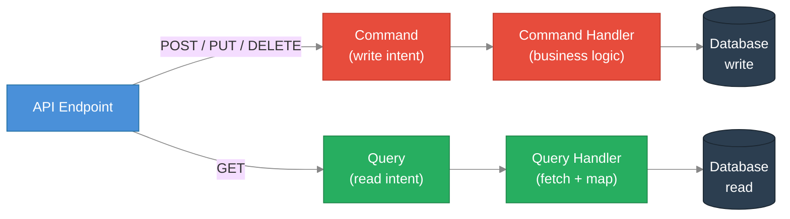
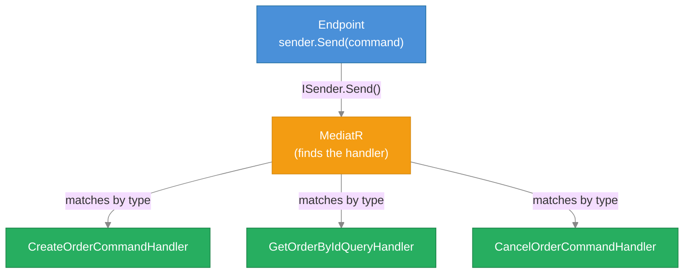
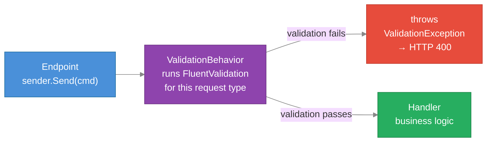
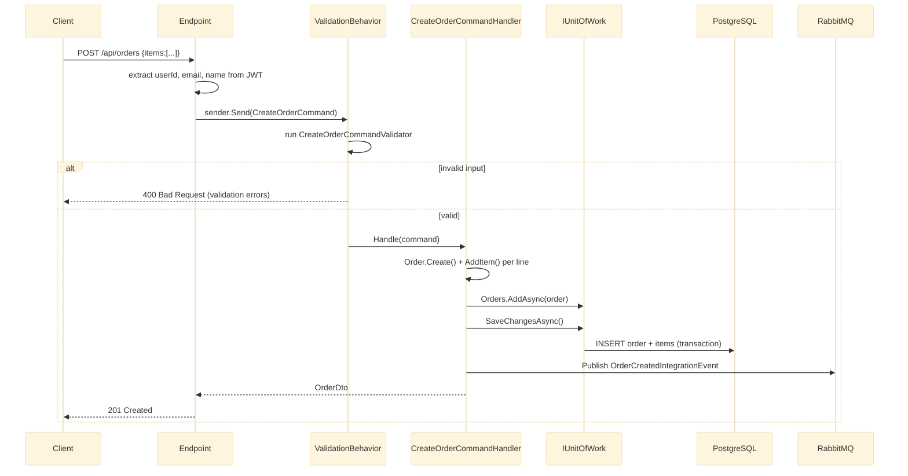

# ADR-010: CQRS and MediatR as the Internal Application Pattern

## Status
Accepted

---

## Context

Without a consistent pattern for organising business logic, each service endpoint becomes a dumping ground: HTTP parsing, validation, business rules, database calls, and event publishing all tangled together. This makes code:

- Hard to test — the database and HTTP context are inseparable from the logic
- Hard to read — a new developer has to mentally untangle four concerns at once
- Hard to extend — adding validation or logging means editing every endpoint
- Inconsistent — each developer organises code differently

AntKart needed one approach used uniformly across all REST services so that a developer familiar with one service can read any other.

---

## Decision

Apply **CQRS (Command Query Responsibility Segregation)** as the internal structure for all AntKart REST microservices, implemented with **MediatR 12.4.1**. Every operation that changes state is a *Command*; every operation that reads state is a *Query*. Endpoints dispatch commands/queries via MediatR and never contain business logic themselves.

---

## What is CQRS?

CQRS is based on a single principle: **reading data and changing data are fundamentally different operations**. They have different performance needs, different failure modes, and different complexity. Treating them the same leads to compromises in both directions.

CQRS splits every operation into one of two buckets:

| Bucket | Purpose | May change DB? | Returns |
|--------|---------|---------------|---------|
| **Command** | Do something — create, update, delete | Yes | DTO confirming what changed, or void |
| **Query** | Ask something — fetch, search, list | No | DTO or paged result |



A **Command** expresses *intent* — "create an order with these items". It never returns raw domain entities; it returns a DTO confirming what was done.

A **Query** expresses *what you want to know* — "give me orders for user X, page 2". It never modifies anything.

This separation makes each handler single-purpose and easy to reason about in isolation.

---

## What is MediatR?

MediatR is a .NET library that implements the **Mediator pattern**: instead of calling handlers directly (which creates direct coupling), you send a message to a mediator, and the mediator finds and calls the right handler.



The endpoint only knows about `ISender`. It does not know which handler exists or where it lives. MediatR resolves the handler from the DI container at runtime.

**Key types:**
- `IRequest<TResponse>` — marker interface for commands and queries
- `IRequestHandler<TRequest, TResponse>` — the handler implementing the business logic
- `ISender.Send(request)` — dispatches the request and returns the response

---

## The MediatR Pipeline (Behaviours)

The power of MediatR is not just dispatching. You can insert **pipeline behaviours** that wrap every request — running before and after the handler. AntKart uses this for **validation**:



`ValidationBehavior<TRequest, TResponse>` (in `AK.BuildingBlocks`) resolves all `IValidator<TRequest>` instances registered in DI, runs them, and throws `FluentValidation.ValidationException` if any fail. The handler only runs on valid input — it never needs to check for empty strings or negative numbers itself.

This means:
- Validation is **automatic** for every command/query that has a validator
- The handler is **always called with valid data**
- Adding a new validation rule means adding to the validator class — not touching the handler

---

## AntKart Implementation

### File layout (using AK.Order as example)

```
AK.Order.Application/
  Features/
    CreateOrder/
      CreateOrderCommand.cs          ← record implements IRequest<OrderDto>
      CreateOrderCommandHandler.cs   ← implements IRequestHandler<...>
      CreateOrderCommandValidator.cs ← FluentValidation AbstractValidator<...>
    GetOrderById/
      GetOrderByIdQuery.cs
      GetOrderByIdQueryHandler.cs
    UpdateOrderStatus/
      UpdateOrderStatusCommand.cs
      UpdateOrderStatusCommandHandler.cs
      UpdateOrderStatusCommandValidator.cs
    CancelOrder/
      CreateOrderCommand.cs
      CancelOrderCommandHandler.cs
```

Every feature is a self-contained folder. A new developer looking for "how does creating an order work?" goes to `Features/CreateOrder/` and reads three files — that is the entire feature.

### A Command in full

```csharp
// 1. The request — what the caller wants to do
public sealed record CreateOrderCommand(
    string UserId,
    string CustomerEmail,
    string CustomerName,
    IReadOnlyList<CreateOrderItemDto> Items) : IRequest<OrderDto>;

// 2. The validator — what "valid" means (runs automatically via pipeline)
public sealed class CreateOrderCommandValidator : AbstractValidator<CreateOrderCommand>
{
    public CreateOrderCommandValidator()
    {
        RuleFor(x => x.UserId).NotEmpty();
        RuleFor(x => x.Items).NotEmpty();
        RuleForEach(x => x.Items).ChildRules(item =>
        {
            item.RuleFor(i => i.ProductId).NotEmpty();
            item.RuleFor(i => i.Quantity).GreaterThan(0);
        });
    }
}

// 3. The handler — the actual business logic
public sealed class CreateOrderCommandHandler(IUnitOfWork unitOfWork, IPublishEndpoint bus)
    : IRequestHandler<CreateOrderCommand, OrderDto>
{
    public async Task<OrderDto> Handle(CreateOrderCommand cmd, CancellationToken ct)
    {
        var order = Order.Create(cmd.UserId, cmd.CustomerEmail, cmd.CustomerName);
        foreach (var item in cmd.Items)
            order.AddItem(item.ProductId, item.ProductName, item.Quantity, item.UnitPrice);

        await unitOfWork.Orders.AddAsync(order, ct);
        await unitOfWork.SaveChangesAsync(ct);
        await bus.Publish(new OrderCreatedIntegrationEvent(...), ct);
        return order.ToDto();
    }
}
```

### A Query in full

```csharp
// 1. The request
public sealed record GetOrderByIdQuery(Guid OrderId, string RequestingUserId)
    : IRequest<OrderDto?>;

// 2. The handler (no validator needed for a simple lookup)
public sealed class GetOrderByIdQueryHandler(IUnitOfWork unitOfWork)
    : IRequestHandler<GetOrderByIdQuery, OrderDto?>
{
    public async Task<OrderDto?> Handle(GetOrderByIdQuery query, CancellationToken ct)
    {
        var order = await unitOfWork.Orders.GetByIdAsync(query.OrderId, ct);
        if (order is null) throw new KeyNotFoundException($"Order {query.OrderId} not found");
        if (order.UserId != query.RequestingUserId) throw new UnauthorizedAccessException();
        return order.ToDto();
    }
}
```

### How an endpoint uses MediatR

```csharp
// API layer — thin, no business logic
group.MapPost("/", async (CreateOrderDto body, HttpContext http, ISender sender) =>
{
    var userId = http.GetUserId();
    var customerEmail = http.GetUserEmail();
    var customerName = http.GetUserDisplayName();

    var result = await sender.Send(new CreateOrderCommand(userId, customerEmail, customerName, body.Items));
    return Results.Created($"/api/orders/{result.Id}", result);
}).RequireAuthorization();
```

The endpoint extracts JWT claims, builds the command, calls `sender.Send()`, and maps the result to an HTTP response. That is all it does.

### End-to-end flow



### Registration

In each service's `Application/Extensions/ServiceCollectionExtensions.cs`:

```csharp
public static IServiceCollection AddApplication(this IServiceCollection services)
{
    services.AddMediatR(cfg =>
        cfg.RegisterServicesFromAssembly(typeof(ServiceCollectionExtensions).Assembly));

    services.AddValidatorsFromAssembly(typeof(ServiceCollectionExtensions).Assembly);

    // Wire the validation pipeline behaviour — runs before every handler
    services.AddTransient(typeof(IPipelineBehavior<,>), typeof(ValidationBehavior<,>));

    return services;
}
```

---

## Why CQRS?

| Problem without CQRS | How CQRS solves it |
|---------------------|-------------------|
| Logic and HTTP mixed in endpoint | Endpoint only builds the command; handler owns logic |
| Hard to test — need to spin up HTTP | Handler is a plain C# class; test it with `new` and a mock repository |
| Validation duplicated in every handler | `ValidationBehavior` runs automatically for every request that has a validator |
| No consistent structure across services | Every AntKart service uses the same Feature folder layout |
| Adding logging/tracing touches every handler | Add a pipeline behaviour once; it applies to all requests |

---

## Trade-offs

| Advantage | Disadvantage |
|-----------|-------------|
| Handlers are small and single-purpose | More files per feature (command + handler + validator = 3 files minimum) |
| Handler is trivially unit-testable | Slight indirection — a new developer must learn the MediatR dispatch pattern |
| Pipeline behaviours apply universally | Debugging requires understanding the behaviour chain, not just the handler |
| Consistent structure across all services | Overkill for truly trivial CRUD with no business rules |
| Commands and queries are self-documenting types | In-process only — does not replace async messaging between services |

CQRS here is **in-process** (within one service). It is not the distributed write/read model separation sometimes described in DDD literature. AntKart uses MassTransit + RabbitMQ for inter-service communication — MediatR is strictly for intra-service structure.

---

## Services using this pattern

All AntKart REST microservices:

| Service | Commands | Queries |
|---------|----------|---------|
| AK.Products | CreateProduct, UpdateProduct, DeleteProduct, BulkInsert, BulkUpdate, ReserveStock | GetProductById, GetProducts, GetProductCategories |
| AK.Discount | CreateDiscount, UpdateDiscount, DeleteDiscount | GetDiscountByProductId, GetAllDiscounts |
| AK.ShoppingCart | AddToCart, RemoveCartItem, UpdateCartItemQuantity, ClearCart | GetCart |
| AK.Order | CreateOrder, UpdateOrderStatus, CancelOrder | GetOrderById, GetOrders, GetUserOrders |
| AK.Payments | InitiatePayment, VerifyPayment, SaveCard, DeleteSavedCard | GetPaymentById, GetPaymentByOrderId, GetUserPayments, GetUserSavedCards |
| AK.Notification | SendNotification | GetUserNotifications, GetNotificationById, GetAllNotifications |
