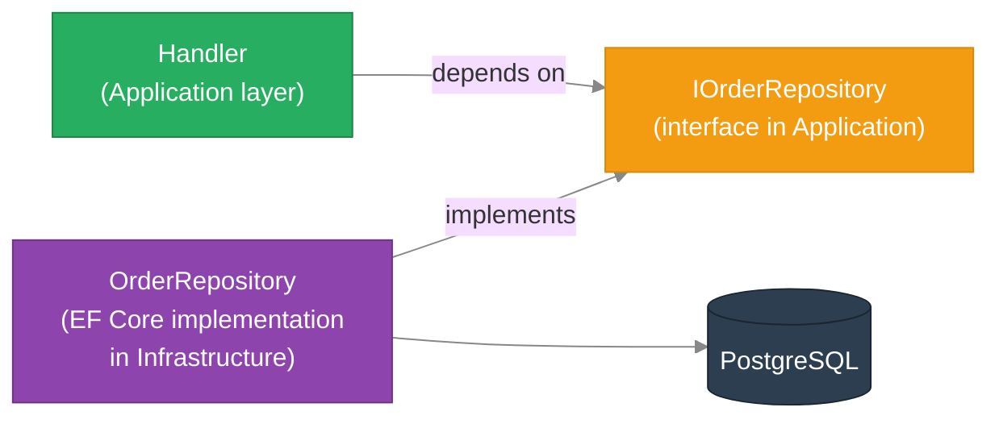
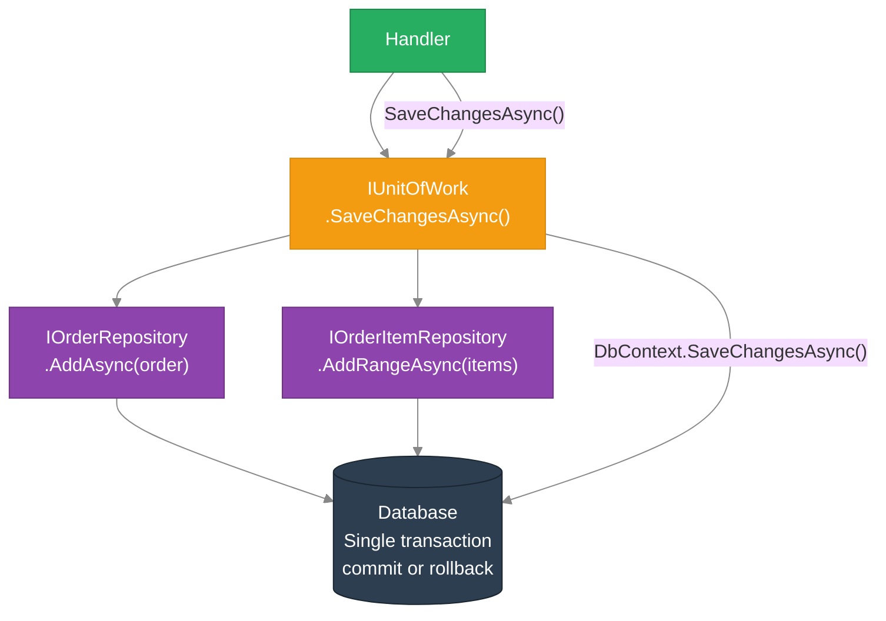
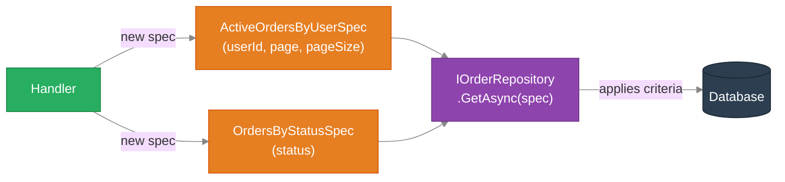
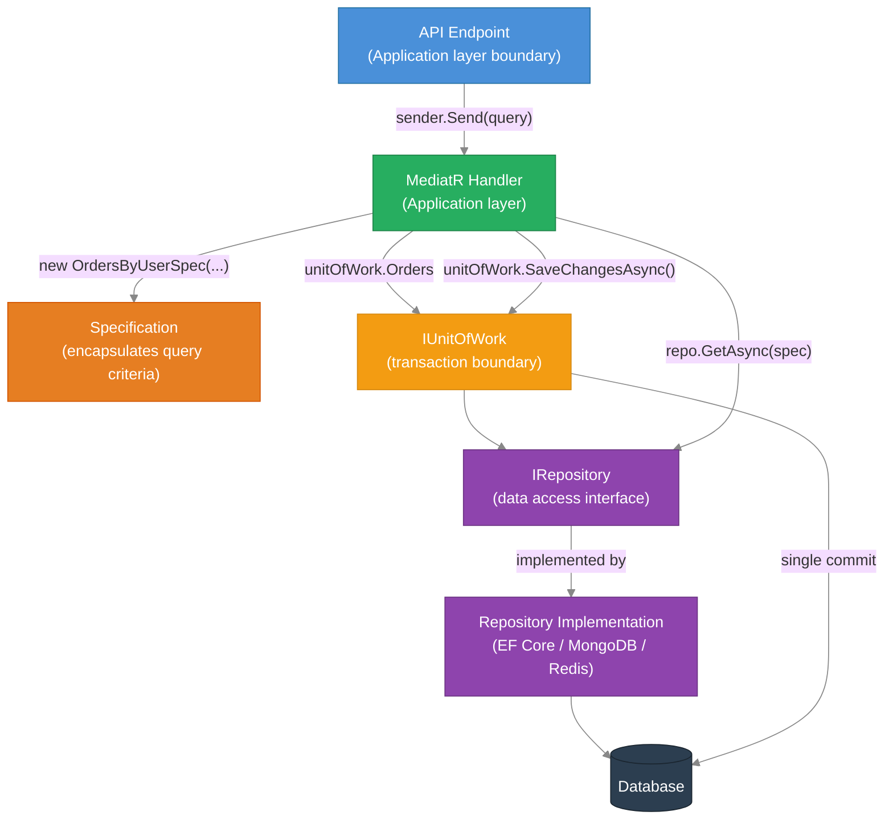

# ADR-011: Repository, Specification, and Unit of Work Patterns

## Status
Accepted

---

## Context

Business logic handlers need to load and persist domain objects. Without a standard approach, this leads to EF Core `DbContext` calls, raw LINQ, and SQL concerns spreading throughout application-layer handlers. Problems that follow:

- Handlers become coupled to a specific database technology — swapping MongoDB for PostgreSQL means rewriting handlers
- Complex query conditions (filter by status AND date AND user) are written inline, scattered, and duplicated across multiple handlers
- Saving multiple related objects requires the handler to manage transaction scope — infrastructure concerns leaking into business logic
- Unit testing handlers requires spinning up a real database because there is no interface to mock

AntKart needed a layered data access approach that keeps infrastructure out of the application layer, makes complex queries composable, and lets handlers be tested without a running database.

---

## Decision

Apply three complementary patterns across AntKart data access layers:

1. **Repository Pattern** — abstract all data access behind a typed interface per aggregate root
2. **Unit of Work Pattern** — provide a single transactional boundary that coordinates multiple repositories
3. **Specification Pattern** — encapsulate complex query criteria as composable, named, testable objects

---

## Pattern 1: Repository

### What problem does it solve?

Without the Repository pattern, a handler that needs an order does this:

```csharp
// BAD — handler knows about EF Core, DbContext, and LINQ
var order = await _dbContext.Orders
    .Include(o => o.Items)
    .FirstOrDefaultAsync(o => o.Id == id, ct);
```

This couples the handler to EF Core. Testing requires a real database or an in-memory EF provider. Switching databases means changing the handler.

### What is the Repository pattern?

A Repository is a **typed data access interface** for one aggregate root. The handler depends on the interface, not the concrete EF Core implementation.



The handler in the Application layer depends only on `IOrderRepository`. The Infrastructure layer provides `OrderRepository` that talks to the database. The DI container wires them together.

### AntKart Repository interface (AK.Order example)

```csharp
// Application/Interfaces/IOrderRepository.cs
public interface IOrderRepository
{
    Task<Order?> GetByIdAsync(Guid id, CancellationToken ct = default);
    Task<Order?> GetByOrderNumberAsync(string orderNumber, CancellationToken ct = default);
    Task<IReadOnlyList<Order>> GetByUserIdAsync(string userId, int page, int pageSize, CancellationToken ct = default);
    Task<PagedResult<Order>> GetAllAsync(int page, int pageSize, CancellationToken ct = default);
    Task AddAsync(Order order, CancellationToken ct = default);
    Task UpdateAsync(Order order, CancellationToken ct = default);
    Task<int> CountAsync(CancellationToken ct = default);
}
```

The handler never knows whether data comes from PostgreSQL, an in-memory store, or a test double.

### Unit testing with a mocked repository

```csharp
// In a test — no database needed
var mockRepo = new Mock<IOrderRepository>();
mockRepo.Setup(r => r.GetByIdAsync(orderId, default))
        .ReturnsAsync(TestDataFactory.CreateOrder(orderId));

var handler = new GetOrderByIdQueryHandler(mockRepo.Object);
var result = await handler.Handle(new GetOrderByIdQuery(orderId, userId), default);

result.Should().NotBeNull();
result.Id.Should().Be(orderId);
```

---

## Pattern 2: Unit of Work

### What problem does it solve?

When a handler needs to save changes across multiple repositories, who controls the transaction? If each repository calls `SaveChanges()` independently:

- A failure midway leaves the database in a partial state
- Multiple round-trips to the database instead of one
- The handler has to know which repositories need flushing and in what order

### What is the Unit of Work pattern?

Unit of Work (UoW) wraps a set of repositories that share a single database transaction. The handler uses the repositories to make changes, then calls `SaveChangesAsync()` once on the UoW — all changes commit atomically or roll back together.



### AntKart Unit of Work interface

```csharp
// Application/Interfaces/IUnitOfWork.cs
public interface IUnitOfWork
{
    IOrderRepository Orders { get; }
    Task<int> SaveChangesAsync(CancellationToken ct = default);
}
```

The Infrastructure implementation:

```csharp
// Infrastructure/Persistence/UnitOfWork.cs
public sealed class UnitOfWork(OrderDbContext context) : IUnitOfWork
{
    public IOrderRepository Orders { get; } = new OrderRepository(context);

    public Task<int> SaveChangesAsync(CancellationToken ct = default)
        => context.SaveChangesAsync(ct);
}
```

### Handler using Unit of Work

```csharp
public sealed class CreateOrderCommandHandler(IUnitOfWork unitOfWork)
    : IRequestHandler<CreateOrderCommand, OrderDto>
{
    public async Task<OrderDto> Handle(CreateOrderCommand cmd, CancellationToken ct)
    {
        var order = Order.Create(cmd.UserId, cmd.CustomerEmail, cmd.CustomerName);
        foreach (var item in cmd.Items)
            order.AddItem(item.ProductId, item.ProductName, item.Quantity, item.UnitPrice);

        await unitOfWork.Orders.AddAsync(order, ct);  // stages the INSERT
        await unitOfWork.SaveChangesAsync(ct);         // single commit — all or nothing
        return order.ToDto();
    }
}
```

---

## Pattern 3: Specification

### What problem does it solve?

Complex query conditions written inline in handlers or repositories become:

- Duplicated across handlers ("active orders for user X" appears in 3 places)
- Untestable in isolation (the full query must run against a database)
- Unreadable — a long LINQ chain is not self-documenting

```csharp
// BAD — inline, duplicated, hard to name
var orders = await context.Orders
    .Where(o => o.UserId == userId
             && o.Status != OrderStatus.Cancelled
             && o.CreatedAt >= DateTime.UtcNow.AddDays(-30))
    .OrderByDescending(o => o.CreatedAt)
    .Skip((page - 1) * pageSize)
    .Take(pageSize)
    .ToListAsync(ct);
```

### What is the Specification pattern?

A Specification encapsulates a query criterion as a **named, reusable object**. The repository accepts a specification and applies it — the query logic lives in one place, has a meaningful name, and can be tested independently of the database.



### AntKart Specification base class

```csharp
// Application/Specifications/BaseSpecification.cs
public abstract class BaseSpecification<T>
{
    public Expression<Func<T, bool>>? Criteria { get; protected set; }
    public List<Expression<Func<T, object>>> Includes { get; } = [];
    public Expression<Func<T, object>>? OrderBy { get; protected set; }
    public Expression<Func<T, object>>? OrderByDescending { get; protected set; }
    public int? Take { get; protected set; }
    public int? Skip { get; protected set; }
    public bool IsPagingEnabled { get; protected set; }

    protected void ApplyPaging(int page, int pageSize)
    {
        Skip = (page - 1) * pageSize;
        Take = pageSize;
        IsPagingEnabled = true;
    }
}
```

### A concrete specification (AK.Order)

```csharp
// Application/Specifications/OrdersByUserSpecification.cs
public sealed class OrdersByUserSpecification : BaseSpecification<Order>
{
    public OrdersByUserSpecification(string userId, int page, int pageSize)
    {
        Criteria = o => o.UserId == userId;
        OrderByDescending = o => o.CreatedAt;
        ApplyPaging(page, pageSize);
    }
}
```

```csharp
// Application/Specifications/OrdersByStatusSpecification.cs
public sealed class OrdersByStatusSpecification : BaseSpecification<Order>
{
    public OrdersByStatusSpecification(OrderStatus status, int page, int pageSize)
    {
        Criteria = o => o.Status == status;
        OrderByDescending = o => o.CreatedAt;
        ApplyPaging(page, pageSize);
    }
}
```

### Repository applying the specification

```csharp
// Infrastructure/Persistence/Repositories/OrderRepository.cs
public async Task<IReadOnlyList<Order>> GetAsync(BaseSpecification<Order> spec, CancellationToken ct)
{
    var query = _context.Orders.AsQueryable();

    if (spec.Criteria is not null)
        query = query.Where(spec.Criteria);

    foreach (var include in spec.Includes)
        query = query.Include(include);

    if (spec.OrderByDescending is not null)
        query = query.OrderByDescending(spec.OrderByDescending);
    else if (spec.OrderBy is not null)
        query = query.OrderBy(spec.OrderBy);

    if (spec.IsPagingEnabled)
        query = query.Skip(spec.Skip!.Value).Take(spec.Take!.Value);

    return await query.ToListAsync(ct);
}
```

### Handler using a specification

```csharp
public sealed class GetUserOrdersQueryHandler(IUnitOfWork unitOfWork)
    : IRequestHandler<GetUserOrdersQuery, PagedResult<OrderDto>>
{
    public async Task<PagedResult<OrderDto>> Handle(GetUserOrdersQuery query, CancellationToken ct)
    {
        var spec = new OrdersByUserSpecification(query.UserId, query.Page, query.PageSize);
        var orders = await unitOfWork.Orders.GetAsync(spec, ct);
        var total = await unitOfWork.Orders.CountAsync(query.UserId, ct);
        return PagedResult<OrderDto>.Create(orders.Select(o => o.ToDto()), total, query.Page, query.PageSize);
    }
}
```

---

## How all three patterns work together



**Layer responsibilities:**
- **Endpoint** — HTTP parsing, JWT claims extraction, dispatch via MediatR
- **Handler** — business logic, builds specifications, delegates to UoW
- **Specification** — named, composable query criteria (no DB knowledge)
- **IUnitOfWork / IRepository** — interfaces defined in Application layer (no DB knowledge)
- **Repository Implementation** — EF Core / MongoDB / Redis queries (Infrastructure layer)

---

## Why these three patterns together?

| Without the patterns | With the patterns |
|---------------------|------------------|
| Handlers import `DbContext` directly | Handlers depend on `IUnitOfWork` — zero DB coupling |
| Inline LINQ duplicated across handlers | Specification classes are named, reused, tested once |
| No transaction boundary — partial saves possible | `SaveChangesAsync()` commits everything atomically |
| Unit testing handlers requires a database | Mock `IUnitOfWork` with Moq — no database needed |
| Query complexity grows unbounded in handlers | Specification encapsulates and names the complexity |
| Changing from EF Core to Dapper touches all handlers | Only the Repository implementation changes |

---

## Trade-offs

| Advantage | Disadvantage |
|-----------|-------------|
| Handlers are fully unit-testable without a database | Extra files and interfaces for simple CRUD |
| Complex queries have names and live in one place | Specification base class must be maintained |
| Single transaction boundary — atomicity guaranteed | UoW adds one layer of indirection over DbContext |
| Infrastructure can be swapped without touching application logic | For trivial services, this is over-engineering |
| Specifications are composable and independently testable | Developers unfamiliar with the pattern need onboarding |

For AntKart, the benefits outweigh the cost: business logic across Order, Payments, and Notification is complex enough that testability and clean separation pay dividends quickly.

---

## Implementation Matrix

| Service | Repository | Unit of Work | Specification |
|---------|-----------|-------------|--------------|
| AK.Products | `IProductRepository` | `IUnitOfWork` | `ProductsByCategorySpec`, `ProductByIdSpec` |
| AK.Discount | `ICouponRepository` | — (single repo, direct SaveChanges) | — |
| AK.ShoppingCart | `ICartRepository` | `IUnitOfWork` | — |
| AK.Order | `IOrderRepository` | `IUnitOfWork` | `OrdersByUserSpec`, `OrdersByStatusSpec`, `OrderByIdWithItemsSpec` |
| AK.Payments | `IPaymentRepository`, `ISavedCardRepository` | `IUnitOfWork` | — |
| AK.Notification | `INotificationRepository` | `IUnitOfWork` | — |

**Specification pattern** is applied where query criteria are complex or likely to be reused across multiple handlers: AK.Products (category + sub-category filtering, text search) and AK.Order (filter by user, status, date range with paging). Services with simpler data access (ShoppingCart reads a single key from Redis; Payments looks up by OrderId) do not need specifications.
