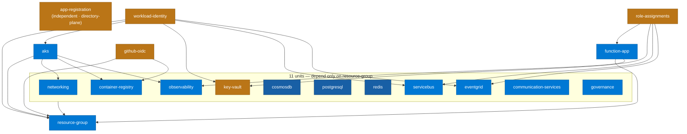

# 06 · Terragrunt unit dependency graph

> **Question:** In what order do the infrastructure units apply, and what does each depend on?

Arrows read **"depends on"** — the target applies first. Drawn from the real `dependency` blocks in `infrastructure/environments/dev/*/terragrunt.hcl`.

## What to notice

- **18 live units, not 19.** `environments/dev` currently holds **18** unit folders (the [Diagram Plan](../DIAGRAM-PLAN.md) says 19 — off by one; the extra is the state-backend bootstrap, which is an `az` step, not a Terragrunt unit).
- **`resource-group` is the root** — everything except `app-registration` traces back to it; **11 units depend on it alone** and nothing else.
- **`app-registration` is independent** — it manages a directory object via the `azuread` provider, not a resource-group resource.
- **Two composite tails carry the interesting order:** `role-assignments` waits on `function-app` + `key-vault` + `servicebus` + `eventgrid`; `workload-identity` waits on `aks` (for its OIDC issuer) + `key-vault` + `servicebus` + `eventgrid`.
- This exceeds the ~15-node guideline because a *complete* dependency graph must show every unit; the 11 resource-group-only units are grouped to keep it legible.
