# 07 · Network & traffic path

> **Question:** How does a request physically reach a service, and where is TLS terminated?

The real path today, plus Azure API Management shown as the **planned** edge (not yet provisioned).

```mermaid
flowchart LR
    User["Client / Browser"]:::external
    DNS["GoDaddy DNS<br/>api.antkart.in A record"]:::external
    IP["Ingress LoadBalancer<br/>public IP 20.246.197.150"]:::edge
    NGINX["ingress-nginx controller"]:::edge
    TLS["TLS termination<br/>cert-manager · secret ak-gateway-tls<br/>Let's Encrypt prod"]:::edge
    GW["AK.Gateway · Ocelot"]:::service
    APIM["Azure API Management<br/>planned edge"]:::edge
    GAP["Not yet provisioned (ADR-020)"]:::issue

    subgraph ROUTES["Ocelot /gateway routes"]
        P["products to ak-products"]:::service
        C["cart to ak-cart"]:::service
        O["orders to ak-order"]:::service
        PAY["payments to ak-payments"]:::service
        H["health/* to each service"]:::service
    end

    User --> DNS --> IP --> NGINX --> TLS --> GW --> ROUTES
    User -. "planned" .-> APIM -. "planned" .-> IP
    GAP -.-> APIM

    classDef external fill:#B4B2A9,stroke:#7A7870,color:#111,stroke-dasharray:4 3;
    classDef service fill:#1D9E75,stroke:#14795A,color:#FFF;
    classDef paas fill:#0078D4,stroke:#005A9E,color:#FFF;
    classDef datastore fill:#185FA5,stroke:#0F3F6E,color:#FFF;
    classDef identity fill:#BA7517,stroke:#8A560F,color:#FFF;
    classDef edge fill:#7F77DD,stroke:#5B52B8,color:#FFF;
    classDef cicd fill:#639922,stroke:#496F18,color:#FFF;
    classDef issue fill:none,stroke:#E24B4A,color:#E24B4A,stroke-dasharray:5 4;
```

## What to notice

- **DNS is external and manual:** a GoDaddy **A record** maps `api.antkart.in` to the ingress LoadBalancer's public IP `20.246.197.150` — not Azure DNS.
- **TLS terminates at the cluster edge:** `ingress-nginx` + `cert-manager` (secret `ak-gateway-tls`, Let's Encrypt **production**), not at the service.
- **One public entry point:** everything enters through `AK.Gateway`; its Ocelot routes fan out to the internal services (`/gateway/products|cart|orders|payments` and `/gateway/health/*`).
- **APIM is planned, not live:** the dashed `APIM` path and the red-dashed gap annotation mark ADR-020's managed edge as **not yet provisioned** — today traffic goes DNS → IP directly.
