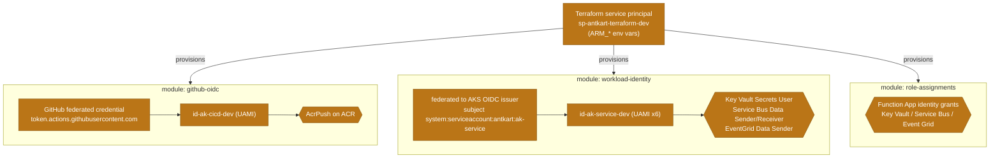

# 08 · Identity & trust chain

> **Question:** How does trust flow from provisioning to runtime, secret-lessly?

From the Terraform service principal, through the real Terraform modules, to the identities and grants they create.

## What to notice

- **One provisioning identity:** the `sp-antkart-terraform-dev` service principal (authenticated via `ARM_*` env vars) creates all three identity modules; it is the only credential-bearing principal, and it lives outside the running platform.
- **CI/CD gets exactly one privilege:** `github-oidc` mints `id-ak-cicd-dev` with **AcrPush only** — it can push images, nothing else, and holds no secret (GitHub OIDC federation).
- **Runtime is per-service and least-privilege:** `workload-identity` creates six `id-ak-<service>-dev` UAMIs, each federated to the **AKS OIDC issuer** for its own ServiceAccount subject, granted only the data-plane roles it needs.
- **The Function App is separate:** `role-assignments` grants the Function App's identity its Key Vault / Service Bus / Event Grid roles — a distinct path from the six cluster services.
- **No stored secrets anywhere in the chain** — every arrow is a federation or an RBAC grant, not a key hand-off.
