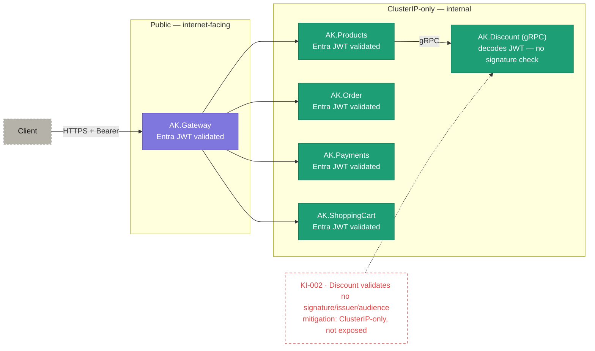

# 09 · Security posture & trust boundaries

> **Question:** What is exposed vs internal, and where do the known gaps sit?

## What to notice

- **Exactly one thing is public:** only `AK.Gateway` is internet-facing (behind the ingress); the five backing services are **ClusterIP-only** and unreachable from outside the cluster.
- **Defence in depth on tokens:** the Entra bearer token is validated at the gateway **and again** inside each REST service — the gateway is not a trust boundary the services rely on.
- **KI-002 (red):** `AK.Discount` (gRPC) **decodes** the JWT but does **not** verify signature, issuer, audience, or expiry — a real gap, drawn as a red-dashed annotation.
- **Why KI-002 is only Medium today:** Discount is ClusterIP-only and reached solely by `AK.Products` over cluster DNS, so the weak check is not externally reachable — the mitigation, not a fix.
