# 10 · APIM edge & two-gateway model (target state)

> **Question:** What does the managed edge do before traffic reaches the cluster ingress?

**Target state per [ADR-020](../../adr/ADR-020-api-management-managed-edge-gateway.md) — Azure API Management is NOT yet provisioned.**

```mermaid
flowchart LR
    Client["Client"]:::external

    subgraph TARGET["Target state — ADR-020 · not yet provisioned"]
        APIM["Azure API Management<br/>managed edge (gateway 1)"]:::edge
        subgraph POLICY["APIM policy chain"]
            TLSP["TLS termination"]:::edge
            JWTP{{"validate-jwt · Entra"}}:::identity
            RL["rate-limit / quota"]:::edge
            SUB["subscription key / product"]:::edge
            XFORM["request/response transform"]:::edge
        end
    end

    ING["ingress-nginx<br/>internal cluster ingress"]:::edge
    GW["AK.Gateway · Ocelot (gateway 2)<br/>JWT re-validated — defence in depth"]:::service
    GAP["APIM not provisioned — target state"]:::issue

    Client --> APIM --> TLSP --> JWTP --> RL --> SUB --> XFORM --> ING --> GW
    GAP -.-> APIM

    classDef external fill:#B4B2A9,stroke:#7A7870,color:#111,stroke-dasharray:4 3;
    classDef service fill:#1D9E75,stroke:#14795A,color:#FFF;
    classDef paas fill:#0078D4,stroke:#005A9E,color:#FFF;
    classDef datastore fill:#185FA5,stroke:#0F3F6E,color:#FFF;
    classDef identity fill:#BA7517,stroke:#8A560F,color:#FFF;
    classDef edge fill:#7F77DD,stroke:#5B52B8,color:#FFF;
    classDef cicd fill:#639922,stroke:#496F18,color:#FFF;
    classDef issue fill:none,stroke:#E24B4A,color:#E24B4A,stroke-dasharray:5 4;
```

## What to notice

- **This is a plan, not the running system** — the red-dashed gap marks APIM as **not provisioned**; today traffic goes straight to `ingress-nginx` (see diagram 07).
- **Two gateways, sequenced not competing:** APIM (the managed **edge**) sits in front of the cluster's internal ingress + `AK.Gateway` (the **routing** gateway) — layered, per ADR-020.
- **The edge owns cross-cutting concerns:** TLS termination, `validate-jwt`, rate-limit/quota, subscription keys/products, and request/response transformation move to APIM's policy chain.
- **In-service JWT validation stays:** `AK.Gateway` (and each service) **re-validates** the token — APIM is added in front, not trusted in place of, the existing checks.
