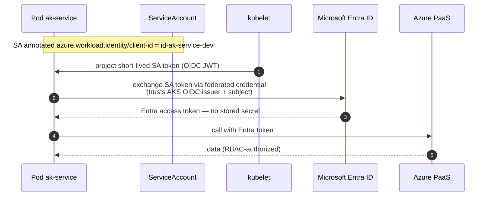

# 12 · Workload identity token flow

> **Question:** How does a pod get an Entra token with no stored secret?

A sequence — so this diagram is a `sequenceDiagram` and, unlike the flowcharts in this set, does not carry the shared `classDef` block (Mermaid sequence diagrams don't support it). Participants are named by their role in the visual language instead.

## What to notice

- **The ServiceAccount annotation is the anchor:** `azure.workload.identity/client-id` on the pod's ServiceAccount ties it to a specific `id-ak-<service>-dev` managed identity.
- **The projected token is short-lived** and is a Kubernetes-issued OIDC JWT — never a long-lived Azure credential.
- **Entra does the exchange, not the app:** the federated credential (created by the `workload-identity` module) trusts the **AKS OIDC issuer** for the pod's exact subject, and only then returns an Entra access token.
- **Nothing is stored:** no client secret, connection string, or key sits in the pod — this is what `DefaultAzureCredential` resolves to in-cluster.
- The returned token is RBAC-scoped to the roles that identity holds (see diagram 08).
