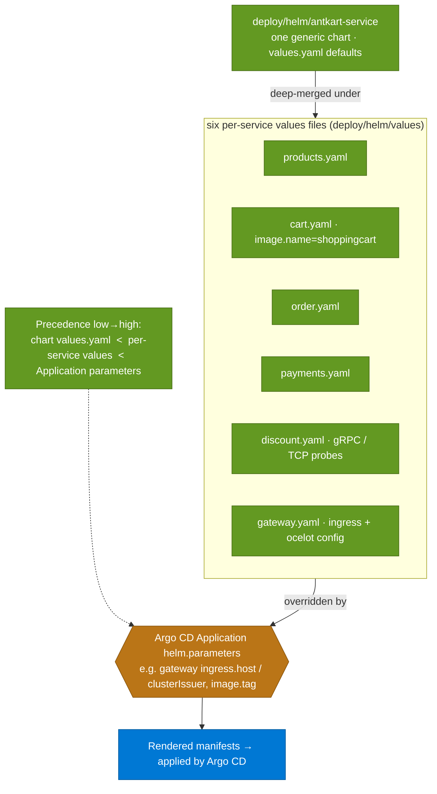

# 13 · Helm chart & values precedence

> **Question:** How does one generic chart become six services, and which values win?

## What to notice

- **One chart, six releases:** every service instantiates the *same* `antkart-service` chart — there is no per-service chart to keep in step.
- **Precedence is three-layer, low→high:** chart `values.yaml` defaults, then the per-service values file, then the Argo CD Application's `helm.parameters` win last.
- **The special cases live in the values files:** `cart.yaml` overrides `image.name` to `shoppingcart`; `discount.yaml` selects TCP probes for its h2c gRPC port; `gateway.yaml` carries the ingress + Ocelot config.
- **The gateway's environment-specific bits are parameters, not values:** `ingress.host` (`api.antkart.in`) and `clusterIssuer` come in as Application parameters, so Git — via Argo CD — is authoritative and self-heal can't revert them.
