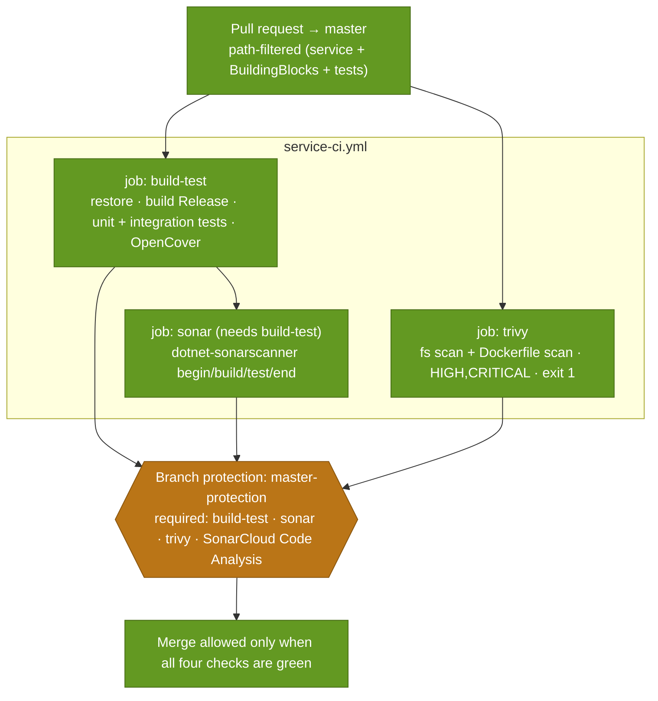

# 14 · CI pipeline

> **Question:** What runs on a pull request, and what gates the merge?

Drawn from the real `*-ci.yml` workflows (e.g. `.github/workflows/products-ci.yml`).

## What to notice

- **Three jobs, real names:** `build-test`, `sonar`, `trivy` — exactly the job names in the workflow.
- **`sonar` depends on `build-test`** (`needs:`), so analysis is not spent on a commit that doesn't compile; `trivy` runs in parallel.
- **Four required checks, not three:** the `master-protection` ruleset requires `build-test`, `sonar`, `trivy`, **and** `SonarCloud Code Analysis` (SonarCloud's own PR quality-gate status).
- **CI is a pure gate:** it builds and tests but pushes no image and touches no cluster — delivery is the CD workflow (diagram 15).
- **Path filters keep it per-service:** a PR touching only one service runs only that service's CI.
