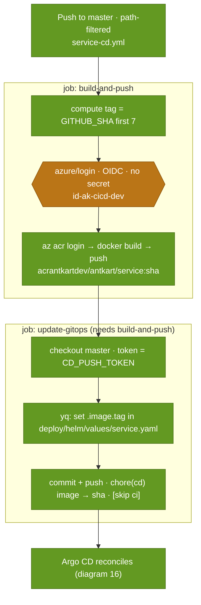

# 15 · CD pipeline

> **Question:** What happens on merge — build, push, tag-bump — and with what identity?

Drawn from the real `*-cd.yml` workflows (e.g. `.github/workflows/products-cd.yml`).

## What to notice

- **Secret-less Azure auth:** `azure/login` uses OIDC federated with `id-ak-cicd-dev` (repo *variables*, not secrets) — the only Azure privilege is AcrPush.
- **Immutable tag:** the image is tagged with the **short commit SHA**, so a tag always means exactly one build.
- **Delivery is a Git commit, not a deploy:** job 2 bumps `.image.tag` in the service's values file and pushes — no `helm`/`kubectl`, no cluster credentials.
- **The push needs a PAT:** `update-gitops` checks out with `CD_PUSH_TOKEN` (the github-actions bot isn't a bypass actor), and the commit carries `[skip ci]`.
- **Loop-safe:** the tag-bump touches only `deploy/helm/values/**`, which is outside CD's path filter, so it can't retrigger CD.
