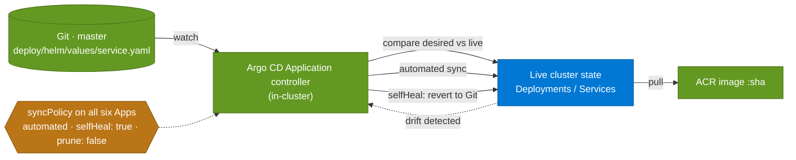

# 16 · GitOps reconciliation loop

> **Question:** How does a Git change become a running pod via Argo CD?

## What to notice

- **Pull, not push:** Argo CD runs *inside* the cluster and watches Git — nothing outside the cluster deploys, and CD holds no cluster credentials.
- **Auto-sync closes the loop:** with `automated` on, the CD tag-bump commit (diagram 15) deploys hands-free — no manual sync.
- **Self-heal makes Git authoritative:** live drift (a manual `kubectl edit`) is reverted back to Git; the sync policy is declared in Git on all six Applications.
- **Prune is off by design (`prune: false`):** Argo won't delete resources that disappear from Git — a conservative default recorded in the manifests.
- **The image is pulled by tag:** the Deployment references `:sha`, so the new pod runs exactly the image the commit named.
