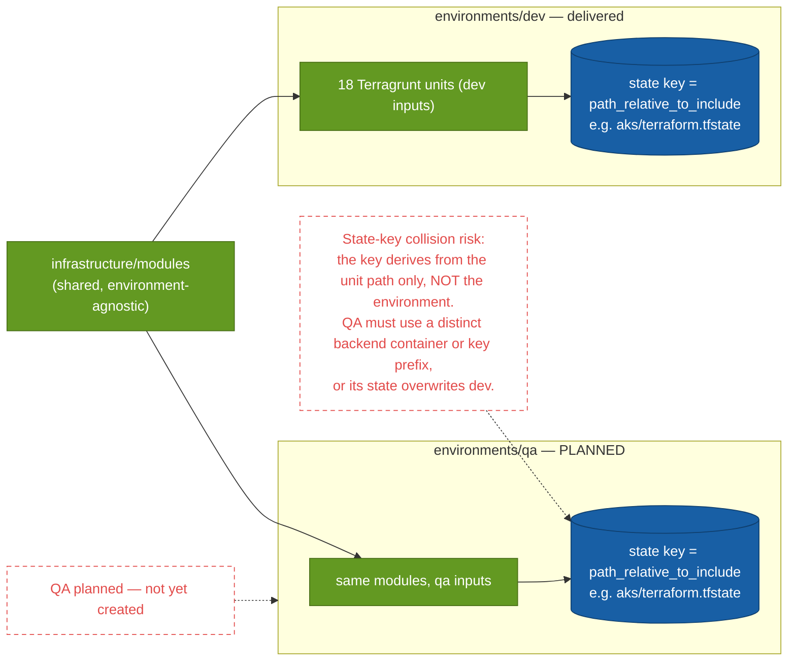

# 17 · Environment promotion — dev vs QA

> **Question:** How does a change move from dev to QA, and what differs between them?

**QA does not exist yet — `environments/qa` is planned.** This shows the state-isolation concern it must solve.

## What to notice

- **Modules are shared, environments differ only by inputs:** promotion means a second `environments/qa` tree that reuses `infrastructure/modules` with QA-specific inputs — not copied module code.
- **The state key is the risk (red):** `root.hcl` derives the backend key from `path_relative_to_include()` — the **unit path only**, with no environment segment. A QA tree using the same backend container would produce identical keys (`aks/terraform.tfstate`, …) and **overwrite dev state**.
- **The fix QA must adopt:** a distinct backend `container_name` or a per-environment key prefix, so dev and QA state can never collide.
- **QA is planned, not built** — both the QA subgraph and the risk are drawn as red-dashed to keep that explicit.
