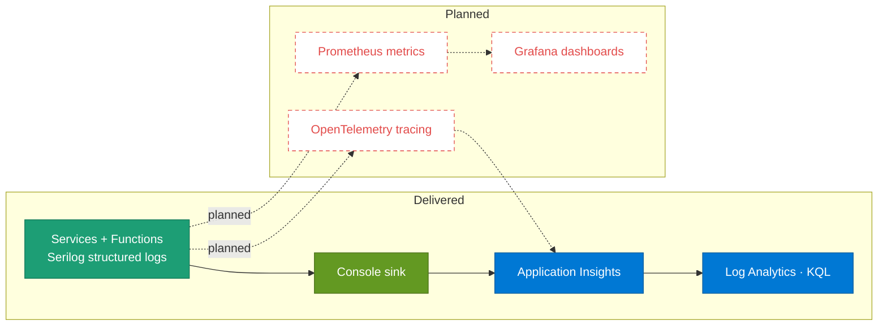

# 18 · Observability pipeline

> **Question:** How do logs, metrics, and traces flow to their sinks and dashboards?

Delivered today: Serilog → Console → Application Insights / Log Analytics. Metrics and tracing are **planned**.

## What to notice

- **Logging is delivered:** every service and Function emits **Serilog** structured logs to the **Console**, collected in the cloud by **Application Insights / Log Analytics** and queried with **KQL** — no code-side sink credentials.
- **No Elasticsearch/Kibana:** the console stream is the transport; the collector is Azure Monitor, not an ELK stack.
- **Tracing and metrics are planned (red):** OpenTelemetry tracing, Prometheus metrics, and Grafana dashboards are **not** wired yet — drawn as red-dashed planned nodes.
- **Two prospective sinks:** planned traces would flow to Application Insights alongside logs; planned metrics would flow Prometheus → Grafana.
