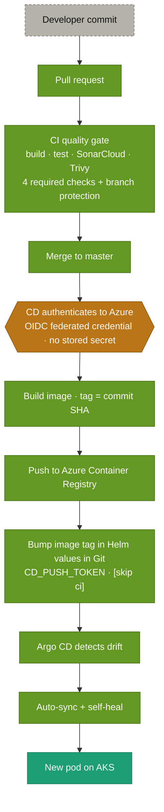

# 19 · Delivery architecture — commit to running pod

> **Question:** How does a commit become a running pod?

The end-to-end overview — composing diagrams 14 (CI), 15 (CD), and 16 (GitOps) into one ten-second picture. Detail lives in those three.

## What to notice

- **One straight line, three concerns:** the pull-request **gate** (diagram 14), the merge-triggered **delivery** (diagram 15), and the in-cluster **reconciliation** (diagram 16) chain into a single path — nothing branches.
- **The gate is real:** merge is blocked until four required checks pass under branch protection (build-test, sonar, trivy, SonarCloud Code Analysis) — see diagram 14.
- **Secret-less and immutable:** CD authenticates by OIDC federated credential (no stored secret) and tags the image with the commit SHA — see diagram 15.
- **Delivery is a Git commit, not a push to the cluster:** CD bumps the image tag in the Helm values with `CD_PUSH_TOKEN` and `[skip ci]`; Argo CD then detects drift and auto-syncs with self-heal — see diagram 16.
- **Proven for all six services, hands-free** — a commit reaches a running pod with no manual step.
