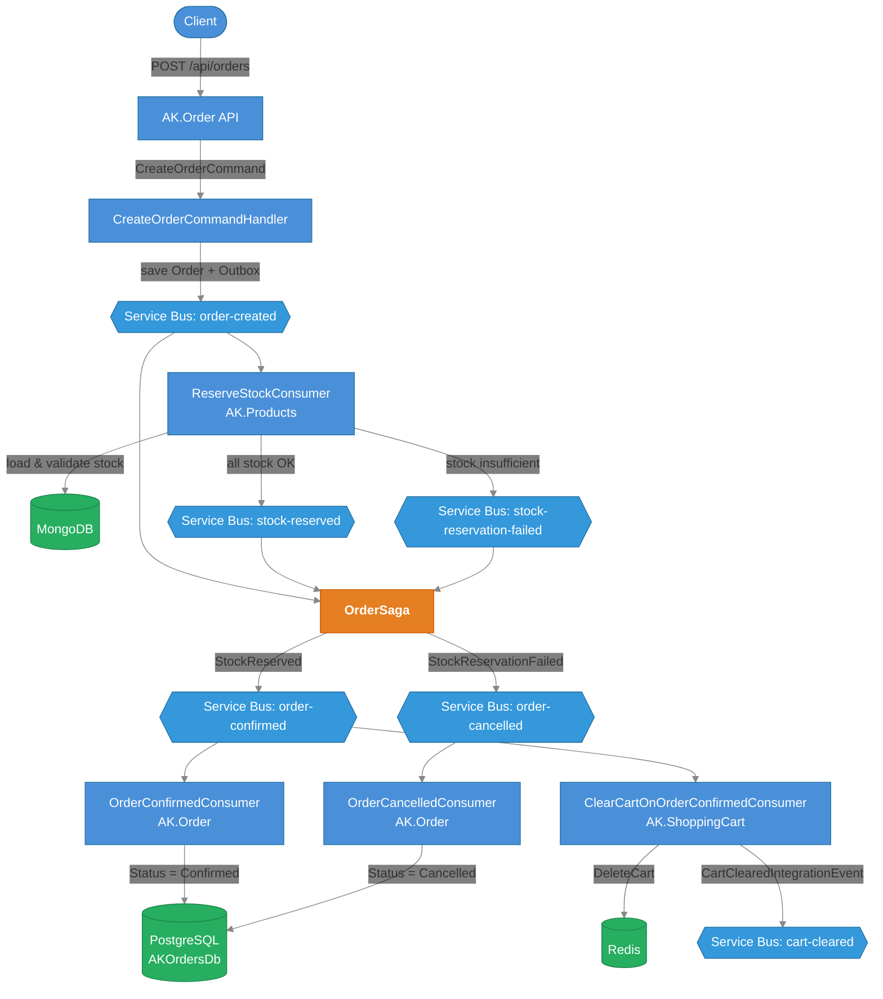
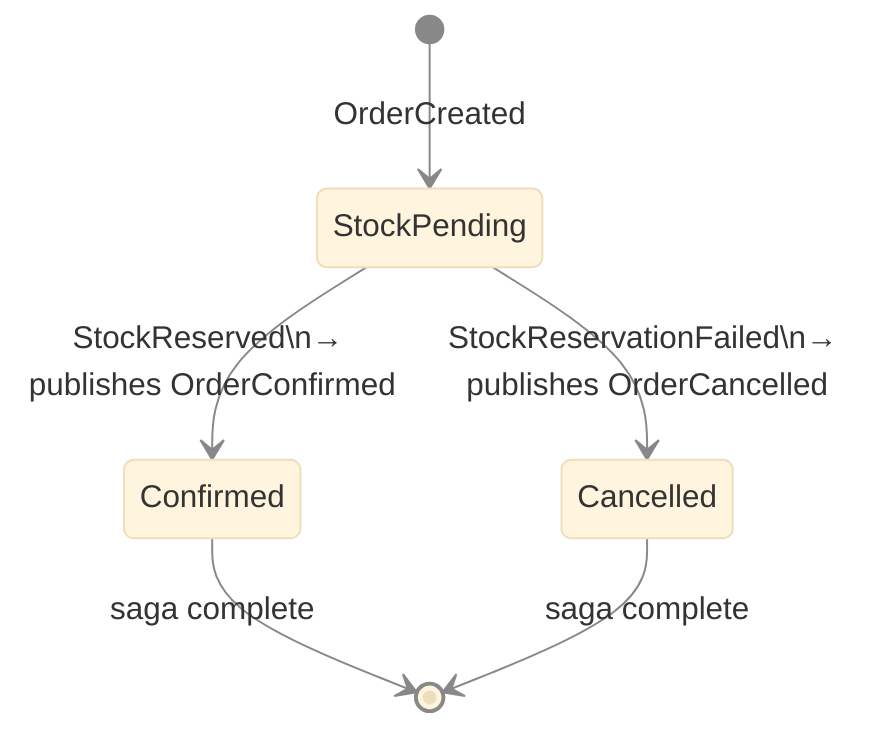
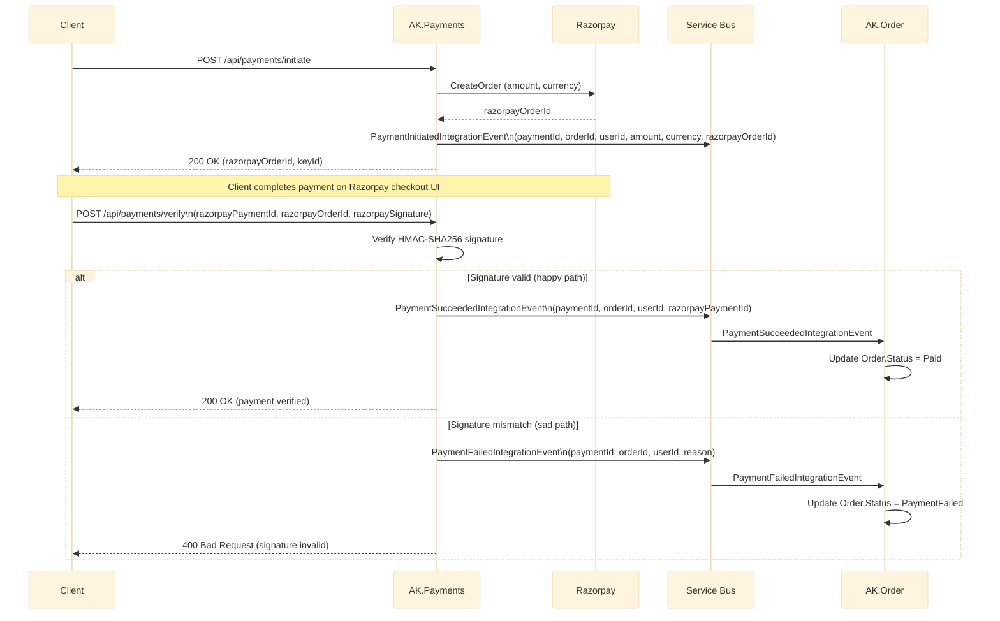

# AntKart — Event Bus Technical Design

## Overview

Async communication between microservices uses **MassTransit 8.3.6** over **Azure Service Bus** as the transport. The order flow implements a **SAGA choreography pattern** with an **EF Core Outbox** to guarantee at-least-once delivery and prevent dual-write problems.

MassTransit keeps the consumers and saga **transport-agnostic** — they are written against MassTransit's API, so the move from a self-hosted broker to Service Bus changed only the bus configuration. The service connects to Service Bus with **Microsoft Entra authentication** (`DefaultAzureCredential`) against the namespace's fully-qualified hostname — there is no connection string or SAS key. The Service Bus **topology is owned by infrastructure-as-code** (see [Service Bus Topology & Observability](#service-bus-topology--observability)).

---

## Event Flow



---

## Integration Events (AK.BuildingBlocks)

| Event | Publisher | Subscribers |
|-------|-----------|-------------|
| `OrderCreatedIntegrationEvent` | AK.Order (handler) | AK.Order (OrderSaga) |
| `StockReservedIntegrationEvent` | AK.Products | AK.Order (OrderSaga) |
| `StockReservationFailedIntegrationEvent` | AK.Products | AK.Order (OrderSaga) |
| `OrderConfirmedIntegrationEvent` | AK.Order (OrderSaga) | AK.Order (consumer), AK.ShoppingCart (consumer) |
| `OrderCancelledIntegrationEvent` | AK.Order (OrderSaga) | AK.Order (consumer) |
| `CartClearedIntegrationEvent` | AK.ShoppingCart | — |
| `PaymentInitiatedIntegrationEvent` | AK.Payments | — |
| `PaymentSucceededIntegrationEvent` | AK.Payments | AK.Order (updates status → Paid) |
| `PaymentFailedIntegrationEvent` | AK.Payments | AK.Order (updates status → PaymentFailed) |

All events implement `IIntegrationEvent` and are `sealed record` types in `AK.BuildingBlocks/Messaging/IntegrationEvents/`.

**Payment event payloads:**

| Event | Fields |
|-------|--------|
| `PaymentInitiatedIntegrationEvent` | `paymentId`, `orderId`, `userId`, `amount`, `currency`, `razorpayOrderId` |
| `PaymentSucceededIntegrationEvent` | `paymentId`, `orderId`, `userId`, `razorpayPaymentId` |
| `PaymentFailedIntegrationEvent` | `paymentId`, `orderId`, `userId`, `reason` |

---

## SAGA State Machine

Location: `AK.Order/AK.Order.Application/Sagas/OrderSaga.cs`

> The saga runs entirely within the **AK.Order** service, persisted to PostgreSQL via EF Core.



**Correlation:** `OrderCreatedIntegrationEvent.OrderId` → `CorrelationId`

**State persistence:** PostgreSQL via EF Core (`order_saga_states` table), optimistic concurrency with `Version` column.

---

## Payment Event Flow



---

## EF Core Outbox

The `OrderDbContext` includes MassTransit outbox entities:

```csharp
modelBuilder.AddInboxStateEntity();
modelBuilder.AddOutboxMessageEntity();
modelBuilder.AddOutboxStateEntity();
```

`CreateOrderCommandHandler` calls `IPublishEndpoint.Publish()` within the same EF Core transaction. MassTransit intercepts the call, stores the event in `outbox_message`, and delivers it after the DB commit — guaranteeing the order is never saved without the event being delivered.

---

## Service Bus Configuration

The transport is configured by a single **non-secret** setting — the namespace's fully-qualified hostname. There is no connection string or SAS key: the service authenticates to Service Bus with **Microsoft Entra** via `DefaultAzureCredential` (the developer's Azure CLI sign-in locally, the resource's managed identity in the cloud).

```json
"ServiceBus": {
  "FullyQualifiedNamespace": "sb-antkart-dev.servicebus.windows.net"
}
```

Receive-endpoint names are formatted by MassTransit using a per-service prefix and kebab-case (e.g. `order-payment-succeeded`), so each service's endpoints are uniquely named.

**Global retry policy** (configured in `MassTransitExtensions`):
- 3 retries with incremental back-off (1s, then +2s each) before the message is dead-lettered

---

## Service Bus Topology & Observability

### Topology is owned by infrastructure-as-code

The Service Bus entities are **provisioned by infrastructure-as-code** (the platform's source of truth), not created by the application at runtime. The platform provisions:

- an **`integration-events` topic** — carries the published integration events (publish/subscribe);
- a **subscription per consuming service** on that topic (e.g. `products`, `notification`) — each receives its own copy of every event (fan-out, not competing consumers);
- an **`order-commands` queue** — for commands with a single owner (point-to-point / competing consumers).

The application's managed identity holds only **Azure Service Bus Data Sender / Data Receiver** — never **Manage** — so MassTransit is configured to **send to and receive from the existing entities and to not create or alter topology** at runtime. Adding a new entity (a subscription or queue) is therefore an **infrastructure-as-code change**, not an application concern.

### Events and their consumers

| Integration event | Published by | Consumed by |
|-------------------|--------------|-------------|
| `OrderCreatedIntegrationEvent` | AK.Order | AK.Order (OrderSaga), AK.Notification |
| `StockReservedIntegrationEvent` / `StockReservationFailedIntegrationEvent` | AK.Products | AK.Order (OrderSaga) |
| `OrderConfirmedIntegrationEvent` | AK.Order (SAGA) | AK.Order, AK.Payments, AK.ShoppingCart, AK.Notification |
| `OrderCancelledIntegrationEvent` | AK.Order (SAGA) | AK.Order, AK.Notification |
| `PaymentSucceededIntegrationEvent` / `PaymentFailedIntegrationEvent` | AK.Payments | AK.Order, AK.Notification |

Each consuming service receives events through its own subscription on the `integration-events` topic, so the same event reaches every interested service independently.

### Observing the flow

Inspect the live topology and message flow with the **Azure portal → Service Bus namespace** (Service Bus Explorer) or the Azure CLI:

- **Subscriptions / queue** — view active and dead-lettered message counts and peek messages on the `integration-events` topic's subscriptions and the `order-commands` queue.
- **Dead-letter sub-queue** — every queue and subscription has a built-in **dead-letter sub-queue (DLQ)**. After a message exceeds its max delivery attempts (the retry policy above) or its time-to-live, Service Bus moves it to the DLQ, where it can be inspected, the cause fixed, and the message resubmitted — nothing is silently lost.

---

### Troubleshooting

| Symptom | Likely cause | Fix |
|---------|-------------|-----|
| Messages accumulating on a subscription | Consumer service is down or erroring | Check the service's logs |
| A service cannot connect to Service Bus | Missing Entra role or no active sign-in | Ensure the identity holds Azure Service Bus Data Sender/Receiver on the namespace, and a token is available (`az login` locally / managed identity in the cloud) |
| Messages landing in the dead-letter sub-queue | Consumer threw repeatedly (poison message) | Inspect the DLQ payload and reason; fix the cause and resubmit |
| A consumer never receives events | Its subscription does not exist | Add the subscription in infrastructure-as-code (topology is IaC-owned, not created at runtime) |

---

## ReserveStockConsumer (AK.Products)

Location: `AK.Products/AK.Products.Application/Consumers/ReserveStockConsumer.cs`

1. Loads each product by ProductId from MongoDB
2. Validates all items have sufficient stock before applying any decrement (all-or-nothing)
3. On success: calls `Product.DecrementStock()` for each item, saves, publishes `StockReservedIntegrationEvent`
4. On failure: publishes `StockReservationFailedIntegrationEvent` with reason

> **Note:** MongoDB does not support multi-document transactions without a replica set. The consumer uses optimistic all-or-nothing validation before applying changes. `ConcurrentMessageLimit = 1` prevents race conditions in the test harness. For production at high scale, consider a MongoDB replica set.

---

## ClearCartOnOrderConfirmedConsumer (AK.ShoppingCart)

Location: `AK.ShoppingCart/AK.ShoppingCart.Application/Consumers/ClearCartOnOrderConfirmedConsumer.cs`

- Consumes `OrderConfirmedIntegrationEvent`
- Reads `UserId` from the event
- Calls `IUnitOfWork.Carts.DeleteAsync(userId)` if the cart exists
- Publishes `CartClearedIntegrationEvent`

---

## Order Consumers (AK.Order)

| Consumer | Event | Action |
|----------|-------|--------|
| `OrderConfirmedConsumer` | `OrderConfirmedIntegrationEvent` | Updates `Order.Status = Confirmed` |
| `OrderCancelledConsumer` | `OrderCancelledIntegrationEvent` | Updates `Order.Status = Cancelled` |
| `PaymentSucceededConsumer` | `PaymentSucceededIntegrationEvent` | Updates `Order.Status = Paid` |
| `PaymentFailedConsumer` | `PaymentFailedIntegrationEvent` | Updates `Order.Status = PaymentFailed` |

These keep the Order aggregate's status in sync after the SAGA finalises or payment completes.

---

## MassTransit Registration

Each service registers via `AddAzureServiceBusMassTransit()` (BuildingBlocks helper). The second argument is the service prefix used to name its receive endpoints; the bus connects to Service Bus with Entra auth and binds to the IaC-provisioned entities (it does not create topology):

```csharp
// AK.Order
services.AddAzureServiceBusMassTransit(configuration, "order", cfg =>
{
    cfg.AddSagaStateMachine<OrderSaga, OrderSagaState>()
       .EntityFrameworkRepository(r =>
       {
           r.ConcurrencyMode = ConcurrencyMode.Optimistic;
           r.ExistingDbContext<OrderDbContext>();
           r.UsePostgres();
       });
    cfg.AddEntityFrameworkOutbox<OrderDbContext>(o =>
    {
        o.UsePostgres();
        o.UseBusOutbox();
    });
    cfg.AddConsumer<OrderConfirmedConsumer>();
    cfg.AddConsumer<OrderCancelledConsumer>();
    cfg.AddConsumer<PaymentSucceededConsumer>();
    cfg.AddConsumer<PaymentFailedConsumer>();
});

// AK.Products
services.AddAzureServiceBusMassTransit(configuration, "products", cfg =>
{
    cfg.AddConsumer<ReserveStockConsumer>();
});

// AK.ShoppingCart
services.AddAzureServiceBusMassTransit(configuration, "cart", cfg =>
{
    cfg.AddConsumer<ClearCartOnOrderConfirmedConsumer>();
});

// AK.Payments
services.AddAzureServiceBusMassTransit(configuration, "payments", cfg =>
{
    cfg.AddEntityFrameworkOutbox<PaymentsDbContext>(o => { o.UsePostgres(); o.UseBusOutbox(); });
    cfg.AddConsumer<OrderConfirmedConsumer>();
    // also publishes PaymentInitiatedIntegrationEvent,
    //                PaymentSucceededIntegrationEvent,
    //                PaymentFailedIntegrationEvent
});
```

---

## EF Core Migration

The `AddSagaAndOutbox` migration creates:

- `order_saga_states` — saga state table
- `InboxState` — MassTransit inbox deduplication
- `OutboxMessage` — outbox event store
- `OutboxState` — outbox delivery tracking

Run: `dotnet ef database update` from `AK.Order.Infrastructure` startup.
