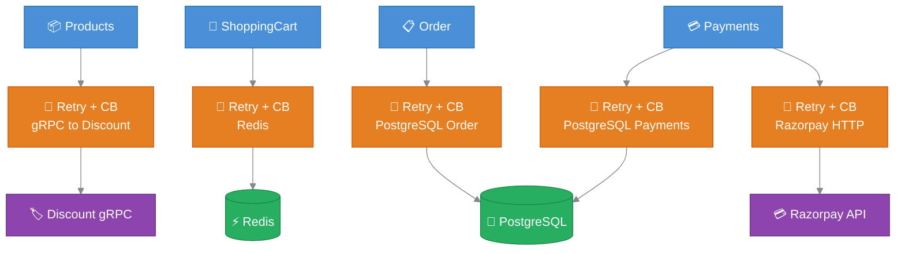

# AntKart — Resilience & Circuit Breaker Technical Design

## Overview

All inter-service HTTP calls and infrastructure connections use **Polly v8** (`Microsoft.Extensions.Http.Resilience 9.0.0` and `Microsoft.Extensions.Resilience 9.0.0`) for retry, circuit breaker, and timeout policies.

### Criticality-tiered resilience

Resilience is **tuned to a dependency's criticality** — there is no one-size-fits-all policy:

- **Critical dependencies** (the data stores and the messaging backbone — Cosmos DB, PostgreSQL, Redis, Service Bus) get **patient** resilience: longer timeouts, **retries** with back-off, and — for Cosmos — honouring the server's **Retry-After**. A request *should* wait and retry, because the operation cannot complete without them.
- **Optional enrichment dependencies** (data the response can render without — e.g. discount prices) get **fail-fast** resilience: a **short timeout**, **no retries**, a circuit breaker that **opens quickly** and stays open for a cooldown, and **silent degradation** (return "no data", never throw). The core response must never be slowed or failed by an optional extra.

The worked example is the **Products → Discount gRPC** client (§1): the product catalogue must always render whether or not discount data is available, so a down Discount service is *expected* and absorbed in ~2 s (then skipped entirely while the breaker is open) rather than adding ~10 s per product.

---

## Resilience Strategies by Layer

### 1. Products → Discount gRPC (HTTP/2) — OPTIONAL dependency, fail-fast

Location: `AK.Products/AK.Products.Infrastructure/Grpc/DiscountGrpcClient.cs`

AK.Discount is an **optional price-enrichment** dependency: the product catalogue must render whether or not discount data is available. The client therefore **fails fast and degrades quietly** — the deliberate opposite of the patient policies used for the critical stores below.

```csharp
services.AddHttpClient("discount-grpc", client =>
{
    client.Timeout = TimeSpan.FromSeconds(2);   // hard per-call ceiling (was 10s)
})
.AddOptionalDependencyResilience();             // no retry + quick circuit-break + 2s pipeline timeout
```

Policy (BuildingBlocks `AddOptionalDependencyResilience`):
1. **No retry** — retrying a down optional service only multiplies the user-facing latency.
2. **Circuit Breaker** — opens after a couple of consecutive failures (FailureRatio 0.9, MinimumThroughput 2, 10s sampling) and stays open **30s**. While open, calls **short-circuit instantly**, so once Discount is known-down a whole page of products skips the call entirely.
3. **Timeout** — 2s per call (Polly pipeline + `HttpClient.Timeout`).

`DiscountGrpcClient.GetDiscountAsync` **never throws**: a `NotFound` (no coupon) returns `null` silently; any unavailability / timeout / open-circuit returns `null` after logging **one concise single-line warning per request** (message only, no stack trace, subsequent items drop to Debug) — so enriching a page can't flood the log. The product always renders, just without a discounted price. (Running only AK.Products locally, with AK.Discount down, is expected and handled by design.)

### 2. Redis (ShoppingCart)

Location: `AK.BuildingBlocks/AK.BuildingBlocks/Resilience/ResilienceExtensions.cs`

```csharp
services.AddRedisResilience();
// Pipeline "redis": retry 3× exponential + 5s timeout
```

Applied to `ICartRepository` Redis operations. On persistent failure the exception propagates to the API layer and returns 503.

### 3. PostgreSQL (Order)

```csharp
services.AddNpgsqlResilience();
// Pipeline "npgsql": retry 3× constant 500ms + 30s timeout
```

Applied to EF Core Npgsql connection factory for transient connection errors.

### 4. Razorpay HTTP Client (Payments)

Location: `AK.Payments/AK.Payments.Infrastructure/`

```csharp
services.AddHttpClient("razorpay", client =>
{
    client.Timeout = TimeSpan.FromSeconds(10);
})
.AddHttpResilienceWithCircuitBreaker(
    maxRetryAttempts: 3,
    failureRatio: 0.5,
    minimumThroughput: 5,
    breakDurationSeconds: 30);
```

Policy stack (inner → outer):
1. **Retry** — 3 attempts, exponential back-off (1s, 2s, 4s)
2. **Circuit Breaker** — opens after 5 failures in 30s
3. **Timeout** — 10s per attempt

Razorpay webhook signature verification is synchronous (HMAC-SHA256 computed locally) — no HTTP call is made, so no resilience policy is needed there.

### 5. PostgreSQL (Payments)

```csharp
services.AddNpgsqlResilience();
// Pipeline "npgsql": retry 3× constant 500ms + 30s timeout
```

Applied to EF Core Npgsql connection factory for the `AKPaymentsDb` database — same policy as Order.

### 6. API Gateway QoS (Ocelot)

`ocelot.json` per-route `QoSOptions`:

```json
"QoSOptions": {
  "ExceptionsAllowedBeforeBreaking": 5,
  "DurationOfBreak": 30000,
  "TimeoutValue": 10000
}
```

The gateway circuit breaker is independent from the downstream service's own resilience — providing a second layer of protection at the edge.

### 7. Cosmos DB (Products) — retry that honours the 429 Retry-After

```csharp
// AK.BuildingBlocks — driver-agnostic mechanism (no MongoDB.Driver dependency):
services.AddDataStoreResiliencePipeline("cosmos",
    CosmosResilience.IsTransient, CosmosResilience.GetRetryAfter);
// Pipeline "cosmos": retry transient faults (429 / timeout / dropped connection),
//   honour the server's Retry-After on a 429, else exponential backoff + jitter; 20s per-attempt timeout.
```

Azure Cosmos DB enforces a provisioned-throughput (RU) budget. When exceeded it rejects the request with **429 — "request rate too large"** and a **Retry-After** hint. Retrying *before* that window deepens the throttling, so the pipeline must respect the hint rather than back off blindly.

- **Mechanism (BuildingBlocks).** `AddDataStoreRetry` builds a Polly v8 retry whose `DelayGenerator` returns the caller-supplied Retry-After verbatim when present (no jitter added on top), and falls back to exponential-backoff-with-jitter when absent. It takes two delegates — `isTransient` and `getRetryAfter` — so the shared library carries **no** `MongoDB.Driver` dependency.
- **Cosmos specifics (Products).** `CosmosResilience.IsTransient` retries `MongoCommandException` 16500 (429) / 50 (timeout) and connection-level faults; `GetRetryAfter` reads `RetryAfterMs` off the 429 error document. `ProductRepository` runs **every** Cosmos call through the `"cosmos"` pipeline — resilience lives at the data-access call site, where idempotency and the `CancellationToken` are known.

> **Service Bus** consumer retry stays the single MassTransit `UseMessageRetry` (incremental 3×) — deliberately **not** double-wrapped. The **Event Grid** side-effect publisher is fire-and-forget and swallows failures (see [EVENTBUS](EVENTBUS.md)).

---

## Resilience Architecture



---

## ResilienceExtensions API

```csharp
// For IHttpClientBuilder — adds retry + circuit breaker handler
public static IHttpClientBuilder AddHttpResilienceWithCircuitBreaker(
    this IHttpClientBuilder builder,
    int maxRetryAttempts = 3,
    double failureRatio = 0.5,
    int minimumThroughput = 3,
    int breakDurationSeconds = 30)

// For Redis — named pipeline "redis"
public static IServiceCollection AddRedisResilience(this IServiceCollection services)

// For Npgsql — named pipeline "npgsql"
public static IServiceCollection AddNpgsqlResilience(this IServiceCollection services)
```

---

## Failure Modes Summary

| Scenario | Behaviour |
|----------|-----------|
| Discount service down | Circuit opens after 5 failures; Products returns zero discount for 30s |
| Redis unreachable | 3 retries × 500ms; then 503 to client |
| PostgreSQL flaky (Order) | 3 retries × 500ms constant; then 500 to client |
| PostgreSQL flaky (Payments) | 3 retries × 500ms constant; then 500 to client |
| Razorpay API unreachable | 3 retries exponential (1s→2s→4s); circuit opens after 5 failures in 30s; then 500 to client |
| Downstream timeout (Gateway) | 10s timeout per request; 503 after 5 consecutive timeouts |
| RabbitMQ delivery failure | MassTransit retry: 3× exponential; then dead-letter queue |
