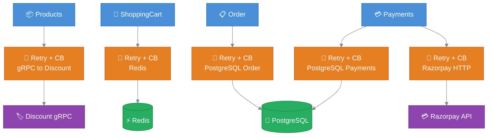

# AntKart — Resilience & Circuit Breaker Technical Design

## Overview

All inter-service HTTP calls and infrastructure connections use **Polly v8** (`Microsoft.Extensions.Http.Resilience 9.0.0` and `Microsoft.Extensions.Resilience 9.0.0`) for retry, circuit breaker, and timeout policies.

---

## Resilience Strategies by Layer

### 1. Products → Discount gRPC (HTTP/2)

Location: `AK.Products/AK.Products.Infrastructure/Grpc/DiscountGrpcClient.cs`

The Discount gRPC client uses `IHttpClientFactory` so Polly policies are applied at the `HttpMessageHandler` level.

```csharp
services.AddHttpClient("discount-grpc", client =>
{
    client.Timeout = TimeSpan.FromSeconds(10);
})
.AddHttpResilienceWithCircuitBreaker(
    maxRetryAttempts: 3,
    failureRatio: 0.5,
    minimumThroughput: 3,
    breakDurationSeconds: 30);
```

Policy stack (inner → outer):
1. **Retry** — 3 attempts, exponential back-off (1s, 2s, 4s)
2. **Circuit Breaker** — opens when ≥50% of last 3 requests fail; stays open 30s
3. **Timeout** — 10s per attempt (set on `HttpClient.Timeout`)

When the circuit is open, `DiscountGrpcClient` catches `BrokenCircuitException` and returns a zero-discount fallback — the cart still works, discounts are skipped.

### 2. Redis (ShoppingCart)

Location: `AK.BuildingBlocks/AK.BuildingBlocks/Resilience/ResilienceExtensions.cs`

```csharp
services.AddRedisResilience();
// Pipeline "redis": retry 3× exponential + 5s timeout
```

Applied to `ICartRepository` Redis operations. On persistent failure the exception propagates to the API layer and returns 503.

### 3. PostgreSQL (Order)

```csharp
services.AddNpgsqlResilience();
// Pipeline "npgsql": retry 3× constant 500ms + 30s timeout
```

Applied to EF Core Npgsql connection factory for transient connection errors.

### 4. Razorpay HTTP Client (Payments)

Location: `AK.Payments/AK.Payments.Infrastructure/`

```csharp
services.AddHttpClient("razorpay", client =>
{
    client.Timeout = TimeSpan.FromSeconds(10);
})
.AddHttpResilienceWithCircuitBreaker(
    maxRetryAttempts: 3,
    failureRatio: 0.5,
    minimumThroughput: 5,
    breakDurationSeconds: 30);
```

Policy stack (inner → outer):
1. **Retry** — 3 attempts, exponential back-off (1s, 2s, 4s)
2. **Circuit Breaker** — opens after 5 failures in 30s
3. **Timeout** — 10s per attempt

Razorpay webhook signature verification is synchronous (HMAC-SHA256 computed locally) — no HTTP call is made, so no resilience policy is needed there.

### 5. PostgreSQL (Payments)

```csharp
services.AddNpgsqlResilience();
// Pipeline "npgsql": retry 3× constant 500ms + 30s timeout
```

Applied to EF Core Npgsql connection factory for the `AKPaymentsDb` database — same policy as Order.

### 6. API Gateway QoS (Ocelot)

`ocelot.json` per-route `QoSOptions`:

```json
"QoSOptions": {
  "ExceptionsAllowedBeforeBreaking": 5,
  "DurationOfBreak": 30000,
  "TimeoutValue": 10000
}
```

The gateway circuit breaker is independent from the downstream service's own resilience — providing a second layer of protection at the edge.

### 7. Cosmos DB (Products) — retry that honours the 429 Retry-After

```csharp
// AK.BuildingBlocks — driver-agnostic mechanism (no MongoDB.Driver dependency):
services.AddDataStoreResiliencePipeline("cosmos",
    CosmosResilience.IsTransient, CosmosResilience.GetRetryAfter);
// Pipeline "cosmos": retry transient faults (429 / timeout / dropped connection),
//   honour the server's Retry-After on a 429, else exponential backoff + jitter; 20s per-attempt timeout.
```

Azure Cosmos DB enforces a provisioned-throughput (RU) budget. When exceeded it rejects the request with **429 — "request rate too large"** and a **Retry-After** hint. Retrying *before* that window deepens the throttling, so the pipeline must respect the hint rather than back off blindly.

- **Mechanism (BuildingBlocks).** `AddDataStoreRetry` builds a Polly v8 retry whose `DelayGenerator` returns the caller-supplied Retry-After verbatim when present (no jitter added on top), and falls back to exponential-backoff-with-jitter when absent. It takes two delegates — `isTransient` and `getRetryAfter` — so the shared library carries **no** `MongoDB.Driver` dependency.
- **Cosmos specifics (Products).** `CosmosResilience.IsTransient` retries `MongoCommandException` 16500 (429) / 50 (timeout) and connection-level faults; `GetRetryAfter` reads `RetryAfterMs` off the 429 error document. `ProductRepository` runs **every** Cosmos call through the `"cosmos"` pipeline — resilience lives at the data-access call site, where idempotency and the `CancellationToken` are known.

> **Service Bus** consumer retry stays the single MassTransit `UseMessageRetry` (incremental 3×) — deliberately **not** double-wrapped. The **Event Grid** side-effect publisher is fire-and-forget and swallows failures (see [EVENTBUS](EVENTBUS.md)).

---

## Resilience Architecture



---

## ResilienceExtensions API

```csharp
// For IHttpClientBuilder — adds retry + circuit breaker handler
public static IHttpClientBuilder AddHttpResilienceWithCircuitBreaker(
    this IHttpClientBuilder builder,
    int maxRetryAttempts = 3,
    double failureRatio = 0.5,
    int minimumThroughput = 3,
    int breakDurationSeconds = 30)

// For Redis — named pipeline "redis"
public static IServiceCollection AddRedisResilience(this IServiceCollection services)

// For Npgsql — named pipeline "npgsql"
public static IServiceCollection AddNpgsqlResilience(this IServiceCollection services)
```

---

## Failure Modes Summary

| Scenario | Behaviour |
|----------|-----------|
| Discount service down | Circuit opens after 5 failures; Products returns zero discount for 30s |
| Redis unreachable | 3 retries × 500ms; then 503 to client |
| PostgreSQL flaky (Order) | 3 retries × 500ms constant; then 500 to client |
| PostgreSQL flaky (Payments) | 3 retries × 500ms constant; then 500 to client |
| Razorpay API unreachable | 3 retries exponential (1s→2s→4s); circuit opens after 5 failures in 30s; then 500 to client |
| Downstream timeout (Gateway) | 10s timeout per request; 503 after 5 consecutive timeouts |
| RabbitMQ delivery failure | MassTransit retry: 3× exponential; then dead-letter queue |
