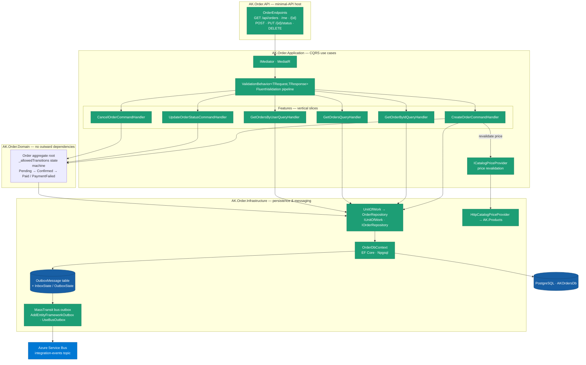
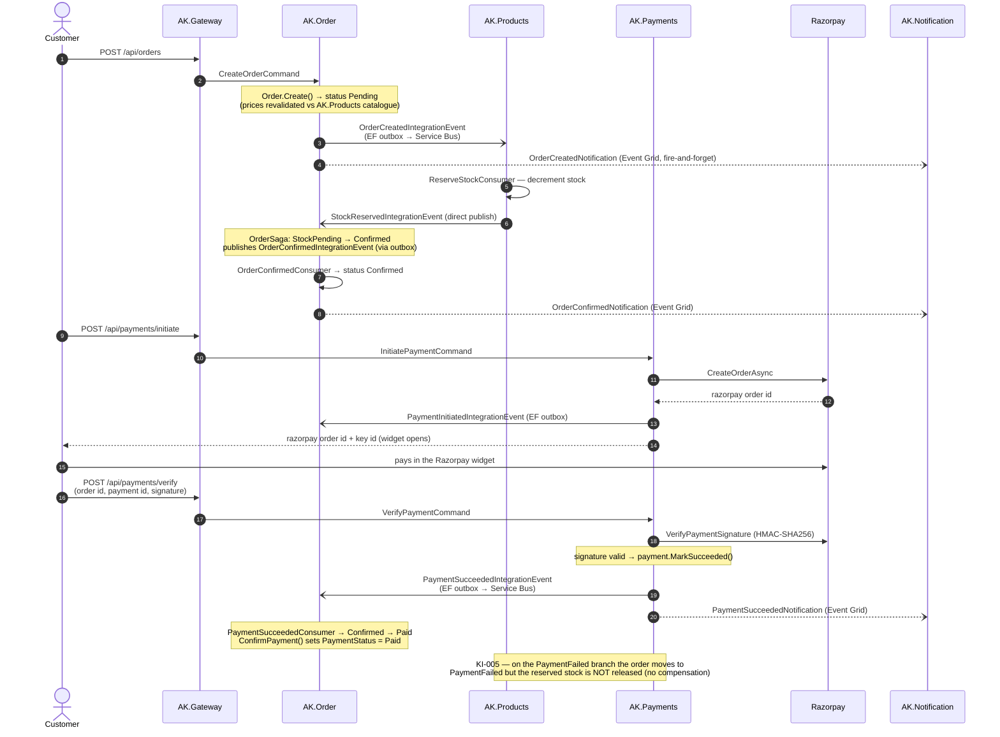

# Platform architecture — how the code is built

> **Diagrams pending review:** _Inside AK.Order_ and _Order saga_ are carried across as-is and will be reworked.

This layer is the engineering foundation: how a single AntKart service is structured and how the services coordinate. It is the same across all six services, so understanding one is understanding all.

Every service applies **Clean Architecture** and **Domain-Driven Design** — a `Domain` core with no outward dependencies, an `Application` layer of use cases (**CQRS** commands and queries dispatched by **MediatR** through a validation pipeline), an `Infrastructure` layer for persistence and messaging, and a thin **minimal-API** (or gRPC) host. Services never call each other synchronously for business flows; they coordinate through an **orchestrated saga** on Azure Service Bus, with a **transactional outbox** so a state change and its event are written atomically. Persistence hides behind **repository + specification + unit of work**.

AK.Order is the richest example — CQRS via MediatR, saga orchestration, EF Core outbox, and a domain state machine that enforces valid order transitions. Commands flow through a `ValidationBehavior` pipeline; `CancelOrder`/`UpdateOrderStatus` return `Result<T>` for expected failures while `CreateOrder` throws for the unexpected.

## Inside AK.Order

One request enters through `OrderEndpoints` in the minimal-API host, which reads the caller's identity from the JWT and dispatches a command or query through `IMediator`. Every request first crosses the shared `ValidationBehavior` pipeline before reaching its slice — the `Features/` folder holds one vertical slice per use case (`CreateOrder`, `UpdateOrderStatus`, `CancelOrder`, `GetOrderById`, `GetOrders`, `GetOrdersByUser`). Write handlers act on the `Order` aggregate root, whose `_allowedTransitions` state machine is the only place an order's status can legally change; `CreateOrder` additionally revalidates every line against the catalogue through `ICatalogPriceProvider` before persisting. All persistence goes through `IUnitOfWork`/`OrderRepository` onto `OrderDbContext` (EF Core over Npgsql). The decisive detail is the outbox: the business row and the `OutboxMessage` are written in one PostgreSQL transaction, and MassTransit's bus outbox drains that table to Azure Service Bus afterwards — so the state change and its integration event can never diverge.

## Order saga

The saga is orchestrated by `OrderSaga` (a MassTransit state machine) and runs entirely over messages — no service calls another synchronously for the business flow. `AK.Order` never publishes an integration event directly from a handler: `OrderCreatedIntegrationEvent`, the saga's `OrderConfirmedIntegrationEvent`, and `AK.Payments`' `PaymentInitiatedIntegrationEvent`/`PaymentSucceededIntegrationEvent` are all written to an EF Core outbox in the same transaction as their state change and drained to Service Bus afterwards; only `AK.Products`' `StockReservedIntegrationEvent` is a direct publish, as that service has no outbox. Customer emails travel a deliberately separate path — fire-and-forget Event Grid notifications consumed by the serverless `AK.Notification` Functions — so a notification failure can never roll back the saga. The dashed note records **KI-005**: because there is no compensating stock-release step, a payment that fails after stock was reserved leaves that stock decremented.

The two eventing patterns this rests on — **domain events** (in-process) vs **integration events** (cross-service, via the outbox and Service Bus) — and the resilience posture (retry, circuit breaker, timeout) are the platform's cross-cutting design.

## How it was built

- Application patterns and cross-cutting design: [Event Bus design](../guides/eventbus-concepts.md) · [Resilience design](../guides/resilience-concepts.md).
- Per-service internals: the service technical design documents — [AK.Products](../../AK.Products/PRODUCTS_TECHNICAL_DESIGN.md) · [AK.Order](../../AK.Order/ORDER_TECHNICAL_DESIGN.md) · [AK.Payments](../../AK.Payments/PAYMENTS_TECHNICAL_DESIGN.md) · [AK.ShoppingCart](../../AK.ShoppingCart/SHOPPING_CART_TECHNICAL_DESIGN.md) · [AK.Discount](../../AK.Discount/DISCOUNT_TECHNICAL_DESIGN.md) · [AK.Gateway](../../AK.Gateway/API_GATEWAY.md) · [AK.BuildingBlocks](../../AK.BuildingBlocks/BUILDING_BLOCKS.md). _(These describe the Phase-1 topology and carry a superseded banner; the patterns still hold.)_

## Decisions

- [ADR-001 — Microservices Architecture](../adr/ADR-001-microservices-architecture.md)
- [ADR-002 — Clean Architecture and Domain-Driven Design](../adr/ADR-002-clean-architecture-and-ddd.md)
- [ADR-004 — Polyglot Persistence](../adr/ADR-004-polyglot-persistence.md)
- [ADR-005 — SAGA Orchestration over 2PC and Choreography](../adr/ADR-005-saga-orchestration.md)
- [ADR-006 — Ocelot API Gateway over YARP](../adr/ADR-006-ocelot-api-gateway.md)
- [ADR-009 — Domain Events vs Integration Events](../adr/ADR-009-domain-events-vs-integration-events.md)
- [ADR-010 — CQRS and MediatR](../adr/ADR-010-CQRS-and-MediatR.md)
- [ADR-011 — Repository, Specification, and Unit of Work](../adr/ADR-011-Repository-Specification-and-Unit-of-Work.md)

## Open items

- [KI-005 — no stock-release compensation on payment failure](../KNOWN_ISSUES.md): when a payment fails, stock reserved by the saga is retained rather than released — a deliberate deferral pending a compensation workstream.
