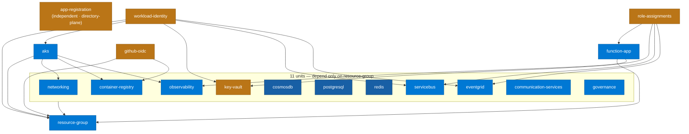
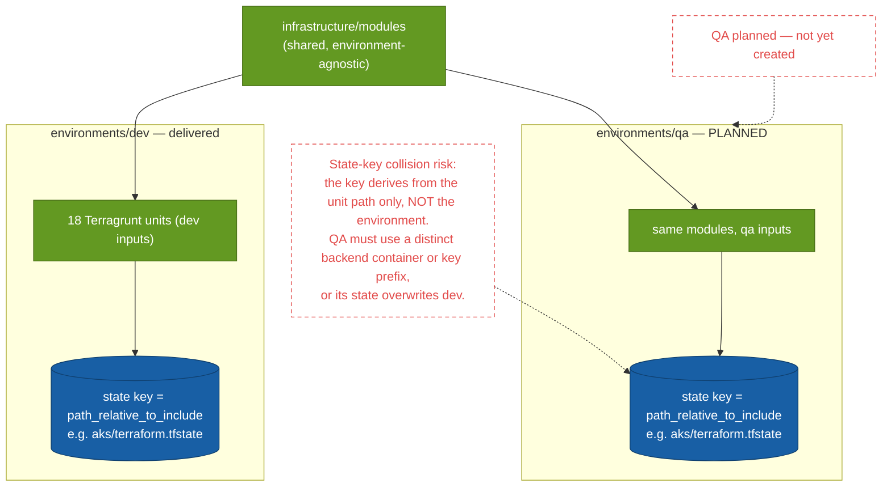

# Infrastructure as code — how the cloud gets built

> **Diagrams pending review:** _Terragrunt unit dependencies_ and _Environment promotion_ are carried across as-is and will be reworked.

Every Azure resource is provisioned as code. **Terraform modules** describe *how* a resource is built; **Terragrunt live units** wire the modules together for an environment and supply their inputs. A shared `root.hcl` generates the `backend`, `provider`, and `versions` configuration into each unit, so that configuration lives in exactly one place. Remote state is isolated **per unit** in Azure Storage, with blob-lease locking serialising applies. The `dev` environment is delivered; `qa` is planned.

## Terragrunt unit dependencies

**What to notice**

- **18 live units.** `environments/dev` holds **18** unit folders; the state-backend bootstrap is an `az` step, not a Terragrunt unit.
- **`resource-group` is the root** — everything except `app-registration` traces back to it; **11 units depend on it alone** and nothing else.
- **`app-registration` is independent** — it manages a directory object via the `azuread` provider, not a resource-group resource.
- **Two composite tails carry the interesting order:** `role-assignments` waits on `function-app` + `key-vault` + `servicebus` + `eventgrid`; `workload-identity` waits on `aks` (for its OIDC issuer) + `key-vault` + `servicebus` + `eventgrid`.
- A *complete* dependency graph must show every unit; the 11 resource-group-only units are grouped to keep it legible.

## Environment promotion — dev vs QA

**What to notice**

- **Modules are shared, environments differ only by inputs:** promotion means a second `environments/qa` tree that reuses `infrastructure/modules` with QA-specific inputs — not copied module code.
- **The state key is the risk (red):** `root.hcl` derives the backend key from `path_relative_to_include()` — the **unit path only**, with no environment segment. A QA tree using the same backend container would produce identical keys (`aks/terraform.tfstate`, …) and **overwrite dev state**.
- **The fix QA must adopt:** a distinct backend `container_name` or a per-environment key prefix, so dev and QA state can never collide.
- **QA is planned, not built** — both the QA subgraph and the risk are drawn as red-dashed to keep that explicit.

## How it was built

- Concepts first: [IaC fundamentals](../guides/iac-concepts.md).
- Step-by-step provisioning (per resource, Understand → Build → Execute → Verify): [Infrastructure Guide](../guides/infrastructure-guide.md) · the IaC map in [infrastructure/README](../../infrastructure/README.md).

## Decisions

- [ADR-012 — Infrastructure as Code with Terraform and Terragrunt](../adr/ADR-012-iac-with-terraform-terragrunt.md)

## Open items

- The **QA environment is planned**, not built; the state-key collision risk above must be resolved before a second environment shares the backend. See the [Roadmap](../ROADMAP.md).
