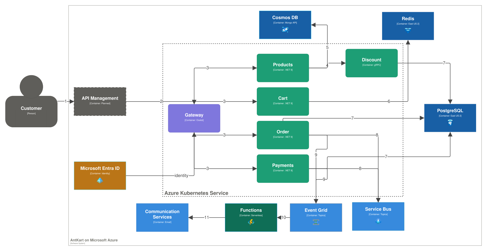
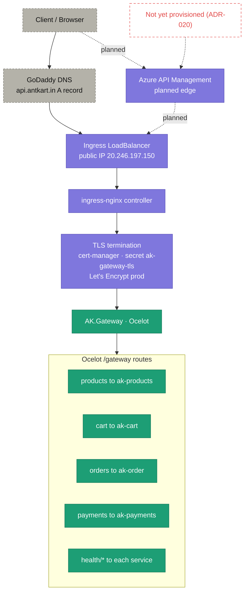

# Azure services — where it runs

> **Diagrams pending review:** _Azure topology_ and _Network and traffic path_ are carried across as-is and will be reworked.

The platform runs entirely on managed Azure services, provisioned by the [infrastructure-as-code](1-infrastructure-as-code.md) units. The application was migrated off local infrastructure onto these managed services, adopting token-based authentication throughout. Each local Phase-1 component was replaced by a managed equivalent: Keycloak → **Microsoft Entra ID**, RabbitMQ → **Azure Service Bus**, MongoDB → **Cosmos DB (MongoDB API)**, local Postgres → **PostgreSQL Flexible Server**, local Redis → **Azure Managed Redis**, SMTP/Mailhog → **Azure Communication Services**, and ELK → **Azure Monitor (Application Insights / Log Analytics)**.

## Azure topology

<picture>
  <source media="(prefers-color-scheme: dark)" srcset="../C4Renders/renders/AzureServices-dark.svg">
  
</picture>

## Network and traffic path

**What to notice**

- **DNS is external and manual:** a GoDaddy **A record** maps `api.antkart.in` to the ingress LoadBalancer's public IP `20.246.197.150` — not Azure DNS.
- **TLS terminates at the cluster edge:** `ingress-nginx` + `cert-manager` (secret `ak-gateway-tls`, Let's Encrypt **production**), not at the service.
- **One public entry point:** everything enters through `AK.Gateway`; its Ocelot routes fan out to the internal services (`/gateway/products|cart|orders|payments` and `/gateway/health/*`).
- **API Management is planned, not live:** the dashed path and the red-dashed gap annotation mark the managed edge as **not yet provisioned** — today traffic goes DNS → IP directly.

## How it was built

- The migration from local to managed services: [Cloud Migration Guide](../guides/cloud-migration-guide.md).
- Concepts for the resources: [Cosmos DB](../guides/cosmosdb-concepts.md) · [Messaging](../guides/messaging-concepts.md) · [Serverless & Eventing](../guides/serverless-eventing-concepts.md).

## Decisions

- [ADR-014 — Cosmos DB and Azure Service Bus](../adr/ADR-014-cosmosdb-and-servicebus.md)
- [ADR-015 — Messaging Migration to Azure Service Bus](../adr/ADR-015-messaging-migration-to-service-bus.md)
- [ADR-016 — Cosmos DB Data Migration and Workload Identity Foundation](../adr/ADR-016-data-migration-cosmosdb-and-workload-identity.md)
- [ADR-017 — Entra ID, Azure Functions, and Event Grid](../adr/ADR-017-entra-id-functions-eventgrid.md)
- [ADR-019 — Serverless Notification with Azure Functions and Event Grid](../adr/ADR-019-serverless-notification-functions-eventgrid.md)
- [ADR-020 — API Management as the Managed Edge Gateway](../adr/ADR-020-api-management-managed-edge-gateway.md) _(planned)_
- [ADR-021 — Retire the Dedicated Identity Service for Microsoft Entra ID](../adr/ADR-021-retire-identity-service-for-entra.md)

## Open items

- **Azure API Management** (the managed edge) is planned, not provisioned — see [ADR-020](../adr/ADR-020-api-management-managed-edge-gateway.md) and the [Roadmap](../ROADMAP.md).
