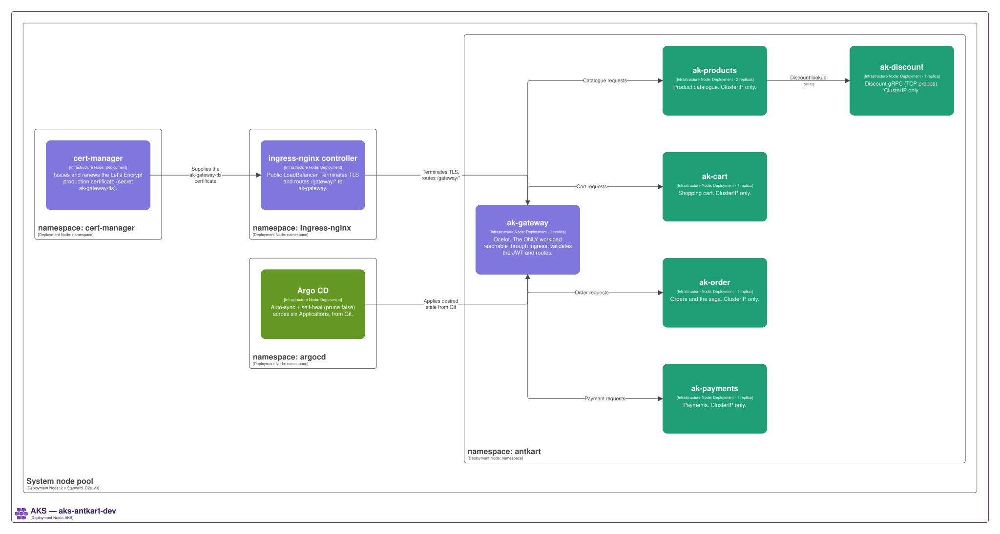
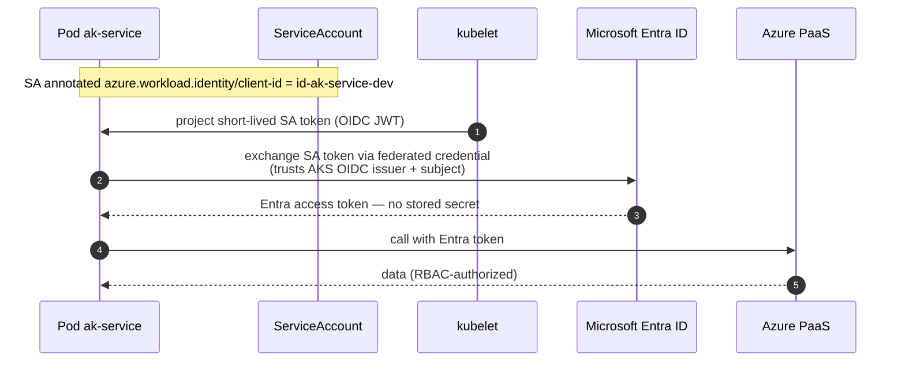
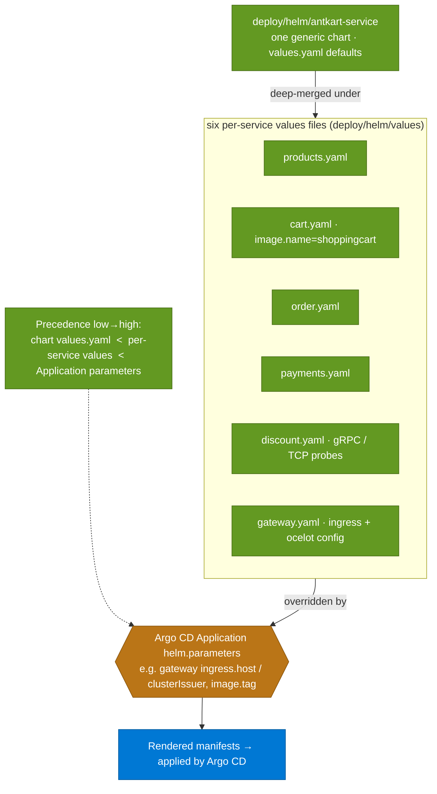

# Kubernetes — how it is orchestrated

> **Diagrams pending review:** _Cluster topology_, _Workload identity token flow_, and _Helm chart and values precedence_ are carried across as-is and will be reworked.

The six services run on a managed **AKS** cluster (`aks-antkart-dev`) with Azure CNI Overlay, an OIDC issuer, and workload identity. All six deploy from **one generic Helm chart** parameterised per service. Only the gateway is exposed; the rest are `ClusterIP`-only. Pods reach Azure with **no stored secret** by exchanging a projected ServiceAccount token for an Entra token.

## Cluster topology

<picture>
  <source media="(prefers-color-scheme: dark)" srcset="../C4Renders/renders/Kubernetes-dark.svg">
  
</picture>

## Workload identity token flow

**What to notice**

- **The ServiceAccount annotation is the anchor:** `azure.workload.identity/client-id` on the pod's ServiceAccount ties it to a specific `id-ak-<service>-dev` managed identity.
- **The projected token is short-lived** and is a Kubernetes-issued OIDC JWT — never a long-lived Azure credential.
- **Entra does the exchange, not the app:** the federated credential (created by the `workload-identity` module) trusts the **AKS OIDC issuer** for the pod's exact subject, and only then returns an Entra access token.
- **Nothing is stored:** no client secret, connection string, or key sits in the pod — this is what `DefaultAzureCredential` resolves to in-cluster.
- The returned token is RBAC-scoped to the roles that identity holds (see the Identity and trust chain, in the [Security](6-security.md) section).

## Helm chart and values precedence

**What to notice**

- **One chart, six releases:** every service instantiates the *same* `antkart-service` chart — there is no per-service chart to keep in step.
- **Precedence is three-layer, low→high:** chart `values.yaml` defaults, then the per-service values file, then the Argo CD Application's `helm.parameters` win last.
- **The special cases live in the values files:** `cart.yaml` overrides `image.name` to `shoppingcart`; `discount.yaml` selects TCP probes for its h2c gRPC port; `gateway.yaml` carries the ingress + Ocelot config.
- **The gateway's environment-specific bits are parameters, not values:** `ingress.host` (`api.antkart.in`) and `clusterIssuer` come in as Application parameters, so Git — via Argo CD — is authoritative and self-heal can't revert them.

## How it was built

- The cluster, containers, workload identity, Helm deployment, ingress/TLS, and troubleshooting: [AKS Guide](../guides/aks-guide.md).
- The runtime configuration keys each service needs (the source for the Helm values): [Container Configuration](../guides/container-configuration.md).
- Driving the cluster from Git with Argo CD: [GitOps Guide](../guides/gitops-guide.md). _(How delivery reaches the cluster is detailed in [DevOps](4-devops.md).)_

## Decisions

- [ADR-018 — Managed Kubernetes, Workload Identity, and Hardened Base Image](../adr/ADR-018-aks-workload-identity-base-image.md)

## Open items

- **Kubernetes depth** (storage, network policies, failure-diagnosis practices) and **base-image hardening** remain to come — see the [Roadmap](../ROADMAP.md).
