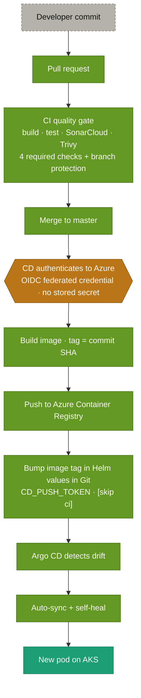
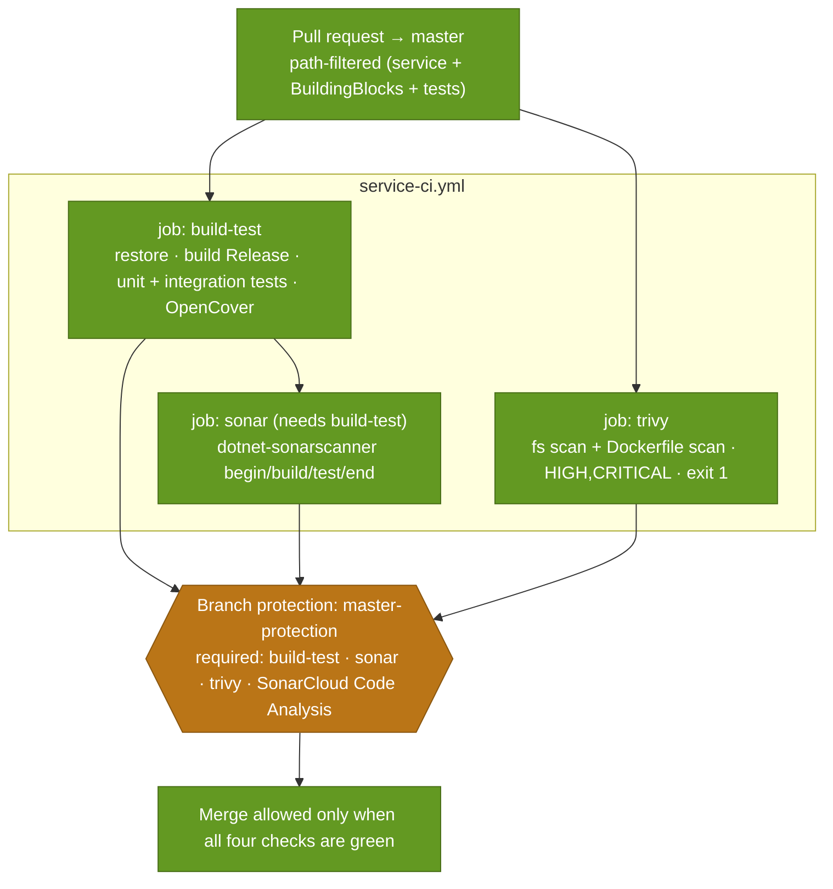
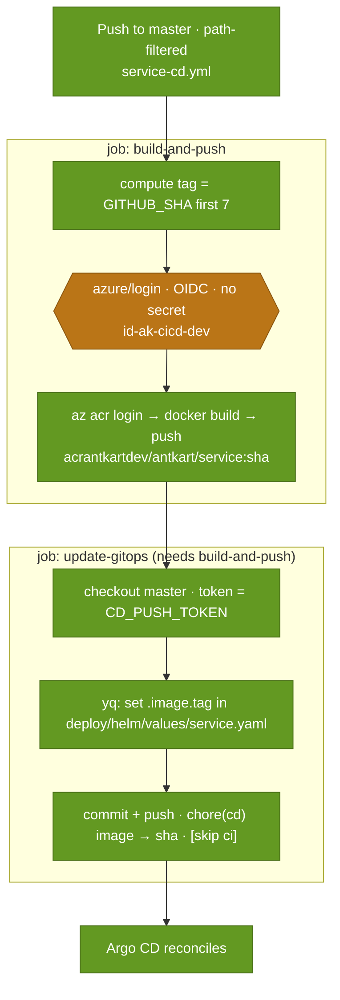
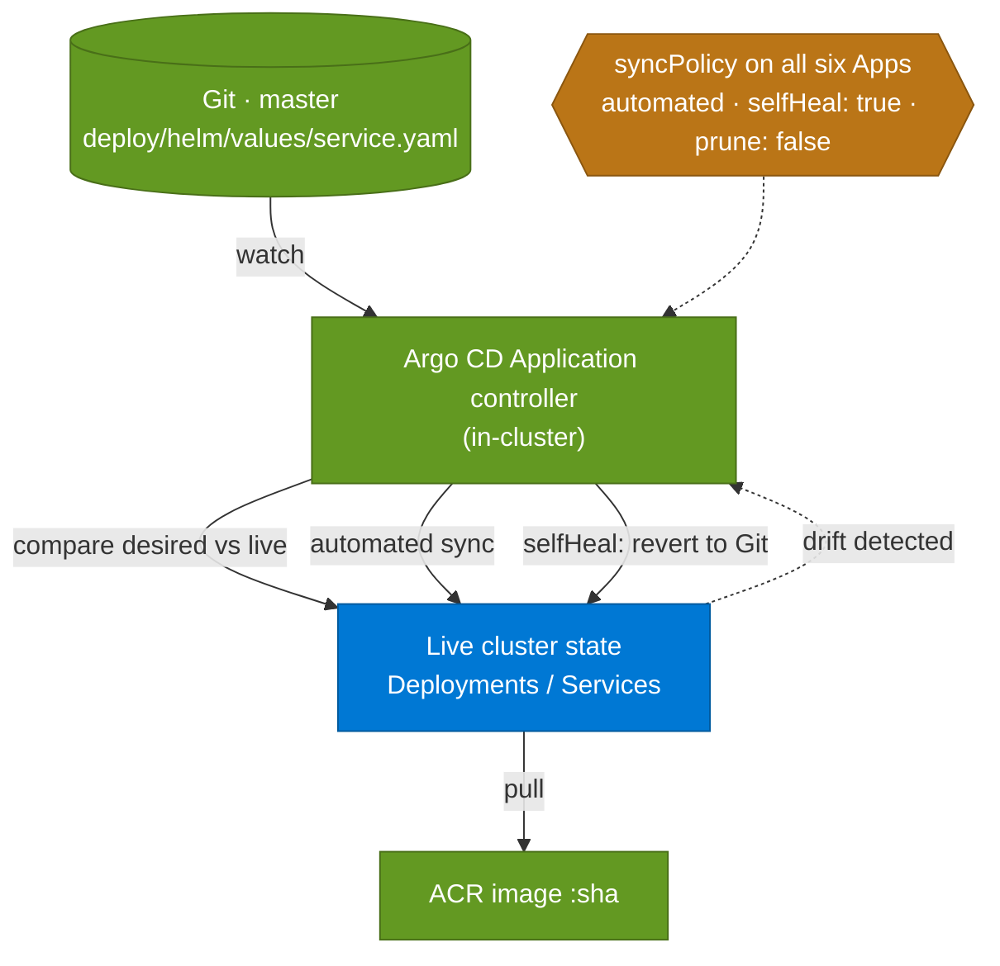

# DevOps — how it ships

> **Diagrams pending review:** _Commit to running pod_, _CI pipeline_, _CD pipeline_, and _GitOps reconciliation_ are carried across as-is and will be reworked.

Delivery is a two-workflow pattern per service (twelve workflows across six services): **CI** on a pull request is the quality gate; **CD** on merge builds and delivers. CD never touches the cluster — it commits an image-tag change to Git, and **Argo CD** reconciles it. No cluster credentials live in CI/CD, and Azure auth is secret-less via OIDC.

## Commit to running pod

The whole loop at a glance; the three diagrams below are the detail.

**What to notice**

- **One straight line, three concerns:** the pull-request **gate** (the CI pipeline), the merge-triggered **delivery** (the CD pipeline), and the in-cluster **reconciliation** (the GitOps loop) chain into a single path — nothing branches.
- **The gate is real:** merge is blocked until four required checks pass under branch protection (build-test, sonar, trivy, SonarCloud Code Analysis).
- **Secret-less and immutable:** CD authenticates by OIDC federated credential (no stored secret) and tags the image with the commit SHA.
- **Delivery is a Git commit, not a push to the cluster:** CD bumps the image tag in the Helm values with `CD_PUSH_TOKEN` and `[skip ci]`; Argo CD then detects drift and auto-syncs with self-heal.
- **Proven for all six services, hands-free** — a commit reaches a running pod with no manual step.

## CI pipeline

**What to notice**

- **Three jobs, real names:** `build-test`, `sonar`, `trivy` — exactly the job names in the workflow.
- **`sonar` depends on `build-test`** (`needs:`), so analysis is not spent on a commit that doesn't compile; `trivy` runs in parallel.
- **Four required checks, not three:** the `master-protection` ruleset requires `build-test`, `sonar`, `trivy`, **and** `SonarCloud Code Analysis` (SonarCloud's own PR quality-gate status).
- **CI is a pure gate:** it builds and tests but pushes no image and touches no cluster — delivery is the CD pipeline (below).
- **Path filters keep it per-service:** a PR touching only one service runs only that service's CI.

## CD pipeline

**What to notice**

- **Secret-less Azure auth:** `azure/login` uses OIDC federated with `id-ak-cicd-dev` (repo *variables*, not secrets) — the only Azure privilege is AcrPush.
- **Immutable tag:** the image is tagged with the **short commit SHA**, so a tag always means exactly one build.
- **Delivery is a Git commit, not a deploy:** job 2 bumps `.image.tag` in the service's values file and pushes — no `helm`/`kubectl`, no cluster credentials.
- **The push needs a PAT:** `update-gitops` checks out with `CD_PUSH_TOKEN` (the github-actions bot isn't a bypass actor), and the commit carries `[skip ci]`.
- **Loop-safe:** the tag-bump touches only `deploy/helm/values/**`, which is outside CD's path filter, so it can't retrigger CD.

## GitOps reconciliation

**What to notice**

- **Pull, not push:** Argo CD runs *inside* the cluster and watches Git — nothing outside the cluster deploys, and CD holds no cluster credentials.
- **Auto-sync closes the loop:** with `automated` on, the CD tag-bump commit deploys hands-free — no manual sync.
- **Self-heal makes Git authoritative:** live drift (a manual `kubectl edit`) is reverted back to Git; the sync policy is declared in Git on all six Applications.
- **Prune is off by design (`prune: false`):** Argo won't delete resources that disappear from Git — a conservative default recorded in the manifests.
- **The image is pulled by tag:** the Deployment references `:sha`, so the new pod runs exactly the image the commit named.

## How it was built

- The journey from code change to running pod, the per-service workflow layout, the SonarCloud/Trivy gates, branch protection, and OIDC/secrets handling: [DevOps CI/CD Guide](../guides/devops-cicd-guide.md).
- The DevOps area index: [DevOps Guide](../guides/devops-guide.md).

## Decisions

- [ADR-022 — CI/CD on GitHub Actions with OIDC Federated Credentials](../adr/ADR-022-cicd-github-actions-oidc.md)
- [ADR-023 — CI/CD Pipeline Design and Repository Strategy](../adr/ADR-023-cicd-pipeline-design-and-repository-strategy.md)

## Open items

- [KI-004 — mutable image tag can serve a stale image](../KNOWN_ISSUES.md): mitigated by the commit-SHA tags this pipeline uses. See also [KI-006 (resolved)](../KNOWN_ISSUES.md) — the CD path filters now exclude markdown so documentation changes don't trigger delivery.
