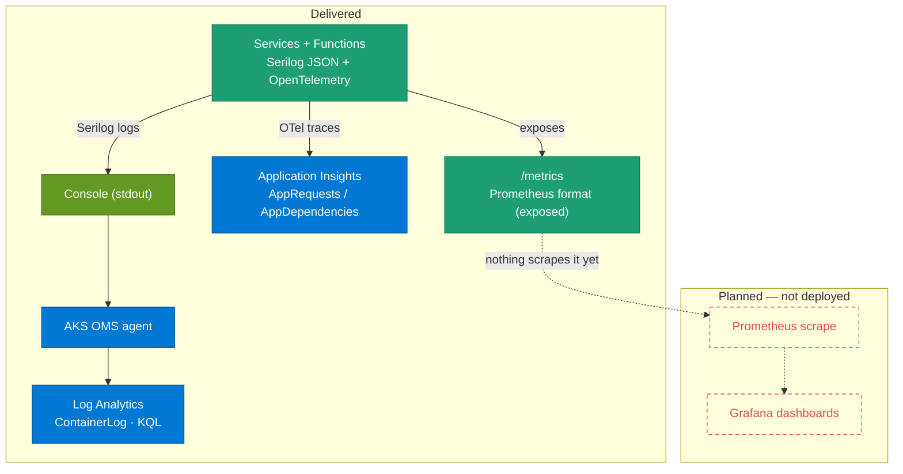

# Observability — how it is seen

Observability is **mostly delivered**: structured logging and distributed tracing are in place across every service; metrics are *exposed* but not yet scraped. Two secret-less paths ship today — Serilog writes JSON logs to the console, collected by the AKS OMS agent into **Log Analytics** (`ContainerLog`), and OpenTelemetry exports **traces to Application Insights** (`AppRequests` / `AppDependencies`). A Prometheus `/metrics` endpoint is exposed on every service, but nothing scrapes it yet.

## Observability pipeline



**What to notice**

- **Logging is delivered — via the OMS agent into Log Analytics, NOT Application Insights.** Every service and Function emits **Serilog** `RenderedCompactJsonFormatter` JSON to the **console**; the AKS **OMS agent** ships container stdout into **Log Analytics**, landing in the legacy **`ContainerLog`** table (the cluster is on the pre-DCR collection path — `useAADAuth=false`, no data collection rules, so not `ContainerLogV2`). Because each line is JSON, `ServiceName`, `Environment`, `CorrelationId` and `TraceId`/`SpanId` are queryable via `parse_json(LogEntry)`. No code-side sink credentials.
- **Tracing is delivered — to Application Insights.** All six services export **OpenTelemetry** traces via the Azure Monitor exporter; spans land in **`AppRequests`** (server) and **`AppDependencies`** (client). Instrumented: AspNetCore, HttpClient, gRPC client, MassTransit (Service Bus), Npgsql (PostgreSQL), MongoDB (Cosmos Mongo API) and StackExchange.Redis.
- **Logs stay on Serilog, not OTel.** `AppTraces` contains only `func-antkart-notifications-dev` (the Functions app's classic App Insights SDK); the six AKS services deliberately do **not** enable OTel log export — Serilog already covers logs, and logs are joined to traces by the `TraceId`/`SpanId` enrichment instead. See [ADR-025](../adr/ADR-025-observability-architecture.md).
- **Metrics are exposed but not yet scraped.** Each service serves `/metrics` in Prometheus exposition format. The **kube-prometheus-stack** (Prometheus + Grafana) is now added as a manually-applied Argo CD Application (see [Metrics stack](#metrics-stack--kube-prometheus-stack-via-argo-cd)); the scrape itself (ServiceMonitors) is not wired yet. `AK.Discount.Grpc` now serves `/metrics` on a **dedicated HTTP/1.1 port (8081)** because its main port is HTTP/2-only (h2c) for gRPC — addressing [KI-008](../KNOWN_ISSUES.md).
- **Correlation and trace-linking are in place.** The `X-Correlation-Id` middleware follows a request across services in the logs; OTel additionally propagates W3C `traceparent` across HttpClient/gRPC/MassTransit, and each log line carries `TraceId`/`SpanId` so a slow span in Application Insights pivots to its log lines.

## Working KQL

Run against the `log-antkart-dev` workspace. On **Windows**, Azure CLI strips inner double quotes, so KQL **string literals must use single quotes** when passed via `--analytics-query`.

**Structured logs with correlation** (from the JSON console stream in `ContainerLog`):

```kql
ContainerLog | where TimeGenerated > ago(1h)
| extend L=parse_json(LogEntry)
| where isnotempty(L.CorrelationId)
| project TimeGenerated, tostring(L.ServiceName),
          tostring(L.CorrelationId), tostring(L['@m'])
```

**Which services are reporting traces:**

```kql
AppRequests | summarize Requests=count(),
              Failed=countif(Success == false) by AppRoleName
```

**Dependencies by type** (postgresql, mongodb, redis, servicebus, gRPC):

```kql
AppDependencies | summarize Calls=count(), AvgMs=round(avg(DurationMs),1)
                  by AppRoleName, DependencyType, Target
```

**A distributed trace spanning services:**

```kql
union AppRequests, AppDependencies
| summarize Services=make_set(AppRoleName), Spans=count() by OperationId
| where array_length(Services) > 1
```

## How it was built

- The architecture and the decisions behind it — Serilog for logs, OpenTelemetry for traces/metrics, why OTel log export is off, and the OTel version pin — are in [ADR-025 — Observability Architecture](../adr/ADR-025-observability-architecture.md).
- Health-probe surfaces (`/health/live`, `/health/ready`, `/health/deps`) are a complementary signal — see the health-check wiring in [AK.BuildingBlocks](../../AK.BuildingBlocks/BUILDING_BLOCKS.md). _(For historical background only, the superseded [observability concepts](../guides/observability-concepts.md) note describes the earlier Phase-1 intent.)_

## Decisions

- [ADR-013 — Key Vault RBAC and Observability Foundation](../adr/ADR-013-key-vault-rbac-and-observability-foundation.md)
- [ADR-025 — Observability Architecture](../adr/ADR-025-observability-architecture.md)

## Metrics stack — kube-prometheus-stack (via Argo CD)

Prometheus + Grafana are deployed as the `monitoring-kube-prometheus-stack` Argo CD Application ([deploy/argocd/applications/](../../deploy/argocd/applications/monitoring-kube-prometheus-stack.yaml)), into a dedicated `monitoring` namespace under a **separate, scoped** `monitoring` AppProject ([deploy/argocd/appproject-monitoring.yaml](../../deploy/argocd/appproject-monitoring.yaml)) — kept apart from the least-privilege `antkart` project so the stack's cluster-scoped needs (CRDs, ClusterRoles, admission webhooks) never widen the AntKart project. The chart version is **pinned** and the Application syncs with `ServerSideApply=true` (the chart's CRDs exceed the client-side-apply annotation limit). No ServiceMonitors are wired yet — that is a follow-up once the stack's CRDs exist.

Prometheus scrapes over **HTTP/1.1**. Five services serve `/metrics` on their main 8080 port; `AK.Discount.Grpc`'s main port is **HTTP/2-only (h2c)** for gRPC and rejects an HTTP/1.1 scrape, so it serves `/metrics` on a **dedicated HTTP/1.1 port 8081** (a second Kestrel listener, enabled only in the cluster). It must not use `Http1AndHttp2` on the gRPC port — over cleartext h2c there is no ALPN, so that would fall back to HTTP/1.1 and break gRPC.

**Grafana admin password — created out of band, never committed.** The chart reads the admin credentials from a Kubernetes Secret via `grafana.admin.existingSecret`. Create it **before** syncing the Application (the Grafana pod needs it at startup):

```bash
kubectl create namespace monitoring   # if not already created by the Application's CreateNamespace=true
kubectl create secret generic grafana-admin -n monitoring \
  --from-literal=admin-user=admin \
  --from-literal=admin-password='<choose-a-strong-password>'
```

No password — not even a placeholder — is stored in Git.

- **The metrics scrape is not wired yet.** Every service exposes `/metrics`, and `AK.Discount.Grpc` now serves it on a **dedicated HTTP/1.1 port (8081)** — addressing the h2c scrape-reachability gap in [KI-008](../KNOWN_ISSUES.md). The **kube-prometheus-stack** is added as a manually-applied Argo CD Application (see [Metrics stack](#metrics-stack--kube-prometheus-stack-via-argo-cd) above); connecting Prometheus to the services via **ServiceMonitors** is the next step, once the stack's CRDs are installed.
