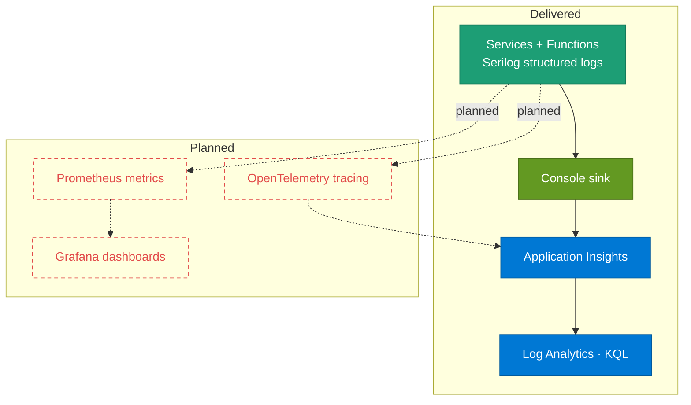

# Observability — how it is seen

> **Diagrams pending review:** _Observability pipeline_ is carried across as-is and will be reworked.

Observability is **partly delivered**: structured logging is in place across every service and Function; metrics and distributed tracing are planned. What ships today is a code-side-secret-less log path — Serilog writes structured logs to the console, and Azure Monitor collects that stream in the cloud. This section is deliberately honest about the gap: much of the target picture is not yet wired.

## Observability pipeline

**What to notice**

- **Logging is delivered:** every service and Function emits **Serilog** structured logs to the **Console**, collected in the cloud by **Application Insights / Log Analytics** and queried with **KQL** — no code-side sink credentials.
- **No Elasticsearch/Kibana:** the console stream is the transport; the collector is Azure Monitor, not an ELK stack.
- **Tracing and metrics are planned (red):** OpenTelemetry tracing, Prometheus metrics, and Grafana dashboards are **not** wired yet — drawn as red-dashed planned nodes.
- **Two prospective sinks:** planned traces would flow to Application Insights alongside logs; planned metrics would flow Prometheus → Grafana.
- **Correlation is in place at the request edge:** each service carries the `X-Correlation-Id` middleware, so a request can be followed across services in the logs even before distributed tracing lands.

## How it was built

- The logging approach, the sinks, and the planned metrics/tracing work: [Observability design](../guides/observability-concepts.md).
- Health-probe surfaces (`/health/live`, `/health/ready`, `/health/deps`) are a complementary signal — see the health-check wiring described in [AK.BuildingBlocks](../../AK.BuildingBlocks/BUILDING_BLOCKS.md).

## Decisions

- [ADR-013 — Key Vault RBAC and Observability Foundation](../adr/ADR-013-key-vault-rbac-and-observability-foundation.md)

## Open items

- **Metrics and distributed tracing are planned, not delivered** — OpenTelemetry, Prometheus, and Grafana are on the [Roadmap](../ROADMAP.md). This section will grow as that work lands.
