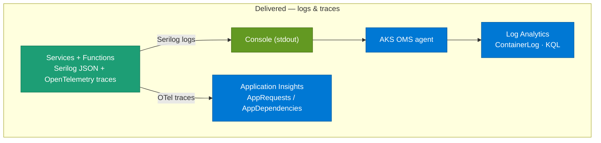

# Observability — how it is seen

Observability is **delivered for two signals — logs and traces**. Two secret-less paths ship today: Serilog writes JSON logs to the console, collected by the AKS OMS agent into **Log Analytics** (`ContainerLog`); and OpenTelemetry exports **distributed traces to Application Insights** (`AppRequests` / `AppDependencies`). **Metrics are not currently collected** — the self-hosted Prometheus/Grafana stack was deliberately removed in favour of a managed platform (Datadog, under evaluation); see [Metrics: not currently collected](#metrics-not-currently-collected) and [ADR-025](../adr/ADR-025-observability-architecture.md).

## Observability pipeline



**What to notice**

- **Logging is delivered — via the OMS agent into Log Analytics, NOT Application Insights.** Every service and Function emits **Serilog** `RenderedCompactJsonFormatter` JSON to the **console**; the AKS **OMS agent** ships container stdout into **Log Analytics**, landing in the legacy **`ContainerLog`** table (the cluster is on the pre-DCR collection path — `useAADAuth=false`, no data collection rules, so not `ContainerLogV2`). Because each line is JSON, `ServiceName`, `Environment`, `CorrelationId` and `TraceId`/`SpanId` are queryable via `parse_json(LogEntry)`. No code-side sink credentials.
- **Tracing is delivered — to Application Insights.** All six services export **OpenTelemetry** traces via the Azure Monitor exporter; spans land in **`AppRequests`** (server) and **`AppDependencies`** (client). Instrumented: AspNetCore, HttpClient, gRPC client, MassTransit (Service Bus), Npgsql (PostgreSQL), MongoDB (Cosmos Mongo API) and StackExchange.Redis.
- **Logs stay on Serilog, not OTel.** `AppTraces` contains only `func-antkart-notifications-dev` (the Functions app's classic App Insights SDK); the six AKS services deliberately do **not** enable OTel log export — Serilog already covers logs, and logs are joined to traces by the `TraceId`/`SpanId` enrichment instead. See [ADR-025](../adr/ADR-025-observability-architecture.md).
- **Metrics are not collected.** The OpenTelemetry wiring here is scoped to **traces only** — the metrics pipeline (the Prometheus exporter and the services' `/metrics` endpoints) and the self-hosted kube-prometheus-stack were **removed**; the platform is moving to a managed observability product (Datadog, under evaluation). See [Metrics: not currently collected](#metrics-not-currently-collected) and [ADR-025](../adr/ADR-025-observability-architecture.md).
- **Correlation and trace-linking are in place.** The `X-Correlation-Id` middleware follows a request across services in the logs; OTel additionally propagates W3C `traceparent` across HttpClient/gRPC/MassTransit, and each log line carries `TraceId`/`SpanId` so a slow span in Application Insights pivots to its log lines.

## Working KQL

Run against the `log-antkart-dev` workspace. On **Windows**, Azure CLI strips inner double quotes, so KQL **string literals must use single quotes** when passed via `--analytics-query`.

**Structured logs with correlation** (from the JSON console stream in `ContainerLog`):

```kql
ContainerLog | where TimeGenerated > ago(1h)
| extend L=parse_json(LogEntry)
| where isnotempty(L.CorrelationId)
| project TimeGenerated, tostring(L.ServiceName),
          tostring(L.CorrelationId), tostring(L['@m'])
```

**Which services are reporting traces:**

```kql
AppRequests | summarize Requests=count(),
              Failed=countif(Success == false) by AppRoleName
```

**Dependencies by type** (postgresql, mongodb, redis, servicebus, gRPC):

```kql
AppDependencies | summarize Calls=count(), AvgMs=round(avg(DurationMs),1)
                  by AppRoleName, DependencyType, Target
```

**A distributed trace spanning services:**

```kql
union AppRequests, AppDependencies
| summarize Services=make_set(AppRoleName), Spans=count() by OperationId
| where array_length(Services) > 1
```

## How it was built

- The architecture and the decisions behind it — Serilog for logs, OpenTelemetry for traces, why OTel log export is off, why the self-hosted metrics stack was removed, and the OTel version pin — are in [ADR-025 — Observability Architecture](../adr/ADR-025-observability-architecture.md).
- Health-probe surfaces (`/health/live`, `/health/ready`, `/health/deps`) are a complementary signal — see the health-check wiring in [AK.BuildingBlocks](../../AK.BuildingBlocks/BUILDING_BLOCKS.md). _(For historical background only, the superseded [observability concepts](../guides/observability-concepts.md) note describes the earlier Phase-1 intent.)_

## Decisions

- [ADR-013 — Key Vault RBAC and Observability Foundation](../adr/ADR-013-key-vault-rbac-and-observability-foundation.md)
- [ADR-025 — Observability Architecture](../adr/ADR-025-observability-architecture.md)

## Metrics: not currently collected

Metrics are **not collected today**. A self-hosted **kube-prometheus-stack** (Prometheus + Grafana, with a per-service `ServiceMonitor` scraping each service's `/metrics` endpoint) was implemented and running, then **deliberately removed**. The reasons:

- **Operational complexity disproportionate to a two-node dev cluster.** Running, sizing, and maintaining Prometheus + Grafana — plus their CRDs, RBAC, cross-namespace discovery, and first-install sync ordering — is a standing cost out of proportion to the value on a small dev cluster.
- **Not presenting depth that has not been earned.** A shallow, half-maintained metrics stack is worse than none; the platform does not claim metrics maturity it has not built.

The replacement direction is a **managed observability platform — Datadog, under evaluation**. Until that lands, **logs** (Log Analytics) and **traces** (Application Insights) remain fully delivered and are the observability surface. On the code side this means the OpenTelemetry wiring keeps its **tracing** pipeline and the Azure Monitor trace exporter, but the **metrics** pipeline — the Prometheus exporter, the `/metrics` endpoints, and the runtime-metrics instrumentation — is gone. The removal (and the original, still-visible decision it supersedes) is recorded in [ADR-025 — Observability Architecture](../adr/ADR-025-observability-architecture.md).
