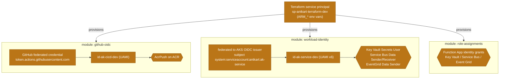
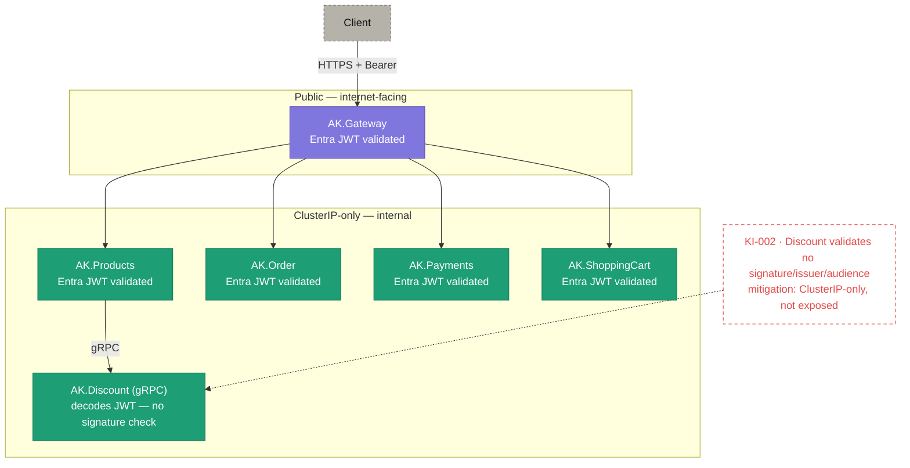
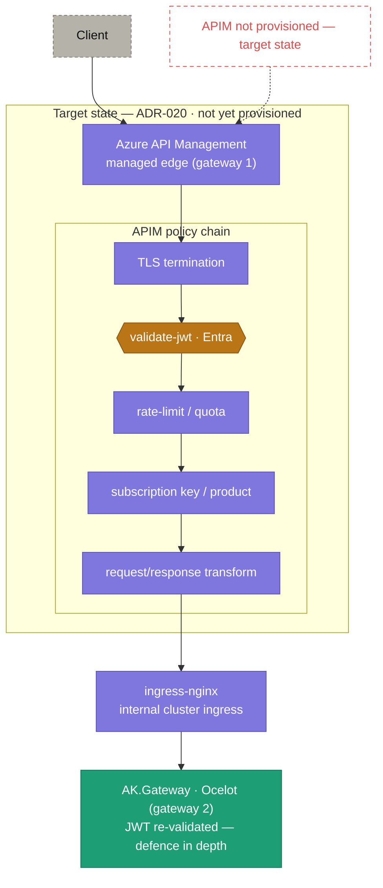

# Security — how it is trusted

> **Diagrams pending review:** _Identity and trust chain_, _Security posture_, and _APIM edge_ are carried across as-is and will be reworked.

Security rests on two ideas: **no stored secrets anywhere**, and **defence in depth** on tokens. Every identity — provisioning, CI/CD, and the six runtime services — authenticates through federation and holds least-privilege RBAC grants, never a key or connection string. The Entra bearer token is validated at the edge and again inside each service. One real gap remains (the Discount gRPC service), openly tracked, and the managed edge (APIM) is a planned addition in front of what already validates.

## Identity and trust chain

From the Terraform service principal, through the real Terraform modules, to the identities and grants they create — secret-lessly.

**What to notice**

- **One provisioning identity:** the `sp-antkart-terraform-dev` service principal (authenticated via `ARM_*` env vars) creates all three identity modules; it is the only credential-bearing principal, and it lives outside the running platform.
- **CI/CD gets exactly one privilege:** `github-oidc` mints `id-ak-cicd-dev` with **AcrPush only** — it can push images, nothing else, and holds no secret (GitHub OIDC federation).
- **Runtime is per-service and least-privilege:** `workload-identity` creates six `id-ak-<service>-dev` UAMIs, each federated to the **AKS OIDC issuer** for its own ServiceAccount subject, granted only the data-plane roles it needs. (The token exchange itself is the [Workload identity token flow](3-kubernetes.md) in the Kubernetes section.)
- **The Function App is separate:** `role-assignments` grants the Function App's identity its Key Vault / Service Bus / Event Grid roles — a distinct path from the six cluster services.
- **No stored secrets anywhere in the chain** — every arrow is a federation or an RBAC grant, not a key hand-off.

## Security posture

**What to notice**

- **Exactly one thing is public:** only `AK.Gateway` is internet-facing (behind the ingress); the five backing services are **ClusterIP-only** and unreachable from outside the cluster.
- **Defence in depth on tokens:** the Entra bearer token is validated at the gateway **and again** inside each REST service — the gateway is not a trust boundary the services rely on.
- **KI-002 (red):** `AK.Discount` (gRPC) **decodes** the JWT but does **not** verify signature, issuer, audience, or expiry — a real gap, drawn as a red-dashed annotation.
- **Why KI-002 is only Medium today:** Discount is ClusterIP-only and reached solely by `AK.Products` over cluster DNS, so the weak check is not externally reachable — the mitigation, not a fix.

## APIM edge (target state)

**Target state per [ADR-020](../adr/ADR-020-api-management-managed-edge-gateway.md) — Azure API Management is NOT yet provisioned.**

**What to notice**

- **This is a plan, not the running system** — the red-dashed gap marks APIM as **not provisioned**; today traffic goes straight to `ingress-nginx` (the [Network and traffic path](2-azure-services.md) in the Azure services section).
- **Two gateways, sequenced not competing:** APIM (the managed **edge**) sits in front of the cluster's internal ingress + `AK.Gateway` (the **routing** gateway) — layered, per ADR-020.
- **The edge owns cross-cutting concerns:** TLS termination, `validate-jwt`, rate-limit/quota, subscription keys/products, and request/response transformation move to APIM's policy chain.
- **In-service JWT validation stays:** `AK.Gateway` (and each service) **re-validates** the token — APIM is added in front of, not trusted in place of, the existing checks.

## How it was built

- Identity and access concepts (Entra, tokens, roles): [Identity concepts](../guides/identity-concepts.md).
- The client authorization-code + PKCE flow: [OAuth2 PKCE](../guides/oauth2-pkce-concepts.md).
- Network boundaries and traffic isolation: [Networking concepts](../guides/networking-concepts.md).
- Security conventions in code (never trust the client, ownership checks, DTO hygiene): the Security Conventions section of the root instructions and each service's technical design.

## Decisions

- [ADR-017 — Entra ID, Azure Functions, and Event Grid](../adr/ADR-017-entra-id-functions-eventgrid.md)
- [ADR-020 — API Management as the Managed Edge Gateway](../adr/ADR-020-api-management-managed-edge-gateway.md) _(planned)_
- [ADR-021 — Retire the Dedicated Identity Service for Microsoft Entra ID](../adr/ADR-021-retire-identity-service-for-entra.md)

## Open items

- [KI-002 — AK.Discount gRPC does not fully validate the JWT](../KNOWN_ISSUES.md): signature, issuer, and audience are not verified; mitigated today by Discount being ClusterIP-only. Its resolution is tracked with the security work on the [Roadmap](../ROADMAP.md).
- **Azure API Management** (the managed edge that would centralise TLS, `validate-jwt`, and rate-limiting) is planned — see [ADR-020](../adr/ADR-020-api-management-managed-edge-gateway.md).
