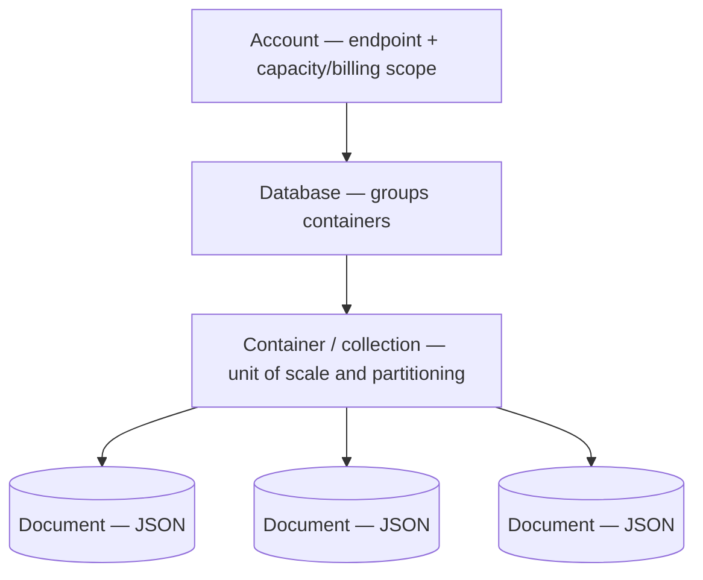
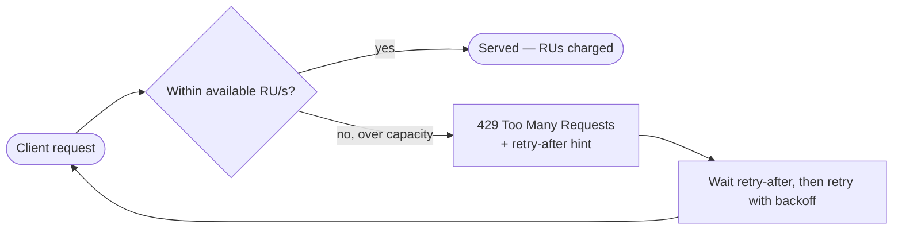
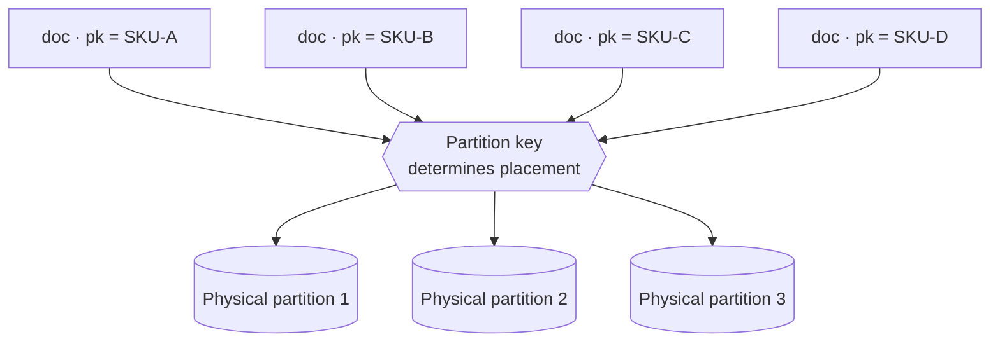
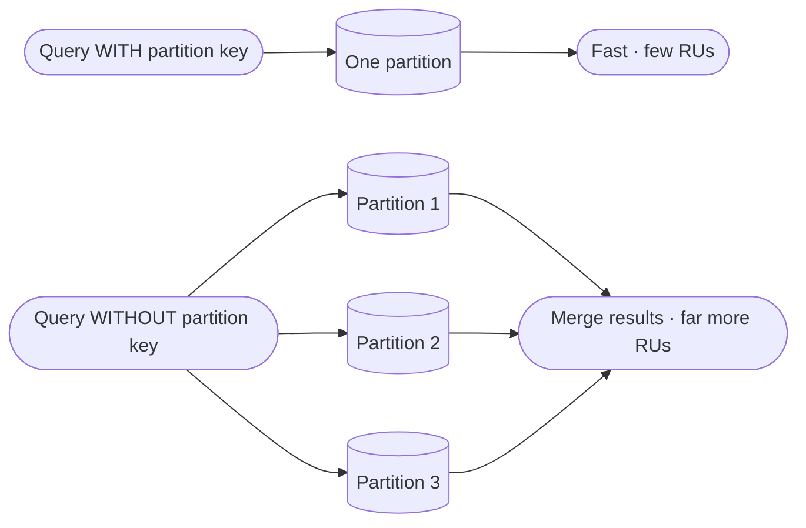

# Azure Cosmos DB Concepts — Primer

A learner-friendly reference for the Cosmos DB ideas behind the platform's data layer. It explains the concepts first, then shows how they shape the way the database is provisioned and used. No prior Cosmos DB experience is assumed.

---

## 1. What Cosmos DB Is

**Azure Cosmos DB** is Azure's **fully-managed NoSQL database**. "Fully-managed" means there are **no servers to run or patch** — Azure handles the machines, **replication**, and **backups** — and the database **scales horizontally** (it spreads data and load across many machines rather than relying on one bigger machine).

"NoSQL" here means it stores **documents** (JSON records) rather than rows in fixed tables, so each record can carry its own shape.

The resources form a simple hierarchy:

```
Account            the top-level Cosmos resource (an endpoint + billing/capacity scope)
└── Database       a logical grouping of containers
    └── Container  (a.k.a. collection) — where documents live; the unit of scale
        └── Documents  the individual JSON records
```

- **Account** — the thing you create in Azure; it has a connection endpoint and is where the capacity/billing model is chosen.
- **Database** — a namespace that groups related containers.
- **Container** (called a **collection** in the MongoDB API) — holds the documents and is the unit that scales and is partitioned.
- **Documents** — the actual JSON records you read and write.



---

## 2. The Multi-API Model

A Cosmos **account** can speak several different **wire protocols** (the "language" a database driver talks over the network):

- **Native NoSQL** (Cosmos's own API)
- **MongoDB**
- **Cassandra**
- **Gremlin** (graph)
- **Table**

You pick one API per account. Choosing the **MongoDB API** means **existing MongoDB driver code works against Cosmos by changing only the connection string** — the application's data-access layer doesn't change. Cosmos presents itself on the wire as if it were MongoDB, so the same drivers, queries, and models carry over.

> **Be honest about the trade-off:** the MongoDB API is **protocol-compatible**, not actual MongoDB. Cosmos implements the MongoDB wire protocol on top of its own engine, so there are **minor feature differences** (some operators, aggregation stages, or server features may behave slightly differently or be unsupported). For typical CRUD and common queries it is a drop-in; for exotic features, verify support.

---

## 3. Request Units (RUs)

Cosmos has **one currency for all database work: the Request Unit (RU)**. Rather than expose CPU, memory, and IO separately, Cosmos **bundles them into a single number** — every operation "costs" some RUs.

> **Analogy — electricity (kWh).** Your home runs many different appliances — a kettle, a fridge, a laptop charger — and they all draw from the same meter, measured in one unit: **kilowatt-hours**. You don't track CPU-volts and IO-amps separately; you just pay for kWh. RUs are the same idea for a database: **every operation consumes RUs the way every appliance consumes electricity**.

Rough benchmarks (they vary with document size and indexing):

| Operation | Typical cost |
|-----------|--------------|
| **Point read** (fetch one ~1 KB document by its id) | **1 RU** |
| **Write** (insert/replace a small document) | **~5+ RUs** |
| **Complex query** (filters, sorts, scans across documents) | **tens to hundreds of RUs** |

**Capacity** is simply **how many RUs per second (RU/s) you have available to spend.** If your workload needs 400 RU/s and you have at least that available, requests succeed; spend faster than your capacity and Cosmos pushes back (see Throttling below).

---

## 4. Provisioned vs Serverless

There are two **capacity / billing models** for an account:

> **Analogy — fixed rent vs pay-per-use.** **Provisioned** throughput is like renting a flat on a **fixed monthly rent**: you reserve `N` RU/s and pay for it **24/7, even when the database sits idle**. **Serverless** is like a **prepaid, pay-only-for-what-you-use** plan: you are billed **per operation**, for exactly the RUs each request consumes, with **near-zero cost when idle**.

- **Provisioned** — reserve a fixed RU/s, billed continuously. Right for **steady production traffic**, where the capacity is used most of the time and predictable performance matters.
- **Serverless** — pay per request, no idle charge. Right for **spiky, mostly-idle workloads** (development, intermittent or bursty usage) where paying 24/7 for reserved capacity would be wasteful.

| | Provisioned | Serverless |
|---|---|---|
| Billing | Reserved RU/s, billed 24/7 | Per-operation RUs consumed |
| Idle cost | Pays even when idle | Near zero |
| Best for | Steady, predictable production load | Spiky, mostly-idle dev/intermittent load |
| Capacity ceiling | High (scales to very large RU/s) | Capped (per-container throughput and storage limits) |

> **Serverless limits:** serverless caps the maximum throughput per container and the total storage per container. These ceilings are **comfortably fine for development** and intermittent workloads; a high-traffic production workload that needs guaranteed high throughput is the case for provisioned.

---

## 5. Throttling (HTTP 429)

When requests arrive faster than the available throughput can serve, Cosmos does **not** quietly slow everything down. Instead it **rejects the excess requests with HTTP `429 Too Many Requests`**, along with a **`retry-after`** hint telling the client how long to wait before trying again.

This is by design: the client is **expected to retry with backoff**. A short, transient burst that exceeds capacity results in a few 429s and automatic retries, not a failure — provided the client honours the retry-after hint.



> The platform's **resilience policies** handle exactly this: retry-with-backoff (and circuit breaking) around outbound calls means transient `429`s are retried transparently rather than surfacing as user-facing errors. See the [Fault Tolerance with Polly ADR](../adr/ADR-003-fault-tolerance-with-polly.md).

---

## 6. Partition Key Fundamentals

Cosmos scales a container by spreading its documents across **physical partitions** (independent slices of storage and throughput). It decides which partition a document belongs to using its **partition key** — a field you choose on the container.

> **Analogy — post-office PIN-code sorting.** A sorting office routes every letter by its **PIN/ZIP code** so the work spreads evenly across many bins and any address can be found quickly. The **partition key is that code**: Cosmos uses it to decide which partition (bin) each document goes to, and to find documents fast later.



A **good partition key**:

- **Has high cardinality** — many distinct values (e.g. a product id or user id), so documents spread across many partitions rather than piling into a few.
- **Spreads load evenly** — avoids a **"hot partition"** where one key value (or a handful) receives most of the reads/writes, overwhelming a single partition while others sit idle.
- **Aligns with the dominant query patterns** — a query that **includes the partition key** routes to **one partition** (cheap, fast). A query **without** it must **fan out across all partitions** and merge the results, costing **far more RUs**.



**The trade-off mindset:** the ideal key both distributes data evenly *and* matches how the data is most often queried — sometimes those pull in different directions, and the choice is a judgement call. The **concrete partition-key choice for each container is made during the data-migration work**, where the real query patterns are known.

---

## 7. How This Maps to Our Design

For the **product catalog**, the platform uses a **serverless Cosmos DB account with the MongoDB API**:

- **Serverless** — the development workload is **spiky and mostly idle**, so paying per operation with near-zero idle cost fits far better than reserving provisioned throughput billed 24/7. The serverless caps are well within what dev needs.
- **MongoDB API** — the catalog's data-access code was already written against MongoDB, so the MongoDB API lets that code **carry over unchanged**: only the connection string changes, not the data layer.

The two choices line up neatly: serverless keeps the dev database cheap and hands-off, and the MongoDB API keeps the application code the same while moving the store to a fully-managed cloud database.

---

This primer supports the **Cosmos DB** step of the [Infrastructure Guide](infrastructure-guide.md), where these concepts become the actual Cosmos account and database.

---

**Navigation:** [← Development Guide](../../DevelopmentGuide.md) · **Applied in:** [Infrastructure Guide](infrastructure-guide.md)
