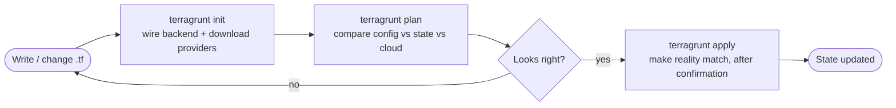

# Infrastructure as Code: Terraform & Terragrunt — Concepts

A learner-friendly reference for the Infrastructure-as-Code (IaC) foundations the platform's cloud provisioning is built on. Read this first if Terraform and Terragrunt are new to you; the per-resource walkthroughs in the [Infrastructure Guide](infrastructure-guide.md) assume these ideas.

---

## 1. What Infrastructure as Code Is

**Infrastructure as Code (IaC)** means describing your cloud environment — networks, databases, identities, hosting — in **text files kept in version control**, and letting a tool create and update the real resources to match. Instead of clicking through a portal (which nobody can review, repeat, or audit), the environment is **declared** and **applied**.

Why it matters:

- **Reproducible** — the same files build the same environment every time, on any machine or pipeline.
- **Reviewable** — changes are code changes: diffed, reviewed, and approved before they touch anything.
- **Auditable & version-controlled** — every change has a commit, an author, and a history.
- **Declarative** — you describe the *desired end state*; the tool figures out the steps to get there.

---

## 2. Terraform vs. Terragrunt

These are two tools that work together — they are not alternatives.

- **Terraform** is the engine. You write `.tf` files that declare **resources** (a virtual network, a database, a role assignment); Terraform talks to the cloud provider to create, change, or delete them so reality matches the files.
- **Terragrunt** is a thin **wrapper around Terraform** that removes repetition. On its own, Terraform makes you copy the same backend configuration, provider setup, and version pins into every component. Terragrunt lets you write those **once** and have every component **inherit** them, and it adds **dependencies** between components so they apply in the right order.

> **In one line:** Terraform *builds the resources*; Terragrunt *keeps the setup DRY and ordered*.

---

## 3. State and Remote Backends

Terraform keeps a **state file** — the **source-of-truth mapping between your code and the real resources** it created. State records each resource's identity and attributes, so Terraform knows what already exists, what to change, and what to delete. Without state, Terraform couldn't tell "create this" apart from "this already exists."

By default state is a **local file**, which is fragile: it lives on one machine, is easily lost, and can't be shared. So state is kept in a **remote backend** — a shared, durable store (for this platform, an Azure Storage account):

- **Shared** — everyone (and every pipeline) reads and writes one authoritative copy.
- **Durable** — protected by the storage account's redundancy, not a single laptop.
- **Locked** — while one `apply` runs, the state is **locked** so a second can't run at the same time and corrupt it.

A single shared, locked state is also what prevents **configuration drift** — there is one place that records what really exists, that everyone plans against.

---

## 4. Modules vs. Environments

A clean IaC layout separates **how** something is built from **what** values a given environment uses:

- A **module** is a reusable definition of **how** a resource is built — its inputs, the resource(s), and its outputs — with **no environment-specific values baked in**. (Think: "how to build a resource group.")
- An **environment** (the live configuration) supplies **what** — this environment's names, sizes, and settings — and **reuses** the module. (Think: "the dev resource group is named X, in region Y.")

This keeps the definition in **one place** (DRY) and makes environments **structurally identical** — dev and any future environment run the *same* modules and differ only in their inputs. In this repository that split is `infrastructure/modules/` (the how) and `infrastructure/environments/<env>/` (the what).

---

## 5. The plan / apply Workflow

Every change follows the same safe loop:

- **`init`** — wires up the backend and downloads the providers a unit needs. Run on first use or after backend/module changes.
- **`plan`** — a **safe, read-only** comparison of your configuration against the state and the real cloud. It changes **nothing** and shows exactly what *would* change. Always run it before applying. `No changes` means config, state, and reality all agree — the confirmation of health.
- **`apply`** — executes the plan, **after explicit confirmation**, and updates the state.

The golden rule: **`plan` before `apply`, every time** — you never change infrastructure without first seeing precisely what will change.

---

This primer underpins the [Infrastructure Guide](infrastructure-guide.md), whose numbered steps build real resources using exactly these concepts.

---

**Navigation:** [← Development Guide](../../DevelopmentGuide.md) · **Next:** [Infrastructure Guide](infrastructure-guide.md) · **Related:** [Networking & Kubernetes](networking-concepts.md), [Identity](identity-concepts.md)
