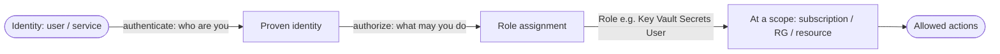
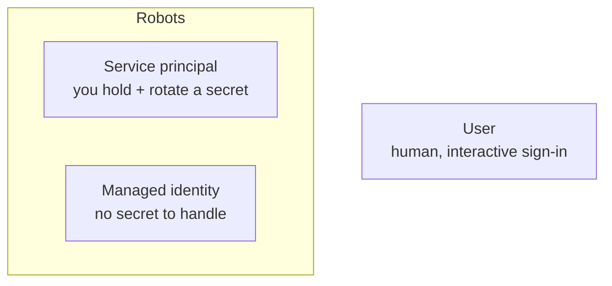
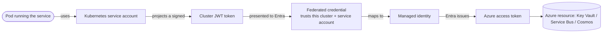
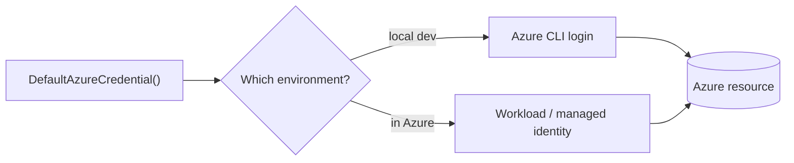

# Identity: Entra ID, Managed Identities & Workload Identity — Concepts

A learner-friendly reference for the identity and access model behind the platform. It builds from the foundations (tenant, authentication, RBAC) up to the goal: **code that runs in the cloud authenticating with no stored secret**. No prior identity experience is assumed.

---

## 1. Foundations — Tenant, Auth, and RBAC

Two boundaries, kept distinct:

- **Tenant (directory)** — the **identity** boundary. It holds users, groups, service principals, and app registrations. It answers *"who are you?"*
- **Subscription** — the **resource / billing** boundary. It holds and pays for the resources you create. It answers *"where do resources live and who pays?"*

One tenant can contain many subscriptions; each subscription belongs to exactly one tenant.

Two distinct questions, often confused:

- **Authentication** — *who are you?* Proving identity (a user signs in; a service presents a credential or token).
- **Authorization** — *what may you do?* Granted by **RBAC (role-based access control)**: a **role** (a set of permissions) is assigned to an **identity** at a **scope** (a subscription, resource group, or single resource). Authenticating proves who you are; it grants nothing until a role assignment says what you may do.

---

## 2. Tokens and Claims

When an identity authenticates, it receives a **JWT (JSON Web Token) access token** — a signed, time-limited credential it presents on each request. The token carries **claims**: facts about the caller that applications read to make decisions.

Key fields:

- **Issuer (`iss`)** — who minted the token (the trusted identity provider). The application checks it came from the issuer it trusts.
- **Audience (`aud`)** — who the token is *for* (the API it is meant to be presented to). An API validates the audience so a token minted for another service can't be replayed against it.
- **Claims the app reads** — for example the **object id (`oid`)** that stably identifies the caller, and **`roles`** the caller holds.

Applications enforce authorization by **reading claims**: "does this token's `roles` claim include `admin`?" The token is trusted because it is **cryptographically signed** by the issuer and **validated** (signature, issuer, audience, expiry) before any claim is believed.

---

## 3. App Registrations

Registering an application in Entra ID creates **two things at once**:

- **An identity** — the application now has its own identity in the directory (with a client id), so it can authenticate and be granted access just like a user can.
- **A contract** — the registration defines how the app participates in auth: its **app roles** (e.g. `admin`, `user`) that can be assigned to callers, and the **audience** value that APIs validate tokens against.

So an app registration is both *"this application exists as an identity"* and *"here are the roles and the audience that define how tokens for it work."* Application code then validates incoming tokens against this contract — right audience, expected issuer, required roles.

---

## 4. Human vs Robot Identities

Not every identity is a person. Three kinds matter:

- **User** — a human's account; signs in interactively (often with MFA).
- **Service principal (SP)** — a **registered robot identity** with a **credential you manage** (a secret or certificate). Automation authenticates as the SP. Because the credential is yours to hold, **you must store it safely and rotate it**.
- **Managed identity** — an **Azure-managed robot identity** attached to an Azure resource, with **no credential for you to handle at all**. The platform mints and rotates the tokens for the resource automatically.

**Service principal vs managed identity:**

| | Service principal | Managed identity |
|---|---|---|
| Who manages the secret | **You** (store it, protect it) | **Azure** (none exposed to you) |
| Rotation | **Your responsibility** | **Automatic** |
| Where usable | Anywhere (local, CI, other clouds) | **Only from an Azure resource** it's attached to |
| Choose when | Running **outside** Azure (a pipeline, a dev machine, cross-cloud) | Running **on an Azure resource** (a Function, a VM, an AKS workload) |

The rule of thumb: **if the code runs on an Azure resource, prefer a managed identity** — there is no secret to leak. Reach for a service principal when the code runs somewhere Azure can't mint a token for it directly.

---

## 5. Workload Identity Federation — No Stored Secret in the Cluster

Managed identities are wonderful, but historically a workload **inside Kubernetes** couldn't simply *be* a managed identity. **Workload identity federation** closes that gap: it lets a Kubernetes pod **exchange the token its own cluster already gives it** for an Azure token tied to a managed identity — **with no secret stored anywhere**.

Step by step, what is exchanged at each hop:

1. **Pod → service account** — the pod runs *as* a Kubernetes **service account**.
2. **Service account → cluster token** — the cluster **projects a short-lived, signed JWT** for that service account into the pod.
3. **Cluster token → federated credential** — the pod presents that JWT to Entra; a **federated credential** on the managed identity says *"I trust tokens from this cluster issued for this service account."*
4. **Federated credential → managed identity** — Entra accepts the trade and treats the request as that **managed identity**.
5. **Managed identity → Azure token** — Entra **issues an Azure access token** for the managed identity.
6. **Azure token → resource** — the code uses that token to call the **Azure resource**, authorized by the managed identity's RBAC roles.

The result: **code in the cluster authenticates to Azure with no client secret, no certificate, nothing stored** — the trust is established by configuration (the federated credential), and the tokens are short-lived and minted on demand.

---

## 6. DefaultAzureCredential — One Pattern, Every Environment

Writing different auth code for "local dev" vs "in the cloud" is error-prone. **`DefaultAzureCredential`** (from the Azure SDKs) solves it with **one code pattern** that **tries a chain of credential sources** and uses the first that works:

- **Locally**, it resolves to the **developer's CLI login** (`az login`) — you just sign in once.
- **In the cloud**, it resolves to the **workload / managed identity** of the resource the code runs on.

**Same code, no secrets, the environment decides.** The application never embeds a credential; it asks `DefaultAzureCredential` for a token and the platform supplies one appropriate to where it is running.

---

## 7. How This Maps to Our Design

- **Provisioning** uses a **least-privilege automation identity** (a service principal with only the roles it needs) to build the infrastructure — it runs outside Azure (a developer machine or pipeline), which is exactly the service-principal case.
- **Each service** gets its **own managed identity**, granted just the **data-plane roles** it needs (for example, read a secret in **Key Vault**, send/receive on **Service Bus**) — least privilege, per service.
- **Workload identity federation** is wired once the **cluster** exists, so each service's pods authenticate as their managed identity **with no stored secret**.
- The platform's **data planes accept Entra identities only** — local/shared-key authentication is disabled across the board, so there are **no connection-string secrets** anywhere; every access is a short-lived, identity-minted token.

---

This primer supports the **Terraform identity**, **Entra ID app registration**, and **managed identity / workload identity** steps of the [Infrastructure Guide](infrastructure-guide.md).
