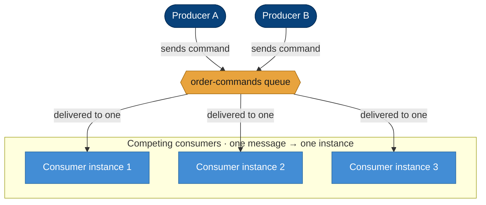
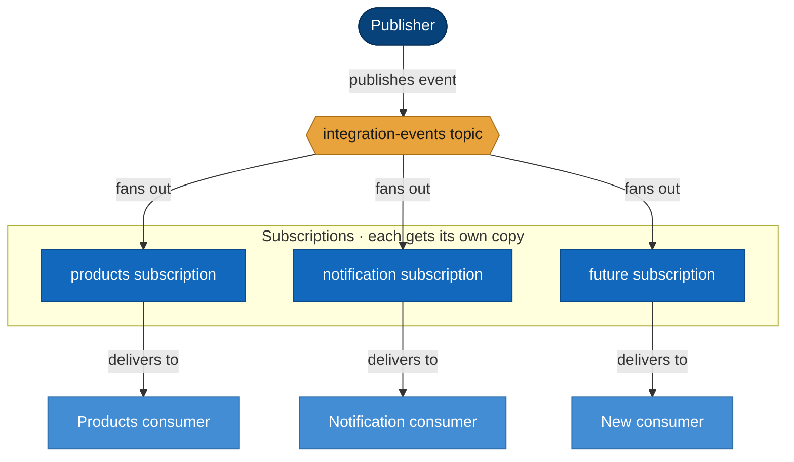
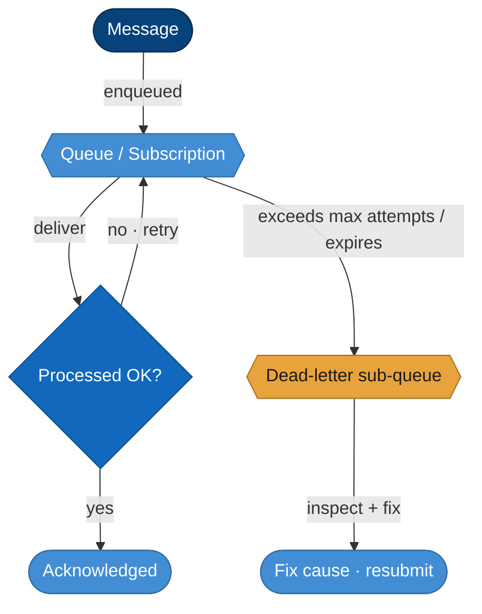

# Reliable Messaging with Azure Service Bus — Concepts

A learner-friendly reference for the messaging ideas behind the platform. It explains *why* a message broker exists, the two core messaging shapes, the delivery guarantees you must design for, and how it all maps to the platform's design. No prior messaging experience is assumed.

---

## 1. What a Message Broker Is — and Why Distributed Services Need One

A **message broker** is a service that sits **between** the components that produce work and the components that do it. Instead of one service calling another directly, the producer hands a **message** to the broker, and the broker holds it until a consumer is ready to process it.

> **Analogy — a courier depot.** A sender drops a parcel at the depot and leaves. The depot **holds the parcel safely** until a courier is free to deliver it. The sender and the courier **never have to be present at the same time**, and if all couriers are busy the parcels simply **wait** rather than being lost. The depot is the broker.

This buys three things that distributed systems badly need:

- **Decoupling** — the producer doesn't need to know who consumes the message, where they are, or whether they're online right now. It just sends.
- **Buffering** — a sudden burst of work piles up safely in the broker and is drained at the consumer's pace, instead of overwhelming it.
- **Reliability** — a message persisted in the broker survives a consumer crash or restart; it is delivered when the consumer comes back, so work is not lost.

A direct HTTP call has none of these: if the callee is down or slow, the caller fails or blocks. Messaging turns a fragile synchronous chain into a durable, asynchronous handoff.

---

## 2. Queue — Point-to-Point / Competing Consumers

A **queue** delivers each message to **exactly one** consumer. If several consumer instances read from the same queue, they **compete** — each message goes to whichever instance grabs it first, so the work is shared and never done twice.

This is the right shape for **commands** — "do this specific thing" — because a command has **exactly one owner**: placing an order, charging a payment, reserving stock. You do not want two instances both charging the same payment, and competing consumers guarantee they won't. Scaling out simply adds more instances that share the load.

---

## 3. Topic + Subscriptions — Publish/Subscribe

A **topic** looks like a queue to the publisher, but underneath it **fans out**: every **subscription** attached to the topic receives **its own independent copy** of each published message. Consumers read from their subscription, not from the topic directly.

This is the right shape for **integration events** — "this happened" — because an event has **many independent listeners**. When an order is placed, Products wants to reserve stock *and* Notification wants to email the customer; each reads its own copy and neither affects the other. Adding a new listener is just **adding a subscription** — publishers don't change.

> **Rule of thumb: commands have one owner → use a queue. Events have many listeners → use a topic with subscriptions.**

---

## 4. Delivery Guarantees — At-Least-Once and Idempotency

Service Bus guarantees **at-least-once** delivery: every message is delivered *at least* once, which means it may **occasionally be delivered more than once**.

Why duplicates happen: a consumer receives a message, **processes it successfully**, but **crashes (or times out) before acknowledging** it. The broker never saw the acknowledgement, so — correctly erring on the side of not losing work — it **redelivers** the message to another instance. The work runs twice.

The defence is **idempotency**: design each consumer so that **processing the same message twice has the same effect as processing it once**. For example, key the operation on the message/order id and check "have I already done this?" before acting.

> **Outbox / inbox pattern.** A common, robust way to get idempotency end-to-end: a producer writes the message to an **outbox** in the same database transaction as its business change (so the event can't be lost or sent without the change), and a consumer records processed message ids in an **inbox** so a redelivered duplicate is recognized and skipped. Together they make the pipeline safe against both lost and duplicated messages.

---

## 5. Dead-Lettering — Nothing Is Silently Lost

What if a message **can't** be processed — a poison message that fails every time, or one that expires before anyone handles it? Service Bus does not drop it. Every queue and subscription has a built-in **dead-letter sub-queue (DLQ)**. After a message exceeds its **max delivery attempts** (or its time-to-live), it is moved to the DLQ.

Dead-lettered messages can be **inspected** (what was the payload? why did it fail?), the **root cause fixed**, and the messages **resubmitted** — so a bad message is a problem you can see and recover from, never a silent data loss.

---

## 6. Tiers — Basic vs Standard vs Premium

| Tier | What you get | Use when |
|------|--------------|----------|
| **Basic** | **Queues only** (no topics) | Simple point-to-point work, no pub/sub |
| **Standard** | Queues **and topics/subscriptions**; shared capacity; billed per operation | Any workload that needs **pub/sub** (events with many listeners) |
| **Premium** | **Dedicated** capacity, predictable performance, higher throughput, VNet integration | High-volume or latency-sensitive production messaging |

Because pub/sub (topics) is essential for integration events with many listeners, a platform that publishes events needs **Standard or higher** — **Basic cannot do topics**.

---

## 7. Service Bus vs Event Grid vs Event Hubs

Azure has three messaging services for three different jobs. Choosing the right one is mostly about **what the data is** and **how it must be delivered**.

| Service | Model | Delivery | Typical use | Example |
|---------|-------|----------|-------------|---------|
| **Service Bus** | Broker; consumers **pull** | Reliable, ordered-capable, **at-least-once**, dead-lettering | Work that **must not be lost** — commands and business data | "Charge this payment" / "Order placed" event |
| **Event Grid** | Eventing; **pushes** to handlers | Near-real-time, retry with backoff, dead-letter to storage | **Lightweight reactive notifications** that something happened | "A blob was uploaded" → wake a handler |
| **Event Hubs** | Streaming pipe | High-throughput, partitioned, replayable stream | **High-volume telemetry / event streaming** | Millions of clickstream or IoT events per minute |

The short version: **Service Bus when losing the message is unacceptable; Event Grid for cheap push notifications; Event Hubs for firehose-scale streams.**

---

## 8. How This Maps to Our Design

The platform provisions a **Service Bus namespace** (Standard tier, because it uses pub/sub) containing:

- an **`order-commands` queue** — commands with a single owner (competing consumers process each exactly once);
- an **`integration-events` topic** with **per-service subscriptions** (e.g. `products`, `notification`) — events fan out, each consumer reading its own copy;
- **dead-lettering** on every entity, so failed messages are recoverable, not lost.

Crucially, the **data plane accepts Microsoft Entra identities only** — local SAS authentication is disabled, so there are **no connection-string secrets**. Each service authenticates with **its own identity** (token auth) and is granted the Service Bus data-plane roles it needs. This keeps the messaging backbone consistent with the platform's secret-less security model.

---

This primer supports the **Service Bus** step of the [Infrastructure Guide](infrastructure-guide.md), where these concepts become the actual namespace, queue, topic, and subscriptions.

---

**Navigation:** [← Development Guide](../../DevelopmentGuide.md) · **Applied in:** [Infrastructure Guide](infrastructure-guide.md) · **Related:** [Serverless & Eventing](serverless-eventing-concepts.md)
