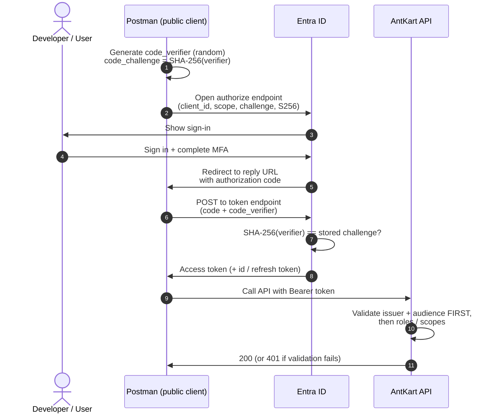

# OAuth2 Authorization Code + PKCE — Concepts

A first-principles guide to how an **interactive client** (such as Postman) obtains a **delegated user access token** from Microsoft Entra ID and uses it to call the AntKart API. It assumes **no prior OAuth knowledge** — it builds from the problem, to the idea, to the mechanics, to the exact fields you fill in.

---

## 1. The problem in one paragraph

When a program signs a user in, the user is sent to the identity provider, signs in there, and the provider hands back a short **authorization code** — a one-time claim ticket the program then exchanges for an access token. A confidential server app proves it's the legitimate one making that exchange by also presenting a **client secret** (a password baked into the server). A **public client** — Postman, a single-page app, a mobile or desktop app — **cannot keep a secret**: its code runs on the user's machine where anyone can read it, so any "secret" inside it is already public. That leaves a dangerous gap: if a public client can't prove who it is, then **anyone who steals the authorization code** (from a redirect URL, a log, the browser history) could redeem it for a token and impersonate the user. Think of the code as a coat-check claim ticket — without extra protection, whoever holds the ticket walks away with the coat.

**PKCE** (Proof Key for Code Exchange, pronounced "pixy") closes that gap **without a stored secret**.

---

## 2. What PKCE does

PKCE replaces the *stored* secret with a *one-time* secret the client invents fresh for each sign-in:

- **`code_verifier`** — a new, random, high-entropy string the client generates **per request** and keeps in memory for the duration of that one sign-in. It is never sent in the redirect.
- **`code_challenge`** — a hash of the verifier: `code_challenge = BASE64URL(SHA-256(code_verifier))`, advertised with `code_challenge_method = S256`. This is the only form the network sees up front.

The flow uses them like a one-time password set at drop-off:

1. At the **start**, the client sends the **challenge** (the hash) to the authorize endpoint. Entra stores the challenge alongside the authorization code it will issue.
2. At the **token exchange**, the client sends the **verifier** (the original string). Entra computes `SHA-256` of it, BASE64URL-encodes the result, and checks it **equals the stored challenge**. Only the client that created the verifier can produce a value that matches.

A stolen authorization code is now useless on its own: redeeming it also requires the matching verifier, which never left the client. In one line: **PKCE is a one-time secret you create per transaction, instead of one you must store and protect forever.** The hash is one-way, so seeing the challenge tells an attacker nothing about the verifier.

---

## 3. Why interactive, not client-credentials

OAuth offers a simpler-looking flow — **client credentials** — where an app authenticates as *itself* with a secret and gets a token with no human involved. It is the wrong tool here, for three connected reasons:

- **No human, so no MFA.** Client credentials is app-to-app. There is no sign-in screen, so **multi-factor authentication cannot apply**. The AntKart tenant **enforces MFA**, which only happens during an interactive user sign-in.
- **No user in the token.** A client-credentials token carries only **application permissions** — it represents the app, not a person. It has no signed-in user identity behind it.
- **AntKart authorizes on the user plus app roles.** The API decides what a caller may do from the **signed-in user** and the **roles** they hold (the flat `roles` claim). A token with no user behind it can't satisfy that model.

So obtaining a **delegated (on-behalf-of-the-user) token through interactive sign-in** is the only flow that both satisfies the tenant's MFA requirement and produces a token AntKart can authorize. Authorization Code + PKCE is exactly that flow, done safely from a public client.

---

## 4. The picture: the flow end to end

The order matters: the challenge is committed **before** the user signs in, and the verifier is proven **at** the exchange — so the code alone is never enough. And the API checks **who the token is for** before it checks **what the caller may do**.

---

## 5. Every Postman field, explained

In Postman, on the request (or collection) **Authorization** tab, choose **OAuth 2.0** and fill in:

| Field | What to enter | Why |
|-------|---------------|-----|
| **Grant Type** | `Authorization Code (With PKCE)` | Selects the interactive flow that supports a public client + PKCE. |
| **Callback URL** | `https://oauth.pstmn.io/v1/callback` | Where Entra returns the authorization code; must exactly match a reply URL registered on the client app. |
| **Auth URL** | `https://login.microsoftonline.com/<tenant-id>/oauth2/v2.0/authorize` | The endpoint that shows the sign-in and issues the code. |
| **Access Token URL** | `https://login.microsoftonline.com/<tenant-id>/oauth2/v2.0/token` | The endpoint that exchanges the code (+ verifier) for the token. |
| **Client ID** | `<postman-client-id>` | The public client application's id — *not* the API's id. |
| **Client Secret** | *(leave blank)* | A public client has no secret; PKCE replaces it. |
| **Code Challenge Method** | `S256` | Use SHA-256 hashing for the challenge (never `plain`). |
| **Code Verifier** | *(leave blank)* | Postman generates a fresh verifier per request automatically. |
| **Scope** | `api://<api-app-id-uri>/access_as_user openid profile offline_access` | What you're asking for — and, crucially, it decides the token's **audience** (see below). |
| **Client Authentication** | `Send client credentials in body` | How Postman calls the token endpoint; correct for a public client redeeming with PKCE and no secret. |

Click **Get New Access Token**, complete the sign-in and MFA in the browser window, and Postman stores the returned token for subsequent requests.

---

## 6. The most common mistake: the audience (`aud`) claim

The single field that most often causes "it signs in fine but every call returns 401" is **Scope** — because **the scope you request decides the token's audience**.

- Request `api://<api-app-id-uri>/access_as_user` → the token's **`aud`** is the AntKart API. Calls succeed.
- Request only a Microsoft Graph scope (for example `User.Read`) → you still complete sign-in and receive a **perfectly valid-looking token**, but its **`aud` is Microsoft Graph, not AntKart**. Every AntKart call returns **401 Unauthorized** — and it fails *before* any role check.

This happens because the API validates the token in a fixed order: it checks the **issuer** and **audience first**, and only if those pass does it ever look at scopes or roles. A token addressed to a different service never gets that far. Put plainly:

> **Audience is the lock on the door; scopes and roles are what you may do once you're inside.** A token for the wrong door doesn't open it, no matter what it says you may do.

When a call is rejected, **decode the token** — paste it into [jwt.ms](https://jwt.ms) — and confirm two things: the **`aud`** matches the AntKart API's identifier, and the flat **`roles`** claim contains the role the endpoint requires (for example `admin` or `user`).

---

## 7. How AntKart accepts the token

On every request the AntKart API validates the bearer token before running any handler:

- **Issuer** — the token must come from the trusted Entra tenant.
- **Audience** — the token's `aud` must match the API's **registered identifier**: its App ID URI (`api://<api-app-id-uri>`) and/or the API application's **client-id GUID** (`<api-client-id>`). Either accepted form passes; anything else is rejected.
- **Signature and expiry** — the token must be correctly signed by Entra and unexpired.
- **Authorization** — only after the above does the API read the **flat `roles` claim** and apply its role requirements (for example, an admin-only endpoint requires `admin`).

So a token is accepted when it is addressed to this API, issued by the trusted tenant, intact, and carries the role the endpoint needs — exactly what the Authorization Code + PKCE interactive flow produces for a signed-in user.

---

This primer underpins obtaining a delegated user token for end-to-end API testing — see the [Testing index](../test/README.md). For the broader identity model (tenants, tokens, app registrations, managed identities), see [Identity Concepts](identity-concepts.md).

---

**Navigation:** [← Development Guide](../../DevelopmentGuide.md) · **Applied in:** [Testing](../test/README.md) · **Related:** [Identity](identity-concepts.md)
