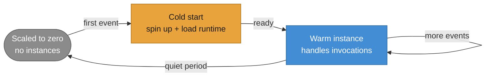
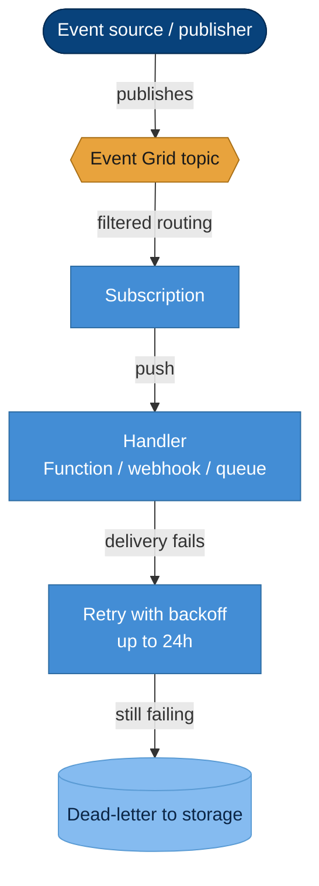
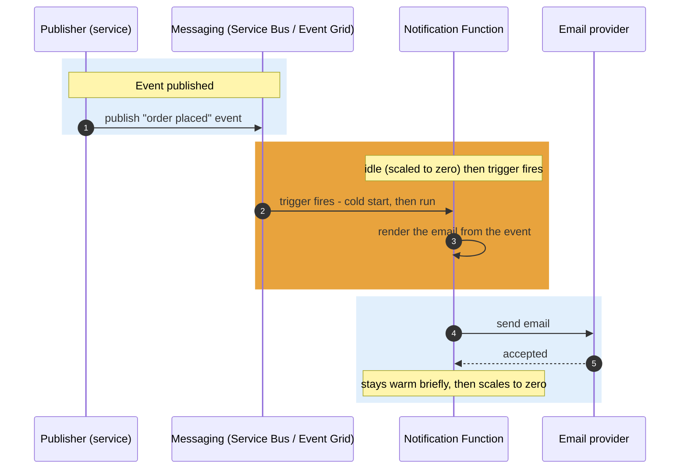

# Azure Functions & Event Grid — Concepts

A first-principles reference for serverless compute and reactive eventing. It explains what "serverless" really means, how Functions are triggered, the instance lifecycle (including cold starts), and how Functions and Event Grid partner to build event-driven features. No prior serverless knowledge is assumed.

---

## 1. What "Serverless" Means

**Serverless** does not mean "no servers" — it means **you don't manage them**. You write and deploy **compiled code**; the platform **hosts it, runs it, scales it, and patches the machines underneath**. You never provision a VM or a container.

Its defining traits:

- **No infrastructure to manage** — no servers or containers to size, patch, or keep alive.
- **Stateless** — each invocation should stand on its own; nothing is kept in memory between calls (state lives in a database, cache, or queue).
- **Pay per execution** — you are billed for the work actually run (executions × time × memory), not for idle time.
- **Auto-scales with demand** — the platform adds instances under load and removes them as it falls — **all the way to zero** when there's nothing to do.

The trade is simple: you give up control over the host in exchange for **zero idle cost and automatic scale**.

---

## 2. The Trigger Model

A Function does **not** get called directly like a method. It **runs in response to a trigger** — an event the platform watches for on your behalf. Each Function declares exactly one trigger.

| Trigger | Fires when… | Concrete example |
|---------|-------------|------------------|
| **HTTP** | an HTTP request hits its URL | A small API endpoint — controller-like, request in, response out. |
| **Timer** | a schedule elapses (cron) | Aggregate a sales report **every 2 hours**. |
| **Queue / Service Bus** | a **message** arrives on a queue/subscription | An order-confirmation message arrives and is processed. |
| **Event Grid** | a **platform or custom event** is published | React to "a resource was created" or a custom domain event. |

> **A common confusion — queue trigger vs blob trigger.** A **queue trigger** fires when a **message lands on a queue**. A **blob trigger** fires when a **file lands in blob storage**. They sound similar but watch different things: one watches a message queue, the other watches a storage container. Pick the trigger that matches the *actual* event you want to react to.

The mental model: **you don't call the Function; an event does.** Your job is to write the handler; the platform wires the trigger and runs it.

---

## 3. The Instance Lifecycle — Cold Starts, Honestly

Functions are hosted on **instances** the platform creates and destroys for you. Understanding their lifecycle explains the one surprise newcomers hit: the occasional slow first call.

- **Cold start** — when no instance is running (the function has been idle), the first event must **spin up an instance and load the runtime and your code** before it can run. That first call pays an added **cold-start delay**.
- **Warm reuse** — once running, an instance is **kept warm and reused** across many invocations, so subsequent calls are fast.
- **Scale to zero** — after an **idle period** the platform removes the instances entirely, so you pay nothing while idle — and the next call after that is a cold start again.

This is the honest trade of serverless: **near-zero idle cost** in exchange for an **occasional cold-start latency** on the first call after quiet.

---

## 4. The Consumption Plan — When Serverless Fits

The **Consumption plan** is the pay-per-execution, scale-to-zero hosting model. It bills for executions and the resources they use, with no charge while idle.

**Serverless fits well when work is:**

- **Event-driven** — it runs in reaction to messages, events, or schedules.
- **Spiky / mostly idle** — bursts of activity separated by quiet, where paying 24/7 for an always-on service would be wasteful.
- **Short-lived** — each unit of work completes quickly and statelessly.

**An always-on service fits better when work is:**

- **Steady and high-volume** — constant traffic means there's no idle time to save, and you'd rather avoid cold starts entirely.
- **Long-running or latency-critical on every call** — where a cold start is unacceptable, or work needs a persistent warm process.

---

## 5. Event Grid — Reactive, Push-Based Eventing

**Event Grid** is a **push-based, near-real-time event router**. Publishers send events to a **topic**; **subscriptions** on that topic route matching events to **handlers** (a Function, a webhook, a queue). Unlike a broker you pull from, Event Grid **pushes** events to handlers as they happen.

Key properties:

- **Near-real-time push** — events are delivered to handlers within moments of being published.
- **Retry with backoff** — if a handler is unavailable, Event Grid **retries with exponential backoff for up to 24 hours**.
- **Dead-lettering** — events that can't be delivered after retries are written to a **storage account** so they aren't lost.

> **A vivid example.** A **flight is cancelled**. The booking system publishes a `FlightCancelled` event; Event Grid **immediately pushes** it to the alert service's handler, which notifies every affected passenger within seconds — no one is polling a database waiting to notice. That immediacy is what push-based eventing buys.

---

## 6. How Functions and Event Grid Partner

Put together, they make a clean event-driven feature: **an event or message arrives, a Function wakes up, does the work, and goes back to sleep.** The platform's **notification flow** is exactly this shape — a message/event triggers a Function that sends the email.

No always-on service waits around for notifications; the Function exists only for the moments it is needed.

---

## 7. How This Maps to Our Design

The platform's **notification capability** runs as a **Consumption-plan Azure Function** triggered by **messaging** — it wakes when an order/payment/registration message arrives, renders and sends the email, and scales back to zero when idle. This suits notification perfectly: the workload is event-driven, spiky, and short-lived, so paying only per execution (and nothing when idle) is the right model.

**Event Grid** demonstrates the **reactive eventing** pattern alongside the durable Service Bus messaging — push-based notification of discrete events, routed to handlers, complementing the pull-based broker that carries the work that must not be lost.

---

This primer supports the **Event Grid** and **Function App** steps of the [Infrastructure Guide](infrastructure-guide.md), where these concepts become the actual eventing and hosting resources.

---

**Navigation:** [← Development Guide](../../DevelopmentGuide.md) · **Applied in:** [Infrastructure Guide](infrastructure-guide.md) · **Related:** [Messaging](messaging-concepts.md)
